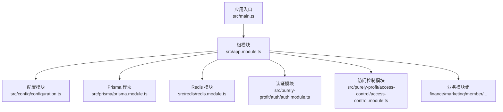
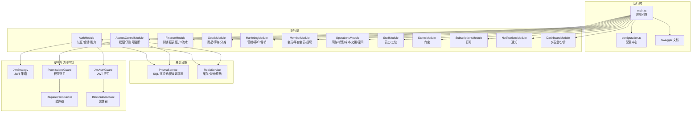
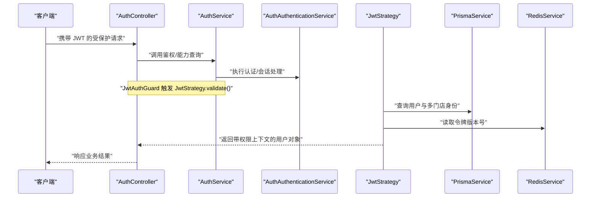
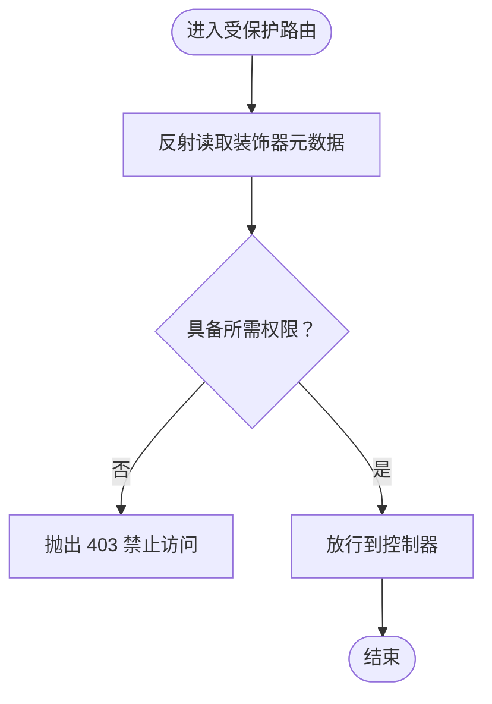
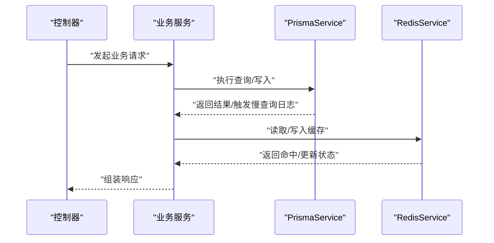
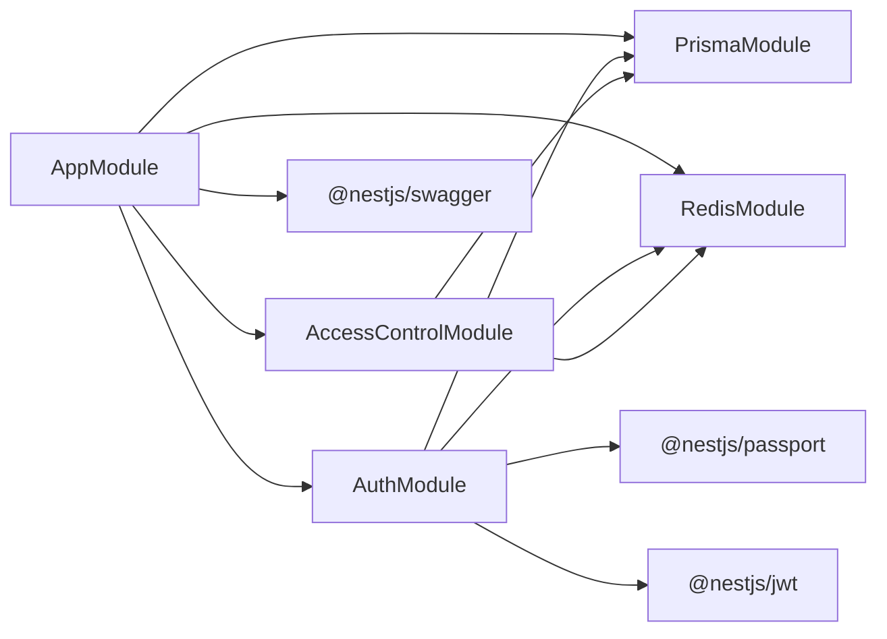
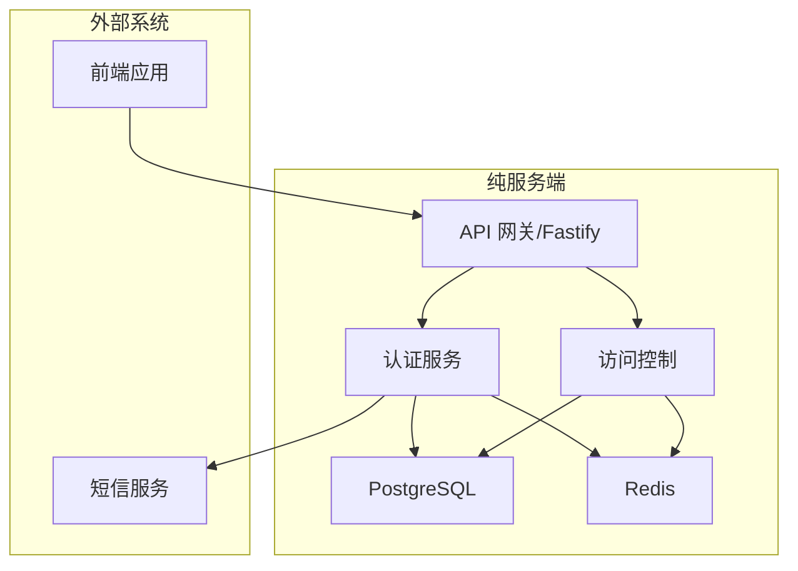

# 架构设计

<cite>
**本文引用的文件**
- [package.json](file://package.json)
- [README.md](file://README.md)
- [src/main.ts](file://src/main.ts)
- [src/app.module.ts](file://src/app.module.ts)
- [src/config/configuration.ts](file://src/config/configuration.ts)
- [src/prisma/prisma.module.ts](file://src/prisma/prisma.module.ts)
- [src/prisma/prisma.service.ts](file://src/prisma/prisma.service.ts)
- [src/redis/redis.module.ts](file://src/redis/redis.module.ts)
- [src/purely-profit/auth/auth.module.ts](file://src/purely-profit/auth/auth.module.ts)
- [src/purely-profit/auth/strategies/jwt.strategy.ts](file://src/purely-profit/auth/strategies/jwt.strategy.ts)
- [src/purely-profit/auth/guards/jwt-auth.guard.ts](file://src/purely-profit/auth/guards/jwt-auth.guard.ts)
- [src/purely-profit/auth/auth.service.ts](file://src/purely-profit/auth/auth.service.ts)
- [src/purely-profit/auth/auth.controller.ts](file://src/purely-profit/auth/auth.controller.ts)
- [src/purely-profit/access-control/access-control.module.ts](file://src/purely-profit/access-control/access-control.module.ts)
- [src/purely-profit/access-control/decorators/require-permissions.decorator.ts](file://src/purely-profit/access-control/decorators/require-permissions.decorator.ts)
- [src/purely-profit/access-control/decorators/block-sub-account.decorator.ts](file://src/purely-profit/access-control/decorators/block-sub-account.decorator.ts)
- [src/purely-profit/access-control/guards/permissions.guard.ts](file://src/purely-profit/access-control/guards/permissions.guard.ts)
- [src/purely-profit/access-control/guards/sub-account-block.guard.ts](file://src/purely-profit/access-control/guards/sub-account-block.guard.ts)
- [src/observability/index.ts](file://src/observability/index.ts)
- [src/observability/metrics-snapshot.protocol.ts](file://src/observability/metrics-snapshot.protocol.ts)
- [src/observability/observability.protocol.ts](file://src/observability/observability.protocol.ts)
</cite>

## 目录
1. [引言](#引言)
2. [项目结构](#项目结构)
3. [核心组件](#核心组件)
4. [架构总览](#架构总览)
5. [详细组件分析](#详细组件分析)
6. [依赖关系分析](#依赖关系分析)
7. [性能考量](#性能考量)
8. [故障排查指南](#故障排查指南)
9. [结论](#结论)
10. [附录](#附录)

## 引言
本架构设计文档面向 purelyprofit-server，目标是提供高层设计、架构模式与系统边界说明；阐述模块化设计原则、依赖注入机制、装饰器模式的应用、以及策略模式在认证中的使用；解释组件交互、数据流与集成模式；并给出安全、可观测性与灾难恢复等横切关注点的技术决策、权衡与约束。文档同时记录技术栈、第三方依赖与版本兼容性。

## 项目结构
purelyprofit-server 基于 NestJS 框架，采用模块化分层组织，核心入口位于应用根模块，通过配置模块集中管理环境变量与运行参数，数据库与缓存通过全局模块提供，业务域按功能拆分为多个领域模块（如 auth、access-control、finance、goods、marketing、member、operations、staff、stores、subscriptions、notifications、dashboard 等），并辅以 purely-pulse 子域支持会员与增长相关能力。

- 应用入口与引导
  - 入口文件负责创建 Nest 应用实例、设置全局管道、跨域、Swagger 文档、端口回退监听等。
  - 根模块聚合所有业务模块与基础设施模块，形成统一的依赖注入容器。

- 配置与环境
  - 配置模块加载自定义配置函数，统一解析环境变量，提供应用、数据库、Redis、JWT、鉴权等配置项。

- 数据与缓存
  - Prisma 作为 ORM，基于连接池适配 PostgreSQL；提供慢查询日志与可观测埋点。
  - Redis 提供缓存、失效与预热能力，并作为会话令牌版本号存储介质。

- 安全与访问控制
  - JWT 认证结合 Passport 策略，配合权限守卫与装饰器实现细粒度访问控制。
  - 子账号访问阻断装饰器与守卫，确保敏感接口仅主账号可访问。

**图表来源**
- [src/main.ts:121-204](file://src/main.ts#L121-L204)
- [src/app.module.ts:39-82](file://src/app.module.ts#L39-L82)
- [src/config/configuration.ts:8-138](file://src/config/configuration.ts#L8-L138)

**章节来源**
- [src/main.ts:121-204](file://src/main.ts#L121-L204)
- [src/app.module.ts:39-82](file://src/app.module.ts#L39-L82)
- [src/config/configuration.ts:8-138](file://src/config/configuration.ts#L8-L138)

## 核心组件
- 应用引导与基础设施
  - Fastify 适配器、全局验证管道、CORS、Swagger、端口回退监听、HTTP 请求观测。
- 配置中心
  - 统一读取环境变量，提供应用、数据库、Redis、JWT、鉴权、脉冲开发模式等配置。
- 数据访问层
  - Prisma 客户端封装，连接池配置，慢查询观测与告警。
- 缓存与预热
  - Redis 服务、缓存失效器、缓存预热执行器与配置。
- 认证与授权
  - JWT 策略、认证服务、权限守卫、装饰器（RequirePermissions、BlockSubAccount）。
- 观测与健康
  - HTTP 请求、SQL 查询、Redis 调用的观测埋点与快照协议。

**章节来源**
- [src/main.ts:16-204](file://src/main.ts#L16-L204)
- [src/config/configuration.ts:8-138](file://src/config/configuration.ts#L8-L138)
- [src/prisma/prisma.service.ts:8-64](file://src/prisma/prisma.service.ts#L8-L64)
- [src/redis/redis.module.ts:1-16](file://src/redis/redis.module.ts#L1-L16)
- [src/purely-profit/auth/auth.module.ts:21-55](file://src/purely-profit/auth/auth.module.ts#L21-L55)
- [src/purely-profit/access-control/access-control.module.ts:1-23](file://src/purely-profit/access-control/access-control.module.ts#L1-L23)
- [src/observability/index.ts:1-3](file://src/observability/index.ts#L1-L3)

## 架构总览
系统采用“模块化 + 分层 + 依赖注入”的架构风格，围绕以下关键模式组织：

- 模块化设计
  - 业务域模块独立封装控制器、服务、DTO、查询与映射，根模块统一装配。
- 依赖注入
  - 通过 @Injectable、@Module、forwardRef、useFactory 等机制实现解耦与可测试性。
- 装饰器模式
  - 使用 SetMetadata 与自定义装饰器传递元数据（如 RequirePermissions、BlockSubAccount），由守卫读取并执行策略。
- 策略模式在认证中的应用
  - Passport Strategy 将 JWT 解析与用户上下文构建策略化，便于扩展与替换。
- 观测与治理
  - 统一的观测埋点与快照协议，支持 HTTP、SQL、Redis 的性能与健康监控。

**图表来源**
- [src/main.ts:121-204](file://src/main.ts#L121-L204)
- [src/config/configuration.ts:8-138](file://src/config/configuration.ts#L8-L138)
- [src/prisma/prisma.service.ts:8-64](file://src/prisma/prisma.service.ts#L8-L64)
- [src/redis/redis.module.ts:1-16](file://src/redis/redis.module.ts#L1-L16)
- [src/purely-profit/auth/auth.module.ts:21-55](file://src/purely-profit/auth/auth.module.ts#L21-L55)
- [src/purely-profit/access-control/access-control.module.ts:1-23](file://src/purely-profit/access-control/access-control.module.ts#L1-L23)

## 详细组件分析

### 认证与授权模块（AuthModule）
- 设计要点
  - 使用 Passport + JWT 实现无状态认证；JwtModule 注册异步工厂从配置中心读取密钥与过期时间。
  - JwtStrategy 负责从请求中提取 JWT 并校验，随后查询用户关联的多门店身份与子账号状态，构建当前会话的权限上下文。
  - JwtAuthGuard 作为全局守卫，配合 RequirePermissions 装饰器与 PermissionsGuard 实现细粒度权限控制。
  - BlockSubAccount 装饰器与 SubAccountBlockGuard 保障仅主账号可访问的接口安全。
- 关键流程（登录态校验与权限构建）

**图表来源**
- [src/purely-profit/auth/auth.controller.ts:1-26](file://src/purely-profit/auth/auth.controller.ts#L1-L26)
- [src/purely-profit/auth/auth.service.ts:29-75](file://src/purely-profit/auth/auth.service.ts#L29-L75)
- [src/purely-profit/auth/strategies/jwt.strategy.ts:58-151](file://src/purely-profit/auth/strategies/jwt.strategy.ts#L58-L151)
- [src/purely-profit/auth/guards/jwt-auth.guard.ts:1-5](file://src/purely-profit/auth/guards/jwt-auth.guard.ts#L1-L5)
- [src/purely-profit/access-control/guards/permissions.guard.ts:12-55](file://src/purely-profit/access-control/guards/permissions.guard.ts#L12-L55)

**章节来源**
- [src/purely-profit/auth/auth.module.ts:21-55](file://src/purely-profit/auth/auth.module.ts#L21-L55)
- [src/purely-profit/auth/strategies/jwt.strategy.ts:58-284](file://src/purely-profit/auth/strategies/jwt.strategy.ts#L58-L284)
- [src/purely-profit/auth/guards/jwt-auth.guard.ts:1-5](file://src/purely-profit/auth/guards/jwt-auth.guard.ts#L1-L5)
- [src/purely-profit/access-control/decorators/require-permissions.decorator.ts:1-7](file://src/purely-profit/access-control/decorators/require-permissions.decorator.ts#L1-L7)
- [src/purely-profit/access-control/decorators/block-sub-account.decorator.ts:1-17](file://src/purely-profit/access-control/decorators/block-sub-account.decorator.ts#L1-L17)
- [src/purely-profit/access-control/guards/permissions.guard.ts:12-55](file://src/purely-profit/access-control/guards/permissions.guard.ts#L12-L55)

### 访问控制与装饰器模式
- 装饰器
  - RequirePermissions：在控制器或方法上声明所需权限集合，由 PermissionsGuard 读取并判定。
  - BlockSubAccount：标记接口禁止子账号访问，结合 SubAccountBlockGuard 执行拦截。
- 守卫
  - PermissionsGuard：读取装饰器元数据，比对当前用户的权限集合，缺失则抛出 403。
  - SubAccountBlockGuard：根据用户当前会话是否为子账号进行拦截。
- 服务
  - AccessControlService：提供权限集合判断与会话上下文构建。
- 流程示意

**图表来源**
- [src/purely-profit/access-control/decorators/require-permissions.decorator.ts:1-7](file://src/purely-profit/access-control/decorators/require-permissions.decorator.ts#L1-L7)
- [src/purely-profit/access-control/guards/permissions.guard.ts:12-55](file://src/purely-profit/access-control/guards/permissions.guard.ts#L12-L55)
- [src/purely-profit/access-control/decorators/block-sub-account.decorator.ts:1-17](file://src/purely-profit/access-control/decorators/block-sub-account.decorator.ts#L1-L17)
- [src/purely-profit/access-control/guards/sub-account-block.guard.ts](file://src/purely-profit/access-control/guards/sub-account-block.guard.ts)

**章节来源**
- [src/purely-profit/access-control/access-control.module.ts:1-23](file://src/purely-profit/access-control/access-control.module.ts#L1-L23)
- [src/purely-profit/access-control/guards/permissions.guard.ts:12-55](file://src/purely-profit/access-control/guards/permissions.guard.ts#L12-L55)

### 数据访问与缓存（Prisma 与 Redis）
- Prisma
  - 通过连接池适配 PostgreSQL，开启 query 事件监听，统一记录慢查询并输出阈值告警。
  - 在模块初始化与销毁阶段分别建立与断开连接，保证生命周期可控。
- Redis
  - 作为通用缓存与令牌版本号存储；提供缓存失效器与缓存预热执行器，支持批量预热与并发控制。
- 交互示意

**图表来源**
- [src/prisma/prisma.service.ts:8-64](file://src/prisma/prisma.service.ts#L8-L64)
- [src/redis/redis.module.ts:1-16](file://src/redis/redis.module.ts#L1-L16)

**章节来源**
- [src/prisma/prisma.module.ts:1-9](file://src/prisma/prisma.module.ts#L1-L9)
- [src/prisma/prisma.service.ts:8-64](file://src/prisma/prisma.service.ts#L8-L64)
- [src/redis/redis.module.ts:1-16](file://src/redis/redis.module.ts#L1-L16)

### 观测与健康（HTTP/SQL/Redis）
- 观测埋点
  - HTTP 层：在 onRequest/onResponse 钩子记录请求耗时、路径、状态码、请求 ID，并支持慢请求日志。
  - SQL 层：Prisma query 事件记录慢查询，支持阈值告警与查询片段截断。
  - Redis 层：通过统一观测接口记录调用次数与耗时（由具体服务实现）。
- 快照协议
  - 定义 HTTP、SQL、进程与健康计数器的快照结构，便于聚合与上报。

**章节来源**
- [src/main.ts:32-75](file://src/main.ts#L32-L75)
- [src/prisma/prisma.service.ts:37-53](file://src/prisma/prisma.service.ts#L37-L53)
- [src/observability/metrics-snapshot.protocol.ts:1-55](file://src/observability/metrics-snapshot.protocol.ts#L1-L55)
- [src/observability/observability.protocol.ts:1-26](file://src/observability/observability.protocol.ts#L1-L26)

## 依赖关系分析
- 模块耦合
  - 根模块对各业务模块存在单向依赖；认证与访问控制模块被广泛复用。
  - Prisma 与 Redis 作为全局模块被多数业务模块依赖，形成横向基础设施依赖。
- 外部依赖
  - NestJS 生态（Common/Config/JWT/Passport/Swagger/Platform-Fastify）。
  - Prisma 与 PostgreSQL、ioredis、pg。
- 循环依赖
  - 通过 forwardRef 支持模块间循环引用（例如认证模块对平台会员模块的反向引用）。

**图表来源**
- [src/app.module.ts:39-82](file://src/app.module.ts#L39-L82)
- [src/purely-profit/auth/auth.module.ts:21-55](file://src/purely-profit/auth/auth.module.ts#L21-L55)
- [src/prisma/prisma.module.ts:1-9](file://src/prisma/prisma.module.ts#L1-L9)
- [src/redis/redis.module.ts:1-16](file://src/redis/redis.module.ts#L1-L16)

**章节来源**
- [src/app.module.ts:39-82](file://src/app.module.ts#L39-L82)
- [src/purely-profit/auth/auth.module.ts:21-55](file://src/purely-profit/auth/auth.module.ts#L21-L55)

## 性能考量
- HTTP 层
  - Fastify 适配器与钩子实现低开销观测；可通过配置调整 keepAlive、请求超时与请求体大小。
- 数据库层
  - 连接池参数（最大连接数、空闲超时、连接超时）影响吞吐与延迟；慢查询阈值与告警有助于定位热点。
- 缓存层
  - 预热配置（间隔、初始延迟、批次大小、并发度）需结合业务峰值与资源限制调优。
- 认证与授权
  - JWT 策略一次性拉取多门店身份与子账号状态，建议在 Redis 中维护令牌版本号以快速失效。

[本节为通用性能指导，无需特定文件引用]

## 故障排查指南
- 启动与端口
  - 若默认端口被占用，启用端口自动偏移；若持续失败，检查端口范围与权限。
- 认证失败
  - 用户不存在、令牌版本过旧、被封禁、子账号访问被阻断等均会触发 401/403。
- 慢请求/慢查询
  - 开启慢请求与慢查询日志，结合观测快照定位瓶颈。
- 缓存预热
  - 检查预热开关、采样频率与慢周期阈值，避免预热风暴影响线上性能。

**章节来源**
- [src/main.ts:77-119](file://src/main.ts#L77-L119)
- [src/purely-profit/auth/strategies/jwt.strategy.ts:92-101](file://src/purely-profit/auth/strategies/jwt.strategy.ts#L92-L101)
- [src/purely-profit/access-control/guards/sub-account-block.guard.ts](file://src/purely-profit/access-control/guards/sub-account-block.guard.ts)
- [src/prisma/prisma.service.ts:44-52](file://src/prisma/prisma.service.ts#L44-L52)

## 结论
purelyprofit-server 采用模块化与依赖注入为核心的设计，结合装饰器与策略模式实现灵活的安全与访问控制；通过 Prisma 与 Redis 提供稳定的数据与缓存能力；借助统一的观测埋点与快照协议实现可观测性闭环。整体架构清晰、边界明确、易于扩展与演进。

[本节为总结性内容，无需特定文件引用]

## 附录

### 技术栈与版本兼容性
- 运行时与框架
  - Node.js、NestJS v11、Fastify 适配器
- 数据库与 ORM
  - Prisma Client v7.8、PostgreSQL、pg v8
- 缓存
  - ioredis v5、Redis
- 安全与认证
  - @nestjs/jwt、passport-jwt、bcryptjs
- 工具链
  - class-transformer、class-validator、reflect-metadata、rxjs
- 开发与测试
  - Jest、ESLint、Prettier、Supertest、ts-jest、ts-node

**章节来源**
- [package.json:31-58](file://package.json#L31-L58)
- [package.json:59-86](file://package.json#L59-L86)

### 系统上下文图

[本图为概念性上下文图，不直接映射具体源文件，故不提供图表来源]