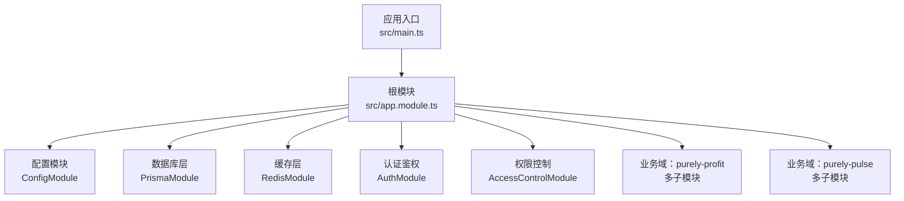
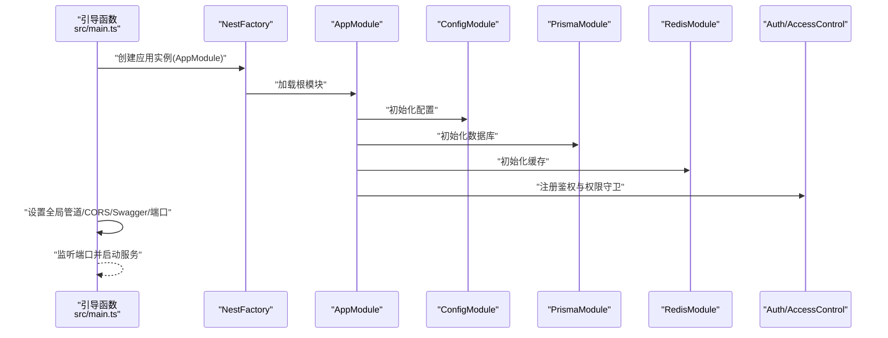
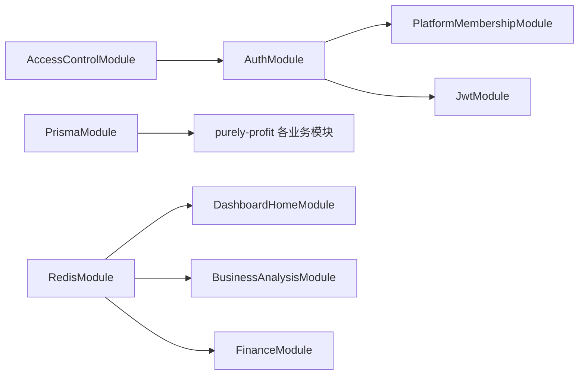
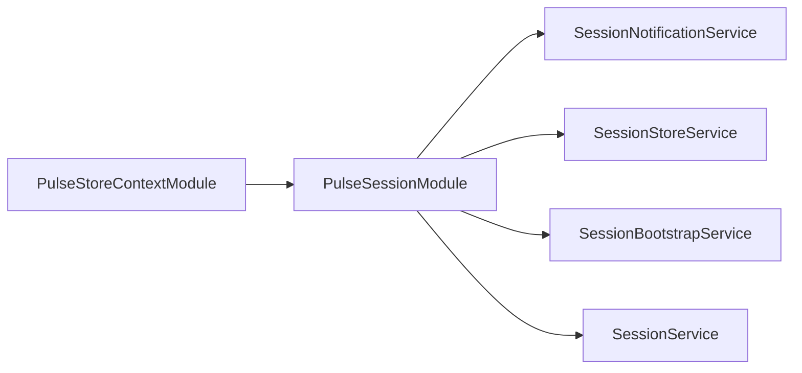
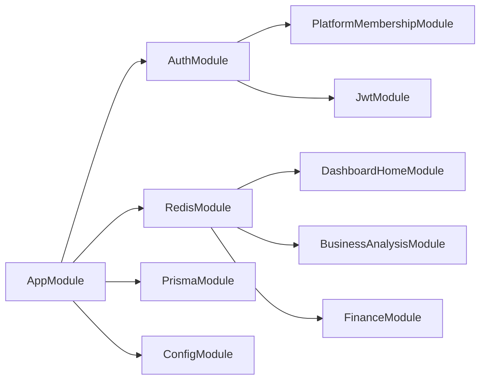

# 模块化设计

<cite>
**本文引用的文件**
- [src/app.module.ts](file://src/app.module.ts)
- [src/main.ts](file://src/main.ts)
- [package.json](file://package.json)
- [nest-cli.json](file://nest-cli.json)
- [src/purely-profit/access-control/access-control.module.ts](file://src/purely-profit/access-control/access-control.module.ts)
- [src/purely-profit/auth/auth.module.ts](file://src/purely-profit/auth/auth.module.ts)
- [src/purely-pulse/session/session.module.ts](file://src/purely-pulse/session/session.module.ts)
- [src/prisma/prisma.module.ts](file://src/prisma/prisma.module.ts)
- [src/redis/redis.module.ts](file://src/redis/redis.module.ts)
</cite>

## 目录
1. [引言](#引言)
2. [项目结构](#项目结构)
3. [核心组件](#核心组件)
4. [架构总览](#架构总览)
5. [详细组件分析](#详细组件分析)
6. [依赖分析](#依赖分析)
7. [性能考虑](#性能考虑)
8. [故障排查指南](#故障排查指南)
9. [结论](#结论)
10. [附录](#附录)

## 引言
本设计文档聚焦于 purelyprofit-server 的 NestJS 模块化架构，系统阐述模块的职责分离、模块间依赖关系与生命周期管理；解析两大业务域 purely-profit 与 purely-pulse 的组织方式；总结模块导入导出机制、共享服务使用与最佳实践；给出模块依赖图与交互示例，指导如何创建新业务模块；并覆盖模块测试策略与模块间通信模式。

## 项目结构
purelyprofit-server 采用以“领域/子系统”为中心的模块化组织方式，根模块集中编排所有业务模块与基础设施模块。项目通过 CLI 配置指定源码目录，构建时清理输出目录，确保构建一致性。

图表来源
- [src/app.module.ts:39-78](file://src/app.module.ts#L39-L78)
- [src/main.ts:136-144](file://src/main.ts#L136-L144)

章节来源
- [src/app.module.ts:1-83](file://src/app.module.ts#L1-L83)
- [src/main.ts:121-204](file://src/main.ts#L121-L204)
- [nest-cli.json:1-9](file://nest-cli.json#L1-L9)

## 核心组件
- 根模块（AppModule）：集中导入与装配所有业务模块与基础设施模块，统一暴露控制器与服务。
- 基础设施模块：
  - 配置模块（ConfigModule）：全局加载配置，支持环境变量与自定义配置函数。
  - 数据库模块（PrismaModule）：全局提供 PrismaService，贯穿各业务模块。
  - 缓存模块（RedisModule）：全局提供 RedisService 及缓存预热/失效工具，跨多个报表与分析模块复用。
- 安全与鉴权：
  - 认证模块（AuthModule）：基于 Passport/JWT 的登录、会话、能力查询等能力，向其他模块提供守卫与策略。
  - 权限控制模块（AccessControlModule）：全局提供权限守卫与主体能力服务，统一接入认证模块能力。

章节来源
- [src/app.module.ts:40-78](file://src/app.module.ts#L40-L78)
- [src/purely-profit/access-control/access-control.module.ts:7-22](file://src/purely-profit/access-control/access-control.module.ts#L7-L22)
- [src/purely-profit/auth/auth.module.ts:21-54](file://src/purely-profit/auth/auth.module.ts#L21-L54)
- [src/prisma/prisma.module.ts:4-9](file://src/prisma/prisma.module.ts#L4-L9)
- [src/redis/redis.module.ts:9-15](file://src/redis/redis.module.ts#L9-L15)

## 架构总览
下图展示根模块对业务域与基础设施模块的编排关系，以及 purely-pulse 与 purely-profit 的分域边界。

```mermaid
graph TB
subgraph "根模块"
Root["AppModule"]
end
subgraph "基础设施"
CFG["ConfigModule"]
PRISMA["PrismaModule"]
REDIS["RedisModule"]
end
subgraph "purely-profit 业务域"
PF_AUTH["AuthModule"]
PF_AC["AccessControlModule"]
PF_FIN["FinanceModule"]
PF_MARK["MarketingModule"]
PF_GOODS["Goods Modules"]
PF_OPER["Operations Modules"]
PF_DASH["Dashboard Modules"]
PF_MEMB["Member Modules"]
PF_STAFF["Staff Modules"]
PF_STORES["StoresModule"]
PF_SUBS["SubscriptionsModule"]
PF_NOTI["NotificationsModule"]
end
subgraph "purely-pulse 业务域"
PP_SESS["PulseSessionModule"]
PP_ONB["PulseOnboardingModule"]
PP_MEMB["PulseMembershipModule"]
PP_MEMB_SET["PulseMembershipSettingsModule"]
PP_DASH["PulseDashboardModule"]
PP_GROWTH["PulseGrowthModule"]
end
Root --> CFG
Root --> PRISMA
Root --> REDIS
Root --> PF_AUTH
Root --> PF_AC
Root --> PF_FIN
Root --> PF_MARK
Root --> PF_GOODS
Root --> PF_OPER
Root --> PF_DASH
Root --> PF_MEMB
Root --> PF_STAFF
Root --> PF_STORES
Root --> PF_SUBS
Root --> PF_NOTI
Root --> PP_SESS
Root --> PP_ONB
Root --> PP_MEMB
Root --> PP_MEMB_SET
Root --> PP_DASH
Root --> PP_GROWTH
```

图表来源
- [src/app.module.ts:39-78](file://src/app.module.ts#L39-L78)
- [src/purely-pulse/session/session.module.ts:9-19](file://src/purely-pulse/session/session.module.ts#L9-L19)

## 详细组件分析

### AppModule：根模块与生命周期
- 职责：集中导入配置、数据库、缓存、安全与全部业务模块；注册全局管道、CORS、Swagger、端口回退监听等。
- 生命周期：
  - 启动阶段：NestFactory 创建应用实例，注入 ConfigService，设置全局前缀、CORS、全局验证管道、可观测性钩子。
  - 运行阶段：按模块声明顺序完成依赖注入与服务初始化；模块内部的 @Global 提供的服务在整个应用范围内可用。
  - 关闭阶段：由框架负责资源释放（如连接池、定时任务等）。

图表来源
- [src/main.ts:121-204](file://src/main.ts#L121-L204)
- [src/app.module.ts:39-78](file://src/app.module.ts#L39-L78)

章节来源
- [src/app.module.ts:39-82](file://src/app.module.ts#L39-L82)
- [src/main.ts:121-204](file://src/main.ts#L121-L204)

### purely-profit 业务域：模块化组织思路
- 设计原则：
  - 功能内聚：财务、商品、营销、运营、会员、员工、门店、订阅、通知等按功能域拆分为独立模块。
  - 低耦合：跨域协作通过共享服务与 DTO 协议进行解耦；避免循环依赖。
  - 可测试性：每个模块包含对应的 domain/service/controller/mapper/query/types，便于单元测试与集成测试。
- 典型模块：
  - 认证与鉴权：AuthModule 依赖 PlatformMembershipModule 并通过 JwtModule 注册策略与守卫。
  - 权限控制：AccessControlModule 全局导出守卫与能力服务，供 AuthModule 与业务模块共同使用。
  - 数据访问：PrismaModule 全局提供 PrismaService，业务模块通过各自 service 使用。
  - 缓存与预热：RedisModule 全局提供 RedisService、缓存失效与预热服务，被 DashboardHomeModule、BusinessAnalysisModule、FinanceModule 等消费。

图表来源
- [src/purely-profit/access-control/access-control.module.ts:7-22](file://src/purely-profit/access-control/access-control.module.ts#L7-L22)
- [src/purely-profit/auth/auth.module.ts:21-54](file://src/purely-profit/auth/auth.module.ts#L21-L54)
- [src/prisma/prisma.module.ts:4-9](file://src/prisma/prisma.module.ts#L4-L9)
- [src/redis/redis.module.ts:9-15](file://src/redis/redis.module.ts#L9-L15)

章节来源
- [src/purely-profit/access-control/access-control.module.ts:1-23](file://src/purely-profit/access-control/access-control.module.ts#L1-L23)
- [src/purely-profit/auth/auth.module.ts:1-56](file://src/purely-profit/auth/auth.module.ts#L1-L56)
- [src/prisma/prisma.module.ts:1-10](file://src/prisma/prisma.module.ts#L1-L10)
- [src/redis/redis.module.ts:1-16](file://src/redis/redis.module.ts#L1-L16)

### purely-pulse 业务域：模块化组织思路
- 设计原则：
  - 以“会话上下文”为核心：PulseSessionModule 依赖 PulseStoreContextModule，围绕门店上下文进行会话、通知、存储等能力编排。
  - 分层清晰：Onboarding、Membership、MembershipSettings、Dashboard、Growth 等模块分别承担不同阶段与维度的能力。
- 典型模块：
  - 会话模块（PulseSessionModule）：提供会话服务、引导服务、通知服务与存储服务，作为 purely-pulse 的入口能力之一。

图表来源
- [src/purely-pulse/session/session.module.ts:9-19](file://src/purely-pulse/session/session.module.ts#L9-L19)

章节来源
- [src/purely-pulse/session/session.module.ts:1-21](file://src/purely-pulse/session/session.module.ts#L1-L21)

### 模块导入导出机制与共享服务
- 导入导出：
  - 根模块集中导入所有业务模块，形成统一的应用装配入口。
  - 基础设施模块（Config、Prisma、Redis）通过 @Global() 全局注册，无需在业务模块中重复导入即可使用。
  - 业务模块之间通过 exports 暴露服务或守卫，供其他模块按需引入。
- 共享服务：
  - 认证与权限：AuthModule 与 AccessControlModule 提供 JwtAuthGuard、PermissionsGuard、SubjectCapabilityService 等，跨模块复用。
  - 数据访问：PrismaService 由 PrismaModule 全局提供，业务模块通过各自 service 使用。
  - 缓存：RedisModule 提供 RedisService、CacheInvalidatorService、CachePrewarmService，被多个报表与分析模块消费。

章节来源
- [src/app.module.ts:40-78](file://src/app.module.ts#L40-L78)
- [src/purely-profit/access-control/access-control.module.ts:15-20](file://src/purely-profit/access-control/access-control.module.ts#L15-L20)
- [src/purely-profit/auth/auth.module.ts:53-53](file://src/purely-profit/auth/auth.module.ts#L53-L53)
- [src/prisma/prisma.module.ts:6-8](file://src/prisma/prisma.module.ts#L6-L8)
- [src/redis/redis.module.ts:11-13](file://src/redis/redis.module.ts#L11-L13)

### 模块生命周期管理
- 模块加载顺序：根模块 -> 基础设施模块（Config/Prisma/Redis）-> 安全模块（Auth/AccessControl）-> 业务模块。
- 服务初始化：各模块 providers 在应用启动时完成依赖注入与初始化；@Global 模块的服务在整个应用范围内可用。
- 销毁与释放：由 NestJS 框架在关闭时统一处理（如连接池、定时器等），业务模块无需手动实现。

章节来源
- [src/app.module.ts:39-78](file://src/app.module.ts#L39-L78)
- [src/main.ts:121-204](file://src/main.ts#L121-L204)

### 创建新业务模块的步骤与最佳实践
- 步骤：
  1. 在对应业务域目录下创建模块目录与标准文件结构（controller/service/domain/mapper/query/types）。
  2. 新建模块文件并声明 imports/providers/controllers/exports。
  3. 如需全局能力，可参考 AccessControlModule/PrismaModule/RedisModule 的 @Global() 模式。
  4. 在根模块 app.module.ts 中导入该模块。
  5. 如需与其他模块协作，通过 exports 暴露必要服务或守卫，并在目标模块 imports 中引入。
- 最佳实践：
  - 保持模块职责单一，避免跨模块直接耦合。
  - 使用 DTO 与 Mapper 明确数据契约，降低耦合度。
  - 对外仅导出必要的服务与守卫，遵循最小暴露原则。
  - 将通用能力下沉到基础设施模块，避免重复实现。

章节来源
- [src/app.module.ts:39-78](file://src/app.module.ts#L39-L78)
- [src/purely-profit/access-control/access-control.module.ts:7-22](file://src/purely-profit/access-control/access-control.module.ts#L7-L22)
- [src/prisma/prisma.module.ts:4-9](file://src/prisma/prisma.module.ts#L4-L9)
- [src/redis/redis.module.ts:9-15](file://src/redis/redis.module.ts#L9-L15)

### 模块测试策略
- 单元测试：针对模块内的 service/domain 进行隔离测试，使用 @nestjs/testing 构建测试模块，按需替换 provider。
- 集成测试：通过 TestModule 加载目标模块及其依赖，验证控制器与服务交互。
- 端到端测试：使用 Jest 配置与 supertest，覆盖真实请求流程。
- 测试运行脚本：项目已配置测试脚本与 Jest 配置，可在本地快速执行测试。

章节来源
- [package.json:25-29](file://package.json#L25-L29)
- [package.json:87-103](file://package.json#L87-L103)

### 模块间通信模式
- 控制器到服务：控制器通过依赖注入获取服务实例，调用业务方法并返回响应。
- 服务到服务：模块内服务通过依赖注入相互协作；跨模块通过 exports 暴露的服务进行通信。
- 守卫与拦截器：权限守卫（如 PermissionsGuard、JwtAuthGuard）在路由层拦截请求，校验用户身份与权限。
- 事件与缓存：通过 RedisModule 提供的缓存失效与预热服务，实现模块间状态同步与性能优化。

章节来源
- [src/purely-profit/access-control/access-control.module.ts:15-20](file://src/purely-profit/access-control/access-control.module.ts#L15-L20)
- [src/purely-profit/auth/auth.module.ts:53-53](file://src/purely-profit/auth/auth.module.ts#L53-L53)
- [src/redis/redis.module.ts:11-13](file://src/redis/redis.module.ts#L11-L13)

## 依赖分析
- 内部依赖：
  - AuthModule 依赖 PlatformMembershipModule（forwardRef），并通过 JwtModule 注册策略与守卫。
  - RedisModule 导入 DashboardHomeModule、BusinessAnalysisModule、FinanceModule，体现缓存能力在多个分析模块中的复用。
- 外部依赖：
  - Fastify 适配器用于高性能 HTTP 处理。
  - Swagger 用于生成 API 文档。
  - Prisma 与 PostgreSQL 用于数据持久化。
  - ioredis 用于 Redis 连接与缓存操作。

图表来源
- [src/purely-profit/auth/auth.module.ts:24-35](file://src/purely-profit/auth/auth.module.ts#L24-L35)
- [src/redis/redis.module.ts:11-13](file://src/redis/redis.module.ts#L11-L13)
- [src/app.module.ts:40-78](file://src/app.module.ts#L40-L78)

章节来源
- [src/purely-profit/auth/auth.module.ts:21-54](file://src/purely-profit/auth/auth.module.ts#L21-L54)
- [src/redis/redis.module.ts:9-15](file://src/redis/redis.module.ts#L9-L15)
- [src/app.module.ts:40-78](file://src/app.module.ts#L40-L78)

## 性能考虑
- 启动与监听：
  - 支持端口回退策略，避免端口冲突导致启动失败。
  - Fastify 适配器与合理的超时配置提升请求处理性能。
- 观测性：
  - 自定义 HTTP 请求观测钩子记录慢请求，便于定位性能瓶颈。
- 缓存：
  - RedisModule 提供缓存预热与失效工具，建议在热点查询与报表场景中合理使用，减少数据库压力。

章节来源
- [src/main.ts:87-119](file://src/main.ts#L87-L119)
- [src/main.ts:32-75](file://src/main.ts#L32-L75)
- [src/redis/redis.module.ts:11-13](file://src/redis/redis.module.ts#L11-L13)

## 故障排查指南
- 端口占用：
  - 若默认端口被占用，系统将自动尝试下一个端口；可通过配置项调整回退范围。
- CORS 问题：
  - 检查配置项 app.corsOrigin，确认允许的来源列表或通配符设置。
- Swagger 文档：
  - 在非生产环境默认启用；若禁用，可通过配置项关闭。
- 模块未生效：
  - 确认模块已在根模块导入；若为全局模块，确认 @Global() 与 exports 是否正确配置。

章节来源
- [src/main.ts:160-199](file://src/main.ts#L160-L199)
- [src/app.module.ts:39-78](file://src/app.module.ts#L39-L78)

## 结论
purelyprofit-server 采用以根模块为中心的模块化架构，结合 purely-profit 与 purely-pulse 两大业务域，实现了高内聚、低耦合与强可测试性的系统设计。通过全局基础设施模块与共享服务，统一了认证、权限、数据与缓存能力；通过严格的导入导出与依赖管理，保障了模块间的稳定协作。遵循本文的最佳实践与测试策略，可高效扩展新业务模块并维持系统的长期演进能力。

## 附录
- CLI 与构建配置：nest-cli.json 指定源码目录与构建行为；package.json 提供测试与脚本命令。
- Swagger 文档：在开发与测试环境默认启用，便于接口调试与联调。

章节来源
- [nest-cli.json:1-9](file://nest-cli.json#L1-L9)
- [package.json:8-30](file://package.json#L8-L30)
- [package.json:87-103](file://package.json#L87-L103)