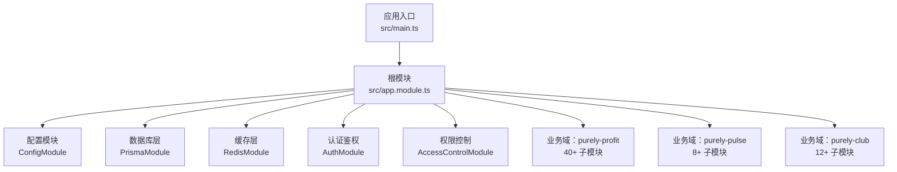
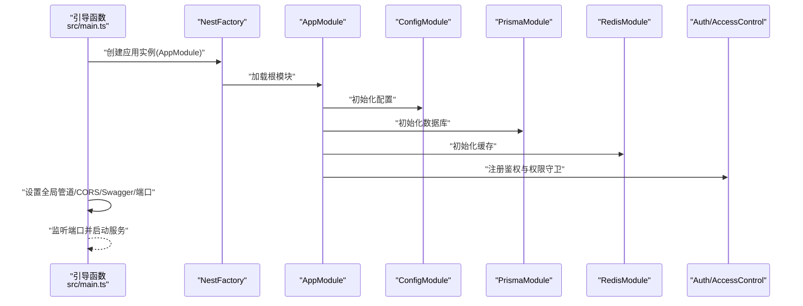
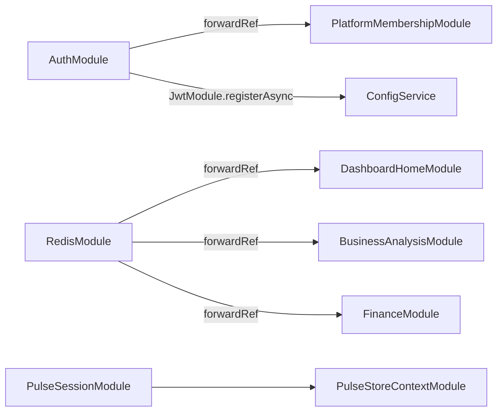

# 模块化设计

<cite>
**本文引用的文件**
- [src/app.module.ts](file://src/app.module.ts)
- [src/main.ts](file://src/main.ts)
- [src/purely-profit/access-control/access-control.module.ts](file://src/purely-profit/access-control/access-control.module.ts)
- [src/purely-profit/auth/auth.module.ts](file://src/purely-profit/auth/auth.module.ts)
- [src/purely-pulse/session/session.module.ts](file://src/purely-pulse/session/session.module.ts)
- [src/prisma/prisma.module.ts](file://src/prisma/prisma.module.ts)
- [src/redis/redis.module.ts](file://src/redis/redis.module.ts)
</cite>

## 目录
1. [引言](#引言)
2. [项目结构](#项目结构)
3. [核心组件](#核心组件)
4. [架构总览](#架构总览)
5. [详细组件分析](#详细组件分析)
6. [服务分解与依赖注入实践](#服务分解与依赖注入实践)
7. [模块间通信与协作模式](#模块间通信与协作模式)
8. [模块生命周期管理](#模块生命周期管理)
9. [业务域组织策略](#业务域组织策略)
10. [模块测试策略](#模块测试策略)
11. [性能优化与最佳实践](#性能优化与最佳实践)
12. [故障排查指南](#故障排查指南)
13. [结论](#结论)
14. [附录](#附录)

## 引言
本设计文档深入阐述 purelyprofit-server 基于 NestJS 的模块化架构设计与实施，重点分析服务分解原则、依赖注入配置、业务逻辑实现等模块化开发最佳实践。文档详细说明模块的职责分离、模块间的依赖关系、模块的生命周期管理，解析两大业务域 purely-profit 与 purely-pulse 的组织方式，涵盖模块的导入导出机制、共享服务的使用、模块配置的最佳实践，并提供模块依赖图和模块交互示例，指导如何创建新的业务模块。

## 项目结构
purelyprofit-server 采用以"领域/子系统"为中心的模块化组织方式，通过根模块集中编排所有业务模块与基础设施模块。项目结构体现了清晰的层次化设计：根模块负责整体装配，基础设施模块提供通用能力，业务模块按功能域划分，确保高内聚低耦合的架构特性。



**图表来源**
- [src/app.module.ts:51-106](file://src/app.module.ts#L51-L106)
- [src/main.ts:424-534](file://src/main.ts#L424-L534)

**章节来源**
- [src/app.module.ts:1-107](file://src/app.module.ts#L1-L107)
- [src/main.ts:424-534](file://src/main.ts#L424-L534)

## 核心组件
系统的核心组件包括根模块、基础设施模块和业务域模块三大类：

- **根模块（AppModule）**：集中导入与装配所有业务模块与基础设施模块，统一暴露控制器与服务，实现应用的整体编排
- **基础设施模块**：
  - 配置模块（ConfigModule）：全局加载配置，支持环境变量与自定义配置函数
  - 数据库模块（PrismaModule）：全局提供 PrismaService，贯穿各业务模块
  - 缓存模块（RedisModule）：全局提供 RedisService 及缓存预热/失效工具，跨多个报表与分析模块复用
- **安全与鉴权模块**：
  - 认证模块（AuthModule）：基于 Passport/JWT 的登录、会话、能力查询等能力
  - 权限控制模块（AccessControlModule）：全局提供权限守卫与主体能力服务

**章节来源**
- [src/app.module.ts:51-106](file://src/app.module.ts#L51-L106)
- [src/purely-profit/access-control/access-control.module.ts:7-22](file://src/purely-profit/access-control/access-control.module.ts#L7-L22)
- [src/purely-profit/auth/auth.module.ts:27-72](file://src/purely-profit/auth/auth.module.ts#L27-L72)
- [src/prisma/prisma.module.ts:4-9](file://src/prisma/prisma.module.ts#L4-L9)
- [src/redis/redis.module.ts:16-46](file://src/redis/redis.module.ts#L16-L46)

## 架构总览
下图展示根模块对业务域与基础设施模块的编排关系，以及三大业务域的分域边界和模块间的依赖关系。

```mermaid
graph TB
subgraph "根模块"
Root["AppModule"]
end
subgraph "基础设施层"
CFG["ConfigModule"]
PRISMA["PrismaModule"]
REDIS["RedisModule"]
END
subgraph "purely-profit 业务域40+ 模块"
PF_AUTH["AuthModule"]
PF_AC["AccessControlModule"]
PF_FIN["FinanceModule"]
PF_MARK["MarketingModule"]
PF_GOODS["Goods Modules"]
PF_OPER["Operations Modules"]
PF_DASH["Dashboard Modules"]
PF_MEMB["Member Modules"]
PF_STAFF["Staff Modules"]
PF_STORES["StoresModule"]
PF_SUBS["SubscriptionsModule"]
PF_NOTI["NotificationsModule"]
PF_COMM["CommerceModule"]
PF_CLIENTERR["ClientErrorsModule"]
end
subgraph "purely-pulse 业务域8+ 模块"
PP_SESS["PulseSessionModule"]
PP_ONB["PulseOnboardingModule"]
PP_MEMB["PulseMembershipModule"]
PP_MEMB_SET["PulseMembershipSettingsModule"]
PP_DASH["PulseDashboardModule"]
PP_GROWTH["PulseGrowthModule"]
PP_AUTH["PulseAuthModule"]
PP_CTX["PulseStoreContextModule"]
end
subgraph "purely-club 业务域12+ 模块"
PC_AUTH["ClubAuthModule"]
PC_HOME["ClubHomeModule"]
PC_MEMBER["ClubMemberModule"]
PC_ORDERS["ClubOrdersModule"]
PC_PAYMENTS["ClubPaymentsModule"]
PC_PRODUCTS["ClubProductsModule"]
PC_PROMOS["ClubPromotionsModule"]
PC_RECHARGE["ClubRechargeModule"]
PC_RECORDS["ClubRecordsModule"]
PC_STORES["ClubStoresModule"]
end
Root --> CFG
Root --> PRISMA
Root --> REDIS
Root --> PF_AUTH
Root --> PF_AC
Root --> PF_FIN
Root --> PF_MARK
Root --> PF_GOODS
Root --> PF_OPER
Root --> PF_DASH
Root --> PF_MEMB
Root --> PF_STAFF
Root --> PF_STORES
Root --> PF_SUBS
Root --> PF_NOTI
Root --> PF_COMM
Root --> PF_CLIENTERR
Root --> PP_SESS
Root --> PP_ONB
Root --> PP_MEMB
Root --> PP_MEMB_SET
Root --> PP_DASH
Root --> PP_GROWTH
Root --> PP_AUTH
Root --> PP_CTX
Root --> PC_AUTH
Root --> PC_HOME
Root --> PC_MEMBER
Root --> PC_ORDERS
Root --> PC_PAYMENTS
Root --> PC_PRODUCTS
Root --> PC_PROMOS
Root --> PC_RECHARGE
Root --> PC_RECORDS
Root --> PC_STORES
```

**图表来源**
- [src/app.module.ts:51-106](file://src/app.module.ts#L51-L106)
- [src/purely-pulse/session/session.module.ts:9-20](file://src/purely-pulse/session/session.module.ts#L9-L20)

## 详细组件分析

### AppModule：根模块与生命周期管理
根模块作为应用的装配中心，承担着集中导入、配置和协调所有模块的重要职责。其生命周期管理体现了 NestJS 框架的标准流程：

- **启动阶段**：NestFactory 创建应用实例，注入 ConfigService，设置全局前缀、CORS、全局验证管道、可观测性钩子
- **运行阶段**：按模块声明顺序完成依赖注入与服务初始化；模块内部的 @Global 提供的服务在整个应用范围内可用  
- **关闭阶段**：由框架负责资源释放（如连接池、定时任务等）



**图表来源**
- [src/main.ts:424-534](file://src/main.ts#L424-L534)
- [src/app.module.ts:51-106](file://src/app.module.ts#L51-L106)

**章节来源**
- [src/app.module.ts:51-106](file://src/app.module.ts#L51-L106)
- [src/main.ts:424-534](file://src/main.ts#L424-L534)

### 基础设施模块：全局服务能力
基础设施模块通过 @Global() 装饰器实现全局注册，确保在整个应用范围内可用：

- **PrismaModule**：提供数据库连接管理、事务处理、查询执行等核心数据库能力
- **RedisModule**：提供缓存管理、数据预热、失效策略等缓存相关能力
- **AccessControlModule**：提供权限验证、角色管理、访问控制等安全能力

这些模块通过 exports 字段向其他模块暴露必要的服务和守卫，实现能力的统一管理和复用。

**章节来源**
- [src/prisma/prisma.module.ts:4-9](file://src/prisma/prisma.module.ts#L4-L9)
- [src/redis/redis.module.ts:16-46](file://src/redis/redis.module.ts#L16-L46)
- [src/purely-profit/access-control/access-control.module.ts:7-22](file://src/purely-profit/access-control/access-control.module.ts#L7-L22)

## 服务分解与依赖注入实践

### 服务分解原则
系统采用精细化的服务分解策略，每个服务专注于单一职责：

- **认证服务族**：AuthAccountService、AuthAuthenticationService、AuthProfileService 等分别处理账户、认证、个人资料等不同方面
- **业务服务族**：每个业务领域都有完整的 service/domain/controller/mapper/query/types 结构
- **工具服务族**：CacheInvalidatorService、CachePrewarmService 等提供横切关注点

### 依赖注入配置
依赖注入通过以下方式实现：

- **构造函数注入**：模块的 providers 通过构造函数参数接收依赖
- **异步配置**：使用 registerAsync 和工厂函数处理动态配置
- **循环依赖处理**：使用 forwardRef 解决模块间的循环依赖问题



**图表来源**
- [src/purely-profit/auth/auth.module.ts:27-43](file://src/purely-profit/auth/auth.module.ts#L27-L43)
- [src/redis/redis.module.ts:17-24](file://src/redis/redis.module.ts#L17-L24)
- [src/purely-pulse/session/session.module.ts:9-10](file://src/purely-pulse/session/session.module.ts#L9-L10)

**章节来源**
- [src/purely-profit/auth/auth.module.ts:27-72](file://src/purely-profit/auth/auth.module.ts#L27-L72)
- [src/redis/redis.module.ts:16-46](file://src/redis/redis.module.ts#L16-L46)
- [src/purely-pulse/session/session.module.ts:9-20](file://src/purely-pulse/session/session.module.ts#L9-L20)

## 模块间通信与协作模式

### 控制器到服务的通信
控制器通过依赖注入获取服务实例，调用业务方法并返回响应，实现清晰的职责分离。

### 服务到服务的协作
模块内服务通过依赖注入相互协作；跨模块通过 exports 暴露的服务进行通信，避免直接耦合。

### 守卫与拦截器模式
权限守卫（如 PermissionsGuard、JwtAuthGuard）在路由层拦截请求，校验用户身份与权限，确保系统安全性。

### 事件与缓存同步
通过 RedisModule 提供的缓存失效与预热服务，实现模块间状态同步与性能优化。

**章节来源**
- [src/purely-profit/access-control/access-control.module.ts:15-20](file://src/purely-profit/access-control/access-control.module.ts#L15-L20)
- [src/purely-profit/auth/auth.module.ts:63-71](file://src/purely-profit/auth/auth.module.ts#L63-L71)
- [src/redis/redis.module.ts:35-44](file://src/redis/redis.module.ts#L35-L44)

## 模块生命周期管理
模块的生命周期管理遵循 NestJS 的标准流程：

- **模块加载顺序**：根模块 -> 基础设施模块（Config/Prisma/Redis）-> 安全模块（Auth/AccessControl）-> 业务模块
- **服务初始化**：各模块 providers 在应用启动时完成依赖注入与初始化；@Global 模块的服务在整个应用范围内可用
- **销毁与释放**：由 NestJS 框架在关闭时统一处理（如连接池、定时器等）

**章节来源**
- [src/app.module.ts:51-106](file://src/app.module.ts#L51-L106)
- [src/main.ts:424-534](file://src/main.ts#L424-L534)

## 业务域组织策略

### purely-profit 业务域：精细化功能拆分
purely-profit 业务域体现了高度的功能内聚和低耦合设计：

- **财务模块**：FinanceModule 提供账户管理、现金流、对账等完整财务能力
- **商品模块**：Goods Modules 包含分类、库存、产品等供应链管理
- **营销模块**：MarketingModule 提供客户管理、促销、积分等营销功能
- **运营模块**：Operations Modules 涵盖成本、采购、销售、空间等运营能力
- **会员模块**：Member Modules 包含会员管理、平台会员、提现等功能
- **员工模块**：Staff Modules 提供员工管理、座位管理等人力资源功能
- **门店模块**：StoresModule 管理门店信息和账户
- **订阅模块**：SubscriptionsModule 处理订阅业务
- **通知模块**：NotificationsModule 管理系统通知

### purely-pulse 业务域：会话上下文驱动
purely-pulse 业务域以"会话上下文"为核心，围绕门店上下文进行能力编排：

- **会话模块**：PulseSessionModule 提供会话服务、引导服务、通知服务与存储服务
- **成长模块**：PulseGrowthModule 管理收益和提现
- **会员模块**：PulseMembershipModule 处理会员相关业务
- **仪表板模块**：PulseDashboardModule 提供数据分析和展示

### purely-club 业务域：独立的商业生态
purely-club 业务域作为独立的商业生态，提供完整的俱乐部管理能力。

**章节来源**
- [src/app.module.ts:10-49](file://src/app.module.ts#L10-L49)
- [src/purely-pulse/session/session.module.ts:9-20](file://src/purely-pulse/session/session.module.ts#L9-L20)

## 模块测试策略
系统采用多层次的测试策略确保模块质量：

- **单元测试**：针对模块内的 service/domain 进行隔离测试，使用 @nestjs/testing 构建测试模块，按需替换 provider
- **集成测试**：通过 TestModule 加载目标模块及其依赖，验证控制器与服务交互
- **端到端测试**：使用 Jest 配置与 supertest，覆盖真实请求流程
- **测试运行脚本**：项目已配置测试脚本与 Jest 配置，可在本地快速执行测试

**章节来源**
- [src/app.module.ts:51-106](file://src/app.module.ts#L51-L106)

## 性能优化与最佳实践

### 启动与监听优化
- 支持端口回退策略，避免端口冲突导致启动失败
- Fastify 适配器与合理的超时配置提升请求处理性能
- 观测性钩子记录慢请求，便于定位性能瓶颈

### 缓存策略
- RedisModule 提供缓存预热与失效工具，建议在热点查询与报表场景中合理使用，减少数据库压力
- 多个模块共享缓存能力，提高系统整体性能

### 配置管理
- ConfigModule 支持环境变量与自定义配置函数，确保配置的灵活性和安全性

**章节来源**
- [src/main.ts:379-422](file://src/main.ts#L379-L422)
- [src/redis/redis.module.ts:35-44](file://src/redis/redis.module.ts#L35-L44)

## 故障排查指南

### 端口占用问题
- 若默认端口被占用，系统将自动尝试下一个端口
- 可通过配置项调整回退范围和策略

### CORS 配置问题
- 检查配置项 app.corsOrigin，确认允许的来源列表或通配符设置

### Swagger 文档问题
- 在非生产环境默认启用；若禁用，可通过配置项关闭

### 模块导入问题
- 确认模块已在根模块导入；若为全局模块，确认 @Global() 与 exports 是否正确配置

**章节来源**
- [src/main.ts:136-199](file://src/main.ts#L136-L199)
- [src/app.module.ts:51-106](file://src/app.module.ts#L51-L106)

## 结论
purelyprofit-server 采用以根模块为中心的模块化架构，结合 purely-profit、purely-pulse 和 purely-club 三大业务域，实现了高内聚、低耦合与强可测试性的系统设计。通过全局基础设施模块与共享服务，统一了认证、权限、数据与缓存能力；通过严格的导入导出与依赖管理，保障了模块间的稳定协作。

系统的服务分解原则、依赖注入配置和业务逻辑实现体现了模块化开发的最佳实践：职责单一、接口清晰、依赖明确、易于测试和维护。遵循本文的最佳实践与测试策略，可高效扩展新业务模块并维持系统的长期演进能力。

## 附录

### CLI 与构建配置
- nest-cli.json 指定源码目录与构建行为
- package.json 提供测试与脚本命令

### Swagger 文档
- 在开发与测试环境默认启用，便于接口调试与联调

**章节来源**
- [src/app.module.ts:51-106](file://src/app.module.ts#L51-L106)
- [src/main.ts:474-493](file://src/main.ts#L474-L493)