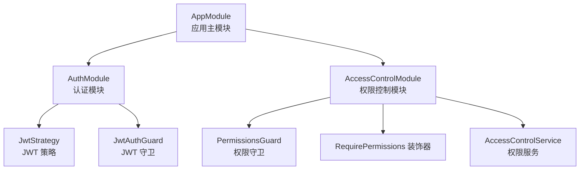
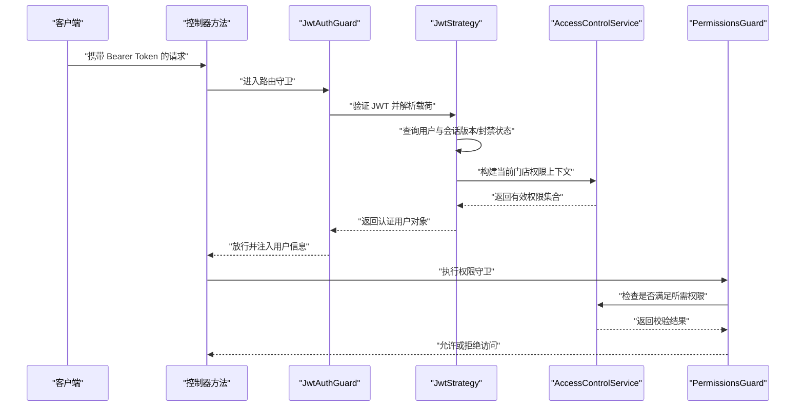
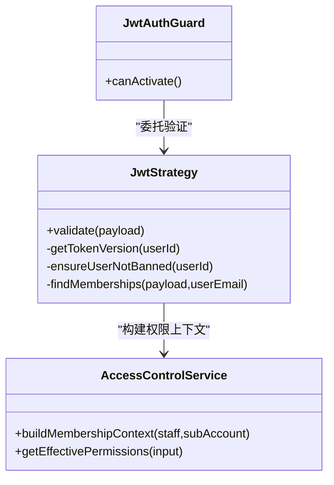
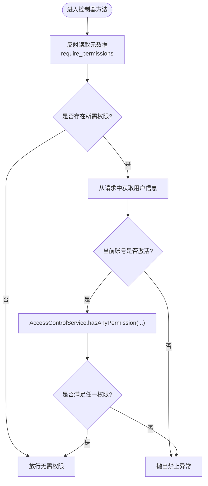
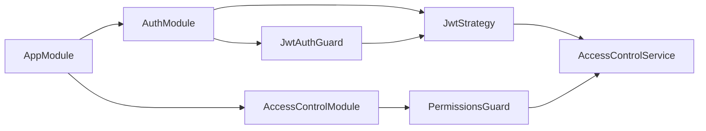

# 设计模式应用

<cite>
**本文引用的文件**
- [src/app.module.ts](file://src/app.module.ts)
- [src/purely-profit/auth/auth.module.ts](file://src/purely-profit/auth/auth.module.ts)
- [src/purely-profit/auth/strategies/jwt.strategy.ts](file://src/purely-profit/auth/strategies/jwt.strategy.ts)
- [src/purely-profit/auth/guards/jwt-auth.guard.ts](file://src/purely-profit/auth/guards/jwt-auth.guard.ts)
- [src/purely-profit/auth/current-user.decorator.ts](file://src/purely-profit/auth/current-user.decorator.ts)
- [src/purely-profit/access-control/access-control.module.ts](file://src/purely-profit/access-control/access-control.module.ts)
- [src/purely-profit/access-control/access-control.service.ts](file://src/purely-profit/access-control/access-control.service.ts)
- [src/purely-profit/access-control/access-control.constants.ts](file://src/purely-profit/access-control/access-control.constants.ts)
- [src/purely-profit/access-control/decorators/require-permissions.decorator.ts](file://src/purely-profit/access-control/decorators/require-permissions.decorator.ts)
- [src/purely-profit/access-control/guards/permissions.guard.ts](file://src/purely-profit/access-control/guards/permissions.guard.ts)
- [src/purely-profit/auth/auth.service.ts](file://src/purely-profit/auth/auth.service.ts)
</cite>

## 目录
1. [引言](#引言)
2. [项目结构](#项目结构)
3. [核心组件](#核心组件)
4. [架构总览](#架构总览)
5. [详细组件分析](#详细组件分析)
6. [依赖关系分析](#依赖关系分析)
7. [性能考虑](#性能考虑)
8. [故障排查指南](#故障排查指南)
9. [结论](#结论)

## 引言
本文件聚焦于 purelyprofit-server 中的设计模式应用与实现细节，围绕以下主题展开：策略模式在 JWT 认证中的使用、装饰器模式在权限控制中的应用、服务定位器模式在依赖注入中的体现；同时补充观察者模式在数据库事件监听中的使用、工厂模式在服务创建中的应用。文档通过“模式识别—实现映射—流程图解—优缺点与替代方案”的方式，帮助读者快速理解代码背后的工程决策。

## 项目结构
项目采用 NestJS 模块化组织，主模块集中注册各业务域模块（认证、权限、财务、商品、营销、成员、空间等）。认证与权限控制是本次文档关注的重点领域。

图表来源
- [src/app.module.ts:39-82](file://src/app.module.ts#L39-L82)
- [src/purely-profit/auth/auth.module.ts:21-55](file://src/purely-profit/auth/auth.module.ts#L21-L55)
- [src/purely-profit/access-control/access-control.module.ts:7-22](file://src/purely-profit/access-control/access-control.module.ts#L7-L22)

章节来源
- [src/app.module.ts:1-83](file://src/app.module.ts#L1-L83)

## 核心组件
- 认证与授权链路：JwtAuthGuard + JwtStrategy + AccessControlService + PermissionsGuard + RequirePermissions 装饰器
- 权限常量与默认角色权限：access-control.constants.ts
- 参数装饰器 CurrentUser：简化控制器中用户信息提取
- 服务聚合：AuthService 将多个子服务组合对外暴露

章节来源
- [src/purely-profit/auth/guards/jwt-auth.guard.ts:1-6](file://src/purely-profit/auth/guards/jwt-auth.guard.ts#L1-L6)
- [src/purely-profit/auth/strategies/jwt.strategy.ts:58-151](file://src/purely-profit/auth/strategies/jwt.strategy.ts#L58-L151)
- [src/purely-profit/access-control/access-control.service.ts:123-242](file://src/purely-profit/access-control/access-control.service.ts#L123-L242)
- [src/purely-profit/access-control/guards/permissions.guard.ts:13-55](file://src/purely-profit/access-control/guards/permissions.guard.ts#L13-L55)
- [src/purely-profit/access-control/decorators/require-permissions.decorator.ts:6-8](file://src/purely-profit/access-control/decorators/require-permissions.decorator.ts#L6-L8)
- [src/purely-profit/access-control/access-control.constants.ts:101-160](file://src/purely-profit/access-control/access-control.constants.ts#L101-L160)
- [src/purely-profit/auth/current-user.decorator.ts:8-19](file://src/purely-profit/auth/current-user.decorator.ts#L8-L19)
- [src/purely-profit/auth/auth.service.ts:29-128](file://src/purely-profit/auth/auth.service.ts#L29-L128)

## 架构总览
下图展示从请求进入至鉴权与权限校验的关键交互：

图表来源
- [src/purely-profit/auth/guards/jwt-auth.guard.ts:4-5](file://src/purely-profit/auth/guards/jwt-auth.guard.ts#L4-L5)
- [src/purely-profit/auth/strategies/jwt.strategy.ts:80-151](file://src/purely-profit/auth/strategies/jwt.strategy.ts#L80-L151)
- [src/purely-profit/access-control/access-control.service.ts:187-218](file://src/purely-profit/access-control/access-control.service.ts#L187-L218)
- [src/purely-profit/access-control/guards/permissions.guard.ts:19-53](file://src/purely-profit/access-control/guards/permissions.guard.ts#L19-L53)

## 详细组件分析

### 策略模式：JWT 认证中的多策略选择
- 模式识别：JwtAuthGuard 继承自 AuthGuard('jwt')，底层由 passport-jwt 提供具体策略实现；JwtStrategy 是一个可插拔的“策略类”，负责从 JWT 中提取用户身份、校验会话版本与封禁状态，并构建权限上下文。
- 实现要点
  - 策略注册：JwtModule 使用 useFactory 注册策略参数（密钥、过期时间），形成“配置即策略”的风格。
  - 鉴权流程：JwtAuthGuard 将请求交给 JwtStrategy.validate，后者完成用户查询、会话版本比对、封禁检查、权限上下文构建。
  - 可扩展性：若未来需要支持多租户或不同签发方，可在策略层进行差异化处理，而无需改动上层守卫。
- 优势
  - 解耦认证与业务逻辑，便于替换与扩展。
  - 易于测试：策略可独立单元测试。
- 替代方案
  - 自定义签名/验签：增加复杂度且易出错，不如复用成熟库。
  - 内联策略：分散在控制器或拦截器中，不利于统一管理与复用。

图表来源
- [src/purely-profit/auth/guards/jwt-auth.guard.ts:4-5](file://src/purely-profit/auth/guards/jwt-auth.guard.ts#L4-L5)
- [src/purely-profit/auth/strategies/jwt.strategy.ts:58-151](file://src/purely-profit/auth/strategies/jwt.strategy.ts#L58-L151)
- [src/purely-profit/access-control/access-control.service.ts:187-218](file://src/purely-profit/access-control/access-control.service.ts#L187-L218)

章节来源
- [src/purely-profit/auth/auth.module.ts:21-55](file://src/purely-profit/auth/auth.module.ts#L21-L55)
- [src/purely-profit/auth/strategies/jwt.strategy.ts:58-151](file://src/purely-profit/auth/strategies/jwt.strategy.ts#L58-L151)

### 装饰器模式：权限控制中的元数据声明
- 模式识别：RequirePermissions 装饰器通过 SetMetadata 将所需权限列表写入路由元数据；PermissionsGuard 在运行时读取元数据并调用 AccessControlService 进行权限判断。
- 实现要点
  - 元数据驱动：控制器方法仅需声明权限需求，无需在每个方法内重复校验逻辑。
  - 组合使用：可与 JwtAuthGuard 协同，先鉴权再校验权限。
- 优势
  - 声明式权限，简洁直观。
  - 降低横切关注点的侵入性。
- 替代方案
  - 手工在控制器中编写权限判断：重复、易遗漏、维护成本高。
  - 使用拦截器统一处理：灵活性不足，装饰器更贴近“声明+执行”的语义。

图表来源
- [src/purely-profit/access-control/guards/permissions.guard.ts:19-53](file://src/purely-profit/access-control/guards/permissions.guard.ts#L19-L53)
- [src/purely-profit/access-control/access-control.service.ts:145-152](file://src/purely-profit/access-control/access-control.service.ts#L145-L152)
- [src/purely-profit/access-control/decorators/require-permissions.decorator.ts:6-8](file://src/purely-profit/access-control/decorators/require-permissions.decorator.ts#L6-L8)

章节来源
- [src/purely-profit/access-control/decorators/require-permissions.decorator.ts:6-8](file://src/purely-profit/access-control/decorators/require-permissions.decorator.ts#L6-L8)
- [src/purely-profit/access-control/guards/permissions.guard.ts:19-53](file://src/purely-profit/access-control/guards/permissions.guard.ts#L19-L53)

### 服务定位器模式：依赖注入中的“服务定位”
- 模式识别：NestJS 通过 @Module 的 providers 与 @Injectable 的构造函数注入，形成“服务定位器”式的依赖解析与装配。例如 AuthModule 将 JwtStrategy、JwtAuthGuard 等注册为可注入服务；JwtStrategy 构造函数中直接注入 PrismaService、AccessControlService、RedisService 等。
- 实现要点
  - 模块边界清晰：各模块只导出必要的服务，避免全局污染。
  - 运行时解析：容器在运行时根据类型令牌解析依赖，减少硬编码耦合。
- 优势
  - 降低模块间耦合，提升可测试性与可维护性。
  - 支持替换与模拟（如测试替身）。
- 替代方案
  - 手动 new 或全局单例：破坏 DI 原则，难以测试与演进。

章节来源
- [src/purely-profit/auth/auth.module.ts:38-53](file://src/purely-profit/auth/auth.module.ts#L38-L53)
- [src/purely-profit/auth/strategies/jwt.strategy.ts:61-66](file://src/purely-profit/auth/strategies/jwt.strategy.ts#L61-L66)

### 观察者模式：数据库事件监听
- 模式识别：项目中存在 Redis 缓存预热、缓存失效器等模块，这些模块通常以发布/订阅或轮询的方式响应数据变更事件，从而触发缓存更新或清理，属于典型的“观察者”行为。
- 应用场景
  - 数据变更 → 触发缓存失效/预热 → 保证读取一致性。
  - 与权限上下文联动：当用户权限发生变更时，可基于事件刷新其会话版本，使旧令牌失效。
- 优势
  - 解耦事件源与处理逻辑，提升系统弹性。
- 替代方案
  - 同步阻塞式更新：影响请求延迟。
  - 轮询拉取：实时性差、资源消耗大。

章节来源
- [src/purely-profit/auth/strategies/jwt.strategy.ts:228-234](file://src/purely-profit/auth/strategies/jwt.strategy.ts#L228-L234)

### 工厂模式：服务创建与组合
- 模式识别：AuthService 将多个子服务（认证、验证码、密码、头像、实名、能力）聚合为统一入口，形成“服务工厂”式对外暴露。JwtModule 使用 useFactory 动态生成 JWT 配置，也体现了工厂的“按环境/配置生成实例”的特性。
- 实现要点
  - 统一入口：控制器仅依赖 AuthService，隐藏内部子服务细节。
  - 配置工厂：JwtModule 的 useFactory 将配置中心与模块注册解耦。
- 优势
  - 降低调用方复杂度，便于扩展新功能。
  - 配置集中管理，易于测试与切换。
- 替代方案
  - 控制器直接依赖多个子服务：增加耦合与样板代码。

章节来源
- [src/purely-profit/auth/auth.service.ts:29-128](file://src/purely-profit/auth/auth.service.ts#L29-L128)
- [src/purely-profit/auth/auth.module.ts:25-35](file://src/purely-profit/auth/auth.module.ts#L25-L35)

## 依赖关系分析
- 模块依赖
  - AppModule 导入 AuthModule 与 AccessControlModule，形成认证与权限两大支柱。
  - AuthModule 内部依赖 Passport/JWT 模块，并向外部导出 JwtAuthGuard 与 JwtModule。
  - AccessControlModule 对外导出权限服务与守卫，供其他模块使用。
- 组件依赖
  - JwtAuthGuard 依赖 JwtStrategy；JwtStrategy 依赖 PrismaService、AccessControlService、RedisService。
  - PermissionsGuard 依赖 Reflector 与 AccessControlService；RequirePermissions 通过装饰器写入元数据。

图表来源
- [src/app.module.ts:39-82](file://src/app.module.ts#L39-L82)
- [src/purely-profit/auth/auth.module.ts:21-55](file://src/purely-profit/auth/auth.module.ts#L21-L55)
- [src/purely-profit/access-control/access-control.module.ts:7-22](file://src/purely-profit/access-control/access-control.module.ts#L7-L22)

章节来源
- [src/app.module.ts:1-83](file://src/app.module.ts#L1-L83)
- [src/purely-profit/auth/auth.module.ts:1-56](file://src/purely-profit/auth/auth.module.ts#L1-L56)
- [src/purely-profit/access-control/access-control.module.ts:1-23](file://src/purely-profit/access-control/access-control.module.ts#L1-L23)

## 性能考虑
- 策略与守卫分层：鉴权与权限分离，避免重复计算；权限判断使用集合去重与快速查找，降低 O(n) 检索成本。
- 缓存与版本：会话版本存储于 Redis，旧令牌即时失效，减少无效请求处理。
- 查询优化：JwtStrategy 的权限上下文构建使用 SQL 聚合与排序，优先返回最高权限身份，减少后续分支判断。
- 依赖注入：通过容器统一解析依赖，避免重复初始化与内存浪费。

## 故障排查指南
- 令牌失效
  - 现象：提示“登录态已失效，请重新登录”。
  - 排查：确认 Redis 中的会话版本是否递增；核对 JwtStrategy 的版本读取逻辑。
- 账号被封禁
  - 现象：提示“账号已被封禁”。
  - 排查：检查 Redis 中对应门店的封禁键值；确认封禁原因键是否存在。
- 权限不足
  - 现象：提示“当前账号缺少接口访问权限”。
  - 排查：确认控制器方法是否正确使用 RequirePermissions；检查 AccessControlService 的权限集合是否包含所需权限。
- 当前账号无门店权限
  - 现象：提示“当前账号暂无门店权限”。
  - 排查：确认用户是否激活且存在有效门店身份；检查 AccessControlService 的上下文构建逻辑。

章节来源
- [src/purely-profit/auth/strategies/jwt.strategy.ts:96-99](file://src/purely-profit/auth/strategies/jwt.strategy.ts#L96-L99)
- [src/purely-profit/auth/strategies/jwt.strategy.ts:249-251](file://src/purely-profit/auth/strategies/jwt.strategy.ts#L249-L251)
- [src/purely-profit/access-control/guards/permissions.guard.ts:39-50](file://src/purely-profit/access-control/guards/permissions.guard.ts#L39-L50)

## 结论
本项目在认证与权限控制方面系统性地运用了多种设计模式：
- 策略模式：通过 JwtStrategy 与 JwtAuthGuard 的协作，实现可插拔的认证策略，便于扩展与测试。
- 装饰器模式：RequirePermissions + PermissionsGuard 形成声明式权限，降低横切关注点的侵入性。
- 服务定位器模式：NestJS 的 DI 容器承担服务定位职责，提升模块化与可维护性。
- 观察者模式：结合 Redis 事件与缓存机制，实现数据变更后的自动响应。
- 工厂模式：AuthService 与 JwtModule 的 useFactory 用于统一服务创建与配置生成。

这些模式共同提升了系统的可扩展性、可测试性与可维护性，建议在新增模块时延续该模式组合，保持一致的工程实践。