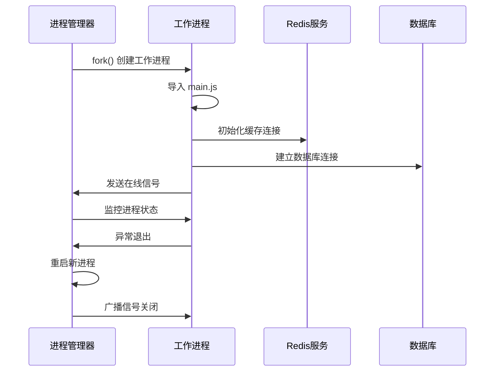
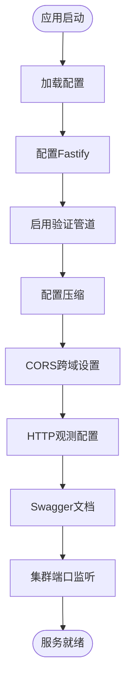
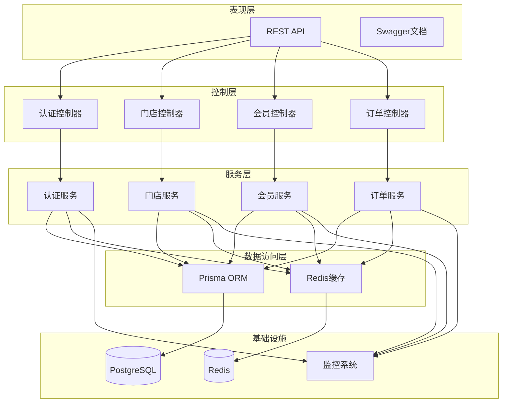
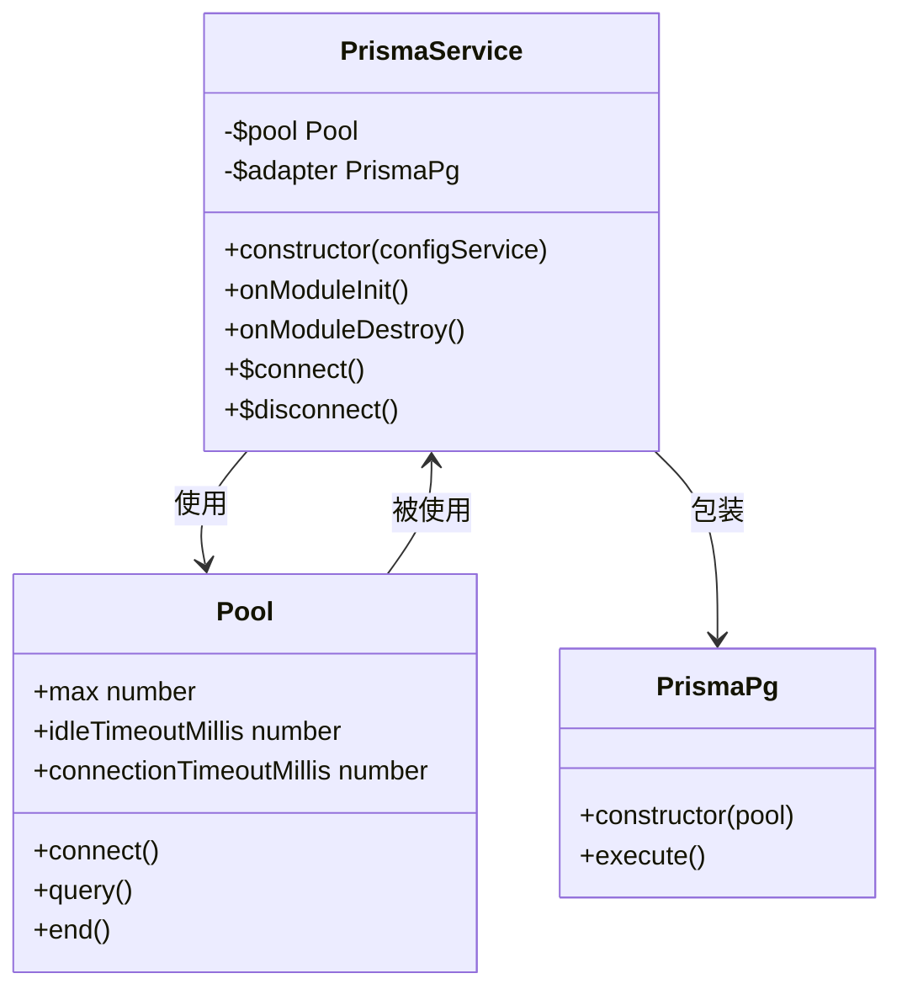
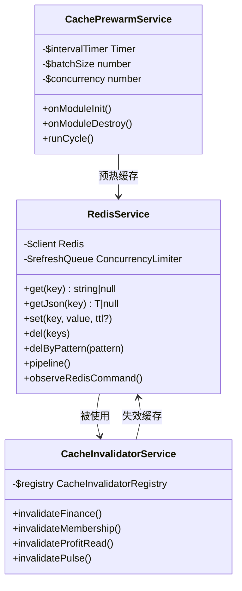
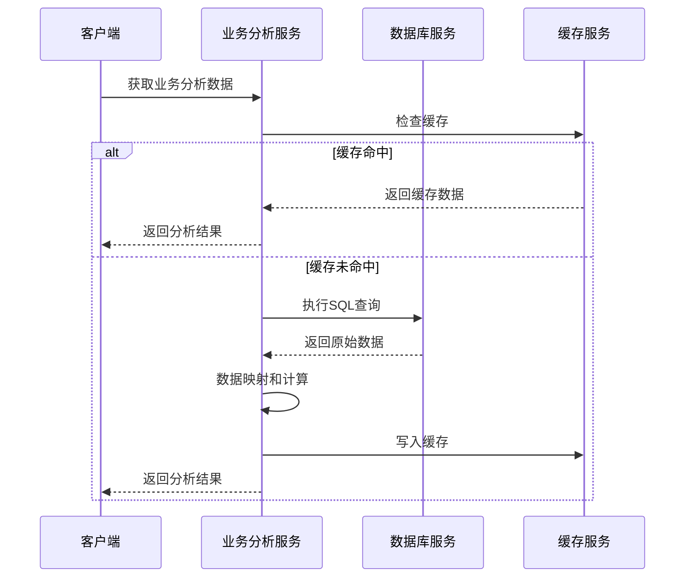
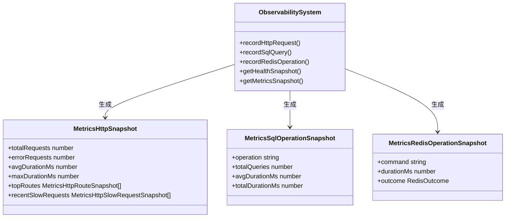
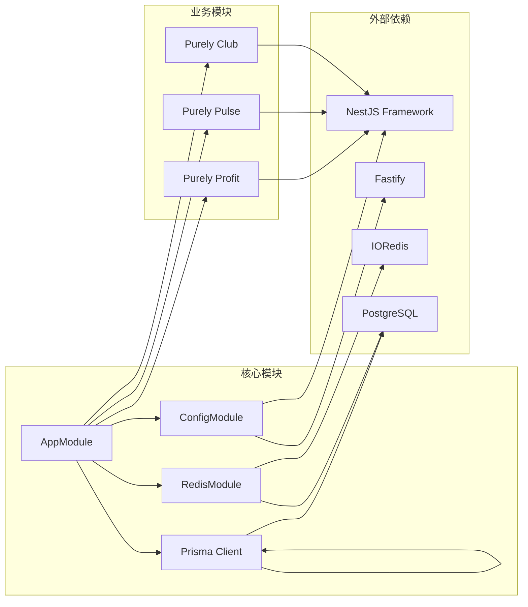

# 集群管理系统

<cite>
**本文档引用的文件**
- [main.ts](file://src/main.ts)
- [cluster-main.ts](file://src/cluster-main.ts)
- [app.module.ts](file://src/app.module.ts)
- [package.json](file://package.json)
- [configuration.ts](file://src/config/configuration.ts)
- [prisma.service.ts](file://src/prisma/prisma.service.ts)
- [redis.service.ts](file://src/redis/redis.service.ts)
- [cache-invalidator.service.ts](file://src/redis/cache-invalidator.service.ts)
- [cache-prewarm.service.ts](file://src/redis/cache-prewarm.service.ts)
- [business-analysis.service.ts](file://src/purely-profit/dashboard/business-analysis/business-analysis.service.ts)
- [dashboard-overview.service.ts](file://src/purely-pulse/dashboard/dashboard-overview.service.ts)
- [metrics-snapshot.protocol.ts](file://src/observability/metrics-snapshot.protocol.ts)
- [observability.protocol.ts](file://src/observability/observability.protocol.ts)
- [schema.prisma](file://prisma/schema.prisma)
- [store-accounts.prisma](file://prisma/purely-profit/stores/store-accounts.prisma)
- [catalog.prisma](file://prisma/purely-profit/goods/catalog.prisma)
</cite>

## 目录
1. [简介](#简介)
2. [项目结构](#项目结构)
3. [核心组件](#核心组件)
4. [架构概览](#架构概览)
5. [详细组件分析](#详细组件分析)
6. [依赖关系分析](#依赖关系分析)
7. [性能考虑](#性能考虑)
8. [故障排除指南](#故障排除指南)
9. [结论](#结论)

## 简介

这是一个基于 NestJS 框架构建的企业级集群管理系统，采用微服务架构设计，支持多租户运营模式。系统通过 Node.js Cluster 实现进程级并发，结合 Redis 缓存和 PostgreSQL 数据库提供高性能的数据处理能力。

该系统主要包含三个核心业务域：
- **Purely Profit**：传统商业运营管理
- **Purely Pulse**：实时数据分析和仪表板
- **Purely Club**：会员制俱乐部运营

系统具备完善的可观测性监控、缓存预热机制、分布式事务处理等企业级特性。

## 项目结构

```mermaid
graph TB
subgraph "应用入口层"
CM[cluster-main.ts<br/>集群主进程]
BM[bootstrap()<br/>应用引导]
AM[AppModule<br/>根模块]
end
subgraph "业务模块层"
PP[purely-profit/<br/>商业运营模块]
PULSE[purely-pulse/<br/>数据分析模块]
CLUB[purely-club/<br/>会员运营模块]
end
subgraph "基础设施层"
PRISMA[PrismaService<br/>数据库连接池]
REDIS[RedisService<br/>缓存服务]
OBS[Observability<br/>监控系统]
end
CM --> BM
BM --> AM
AM --> PP
AM --> PULSE
AM --> CLUB
PP --> PRISMA
PP --> REDIS
PULSE --> PRISMA
PULSE --> REDIS
CLUB --> PRISMA
CLUB --> REDIS
PP --> OBS
PULSE --> OBS
CLUB --> OBS
```

**图表来源**
- [cluster-main.ts:15-54](file://src/cluster-main.ts#L15-L54)
- [app.module.ts:49-98](file://src/app.module.ts#L49-L98)

**章节来源**
- [main.ts:226-325](file://src/main.ts#L226-L325)
- [app.module.ts:1-103](file://src/app.module.ts#L1-L103)

## 核心组件

### 集群管理器

系统采用 Node.js Cluster 模式实现进程级并发，支持动态工作进程管理和故障恢复。



**图表来源**
- [cluster-main.ts:15-54](file://src/cluster-main.ts#L15-L54)

### 应用引导流程

应用启动时执行完整的初始化序列，包括配置加载、中间件设置、模块注册等。



**图表来源**
- [main.ts:226-325](file://src/main.ts#L226-L325)

**章节来源**
- [cluster-main.ts:1-55](file://src/cluster-main.ts#L1-L55)
- [main.ts:226-325](file://src/main.ts#L226-L325)

## 架构概览

系统采用分层架构设计，通过模块化组织实现高内聚低耦合：



**图表来源**
- [app.module.ts:49-98](file://src/app.module.ts#L49-L98)
- [prisma.service.ts:8-71](file://src/prisma/prisma.service.ts#L8-L71)

## 详细组件分析

### 数据库连接池管理

系统使用 Prisma ORM 提供类型安全的数据库操作，并通过连接池优化性能。



**图表来源**
- [prisma.service.ts:8-71](file://src/prisma/prisma.service.ts#L8-L71)

**章节来源**
- [prisma.service.ts:13-69](file://src/prisma/prisma.service.ts#L13-L69)

### 缓存服务架构

Redis 作为主要缓存存储，提供多种缓存策略和失效机制。



**图表来源**
- [redis.service.ts:76-416](file://src/redis/redis.service.ts#L76-L416)
- [cache-invalidator.service.ts](file://src/redis/cache-invalidator.service.ts)

**章节来源**
- [redis.service.ts:76-416](file://src/redis/redis.service.ts#L76-L416)
- [cache-prewarm.service.ts:20-64](file://src/redis/cache-prewarm.service.ts#L20-L64)

### 业务分析引擎

系统提供强大的业务分析能力，支持多维度数据聚合和趋势分析。



**图表来源**
- [business-analysis.service.ts](file://src/purely-profit/dashboard/business-analysis/business-analysis.service.ts)
- [dashboard-overview.service.ts:194-215](file://src/purely-pulse/dashboard/dashboard-overview.service.ts#L194-L215)

**章节来源**
- [business-analysis.service.ts](file://src/purely-profit/dashboard/business-analysis/business-analysis.service.ts)
- [dashboard-overview.service.ts:179-215](file://src/purely-pulse/dashboard/dashboard-overview.service.ts#L179-L215)

### 可观测性监控

系统内置完整的监控体系，包括性能指标收集、慢请求追踪、错误日志等。



**图表来源**
- [metrics-snapshot.protocol.ts:9-55](file://src/observability/metrics-snapshot.protocol.ts#L9-L55)
- [observability.protocol.ts:1-26](file://src/observability/observability.protocol.ts#L1-L26)

**章节来源**
- [metrics-snapshot.protocol.ts:1-55](file://src/observability/metrics-snapshot.protocol.ts#L1-L55)
- [observability.protocol.ts:1-26](file://src/observability/observability.protocol.ts#L1-L26)

## 依赖关系分析

系统采用模块化设计，各模块间通过清晰的接口进行交互：



**图表来源**
- [app.module.ts:49-98](file://src/app.module.ts#L49-L98)
- [package.json:32-60](file://package.json#L32-L60)

**章节来源**
- [package.json:32-60](file://package.json#L32-L60)
- [app.module.ts:49-98](file://src/app.module.ts#L49-L98)

## 性能考虑

### 缓存策略

系统实现了多层次的缓存策略以提升性能：

1. **读写分离缓存**：热点数据缓存，支持后台刷新
2. **预热机制**：定时预热常用数据，减少首次访问延迟
3. **失效策略**：基于领域的缓存失效，确保数据一致性

### 数据库优化

- **连接池管理**：动态调整连接池大小，避免资源浪费
- **慢查询监控**：自动识别和记录慢查询，便于性能优化
- **索引优化**：针对高频查询建立复合索引

### 集群部署

- **进程级并发**：充分利用多核CPU资源
- **故障自愈**：工作进程异常自动重启
- **平滑升级**：支持零停机部署

## 故障排除指南

### 常见问题诊断

1. **连接超时问题**
   - 检查数据库连接池配置
   - 验证网络连通性
   - 查看慢查询日志

2. **缓存失效异常**
   - 确认Redis服务状态
   - 检查缓存键命名规范
   - 验证失效策略配置

3. **集群进程崩溃**
   - 查看进程日志
   - 检查内存使用情况
   - 验证资源限制配置

### 监控指标解读

- **HTTP响应时间**：超过阈值需检查后端处理逻辑
- **数据库查询延迟**：需要优化SQL或添加索引
- **Redis操作耗时**：检查缓存命中率和过期策略

**章节来源**
- [main.ts:59-129](file://src/main.ts#L59-L129)
- [redis.service.ts:391-416](file://src/redis/redis.service.ts#L391-L416)

## 结论

该集群管理系统展现了现代企业级应用的完整架构设计，通过合理的模块划分、完善的监控体系和高效的缓存策略，为业务发展提供了坚实的技术基础。

系统的主要优势包括：
- **高可用性**：集群模式确保服务连续性
- **高性能**：多层缓存和连接池优化
- **可观测性**：完整的监控和日志体系
- **可扩展性**：模块化设计便于功能扩展

未来可以考虑的方向：
- 引入分布式追踪系统
- 实现更精细的缓存粒度控制
- 增强自动化运维能力
- 优化大数据量场景下的查询性能