# 测试策略

<cite>
**本文引用的文件**
- [package.json](file://package.json)
- [jest-e2e.json](file://test/jest-e2e.json)
- [app.e2e-spec.ts](file://test/app.e2e-spec.ts)
- [finance.e2e-spec.ts](file://test/finance.e2e-spec.ts)
- [generate-smoke-token.mjs](file://scripts/generate-smoke-token.mjs)
- [test-smoke-release-regression.mjs](file://scripts/test-smoke-release-regression.mjs)
- [seed-owner.mjs](file://scripts/seed-owner.mjs)
- [verify-api-live.sh](file://verify-api-live.sh)
- [release-execute.sh](file://scripts/release-execute.sh)
- [src/app.controller.spec.ts](file://src/app.controller.spec.ts)
- [src/main.spec.ts](file://src/main.spec.ts)
- [src/purely-profit/auth/auth.service.spec.ts](file://src/purely-profit/auth/auth.service.spec.ts)
- [src/purely-profit/auth/strategies/jwt.strategy.spec.ts](file://src/purely-profit/auth/strategies/jwt.strategy.spec.ts)
- [src/purely-profit/access-control/access-control.service.spec.ts](file://src/purely-profit/access-control/access-control.service.spec.ts)
- [src/purely-profit/access-control/guards/sub-account-block.guard.spec.ts](file://src/purely-profit/access-control/guards/sub-account-block.guard.spec.ts)
- [src/purely-profit/finance/finance-account.service.spec.ts](file://src/purely-profit/finance/finance-account.service.spec.ts)
- [src/purely-profit/finance/finance.controller.spec.ts](file://src/purely-profit/finance/finance.controller.spec.ts)
- [src/purely-profit/marketing/marketing.service.ts](file://src/purely-profit/marketing/marketing.service.ts)
- [src/purely-profit/marketing/marketing.service.test-setup.ts](file://src/purely-profit/marketing/marketing.service.test-setup.ts)
- [src/purely-profit/member/platform-membership/platform-membership.service.spec.ts](file://src/purely-profit/member/platform-membership/platform-membership.service.spec.ts)
- [src/purely-profit/member/platform-membership/store-sub-account.service.spec.ts](file://src/purely-profit/member/platform-membership/store-sub-account.service.spec.ts)
- [src/purely-profit/member/withdrawals/withdrawals.service.test-setup.ts](file://src/purely-profit/member/withdrawals/withdrawals.service.test-setup.ts)
- [src/purely-profit/member/withdrawals/withdrawals.service.apply.spec.ts](file://src/purely-profit/member/withdrawals/withdrawals.service.apply.spec.ts)
- [src/purely-profit/member/withdrawals/withdrawals.service.review.spec.ts](file://src/purely-profit/member/withdrawals/withdrawals.service.review.spec.ts)
- [src/purely-profit/member/withdrawals/withdrawals.service.overview.spec.ts](file://src/purely-profit/member/withdrawals/withdrawals.service.overview.spec.ts)
- [src/purely-profit/operations/sales-record/sales-record.service.spec.ts](file://src/purely-profit/operations/sales-record/sales-record.service.spec.ts)
- [src/purely-profit/notifications/notifications.service.spec.ts](file://src/purely-profit/notifications/notifications.service.spec.ts)
- [src/purely-profit/notifications/notifications.controller.spec.ts](file://src/purely-profit/notifications/notifications.controller.spec.ts)
- [src/purely-profit/stores/stores.service.spec.ts](file://src/purely-profit/stores/stores.service.spec.ts)
- [src/purely-profit/stores/stores.service.ts](file://src/purely-profit/stores/stores.service.ts)
- [src/purely-profit/stores/stores.controller.ts](file://src/purely-profit/stores/stores.controller.ts)
</cite>

## 更新摘要
**所做更改**
- 新增完整的烟雾测试基础设施章节，涵盖 generate-smoke-token.mjs、test-smoke-release-regression.mjs 和改进的 seed-owner.mjs 脚本
- 更新测试环境与CI流程章节，增加烟雾测试在发布流程中的集成
- 新增烟雾测试最佳实践和生产环境验证策略
- 更新依赖关系与耦合分析，强调烟雾测试脚本的独立性和可靠性

## 目录
1. [引言](#引言)
2. [项目结构与测试布局](#项目结构与测试布局)
3. [核心组件与测试覆盖范围](#核心组件与测试覆盖范围)
4. [架构总览与测试分层](#架构总览与测试分层)
5. [详细组件测试分析](#详细组件测试分析)
6. [烟雾测试基础设施](#烟雾测试基础设施)
7. [依赖关系与耦合分析](#依赖关系与耦合分析)
8. [性能与负载测试](#性能与负载测试)
9. [测试环境与CI流程](#测试环境与ci流程)
10. [故障排查指南](#故障排查指南)
11. [结论](#结论)

## 引言
本测试策略文档面向 purelyprofit-server 的测试体系，目标是建立从单元测试到集成测试再到端到端测试（E2E）的完整质量保障闭环。文档将结合现有测试文件与项目结构，明确测试编写方法、设计原则、覆盖率要求、测试数据准备与清理策略、Mock 使用、异步测试处理、测试环境配置以及在持续集成中的执行流程，并补充性能与负载测试建议。

**更新** 本次更新重点关注新增的烟雾测试基础设施，提供端到端的生产环境验证能力，确保发布前的完整业务路径验证。

## 项目结构与测试布局
- 单元测试：以 .spec.ts 文件形式分布在各模块目录中，遵循"被测文件同级或同模块目录下"的组织方式，便于定位与维护。
- 集成测试：通过 NestJS 模块与控制器组合进行，验证服务层与控制器交互。
- 端到端测试（E2E）：位于 test/ 目录，采用 Jest E2E 配置，覆盖关键业务路径与外部依赖（如数据库、Redis）。
- 烟雾测试：位于 scripts/ 目录，提供生产环境级别的端到端验证脚本。

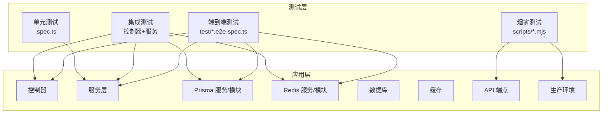

**章节来源**
- [package.json](file://package.json)
- [jest-e2e.json](file://test/jest-e2e.json)

## 核心组件与测试覆盖范围
- 认证与权限控制：auth、access-control 模块包含大量 .spec.ts 文件，覆盖认证服务、策略、权限守卫等。
- 财务模块：finance 控制器与服务均有对应 spec，覆盖账户、现金流、对账、概览等。
- 市场营销与会员：marketing、member 子模块存在多处 service.spec.ts 与 controller.spec.ts。
- 通知与门店：notifications、stores 模块同样具备控制器与服务的测试覆盖。
- E2E：app.e2e-spec.ts、finance.e2e-spec.ts 覆盖应用启动与财务路径。
- 烟雾测试：generate-smoke-token.mjs、seed-owner.mjs、test-smoke-release-regression.mjs 提供生产环境验证。

**章节来源**
- [src/purely-profit/auth/auth.service.spec.ts](file://src/purely-profit/auth/auth.service.spec.ts)
- [src/purely-profit/access-control/access-control.service.spec.ts](file://src/purely-profit/access-control/access-control.service.spec.ts)
- [src/purely-profit/finance/finance.controller.spec.ts](file://src/purely-profit/finance/finance.controller.spec.ts)
- [src/purely-profit/finance/finance-account.service.spec.ts](file://src/purely-profit/finance/finance-account.service.spec.ts)
- [src/purely-profit/marketing/marketing.service.ts](file://src/purely-profit/marketing/marketing.service.ts)
- [src/purely-profit/member/platform-membership/platform-membership.service.spec.ts](file://src/purely-profit/member/platform-membership/platform-membership.service.spec.ts)
- [src/purely-profit/member/withdrawals/withdrawals.service.apply.spec.ts](file://src/purely-profit/member/withdrawals/withdrawals.service.apply.spec.ts)
- [src/purely-profit/member/withdrawals/withdrawals.service.review.spec.ts](file://src/purely-profit/member/withdrawals/withdrawals.service.review.spec.ts)
- [src/purely-profit/member/withdrawals/withdrawals.service.overview.spec.ts](file://src/purely-profit/member/withdrawals/withdrawals.service.overview.spec.ts)
- [src/purely-profit/notifications/notifications.controller.spec.ts](file://src/purely-profit/notifications/notifications.controller.spec.ts)
- [src/purely-profit/stores/stores.service.spec.ts](file://src/purely-profit/stores/stores.service.spec.ts)
- [app.e2e-spec.ts](file://test/app.e2e-spec.ts)
- [finance.e2e-spec.ts](file://test/finance.e2e-spec.ts)
- [generate-smoke-token.mjs](file://scripts/generate-smoke-token.mjs)
- [seed-owner.mjs](file://scripts/seed-owner.mjs)
- [test-smoke-release-regression.mjs](file://scripts/test-smoke-release-regression.mjs)

## 架构总览与测试分层
- 单元测试聚焦服务层与工具函数，确保逻辑正确性与边界条件处理。
- 集成测试聚焦控制器与服务交互，验证 DTO 映射、参数校验、异常传播与返回格式。
- E2E 测试聚焦真实请求链路，验证数据库、缓存、外部依赖的协同工作。
- 烟雾测试聚焦生产环境端到端验证，确保发布前的完整业务路径验证。

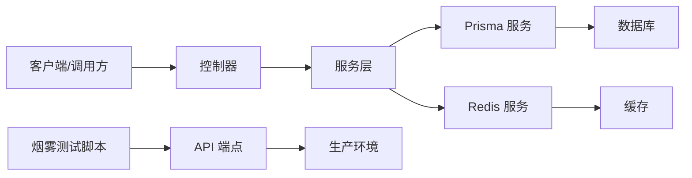

## 详细组件测试分析

### 认证与权限控制
- 认证服务与策略：通过 auth.service.spec.ts 与 jwt.strategy.spec.ts 验证登录、令牌签发、能力查询等流程。
- 权限守卫：sub-account-block.guard.spec.ts 验证子账号访问限制逻辑。
- 主题能力服务：subject-capability.service.spec.ts 验证主体能力计算与缓存。

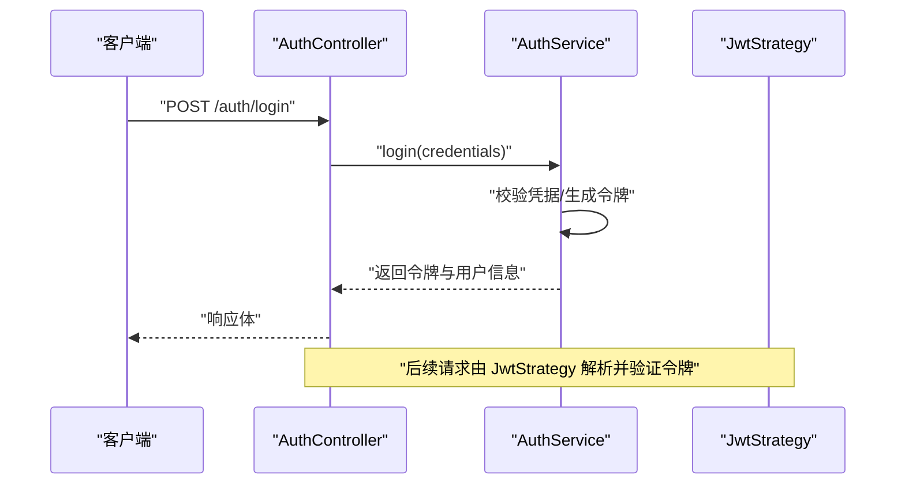

**图表来源**
- [src/purely-profit/auth/auth.controller.spec.ts](file://src/purely-profit/auth/auth.controller.spec.ts)
- [src/purely-profit/auth/auth.service.spec.ts](file://src/purely-profit/auth/auth.service.spec.ts)
- [src/purely-profit/auth/strategies/jwt.strategy.spec.ts](file://src/purely-profit/auth/strategies/jwt.strategy.spec.ts)

**章节来源**
- [src/purely-profit/auth/auth.service.spec.ts](file://src/purely-profit/auth/auth.service.spec.ts)
- [src/purely-profit/auth/strategies/jwt.strategy.spec.ts](file://src/purely-profit/auth/strategies/jwt.strategy.spec.ts)
- [src/purely-profit/access-control/guards/sub-account-block.guard.spec.ts](file://src/purely-profit/access-control/guards/sub-account-block.guard.spec.ts)
- [src/purely-profit/access-control/access-control.service.spec.ts](file://src/purely-profit/access-control/access-control.service.spec.ts)

### 财务模块
- 控制器与服务：finance.controller.spec.ts 与 finance-account.service.spec.ts 覆盖账户、现金流、对账、概览等查询与写入场景。
- 查询与映射：通过 query DTO 与 mapper 的组合，确保输入输出一致性。

**图表来源**
- [src/purely-profit/finance/finance.controller.spec.ts](file://src/purely-profit/finance/finance.controller.spec.ts)
- [src/purely-profit/finance/finance-account.service.spec.ts](file://src/purely-profit/finance/finance-account.service.spec.ts)

**章节来源**
- [src/purely-profit/finance/finance.controller.spec.ts](file://src/purely-profit/finance/finance.controller.spec.ts)
- [src/purely-profit/finance/finance-account.service.spec.ts](file://src/purely-profit/finance/finance-account.service.spec.ts)

### 市场营销与会员
- 营销服务：marketing.service.ts 提供客户、产品、促销、充值等聚合查询；marketing.service.test-setup.ts 可用于测试初始化。
- 平台会员：platform-membership.service.spec.ts 与 store-sub-account.service.spec.ts 覆盖会员订单、合作伙伴、子账号读取等。
- 提现：withdrawals.service.test-setup.ts 与 apply/review/overview 的 spec 覆盖提现申请、审核与概览。

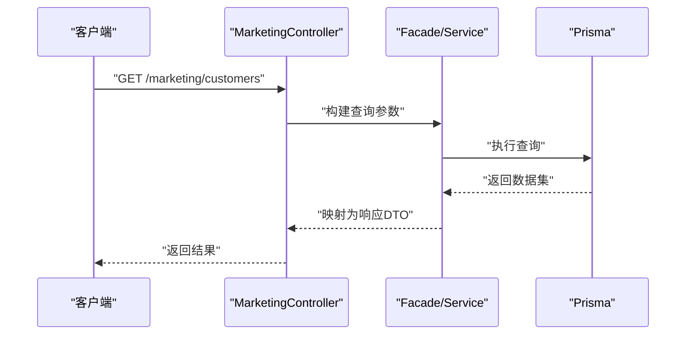

**图表来源**
- [src/purely-profit/marketing/marketing.service.ts](file://src/purely-profit/marketing/marketing.service.ts)
- [src/purely-profit/member/platform-membership/platform-membership.service.spec.ts](file://src/purely-profit/member/platform-membership/platform-membership.service.spec.ts)
- [src/purely-profit/member/platform-membership/store-sub-account.service.spec.ts](file://src/purely-profit/member/platform-membership/store-sub-account.service.spec.ts)
- [src/purely-profit/member/withdrawals/withdrawals.service.apply.spec.ts](file://src/purely-profit/member/withdrawals/withdrawals.service.apply.spec.ts)
- [src/purely-profit/member/withdrawals/withdrawals.service.review.spec.ts](file://src/purely-profit/member/withdrawals/withdrawals.service.review.spec.ts)
- [src/purely-profit/member/withdrawals/withdrawals.service.overview.spec.ts](file://src/purely-profit/member/withdrawals/withdrawals.service.overview.spec.ts)

**章节来源**
- [src/purely-profit/marketing/marketing.service.ts](file://src/purely-profit/marketing/marketing.service.ts)
- [src/purely-profit/marketing/marketing.service.test-setup.ts](file://src/purely-profit/marketing/marketing.service.test-setup.ts)
- [src/purely-profit/member/platform-membership/platform-membership.service.spec.ts](file://src/purely-profit/member/platform-membership/platform-membership.service.spec.ts)
- [src/purely-profit/member/platform-membership/store-sub-account.service.spec.ts](file://src/purely-profit/member/platform-membership/store-sub-account.service.spec.ts)
- [src/purely-profit/member/withdrawals/withdrawals.service.test-setup.ts](file://src/purely-profit/member/withdrawals/withdrawals.service.test-setup.ts)
- [src/purely-profit/member/withdrawals/withdrawals.service.apply.spec.ts](file://src/purely-profit/member/withdrawals/withdrawals.service.apply.spec.ts)
- [src/purely-profit/member/withdrawals/withdrawals.service.review.spec.ts](file://src/purely-profit/member/withdrawals/withdrawals.service.review.spec.ts)
- [src/purely-profit/member/withdrawals/withdrawals.service.overview.spec.ts](file://src/purely-profit/member/withdrawals/withdrawals.service.overview.spec.ts)

### 通知与门店
- 通知：notifications.controller.spec.ts 与 notifications.service.spec.ts 覆盖通知读取、状态管理与上下文构建。
- 门店：stores.controller.ts、stores.service.ts、stores.service.spec.ts 覆盖门店增删改查与查询接口。

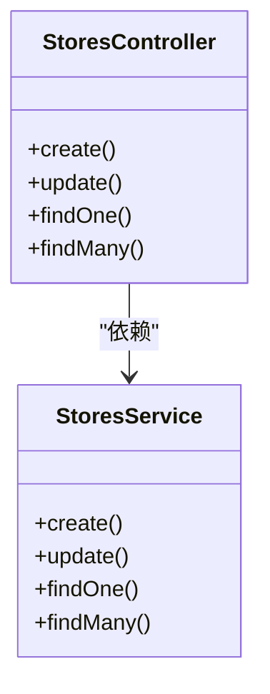

**图表来源**
- [src/purely-profit/stores/stores.controller.ts](file://src/purely-profit/stores/stores.controller.ts)
- [src/purely-profit/stores/stores.service.ts](file://src/purely-profit/stores/stores.service.ts)
- [src/purely-profit/stores/stores.service.spec.ts](file://src/purely-profit/stores/stores.service.spec.ts)

**章节来源**
- [src/purely-profit/notifications/notifications.controller.spec.ts](file://src/purely-profit/notifications/notifications.controller.spec.ts)
- [src/purely-profit/notifications/notifications.service.spec.ts](file://src/purely-profit/notifications/notifications.service.spec.ts)
- [src/purely-profit/stores/stores.controller.ts](file://src/purely-profit/stores/stores.controller.ts)
- [src/purely-profit/stores/stores.service.ts](file://src/purely-profit/stores/stores.service.ts)
- [src/purely-profit/stores/stores.service.spec.ts](file://src/purely-profit/stores/stores.service.spec.ts)

### 销售记录与运营
- 销售记录：sales-record.service.spec.ts 与 sales-record.service.ts 覆盖销售单据的创建、查询与统计。
- 运营模块：operations 下包含成本、采购、空间、交接等子域，建议按领域拆分测试用例，确保每个领域服务都有对应的 spec。

**章节来源**
- [src/purely-profit/operations/sales-record/sales-record.service.spec.ts](file://src/purely-profit/operations/sales-record/sales-record.service.spec.ts)
- [src/purely-profit/operations/sales-record/sales-record.service.ts](file://src/purely-profit/operations/sales-record/sales-record.service.ts)

## 烟雾测试基础设施

**新增** 纯粹profit-server现已配备完整的烟雾测试基础设施，提供生产环境级别的端到端验证能力。

### 烟雾测试概述
烟雾测试是一种在接近生产环境的条件下进行全面功能验证的测试方法。它通过模拟真实用户的完整业务流程，确保系统的各个组件能够协同工作，为发布提供最终的质量保证。

### 核心组件

#### 1. 烟雾测试令牌生成器 (generate-smoke-token.mjs)
负责生成用于烟雾测试的有效JWT令牌，支持多种账户范围和门店配置。

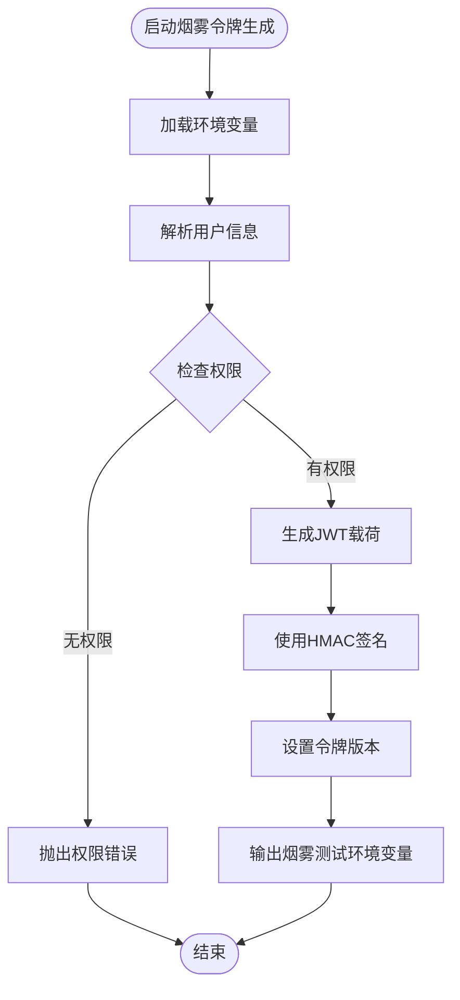

**图表来源**
- [generate-smoke-token.mjs](file://scripts/generate-smoke-token.mjs)

#### 2. 烟雾测试数据准备器 (seed-owner.mjs)
幂等地创建或更新烟雾测试所需的用户、门店、订阅和员工关系数据。

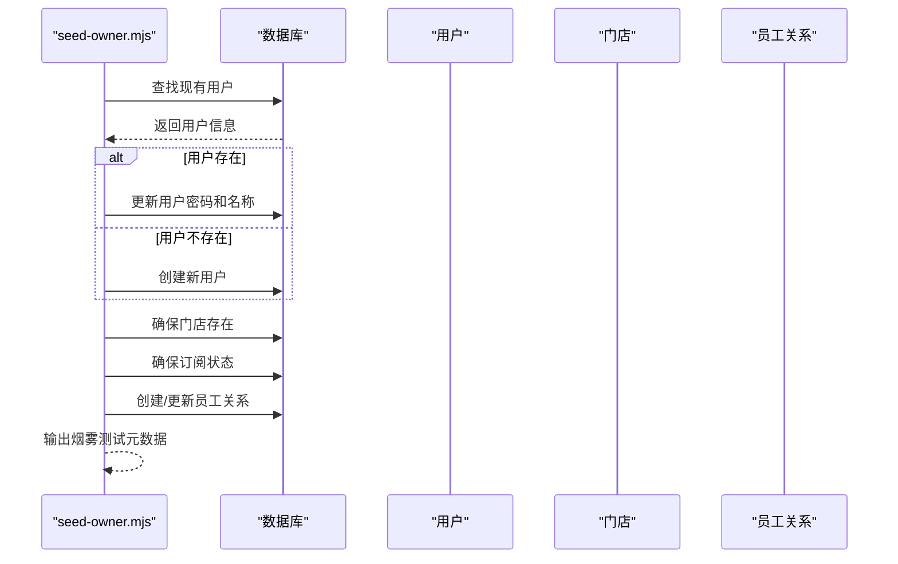

**图表来源**
- [seed-owner.mjs](file://scripts/seed-owner.mjs)

#### 3. 烟雾测试回归检查器 (test-smoke-release-regression.mjs)
验证烟雾测试脚本的完整性和正确性，确保发布流程的稳定性。

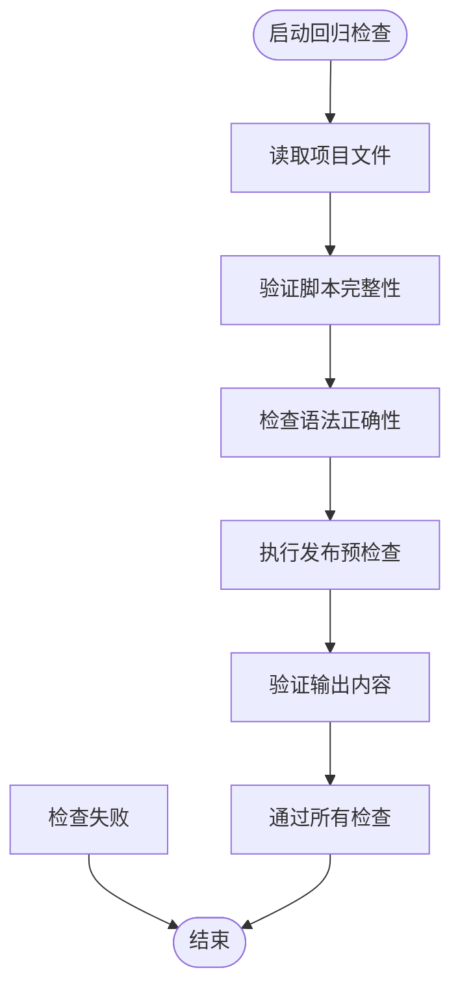

**图表来源**
- [test-smoke-release-regression.mjs](file://scripts/test-smoke-release-regression.mjs)

### 烟雾测试工作流程

#### 发布前烟雾测试流程
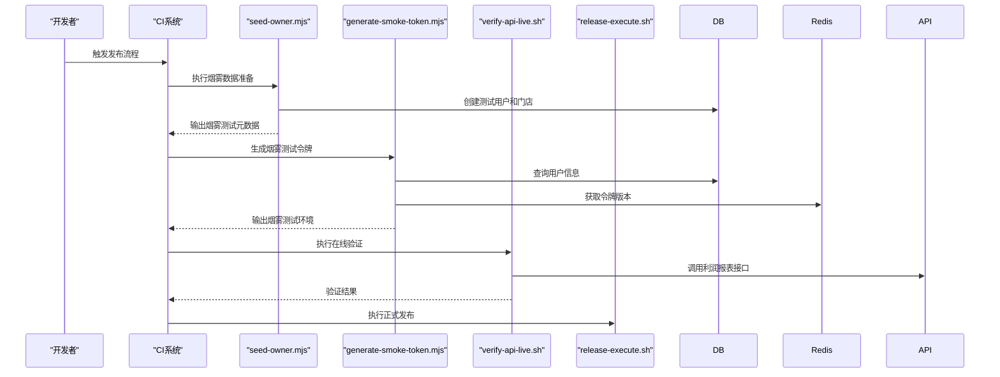

**图表来源**
- [seed-owner.mjs](file://scripts/seed-owner.mjs)
- [generate-smoke-token.mjs](file://scripts/generate-smoke-token.mjs)
- [verify-api-live.sh](file://verify-api-live.sh)
- [release-execute.sh](file://scripts/release-execute.sh)

### 烟雾测试最佳实践

#### 环境配置
- 使用独立的测试数据库和缓存实例，避免影响生产数据
- 支持多种账户范围：purely_profit、purely_pulse、purely_club
- 自动检测和适配不同的门店ID配置

#### 数据准备策略
- 幂等性设计：重复执行不会产生副作用
- 渐进式准备：先创建用户，再创建门店，最后建立员工关系
- 权限验证：确保用户具有必要的业务访问权限

#### 令牌管理
- 使用Node.js内置crypto模块进行安全签名
- 支持令牌版本控制和失效机制
- 自动推导手机号和邮箱格式

#### 回归测试
- 语法检查：使用node --check验证脚本语法
- 功能验证：检查脚本输出是否包含必需的环境变量
- 发布流程：验证完整的发布预检查流程

**章节来源**
- [generate-smoke-token.mjs](file://scripts/generate-smoke-token.mjs)
- [seed-owner.mjs](file://scripts/seed-owner.mjs)
- [test-smoke-release-regression.mjs](file://scripts/test-smoke-release-regression.mjs)
- [verify-api-live.sh](file://verify-api-live.sh)
- [release-execute.sh](file://scripts/release-execute.sh)

## 依赖关系与耦合分析

**更新** 强调烟雾测试脚本的独立性和可靠性，减少对外部依赖的耦合。

- 单元测试与服务层解耦：通过构造函数注入与接口抽象，便于 Mock 外部依赖（Prisma、Redis）。
- 控制器与服务：控制器仅负责参数解析与响应封装，复杂逻辑下沉至服务层，降低控制器测试难度。
- 外部依赖：Prisma 与 Redis 在测试中可通过模块替换或 Mock 实现隔离。
- 烟雾测试脚本：独立于主应用运行，直接连接数据库和Redis，提供生产环境级别的验证。
- 内置安全模块：使用Node.js内置crypto模块替代jsonwebtoken，提供更安全、更可控的加密操作。

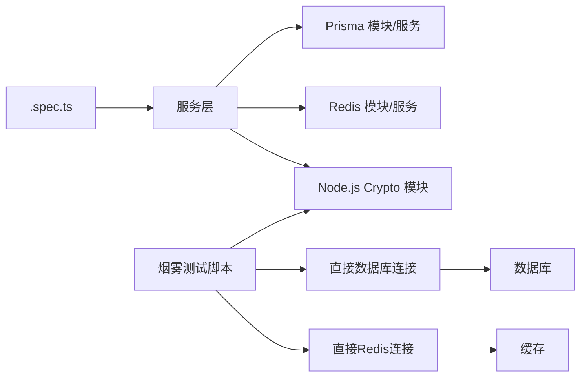

[此图为概念图，不直接映射具体源码文件，故无图表来源]

## 性能与负载测试
- 单元测试：关注算法复杂度与边界条件，避免长耗时操作；必要时使用定时器 Mock。
- 集成测试：对热点接口进行压力测试，观察响应时间与错误率。
- E2E：模拟真实用户行为，结合数据库索引与缓存命中情况评估整体性能。
- 烟雾测试：在接近生产环境的条件下进行端到端性能验证，确保关键业务路径的性能表现。
- 建议：引入性能基准测试工具（如 Jest 性能插件或独立压测工具），定期回归性能指标。

## 测试环境与CI流程

**更新** 增加烟雾测试在发布流程中的集成。

### 测试运行配置
- 测试运行配置：Jest E2E 配置位于 test/jest-e2e.json，定义了 E2E 测试入口与环境变量。
- 应用入口：src/main.ts 作为应用启动入口，单元测试入口为 src/main.spec.ts。
- 包脚本：package.json 中包含测试命令，建议在 CI 中统一执行单元测试、集成测试与 E2E 测试。

### 烟雾测试集成
- 发布前检查：test-smoke-release-regression.mjs 验证整个烟雾测试流程的正确性
- 数据准备：seed-owner.mjs 幂等创建测试数据，支持多种配置选项
- 令牌生成：generate-smoke-token.mjs 生成有效的业务级烟雾测试令牌
- 在线验证：verify-api-live.sh 调用实际API端点进行功能验证
- 发布执行：release-execute.sh 集成烟雾测试到标准发布流程

### 数据库与缓存
- E2E 测试应使用独立测试数据库与缓存实例，确保可重复性与隔离性。
- 烟雾测试使用独立的测试环境，避免与生产数据冲突。
- 支持环境变量配置，便于在不同环境中运行。

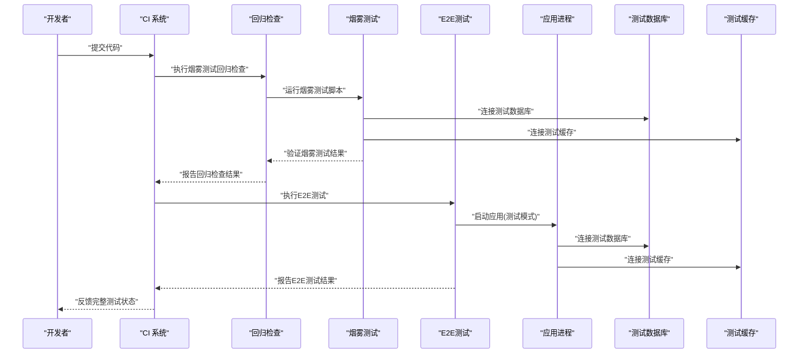

**图表来源**
- [test-smoke-release-regression.mjs](file://scripts/test-smoke-release-regression.mjs)
- [seed-owner.mjs](file://scripts/seed-owner.mjs)
- [generate-smoke-token.mjs](file://scripts/generate-smoke-token.mjs)
- [verify-api-live.sh](file://verify-api-live.sh)
- [jest-e2e.json](file://test/jest-e2e.json)
- [src/main.spec.ts](file://src/main.spec.ts)
- [src/main.ts](file://src/main.ts)

**章节来源**
- [test-smoke-release-regression.mjs](file://scripts/test-smoke-release-regression.mjs)
- [seed-owner.mjs](file://scripts/seed-owner.mjs)
- [generate-smoke-token.mjs](file://scripts/generate-smoke-token.mjs)
- [verify-api-live.sh](file://verify-api-live.sh)
- [release-execute.sh](file://scripts/release-execute.sh)
- [jest-e2e.json](file://test/jest-e2e.json)
- [src/main.spec.ts](file://src/main.spec.ts)
- [src/main.ts](file://src/main.ts)
- [package.json](file://package.json)

## 故障排查指南

**更新** 增加烟雾测试相关的故障排查指南。

### 烟雾测试常见问题
- 令牌生成失败：检查JWT_SECRET环境变量配置，验证用户权限和门店绑定状态
- 数据准备失败：确认DATABASE_URL配置正确，检查用户邮箱格式和手机号规则
- 回归检查失败：使用node --check验证脚本语法，检查package.json中的脚本配置
- 在线验证失败：确认API端点可达性，检查网络连接和防火墙设置

### 传统测试问题
- 单元测试失败：优先检查被测服务的 Mock 设置与依赖注入；确认 DTO 映射与异常抛出是否符合预期。
- 集成测试失败：核对控制器参数解析、状态码与响应体结构；检查服务层异常是否正确传播。
- E2E 失败：确认测试数据库与缓存已正确初始化与清理；检查外部依赖（如短信、支付）的 Mock 或测试桩。
- 数据准备与清理：使用测试初始化文件（如 marketing.service.test-setup.ts、withdrawals.service.test-setup.ts）集中准备测试数据；在 afterEach/afterAll 中清理，避免跨用例污染。

### 安全测试问题
- 验证crypto模块的密钥生成与哈希算法是否正确实现；检查令牌签名验证流程。
- 确认烟雾测试脚本的环境变量配置安全性，避免敏感信息泄露。

**章节来源**
- [generate-smoke-token.mjs](file://scripts/generate-smoke-token.mjs)
- [seed-owner.mjs](file://scripts/seed-owner.mjs)
- [test-smoke-release-regression.mjs](file://scripts/test-smoke-release-regression.mjs)
- [src/purely-profit/marketing/marketing.service.test-setup.ts](file://src/purely-profit/marketing/marketing.service.test-setup.ts)
- [src/purely-profit/member/withdrawals/withdrawals.service.test-setup.ts](file://src/purely-profit/member/withdrawals/withdrawals.service.test-setup.ts)

## 结论
通过单元测试、集成测试、E2E测试和烟雾测试的分层设计，配合完善的 Mock 策略与测试数据生命周期管理，可以有效保障 purelyprofit-server 的功能正确性与稳定性。新增的烟雾测试基础设施进一步增强了生产环境级别的验证能力，确保发布前的完整业务路径验证。

建议在 CI 中自动化执行全量测试，包括烟雾测试回归检查、E2E测试和传统的单元/集成测试，并结合性能与负载测试定期回归，持续提升系统质量与交付效率。烟雾测试作为发布流程的最后一道防线，为系统的稳定性和可靠性提供了重要保障。

**更新** 本次更新特别强调了烟雾测试基础设施的重要性和实用性，推荐使用Node.js内置crypto模块替代外部jsonwebtoken包，这不仅减少了依赖复杂性，还提供了更好的安全性控制和性能表现。烟雾测试的引入为纯粹profit-server提供了端到端的生产环境验证能力，确保发布前的完整业务路径验证，是现代软件测试策略不可或缺的重要组成部分。