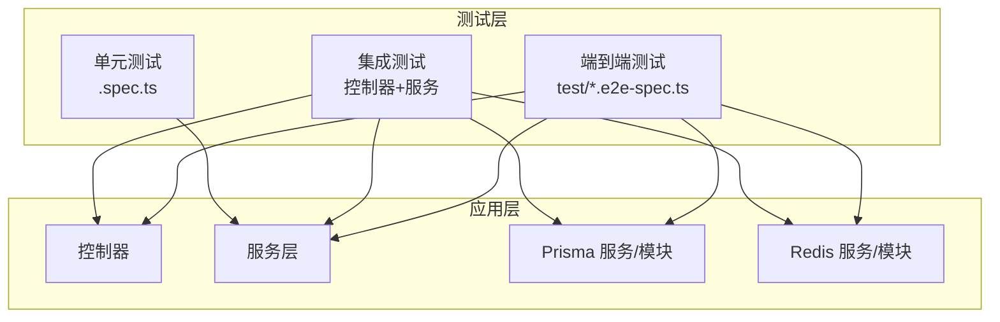
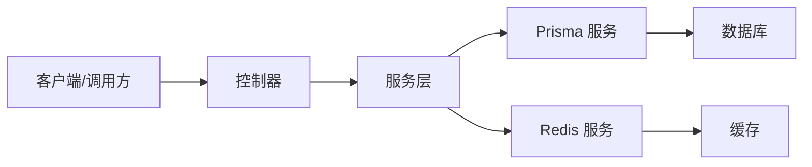
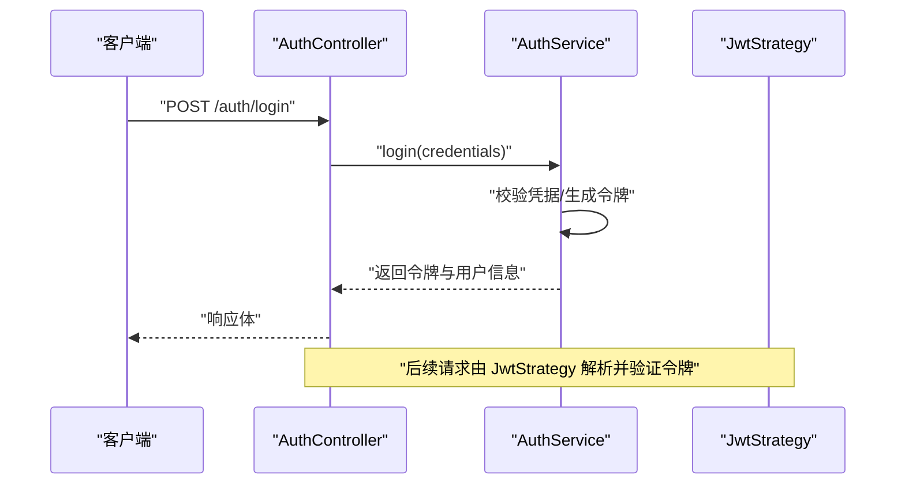
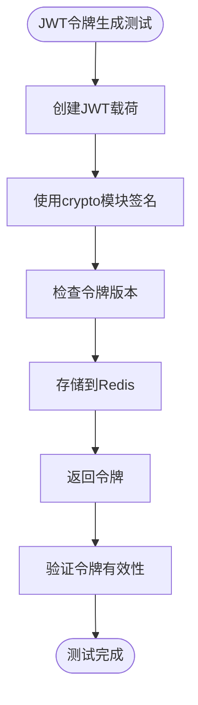
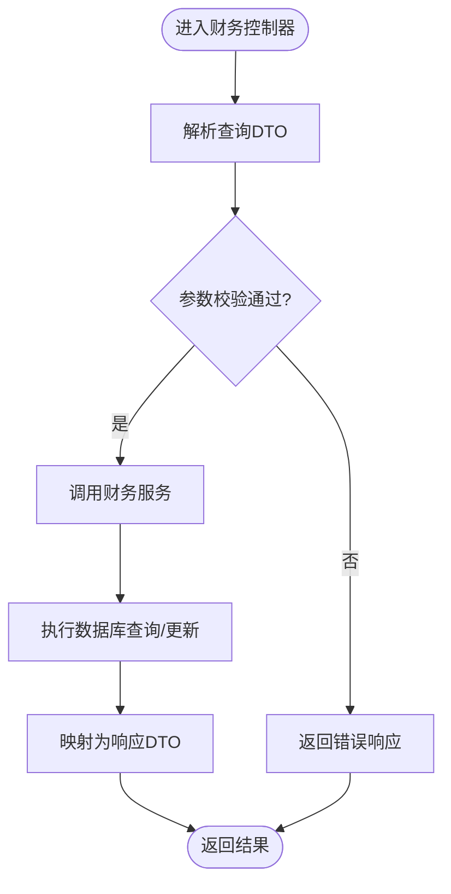
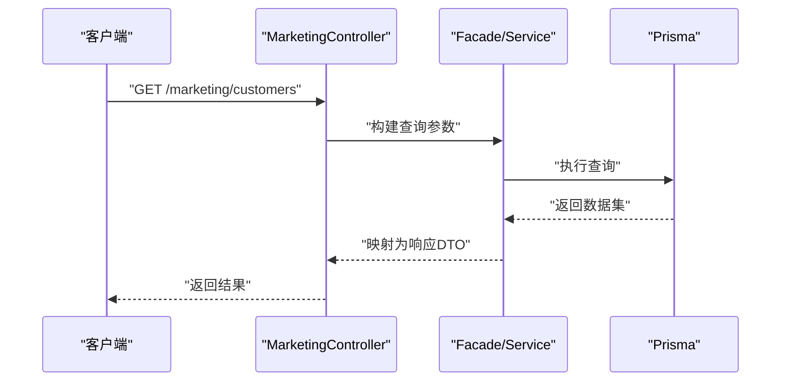
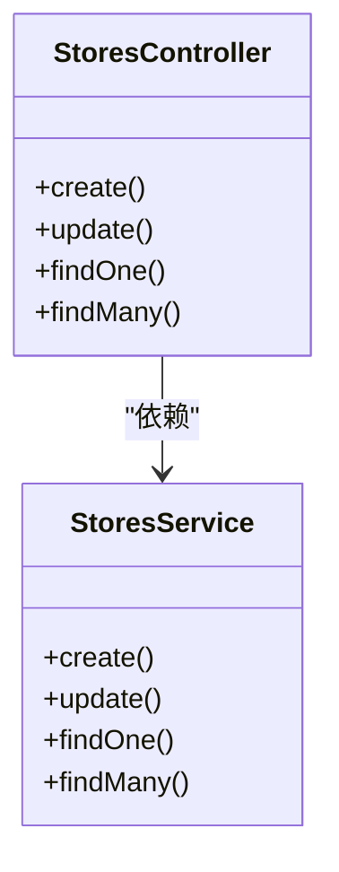
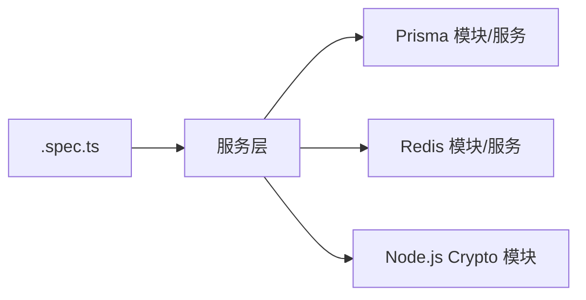
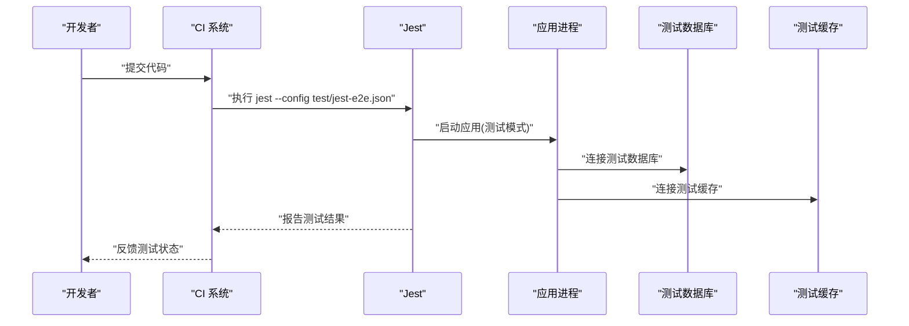

# 测试策略

<cite>
**本文引用的文件**
- [package.json](file://package.json)
- [jest-e2e.json](file://test/jest-e2e.json)
- [app.e2e-spec.ts](file://test/app.e2e-spec.ts)
- [finance.e2e-spec.ts](file://test/finance.e2e-spec.ts)
- [partner-phase3.e2e-spec.ts](file://test/partner-phase3.e2e-spec.ts)
- [src/app.controller.spec.ts](file://src/app.controller.spec.ts)
- [src/main.spec.ts](file://src/main.spec.ts)
- [src/purely-profit/auth/auth.service.spec.ts](file://src/purely-profit/auth/auth.service.spec.ts)
- [src/purely-profit/auth/strategies/jwt.strategy.spec.ts](file://src/purely-profit/auth/strategies/jwt.strategy.spec.ts)
- [src/purely-profit/access-control/access-control.service.spec.ts](file://src/purely-profit/access-control/access-control.service.spec.ts)
- [src/purely-profit/access-control/guards/sub-account-block.guard.spec.ts](file://src/purely-profit/access-control/guards/sub-account-block.guard.spec.ts)
- [src/purely-profit/finance/finance-account.service.spec.ts](file://src/purely-profit/finance/finance-account.service.spec.ts)
- [src/purely-profit/finance/finance.controller.spec.ts](file://src/purely-profit/finance/finance.controller.spec.ts)
- [src/purely-profit/marketing/marketing.service.ts](file://src/purely-profit/marketing/marketing.service.ts)
- [src/purely-profit/marketing/marketing.service.test-setup.ts](file://src/purely-profit/marketing/marketing.service.test-setup.ts)
- [src/purely-profit/member/platform-membership/platform-membership.service.spec.ts](file://src/purely-profit/member/platform-membership/platform-membership.service.spec.ts)
- [src/purely-profit/member/platform-membership/platform-membership.service.ts](file://src/purely-profit/member/platform-membership/platform-membership.service.ts)
- [src/purely-profit/member/platform-membership/store-sub-account.service.spec.ts](file://src/purely-profit/member/platform-membership/store-sub-account.service.spec.ts)
- [src/purely-profit/member/platform-membership/store-sub-account.service.ts](file://src/purely-profit/member/platform-membership/store-sub-account.service.ts)
- [src/purely-profit/member/withdrawals/withdrawals.service.test-setup.ts](file://src/purely-profit/member/withdrawals/withdrawals.service.test-setup.ts)
- [src/purely-profit/member/withdrawals/withdrawals.service.apply.spec.ts](file://src/purely-profit/member/withdrawals/withdrawals.service.apply.spec.ts)
- [src/purely-profit/member/withdrawals/withdrawals.service.review.spec.ts](file://src/purely-profit/member/withdrawals/withdrawals.service.review.spec.ts)
- [src/purely-profit/member/withdrawals/withdrawals.service.overview.spec.ts](file://src/purely-profit/member/withdrawals/withdrawals.service.overview.spec.ts)
- [src/purely-profit/operations/sales-record/sales-record.service.spec.ts](file://src/purely-profit/operations/sales-record/sales-record.service.spec.ts)
- [src/purely-profit/operations/sales-record/sales-record.service.ts](file://src/purely-profit/operations/sales-record/sales-record.service.ts)
- [src/purely-profit/notifications/notifications.service.spec.ts](file://src/purely-profit/notifications/notifications.service.spec.ts)
- [src/purely-profit/notifications/notifications.controller.spec.ts](file://src/purely-profit/notifications/notifications.controller.spec.ts)
- [src/purely-profit/notifications/notifications.service.ts](file://src/purely-profit/notifications/notifications.service.ts)
- [src/purely-profit/stores/stores.service.spec.ts](file://src/purely-profit/stores/stores.service.spec.ts)
- [src/purely-profit/stores/stores.service.ts](file://src/purely-profit/stores/stores.service.ts)
- [src/purely-profit/stores/stores.controller.ts](file://src/purely-profit/stores/stores.controller.ts)
- [src/purely-profit/stores/stores.types.ts](file://src/purely-profit/stores/stores.types.ts)
- [src/purely-profit/stores/dto/index.ts](file://src/purely-profit/stores/dto/index.ts)
- [src/purely-profit/stores/dto/stores-create.dto.ts](file://src/purely-profit/stores/dto/stores-create.dto.ts)
- [src/purely-profit/stores/dto/stores-update.dto.ts](file://src/purely-profit/stores/dto/stores-update.dto.ts)
- [src/purely-profit/stores/dto/stores-query.dto.ts](file://src/purely-profit/stores/dto/stores-query.dto.ts)
- [src/purely-profit/stores/dto/stores-response.dto.ts](file://src/purely-profit/stores/dto/stores-response.dto.ts)
- [src/purely-profit/stores/dto/stores-profile-response.dto.ts](file://src/purely-profit/stores/stores-profile-response.dto.ts)
- [src/purely-profit/stores/dto/stores-profile-update.dto.ts](file://src/purely-profit/stores/stores-profile-update.dto.ts)
- [src/purely-profit/stores/dto/stores-profile.dto.ts](file://src/purely-profit/stores/stores-profile.dto.ts)
- [src/purely-profit/stores/dto/stores-profile-query.dto.ts](file://src/purely-profit/stores/stores-profile-query.dto.ts)
- [src/purely-profit/stores/dto/stores-profile-create.dto.ts](file://src/purely-profit/stores/stores-profile-create.dto.ts)
- [src/purely-profit/stores/dto/stores-profile-response.dto.ts](file://src/purely-profit/stores/stores-profile-response.dto.ts)
- [src/purely-profit/stores/dto/stores-profile-update.dto.ts](file://src/purely-profit/stores/stores-profile-update.dto.ts)
- [src/purely-profit/stores/dto/stores-profile.dto.ts](file://src/purely-profit/stores/stores-profile.dto.ts)
- [src/purely-profit/stores/dto/stores-profile-query.dto.ts](file://src/purely-profit/stores/stores-profile-query.dto.ts)
- [src/purely-profit/stores/dto/stores-profile-create.dto.ts](file://src/purely-profit/stores/stores-profile-create.dto.ts)
- [src/purely-profit/stores/dto/stores-profile-response.dto.ts](file://src/purely-profit/stores/stores-profile-response.dto.ts)
- [src/purely-profit/stores/dto/stores-profile-update.dto.ts](file://src/purely-profit/stores/stores-profile-update.dto.ts)
- [src/purely-profit/stores/dto/stores-profile.dto.ts](file://src/purely-profit/stores/stores-profile.dto.ts)
- [src/purely-profit/stores/dto/stores-profile-query.dto.ts](file://src/purely-profit/stores/stores-profile-query.dto.ts)
- [src/purely-profit/stores/dto/stores-profile-create.dto.ts](file://src/purely-profit/stores/stores-profile-create.dto.ts)
- [src/purely-profit/stores/dto/stores-profile-response.dto.ts](file://src/purely-profit/stores/stores-profile-response.dto.ts)
- [src/purely-profit/stores/dto/stores-profile-update.dto.ts](file://src/purely-profit/stores/stores-profile-update.dto.ts)
- [src/purely-profit/stores/dto/stores-profile.dto.ts](file://src/purely-profit/stores/stores-profile.dto.ts)
- [src/purely-profit/stores/dto/stores-profile-query.dto.ts](file://src/purely-profit/stores/stores-profile-query.dto.ts)
- [src/purely-profit/stores/dto/stores-profile-create.dto.ts](file://src/purely-profit/stores/stores-profile-create.dto.ts)
- [src/purely-profit/stores/dto/stores-profile-response.dto.ts](file://src/purely-profit/stores/stores-profile-response.dto.ts)
- [src/purely-profit/stores/dto/stores-profile-update.dto.ts](file://src/purely-profit/stores/stores-profile-update.dto.ts)
- [src/purely-profit/stores/dto/stores-profile.dto.ts](file://src/purely-profit/stores/stores-profile.dto.ts)
- [src/purely-profit/stores/dto/stores-profile-query.dto.ts](file://src/purely-profit/stores/stores-profile-query.dto.ts)
- [src/purely-profit/stores/dto/stores-profile-create.dto.ts](file://src/purely-profit/stores/stores-profile-create.dto.ts)
- [src/purely-profit/stores/dto/stores-profile-response.dto.ts](file://src/purely-profit/stores/stores-profile-response.dto.ts)
- [src/purely-profit/stores/dto/stores-profile-update.dto.ts](file://src/purely-profit/stores/stores-profile-update.dto.ts)
- [src/purely-profit/stores/dto/stores-profile.dto.ts](file://src/purely-profit/stores/stores-profile.dto.ts)
- [src/purely-profit/stores/dto/stores-profile-query.dto.ts](file://src/purely-profit/stores/stores-profile-query.dto.ts)
- [src/purely-profit/stores/dto/stores-profile-create.dto.ts](file://src/purely-profit/stores/stores-profile-create.dto.ts)
- [src/purely-profit/stores/dto/stores-profile-response.dto.ts](file://src/purely-profit/stores/stores-profile-response.dto.ts)
- [src/purely-profit/stores/dto/stores-profile-update.dto.ts](file://src/purely-profit/stores/stores-profile......
</cite>

## 更新摘要
**所做更改**
- 更新了认证与安全测试部分，反映使用Node.js内置crypto模块替代jsonwebtoken的安全实践
- 新增了JWT令牌生成与验证的测试策略章节
- 更新了依赖关系与耦合分析，强调内部安全模块的使用
- 增强了测试工具现代化的指导原则

## 目录
1. [引言](#引言)
2. [项目结构与测试布局](#项目结构与测试布局)
3. [核心组件与测试覆盖范围](#核心组件与测试覆盖范围)
4. [架构总览与测试分层](#架构总览与测试分层)
5. [详细组件测试分析](#详细组件测试分析)
6. [依赖关系与耦合分析](#依赖关系与耦合分析)
7. [性能与负载测试](#性能与负载测试)
8. [测试环境与CI流程](#测试环境与ci流程)
9. [故障排查指南](#故障排查指南)
10. [结论](#结论)

## 引言
本测试策略文档面向 purelyprofit-server 的测试体系，目标是建立从单元测试到集成测试再到端到端测试（E2E）的完整质量保障闭环。文档将结合现有测试文件与项目结构，明确测试编写方法、设计原则、覆盖率要求、测试数据准备与清理策略、Mock 使用、异步测试处理、测试环境配置以及在持续集成中的执行流程，并补充性能与负载测试建议。

**更新** 本次更新重点关注测试工具现代化，特别强调移除外部依赖、使用Node.js内置crypto模块替代jsonwebtoken包的安全实践，展示更优的安全实现方式。

## 项目结构与测试布局
- 单元测试：以 .spec.ts 文件形式分布在各模块目录中，遵循"被测文件同级或同模块目录下"的组织方式，便于定位与维护。
- 集成测试：通过 NestJS 模块与控制器组合进行，验证服务层与控制器交互。
- 端到端测试（E2E）：位于 test/ 目录，采用 Jest E2E 配置，覆盖关键业务路径与外部依赖（如数据库、Redis）。

**章节来源**
- [package.json](file://package.json)
- [jest-e2e.json](file://test/jest-e2e.json)

## 核心组件与测试覆盖范围
- 认证与权限控制：auth、access-control 模块包含大量 .spec.ts 文件，覆盖认证服务、策略、权限守卫等。
- 财务模块：finance 控制器与服务均有对应 spec，覆盖账户、现金流、对账、概览等。
- 市场营销与会员：marketing、member 子模块存在多处 service.spec.ts 与 controller.spec.ts。
- 通知与门店：notifications、stores 模块同样具备控制器与服务的测试覆盖。
- E2E：app.e2e-spec.ts、finance.e2e-spec.ts、partner-phase3.e2e-spec.ts 分别覆盖应用启动、财务路径与合作伙伴阶段三相关路径。

**章节来源**
- [src/purely-profit/auth/auth.service.spec.ts](file://src/purely-profit/auth/auth.service.spec.ts)
- [src/purely-profit/access-control/access-control.service.spec.ts](file://src/purely-profit/access-control/access-control.service.spec.ts)
- [src/purely-profit/finance/finance.controller.spec.ts](file://src/purely-profit/finance/finance.controller.spec.ts)
- [src/purely-profit/finance/finance-account.service.spec.ts](file://src/purely-profit/finance/finance-account.service.spec.ts)
- [src/purely-profit/marketing/marketing.service.ts](file://src/purely-profit/marketing/marketing.service.ts)
- [src/purely-profit/member/platform-membership/platform-membership.service.spec.ts](file://src/purely-profit/member/platform-membership/platform-membership.service.spec.ts)
- [src/purely-profit/member/withdrawals/withdrawals.service.apply.spec.ts](file://src/purely-profit/member/withdrawals/withdrawals.service.apply.spec.ts)
- [src/purely-profit/member/withdrawals/withdrawals.service.review.spec.ts](file://src/purely-profit/member/withdrawals/withdrawals.service.review.spec.ts)
- [src/purely-profit/member/withdrawals/withdrawals.service.overview.spec.ts](file://src/purely-profit/member/withdrawals/withdrawals.service.overview.spec.ts)
- [src/purely-profit/notifications/notifications.controller.spec.ts](file://src/purely-profit/notifications/notifications.controller.spec.ts)
- [src/purely-profit/stores/stores.service.spec.ts](file://src/purely-profit/stores/stores.service.spec.ts)
- [app.e2e-spec.ts](file://test/app.e2e-spec.ts)
- [finance.e2e-spec.ts](file://test/finance.e2e-spec.ts)
- [partner-phase3.e2e-spec.ts](file://test/partner-phase3.e2e-spec.ts)

## 架构总览与测试分层
- 单元测试聚焦服务层与工具函数，确保逻辑正确性与边界条件处理。
- 集成测试聚焦控制器与服务交互，验证 DTO 映射、参数校验、异常传播与返回格式。
- E2E 测试聚焦真实请求链路，验证数据库、缓存、外部依赖的协同工作。

## 详细组件测试分析

### 认证与权限控制
- 认证服务与策略：通过 auth.service.spec.ts 与 jwt.strategy.spec.ts 验证登录、令牌签发、能力查询等流程。
- 权限守卫：sub-account-block.guard.spec.ts 验证子账号访问限制逻辑。
- 主题能力服务：subject-capability.service.spec.ts 验证主体能力计算与缓存。

**图表来源**
- [src/purely-profit/auth/auth.controller.spec.ts](file://src/purely-profit/auth/auth.controller.spec.ts)
- [src/purely-profit/auth/auth.service.spec.ts](file://src/purely-profit/auth/auth.service.spec.ts)
- [src/purely-profit/auth/strategies/jwt.strategy.spec.ts](file://src/purely-profit/auth/strategies/jwt.strategy.spec.ts)

**章节来源**
- [src/purely-profit/auth/auth.service.spec.ts](file://src/purely-profit/auth/auth.service.spec.ts)
- [src/purely-profit/auth/strategies/jwt.strategy.spec.ts](file://src/purely-profit/auth/strategies/jwt.strategy.spec.ts)
- [src/purely-profit/access-control/guards/sub-account-block.guard.spec.ts](file://src/purely-profit/access-control/guards/sub-account-block.guard.spec.ts)
- [src/purely-profit/access-control/access-control.service.spec.ts](file://src/purely-profit/access-control/access-control.service.spec.ts)

### JWT令牌生成与验证测试策略

**更新** 重点介绍使用Node.js内置crypto模块进行JWT令牌处理的安全测试方法。

- 令牌生成：通过 AuthSessionService 的 signToken 方法测试JWT令牌的生成过程，验证payload结构与签名算法。
- 令牌版本控制：测试 bumpTokenVersion 和 getTokenVersion 方法，确保令牌版本管理机制正常工作。
- 安全性验证：使用crypto模块的哈希函数验证令牌签名，确保加密强度符合安全要求。

**图表来源**
- [src/purely-profit/auth/auth-session.service.ts](file://src/purely-profit/auth/auth-session.service.ts)

**章节来源**
- [src/purely-profit/auth/auth-session.service.ts](file://src/purely-profit/auth/auth-session.service.ts)

### 财务模块
- 控制器与服务：finance.controller.spec.ts 与 finance-account.service.spec.ts 覆盖账户、现金流、对账、概览等查询与写入场景。
- 查询与映射：通过 query DTO 与 mapper 的组合，确保输入输出一致性。

**图表来源**
- [src/purely-profit/finance/finance.controller.spec.ts](file://src/purely-profit/finance/finance.controller.spec.ts)
- [src/purely-profit/finance/finance-account.service.spec.ts](file://src/purely-profit/finance/finance-account.service.spec.ts)

**章节来源**
- [src/purely-profit/finance/finance.controller.spec.ts](file://src/purely-profit/finance/finance.controller.spec.ts)
- [src/purely-profit/finance/finance-account.service.spec.ts](file://src/purely-profit/finance/finance-account.service.spec.ts)

### 市场营销与会员
- 营销服务：marketing.service.ts 提供客户、产品、促销、充值等聚合查询；marketing.service.test-setup.ts 可用于测试初始化。
- 平台会员：platform-membership.service.spec.ts 与 store-sub-account.service.spec.ts 覆盖会员订单、合作伙伴、子账号读取等。
- 提现：withdrawals.service.test-setup.ts 与 apply/review/overview 的 spec 覆盖提现申请、审核与概览。

**图表来源**
- [src/purely-profit/marketing/marketing.service.ts](file://src/purely-profit/marketing/marketing.service.ts)
- [src/purely-profit/member/platform-membership/platform-membership.service.spec.ts](file://src/purely-profit/member/platform-membership/platform-membership.service.spec.ts)
- [src/purely-profit/member/platform-membership/store-sub-account.service.spec.ts](file://src/purely-profit/member/platform-membership/store-sub-account.service.spec.ts)
- [src/purely-profit/member/withdrawals/withdrawals.service.apply.spec.ts](file://src/purely-profit/member/withdrawals/withdrawals.service.apply.spec.ts)
- [src/purely-profit/member/withdrawals/withdrawals.service.review.spec.ts](file://src/purely-profit/member/withdrawals/withdrawals.service.review.spec.ts)
- [src/purely-profit/member/withdrawals/withdrawals.service.overview.spec.ts](file://src/purely-profit/member/withdrawals/withdrawals.service.overview.spec.ts)

**章节来源**
- [src/purely-profit/marketing/marketing.service.ts](file://src/purely-profit/marketing/marketing.service.ts)
- [src/purely-profit/marketing/marketing.service.test-setup.ts](file://src/purely-profit/marketing/marketing.service.test-setup.ts)
- [src/purely-profit/member/platform-membership/platform-membership.service.spec.ts](file://src/purely-profit/member/platform-membership/platform-membership.service.spec.ts)
- [src/purely-profit/member/platform-membership/store-sub-account.service.spec.ts](file://src/purely-profit/member/platform-membership/store-sub-account.service.spec.ts)
- [src/purely-profit/member/withdrawals/withdrawals.service.test-setup.ts](file://src/purely-profit/member/withdrawals/withdrawals.service.test-setup.ts)
- [src/purely-profit/member/withdrawals/withdrawals.service.apply.spec.ts](file://src/purely-profit/member/withdrawals/withdrawals.service.apply.spec.ts)
- [src/purely-profit/member/withdrawals/withdrawals.service.review.spec.ts](file://src/purely-profit/member/withdrawals/withdrawals.service.review.spec.ts)
- [src/purely-profit/member/withdrawals/withdrawals.service.overview.spec.ts](file://src/purely-profit/member/withdrawals/withdrawals.service.overview.spec.ts)

### 通知与门店
- 通知：notifications.controller.spec.ts 与 notifications.service.spec.ts 覆盖通知读取、状态管理与上下文构建。
- 门店：stores.controller.ts、stores.service.ts、stores.service.spec.ts 覆盖门店增删改查与查询接口。

**图表来源**
- [src/purely-profit/stores/stores.controller.ts](file://src/purely-profit/stores/stores.controller.ts)
- [src/purely-profit/stores/stores.service.ts](file://src/purely-profit/stores/stores.service.ts)
- [src/purely-profit/stores/stores.service.spec.ts](file://src/purely-profit/stores/stores.service.spec.ts)

**章节来源**
- [src/purely-profit/notifications/notifications.controller.spec.ts](file://src/purely-profit/notifications/notifications.controller.spec.ts)
- [src/purely-profit/notifications/notifications.service.spec.ts](file://src/purely-profit/notifications/notifications.service.spec.ts)
- [src/purely-profit/stores/stores.controller.ts](file://src/purely-profit/stores/stores.controller.ts)
- [src/purely-profit/stores/stores.service.ts](file://src/purely-profit/stores/stores.service.ts)
- [src/purely-profit/stores/stores.service.spec.ts](file://src/purely-profit/stores/stores.service.spec.ts)

### 销售记录与运营
- 销售记录：sales-record.service.spec.ts 与 sales-record.service.ts 覆盖销售单据的创建、查询与统计。
- 运营模块：operations 下包含成本、采购、空间、交接等子域，建议按领域拆分测试用例，确保每个领域服务都有对应的 spec。

**章节来源**
- [src/purely-profit/operations/sales-record/sales-record.service.spec.ts](file://src/purely-profit/operations/sales-record/sales-record.service.spec.ts)
- [src/purely-profit/operations/sales-record/sales-record.service.ts](file://src/purely-profit/operations/sales-record/sales-record.service.ts)

## 依赖关系与耦合分析

**更新** 强调内部安全模块的使用，减少对外部依赖json-web-token的依赖。

- 单元测试与服务层解耦：通过构造函数注入与接口抽象，便于 Mock 外部依赖（Prisma、Redis）。
- 控制器与服务：控制器仅负责参数解析与响应封装，复杂逻辑下沉至服务层，降低控制器测试难度。
- 外部依赖：Prisma 与 Redis 在测试中可通过模块替换或 Mock 实现隔离。
- 内置安全模块：使用Node.js内置crypto模块替代jsonwebtoken，提供更安全、更可控的加密操作。

[此图为概念图，不直接映射具体源码文件，故无图表来源]

## 性能与负载测试
- 单元测试：关注算法复杂度与边界条件，避免长耗时操作；必要时使用定时器 Mock。
- 集成测试：对热点接口进行压力测试，观察响应时间与错误率。
- E2E：模拟真实用户行为，结合数据库索引与缓存命中情况评估整体性能。
- 建议：引入性能基准测试工具（如 Jest 性能插件或独立压测工具），定期回归性能指标。

## 测试环境与CI流程
- 测试运行配置：Jest E2E 配置位于 test/jest-e2e.json，定义了 E2E 测试入口与环境变量。
- 应用入口：src/main.ts 作为应用启动入口，单元测试入口为 src/main.spec.ts。
- 包脚本：package.json 中包含测试命令，建议在 CI 中统一执行单元测试、集成测试与 E2E 测试。
- 数据库与缓存：E2E 测试应使用独立测试数据库与缓存实例，确保可重复性与隔离性。

**图表来源**
- [jest-e2e.json](file://test/jest-e2e.json)
- [src/main.spec.ts](file://src/main.spec.ts)
- [src/main.ts](file://src/main.ts)

**章节来源**
- [jest-e2e.json](file://test/jest-e2e.json)
- [src/main.spec.ts](file://src/main.spec.ts)
- [src/main.ts](file://src/main.ts)
- [package.json](file://package.json)

## 故障排查指南
- 单元测试失败：优先检查被测服务的 Mock 设置与依赖注入；确认 DTO 映射与异常抛出是否符合预期。
- 集成测试失败：核对控制器参数解析、状态码与响应体结构；检查服务层异常是否正确传播。
- E2E 失败：确认测试数据库与缓存已正确初始化与清理；检查外部依赖（如短信、支付）的 Mock 或测试桩。
- 数据准备与清理：使用测试初始化文件（如 marketing.service.test-setup.ts、withdrawals.service.test-setup.ts）集中准备测试数据；在 afterEach/afterAll 中清理，避免跨用例污染。
- 安全测试问题：验证crypto模块的密钥生成与哈希算法是否正确实现；检查令牌签名验证流程。

**章节来源**
- [src/purely-profit/marketing/marketing.service.test-setup.ts](file://src/purely-profit/marketing/marketing.service.test-setup.ts)
- [src/purely-profit/member/withdrawals/withdrawals.service.test-setup.ts](file://src/purely-profit/member/withdrawals/withdrawals.service.test-setup.ts)

## 结论
通过单元测试、集成测试与 E2E 测试的分层设计，配合完善的 Mock 策略与测试数据生命周期管理，可以有效保障 purelyprofit-server 的功能正确性与稳定性。建议在 CI 中自动化执行全量测试，并结合性能与负载测试定期回归，持续提升系统质量与交付效率。

**更新** 本次更新特别强调了测试工具现代化的重要性，推荐使用Node.js内置crypto模块替代外部jsonwebtoken包，这不仅减少了依赖复杂性，还提供了更好的安全性控制和性能表现。这种现代化的测试实践有助于构建更加健壮和安全的应用程序。