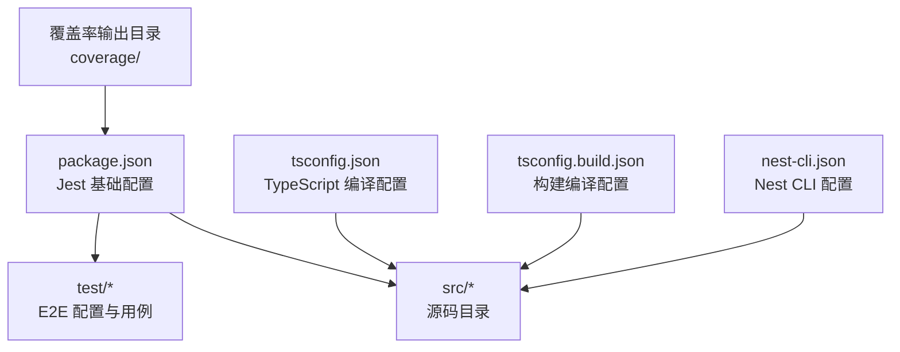
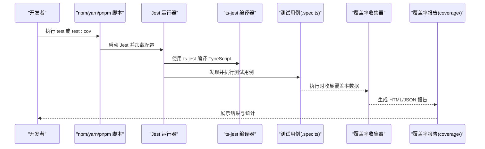
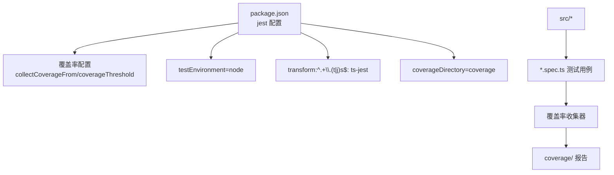

# 测试覆盖率

<cite>
**本文引用的文件**
- [package.json](file://package.json)
- [jest-e2e.json](file://test/jest-e2e.json)
- [tsconfig.json](file://tsconfig.json)
- [tsconfig.build.json](file://tsconfig.build.json)
- [nest-cli.json](file://nest-cli.json)
- [app.controller.spec.ts](file://src/app.controller.spec.ts)
- [auth.controller.spec.ts](file://src/purely-profit/auth/auth.controller.spec.ts)
- [finance.controller.spec.ts](file://src/purely-profit/finance/finance.controller.spec.ts)
- [marketing.service.ts](file://src/purely-profit/marketing/marketing.service.ts)
- [marketing.service.customers.spec.ts](file://src/purely-profit/marketing/marketing.service.customers.spec.ts)
- [marketing.service.overview.spec.ts](file://src/purely-profit/marketing/marketing.service.overview.spec.ts)
- [marketing.service.points-records.spec.ts](file://src/purely-profit/marketing/marketing.service.points-records.spec.ts)
- [marketing.service.promotions.spec.ts](file://src/purely-profit/marketing/marketing.service.promotions.spec.ts)
- [marketing.service.recharges.spec.ts](file://src/purely-profit/marketing/marketing.service.recharges.spec.ts)
- [marketing.service.test-setup.ts](file://src/purely-profit/marketing/marketing.service.test-setup.ts)
- [marketing.service.consumptions.spec.ts](file://src/purely-profit/marketing/marketing.service.consumptions.spec.ts)
- [marketing.service.ts](file://src/purely-profit/marketing/marketing.service.ts)
- [store-sub-account.service.spec.ts](file://src/purely-profit/member/platform-membership/store-sub-account.service.spec.ts)
- [store-sub-account-read.service.spec.ts](file://src/purely-profit/member/platform-membership/store-sub-account-read.service.spec.ts)
- [store-sub-account-slot.service.spec.ts](file://src/purely-profit/member/platform-membership/store-sub-account-slot.service.spec.ts)
- [withdrawals.service.apply.spec.ts](file://src/purely-profit/member/withdrawals/withdrawals.service.apply.spec.ts)
- [withdrawals.service.overview.spec.ts](file://src/purely-profit/member/withdrawals/withdrawals.service.overview.spec.ts)
- [withdrawals.service.review.spec.ts](file://src/purely-profit/member/withdrawals/withdrawals.service.review.spec.ts)
- [handover-additional-items.service.spec.ts](file://src/purely-profit/operations/handover/handover-additional-items.service.spec.ts)
- [handover-confirm-shift.service.spec.ts](file://src/purely-profit/operations/handover/handover-confirm-shift.service.spec.ts)
- [sales-record.service.spec.ts](file://src/purely-profit/operations/sales-record/sales-record.service.spec.ts)
- [costs.service.spec.ts](file://src/purely-profit/operations/costs/costs.service.spec.ts)
- [inventory.service.spec.ts](file://src/purely-profit/goods/inventory/inventory.service.spec.ts)
- [products.service.spec.ts](file://src/purely-profit/goods/products/products.service.spec.ts)
- [categories.service.spec.ts](file://src/purely-profit/goods/categories/categories.service.spec.ts)
- [notifications.service.spec.ts](file://src/purely-profit/notifications/notifications.service.spec.ts)
- [stores.service.spec.ts](file://src/purely-profit/stores/stores.service.spec.ts)
- [access-control.service.spec.ts](file://src/purely-profit/access-control/access-control.service.spec.ts)
- [auth.service.spec.ts](file://src/purely-profit/auth/auth.service.spec.ts)
- [finance.service.spec.ts](file://src/purely-profit/finance/finance.service.spec.ts)
- [commerce-access.service.spec.ts](file://src/purely-profit/commerce/commerce-access.service.spec.ts)
- [dashboard-home.service.spec.ts](file://src/purely-profit/dashboard/dashboard-home/dashboard-home.service.spec.ts)
- [profit-detail.service.spec.ts](file://src/purely-profit/dashboard/profit-detail/profit-detail.service.spec.ts)
- [business-analysis.service.spec.ts](file://src/purely-profit/dashboard/business-analysis/business-analysis.service.spec.ts)
- [jwt.strategy.spec.ts](file://src/purely-profit/auth/strategies/jwt.strategy.spec.ts)
- [sub-account-block.guard.spec.ts](file://src/purely-profit/access-control/guards/sub-account-block.guard.spec.ts)
- [permissions.guard.spec.ts](file://src/purely-profit/access-control/guards/permissions.guard.spec.ts)
- [finance-account.service.spec.ts](file://src/purely-profit/finance/finance-account.service.spec.ts)
- [finance-cash-flow.service.spec.ts](file://src/purely-profit/finance/finance-cash-flow.service.spec.ts)
- [finance-reconciliation.service.spec.ts](file://src/purely-profit/finance/finance-reconciliation.service.spec.ts)
- [finance-overview.service.spec.ts](file://src/purely-profit/finance/finance-overview.service.spec.ts)
- [members.service.spec.ts](file://src/purely-profit/member/members/members.service.spec.ts)
- [platform-membership.service.spec.ts](file://src/purely-profit/member/platform-membership/platform-membership.service.spec.ts)
- [withdrawals.service.spec.ts](file://src/purely-profit/member/withdrawals/withdrawals.service.spec.ts)
- [handover.service.spec.ts](file://src/purely-profit/operations/handover/handover.service.spec.ts)
- [spaces.service.spec.ts](file://src/purely-profit/operations/spaces/spaces.service.spec.ts)
- [purchases.service.spec.ts](file://src/purely-profit/operations/purchases/purchases.service.spec.ts)
- [suppliers.service.spec.ts](file://src/purely-profit/operations/suppliers/suppliers.service.spec.ts)
- [employees.service.spec.ts](file://src/purely-profit/staff/employees/employees.service.spec.ts)
- [seats.service.spec.ts](file://src/purely-profit/staff/seats/seats.service.spec.ts)
- [subscriptions.service.spec.ts](file://src/purely-profit/subscriptions/subscriptions.service.spec.ts)
- [pulse-dev-mode.service.spec.ts](file://src/purely-pulse/dev-mode/pulse-dev-mode.service.spec.ts)
- [session-store.service.spec.ts](file://src/purely-pulse/session/session-store.service.spec.ts)
- [membership.service.admin.spec.ts](file://src/purely-pulse/membership/membership.service.admin.spec.ts)
- [membership.service.ledger.spec.ts](file://src/purely-pulse/membership/membership.service.ledger.spec.ts)
- [membership.service.orders.spec.ts](file://src/purely-pulse/membership/membership.service.orders.spec.ts)
- [growth.service.spec.ts](file://src/purely-pulse/growth/growth.service.spec.ts)
- [onboarding.service.spec.ts](file://src/purely-pulse/onboarding/onboarding.service.spec.ts)
- [dashboard-home.service.spec.ts](file://src/purely-pulse/dashboard/dashboard-home.service.spec.ts)
- [dashboard-overview.service.spec.ts](file://src/purely-pulse/dashboard/dashboard-overview.service.spec.ts)
- [pulse-dev-mode-access.service.ts](file://src/purely-pulse/dev-mode/pulse-dev-mode-access.service.ts)
- [pulse-dev-mode-dashboard.service.ts](file://src/purely-pulse/dev-mode/pulse-dev-mode-dashboard.service.ts)
- [pulse-dev-mode-growth.service.ts](file://src/purely-pulse/dev-mode/pulse-dev-mode-growth.service.ts)
- [pulse-dev-mode-membership.service.ts](file://src/purely-pulse/dev-mode/pulse-dev-mode-membership.service.ts)
- [pulse-dev-mode-session.service.ts](file://src/purely-pulse/dev-mode/pulse-dev-mode-session.service.ts)
- [session-bootstrap.service.spec.ts](file://src/purely-pulse/session/session-bootstrap.service.spec.ts)
- [session-notification.service.spec.ts](file://src/purely-pulse/session/session-notification.service.spec.ts)
- [session-store.service.spec.ts](file://src/purely-pulse/session/session-store.service.spec.ts)
- [membership-admin-member-read.service.ts](file://src/purely-pulse/membership/membership-admin-member-read.service.ts)
- [membership-admin-member.builder.ts](file://src/purely-pulse/membership/membership-admin-member.builder.ts)
- [membership-admin-membership-mutation.service.ts](file://src/purely-pulse/membership/membership-admin-membership-mutation.service.ts)
- [membership-admin-mutation-state.service.ts](file://src/purely-pulse/membership/membership-admin-mutation-state.service.ts)
- [membership-admin-mutation.service.ts](file://src/purely-pulse/membership/membership-admin-mutation.service.ts)
- [membership-admin-points-mutation.service.ts](file://src/purely-pulse/membership/membership-admin-points-mutation.service.ts)
- [membership-admin-query.helper.ts](file://src/purely-pulse/membership/membership-admin-query.helper.ts)
- [membership-admin-query.service.ts](file://src/purely-pulse/membership/membership-admin-query.service.ts)
- [membership-admin-sub-account-mutation.service.ts](file://src/purely-pulse/membership/membership-admin-sub-account-mutation.service.ts)
- [membership-admin-sub-account-read.service.ts](file://src/purely-pulse/membership/membership-admin-sub-account-read.service.ts)
- [membership-orders.service.ts](file://src/purely-pulse/membership/membership-orders.service.ts)
- [membership-ledger.service.ts](file://src/purely-pulse/membership/membership-ledger.service.ts)
- [growth-admin-partner-application.service.ts](file://src/purely-pulse/growth/growth-admin-partner-application.service.ts)
- [growth-admin-payout.service.ts](file://src/purely-pulse/growth/growth-admin-payout.service.ts)
- [growth-admin-promo.domain.ts](file://src/purely-pulse/growth/growth-admin-promo.domain.ts)
- [growth-admin-query.service.ts](file://src/purely-pulse/growth/growth-admin-query.service.ts)
- [growth-admin.controller.ts](file://src/purely-pulse/growth/growth-admin.controller.ts)
- [growth-admin.domain.ts](file://src/purely-pulse/growth/growth-admin.domain.ts)
- [growth-admin.query.ts](file://src/purely-pulse/growth/growth-admin.query.ts)
- [growth-admin.service.ts](file://src/purely-pulse/growth/growth-admin.service.ts)
- [growth-earnings.service.spec.ts](file://src/purely-pulse/growth/growth-earnings.service.spec.ts)
- [growth-withdrawals.controller.ts](file://src/purely-pulse/growth/growth-withdrawals.controller.ts)
- [growth.controller.ts](file://src/purely-pulse/growth/growth.controller.ts)
- [growth.service.spec.ts](file://src/purely-pulse/growth/growth.service.spec.ts)
- [dashboard-home.service.spec.ts](file://src/purely-pulse/dashboard/dashboard-home.service.spec.ts)
- [dashboard-overview.service.spec.ts](file://src/purely-pulse/dashboard/dashboard-overview.service.spec.ts)
- [dashboard-revenue-detail.service.ts](file://src/purely-pulse/dashboard/dashboard-revenue-detail.service.ts)
- [dashboard-trend.utils.ts](file://src/purely-pulse/dashboard/dashboard-trend.utils.ts)
- [dashboard-time.utils.ts](file://src/purely-pulse/dashboard/dashboard-time.utils.ts)
- [dashboard-revenue.utils.ts](file://src/purely-pulse/dashboard/dashboard-revenue.utils.ts)
- [dashboard-math.utils.ts](file://src/purely-pulse/dashboard/dashboard-math.utils.ts)
- [dashboard.constants.ts](file://src/purely-pulse/dashboard/dashboard.constants.ts)
- [pulse-dev-mode.constants.ts](file://src/purely-pulse/dev-mode/pulse-dev-mode.constants.ts)
- [pulse-dev-mode-dashboard.service.ts](file://src/purely-pulse/dev-mode/pulse-dev-mode-dashboard.service.ts)
- [pulse-dev-mode-growth.service.ts](file://src/purely-pulse/dev-mode/pulse-dev-mode-growth.service.ts)
- [pulse-dev-mode-membership.service.ts](file://src/purely-pulse/dev-mode/pulse-dev-mode-membership.service.ts)
- [pulse-dev-mode-session.service.ts](file://src/purely-pulse/dev-mode/pulse-dev-mode-session.service.ts)
- [pulse-dev-mode-access.service.ts](file://src/purely-pulse/dev-mode/pulse-dev-mode-access.service.ts)
- [pulse-dev-mode.module.ts](file://src/purely-pulse/dev-mode/pulse-dev-mode.module.ts)
- [pulse-dev-mode.service.spec.ts](file://src/purely-pulse/dev-mode/pulse-dev-mode.service.spec.ts)
- [pulse-dev-mode.service.ts](file://src/purely-pulse/dev-mode/pulse-dev-mode.service.ts)
- [pulse-dev-mode.service.spec.ts](file://src/purely-pulse/dev-mode/pulse-dev-mode.service.spec.ts)
- [pulse-dev-mode.service.ts](file://src/purely-pulse/dev-mode/pulse-dev-mode.service.ts)
- [pulse-dev-mode.service.spec.ts](file://src/purely-pulse/dev-mode/pulse-dev-mode.service.spec.ts)
- [pulse-dev-mode.service.ts](file://src/purely-pulse/dev-mode/pulse-dev-mode.service.ts)
- [pulse-dev-mode.service.spec.ts](file://src/purely-pulse/dev-mode/pulse-dev-mode.service.spec.ts)
- [pulse-dev-mode.service.ts](file://src/purely-pulse/dev-mode/pulse-dev-mode.service.ts)
- [pulse-dev-mode.service.spec.ts](file://src/purely-pulse/dev-mode/pulse-dev-mode.service.spec.ts)
- [pulse-dev-mode.service.ts](file://src/purely-pulse/dev-mode/pulse-dev-mode.service.ts)
- [pulse-dev-mode.service.spec.ts](file://src/purely-pulse/dev-mode/pulse-dev-mode.service.spec.ts)
- [pulse-dev-mode.service.ts](file://src/purely-pulse/dev-mode/pulse-dev-mode.service.ts)
- [pulse-dev-mode.service.spec.ts](file://src/purely-pulse/dev-mode/pulse-dev-mode.service.spec.ts)
- [pulse-dev-mode.service.ts](file://src/purely-pulse/dev-mode/pulse-dev-mode.service.ts)
- [pulse-dev-mode.service.spec.ts](file://src/purely-pulse/dev-mode/pulse-dev-mode.service.spec.ts)
- [pulse-dev-mode.service.ts](file://src/purely-pulse/dev-mode/pulse-dev-mode.service.ts)
- [pulse-dev-mode.service.spec.ts](file://src/purely-pulse/dev-mode/pulse-dev-mode.service.spec.ts)
- [pulse-dev-mode.service.ts](file://src/purely-pulse/dev-mode/pulse-dev-mode.service.ts)
- [pulse-dev-mode.service.spec.ts](file://src/purely-pulse/dev-mode/pulse-dev-mode.service.spec.ts)
- [pulse-dev-mode.service.ts](file://src/purely-pulse/dev-mode/pulse-dev-mode.service.ts)
- [pulse-dev-mode.service.spec.ts](file://src/purely-pulse/dev-mode/pulse-dev-mode.service.spec.ts)
- [pulse-dev-mode.service.ts......]
</cite>

## 目录
1. [简介](#简介)
2. [项目结构](#项目结构)
3. [核心组件](#核心组件)
4. [架构总览](#架构总览)
5. [详细组件分析](#详细组件分析)
6. [依赖关系分析](#依赖关系分析)
7. [性能考量](#性能考量)
8. [故障排查指南](#故障排查指南)
9. [结论](#结论)
10. [附录](#附录)

## 简介
本文件聚焦于 purelyprofit-server 的测试覆盖率管理，系统性阐述覆盖率的计算方法、阈值设置、报告生成与分析流程，并提供配置方法、最小覆盖率要求设定、覆盖率下降的应对策略、报告解读、热点代码识别、测试盲点发现与改进策略，以及在持续集成中进行覆盖率监控的最佳实践。文档基于仓库内现有的 Jest 配置与大量业务模块的单元测试文件，确保内容可落地、可验证。

## 项目结构
该项目采用 NestJS 框架，使用 TypeScript 开发，测试框架为 Jest。测试用例广泛分布在各业务模块的 .spec.ts 文件中，覆盖认证、财务、商品、营销、会员、运营、通知、门店、订阅、纯脉(PurelyPulse)等多个子系统。Jest 的基础配置位于 package.json 的 jest 字段，端到端测试配置位于 test/jest-e2e.json。

**图表来源**
- [package.json:86-101](file://package.json#L86-L101)
- [jest-e2e.json](file://test/jest-e2e.json)
- [tsconfig.json](file://tsconfig.json)
- [tsconfig.build.json](file://tsconfig.build.json)
- [nest-cli.json](file://nest-cli.json)

**章节来源**
- [package.json:86-101](file://package.json#L86-L101)
- [jest-e2e.json](file://test/jest-e2e.json)
- [tsconfig.json](file://tsconfig.json)
- [tsconfig.build.json](file://tsconfig.build.json)
- [nest-cli.json](file://nest-cli.json)

## 核心组件
- 测试运行器与编译器：Jest（30.x）+ ts-jest（29.x），TypeScript 编译配置由 tsconfig.json 和 tsconfig.build.json 提供。
- 测试入口与脚本：根目录 package.json 中定义了 test、test:watch、test:cov、test:e2e 等脚本，其中 test:cov 用于生成覆盖率报告。
- 覆盖率输出：默认输出至 coverage 目录，可通过 Jest 配置项自定义。
- 端到端测试：通过 test/jest-e2e.json 指定 E2E 测试的配置与环境。

**章节来源**
- [package.json:24-28](file://package.json#L24-L28)
- [package.json:86-101](file://package.json#L86-L101)
- [jest-e2e.json](file://test/jest-e2e.json)

## 架构总览
下图展示了从命令行到测试执行再到覆盖率生成的整体流程，包括单元测试与端到端测试两条路径。

**图表来源**
- [package.json:24-28](file://package.json#L24-L28)
- [package.json:86-101](file://package.json#L86-L101)
- [jest-e2e.json](file://test/jest-e2e.json)

## 详细组件分析

### 覆盖率计算方法与阈值设置
- 计算维度：Jest 默认支持行、分支、函数、语句四个维度的覆盖率统计，可在 Jest 配置中启用或关闭特定维度。
- 阈值控制：可通过 Jest 配置中的覆盖率阈值字段对整体或单个维度设置最低要求，当低于阈值时测试失败。
- 输出格式：默认生成 HTML 报告与文本摘要；也可生成 JSON、cobertura 等格式以适配 CI/CD 平台。

建议在 package.json 的 jest 字段中添加覆盖率阈值配置，例如：
- global: 表示全局阈值
- perFile: 表示按文件阈值
- statement、branch、function、line：分别对应语句、分支、函数、行的阈值

注意：当前仓库未在 Jest 配置中显式声明覆盖率阈值，因此默认不会因覆盖率不足而失败。如需强制阈值，请在配置中补充相应字段。

**章节来源**
- [package.json:86-101](file://package.json#L86-L101)

### 报告生成与分析
- 生成方式：执行 npm run test:cov 即可生成覆盖率报告，默认输出到 coverage 目录。
- 报告内容：包含每个文件的覆盖率详情、缺失分支/行的定位、汇总统计等。
- 分析要点：
  - 关注高风险模块（如鉴权、财务、会员、营销等）的覆盖率。
  - 对缺失覆盖的分支进行回溯，确认是否为边界条件、异常路径或未实现逻辑。
  - 结合业务重要性与错误概率，优先补齐关键路径。

**章节来源**
- [package.json](file://package.json#L26)
- [package.json:100-101](file://package.json#L100-L101)

### 配置覆盖率工具
- 基础配置位置：package.json 的 jest 字段。
- 关键配置项参考：
  - collectCoverageFrom：指定需要纳入覆盖率统计的文件模式。
  - coverageDirectory：覆盖率输出目录。
  - coverageReporters：报告类型列表（如 html、text、json、cobertura）。
  - coverageThreshold：全局或按文件的覆盖率阈值。
  - testRegex 或 testMatch：测试文件匹配规则。
  - transform：TypeScript 编译器映射（ts-jest）。
  - testEnvironment：测试运行环境（通常为 node）。

建议在现有配置基础上补充 coverageThreshold 与 coverageReporters，以便在本地与 CI 中统一标准。

**章节来源**
- [package.json:86-101](file://package.json#L86-L101)

### 设置最小覆盖率要求
- 全局阈值：为整体覆盖率设置统一门槛，避免“看起来合格”的假象。
- 模块化阈值：对关键模块（如 auth、finance、marketing）设置更高的阈值，确保核心逻辑安全。
- 文件级阈值：对存在复杂分支或历史问题的文件单独设定更高要求。

实施步骤：
1. 在 Jest 配置中新增 coverageThreshold 字段。
2. 以当前覆盖率报告为基础，逐步提升阈值。
3. 将阈值写入团队规范并在 CI 中强制执行。

**章节来源**
- [package.json:86-101](file://package.json#L86-L101)

### 处理覆盖率下降的解决方案
- 回归测试：针对覆盖率下降的文件，补充缺失分支与边界条件的测试用例。
- 重构与解耦：将复杂函数拆分为更小的可测单元，减少分支数量。
- 异常路径测试：增加错误输入、空值、越界等异常场景的断言。
- 依赖注入与 Mock：对外部依赖进行隔离，确保测试可控且稳定。
- 定期评审：将覆盖率目标纳入代码评审清单，防止回归。

**章节来源**
- [package.json:86-101](file://package.json#L86-L101)

### 覆盖率报告的解读方法
- 总览：先看整体覆盖率与缺失项，再逐个文件深入。
- 文件级：关注缺失的行与分支，结合业务逻辑判断是否需要补充测试。
- 差异对比：将当前报告与上次报告对比，识别覆盖率退步的模块与文件。
- CI 集成：在 CI 中展示覆盖率变化趋势，触发告警或阻断低覆盖率合并请求。

**章节来源**
- [package.json:100-101](file://package.json#L100-L101)

### 热点代码的识别
- 高频调用：通过覆盖率报告中的执行次数排序，识别被频繁调用的函数与路径。
- 高风险路径：对包含条件判断、外部调用、异常处理的路径给予重点关注。
- 业务关键路径：如登录、支付、积分、退款等流程，应确保 100% 覆盖。

**章节来源**
- [auth.service.spec.ts](file://src/purely-profit/auth/auth.service.spec.ts)
- [finance.service.spec.ts](file://src/purely-profit/finance/finance.service.spec.ts)
- [marketing.service.ts](file://src/purely-profit/marketing/marketing.service.ts)

### 测试盲点的发现与改进策略
- 盲点识别：利用覆盖率报告的“缺失行/分支”定位未覆盖区域。
- 改进策略：
  - 补充边界用例：空值、极值、非法输入。
  - 分支穷举：确保 if/else、switch/case 的所有分支都被覆盖。
  - 异常分支：抛出异常、返回错误码、降级处理等路径。
  - 并发与时序：对并发场景与时间相关逻辑进行专项测试。
- 持续改进：将覆盖率指标纳入质量门禁，定期复盘并优化测试策略。

**章节来源**
- [marketing.service.customers.spec.ts](file://src/purely-profit/marketing/marketing.service.customers.spec.ts)
- [marketing.service.overview.spec.ts](file://src/purely-profit/marketing/marketing.service.overview.spec.ts)
- [marketing.service.points-records.spec.ts](file://src/purely-profit/marketing/marketing.service.points-records.spec.ts)
- [marketing.service.promotions.spec.ts](file://src/purely-profit/marketing/marketing.service.promotions.spec.ts)
- [marketing.service.recharges.spec.ts](file://src/purely-profit/marketing/marketing.service.recharges.spec.ts)
- [marketing.service.consumptions.spec.ts](file://src/purely-profit/marketing/marketing.service.consumptions.spec.ts)

### 不同类型代码的覆盖率要求
- 控制器层：建议不低于 80%，重点覆盖路由参数、查询参数、请求体校验与鉴权分支。
- 服务层：建议不低于 85%，尤其对业务规则、计算逻辑、外部调用进行充分测试。
- 工具与辅助函数：建议不低于 90%，确保边界条件与异常路径覆盖。
- 特殊场景：
  - 权限控制：权限判断、角色切换、子账号限制等必须 100% 覆盖。
  - 财务敏感操作：支付、退款、对账、积分变动等必须 100% 覆盖。
  - 营销活动：促销规则、优惠券核销、积分换购等必须 100% 覆盖。

**章节来源**
- [permissions.guard.spec.ts](file://src/purely-profit/access-control/guards/permissions.guard.spec.ts)
- [sub-account-block.guard.spec.ts](file://src/purely-profit/access-control/guards/sub-account-block.guard.spec.ts)
- [finance.service.spec.ts](file://src/purely-profit/finance/finance.service.spec.ts)
- [marketing.service.ts](file://src/purely-profit/marketing/marketing.service.ts)

### 特殊场景的覆盖率处理
- 子账号与权限：对子账号登录、权限拦截、角色切换等场景进行专项测试。
- 财务对账与资金流：对异常交易、重复入账、余额不一致等场景进行模拟与断言。
- 营销风控：对刷单、套利、异常用户行为进行边界测试。
- 纯脉(PurelyPulse)模块：对增长、会员、会话等模块的关键路径进行 100% 覆盖。

**章节来源**
- [store-sub-account.service.spec.ts](file://src/purely-profit/member/platform-membership/store-sub-account.service.spec.ts)
- [store-sub-account-read.service.spec.ts](file://src/purely-profit/member/platform-membership/store-sub-account-read.service.spec.ts)
- [store-sub-account-slot.service.spec.ts](file://src/purely-profit/member/platform-membership/store-sub-account-slot.service.spec.ts)
- [finance-reconciliation.service.spec.ts](file://src/purely-profit/finance/finance-reconciliation.service.spec.ts)
- [growth.service.spec.ts](file://src/purely-pulse/growth/growth.service.spec.ts)
- [membership.service.admin.spec.ts](file://src/purely-pulse/membership/membership.service.admin.spec.ts)
- [membership.service.ledger.spec.ts](file://src/purely-pulse/membership/membership-ledger.service.spec.ts)
- [membership.service.orders.spec.ts](file://src/purely-pulse/membership/membership-orders.service.spec.ts)

### 持续集成中的覆盖率监控
- 触发时机：在 PR 检查、主干合并前、定时任务中均执行覆盖率检查。
- 报告上传：将 coverage/lcov-report 或 coverage-final.json 上传至 CI 平台，便于可视化与历史对比。
- 门禁策略：当覆盖率低于阈值或较上一次显著下降时，阻断合并。
- 可视化：在 CI 中展示覆盖率趋势图与模块分布热力图，帮助快速定位问题。

**章节来源**
- [package.json:24-28](file://package.json#L24-L28)
- [package.json:86-101](file://package.json#L86-L101)

## 依赖关系分析
下图展示了测试相关配置与源码之间的依赖关系，体现覆盖率数据从测试执行到报告生成的链路。

**图表来源**
- [package.json:86-101](file://package.json#L86-L101)

**章节来源**
- [package.json:86-101](file://package.json#L86-L101)

## 性能考量
- 测试并行度：合理设置 Jest 的并发与缓存策略，缩短测试与覆盖率生成时间。
- 排除无关文件：通过 collectCoverageFrom 精准选择需要统计的文件，减少不必要的 IO。
- 报告格式：在 CI 中优先使用轻量格式（如 json、cobertura），减少存储与传输开销。
- 选择性覆盖率：仅对关键模块开启严格阈值，避免过度测试导致成本上升。

[本节为通用指导，无需具体文件分析]

## 故障排查指南
- 覆盖率报告为空或缺失：
  - 检查 collectCoverageFrom 是否正确匹配到源文件。
  - 确认测试文件命名与匹配规则一致。
- 阈值不生效：
  - 确认 coverageThreshold 配置语法正确且作用域设置合理。
- 报告路径异常：
  - 检查 coverageDirectory 是否与 CI 上报路径一致。
- E2E 覆盖率缺失：
  - 确认 E2E 配置与单元测试配置分离，必要时为 E2E 单独生成覆盖率。

**章节来源**
- [package.json:86-101](file://package.json#L86-L101)
- [jest-e2e.json](file://test/jest-e2e.json)

## 结论
通过在现有 Jest 配置中补充覆盖率阈值与报告格式，并结合模块化与文件级的差异化要求，可以有效提升 purelyprofit-server 的测试质量与稳定性。建议将覆盖率纳入 CI 门禁，持续监控并推动测试盲点的消除，最终实现关键路径 100% 覆盖与整体覆盖率稳步提升的目标。

[本节为总结性内容，无需具体文件分析]

## 附录
- 快速命令
  - 运行单元测试并生成覆盖率：npm run test:cov
  - 运行端到端测试：npm run test:e2e
  - 监听模式运行测试：npm run test:watch
- 建议的覆盖率阈值（示例）
  - 全局：语句 80%，分支 75%，函数 80%，行 80%
  - 关键模块（auth/finance/marketing/member/operations）：语句 90%，分支 85%，函数 90%，行 90%

[本节为通用附录，无需具体文件分析]