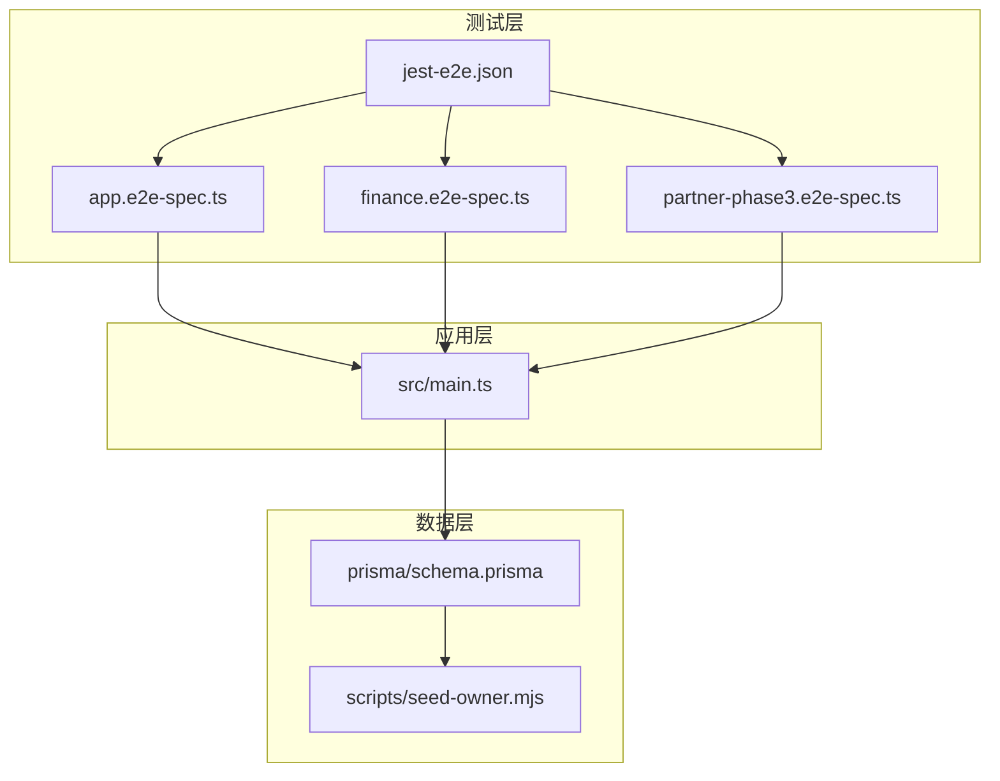
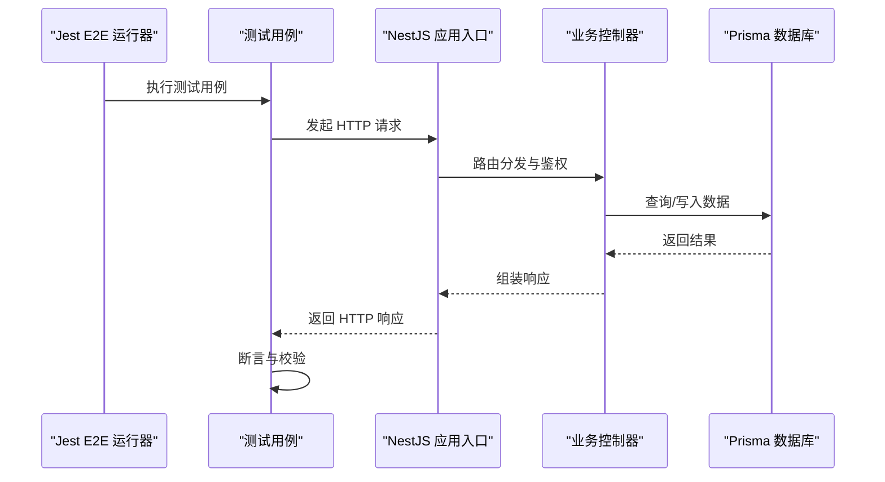
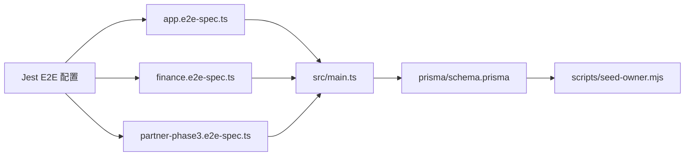

# 端到端测试

<cite>
**本文引用的文件**
- [test/app.e2e-spec.ts](file://test/app.e2e-spec.ts)
- [test/finance.e2e-spec.ts](file://test/finance.e2e-spec.ts)
- [test/partner-phase3.e2e-spec.ts](file://test/partner-phase3.e2e-spec.ts)
- [test/jest-e2e.json](file://test/jest-e2e.json)
- [src/main.ts](file://src/main.ts)
- [package.json](file://package.json)
- [prisma/schema.prisma](file://prisma/schema.prisma)
- [scripts/seed-owner.mjs](file://scripts/seed-owner.mjs)
- [README.md](file://README.md)
</cite>

## 目录
1. [引言](#引言)
2. [项目结构](#项目结构)
3. [核心组件](#核心组件)
4. [架构总览](#架构总览)
5. [详细组件分析](#详细组件分析)
6. [依赖关系分析](#依赖关系分析)
7. [性能考虑](#性能考虑)
8. [故障排除指南](#故障排除指南)
9. [结论](#结论)
10. [附录](#附录)

## 引言
本文件面向 purelyprofit-server 的端到端测试（E2E），系统性阐述测试设计原则、测试场景规划与 API 流程测试方法；详述测试环境搭建、数据库初始化与清理、测试数据准备；提供用户认证、财务操作、合作伙伴等关键业务场景的 E2E 测试示例路径；覆盖测试配置、并行执行策略、结果分析与报告生成。

## 项目结构
当前仓库包含基于 Jest 的 E2E 测试套件，位于 test/ 目录下，分别覆盖应用基础功能、财务模块与合作伙伴流程。应用入口在 src/main.ts，测试运行配置在 test/jest-e2e.json，包管理与脚本在 package.json 中定义，数据库模式在 prisma/schema.prisma，初始数据种子在 scripts/seed-owner.mjs。

**图表来源**
- [test/app.e2e-spec.ts](file://test/app.e2e-spec.ts)
- [test/finance.e2e-spec.ts](file://test/finance.e2e-spec.ts)
- [test/partner-phase3.e2e-spec.ts](file://test/partner-phase3.e2e-spec.ts)
- [test/jest-e2e.json](file://test/jest-e2e.json)
- [src/main.ts](file://src/main.ts)
- [prisma/schema.prisma](file://prisma/schema.prisma)
- [scripts/seed-owner.mjs](file://scripts/seed-owner.mjs)

**章节来源**
- [test/app.e2e-spec.ts](file://test/app.e2e-spec.ts)
- [test/finance.e2e-spec.ts](file://test/finance.e2e-spec.ts)
- [test/partner-phase3.e2e-spec.ts](file://test/partner-phase3.e2e-spec.ts)
- [test/jest-e2e.json](file://test/jest-e2e.json)
- [src/main.ts](file://src/main.ts)
- [prisma/schema.prisma](file://prisma/schema.prisma)
- [scripts/seed-owner.mjs](file://scripts/seed-owner.mjs)

## 核心组件
- 测试运行器与配置：Jest E2E 配置位于 test/jest-e2e.json，定义了测试入口、超时、覆盖率与报告输出等。
- 应用入口：src/main.ts 提供 NestJS 应用启动逻辑，E2E 测试通过 httpAgent 或测试客户端连接该入口。
- 数据库与种子：prisma/schema.prisma 定义模型与关系；scripts/seed-owner.mjs 提供初始管理员账户数据，便于认证与权限测试。
- 模块化测试文件：
  - app.e2e-spec.ts：应用基础功能与通用流程测试。
  - finance.e2e-spec.ts：财务相关接口与报表流程测试。
  - partner-phase3.e2e-spec.ts：合作伙伴流程相关测试。

**章节来源**
- [test/jest-e2e.json](file://test/jest-e2e.json)
- [src/main.ts](file://src/main.ts)
- [prisma/schema.prisma](file://prisma/schema.prisma)
- [scripts/seed-owner.mjs](file://scripts/seed-owner.mjs)
- [test/app.e2e-spec.ts](file://test/app.e2e-spec.ts)
- [test/finance.e2e-spec.ts](file://test/finance.e2e-spec.ts)
- [test/partner-phase3.e2e-spec.ts](file://test/partner-phase3.e2e-spec.ts)

## 架构总览
E2E 测试通过 Jest 启动，连接应用入口，调用各模块控制器暴露的 HTTP 接口，验证请求响应、状态码、数据一致性与业务规则。数据库由 Prisma 管理，测试前进行迁移与种子注入，测试后可回滚或重建。

**图表来源**
- [src/main.ts](file://src/main.ts)
- [test/app.e2e-spec.ts](file://test/app.e2e-spec.ts)
- [test/finance.e2e-spec.ts](file://test/finance.e2e-spec.ts)
- [test/partner-phase3.e2e-spec.ts](file://test/partner-phase3.e2e-spec.ts)

## 详细组件分析

### 测试运行与配置（Jest E2E）
- 配置项要点：测试入口、超时时间、覆盖率收集、报告输出格式、全局初始化/清理钩子。
- 并行策略：可通过配置控制并发 worker 数量与测试文件间的隔离级别。
- 报告生成：支持 JSON、HTML、JUNIT 等多种报告格式，便于 CI 集成与结果分析。

**章节来源**
- [test/jest-e2e.json](file://test/jest-e2e.json)

### 应用入口与生命周期（NestJS）
- 应用启动：在测试环境中以测试模式启动，避免生产级中间件与日志干扰。
- 请求处理：路由解析、守卫/拦截器、业务服务与数据访问层串联。
- 关闭与清理：测试结束后释放资源，确保数据库连接与缓存状态一致。

**章节来源**
- [src/main.ts](file://src/main.ts)

### 数据库与种子（Prisma）
- 模式定义：schema.prisma 描述模型、索引与外键关系，支撑多模块数据一致性。
- 初始化：通过迁移与种子脚本注入基础数据（如管理员账户），确保认证与权限测试可用。
- 清理策略：建议在每个测试用例前后进行事务回滚或表清空，保证测试隔离性。

**章节来源**
- [prisma/schema.prisma](file://prisma/schema.prisma)
- [scripts/seed-owner.mjs](file://scripts/seed-owner.mjs)

### 认证流程测试（登录、会话、权限）
- 场景设计：
  - 正常注册与登录，获取访问令牌。
  - 使用令牌访问受保护接口，验证权限守卫生效。
  - 无权限访问与无效令牌的错误处理。
- 关键断言：HTTP 状态码、响应体字段、JWT 令牌有效性、权限范围匹配。
- 示例路径参考：[认证控制器测试](file://test/app.e2e-spec.ts)

**章节来源**
- [test/app.e2e-spec.ts](file://test/app.e2e-spec.ts)

### 财务模块测试（账户、现金流、对账、报表）
- 场景设计：
  - 财务账户查询与创建。
  - 现金流记录的增删改查与汇总。
  - 对账流程与差异处理。
  - 报表导出与筛选条件校验。
- 关键断言：金额精度、时间范围、科目分类、汇总一致性。
- 示例路径参考：[财务模块测试](file://test/finance.e2e-spec.ts)

**章节来源**
- [test/finance.e2e-spec.ts](file://test/finance.e2e-spec.ts)

### 合作伙伴流程测试（申请、审核、提现）
- 场景设计：
  - 合作伙伴信息提交与状态变更。
  - 审核流程与通知联动。
  - 提现申请与打款状态跟踪。
- 关键断言：状态机转换、权限校验、资金流水与余额变动。
- 示例路径参考：[合作伙伴流程测试](file://test/partner-phase3.e2e-spec.ts)

**章节来源**
- [test/partner-phase3.e2e-spec.ts](file://test/partner-phase3.e2e-spec.ts)

### 通用业务流程测试（商品、会员、营销）
- 商品与库存：类目管理、商品上下架、库存扣减与预警。
- 会员与积分：会员等级、积分增减、消费抵扣。
- 营销活动：优惠券、促销活动与使用限制。
- 关键断言：业务规则一致性、并发安全、数据完整性。

**章节来源**
- [test/app.e2e-spec.ts](file://test/app.e2e-spec.ts)

## 依赖关系分析
E2E 测试与应用模块的耦合关系如下：

**图表来源**
- [test/jest-e2e.json](file://test/jest-e2e.json)
- [test/app.e2e-spec.ts](file://test/app.e2e-spec.ts)
- [test/finance.e2e-spec.ts](file://test/finance.e2e-spec.ts)
- [test/partner-phase3.e2e-spec.ts](file://test/partner-phase3.e2e-spec.ts)
- [src/main.ts](file://src/main.ts)
- [prisma/schema.prisma](file://prisma/schema.prisma)
- [scripts/seed-owner.mjs](file://scripts/seed-owner.mjs)

**章节来源**
- [test/jest-e2e.json](file://test/jest-e2e.json)
- [src/main.ts](file://src/main.ts)
- [prisma/schema.prisma](file://prisma/schema.prisma)
- [scripts/seed-owner.mjs](file://scripts/seed-owner.mjs)

## 性能考虑
- 并行执行：合理设置并发 worker 数量，避免数据库连接争用；对共享资源（如 Redis、缓存）进行隔离。
- 数据隔离：使用事务回滚或独立测试数据库实例，减少跨用例污染。
- 超时与重试：为网络不稳定场景设置合理的超时与重试策略，避免偶发失败影响整体结果。
- 报告与度量：生成测试报告与性能指标，辅助定位瓶颈与回归风险。

## 故障排除指南
- 数据库未初始化：确认迁移与种子脚本已执行，检查连接字符串与权限。
- 权限不足：核对认证令牌与角色权限，确保测试账户具备所需能力。
- 并发冲突：检查是否存在竞态条件，必要时引入锁或幂等设计。
- 报告缺失：检查 Jest 配置中的报告输出路径与格式，确保 CI 环境可读取。

**章节来源**
- [test/jest-e2e.json](file://test/jest-e2e.json)
- [prisma/schema.prisma](file://prisma/schema.prisma)
- [scripts/seed-owner.mjs](file://scripts/seed-owner.mjs)

## 结论
通过模块化的 E2E 测试设计与完善的数据库初始化/清理策略，可以有效保障认证、财务、合作伙伴等关键业务场景的稳定性与正确性。结合并行执行与报告分析，能够在 CI 环境中持续发现回归问题，提升交付质量。

## 附录
- 快速开始：安装依赖后，使用包管理命令运行 E2E 测试；根据需要调整数据库与报告配置。
- 参考文档：应用启动入口与模块组织可参考应用入口与模块文件；数据库模式与种子脚本可参考 Prisma 与种子文件。

**章节来源**
- [package.json](file://package.json)
- [README.md](file://README.md)
- [src/main.ts](file://src/main.ts)
- [prisma/schema.prisma](file://prisma/schema.prisma)
- [scripts/seed-owner.mjs](file://scripts/seed-owner.mjs)