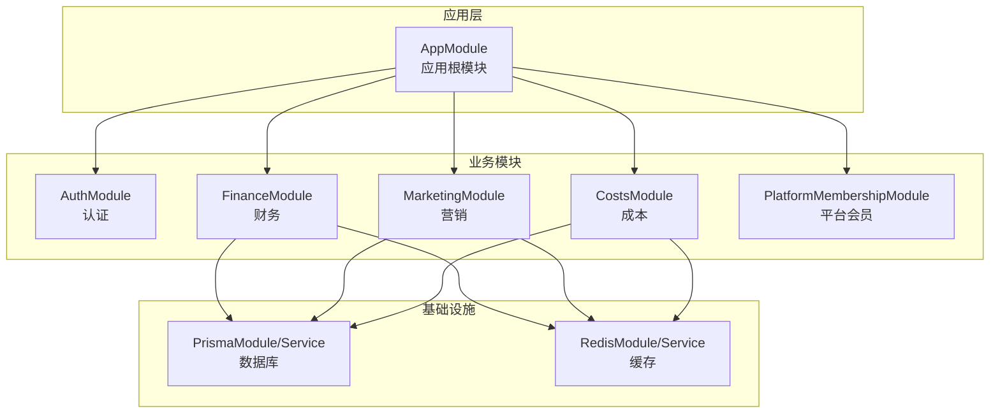
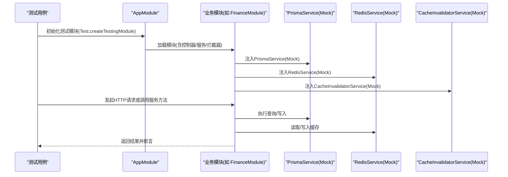
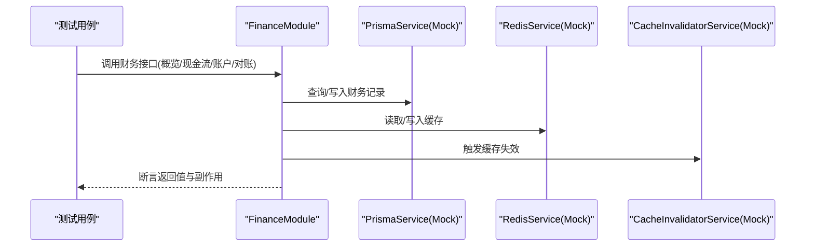
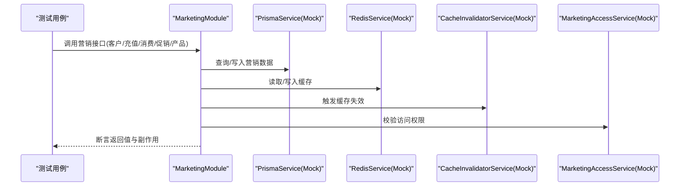
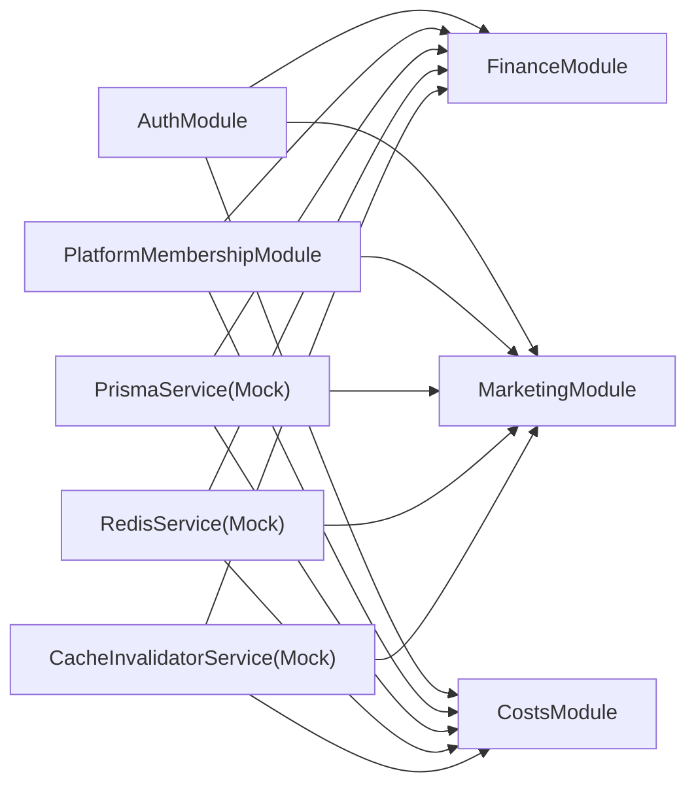

# 集成测试

<cite>
**本文引用的文件**
- [src/app.module.ts](file://src/app.module.ts)
- [src/prisma/prisma.module.ts](file://src/prisma/prisma.module.ts)
- [src/prisma/prisma.service.ts](file://src/prisma/prisma.service.ts)
- [src/redis/redis.module.ts](file://src/redis/redis.module.ts)
- [src/redis/redis.service.ts](file://src/redis/redis.service.ts)
- [src/redis/cache-invalidator.service.ts](file://src/redis/cache-invalidator.service.ts)
- [src/purely-profit/auth/auth.module.ts](file://src/purely-profit/auth/auth.module.ts)
- [src/purely-profit/finance/finance.module.ts](file://src/purely-profit/finance/finance.module.ts)
- [src/purely-profit/marketing/marketing.module.ts](file://src/purely-profit/marketing/marketing.module.ts)
- [src/purely-profit/member/platform-membership/platform-membership.module.ts](file://src/purely-profit/member/platform-membership/platform-membership.module.ts)
- [src/purely-profit/operations/costs/costs.module.ts](file://src/purely-profit/operations/costs/costs.module.ts)
- [src/purely-profit/marketing/marketing.service.test-setup.ts](file://src/purely-profit/marketing/marketing.service.test-setup.ts)
- [src/purely-profit/finance/finance.spec-helpers.ts](file://src/purely-profit/finance/finance.spec-helpers.ts)
- [src/purely-profit/operations/costs/costs.spec-helpers.ts](file://src/purely-profit/operations/costs/costs.spec-helpers.ts)
- [test/app.e2e-spec.ts](file://test/app.e2e-spec.ts)
- [test/finance.e2e-spec.ts](file://test/finance.e2e-spec.ts)
- [test/partner-phase3.e2e-spec.ts](file://test/partner-phase3.e2e-spec.ts)
- [test/jest-e2e.json](file://test/jest-e2e.json)
- [prisma/schema.prisma](file://prisma/schema.prisma)
- [prisma/migrations/20260512093539_init/migration.sql](file://prisma/migrations/20260512093539_init/migration.sql)
- [prisma/migrations/20260512110000_add_stores/migration.sql](file://prisma/migrations/20260512110000_add_stores/migration.sql)
- [prisma/migrations/20260512113000_add_staffs/migration.sql](file://prisma/migrations/20260512113000_add_staffs/migration.sql)
- [prisma/migrations/20260512121000_staff_permissions/migration.sql](file://prisma/migrations/20260512121000_staff_permissions/migration.sql)
- [prisma/migrations/20260512130000_store_seats_and_staff_status/migration.sql](file://prisma/migrations/20260512130000_store_seats_and_staff_status/migration.sql)
- [prisma/migrations/20260513110000_add_store_subscriptions/migration.sql](file://prisma/migrations/20260513110000_add_store_subscriptions/migration.sql)
- [prisma/migrations/20260513130000_add_performance_indexes/migration.sql](file://prisma/migrations/20260513130000_add_performance_indexes/migration.sql)
- [prisma/migrations/20260513143000_add_list_filter_indexes/migration.sql](file://prisma/migrations/20260513143000_add_list_filter_indexes/migration.sql)
- [prisma/migrations/20260513160000_lock_single_account_single_store/migration.sql](file://prisma/migrations/20260513160000_lock_single_account_single_store/migration.sql)
- [prisma/migrations/20260513170000_add_members/migration.sql](file://prisma/migrations/20260513170000_add_members/migration.sql)
- [prisma/migrations/20260513180000_add_member_points_logs/migration.sql](file://prisma/migrations/20260513180000_add_member_points_logs/migration.sql)
- [prisma/migrations/20260513193000_align_members_for_purelypulse/migration.sql](file://prisma/migrations/20260513193000_align_members_for_purelypulse/migration.sql)
- [prisma/migrations/20260513200000_add_employee_management/migration.sql](file://prisma/migrations/20260513200000_add_employee_management/migration.sql)
- [prisma/migrations/20260513210000_add_user_profile_fields/migration.sql](file://prisma/migrations/20260513210000_add_user_profile_fields/migration.sql)
- [prisma/migrations/20260513223000_add_member_bean_logs_and_points_sources/migration.sql](file://prisma/migrations/20260513223000_add_member_bean_logs_and_points_sources/migration.sql)
- [prisma/migrations/20260513230000_add_member_recharge_logs/migration.sql](file://prisma/migrations/20260513230000_add_member_recharge_logs/migration.sql)
- [prisma/migrations/20260514064726_add_marketing_module/migration.sql](file://prisma/migrations/20260514064726_add_marketing_module/migration.sql)
- [prisma/migrations/20260514153000_add_store_partners_and_withdrawals/migration.sql](file://prisma/migrations/20260514153000_add_store_partners_and_withdrawals/migration.sql)
- [prisma/migrations/20260514183000_add_platform_membership_orders/migration.sql](file://prisma/migrations/20260514183000_add_platform_membership_orders/migration.sql)
- [prisma/migrations/20260514210000_add_commerce_inventory/migration.sql](file://prisma/migrations/20260514210000_add_commerce_inventory/migration.sql)
- [prisma/migrations/20260514213000_add_finance_management/migration.sql](file://prisma/migrations/20260514213000_add_finance_management/migration.sql)
- [prisma/migrations/20260514223000_add_business_analysis_sales_orders/migration.sql](file://prisma/migrations/20260514223000_add_business_analysis_sales_orders/migration.sql)
- [prisma/migrations/20260514234000_add_cost_management/migration.sql](file://prisma/migrations/20260514234000_add_cost_management/migration.sql)
- [prisma/migrations/20260515001000_link_sales_orders_to_finance_and_inventory/migration.sql](file://prisma/migrations/20260515001000_link_sales_orders_to_finance_and_inventory/migration.sql)
- [prisma/migrations/20260515013000_add_space_management_and_reservations/migration.sql](file://prisma/migrations/20260515013000_add_space_management_and_reservations/migration.sql)
- [prisma/migrations/20260515023000_add_space_sessions/migration.sql](file://prisma/migrations/20260515023000_add_space_sessions/migration.sql)
- [prisma/migrations/20260515110000_expand_platform_membership_center/migration.sql](file://prisma/migrations/20260515110000_expand_platform_membership_center/migration.sql)
- [prisma/migrations/20260515123000_add_partner_application_history/migration.sql](file://prisma/migrations/20260515123000_add_partner_application_history/migration.sql)
- [prisma/migrations/20260515133000_add_marketing_points_records/migration.sql](file://prisma/migrations/20260515133000_add_marketing_points_records/migration.sql)
- [prisma/migrations/20260523120000_add_membership_plan_settings/migration.sql](file://prisma/migrations/20260523120000_add_membership_plan_settings/migration.sql)
- [prisma/migrations/20260523170000_add_lifetime_membership_cycle/migration.sql](file://prisma/migrations/20260523170000_add_lifetime_membership_cycle/migration.sql)
- [prisma/migrations/20260523183000_backfill_lifetime_membership_valid_days_730/migration.sql](file://prisma/migrations/20260523183000_backfill_lifetime_membership_valid_days_730/migration.sql)
- [prisma/migrations/20260529120000_support_multiple_store_partners/migration.sql](file://prisma/migrations/20260529120000_support_multiple_store_partners/migration.sql)
- [prisma/migrations/20260530123935_sync_sub_account_schema/migration.sql](file://prisma/migrations/20260530123935_sync_sub_account_schema/migration.sql)
- [prisma/migrations/20260601120000_add_manager_sub_account_role/migration.sql](file://prisma/migrations/20260601120000_add_manager_sub_account_role/migration.sql)
- [prisma/migrations/20260601143000_add_handover_additional_items/migration.sql](file://prisma/migrations/20260601143000_add_handover_additional_items/migration.sql)
- [prisma/migrations/20260601170000_add_employee_shift_definitions/migration.sql](file://prisma/migrations/20260601170000_add_employee_shift_definitions/migration.sql)
- [prisma/migrations/20260605183000_add_handover_record_shift_snapshots/migration.sql](file://prisma/migrations/20260605183000_add_handover_record_shift_snapshots/migration.sql)
- [prisma/migrations/20260606123000_add_marketing_products/migration.sql](file://prisma/migrations/20260606123000_add_marketing_products/migration.sql)
</cite>

## 目录
1. [引言](#引言)
2. [项目结构](#项目结构)
3. [核心组件](#核心组件)
4. [架构总览](#架构总览)
5. [详细组件分析](#详细组件分析)
6. [依赖分析](#依赖分析)
7. [性能考虑](#性能考虑)
8. [故障排查指南](#故障排查指南)
9. [结论](#结论)
10. [附录](#附录)

## 引言
本文件面向 purelyprofit-server 的集成测试实践，系统化阐述模块间交互测试、服务依赖关系验证、数据库连接与迁移测试、缓存系统测试、第三方服务（如 Redis）集成策略，以及事务性测试的处理方式。文档同时给出 AuthModule、StoresModule、FinanceModule 等核心模块的集成测试示例路径，并提供可复用的测试工具与最佳实践。

## 项目结构
purelyprofit-server 采用 NestJS 架构，模块化组织业务域，测试体系覆盖单元与端到端（E2E）。核心测试相关目录与文件如下：
- 测试入口与配置：test/jest-e2e.json、test/*.e2e-spec.ts
- 模块与服务：src/purely-profit/* 下各业务模块
- 基础设施：src/prisma/*（数据库）、src/redis/*（缓存）
- 应用启动：src/app.module.ts

图表来源
- [src/app.module.ts](file://src/app.module.ts)
- [src/purely-profit/auth/auth.module.ts](file://src/purely-profit/auth/auth.module.ts)
- [src/purely-profit/finance/finance.module.ts](file://src/purely-profit/finance/finance.module.ts)
- [src/purely-profit/marketing/marketing.module.ts](file://src/purely-profit/marketing/marketing.module.ts)
- [src/purely-profit/operations/costs/costs.module.ts](file://src/purely-profit/operations/costs/costs.module.ts)
- [src/purely-profit/member/platform-membership/platform-membership.module.ts](file://src/purely-profit/member/platform-membership/platform-membership.module.ts)
- [src/prisma/prisma.module.ts](file://src/prisma/prisma.module.ts)
- [src/redis/redis.module.ts](file://src/redis/redis.module.ts)

章节来源
- [src/app.module.ts](file://src/app.module.ts)
- [src/prisma/prisma.module.ts](file://src/prisma/prisma.module.ts)
- [src/redis/redis.module.ts](file://src/redis/redis.module.ts)

## 核心组件
- 数据库层：通过 PrismaService 提供统一数据访问；在测试中以 Mock 方式注入，避免真实数据库耦合。
- 缓存层：通过 RedisService 与 CacheInvalidatorService 提供缓存读写与失效策略；测试中以 Mock 注入。
- 认证与授权：AuthModule 依赖 JWT 策略与权限守卫；在集成测试中可通过伪造用户上下文进行鉴权场景验证。
- 财务模块：FinanceModule 依赖 AuthModule 与 PlatformMembershipModule，并通过 Prisma 与 Redis 进行数据与缓存交互。
- 营销模块：MarketingModule 同样依赖 AuthModule 与 PlatformMembershipModule，并包含大量 Facade 服务与 Prisma 查询。
- 成本模块：Operations/CostsModule 展示了典型的读写分离与同步逻辑，适合事务性测试设计。

章节来源
- [src/purely-profit/finance/finance.module.ts](file://src/purely-profit/finance/finance.module.ts)
- [src/purely-profit/marketing/marketing.module.ts](file://src/purely-profit/marketing/marketing.module.ts)
- [src/purely-profit/operations/costs/costs.module.ts](file://src/purely-profit/operations/costs/costs.module.ts)
- [src/purely-profit/auth/auth.module.ts](file://src/purely-profit/auth/auth.module.ts)
- [src/purely-profit/member/platform-membership/platform-membership.module.ts](file://src/purely-profit/member/platform-membership/platform-membership.module.ts)

## 架构总览
下图展示 E2E 测试运行时，应用模块、业务模块与基础设施的交互关系，以及测试中常用的 Mock 注入点。

图表来源
- [src/purely-profit/finance/finance.spec-helpers.ts](file://src/purely-profit/finance/finance.spec-helpers.ts)
- [src/purely-profit/marketing/marketing.service.test-setup.ts](file://src/purely-profit/marketing/marketing.service.test-setup.ts)
- [src/purely-profit/operations/costs/costs.spec-helpers.ts](file://src/purely-profit/operations/costs/costs.spec-helpers.ts)

## 详细组件分析

### 认证与授权模块（AuthModule）集成测试
- 测试目标
  - 验证 JWT 认证流程、权限守卫生效、子账户限制等。
  - 在集成测试中通过伪造当前用户上下文，覆盖不同角色与权限组合。
- 关键点
  - 使用 AuthModule 的控制器与服务，结合 AuthGuard/JWT 策略。
  - 可通过 Mock AuthSessionService 或直接注入伪造用户上下文。
- 示例路径
  - 控制器与服务定义：[src/purely-profit/auth/auth.controller.ts](file://src/purely-profit/auth/auth.controller.ts)
  - 服务实现：[src/purely-profit/auth/auth.service.ts](file://src/purely-profit/auth/auth.service.ts)
  - 权限守卫：[src/purely-profit/auth/guards/jwt-auth.guard.ts](file://src/purely-profit/auth/guards/jwt-auth.guard.ts)
  - 访问控制服务：[src/purely-profit/access-control/access-control.service.ts](file://src/purely-profit/access-control/access-control.service.ts)

章节来源
- [src/purely-profit/auth/auth.module.ts](file://src/purely-profit/auth/auth.module.ts)
- [src/purely-profit/auth/auth.controller.ts](file://src/purely-profit/auth/auth.controller.ts)
- [src/purely-profit/auth/auth.service.ts](file://src/purely-profit/auth/auth.service.ts)
- [src/purely-profit/auth/guards/jwt-auth.guard.ts](file://src/purely-profit/auth/guards/jwt-auth.guard.ts)
- [src/purely-profit/access-control/access-control.service.ts](file://src/purely-profit/access-control/access-control.service.ts)

### 财务模块（FinanceModule）集成测试
- 测试目标
  - 覆盖财务概览、现金流、账户、对账等核心功能。
  - 验证平台会员能力开关、时间范围约束、报告导出权限。
  - 验证缓存失效与 Redis 交互。
- 关键点
  - 使用 finance.spec-helpers.ts 中提供的 Mock 工具创建 Prisma 与 Redis 服务。
  - 通过 Provider 注入方式替换真实服务，确保测试隔离。
  - 使用 Fake Timers 控制时间相关逻辑。
- 示例路径
  - 模块定义：[src/purely-profit/finance/finance.module.ts](file://src/purely-profit/finance/finance.module.ts)
  - 服务与控制器：[src/purely-profit/finance/finance.service.ts](file://src/purely-profit/finance/finance.service.ts), [src/purely-profit/finance/finance.controller.ts](file://src/purely-profit/finance/finance.controller.ts)
  - Mock 工具：[src/purely-profit/finance/finance.spec-helpers.ts](file://src/purely-profit/finance/finance.spec-helpers.ts)

图表来源
- [src/purely-profit/finance/finance.spec-helpers.ts](file://src/purely-profit/finance/finance.spec-helpers.ts)
- [src/purely-profit/finance/finance.module.ts](file://src/purely-profit/finance/finance.module.ts)

章节来源
- [src/purely-profit/finance/finance.module.ts](file://src/purely-profit/finance/finance.module.ts)
- [src/purely-profit/finance/finance.spec-helpers.ts](file://src/purely-profit/finance/finance.spec-helpers.ts)

### 营销模块（MarketingModule）集成测试
- 测试目标
  - 覆盖客户、充值、消费、促销、产品等核心领域。
  - 验证访问控制与平台会员权限。
  - 验证 Facade 服务与底层服务的协作。
- 关键点
  - 使用 marketing.service.test-setup.ts 中的 createMarketingServiceTestingContext 构建测试上下文。
  - 通过 Provider 注入 PrismaService、RedisService、CacheInvalidatorService 与 AccessService。
- 示例路径
  - 模块定义：[src/purely-profit/marketing/marketing.module.ts](file://src/purely-profit/marketing/marketing.module.ts)
  - 测试上下文构建：[src/purely-profit/marketing/marketing.service.test-setup.ts](file://src/purely-profit/marketing/marketing.service.test-setup.ts)

图表来源
- [src/purely-profit/marketing/marketing.service.test-setup.ts](file://src/purely-profit/marketing/marketing.service.test-setup.ts)
- [src/purely-profit/marketing/marketing.module.ts](file://src/purely-profit/marketing/marketing.module.ts)

章节来源
- [src/purely-profit/marketing/marketing.module.ts](file://src/purely-profit/marketing/marketing.module.ts)
- [src/purely-profit/marketing/marketing.service.test-setup.ts](file://src/purely-profit/marketing/marketing.service.test-setup.ts)

### 成本模块（Operations/CostsModule）集成测试
- 测试目标
  - 覆盖成本记录的读取、统计、报表与写入。
  - 验证成本同步逻辑（采购成本、薪资成本）。
- 关键点
  - 使用 costs.spec-helpers.ts 中的 Mock 工具与 Provider 注入。
  - 通过 Facade 读写服务分离，便于独立断言。
- 示例路径
  - 模块定义：[src/purely-profit/operations/costs/costs.module.ts](file://src/purely-profit/operations/costs/costs.module.ts)
  - Mock 工具：[src/purely-profit/operations/costs/costs.spec-helpers.ts](file://src/purely-profit/operations/costs/costs.spec-helpers.ts)

章节来源
- [src/purely-profit/operations/costs/costs.module.ts](file://src/purely-profit/operations/costs/costs.module.ts)
- [src/purely-profit/operations/costs/costs.spec-helpers.ts](file://src/purely-profit/operations/costs/costs.spec-helpers.ts)

### 平台会员模块（PlatformMembershipModule）集成测试
- 测试目标
  - 验证会员能力开关、历史范围限制、报告导出权限。
  - 验证与财务/营销等模块的权限协同。
- 关键点
  - 使用 spec-helpers 中的 Mock 方法注入 PlatformMembershipAccessService。
  - 在 Finance/MKT 等模块中验证其行为影响。
- 示例路径
  - 模块定义：[src/purely-profit/member/platform-membership/platform-membership.module.ts](file://src/purely-profit/member/platform-membership/platform-membership.module.ts)
  - Mock 工具：[src/purely-profit/finance/finance.spec-helpers.ts](file://src/purely-profit/finance/finance.spec-helpers.ts)

章节来源
- [src/purely-profit/member/platform-membership/platform-membership.module.ts](file://src/purely-profit/member/platform-membership/platform-membership.module.ts)
- [src/purely-profit/finance/finance.spec-helpers.ts](file://src/purely-profit/finance/finance.spec-helpers.ts)

## 依赖分析
- 模块依赖
  - FinanceModule 依赖 AuthModule 与 PlatformMembershipModule。
  - MarketingModule 依赖 AuthModule 与 PlatformMembershipModule。
  - Operations/CostsModule 依赖 AuthModule 与 PlatformMembershipModule。
- 基础设施依赖
  - 所有模块均通过 Provider 注入 PrismaService 与 RedisService/CacheInvalidatorService。
- 测试中的依赖注入
  - 使用 Test.createTestingModule 与 provide/useValue 注入 Mock 服务，确保测试隔离与可控性。

图表来源
- [src/purely-profit/finance/finance.module.ts](file://src/purely-profit/finance/finance.module.ts)
- [src/purely-profit/marketing/marketing.module.ts](file://src/purely-profit/marketing/marketing.module.ts)
- [src/purely-profit/operations/costs/costs.module.ts](file://src/purely-profit/operations/costs/costs.module.ts)
- [src/purely-profit/auth/auth.module.ts](file://src/purely-profit/auth/auth.module.ts)
- [src/purely-profit/member/platform-membership/platform-membership.module.ts](file://src/purely-profit/member/platform-membership/platform-membership.module.ts)
- [src/purely-profit/finance/finance.spec-helpers.ts](file://src/purely-profit/finance/finance.spec-helpers.ts)
- [src/purely-profit/marketing/marketing.service.test-setup.ts](file://src/purely-profit/marketing/marketing.service.test-setup.ts)
- [src/purely-profit/operations/costs/costs.spec-helpers.ts](file://src/purely-profit/operations/costs/costs.spec-helpers.ts)

章节来源
- [src/purely-profit/finance/finance.module.ts](file://src/purely-profit/finance/finance.module.ts)
- [src/purely-profit/marketing/marketing.module.ts](file://src/purely-profit/marketing/marketing.module.ts)
- [src/purely-profit/operations/costs/costs.module.ts](file://src/purely-profit/operations/costs/costs.module.ts)
- [src/purely-profit/auth/auth.module.ts](file://src/purely-profit/auth/auth.module.ts)
- [src/purely-profit/member/platform-membership/platform-membership.module.ts](file://src/purely-profit/member/platform-membership/platform-membership.module.ts)
- [src/purely-profit/finance/finance.spec-helpers.ts](file://src/purely-profit/finance/finance.spec-helpers.ts)
- [src/purely-profit/marketing/marketing.service.test-setup.ts](file://src/purely-profit/marketing/marketing.service.test-setup.ts)
- [src/purely-profit/operations/costs/costs.spec-helpers.ts](file://src/purely-profit/operations/costs/costs.spec-helpers.ts)

## 性能考虑
- 使用 Mock 服务替代真实数据库与缓存，避免网络与 IO 开销。
- 对于时间敏感逻辑，使用 Fake Timers 控制系统时间，减少等待与不确定性。
- 将高频查询结果放入缓存（Redis），并通过 CacheInvalidator 精准失效，降低重复计算。
- 在 E2E 测试中，尽量复用已初始化的应用上下文，减少启动成本。

## 故障排查指南
- 数据库连接问题
  - 确认 PrismaService 的连接字符串与环境变量一致。
  - 在测试中使用 Mock 替代真实连接，避免外部依赖。
- 缓存失效异常
  - 检查 CacheInvalidatorService 的失效策略是否正确触发。
  - 确认 RedisService 的可用性与键空间命名规范。
- 权限校验失败
  - 校验 PlatformMembershipAccessService 的权限开关与时间范围限制逻辑。
  - 确保 AuthModule 的 JWT 策略与守卫正常工作。
- 事务性测试
  - 使用 Prisma 的 $transaction 包裹多步操作，失败时回滚。
  - 在测试中通过 Mock $transaction 行为，验证错误分支与补偿逻辑。

章节来源
- [src/purely-profit/finance/finance.spec-helpers.ts](file://src/purely-profit/finance/finance.spec-helpers.ts)
- [src/purely-profit/marketing/marketing.service.test-setup.ts](file://src/purely-profit/marketing/marketing.service.test-setup.ts)
- [src/purely-profit/operations/costs/costs.spec-helpers.ts](file://src/purely-profit/operations/costs/costs.spec-helpers.ts)

## 结论
通过统一的 Mock 注入策略与模块化测试工具，purelyprofit-server 的集成测试能够稳定地覆盖认证、财务、营销、成本等核心模块的交互与依赖关系。配合数据库迁移脚本与缓存失效策略，测试体系具备良好的可维护性与扩展性。

## 附录

### 数据库连接与迁移测试
- 迁移脚本位置
  - 初始迁移：[prisma/migrations/20260512093539_init/migration.sql](file://prisma/migrations/20260512093539_init/migration.sql)
  - 典型业务迁移：如添加 stores/staff/marketing/finance/costs 等模块相关迁移
- 测试建议
  - 在测试前执行迁移，确保数据库结构与生产一致。
  - 使用独立测试数据库实例，避免污染主库。
  - 对关键迁移进行回归测试，确保字段与索引变更不影响查询性能。

章节来源
- [prisma/schema.prisma](file://prisma/schema.prisma)
- [prisma/migrations/20260512093539_init/migration.sql](file://prisma/migrations/20260512093539_init/migration.sql)
- [prisma/migrations/20260512110000_add_stores/migration.sql](file://prisma/migrations/20260512110000_add_stores/migration.sql)
- [prisma/migrations/20260512113000_add_staffs/migration.sql](file://prisma/migrations/20260512113000_add_staffs/migration.sql)
- [prisma/migrations/20260512121000_staff_permissions/migration.sql](file://prisma/migrations/20260512121000_staff_permissions/migration.sql)
- [prisma/migrations/20260512130000_store_seats_and_staff_status/migration.sql](file://prisma/migrations/20260512130000_store_seats_and_staff_status/migration.sql)
- [prisma/migrations/20260513110000_add_store_subscriptions/migration.sql](file://prisma/migrations/20260513110000_add_store_subscriptions/migration.sql)
- [prisma/migrations/20260513130000_add_performance_indexes/migration.sql](file://prisma/migrations/20260513130000_add_performance_indexes/migration.sql)
- [prisma/migrations/20260513143000_add_list_filter_indexes/migration.sql](file://prisma/migrations/20260513143000_add_list_filter_indexes/migration.sql)
- [prisma/migrations/20260513160000_lock_single_account_single_store/migration.sql](file://prisma/migrations/20260513160000_lock_single_account_single_store/migration.sql)
- [prisma/migrations/20260513170000_add_members/migration.sql](file://prisma/migrations/20260513170000_add_members/migration.sql)
- [prisma/migrations/20260513180000_add_member_points_logs/migration.sql](file://prisma/migrations/20260513180000_add_member_points_logs/migration.sql)
- [prisma/migrations/20260513193000_align_members_for_purelypulse/migration.sql](file://prisma/migrations/20260513193000_align_members_for_purelypulse/migration.sql)
- [prisma/migrations/20260513200000_add_employee_management/migration.sql](file://prisma/migrations/20260513200000_add_employee_management/migration.sql)
- [prisma/migrations/20260513210000_add_user_profile_fields/migration.sql](file://prisma/migrations/20260513210000_add_user_profile_fields/migration.sql)
- [prisma/migrations/20260513223000_add_member_bean_logs_and_points_sources/migration.sql](file://prisma/migrations/20260513223000_add_member_bean_logs_and_points_sources/migration.sql)
- [prisma/migrations/20260513230000_add_member_recharge_logs/migration.sql](file://prisma/migrations/20260513230000_add_member_recharge_logs/migration.sql)
- [prisma/migrations/20260514064726_add_marketing_module/migration.sql](file://prisma/migrations/20260514064726_add_marketing_module/migration.sql)
- [prisma/migrations/20260514153000_add_store_partners_and_withdrawals/migration.sql](file://prisma/migrations/20260514153000_add_store_partners_and_withdrawals/migration.sql)
- [prisma/migrations/20260514183000_add_platform_membership_orders/migration.sql](file://prisma/migrations/20260514183000_add_platform_membership_orders/migration.sql)
- [prisma/migrations/20260514210000_add_commerce_inventory/migration.sql](file://prisma/migrations/20260514210000_add_commerce_inventory/migration.sql)
- [prisma/migrations/20260514213000_add_finance_management/migration.sql](file://prisma/migrations/20260514213000_add_finance_management/migration.sql)
- [prisma/migrations/20260514223000_add_business_analysis_sales_orders/migration.sql](file://prisma/migrations/20260514223000_add_business_analysis_sales_orders/migration.sql)
- [prisma/migrations/20260514234000_add_cost_management/migration.sql](file://prisma/migrations/20260514234000_add_cost_management/migration.sql)
- [prisma/migrations/20260515001000_link_sales_orders_to_finance_and_inventory/migration.sql](file://prisma/migrations/20260515001000_link_sales_orders_to_finance_and_inventory/migration.sql)
- [prisma/migrations/20260515013000_add_space_management_and_reservations/migration.sql](file://prisma/migrations/20260515013000_add_space_management_and_reservations/migration.sql)
- [prisma/migrations/20260515023000_add_space_sessions/migration.sql](file://prisma/migrations/20260515023000_add_space_sessions/migration.sql)
- [prisma/migrations/20260515110000_expand_platform_membership_center/migration.sql](file://prisma/migrations/20260515110000_expand_platform_membership_center/migration.sql)
- [prisma/migrations/20260515123000_add_partner_application_history/migration.sql](file://prisma/migrations/20260515123000_add_partner_application_history/migration.sql)
- [prisma/migrations/20260515133000_add_marketing_points_records/migration.sql](file://prisma/migrations/20260515133000_add_marketing_points_records/migration.sql)
- [prisma/migrations/20260523120000_add_membership_plan_settings/migration.sql](file://prisma/migrations/20260523120000_add_membership_plan_settings/migration.sql)
- [prisma/migrations/20260523170000_add_lifetime_membership_cycle/migration.sql](file://prisma/migrations/20260523170000_add_lifetime_membership_cycle/migration.sql)
- [prisma/migrations/20260523183000_backfill_lifetime_membership_valid_days_730/migration.sql](file://prisma/migrations/20260523183000_backfill_lifetime_membership_valid_days_730/migration.sql)
- [prisma/migrations/20260529120000_support_multiple_store_partners/migration.sql](file://prisma/migrations/20260529120000_support_multiple_store_partners/migration.sql)
- [prisma/migrations/20260530123935_sync_sub_account_schema/migration.sql](file://prisma/migrations/20260530123935_sync_sub_account_schema/migration.sql)
- [prisma/migrations/20260601120000_add_manager_sub_account_role/migration.sql](file://prisma/migrations/20260601120000_add_manager_sub_account_role/migration.sql)
- [prisma/migrations/20260601143000_add_handover_additional_items/migration.sql](file://prisma/migrations/20260601143000_add_handover_additional_items/migration.sql)
- [prisma/migrations/20260601170000_add_employee_shift_definitions/migration.sql](file://prisma/migrations/20260601170000_add_employee_shift_definitions/migration.sql)
- [prisma/migrations/20260605183000_add_handover_record_shift_snapshots/migration.sql](file://prisma/migrations/20260605183000_add_handover_record_shift_snapshots/migration.sql)
- [prisma/migrations/20260606123000_add_marketing_products/migration.sql](file://prisma/migrations/20260606123000_add_marketing_products/migration.sql)

### 缓存系统测试策略
- 使用 RedisService 的 getJson/setJson 进行缓存读写测试。
- 使用 CacheInvalidatorService 触发缓存失效，验证后续读取命中新数据。
- 在测试中通过 runBackgroundRefresh 验证后台刷新逻辑。

章节来源
- [src/redis/redis.service.ts](file://src/redis/redis.service.ts)
- [src/redis/cache-invalidator.service.ts](file://src/redis/cache-invalidator.service.ts)
- [src/purely-profit/finance/finance.spec-helpers.ts](file://src/purely-profit/finance/finance.spec-helpers.ts)
- [src/purely-profit/marketing/marketing.service.test-setup.ts](file://src/purely-profit/marketing/marketing.service.test-setup.ts)

### 第三方服务集成测试策略
- 外部服务（如支付、短信）建议通过适配器模式抽象，并在测试中以 Mock 实现注入。
- 对于需要真实交互的场景，使用沙箱环境或本地容器化服务（如 Testcontainers）进行集成测试。

### 事务性测试
- 使用 Prisma 的 $transaction 包裹多步写入，失败时回滚。
- 在测试中通过 Mock $transaction 的行为，验证错误分支与补偿逻辑。
- 对于跨模块事务，建议在服务层进行协调，避免跨模块的分布式事务。

章节来源
- [src/purely-profit/finance/finance.spec-helpers.ts](file://src/purely-profit/finance/finance.spec-helpers.ts)
- [src/purely-profit/marketing/marketing.service.test-setup.ts](file://src/purely-profit/marketing/marketing.service.test-setup.ts)
- [src/purely-profit/operations/costs/costs.spec-helpers.ts](file://src/purely-profit/operations/costs/costs.spec-helpers.ts)

### E2E 测试入口与配置
- 测试入口与配置：[test/jest-e2e.json](file://test/jest-e2e.json)
- 示例 E2E 文件：
  - [test/app.e2e-spec.ts](file://test/app.e2e-spec.ts)
  - [test/finance.e2e-spec.ts](file://test/finance.e2e-spec.ts)
  - [test/partner-phase3.e2e-spec.ts](file://test/partner-phase3.e2e-spec.ts)

章节来源
- [test/jest-e2e.json](file://test/jest-e2e.json)
- [test/app.e2e-spec.ts](file://test/app.e2e-spec.ts)
- [test/finance.e2e-spec.ts](file://test/finance.e2e-spec.ts)
- [test/partner-phase3.e2e-spec.ts](file://test/partner-phase3.e2e-spec.ts)