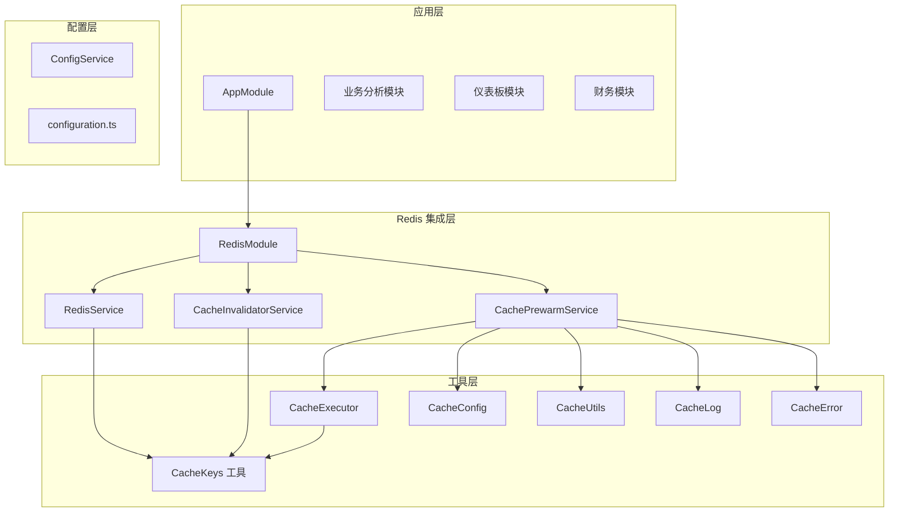
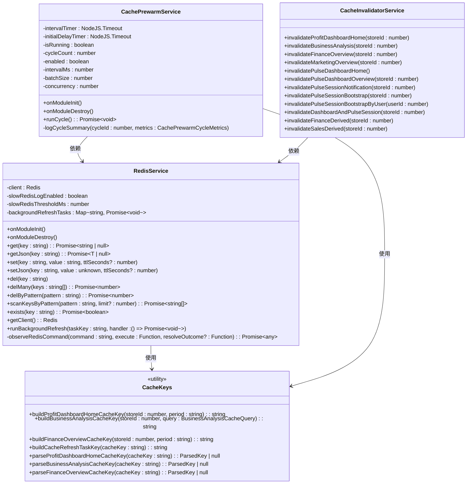
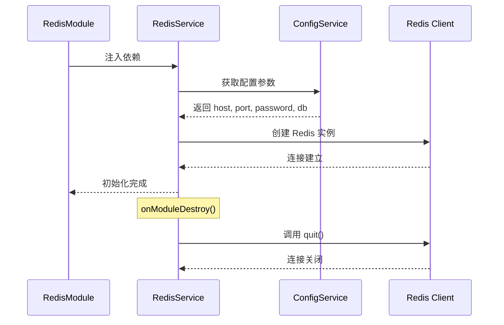
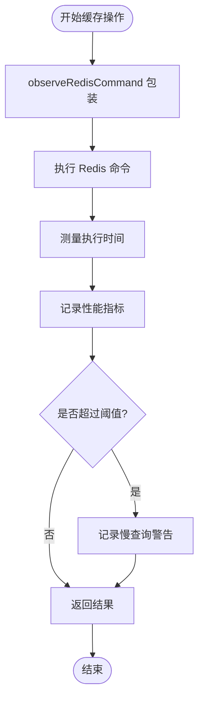
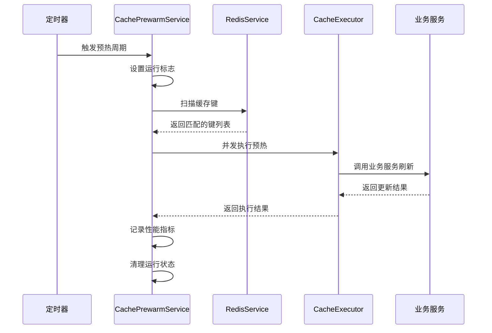
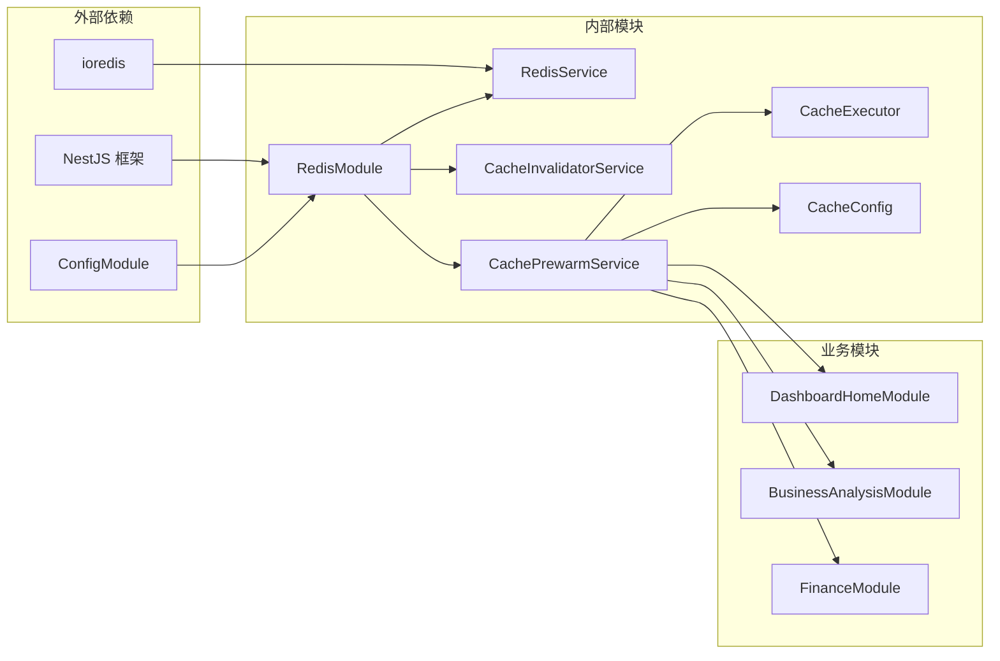

# Redis 集成方案

<cite>
**本文档引用的文件**
- [src/redis/redis.module.ts](file://src/redis/redis.module.ts)
- [src/redis/redis.service.ts](file://src/redis/redis.service.ts)
- [src/redis/cache-keys.ts](file://src/redis/cache-keys.ts)
- [src/redis/cache-prewarm.service.ts](file://src/redis/cache-prewarm.service.ts)
- [src/redis/cache-prewarm.executor.ts](file://src/redis/cache-prewarm.executor.ts)
- [src/redis/cache-prewarm.config.ts](file://src/redis/cache-prewarm.config.ts)
- [src/redis/cache-prewarm.types.ts](file://src/redis/cache-prewarm.types.ts)
- [src/redis/cache-prewarm.utils.ts](file://src/redis/cache-prewarm.utils.ts)
- [src/redis/cache-prewarm.log.ts](file://src/redis/cache-prewarm.log.ts)
- [src/redis/cache-prewarm.error.ts](file://src/redis/cache-prewarm.error.ts)
- [src/redis/cache-invalidator.service.ts](file://src/redis/cache-invalidator.service.ts)
- [src/config/configuration.ts](file://src/config/configuration.ts)
- [src/app.module.ts](file://src/app.module.ts)
- [src/observability/runtime-metrics.recorders.ts](file://src/observability/runtime-metrics.recorders.ts)
</cite>

## 目录
1. [简介](#简介)
2. [项目结构](#项目结构)
3. [核心组件](#核心组件)
4. [架构概览](#架构概览)
5. [详细组件分析](#详细组件分析)
6. [依赖关系分析](#依赖关系分析)
7. [性能考虑](#性能考虑)
8. [故障排除指南](#故障排除指南)
9. [结论](#结论)

## 简介

本项目采用 NestJS 框架实现了完整的 Redis 集成方案，包括连接池管理、缓存预热、键空间管理、连接状态监控等功能。该方案通过模块化设计实现了高性能的缓存服务，支持多种业务场景下的数据缓存需求。

## 项目结构

Redis 集成方案采用模块化架构，主要包含以下核心模块：



**图表来源**
- [src/app.module.ts:39-82](file://src/app.module.ts#L39-L82)
- [src/redis/redis.module.ts:9-15](file://src/redis/redis.module.ts#L9-L15)

**章节来源**
- [src/app.module.ts:1-83](file://src/app.module.ts#L1-L83)
- [src/redis/redis.module.ts:1-16](file://src/redis/redis.module.ts#L1-L16)

## 核心组件

### Redis 连接管理器

RedisService 是整个 Redis 集成的核心组件，负责建立和维护 Redis 连接，提供统一的缓存操作接口。

### 缓存预热服务

CachePrewarmService 实现了自动化的缓存预热机制，通过定时扫描和批量刷新确保热点数据的可用性。

### 缓存失效服务

CacheInvalidatorService 提供了细粒度的缓存失效控制，支持按业务模块和用户维度的缓存清理。

**章节来源**
- [src/redis/redis.service.ts:8-167](file://src/redis/redis.service.ts#L8-L167)
- [src/redis/cache-prewarm.service.ts:20-165](file://src/redis/cache-prewarm.service.ts#L20-L165)
- [src/redis/cache-invalidator.service.ts:15-90](file://src/redis/cache-invalidator.service.ts#L15-L90)

## 架构概览

系统采用分层架构设计，实现了高内聚低耦合的模块组织：



**图表来源**
- [src/redis/redis.service.ts:9-167](file://src/redis/redis.service.ts#L9-L167)
- [src/redis/cache-prewarm.service.ts:21-165](file://src/redis/cache-prewarm.service.ts#L21-L165)
- [src/redis/cache-invalidator.service.ts:16-90](file://src/redis/cache-invalidator.service.ts#L16-L90)
- [src/redis/cache-keys.ts:42-226](file://src/redis/cache-keys.ts#L42-L226)

## 详细组件分析

### Redis 连接池配置与管理

RedisService 实现了基于 ioredis 的连接池管理，提供了完整的生命周期管理：

#### 连接初始化流程



**图表来源**
- [src/redis/redis.service.ts:22-33](file://src/redis/redis.service.ts#L22-L33)
- [src/redis/redis.module.ts:10-14](file://src/redis/redis.module.ts#L10-L14)

#### 缓存操作监控机制

系统实现了全面的 Redis 操作监控，包括慢查询检测和性能统计：



**图表来源**
- [src/redis/redis.service.ts:141-165](file://src/redis/redis.service.ts#L141-L165)
- [src/observability/runtime-metrics.recorders.ts:154-210](file://src/observability/runtime-metrics.recorders.ts#L154-L210)

**章节来源**
- [src/redis/redis.service.ts:15-33](file://src/redis/redis.service.ts#L15-L33)
- [src/redis/redis.service.ts:141-165](file://src/redis/redis.service.ts#L141-L165)

### 缓存预热系统

CachePrewarmService 实现了智能的缓存预热机制，通过定时扫描和并发刷新确保热点数据的可用性。

#### 预热执行流程



**图表来源**
- [src/redis/cache-prewarm.service.ts:90-141](file://src/redis/cache-prewarm.service.ts#L90-L141)
- [src/redis/cache-prewarm.executor.ts:14-95](file://src/redis/cache-prewarm.executor.ts#L14-L95)

#### 预热配置管理

系统支持灵活的预热配置，包括执行间隔、批大小、并发度等参数：

**章节来源**
- [src/redis/cache-prewarm.service.ts:35-88](file://src/redis/cache-prewarm.service.ts#L35-L88)
- [src/redis/cache-prewarm.config.ts:18-74](file://src/redis/cache-prewarm.config.ts#L18-L74)

### 缓存键管理

CacheKeys 模块提供了统一的缓存键生成和解析机制，支持多种业务场景：

#### 键命名规范

系统采用层次化的键命名规范，便于缓存的组织和管理：

| 业务模块 | 键前缀格式 | 示例 |
|---------|-----------|------|
| 仪表板 | `profit:dashboard:home:store:{storeId}:period:{period}` | `profit:dashboard:home:store:1:period:today` |
| 业务分析 | `profit:business-analysis:store:{storeId}:period:{period}:start:{start}:end:{end}` | `profit:business-analysis:store:1:period:week:start:1640995200:end:1641599999` |
| 财务概览 | `profit:finance:overview:store:{storeId}:period:{period}` | `profit:finance:overview:store:1:period:month` |

**章节来源**
- [src/redis/cache-keys.ts:42-226](file://src/redis/cache-keys.ts#L42-L226)

### 缓存失效策略

CacheInvalidatorService 提供了细粒度的缓存失效控制，支持多种失效场景：

#### 失效策略分类

| 失效类型 | 适用场景 | 关键方法 |
|---------|---------|---------|
| 按商店失效 | 商店数据变更 | `invalidateProfitDashboardHome()`, `invalidateBusinessAnalysis()`, `invalidateFinanceOverview()` |
| 按用户失效 | 用户会话变化 | `invalidatePulseSessionBootstrapByUser()` |
| 组合失效 | 数据关联更新 | `invalidateSalesDerived()`, `invalidateFinanceDerived()` |
| 全局失效 | 系统级更新 | `invalidatePulseDashboardHome()` |

**章节来源**
- [src/redis/cache-invalidator.service.ts:19-88](file://src/redis/cache-invalidator.service.ts#L19-L88)

## 依赖关系分析

系统采用松耦合的设计，各组件间通过清晰的接口进行交互：



**图表来源**
- [src/redis/redis.module.ts:10-14](file://src/redis/redis.module.ts#L10-L14)
- [src/redis/cache-prewarm.config.ts:18-22](file://src/redis/cache-prewarm.config.ts#L18-L22)

**章节来源**
- [src/redis/redis.module.ts:1-16](file://src/redis/redis.module.ts#L1-L16)
- [src/app.module.ts:39-47](file://src/app.module.ts#L39-L47)

## 性能考虑

### 连接池优化

系统通过以下方式优化 Redis 连接性能：

1. **单实例连接**: RedisService 使用单一 Redis 实例，避免多连接开销
2. **慢查询监控**: 可配置的慢查询阈值，默认 20ms
3. **连接生命周期管理**: 正确的连接建立和销毁时机

### 缓存预热优化

1. **并发控制**: 可配置的并发度，防止过度占用系统资源
2. **批处理机制**: 支持批量键扫描和处理
3. **性能统计**: 详细的执行时间和成功率统计

### 内存优化策略

1. **键空间管理**: 使用模式匹配进行批量删除
2. **JSON 序列化**: 自动处理 JSON 数据的序列化和反序列化
3. **背景刷新**: 支持后台任务的去重执行

## 故障排除指南

### 常见问题诊断

#### 连接问题排查

1. **检查配置参数**
   - Redis 主机地址和端口
   - 认证密码设置
   - 数据库索引选择

2. **验证网络连通性**
   ```bash
   # 检查 Redis 服务状态
   redis-cli ping
   
   # 测试连接
   redis-cli -h HOST -p PORT -a PASSWORD
   ```

3. **查看慢查询日志**
   - 检查慢查询阈值配置
   - 分析慢查询命令类型

#### 缓存预热问题排查

1. **预热失败分析**
   - 查看失败原因统计
   - 检查业务服务可用性
   - 验证缓存键格式正确性

2. **性能监控**
   - 监控预热周期执行时间
   - 分析不同业务模块的性能差异
   - 检查并发度设置是否合理

**章节来源**
- [src/redis/redis.service.ts:158-162](file://src/redis/redis.service.ts#L158-L162)
- [src/redis/cache-prewarm.log.ts:30-44](file://src/redis/cache-prewarm.log.ts#L30-L44)

## 结论

本 Redis 集成方案通过模块化设计实现了高性能、可维护的缓存解决方案。系统具备以下优势：

1. **完整的功能覆盖**: 从连接管理到缓存预热，提供全栈缓存解决方案
2. **灵活的配置管理**: 支持环境变量配置和运行时参数调整
3. **完善的监控体系**: 提供详细的性能指标和故障诊断能力
4. **良好的扩展性**: 模块化设计便于功能扩展和维护

该方案适用于中大型企业级应用的缓存需求，能够有效提升系统的响应性能和用户体验。