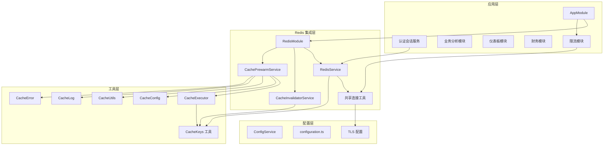
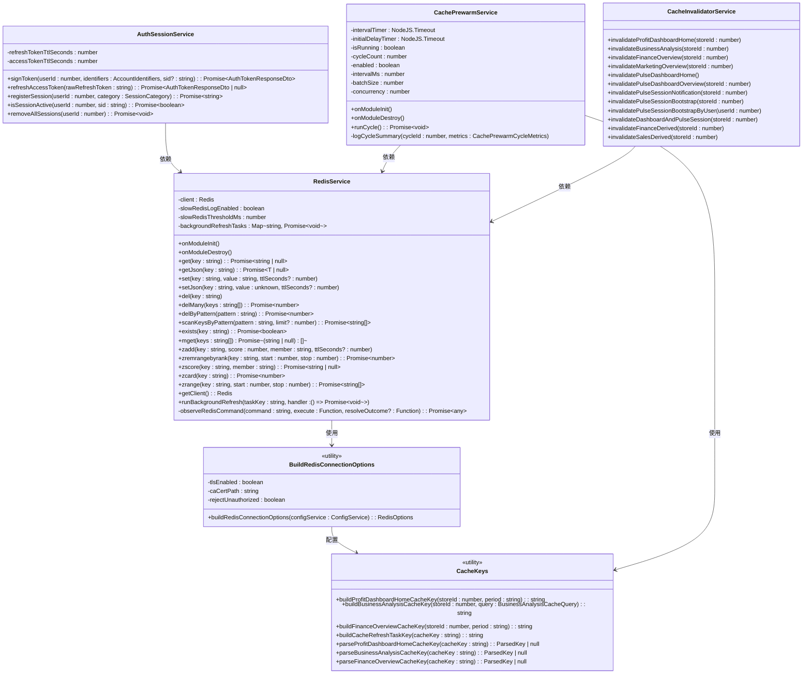
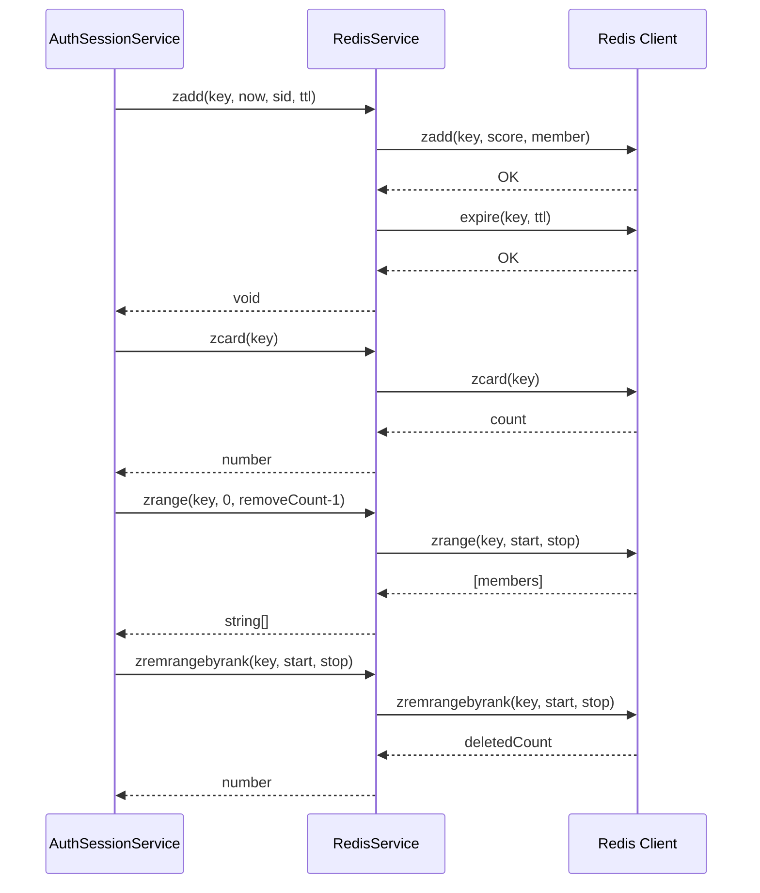
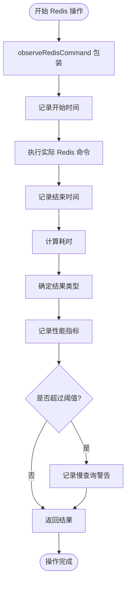
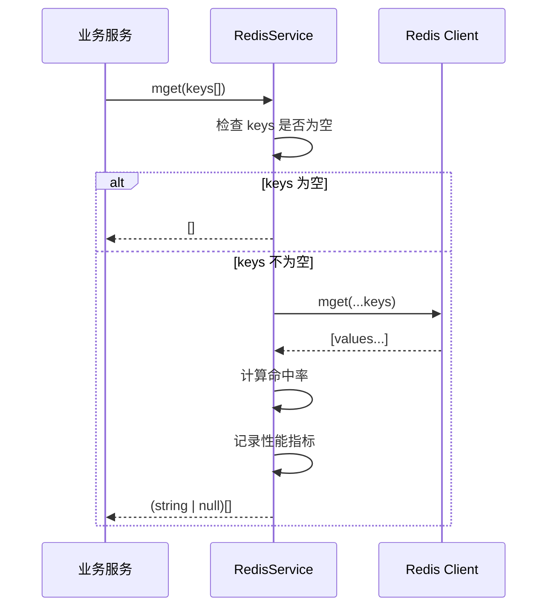
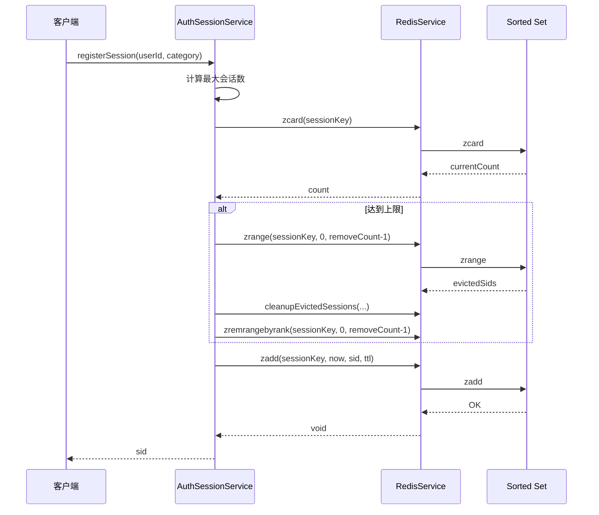
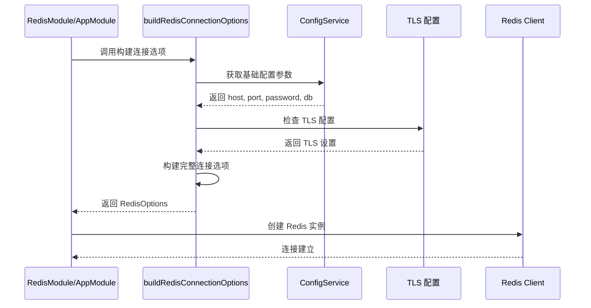
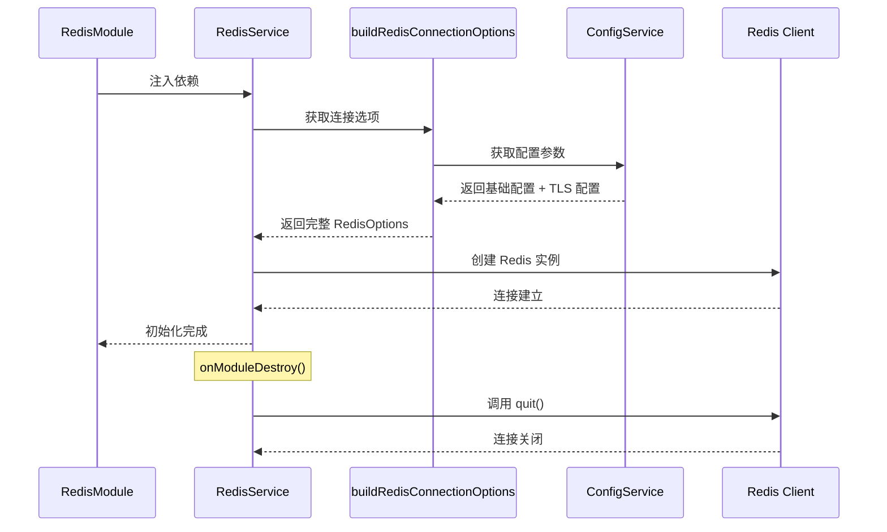
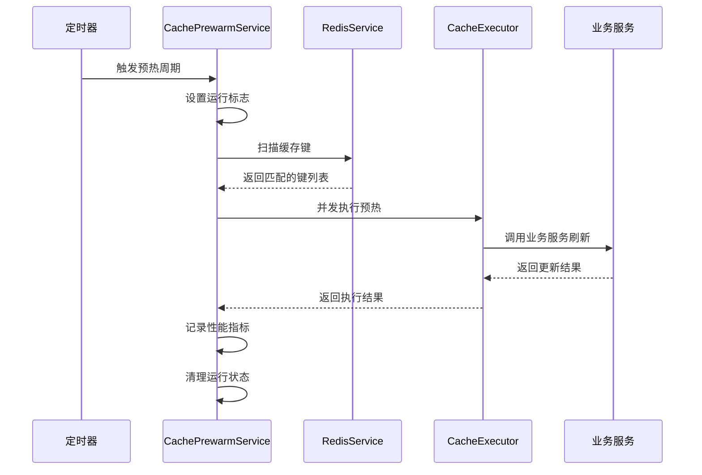
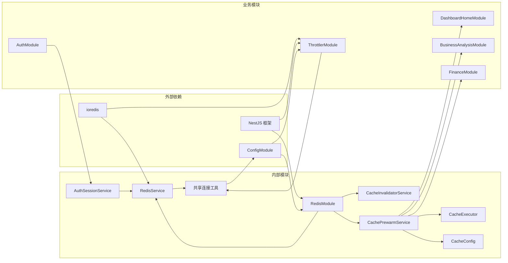

# Redis 集成方案

<cite>
**本文档引用的文件**
- [src/redis/redis.service.ts](file://src/redis/redis.service.ts)
- [src/shared/redis-connection.utils.ts](file://src/shared/redis-connection.utils.ts)
- [src/config/configuration.ts](file://src/config/configuration.ts)
- [src/app.module.ts](file://src/app.module.ts)
- [src/redis/cache-keys.ts](file://src/redis/cache-keys.ts)
- [src/redis/cache-prewarm.service.ts](file://src/redis/cache-prewarm.service.ts)
- [src/redis/cache-prewarm.executor.ts](file://src/redis/cache-prewarm.executor.ts)
- [src/redis/cache-prewarm.config.ts](file://src/redis/cache-prewarm.config.ts)
- [src/redis/cache-prewarm.types.ts](file://src/redis/cache-prewarm.types.ts)
- [src/redis/cache-prewarm.utils.ts](file://src/redis/cache-prewarm.utils.ts)
- [src/redis/cache-prewarm.log.ts](file://src/redis/cache-prewarm.log.ts)
- [src/redis/cache-prewarm.error.ts](file://src/redis/cache-prewarm.error.ts)
- [src/redis/cache-invalidator.service.ts](file://src/redis/cache-invalidator.service.ts)
- [src/purely-profit/auth/auth-session.service.ts](file://src/purely-profit/auth/auth-session.service.ts)
- [src/observability/runtime-metrics.recorders.ts](file://src/observability/runtime-metrics.recorders.ts)
</cite>

## 更新摘要
**变更内容**
- **新增排序集合操作**: 添加了 zadd、zremrangebyrank、zscore、zcard、zrange 等完整的排序集合操作方法
- **增强 TTL 支持**: 所有核心方法现在都支持可选的 TTL（生存时间）参数，实现自动过期管理
- **命令观察功能**: 实现了统一的 Redis 命令监控机制，包括性能统计和慢查询检测
- **批量操作优化**: 新增了 mget 方法用于高效的批量数据获取
- **会话管理增强**: 基于新的排序集合操作实现了更强大的用户会话管理功能

## 目录
1. [简介](#简介)
2. [项目结构](#项目结构)
3. [核心组件](#核心组件)
4. [架构概览](#架构概览)
5. [详细组件分析](#详细组件分析)
6. [依赖关系分析](#依赖关系分析)
7. [性能考虑](#性能考虑)
8. [故障排除指南](#故障排除指南)
9. [结论](#结论)

## 简介

本项目采用 NestJS 框架实现了完整的 Redis 集成方案，包括连接池管理、缓存预热、键空间管理、连接状态监控等功能。该方案通过模块化设计实现了高性能的缓存服务，支持多种业务场景下的数据缓存需求。**最新更新**显著增强了 Redis 服务的功能集，新增了完整的排序集合操作支持、TTL 管理和命令观察功能，为复杂的业务场景提供了更强大的数据管理能力。

## 项目结构

Redis 集成方案采用模块化架构，主要包含以下核心模块：



**图表来源**
- [src/app.module.ts:62-91](file://src/app.module.ts#L62-L91)
- [src/redis/redis.module.ts:20-56](file://src/redis/redis.module.ts#L20-L56)
- [src/shared/redis-connection.utils.ts:12-47](file://src/shared/redis-connection.utils.ts#L12-L47)
- [src/purely-profit/auth/auth-session.service.ts:45-63](file://src/purely-profit/auth/auth-session.service.ts#L45-L63)

**章节来源**
- [src/app.module.ts:62-159](file://src/app.module.ts#L62-L159)
- [src/redis/redis.module.ts:1-57](file://src/redis/redis.module.ts#L1-L57)

## 核心组件

### Redis 连接管理器

RedisService 是整个 Redis 集成的核心组件，负责建立和维护 Redis 连接，提供统一的缓存操作接口。**重大更新**现在包含了完整的排序集合操作支持、TTL 管理和命令观察功能。

### 共享连接工具函数

`buildRedisConnectionOptions` 是新增的共享工具函数，负责从配置服务构建 Redis 连接选项，支持 TLS 加密连接和证书配置。该函数同时服务于 RedisService 和 ThrottlerModule。

### 认证会话服务

AuthSessionService 利用新的排序集合操作实现了强大的用户会话管理功能，支持多设备登录控制、会话淘汰和刷新令牌管理。

### 缓存预热服务

CachePrewarmService 实现了自动化的缓存预热机制，通过定时扫描和批量刷新确保热点数据的可用性。

### 缓存失效服务

CacheInvalidatorService 提供了细粒度的缓存失效控制，支持按业务模块和用户维度的缓存清理。

**章节来源**
- [src/redis/redis.service.ts:17-64](file://src/redis/redis.service.ts#L17-L64)
- [src/shared/redis-connection.utils.ts:12-47](file://src/shared/redis-connection.utils.ts#L12-L47)
- [src/purely-profit/auth/auth-session.service.ts:45-63](file://src/purely-profit/auth/auth-session.service.ts#L45-L63)
- [src/redis/cache-prewarm.service.ts:20-165](file://src/redis/cache-prewarm.service.ts#L20-L165)
- [src/redis/cache-invalidator.service.ts:15-90](file://src/redis/cache-invalidator.service.ts#L15-L90)

## 架构概览

系统采用分层架构设计，实现了高内聚低耦合的模块组织：**重大更新**后的架构包含了增强的 Redis 服务层，支持排序集合操作、TTL 管理和命令观察功能。



**图表来源**
- [src/redis/redis.service.ts:17-372](file://src/redis/redis.service.ts#L17-L372)
- [src/purely-profit/auth/auth-session.service.ts:45-63](file://src/purely-profit/auth/auth-session.service.ts#L45-L63)
- [src/shared/redis-connection.utils.ts:12-47](file://src/shared/redis-connection.utils.ts#L12-L47)
- [src/redis/cache-prewarm.service.ts:21-165](file://src/redis/cache-prewarm.service.ts#L21-L165)
- [src/redis/cache-invalidator.service.ts:16-90](file://src/redis/cache-invalidator.service.ts#L16-L90)
- [src/redis/cache-keys.ts:42-226](file://src/redis/cache-keys.ts#L42-L226)

## 详细组件分析

### 排序集合操作增强

**重大更新** RedisService 现在提供了完整的排序集合操作支持，包括添加成员、范围删除、分数查询、计数和范围获取等操作。

#### 排序集合 API 概览

| 方法名 | 功能描述 | 参数 | 返回值 | 应用场景 |
|--------|----------|------|--------|----------|
| `zadd` | 添加成员到排序集合 | key, score, member, ttlSeconds? | Promise<void> | 用户会话注册、排行榜 |
| `zremrangebyrank` | 按排名范围删除成员 | key, start, stop | Promise<number> | 会话淘汰、数据清理 |
| `zscore` | 获取成员分数 | key, member | Promise<string \| null> | 会话存在性检查 |
| `zcard` | 获取集合大小 | key | Promise<number> | 会话数量统计 |
| `zrange` | 获取指定范围的成员 | key, start, stop | Promise<string[]> | 获取最老/最新会话 |

#### 排序集合操作流程



**图表来源**
- [src/purely-profit/auth/auth-session.service.ts:174-195](file://src/purely-profit/auth/auth-session.service.ts#L174-L195)
- [src/redis/redis.service.ts:277-317](file://src/redis/redis.service.ts#L277-L317)

#### TTL 支持增强

**新增** 所有核心 Redis 操作现在都支持可选的 TTL 参数，实现自动过期管理：

| 方法 | TTL 支持 | 行为说明 |
|------|----------|----------|
| `set(key, value, ttlSeconds?)` | ✅ | 设置键值对并可选设置过期时间 |
| `incr(key, ttlSecondsOnCreate?)` | ✅ | 原子递增，仅在首次创建时设置 TTL |
| `zadd(key, score, member, ttlSeconds?)` | ✅ | 添加排序集合成员并可选设置过期时间 |
| `setIfAbsent(key, value, ttlSeconds)` | ✅ | 条件设置，必须提供 TTL |

**章节来源**
- [src/redis/redis.service.ts:275-317](file://src/redis/redis.service.ts#L275-L317)
- [src/redis/redis.service.ts:83-108](file://src/redis/redis.service.ts#L83-L108)
- [src/purely-profit/auth/auth-session.service.ts:174-195](file://src/purely-profit/auth/auth-session.service.ts#L174-L195)

### 命令观察与监控机制

**重大更新** 系统实现了全面的 Redis 命令观察功能，所有操作都通过统一的 `observeRedisCommand` 方法进行包装，提供详细的性能监控和慢查询检测。

#### 命令观察流程



**图表来源**
- [src/redis/redis.service.ts:347-371](file://src/redis/redis.service.ts#L347-L371)
- [src/observability/runtime-metrics.recorders.ts:154-210](file://src/observability/runtime-metrics.recorders.ts#L154-L210)

#### 监控指标分类

| 指标类型 | 描述 | 触发条件 |
|----------|------|----------|
| `hit` | 成功命中缓存 | GET 返回非空值、SET 成功 |
| `miss` | 缓存未命中 | GET 返回 null、SET IF NOT EXISTS 失败 |
| `neutral` | 中性操作 | 不直接关联缓存命中的操作 |

**章节来源**
- [src/redis/redis.service.ts:347-371](file://src/redis/redis.service.ts#L347-L371)
- [src/redis/redis.service.ts:66-72](file://src/redis/redis.service.ts#L66-L72)

### 批量操作优化

**新增** 系统提供了高效的批量操作支持，特别是 `mget` 方法用于批量获取多个键的值。

#### 批量操作优势

| 操作类型 | 传统方式 | 批量方式 | 性能提升 |
|----------|----------|----------|----------|
| 单键获取 | N 次网络往返 | 1 次网络往返 | ~N 倍 |
| JSON 解析 | 逐个处理 | 批量处理 | 减少序列化开销 |
| 错误处理 | 分散处理 | 统一处理 | 简化错误逻辑 |

#### MGET 实现细节



**图表来源**
- [src/redis/redis.service.ts:319-336](file://src/redis/redis.service.ts#L319-L336)

**章节来源**
- [src/redis/redis.service.ts:319-336](file://src/redis/redis.service.ts#L319-L336)

### 认证会话管理增强

**重大更新** AuthSessionService 利用新的排序集合操作实现了强大的用户会话管理功能，支持多设备登录控制和智能会话淘汰。

#### 会话管理策略

| 账号类型 | 最大会话数 | 淘汰策略 | 实现方式 |
|----------|------------|----------|----------|
| owner | 无限制 | 无淘汰 | 仅添加新会话 |
| profit_main | 3 个 | FIFO 淘汰最老 | zcard + zrange + zremrangebyrank |
| profit_sub | 1 个 | 踢掉所有旧会话 | zremrangebyrank(0, -1) |
| profit_club | 1 个 | 踢掉所有旧会话 | zremrangebyrank(0, -1) |

#### 会话生命周期流程



**图表来源**
- [src/purely-profit/auth/auth-session.service.ts:174-195](file://src/purely-profit/auth/auth-session.service.ts#L174-L195)
- [src/purely-profit/auth/auth-session.service.ts:223-264](file://src/purely-profit/auth/auth-session.service.ts#L223-L264)

**章节来源**
- [src/purely-profit/auth/auth-session.service.ts:174-195](file://src/purely-profit/auth/auth-session.service.ts#L174-L195)
- [src/purely-profit/auth/auth-session.service.ts:223-264](file://src/purely-profit/auth/auth-session.service.ts#L223-L264)

### Redis 连接配置重构与 TLS 支持

**更新** 系统引入了共享的 Redis 连接工具函数 `buildRedisConnectionOptions`，实现了连接配置的集中管理和 TLS 加密连接支持。

#### 连接配置重构流程



**图表来源**
- [src/shared/redis-connection.utils.ts:12-47](file://src/shared/redis-connection.utils.ts#L12-L47)
- [src/redis/redis.service.ts:30-38](file://src/redis/redis.service.ts#L30-L38)
- [src/app.module.ts:71-73](file://src/app.module.ts#L71-L73)

#### TLS 加密连接配置

系统支持完整的 TLS 加密连接配置，包括 CA 证书路径和证书验证选项：

| 配置项 | 环境变量 | 默认值 | 说明 |
|--------|----------|--------|------|
| `tlsEnabled` | `REDIS_TLS_ENABLED` | `false` | 启用 TLS 加密连接 |
| `tlsCaCertPath` | `REDIS_TLS_CA_CERT_PATH` | `''` | CA 证书文件路径（PEM 格式） |
| `tlsRejectUnauthorized` | `REDIS_TLS_REJECT_UNAUTHORIZED` | `true` | 是否拒绝未授权的证书 |

**章节来源**
- [src/shared/redis-connection.utils.ts:33-44](file://src/shared/redis-connection.utils.ts#L33-L44)
- [src/config/configuration.ts:182-201](file://src/config/configuration.ts#L182-L201)

### Redis 连接池配置与管理

RedisService 实现了基于 ioredis 的连接池管理，提供了完整的生命周期管理。**更新**后使用共享工具函数构建连接选项，支持 TLS 加密连接和增强的命令观察功能。

#### 连接初始化流程



**图表来源**
- [src/redis/redis.service.ts:30-64](file://src/redis/redis.service.ts#L30-L64)
- [src/redis/redis.module.ts:10-14](file://src/redis/redis.module.ts#L10-L14)

#### 缓存操作监控机制

系统实现了全面的 Redis 操作监控，包括慢查询检测和性能统计：**更新**后所有操作都通过统一的观察机制进行包装。


**图表来源**
- [src/redis/redis.service.ts:347-371](file://src/redis/redis.service.ts#L347-L371)
- [src/observability/runtime-metrics.recorders.ts:154-210](file://src/observability/runtime-metrics.recorders.ts#L154-L210)

**章节来源**
- [src/redis/redis.service.ts:23-64](file://src/redis/redis.service.ts#L23-L64)
- [src/redis/redis.service.ts:347-371](file://src/redis/redis.service.ts#L347-L371)

### 缓存预热系统

CachePrewarmService 实现了智能的缓存预热机制，通过定时扫描和并发刷新确保热点数据的可用性。

#### 预热执行流程



**图表来源**
- [src/redis/cache-prewarm.service.ts:90-141](file://src/redis/cache-prewarm.service.ts#L90-L141)
- [src/redis/cache-prewarm.executor.ts:14-95](file://src/redis/cache-prewarm.executor.ts#L14-L95)

#### 预热配置管理

系统支持灵活的预热配置，包括执行间隔、批大小、并发度等参数：

**章节来源**
- [src/redis/cache-prewarm.service.ts:35-88](file://src/redis/cache-prewarm.service.ts#L35-L88)
- [src/redis/cache-prewarm.config.ts:18-26](file://src/redis/cache-prewarm.config.ts#L18-L26)

### 缓存键管理

CacheKeys 模块提供了统一的缓存键生成和解析机制，支持多种业务场景：

#### 键命名规范

系统采用层次化的键命名规范，便于缓存的组织和管理：

| 业务模块 | 键前缀格式 | 示例 |
|---------|-----------|------|
| 仪表板 | `profit:dashboard:home:store:{storeId}:period:{period}` | `profit:dashboard:home:store:1:period:today` |
| 业务分析 | `profit:business-analysis:store:{storeId}:period:{period}:start:{start}:end:{end}` | `profit:business-analysis:store:1:period:week:start:1640995200:end:1641599999` |
| 财务概览 | `profit:finance:overview:store:{storeId}:period:{period}` | `profit:finance:overview:store:1:period:month` |

**章节来源**
- [src/redis/cache-keys.ts:42-226](file://src/redis/cache-keys.ts#L42-L226)

### 缓存失效策略

CacheInvalidatorService 提供了细粒度的缓存失效控制，支持多种失效场景：

#### 失效策略分类

| 失效类型 | 适用场景 | 关键方法 |
|---------|---------|---------|
| 按商店失效 | 商店数据变更 | `invalidateProfitDashboardHome()`, `invalidateBusinessAnalysis()`, `invalidateFinanceOverview()` |
| 按用户失效 | 用户会话变化 | `invalidatePulseSessionBootstrapByUser()` |
| 组合失效 | 数据关联更新 | `invalidateSalesDerived()`, `invalidateFinanceDerived()` |
| 全局失效 | 系统级更新 | `invalidatePulseDashboardHome()` |

**章节来源**
- [src/redis/cache-invalidator.service.ts:19-88](file://src/redis/cache-invalidator.service.ts#L19-L88)

## 依赖关系分析

系统采用松耦合的设计，各组件间通过清晰的接口进行交互：**重大更新**后的依赖关系包含了增强的 Redis 服务和认证会话管理的紧密集成。



**图表来源**
- [src/redis/redis.module.ts:20-56](file://src/redis/redis.module.ts#L20-56)
- [src/app.module.ts:69-91](file://src/app.module.ts#L69-91)
- [src/shared/redis-connection.utils.ts:12-47](file://src/shared/redis-connection.utils.ts#L12-47)
- [src/purely-profit/auth/auth-session.service.ts:45-63](file://src/purely-profit/auth/auth-session.service.ts#L45-63)

**章节来源**
- [src/redis/redis.module.ts:1-57](file://src/redis/redis.module.ts#L1-57)
- [src/app.module.ts:62-159](file://src/app.module.ts#L62-159)

## 性能考虑

### 连接池优化

系统通过以下方式优化 Redis 连接性能：

1. **单实例连接**: RedisService 使用单一 Redis 实例，避免多连接开销
2. **慢查询监控**: 可配置的慢查询阈值，默认 20ms
3. **连接生命周期管理**: 正确的连接建立和销毁时机
4. **共享连接配置**: 通过工具函数统一管理连接配置，减少重复代码

### 排序集合操作优化

**新增** 排序集合操作的性能考虑：

1. **O(log N) 复杂度**: 排序集合操作具有对数时间复杂度
2. **内存效率**: 使用跳表数据结构，平衡读写性能
3. **批量操作**: 支持范围操作，减少网络往返
4. **TTL 优化**: 自动过期管理，避免手动清理开销

### TLS 连接优化

**更新** TLS 连接支持带来的性能考虑：

1. **证书加载优化**: CA 证书在连接时一次性加载，避免重复 I/O 操作
2. **连接复用**: TLS 连接支持连接池复用，减少握手开销
3. **超时配置**: 合理的连接超时和重试策略，提高连接稳定性

### 批量操作优化

**新增** 批量操作的性能优势：

1. **网络优化**: 单次网络往返获取多个键值，减少延迟
2. **序列化优化**: 批量处理减少 JSON 序列化开销
3. **错误处理优化**: 统一的错误处理逻辑，简化异常分支

### 缓存预热优化

1. **并发控制**: 可配置的并发度，防止过度占用系统资源
2. **批处理机制**: 支持批量键扫描和处理
3. **性能统计**: 详细的执行时间和成功率统计

### 内存优化策略

1. **键空间管理**: 使用模式匹配进行批量删除
2. **JSON 序列化**: 自动处理 JSON 数据的序列化和反序列化
3. **背景刷新**: 支持后台任务的去重执行
4. **TTL 管理**: 自动过期清理，避免内存泄漏

## 故障排除指南

### 常见问题诊断

#### 排序集合操作问题排查

**新增** 排序集合操作相关的故障排除步骤：

1. **检查排序集合操作**
   ```bash
   # 检查排序集合大小
   redis-cli ZCARD auth:sessions:1
   
   # 查看排序集合成员
   redis-cli ZRANGE auth:sessions:1 0 -1 WITHSCORES
   
   # 检查特定成员的分数
   redis-cli ZSCORE auth:sessions:1 session-id
   ```

2. **验证 TTL 设置**
   ```bash
   # 检查键的剩余生存时间
   redis-cli TTL auth:sessions:1
   
   # 查看所有键的过期信息
   redis-cli KEYS "auth:sessions:*" | xargs -I {} redis-cli TTL {}
   ```

3. **测试排序集合操作**
   ```bash
   # 测试添加操作
   redis-cli ZADD test:set 100 "member1"
   
   # 测试范围删除
   redis-cli ZREMRANGEBYRANK test:set 0 0
   
   # 测试范围查询
   redis-cli ZRANGE test:set 0 -1
   ```

#### TLS 连接问题排查

**更新** TLS 连接相关的故障排除步骤：

1. **检查 TLS 配置**
   - 确认 `REDIS_TLS_ENABLED` 环境变量设置为 `true`
   - 验证 CA 证书文件路径是否正确
   - 检查证书文件格式是否为 PEM 格式

2. **验证证书权限**
   ```bash
   # 检查证书文件是否存在
   ls -la /path/to/ca-cert.pem
   
   # 检查文件权限
   chmod 644 /path/to/ca-cert.pem
   
   # 验证证书格式
   openssl x509 -in /path/to/ca-cert.pem -text -noout
   ```

3. **测试 TLS 连接**
   ```bash
   # 使用 redis-cli 测试 TLS 连接
   redis-cli --tls -h HOST -p PORT -a PASSWORD --cacert /path/to/ca-cert.pem ping
   
   # 跳过证书验证测试（仅用于调试）
   redis-cli --tls -h HOST -p PORT -a PASSWORD --insecure ping
   ```

#### 命令观察和监控问题排查

**新增** 命令观察相关的故障排除步骤：

1. **检查慢查询日志**
   - 查看应用日志中的 `[slow-redis]` 标记
   - 分析慢查询的命令类型和耗时
   - 调整慢查询阈值配置

2. **监控性能指标**
   ```bash
   # 检查 Redis 连接状态
   redis-cli INFO connection
   
   # 查看内存使用情况
   redis-cli INFO memory
   
   # 检查命令统计
   redis-cli INFO stats
   ```

#### 连接问题排查

1. **检查配置参数**
   - Redis 主机地址和端口
   - 认证密码设置
   - 数据库索引选择

2. **验证网络连通性**
   ```bash
   # 检查 Redis 服务状态
   redis-cli ping
   
   # 测试连接
   redis-cli -h HOST -p PORT -a PASSWORD
   ```

#### 缓存预热问题排查

1. **预热失败分析**
   - 查看失败原因统计
   - 检查业务服务可用性
   - 验证缓存键格式正确性

2. **性能监控**
   - 监控预热周期执行时间
   - 分析不同业务模块的性能差异
   - 检查并发度设置是否合理

**章节来源**
- [src/redis/redis.service.ts:40-59](file://src/redis/redis.service.ts#L40-L59)
- [src/redis/cache-prewarm.log.ts:30-44](file://src/redis/cache-prewarm.log.ts#L30-L44)
- [src/redis/redis.service.ts:347-371](file://src/redis/redis.service.ts#L347-L371)

## 结论

本 Redis 集成方案通过模块化设计实现了高性能、可维护的缓存解决方案。**重大更新**显著增强了 Redis 服务的功能集，主要优势包括：

1. **完整的功能覆盖**: 从连接管理到缓存预热，提供全栈缓存解决方案
2. **增强的安全性**: 支持 TLS 加密连接，保护数据传输安全
3. **丰富的数据类型支持**: 新增完整的排序集合操作，支持复杂的数据结构需求
4. **智能的 TTL 管理**: 所有核心操作都支持可选的生存时间参数
5. **全面的监控体系**: 统一的命令观察机制，提供详细的性能指标和故障诊断能力
6. **高效的批量操作**: 优化的批量获取功能，显著提升性能
7. **灵活的配置管理**: 支持环境变量配置和运行时参数调整
8. **良好的扩展性**: 模块化设计便于功能扩展和维护
9. **统一的连接管理**: 通过共享工具函数统一管理所有 Redis 连接配置

该方案特别适用于需要复杂会话管理、排行榜功能、实时统计等业务场景，能够有效提升系统的响应性能和用户体验，特别是在需要高安全性和高性能的生产环境中。新增的排序集合操作为认证会话管理、排行榜、实时统计等场景提供了强大的底层支持。