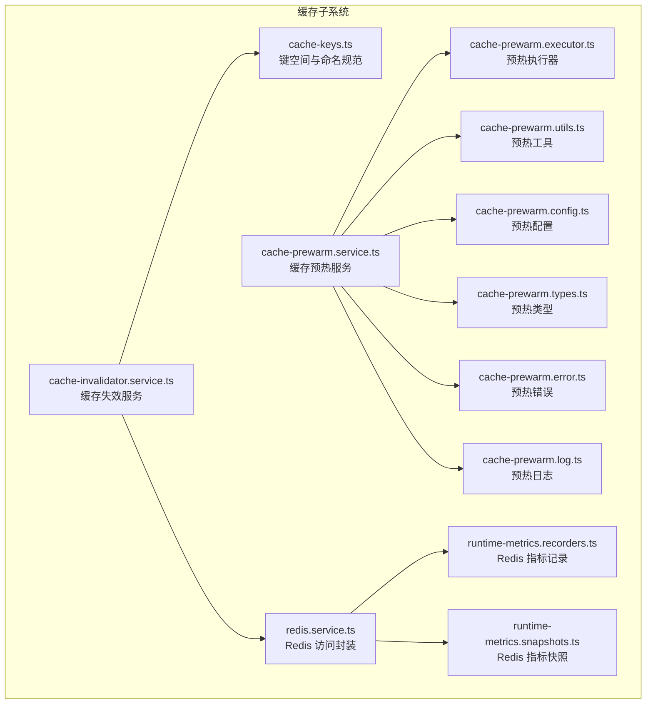
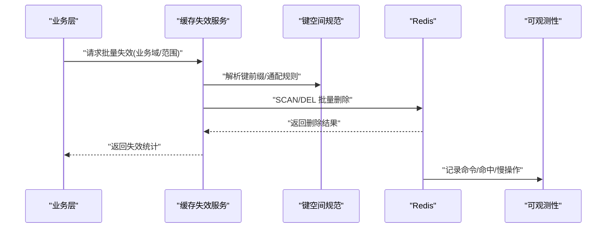
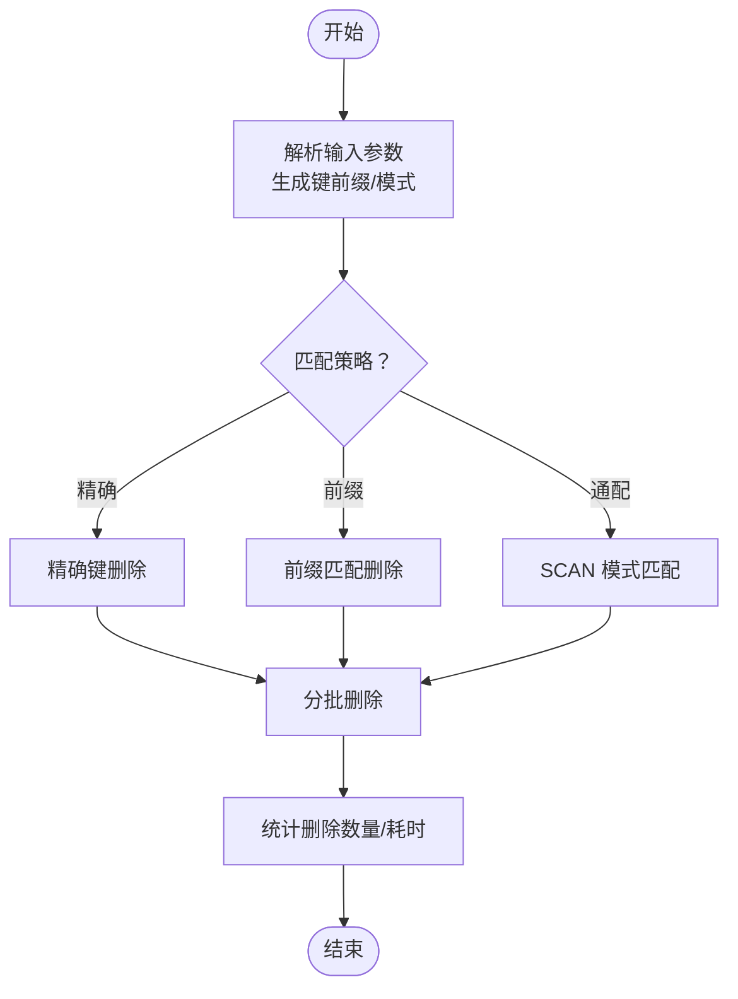
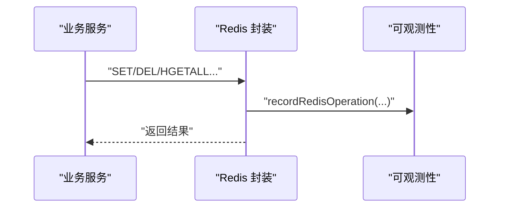
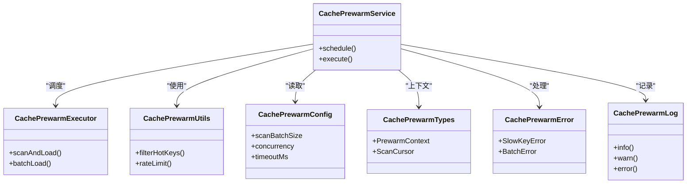
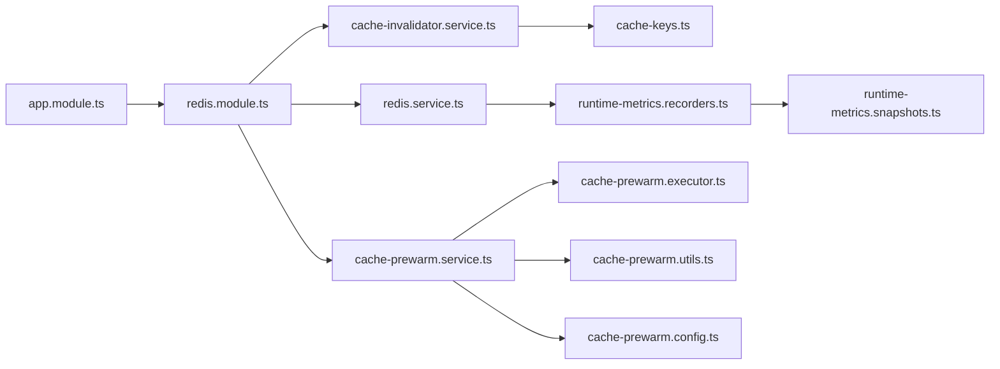

# 缓存失效管理

<cite>
**本文引用的文件**
- [cache-invalidator.service.ts](file://src/redis/cache-invalidator.service.ts)
- [cache-keys.ts](file://src/redis/cache-keys.ts)
- [redis.service.ts](file://src/redis/redis.service.ts)
- [redis.module.ts](file://src/redis/redis.module.ts)
- [runtime-metrics.recorders.ts](file://src/observability/runtime-metrics.recorders.ts)
- [runtime-metrics.snapshots.ts](file://src/observability/runtime-metrics.snapshots.ts)
- [cache-prewarm.service.ts](file://src/redis/cache-prewarm.service.ts)
- [cache-prewarm.executor.ts](file://src/redis/cache-prewarm.executor.ts)
- [cache-prewarm.utils.ts](file://src/redis/cache-prewarm.utils.ts)
- [cache-prewarm.config.ts](file://src/redis/cache-prewarm.config.ts)
- [cache-prewarm.types.ts](file://src/redis/cache-prewarm.types.ts)
- [cache-prewarm.error.ts](file://src/redis/cache-prewarm.error.ts)
- [cache-prewarm.log.ts](file://src/redis/cache-prewarm.log.ts)
- [app.module.ts](file://src/app.module.ts)
</cite>

## 目录
1. [引言](#引言)
2. [项目结构](#项目结构)
3. [核心组件](#核心组件)
4. [架构总览](#架构总览)
5. [详细组件分析](#详细组件分析)
6. [依赖关系分析](#依赖关系分析)
7. [性能考量](#性能考量)
8. [故障排查指南](#故障排查指南)
9. [结论](#结论)
10. [附录](#附录)

## 引言
本技术文档围绕“缓存失效管理”展开，系统性阐述缓存失效策略的设计原则、失效时机选择与批量失效实现方法；详解缓存失效服务工作机制、键匹配规则与失效范围控制；并给出缓存一致性保障、脏读防护与失效风暴处理的解决方案。同时提供可落地的实践建议与监控指标，帮助在高并发场景下实现稳定、可控且高性能的缓存失效。

## 项目结构
本项目的缓存子系统主要位于 src/redis 目录，围绕 Redis 缓存提供键空间设计、失效服务、预热服务与可观测性记录。关键模块包括：
- 键空间与命名规范：cache-keys.ts
- 失效服务：cache-invalidator.service.ts
- Redis 访问封装：redis.service.ts
- 模块装配：redis.module.ts
- 预热服务：cache-prewarm.*（服务、执行器、工具、配置、类型、错误、日志）
- 可观测性：runtime-metrics.recorders.ts、runtime-metrics.snapshots.ts

图表来源
- [cache-keys.ts](file://src/redis/cache-keys.ts)
- [cache-invalidator.service.ts](file://src/redis/cache-invalidator.service.ts)
- [redis.service.ts](file://src/redis/redis.service.ts)
- [runtime-metrics.recorders.ts](file://src/observability/runtime-metrics.recorders.ts)
- [runtime-metrics.snapshots.ts](file://src/observability/runtime-metrics.snapshots.ts)
- [cache-prewarm.service.ts](file://src/redis/cache-prewarm.service.ts)
- [cache-prewarm.executor.ts](file://src/redis/cache-prewarm.executor.ts)
- [cache-prewarm.utils.ts](file://src/redis/cache-prewarm.utils.ts)
- [cache-prewarm.config.ts](file://src/redis/cache-prewarm.config.ts)
- [cache-prewarm.types.ts](file://src/redis/cache-prewarm.types.ts)
- [cache-prewarm.error.ts](file://src/redis/cache-prewarm.error.ts)
- [cache-prewarm.log.ts](file://src/redis/cache-prewarm.log.ts)

章节来源
- [cache-keys.ts](file://src/redis/cache-keys.ts)
- [cache-invalidator.service.ts](file://src/redis/cache-invalidator.service.ts)
- [redis.service.ts](file://src/redis/redis.service.ts)
- [redis.module.ts](file://src/redis/redis.module.ts)
- [runtime-metrics.recorders.ts](file://src/observability/runtime-metrics.recorders.ts)
- [runtime-metrics.snapshots.ts](file://src/observability/runtime-metrics.snapshots.ts)
- [cache-prewarm.service.ts](file://src/redis/cache-prewarm.service.ts)
- [cache-prewarm.executor.ts](file://src/redis/cache-prewarm.executor.ts)
- [cache-prewarm.utils.ts](file://src/redis/cache-prewarm.utils.ts)
- [cache-prewarm.config.ts](file://src/redis/cache-prewarm.config.ts)
- [cache-prewarm.types.ts](file://src/redis/cache-prewarm.types.ts)
- [cache-prewarm.error.ts](file://src/redis/cache-prewarm.error.ts)
- [cache-prewarm.log.ts](file://src/redis/cache-prewarm.log.ts)

## 核心组件
- 键空间与命名规范（cache-keys.ts）：定义统一的键前缀、分隔符与命名模式，确保键的可读性、可匹配性与可扩展性，是失效范围控制与批量失效的基础。
- 缓存失效服务（cache-invalidator.service.ts）：提供按业务域或范围的键删除能力，支持通配匹配与精确匹配，负责在数据变更时触发失效。
- Redis 访问封装（redis.service.ts）：对底层 Redis 操作进行统一封装，提供原子性与一致性保障，并与可观测性模块集成。
- 预热服务（cache-prewarm.*）：在应用启动或低峰期对热点键进行预加载，降低冷启动与突发流量下的缓存穿透风险。
- 可观测性（runtime-metrics.*）：记录 Redis 命令调用次数、命中率、慢操作等指标，用于评估失效策略的效果与性能影响。

章节来源
- [cache-keys.ts](file://src/redis/cache-keys.ts)
- [cache-invalidator.service.ts](file://src/redis/cache-invalidator.service.ts)
- [redis.service.ts](file://src/redis/redis.service.ts)
- [runtime-metrics.recorders.ts](file://src/observability/runtime-metrics.recorders.ts)
- [runtime-metrics.snapshots.ts](file://src/observability/runtime-metrics.snapshots.ts)
- [cache-prewarm.service.ts](file://src/redis/cache-prewarm.service.ts)
- [cache-prewarm.executor.ts](file://src/redis/cache-prewarm.executor.ts)
- [cache-prewarm.utils.ts](file://src/redis/cache-prewarm.utils.ts)
- [cache-prewarm.config.ts](file://src/redis/cache-prewarm.config.ts)
- [cache-prewarm.types.ts](file://src/redis/cache-prewarm.types.ts)
- [cache-prewarm.error.ts](file://src/redis/cache-prewarm.error.ts)
- [cache-prewarm.log.ts](file://src/redis/cache-prewarm.log.ts)

## 架构总览
缓存失效管理采用“键空间 + 失效服务 + 预热 + 观测”的闭环架构。数据变更通过业务层触发失效服务，失效服务根据键空间规则匹配目标键并执行批量删除；同时，预热服务在低峰期补充热点键，减少失效后的抖动；所有 Redis 操作由 redis.service.ts 统一记录指标，runtime-metrics.* 提供聚合与快照能力。

图表来源
- [cache-invalidator.service.ts](file://src/redis/cache-invalidator.service.ts)
- [cache-keys.ts](file://src/redis/cache-keys.ts)
- [redis.service.ts](file://src/redis/redis.service.ts)
- [runtime-metrics.recorders.ts](file://src/observability/runtime-metrics.recorders.ts)

## 详细组件分析

### 键空间与命名规范（cache-keys.ts）
- 设计原则
  - 前缀分层：以业务域/实体/维度作为前缀，避免键冲突与误删。
  - 分隔符：使用稳定分隔符连接各层级，便于匹配与解析。
  - 版本化：必要时引入版本号，支持灰度与平滑迁移。
- 键匹配规则
  - 精确匹配：基于完整键名直接删除。
  - 前缀匹配：通过前缀筛选目标键集合。
  - 通配匹配：结合 SCAN 与模式匹配，支持模糊范围删除。
- 失效范围控制
  - 限定前缀：仅删除指定前缀下的键，避免越界。
  - 细粒度维度：按实体 ID、租户、时间窗口等维度收敛范围。
  - 安全阈值：限制单次扫描数量，防止阻塞。

章节来源
- [cache-keys.ts](file://src/redis/cache-keys.ts)

### 缓存失效服务（cache-invalidator.service.ts）
- 工作机制
  - 输入：业务域标识、范围参数（如实体 ID、租户、时间窗口）、匹配模式（精确/前缀/通配）。
  - 解析：依据键空间规范生成候选键集合或 SCAN 模式。
  - 删除：分批执行 DEL 或使用 SCAN+DEL 的组合，避免一次性阻塞。
  - 统计：记录删除数量、耗时与失败项，输出失效报告。
- 键匹配与范围控制
  - 支持多级前缀拼接，形成“域-实体-维度”的复合键。
  - 对于大规模键集，优先使用 SCAN 进行增量删除，结合游标与批次大小控制内存与 CPU 占用。
- 批量失效实现
  - 批次化：设定最大扫描条数与删除条数，循环直至完成。
  - 并发安全：在分布式环境下，建议配合锁或幂等策略，避免重复失效。
  - 回滚与重试：对失败项进行重试与告警，确保最终一致性。

图表来源
- [cache-invalidator.service.ts](file://src/redis/cache-invalidator.service.ts)
- [cache-keys.ts](file://src/redis/cache-keys.ts)

章节来源
- [cache-invalidator.service.ts](file://src/redis/cache-invalidator.service.ts)

### Redis 访问封装（redis.service.ts）
- 职责
  - 统一封装 Redis 命令，提供超时、重试、连接池管理等能力。
  - 在每次操作后回调可观测性模块，记录命令、耗时、命中/未命中与慢操作。
- 一致性与脏读防护
  - 写后失效：在写入成功后再触发失效，避免读到旧值。
  - 读前预热：在读取前检查缓存，若缺失则触发预热或回源重建，减少脏读概率。
  - 并发控制：在高并发写入场景，采用分布式锁或版本号标记，避免竞态。

图表来源
- [redis.service.ts](file://src/redis/redis.service.ts)
- [runtime-metrics.recorders.ts](file://src/observability/runtime-metrics.recorders.ts)

章节来源
- [redis.service.ts](file://src/redis/redis.service.ts)
- [runtime-metrics.recorders.ts](file://src/observability/runtime-metrics.recorders.ts)

### 预热服务（cache-prewarm.*）
- 目标
  - 在低峰期加载热点键，降低突发流量导致的缓存穿透与抖动。
  - 与失效策略协同：在关键业务变更后，对受影响的热点键进行快速补热。
- 组件职责
  - 服务层：编排预热流程，调度执行器与工具。
  - 执行器：按配置扫描键集并批量读取，写入缓存。
  - 工具：提供键过滤、限速、并发控制等辅助能力。
  - 配置：定义扫描策略、并发度、超时与失败阈值。
  - 类型与错误：约束输入输出与异常处理。
  - 日志：记录预热进度、失败原因与性能指标。

图表来源
- [cache-prewarm.service.ts](file://src/redis/cache-prewarm.service.ts)
- [cache-prewarm.executor.ts](file://src/redis/cache-prewarm.executor.ts)
- [cache-prewarm.utils.ts](file://src/redis/cache-prewarm.utils.ts)
- [cache-prewarm.config.ts](file://src/redis/cache-prewarm.config.ts)
- [cache-prewarm.types.ts](file://src/redis/cache-prewarm.types.ts)
- [cache-prewarm.error.ts](file://src/redis/cache-prewarm.error.ts)
- [cache-prewarm.log.ts](file://src/redis/cache-prewarm.log.ts)

章节来源
- [cache-prewarm.service.ts](file://src/redis/cache-prewarm.service.ts)
- [cache-prewarm.executor.ts](file://src/redis/cache-prewarm.executor.ts)
- [cache-prewarm.utils.ts](file://src/redis/cache-prewarm.utils.ts)
- [cache-prewarm.config.ts](file://src/redis/cache-prewarm.config.ts)
- [cache-prewarm.types.ts](file://src/redis/cache-prewarm.types.ts)
- [cache-prewarm.error.ts](file://src/redis/cache-prewarm.error.ts)
- [cache-prewarm.log.ts](file://src/redis/cache-prewarm.log.ts)

### 可观测性（runtime-metrics.*）
- 指标采集
  - 总调用次数、平均/最大耗时、慢操作队列。
  - 命令级别统计：命中/未命中、慢调用占比。
- 快照与聚合
  - 按周期生成 Redis 指标快照，计算命中率百分比与慢操作趋势。
- 应用场景
  - 评估失效策略对命中率的影响。
  - 发现慢命令与热点键，指导预热与范围优化。

章节来源
- [runtime-metrics.recorders.ts](file://src/observability/runtime-metrics.recorders.ts)
- [runtime-metrics.snapshots.ts](file://src/observability/runtime-metrics.snapshots.ts)

## 依赖关系分析
- 模块装配：redis.module.ts 将 Redis 服务与失效服务注入到应用生命周期中，确保全局可用。
- 组件耦合：
  - 失效服务依赖键空间规范与 Redis 封装。
  - 预热服务依赖执行器、工具与配置。
  - Redis 封装依赖可观测性模块进行指标上报。
- 外部依赖：Redis 服务器、连接池与网络稳定性直接影响失效与预热性能。

图表来源
- [app.module.ts](file://src/app.module.ts)
- [redis.module.ts](file://src/redis/redis.module.ts)
- [redis.service.ts](file://src/redis/redis.service.ts)
- [cache-invalidator.service.ts](file://src/redis/cache-invalidator.service.ts)
- [cache-keys.ts](file://src/redis/cache-keys.ts)
- [runtime-metrics.recorders.ts](file://src/observability/runtime-metrics.recorders.ts)
- [runtime-metrics.snapshots.ts](file://src/observability/runtime-metrics.snapshots.ts)
- [cache-prewarm.service.ts](file://src/redis/cache-prewarm.service.ts)
- [cache-prewarm.executor.ts](file://src/redis/cache-prewarm.executor.ts)
- [cache-prewarm.utils.ts](file://src/redis/cache-prewarm.utils.ts)
- [cache-prewarm.config.ts](file://src/redis/cache-prewarm.config.ts)

章节来源
- [app.module.ts](file://src/app.module.ts)
- [redis.module.ts](file://src/redis/redis.module.ts)
- [redis.service.ts](file://src/redis/redis.service.ts)
- [cache-invalidator.service.ts](file://src/redis/cache-invalidator.service.ts)
- [cache-keys.ts](file://src/redis/cache-keys.ts)
- [runtime-metrics.recorders.ts](file://src/observability/runtime-metrics.recorders.ts)
- [runtime-metrics.snapshots.ts](file://src/observability/runtime-metrics.snapshots.ts)
- [cache-prewarm.service.ts](file://src/redis/cache-prewarm.service.ts)
- [cache-prewarm.executor.ts](file://src/redis/cache-prewarm.executor.ts)
- [cache-prewarm.utils.ts](file://src/redis/cache-prewarm.utils.ts)
- [cache-prewarm.config.ts](file://src/redis/cache-prewarm.config.ts)

## 性能考量
- 扫描与删除
  - 使用 SCAN 代替 KEYS，避免阻塞；设置合理批次大小与游标推进速度。
  - 对大键集采用分片扫描与并行删除，注意 Redis 线程模型与内存占用。
- 命中率与慢操作
  - 结合命中率与慢操作快照，识别失效过度或范围过宽的问题。
  - 通过预热服务提升热点键命中率，减少失效风暴影响。
- 并发与锁
  - 在分布式环境使用分布式锁或版本号，避免重复失效与竞态。
  - 控制并发度与速率，防止对下游数据库与 Redis 造成瞬时压力。
- 监控与告警
  - 建立慢操作阈值与失败率阈值，自动触发降级或限流。

## 故障排查指南
- 常见问题
  - 失效范围过大：检查键前缀与匹配规则，缩小范围并增加维度约束。
  - 失效风暴：观察慢操作与命中率变化，启用预热与限速策略。
  - 脏读：确认“写后失效”顺序，必要时在读路径加入回源重建。
  - 阻塞与超时：调整扫描批次与并发度，优化键空间设计。
- 排查步骤
  - 查看 Redis 指标快照，定位慢命令与高耗时操作。
  - 检查失效服务日志与统计，核对删除数量与失败项。
  - 校验预热配置与执行状态，确认热点键是否及时补热。
- 建议
  - 对关键业务建立失效策略基线与回归测试。
  - 在灰度环境中验证失效策略，逐步扩大范围。

章节来源
- [runtime-metrics.snapshots.ts](file://src/observability/runtime-metrics.snapshots.ts)
- [cache-invalidator.service.ts](file://src/redis/cache-invalidator.service.ts)
- [cache-prewarm.service.ts](file://src/redis/cache-prewarm.service.ts)

## 结论
通过“键空间规范 + 失效服务 + 预热 + 观测”的体系化设计，本项目实现了可控、可监控、可扩展的缓存失效管理。遵循最小范围、渐进式失效与热点预热的原则，可在保证一致性的同时显著降低失效风暴与脏读风险，并通过可观测性指标持续优化策略效果。

## 附录
- 实践建议
  - 设计阶段：明确键空间与失效边界，制定失效策略清单。
  - 开发阶段：优先使用前缀/通配匹配，避免全表扫描。
  - 运维阶段：结合命中率与慢操作快照，动态调整批次与并发。
- 监控要点
  - 命中率下降与慢操作上升通常指示失效范围或频率需要优化。
  - 失败率与重试次数可用于评估预热与失效的稳定性。