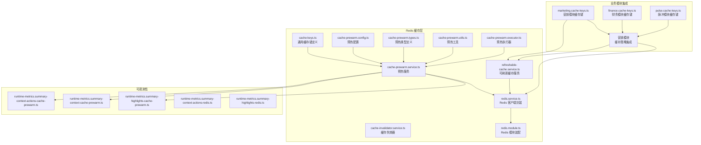
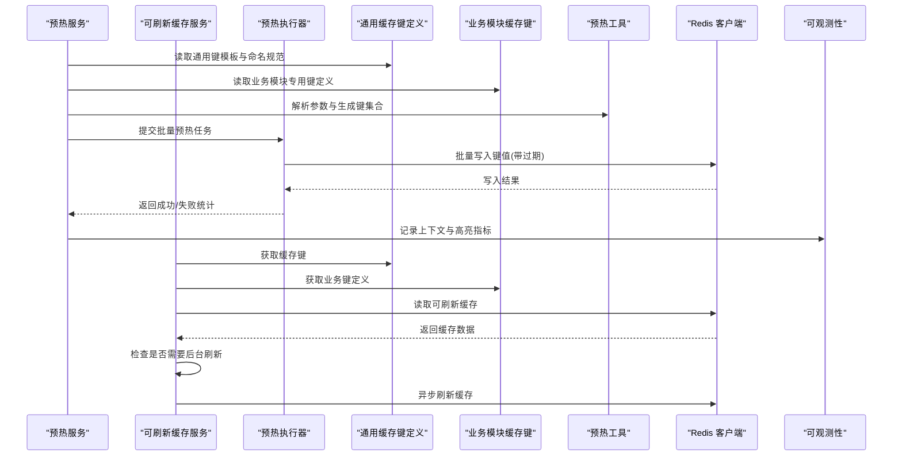
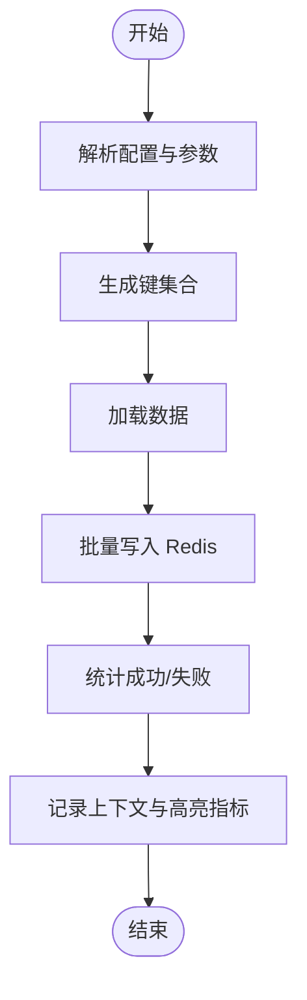
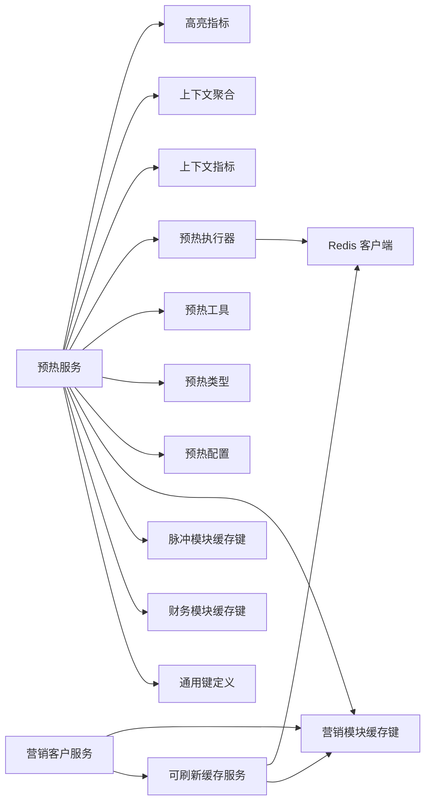

# 缓存策略设计

<cite>
**本文档引用的文件**
- [cache-keys.ts](file://src/redis/cache-keys.ts)
- [cache-prewarm.config.ts](file://src/redis/cache-prewarm.config.ts)
- [cache-prewarm.types.ts](file://src/redis/cache-prewarm.types.ts)
- [cache-prewarm.utils.ts](file://src/redis/cache-prewarm.utils.ts)
- [cache-prewarm.executor.ts](file://src/redis/cache-prewarm.executor.ts)
- [cache-prewarm.service.ts](file://src/redis/cache-prewarm.service.ts)
- [cache-invalidator.service.ts](file://src/redis/cache-invalidator.service.ts)
- [redis.service.ts](file://src/redis/redis.service.ts)
- [redis.module.ts](file://src/redis/redis.module.ts)
- [finance.cache-keys.ts](file://src/purely-profit/finance/finance.cache-keys.ts)
- [pulse.cache-keys.ts](file://src/purely-pulse/pulse.cache-keys.ts)
- [runtime-metrics.summary-context-actions-cache-prewarm.ts](file://src/observability/runtime-metrics.summary-context-actions-cache-prewarm.ts)
- [runtime-metrics.summary-context-cache-prewarm.ts](file://src/observability/runtime-metrics.summary-context-cache-prewarm.ts)
- [runtime-metrics.summary-highlights-cache-prewarm.ts](file://src/observability/runtime-metrics.summary-highlights-cache-prewarm.ts)
- [runtime-metrics.summary-context-actions-redis.ts](file://src/observability/runtime-metrics.summary-context-actions-redis.ts)
- [runtime-metrics.summary-highlights-redis.ts](file://src/observability/runtime-metrics.summary-highlights-redis.ts)
- [marketing.cache-keys.ts](file://src/redis/keys/marketing.cache-keys.ts)
- [members.cache-keys.ts](file://src/redis/keys/members.cache-keys.ts)
- [refreshable-cache.service.ts](file://src/redis/refreshable-cache.service.ts)
- [refreshable-cache.types.ts](file://src/redis/refreshable-cache.types.ts)
- [marketing-customers.service.ts](file://src/purely-profit/marketing/marketing-customers.service.ts)
</cite>

## 更新摘要
**所做更改**
- 新增客户详情缓存支持，实现按门店维度管理缓存键和精确失效功能
- 扩展可配置TTL缓存机制，支持后台刷新和智能失效功能
- 增强营销模块缓存策略，集成RefreshableCacheService实现动态刷新
- 完善缓存键命名规范，新增顾客详情缓存键定义和管理函数
- 优化缓存失效机制，支持按业务域和键前缀的精确清理

## 目录
1. [引言](#引言)
2. [项目结构](#项目结构)
3. [核心组件](#核心组件)
4. [架构总览](#架构总览)
5. [详细组件分析](#详细组件分析)
6. [依赖关系分析](#依赖关系分析)
7. [性能考量](#性能考量)
8. [故障排查指南](#故障排查指南)
9. [结论](#结论)
10. [附录](#附录)

## 引言
本文件围绕缓存策略设计展开，系统性阐述缓存键命名规范、缓存键生成算法与管理策略；详述缓存预热配置参数、预热策略选择与优先级排序；并给出缓存键冲突处理、键过期时间设置与键空间管理的最佳实践。随着缓存策略的现代化升级，系统新增了客户详情缓存支持，实现了按门店维度的缓存键管理和精确失效机制。同时引入了可配置的TTL缓存机制，支持后台刷新和智能失效功能，进一步提升了缓存系统的灵活性和性能表现。

## 项目结构
本项目的缓存相关能力经过现代化重构，集中在Redis模块中，围绕"键定义、预热配置、执行器、失效器、服务封装"等模块协同工作，同时在营销和财务等业务模块中实现了缓存策略的深度集成。通过可观测性模块对缓存预热进行上下文与高亮指标统计。新增的RefreshableCacheService提供了可配置TTL和后台刷新能力，增强了缓存系统的智能化水平。

**图表来源**
- [cache-keys.ts](file://src/redis/cache-keys.ts)
- [cache-prewarm.config.ts](file://src/redis/cache-prewarm.config.ts)
- [cache-prewarm.types.ts](file://src/redis/cache-prewarm.types.ts)
- [cache-prewarm.utils.ts](file://src/redis/cache-prewarm.utils.ts)
- [cache-prewarm.executor.ts](file://src/redis/cache-prewarm.executor.ts)
- [cache-prewarm.service.ts](file://src/redis/cache-prewarm.service.ts)
- [cache-invalidator.service.ts](file://src/redis/cache-invalidator.service.ts)
- [redis.service.ts](file://src/redis/redis.service.ts)
- [redis.module.ts](file://src/redis/redis.module.ts)
- [finance.cache-keys.ts](file://src/purely-profit/finance/finance.cache-keys.ts)
- [pulse.cache-keys.ts](file://src/purely-pulse/pulse.cache-keys.ts)
- [marketing.cache-keys.ts](file://src/redis/keys/marketing.cache-keys.ts)
- [refreshable-cache.service.ts](file://src/redis/refreshable-cache.service.ts)
- [runtime-metrics.summary-context-actions-cache-prewarm.ts](file://src/observability/runtime-metrics.summary-context-actions-cache-prewarm.ts)
- [runtime-metrics.summary-context-cache-prewarm.ts](file://src/observability/runtime-metrics.summary-context-cache-prewarm.ts)
- [runtime-metrics.summary-highlights-cache-prewarm.ts](file://src/observability/runtime-metrics.summary-highlights-cache-prewarm.ts)
- [runtime-metrics.summary-context-actions-redis.ts](file://src/observability/runtime-metrics.summary-context-actions-redis.ts)
- [runtime-metrics.summary-highlights-redis.ts](file://src/observability/runtime-metrics.summary-highlights-redis.ts)

**章节来源**
- [cache-keys.ts](file://src/redis/cache-keys.ts)
- [cache-prewarm.config.ts](file://src/redis/cache-prewarm.config.ts)
- [cache-prewarm.types.ts](file://src/redis/cache-prewarm.types.ts)
- [cache-prewarm.utils.ts](file://src/redis/cache-prewarm.utils.ts)
- [cache-prewarm.executor.ts](file://src/redis/cache-prewarm.executor.ts)
- [cache-prewarm.service.ts](file://src/redis/cache-prewarm.service.ts)
- [cache-invalidator.service.ts](file://src/redis/cache-invalidator.service.ts)
- [redis.service.ts](file://src/redis/redis.service.ts)
- [redis.module.ts](file://src/redis/redis.module.ts)
- [finance.cache-keys.ts](file://src/purely-profit/finance/finance.cache-keys.ts)
- [pulse.cache-keys.ts](file://src/purely-pulse/pulse.cache-keys.ts)
- [marketing.cache-keys.ts](file://src/redis/keys/marketing.cache-keys.ts)
- [refreshable-cache.service.ts](file://src/redis/refreshable-cache.service.ts)
- [runtime-metrics.summary-context-actions-cache-prewarm.ts](file://src/observability/runtime-metrics.summary-context-actions-cache-prewarm.ts)
- [runtime-metrics.summary-context-cache-prewarm.ts](file://src/observability/runtime-metrics.summary-context-cache-prewarm.ts)
- [runtime-metrics.summary-highlights-cache-prewarm.ts](file://src/observability/runtime-metrics.summary-highlights-cache-prewarm.ts)
- [runtime-metrics.summary-context-actions-redis.ts](file://src/observability/runtime-metrics.summary-context-actions-redis.ts)
- [runtime-metrics.summary-highlights-redis.ts](file://src/observability/runtime-metrics.summary-highlights-redis.ts)

## 核心组件
- **通用缓存键定义**：集中管理所有业务键的命名规范与生成规则，确保全局一致性与可维护性。
- **预热配置与类型**：定义预热任务的参数、策略与优先级，统一调度入口。
- **预热工具与执行器**：提供通用的键生成、批量预热与错误处理逻辑。
- **预热服务**：编排预热流程，协调执行器与 Redis 客户端，输出可观测指标。
- **缓存失效器**：按业务域或键前缀进行失效，避免脏数据传播。
- **Redis 封装**：提供统一的连接、命令封装与模块装配，降低上层耦合。
- **可刷新缓存服务**：支持可配置TTL、后台刷新和智能失效的高级缓存机制。
- **业务模块缓存键**：营销和财务模块中的专用缓存键定义，实现业务域的精细化缓存管理。
- **可观测性**：对缓存预热过程进行上下文与高亮指标统计，便于问题定位与容量规划。

**章节来源**
- [cache-keys.ts](file://src/redis/cache-keys.ts)
- [cache-prewarm.config.ts](file://src/redis/cache-prewarm.config.ts)
- [cache-prewarm.types.ts](file://src/redis/cache-prewarm.types.ts)
- [cache-prewarm.utils.ts](file://src/redis/cache-prewarm.utils.ts)
- [cache-prewarm.executor.ts](file://src/redis/cache-prewarm.executor.ts)
- [cache-prewarm.service.ts](file://src/redis/cache-prewarm.service.ts)
- [cache-invalidator.service.ts](file://src/redis/cache-invalidator.service.ts)
- [redis.service.ts](file://src/redis/redis.service.ts)
- [redis.module.ts](file://src/redis/redis.module.ts)
- [refreshable-cache.service.ts](file://src/redis/refreshable-cache.service.ts)
- [finance.cache-keys.ts](file://src/purely-profit/finance/finance.cache-keys.ts)
- [pulse.cache-keys.ts](file://src/purely-pulse/pulse.cache-keys.ts)
- [marketing.cache-keys.ts](file://src/redis/keys/marketing.cache-keys.ts)
- [runtime-metrics.summary-context-actions-cache-prewarm.ts](file://src/observability/runtime-metrics.summary-context-actions-cache-prewarm.ts)
- [runtime-metrics.summary-context-cache-prewarm.ts](file://src/observability/runtime-metrics.summary-context-cache-prewarm.ts)
- [runtime-metrics.summary-highlights-cache-prewarm.ts](file://src/observability/runtime-metrics.summary-highlights-cache-prewarm.ts)
- [runtime-metrics.summary-context-actions-redis.ts](file://src/observability/runtime-metrics.summary-context-actions-redis.ts)
- [runtime-metrics.summary-highlights-redis.ts](file://src/observability/runtime-metrics.summary-highlights-redis.ts)

## 架构总览
缓存策略经过现代化重构，由"通用键定义—业务模块集成—配置—执行—服务—失效—观测"闭环构成。新增的可刷新缓存服务作为中枢，负责解析配置、调用执行器批量生成与写入键值，同时记录上下文与高亮指标；失效器在数据变更时触发清理；Redis 封装提供稳定的数据通道。业务模块（营销、财务）通过专用的缓存键定义实现精细化的缓存策略管理。

**图表来源**
- [cache-prewarm.service.ts](file://src/redis/cache-prewarm.service.ts)
- [cache-prewarm.executor.ts](file://src/redis/cache-prewarm.executor.ts)
- [cache-keys.ts](file://src/redis/cache-keys.ts)
- [finance.cache-keys.ts](file://src/purely-profit/finance/finance.cache-keys.ts)
- [pulse.cache-keys.ts](file://src/purely-pulse/pulse.cache-keys.ts)
- [marketing.cache-keys.ts](file://src/redis/keys/marketing.cache-keys.ts)
- [refreshable-cache.service.ts](file://src/redis/refreshable-cache.service.ts)
- [cache-prewarm.utils.ts](file://src/redis/cache-prewarm.utils.ts)
- [redis.service.ts](file://src/redis/redis.service.ts)
- [runtime-metrics.summary-context-cache-prewarm.ts](file://src/observability/runtime-metrics.summary-context-cache-prewarm.ts)
- [runtime-metrics.summary-highlights-cache-prewarm.ts](file://src/observability/runtime-metrics.summary-highlights-cache-prewarm.ts)

## 详细组件分析

### 缓存键命名规范与生成算法
- **命名规范**
  - 统一前缀：以业务域或功能模块为前缀，避免键冲突。
  - 分层标识：使用分隔符串联层级信息（如租户、实体、维度），保证可读性与可检索性。
  - 版本化：对热点键引入版本号，便于灰度与回滚。
  - 参数化：对动态参数采用标准化编码，确保相同语义生成相同键。
- **生成算法**
  - 键模板：在键定义文件中集中声明模板，明确占位符与默认值。
  - 参数校验：对输入参数进行合法性与范围检查，防止异常键产生。
  - 哈希与截断：对超长键进行哈希摘要，保留前缀可读性与后缀唯一性。
  - 去重与合并：对重复键进行合并，减少冗余写入。
- **管理策略**
  - 键生命周期：为不同键设定合理的过期时间，避免无限增长。
  - 键空间隔离：按租户、环境或业务线划分键空间，降低相互影响。
  - 清理策略：定期扫描与清理过期键，保持键空间整洁。

**更新** 新增客户详情缓存键支持，实现了按门店维度的精细化缓存键管理。

**章节来源**
- [cache-keys.ts](file://src/redis/cache-keys.ts)
- [finance.cache-keys.ts](file://src/purely-profit/finance/finance.cache-keys.ts)
- [pulse.cache-keys.ts](file://src/purely-pulse/pulse.cache-keys.ts)
- [marketing.cache-keys.ts](file://src/redis/keys/marketing.cache-keys.ts)

### 可刷新缓存机制与TTL管理
- **可刷新缓存特性**
  - 动态TTL：根据访问频率与业务特性设置差异化 TTL。
  - 后台刷新：在缓存即将过期时异步刷新数据，维持命中率。
  - 智能失效：基于数据变更事件触发定向失效，平衡一致性与性能。
  - 任务去重：防止并发刷新导致的重复计算和资源浪费。
- **TTL配置策略**
  - 列表缓存：较长的TTL（如60秒）配合较短的刷新间隔（如20秒）。
  - 详情缓存：较短的TTL（如15秒）确保数据的实时性。
  - 动态调整：根据业务场景和访问模式动态调整TTL参数。
- **后台刷新机制**
  - 延迟调度：在refreshAt时间点之前安排异步刷新任务。
  - 队列管理：使用队列控制并发刷新，避免资源竞争。
  - 错误处理：刷新失败不影响当前请求，仅记录错误日志。

**更新** 新增可刷新缓存服务，支持可配置TTL和后台刷新功能。

**章节来源**
- [refreshable-cache.service.ts](file://src/redis/refreshable-cache.service.ts)
- [refreshable-cache.types.ts](file://src/redis/refreshable-cache.types.ts)
- [marketing-customers.service.ts](file://src/purely-profit/marketing/marketing-customers.service.ts)

### 营销模块客户详情缓存实现
- **客户详情缓存设计**
  - 键结构：`profit:marketing:customer:detail:store:${storeId}:id:${customerId}`
  - TTL设置：15秒短TTL确保客户信息的实时性
  - 失效策略：客户信息变更时精确失效对应缓存键
- **缓存加载流程**
  - 先查询数据库获取客户信息
  - 鉴权验证用户访问权限
  - 写入可刷新缓存并设置TTL
  - 启动后台刷新任务
- **性能优化**
  - 列表缓存TTL 60秒，刷新间隔20秒
  - 详情缓存TTL 15秒，避免过度延迟
  - 头像信息从多源fallback获取，提升用户体验

**更新** 新增客户详情缓存支持，实现了完整的缓存加载、刷新和失效机制。

**章节来源**
- [marketing.cache-keys.ts](file://src/redis/keys/marketing.cache-keys.ts)
- [marketing-customers.service.ts](file://src/purely-profit/marketing/marketing-customers.service.ts)
- [refreshable-cache.service.ts](file://src/redis/refreshable-cache.service.ts)

### 缓存预热配置、策略与优先级
- **配置参数**
  - 任务粒度：支持按实体、按维度、按租户的批量预热。
  - 并发控制：限制并发写入数量，避免对下游造成压力。
  - 过期策略：统一设置 TTL，或针对不同键设置差异化 TTL。
  - 失败重试：定义最大重试次数与退避策略，提升成功率。
- **策略选择**
  - 启动预热：应用启动时预热关键路径数据，缩短首屏时间。
  - 周期预热：定时刷新热点键，维持命中率。
  - 事件驱动：在数据变更后触发定向预热，平衡一致性与性能。
- **优先级排序**
  - 业务价值：优先预热高流量、高收益的键。
  - 时效性：优先预热近期高频访问的键。
  - 依赖链：先预热上游依赖，再预热下游消费方。

**章节来源**
- [cache-prewarm.config.ts](file://src/redis/cache-prewarm.config.ts)
- [cache-prewarm.types.ts](file://src/redis/cache-prewarm.types.ts)
- [cache-prewarm.utils.ts](file://src/redis/cache-prewarm.utils.ts)

### 预热执行器与服务编排
- **执行器职责**
  - 键生成：依据模板与参数生成完整键集合。
  - 数据加载：从数据库或计算服务拉取最新数据。
  - 批量写入：使用流水线或批量命令写入 Redis，降低 RTT。
  - 错误处理：对单条失败进行隔离与重试，汇总统计。
- **服务编排**
  - 参数解析：读取配置与上下文参数，构建执行计划。
  - 调度与监控：协调执行器，记录上下文指标与高亮指标。
  - 结果回传：返回成功/失败计数与失败详情，便于告警与重试。

**图表来源**
- [cache-prewarm.service.ts](file://src/redis/cache-prewarm.service.ts)
- [cache-prewarm.executor.ts](file://src/redis/cache-prewarm.executor.ts)
- [cache-prewarm.utils.ts](file://src/redis/cache-prewarm.utils.ts)
- [redis.service.ts](file://src/redis/redis.service.ts)
- [runtime-metrics.summary-context-cache-prewarm.ts](file://src/observability/runtime-metrics.summary-context-cache-prewarm.ts)
- [runtime-metrics.summary-highlights-cache-prewarm.ts](file://src/observability/runtime-metrics.summary-highlights-cache-prewarm.ts)

**章节来源**
- [cache-prewarm.service.ts](file://src/redis/cache-prewarm.service.ts)
- [cache-prewarm.executor.ts](file://src/redis/cache-prewarm.executor.ts)
- [cache-prewarm.utils.ts](file://src/redis/cache-prewarm.utils.ts)
- [redis.service.ts](file://src/redis/redis.service.ts)
- [runtime-metrics.summary-context-cache-prewarm.ts](file://src/observability/runtime-metrics.summary-context-cache-prewarm.ts)
- [runtime-metrics.summary-highlights-cache-prewarm.ts](file://src/observability/runtime-metrics.summary-highlights-cache-prewarm.ts)

### 缓存键冲突处理、过期时间与键空间管理
- **冲突处理**
  - 前缀隔离：不同业务域使用独立前缀，避免跨域覆盖。
  - 版本化键：对同名键引入版本号，新旧键共存过渡。
  - 命名审计：建立键命名审查机制，提前发现潜在冲突。
- **过期时间**
  - 动态 TTL：根据访问频率与业务特性设置差异化 TTL。
  - 自适应刷新：对即将过期的键进行异步刷新，维持命中率。
  - 批量清理：定期扫描过期键，释放内存。
- **键空间管理**
  - 命名空间：按租户/环境/模块划分键空间，降低耦合。
  - 清理策略：对历史键与废弃键制定清理计划，保持健康键空间。

**更新** 新增按门店维度的精确失效机制，支持更细粒度的缓存管理。

**章节来源**
- [cache-keys.ts](file://src/redis/cache-keys.ts)
- [cache-invalidator.service.ts](file://src/redis/cache-invalidator.service.ts)
- [marketing.cache-keys.ts](file://src/redis/keys/marketing.cache-keys.ts)

### 业务模块缓存策略集成
- **营销模块缓存策略**
  - 专用缓存键定义：营销模块拥有独立的缓存键命名规范，支持客户、产品、促销等多维度缓存。
  - 实时性要求：针对营销活动的实时性需求，设置较短的缓存过期时间。
  - 个性化缓存：支持用户级别的个性化缓存键，提升用户体验。
  - 客户详情缓存：新增客户详情缓存，支持按门店和客户ID的精确管理。
- **财务模块缓存策略**
  - 数据准确性：财务数据对准确性要求极高，缓存策略需平衡性能与一致性。
  - 报表缓存：针对财务报表的批量查询，实现预热缓存以提升响应速度。
  - 交易缓存：对高频交易数据设置合理的缓存策略，避免数据陈旧。
- **脉冲模块缓存策略**
  - 实时监控：脉冲模块的监控数据需要实时更新，缓存策略需支持快速刷新。
  - 指标缓存：对常用的业务指标进行预热缓存，支持快速查询。

**更新** 营销模块新增客户详情缓存支持，实现了更精细化的缓存管理。

**章节来源**
- [finance.cache-keys.ts](file://src/purely-profit/finance/finance.cache-keys.ts)
- [pulse.cache-keys.ts](file://src/purely-pulse/pulse.cache-keys.ts)
- [marketing.cache-keys.ts](file://src/redis/keys/marketing.cache-keys.ts)
- [marketing-customers.service.ts](file://src/purely-profit/marketing/marketing-customers.service.ts)

### 代码示例与最佳实践
- **设计高效缓存键结构**
  - 使用统一前缀与分层标识，确保键可读且可检索。
  - 对动态参数进行标准化编码，避免键碎片化。
  - 为热点键引入版本号，便于灰度与回滚。
  - 参考路径：[cache-keys.ts](file://src/redis/cache-keys.ts)、[marketing.cache-keys.ts](file://src/redis/keys/marketing.cache-keys.ts)
- **业务模块缓存策略实现**
  - 营销模块：实现客户画像、产品推荐等个性化缓存策略，包括客户详情缓存。
  - 财务模块：实现报表数据、账户余额等高频查询的缓存优化。
  - 脉冲模块：实现实时监控指标的快速缓存方案。
  - 参考路径：[finance.cache-keys.ts](file://src/purely-profit/finance/finance.cache-keys.ts)、[pulse.cache-keys.ts](file://src/purely-pulse/pulse.cache-keys.ts)、[marketing.cache-keys.ts](file://src/redis/keys/marketing.cache-keys.ts)
- **选择合适缓存策略**
  - 首屏优化：启动预热关键路径数据。
  - 热点维护：周期性刷新热点键。
  - 一致性：事件驱动预热，平衡一致性与性能。
  - 可刷新缓存：使用RefreshableCacheService实现智能刷新。
  - 参考路径：[cache-prewarm.config.ts](file://src/redis/cache-prewarm.config.ts)、[cache-prewarm.types.ts](file://src/redis/cache-prewarm.types.ts)、[refreshable-cache.service.ts](file://src/redis/refreshable-cache.service.ts)
- **实施预热执行与监控**
  - 使用执行器进行批量写入，记录上下文与高亮指标。
  - 参考路径：[cache-prewarm.service.ts](file://src/redis/cache-prewarm.service.ts)、[cache-prewarm.executor.ts](file://src/redis/cache-prewarm.executor.ts)、[runtime-metrics.summary-context-cache-prewarm.ts](file://src/observability/runtime-metrics.summary-context-cache-prewarm.ts)、[runtime-metrics.summary-highlights-cache-prewarm.ts](file://src/observability/runtime-metrics.summary-highlights-cache-prewarm.ts)

**更新** 新增可刷新缓存的使用示例和最佳实践。

## 依赖关系分析
- **组件耦合**
  - 预热服务依赖通用键定义、业务模块缓存键、配置、工具与执行器，形成清晰的编排层。
  - 执行器依赖 Redis 客户端进行批量写入，耦合度低，便于替换实现。
  - 失效器与键定义配合，确保键空间的可控演进。
  - 业务模块通过专用缓存键与通用缓存层解耦，实现模块化管理。
  - 可刷新缓存服务提供高级缓存能力，被业务模块按需使用。
- **外部依赖**
  - Redis 客户端封装提供稳定的连接与命令接口，降低上层复杂度。
  - 可观测性模块贯穿预热流程，提供运行时洞察。

**图表来源**
- [cache-prewarm.service.ts](file://src/redis/cache-prewarm.service.ts)
- [cache-keys.ts](file://src/redis/cache-keys.ts)
- [finance.cache-keys.ts](file://src/purely-profit/finance/finance.cache-keys.ts)
- [pulse.cache-keys.ts](file://src/purely-pulse/pulse.cache-keys.ts)
- [marketing.cache-keys.ts](file://src/redis/keys/marketing.cache-keys.ts)
- [cache-prewarm.config.ts](file://src/redis/cache-prewarm.config.ts)
- [cache-prewarm.types.ts](file://src/redis/cache-prewarm.types.ts)
- [cache-prewarm.utils.ts](file://src/redis/cache-prewarm.utils.ts)
- [cache-prewarm.executor.ts](file://src/redis/cache-prewarm.executor.ts)
- [redis.service.ts](file://src/redis/redis.service.ts)
- [refreshable-cache.service.ts](file://src/redis/refreshable-cache.service.ts)
- [marketing-customers.service.ts](file://src/purely-profit/marketing/marketing-customers.service.ts)
- [runtime-metrics.summary-context-actions-cache-prewarm.ts](file://src/observability/runtime-metrics.summary-context-actions-cache-prewarm.ts)
- [runtime-metrics.summary-context-cache-prewarm.ts](file://src/observability/runtime-metrics.summary-context-cache-prewarm.ts)
- [runtime-metrics.summary-highlights-cache-prewarm.ts](file://src/observability/runtime-metrics.summary-highlights-cache-prewarm.ts)

**章节来源**
- [cache-prewarm.service.ts](file://src/redis/cache-prewarm.service.ts)
- [cache-prewarm.executor.ts](file://src/redis/cache-prewarm.executor.ts)
- [redis.service.ts](file://src/redis/redis.service.ts)
- [refreshable-cache.service.ts](file://src/redis/refreshable-cache.service.ts)
- [marketing-customers.service.ts](file://src/purely-profit/marketing/marketing-customers.service.ts)
- [runtime-metrics.summary-context-actions-cache-prewarm.ts](file://src/observability/runtime-metrics.summary-context-actions-cache-prewarm.ts)
- [runtime-metrics.summary-context-cache-prewarm.ts](file://src/observability/runtime-metrics.summary-context-cache-prewarm.ts)
- [runtime-metrics.summary-highlights-cache-prewarm.ts](file://src/observability/runtime-metrics.summary-highlights-cache-prewarm.ts)

## 性能考量
- **批量化与流水线**：使用批量写入与流水线命令降低网络往返，提升吞吐。
- **并发与限流**：合理设置并发度与速率限制，避免对 Redis 造成瞬时压力。
- **TTL 策略**：为不同键设置差异化 TTL，兼顾命中率与内存占用。
- **清理与回收**：定期清理过期键，防止键空间膨胀导致性能下降。
- **可观测性**：通过上下文与高亮指标及时发现异常，快速响应。
- **业务模块优化**：营销、财务、脉冲模块根据各自特点优化缓存策略，提升整体性能。
- **后台刷新优化**：使用队列控制并发刷新，避免资源竞争和重复计算。

**更新** 新增后台刷新机制的性能优化考虑。

## 故障排查指南
- **预热失败**
  - 检查参数合法性与键生成是否正确。
  - 查看执行器返回的失败统计与重试日志。
  - 参考路径：[cache-prewarm.service.ts](file://src/redis/cache-prewarm.service.ts)、[cache-prewarm.executor.ts](file://src/redis/cache-prewarm.executor.ts)
- **键冲突或覆盖**
  - 核对键前缀与命名规范，确保唯一性。
  - 引入版本号或命名审计机制。
  - 参考路径：[cache-keys.ts](file://src/redis/cache-keys.ts)
- **业务模块缓存异常**
  - 检查业务模块专用缓存键定义是否正确。
  - 验证业务逻辑与缓存策略的匹配度。
  - 参考路径：[finance.cache-keys.ts](file://src/purely-profit/finance/finance.cache-keys.ts)、[pulse.cache-keys.ts](file://src/purely-pulse/pulse.cache-keys.ts)、[marketing.cache-keys.ts](file://src/redis/keys/marketing.cache-keys.ts)
- **键空间异常**
  - 检查过期策略与清理计划，确认键空间健康。
  - 使用失效器按域清理，避免脏数据扩散。
  - 参考路径：[cache-invalidator.service.ts](file://src/redis/cache-invalidator.service.ts)
- **观测缺失**
  - 确认指标模块已启用并正确记录上下文与高亮指标。
  - 参考路径：[runtime-metrics.summary-context-cache-prewarm.ts](file://src/observability/runtime-metrics.summary-context-cache-prewarm.ts)、[runtime-metrics.summary-highlights-cache-prewarm.ts](file://src/observability/runtime-metrics.summary-highlights-cache-prewarm.ts)
- **可刷新缓存问题**
  - 检查TTL配置是否合理，避免频繁刷新或数据陈旧。
  - 查看后台刷新任务的执行状态和错误日志。
  - 验证刷新任务的去重机制是否正常工作。
  - 参考路径：[refreshable-cache.service.ts](file://src/redis/refreshable-cache.service.ts)、[marketing-customers.service.ts](file://src/purely-profit/marketing/marketing-customers.service.ts)

**更新** 新增可刷新缓存相关的故障排查指南。

**章节来源**
- [cache-prewarm.service.ts](file://src/redis/cache-prewarm.service.ts)
- [cache-prewarm.executor.ts](file://src/redis/cache-prewarm.executor.ts)
- [cache-keys.ts](file://src/redis/cache-keys.ts)
- [finance.cache-keys.ts](file://src/purely-profit/finance/finance.cache-keys.ts)
- [pulse.cache-keys.ts](file://src/purely-pulse/pulse.cache-keys.ts)
- [marketing.cache-keys.ts](file://src/redis/keys/marketing.cache-keys.ts)
- [cache-invalidator.service.ts](file://src/redis/cache-invalidator.service.ts)
- [refreshable-cache.service.ts](file://src/redis/refreshable-cache.service.ts)
- [marketing-customers.service.ts](file://src/purely-profit/marketing/marketing-customers.service.ts)
- [runtime-metrics.summary-context-cache-prewarm.ts](file://src/observability/runtime-metrics.summary-context-cache-prewarm.ts)
- [runtime-metrics.summary-highlights-cache-prewarm.ts](file://src/observability/runtime-metrics.summary-highlights-cache-prewarm.ts)

## 结论
通过统一的键命名规范、严谨的预热配置与执行编排、完善的失效与清理策略，以及可观测性的全程覆盖，本项目实现了可扩展、可维护、高性能的缓存体系。经过现代化重构，缓存策略设计原则已深度整合到营销管理和财务模块中，通过Redis集成实现更高效的缓存机制。新增的客户详情缓存支持和可刷新缓存机制进一步提升了系统的灵活性和性能表现。建议在实际业务中遵循"前缀隔离、版本化、差异化 TTL、批量写入、持续观测"的原则，结合各业务模块的特点，迭代优化缓存策略。

## 附录
- **Redis 模块装配与客户端封装**：确保缓存层的稳定与可替换性。
- **业务模块缓存键定义**：营销和财务模块的专用缓存键实现。
- **可观测性指标集成**：全面的缓存性能监控与分析能力。
- **可刷新缓存机制**：支持TTL配置、后台刷新和智能失效的高级缓存功能。
- 参考路径：[redis.module.ts](file://src/redis/redis.module.ts)、[redis.service.ts](file://src/redis/redis.service.ts)、[finance.cache-keys.ts](file://src/purely-profit/finance/finance.cache-keys.ts)、[pulse.cache-keys.ts](file://src/purely-pulse/pulse.cache-keys.ts)、[marketing.cache-keys.ts](file://src/redis/keys/marketing.cache-keys.ts)、[refreshable-cache.service.ts](file://src/redis/refreshable-cache.service.ts)