# 缓存系统

<cite>
**本文档引用的文件**
- [src/redis/redis.service.ts](file://src/redis/redis.service.ts)
- [src/redis/redis.module.ts](file://src/redis/redis.module.ts)
- [src/config/configuration.ts](file://src/config/configuration.ts)
- [src/redis/cache-prewarm.service.ts](file://src/redis/cache-prewarm.service.ts)
- [src/redis/cache-prewarm-cycle.service.ts](file://src/redis/cache-prewarm-cycle.service.ts)
- [src/redis/cache-prewarm.config.ts](file://src/redis/cache-prewarm.config.ts)
- [src/redis/cache-prewarm.types.ts](file://src/redis/cache-prewarm.types.ts)
- [src/redis/cache-prewarm-members-meta.provider.ts](file://src/redis/cache-prewarm-members-meta.provider.ts)
- [src/redis/cache-prewarm-members-overview.provider.ts](file://src/redis/cache-prewarm-members-overview.provider.ts)
- [src/redis/cache-prewarm-marketing-overview.provider.ts](file://src/redis/cache-prewarm-marketing-overview.provider.ts)
- [src/redis/cache-prewarm-finance-overview.provider.ts](file://src/redis/cache-prewarm-finance-overview.provider.ts)
- [src/redis/cache-prewarm-profit-dashboard-home.provider.ts](file://src/redis/cache-prewarm-profit-dashboard-home.provider.ts)
- [src/redis/cache-prewarm-profit-read.config.ts](file://src/redis/cache-prewarm-profit-read.config.ts)
- [src/redis/cache-keys.ts](file://src/redis/cache-keys.ts)
- [src/redis/cache-invalidator.service.ts](file://src/redis/cache-invalidator.service.ts)
- [src/redis/cache-prewarm.executor.ts](file://src/redis/cache-prewarm.executor.ts)
- [src/redis/cache-prewarm.log.ts](file://src/redis/cache-prewarm.log.ts)
- [src/redis/cache-prewarm.error.ts](file://src/redis/cache-prewarm.error.ts)
- [src/queue/queue.module.ts](file://src/queue/queue.module.ts)
- [src/queue/queue-scheduler.service.ts](file://src/queue/queue-scheduler.service.ts)
- [src/queue/cache-prewarm.processor.ts](file://src/queue/cache-prewarm.processor.ts)
- [src/queue/space-auto-checkout.processor.ts](file://src/queue/space-auto-checkout.processor.ts)
- [src/redis/redis-lock.service.ts](file://src/redis/redis-lock.service.ts)
- [src/purely-profit/finance/finance-overview.service.ts](file://src/purely-profit/finance/finance-overview.service.ts)
- [src/purely-profit/dashboard/dashboard-home/dashboard-home.service.ts](file://src/purely-profit/dashboard/dashboard-home/dashboard-home.service.ts)
- [src/purely-profit/dashboard/business-analysis/business-analysis.service.ts](file://src/purely-profit/dashboard/business-analysis/business-analysis.service.ts)
- [src/purely-profit/auth/auth-code.service.ts](file://src/purely-profit/auth/auth-code.service.ts)
- [src/redis/refreshable-cache.service.ts](file://src/redis/refreshable-cache.service.ts)
- [src/redis/concurrency-limiter.util.ts](file://src/redis/concurrency-limiter.util.ts)
- [src/redis/refreshable-cache.types.ts](file://src/redis/refreshable-cache.types.ts)
- [src/redis/keys/index.ts](file://src/redis/keys/index.ts)
- [src/redis/keys/dashboard.cache-keys.ts](file://src/redis/keys/dashboard.cache-keys.ts)
- [src/redis/keys/members.cache-keys.ts](file://src/redis/keys/members.cache-keys.ts)
</cite>

## 更新摘要
**所做更改**
- 新增完整的消息队列基础设施：基于 BullMQ + Redis 的异步任务调度系统
- 实现分布式锁机制：基于 Redis SETNX 操作的可靠分布式互斥锁
- 增强缓存预热策略：从 setInterval 轮询迁移到 BullMQ 定时任务
- 新增空间自动结账功能：定时扫描并自动处理超时空间会话
- 改进连接管理：为 BullMQ 配置独立的 Redis 连接，支持阻塞命令
- 优化错误处理：增强管道操作和后台任务的异常处理机制
- **重大增强**：引入 RefreshableCacheService 提供智能缓存刷新能力，包括后台任务调度和并发限制
- **架构重构**：缓存键从单个 monolithic 文件重新组织为按域划分的模块结构，提高可维护性

## 目录
1. [引言](#引言)
2. [项目结构](#项目结构)
3. [核心组件](#核心组件)
4. [架构总览](#架构总览)
5. [详细组件分析](#详细组件分析)
6. [消息队列基础设施](#消息队列基础设施)
7. [分布式锁机制](#分布式锁机制)
8. [增强的缓存预热策略](#增强的缓存预热策略)
9. [智能缓存刷新机制](#智能缓存刷新机制)
10. [依赖关系分析](#依赖关系分析)
11. [性能考量](#性能考量)
12. [故障排查指南](#故障排查指南)
13. [结论](#结论)
14. [附录](#附录)

## 引言
本技术文档围绕缓存系统展开，重点阐述以下方面：
- **缓存策略设计原则**：以键空间扫描与批量预热为核心，结合并发控制与慢操作采样，确保热点数据在请求前完成加载。
- **消息队列驱动的任务调度**：基于 BullMQ + Redis 的可靠定时任务系统，替代原有的 setInterval 轮询模式。
- **分布式锁机制**：基于 Redis SETNX 操作的原子性分布式互斥锁，支持重试和 Lua 脚本安全释放。
- **缓存预热机制**：周期性扫描 Redis 键空间，按类别分组并并发刷新，记录周期指标与慢键样本，支持日志采样与阈值告警。
- **缓存失效管理**：基于模块化键模式的精确删除策略，覆盖多业务域（利润看板、经营分析、财务概览、营销概览、成员管理等），并提供派生数据级联失效。
- **Redis 集成方案**：统一的 Redis 客户端封装，提供慢命令日志与观测指标上报；支持背景刷新任务去重；新增原子操作支持。
- **智能缓存刷新**：全新的 RefreshableCacheService 提供智能缓存刷新能力，包含后台任务调度和并发限制，防止数据库过载。
- **缓存键管理**：**已重构** 从单个 monolithic 文件重新组织为按域划分的模块结构，提高了可维护性和扩展性。
- **配置项与执行器**：集中于配置中心，支持开关、间隔、批大小、并发度、日志采样与慢周期阈值等参数。
- **与数据库的关系、一致性与故障处理**：通过"预热"减少冷启动抖动，配合失效策略保障最终一致性；错误分类与采样帮助定位问题。
- **监控、调试与性能调优**：周期指标、慢键采样、慢 Redis 命令告警、并发与批大小调参建议。

## 项目结构
缓存系统主要位于 src/redis 目录，围绕"键管理、Redis 服务、预热服务、失效服务、配置与类型、日志与错误元数据"组织，同时与业务模块（dashboard、finance、marketing、member 等）协作完成预热目标。**新增** 消息队列基础设施位于 src/queue 目录，提供基于 BullMQ 的异步任务调度能力。**重大重构** 缓存键管理已从单个文件拆分为按业务域划分的模块化结构。

```mermaid
graph TB
subgraph "缓存层"
RDS["RedisService<br/>统一Redis客户端<br/>新增并发限制器"]
KMS["CacheKeys<br/>模块化键管理"]
REFRESH["RefreshableCacheService<br/>智能缓存刷新"]
CL["ConcurrencyLimiter<br/>并发限制器"]
INV["CacheInvalidatorService<br/>键模式失效"]
PREWARM["CachePrewarmService<br/>周期预热调度"]
CYCLE["CachePrewarmCycleService<br/>循环执行器"]
EXEC["prewarmCacheCategory<br/>并发预热执行器"]
AUTH["AuthService<br/>分布式锁示例"]
LOCK["RedisLockService<br/>分布式锁服务"]
end
subgraph "消息队列层"
QM["QueueModule<br/>BullMQ配置"]
QS["QueueSchedulerService<br/>任务调度器"]
CPQ["CachePrewarmProcessor<br/>缓存预热处理器"]
SACQ["SpaceAutoCheckoutProcessor<br/>空间自动结账处理器"]
end
subgraph "业务模块"
DH["DashboardHomeService"]
BA["BusinessAnalysisService"]
FO["FinanceOverviewService"]
MO["MarketingOverviewService"]
MEM["MembersService"]
SPACES["SpacesModule<br/>空间管理"]
end
subgraph "模块化键管理"
DASHKEYS["dashboard.cache-keys.ts"]
MEMKEYS["members.cache-keys.ts"]
MKTKEYS["marketing.cache-keys.ts"]
SALESKEYS["sales.cache-keys.ts"]
COSTSKEYS["costs.cache-keys.ts"]
PROFITKEYS["profit-detail.cache-keys.ts"]
INDEX["keys/index.ts<br/>统一导出"]
end
CFG["CachePrewarmConfig<br/>类别配置"]
PROFITCFG["ProfitReadCachePrewarmConfig<br/>利润读取配置"]
TYPES["CachePrewarmTypes<br/>类型定义"]
LOG["CachePrewarmLog<br/>日志构建"]
ERR["CachePrewarmError<br/>错误元数据"]
PREWARM --> RDS
PREWARM --> CYCLE
PREWARM --> CFG
PREWARM --> PROFITCFG
PREWARM --> DH
PREWARM --> BA
PREWARM --> FO
PREWARM --> MO
PREWARM --> MEM
CFG --> EXEC
PROFITCFG --> EXEC
EXEC --> DH
EXEC --> BA
EXEC --> FO
EXEC --> MO
EXEC --> MEM
RDS --> KMS
RDS --> CL
RDS --> REFRESH
RDS --> LOCK
REFRESH --> CL
INV --> RDS
PREWARM --> LOG
PREWARM --> ERR
PREWARM --> TYPES
AUTH --> RDS
QM --> QS
QM --> CPQ
QM --> SACQ
QS --> CPQ
QS --> SACQ
CPQ --> CYCLE
SACQ --> SPACES
KMS --> INDEX
INDEX --> DASHKEYS
INDEX --> MEMKEYS
INDEX --> MKTKEYS
INDEX --> SALESKEYS
INDEX --> COSTSKEYS
INDEX --> PROFITKEYS
```

**图表来源**
- [src/redis/redis.service.ts:1-323](file://src/redis/redis.service.ts#L1-L323)
- [src/redis/refreshable-cache.service.ts:1-182](file://src/redis/refreshable-cache.service.ts#L1-L182)
- [src/redis/concurrency-limiter.util.ts:1-67](file://src/redis/concurrency-limiter.util.ts#L1-L67)
- [src/redis/keys/index.ts:1-145](file://src/redis/keys/index.ts#L1-L145)
- [src/redis/keys/dashboard.cache-keys.ts:1-73](file://src/redis/keys/dashboard.cache-keys.ts#L1-L73)
- [src/redis/keys/members.cache-keys.ts:1-150](file://src/redis/keys/members.cache-keys.ts#L1-L150)
- [src/redis/cache-keys.ts:1-136](file://src/redis/cache-keys.ts#L1-L136)
- [src/redis/cache-invalidator.service.ts:1-90](file://src/redis/cache-invalidator.service.ts#L1-L90)
- [src/redis/cache-prewarm.service.ts:1-106](file://src/redis/cache-prewarm.service.ts#L1-L106)
- [src/redis/cache-prewarm-cycle.service.ts:1-134](file://src/redis/cache-prewarm-cycle.service.ts#L1-L134)
- [src/redis/cache-prewarm.config.ts:1-26](file://src/redis/cache-prewarm.config.ts#L1-L26)
- [src/redis/cache-prewarm-profit-read.config.ts:1-15](file://src/redis/cache-prewarm-profit-read.config.ts#L1-L15)
- [src/redis/cache-prewarm.executor.ts:1-96](file://src/redis/cache-prewarm.executor.ts#L1-L96)
- [src/redis/cache-prewarm.log.ts:1-88](file://src/redis/cache-prewarm.log.ts#L1-L88)
- [src/redis/cache-prewarm.error.ts:1-51](file://src/redis/cache-prewarm.error.ts#L1-L51)
- [src/redis/redis-lock.service.ts:1-228](file://src/redis/redis-lock.service.ts#L1-L228)
- [src/queue/queue.module.ts:1-91](file://src/queue/queue.module.ts#L1-L91)
- [src/queue/queue-scheduler.service.ts:1-119](file://src/queue/queue-scheduler.service.ts#L1-L119)
- [src/queue/cache-prewarm.processor.ts:1-71](file://src/queue/cache-prewarm.processor.ts#L1-L71)
- [src/queue/space-auto-checkout.processor.ts:1-90](file://src/queue/space-auto-checkout.processor.ts#L1-L90)

**章节来源**
- [src/redis/redis.module.ts:1-57](file://src/redis/redis.module.ts#L1-L57)
- [src/config/configuration.ts:1-295](file://src/config/configuration.ts#L1-L295)

## 核心组件
- **RedisService**：统一连接、命令包装、慢命令日志与观测指标上报、键扫描、批量删除、背景刷新任务去重。**新增** 并发限制器支持、可刷新缓存机制、改进的管道操作错误处理。
- **RefreshableCacheService**：**全新组件** 提供智能缓存刷新能力，包含后台任务调度、并发限制、任务去重和优雅降级。
- **ConcurrencyLimiter**：**新增工具类** 管理并发缓存刷新操作，防止数据库过载。
- **RedisLockService**：**新增** 基于 Redis SETNX 操作的分布式锁服务，支持重试获取和 Lua 脚本安全释放。
- **CacheKeys**：**已重构** 从单个 monolithic 文件重新组织为按域划分的模块结构，提供更好的可维护性。
- **CachePrewarmService**：周期性扫描、并发预热、指标聚合、日志采样与慢周期告警。**已迁移** 到 BullMQ 定时任务。
- **CachePrewarmCycleService**：循环执行器，协调各个预热类别的执行。
- **CachePrewarmConfig**：将业务域映射到扫描模式与预热函数。
- **CachePrewarmExecutor**：并发批次处理、慢键采样、错误元数据提取。
- **CacheInvalidatorService**：基于模式的精确失效与派生数据级联失效。
- **QueueModule**：**新增** 基于 BullMQ 的消息队列模块，提供异步任务调度能力。
- **QueueSchedulerService**：**新增** 任务调度器，注册和管理重复执行的定时任务。
- **配置中心**：集中管理缓存预热、Redis 慢命令阈值、缓存刷新并发度等参数。

**章节来源**
- [src/redis/redis.service.ts:1-323](file://src/redis/redis.service.ts#L1-L323)
- [src/redis/refreshable-cache.service.ts:1-182](file://src/redis/refreshable-cache.service.ts#L1-L182)
- [src/redis/concurrency-limiter.util.ts:1-67](file://src/redis/concurrency-limiter.util.ts#L1-L67)
- [src/redis/redis-lock.service.ts:1-228](file://src/redis/redis-lock.service.ts#L1-L228)
- [src/redis/cache-keys.ts:1-136](file://src/redis/cache-keys.ts#L1-L136)
- [src/redis/keys/index.ts:1-145](file://src/redis/keys/index.ts#L1-L145)
- [src/redis/cache-prewarm.service.ts:1-106](file://src/redis/cache-prewarm.service.ts#L1-L106)
- [src/redis/cache-prewarm-cycle.service.ts:1-134](file://src/redis/cache-prewarm-cycle.service.ts#L1-L134)
- [src/redis/cache-prewarm.config.ts:1-26](file://src/redis/cache-prewarm.config.ts#L1-L26)
- [src/redis/cache-prewarm.executor.ts:1-96](file://src/redis/cache-prewarm.executor.ts#L1-L96)
- [src/redis/cache-invalidator.service.ts:1-90](file://src/redis/cache-invalidator.service.ts#L1-L90)
- [src/queue/queue.module.ts:1-91](file://src/queue/queue.module.ts#L1-L91)
- [src/queue/queue-scheduler.service.ts:1-119](file://src/queue/queue-scheduler.service.ts#L1-L119)
- [src/config/configuration.ts:54-95](file://src/config/configuration.ts#L54-L95)

## 架构总览
缓存系统采用"扫描-解析-并发刷新"的流水线式预热架构，**现已迁移到基于 BullMQ 的消息队列驱动**。预热服务通过 BullMQ 定时任务触发，周期性扫描指定键模式，解析出业务参数后并发调用对应业务服务进行缓存刷新，并汇总周期指标与慢键样本用于监控与告警。**新增的智能缓存刷新机制** 提供了更精细化的缓存管理，支持后台异步刷新和并发控制。

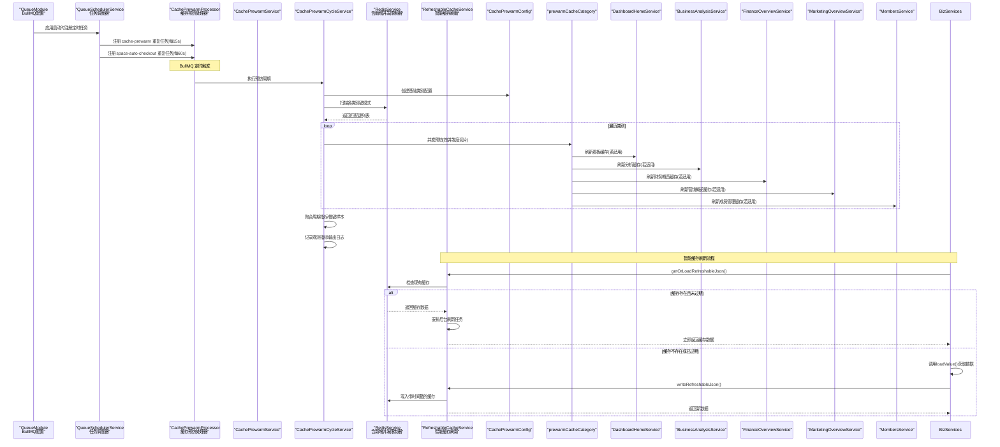

**图表来源**
- [src/queue/queue.module.ts:23-91](file://src/queue/queue.module.ts#L23-L91)
- [src/queue/queue-scheduler.service.ts:31-119](file://src/queue/queue-scheduler.service.ts#L31-L119)
- [src/queue/cache-prewarm.processor.ts:26-71](file://src/queue/cache-prewarm.processor.ts#L26-L71)
- [src/redis/cache-prewarm.service.ts:81-104](file://src/redis/cache-prewarm.service.ts#L81-L104)
- [src/redis/cache-prewarm-cycle.service.ts:45-71](file://src/redis/cache-prewarm-cycle.service.ts#L45-L71)
- [src/redis/cache-prewarm.config.ts:18-25](file://src/redis/cache-prewarm.config.ts#L18-L25)
- [src/redis/cache-prewarm.executor.ts:14-95](file://src/redis/cache-prewarm.executor.ts#L14-L95)
- [src/redis/redis.service.ts:270-288](file://src/redis/redis.service.ts#L270-L288)
- [src/redis/refreshable-cache.service.ts:34-83](file://src/redis/refreshable-cache.service.ts#L34-L83)

## 详细组件分析

### 预热服务（CachePrewarmService）
- **生命周期**：模块初始化时根据配置设置初始延迟与周期定时器，销毁时清理定时器。**已迁移** 到 BullMQ 定时任务。
- **执行流程**：创建类别配置 -> 并行扫描各类别键模式 -> 对每个类别并发执行预热 -> 聚合指标与慢键样本 -> 记录观测指标与条件化日志。
- **关键参数**：开关、间隔、初始延迟、批大小、并发度、日志开关与采样频率、慢周期阈值。
- **并发模型**：按并发度切片，每批内部 Promise.all 并发执行，避免阻塞。
- **错误处理**：捕获单次周期异常并记录失败指标，不影响后续周期。

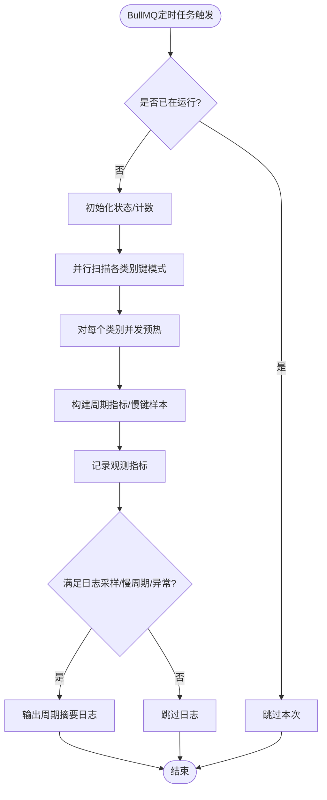

**图表来源**
- [src/redis/cache-prewarm.service.ts:81-104](file://src/redis/cache-prewarm.service.ts#L81-L104)

**章节来源**
- [src/redis/cache-prewarm.service.ts:1-106](file://src/redis/cache-prewarm.service.ts#L1-L106)
- [src/config/configuration.ts:64-91](file://src/config/configuration.ts#L64-L91)

### 预热循环服务（CachePrewarmCycleService）
- 协调各个预热类别的执行，负责扫描键模式、并发预热和指标聚合。
- 支持可选的日志记录和慢周期阈值检查。
- 将预热结果转换为周期指标并上报观测系统。

**章节来源**
- [src/redis/cache-prewarm-cycle.service.ts:1-134](file://src/redis/cache-prewarm-cycle.service.ts#L1-L134)

### 预热执行器（prewarmCacheCategory）
- 输入：类别、键数组、解析器、刷新函数、并发度。
- 处理逻辑：逐批并发执行，对每个键先解析业务参数，再调用刷新函数；记录耗时与慢键样本；统计成功/失败/无效/跳过数量；计算耗时分布与慢键Top-N。
- 错误元数据：从字符串、Error 实例或对象载荷中提取 errorTag 与 failedReason，便于日志与告警。

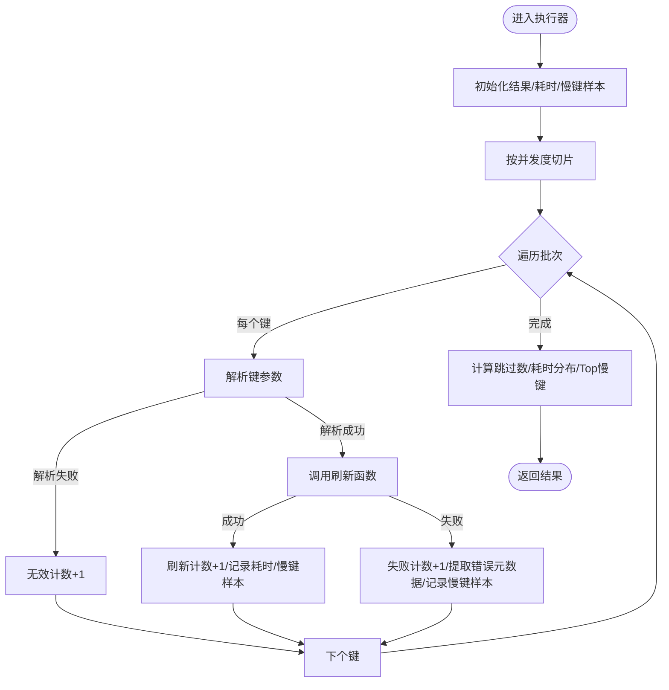

**图表来源**
- [src/redis/cache-prewarm.executor.ts:14-95](file://src/redis/cache-prewarm.executor.ts#L14-L95)
- [src/redis/cache-prewarm.error.ts:15-50](file://src/redis/cache-prewarm.error.ts#L15-L50)

**章节来源**
- [src/redis/cache-prewarm.executor.ts:1-96](file://src/redis/cache-prewarm.executor.ts#L1-L96)
- [src/redis/cache-prewarm.error.ts:1-51](file://src/redis/cache-prewarm.error.ts#L1-L51)

### 模块化键管理（CacheKeys）
**重大重构** 缓存键管理已从单个 monolithic 文件重新组织为按业务域划分的模块化结构：

**新的架构优势**：
- **领域分离**：每个业务域拥有独立的键管理文件，提高代码可维护性
- **统一入口**：通过 `keys/index.ts` 提供统一的导出接口，保持向后兼容
- **类型安全**：每个域文件包含专门的类型定义和验证逻辑
- **易于扩展**：新增业务域只需添加新的键管理文件

**支持的领域**：
- Dashboard（利润看板）：`dashboard.cache-keys.ts`
- Members（成员管理）：`members.cache-keys.ts`  
- Marketing（营销管理）：`marketing.cache-keys.ts`
- Sales（销售管理）：`sales.cache-keys.ts`
- Costs（成本管理）：`costs.cache-keys.ts`
- Profit Detail（利润详情）：`profit-detail.cache-keys.ts`

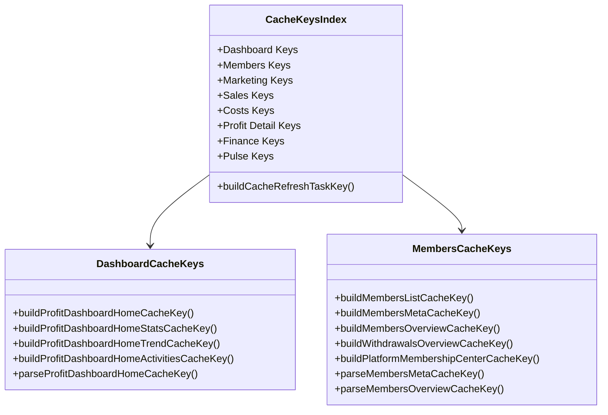

**图表来源**
- [src/redis/keys/index.ts:1-145](file://src/redis/keys/index.ts#L1-L145)
- [src/redis/keys/dashboard.cache-keys.ts:1-73](file://src/redis/keys/dashboard.cache-keys.ts#L1-L73)
- [src/redis/keys/members.cache-keys.ts:1-150](file://src/redis/keys/members.cache-keys.ts#L1-L150)
- [src/redis/cache-keys.ts:1-136](file://src/redis/cache-keys.ts#L1-L136)

**章节来源**
- [src/redis/cache-keys.ts:1-136](file://src/redis/cache-keys.ts#L1-L136)
- [src/redis/keys/index.ts:1-145](file://src/redis/keys/index.ts#L1-L145)
- [src/redis/keys/dashboard.cache-keys.ts:1-73](file://src/redis/keys/dashboard.cache-keys.ts#L1-L73)
- [src/redis/keys/members.cache-keys.ts:1-150](file://src/redis/keys/members.cache-keys.ts#L1-L150)

### Redis 服务（RedisService）
- 连接：从配置中心读取 host/port/password/db，支持连接超时、命令超时和最大重试次数配置。
- 命令包装：统一 GET/SET/DEL/SCAN/EXISTS 包装，自动上报观测指标与慢命令日志。
- 键扫描：基于 SCAN 渐进式扫描，支持 limit 截断。
- 批量删除：DEL 多键，返回删除数量。
- 背景刷新：以 taskKey 去重，避免重复后台刷新任务堆积。
- **新增并发限制器**：通过 ConcurrencyLimiter 控制后台刷新任务的并发度，防止资源争用。
- **新增可刷新缓存**：支持智能缓存刷新机制，包含生成时间和刷新时间戳。
- **改进管道操作**：增强 delByPattern 中的管道操作错误处理，添加 pipeline.exec() 返回 null 的防护。

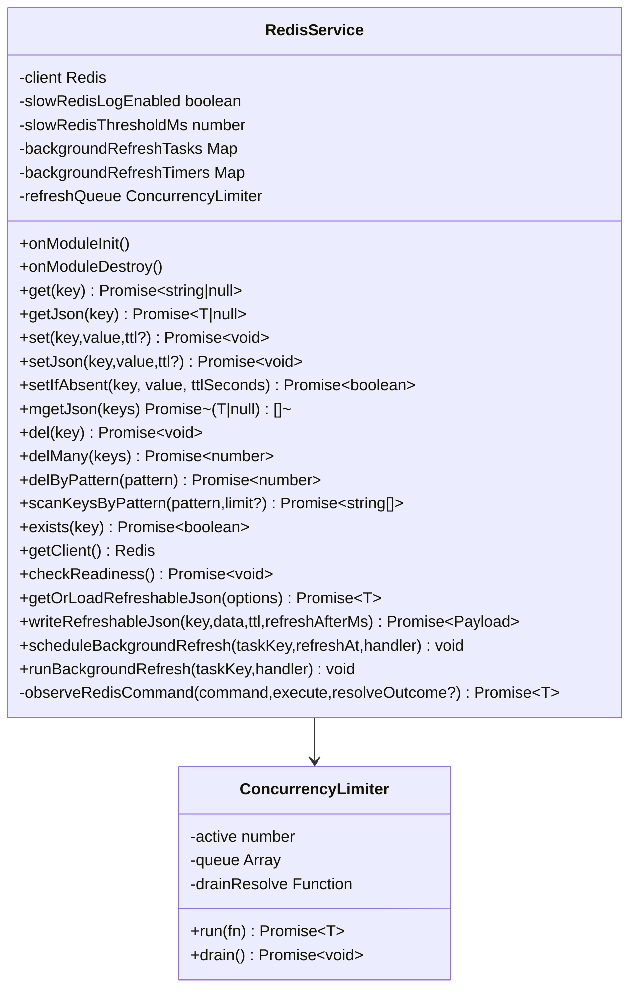

**图表来源**
- [src/redis/redis.service.ts:1-323](file://src/redis/redis.service.ts#L1-L323)

**章节来源**
- [src/redis/redis.service.ts:1-323](file://src/redis/redis.service.ts#L1-L323)

### 失效服务（CacheInvalidatorService）
- 精准失效：按 storeId 维度的模式删除，或按键直接删除。
- 级联失效：针对派生数据（如销售相关）提供批量失效方法，降低不一致窗口。
- 使用场景：写操作后触发，或按需手动触发，确保下游读路径尽快看到最新数据。

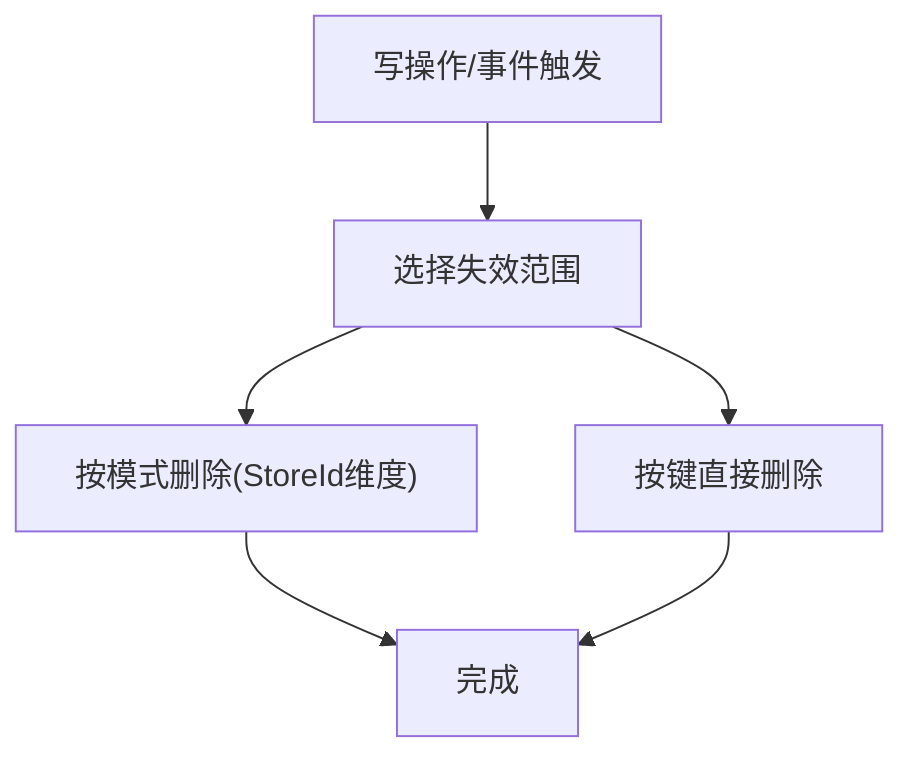

**图表来源**
- [src/redis/cache-invalidator.service.ts:19-88](file://src/redis/cache-invalidator.service.ts#L19-L88)

**章节来源**
- [src/redis/cache-invalidator.service.ts:1-90](file://src/redis/cache-invalidator.service.ts#L1-L90)

### 预热配置与类型
- 类别配置：将 dashboardHome、businessAnalysis、financeOverview 映射到扫描模式与预热函数。
- 利润读取配置：专门管理利润相关读取操作的预热类别，包括新增的 membersMeta、membersOverview、marketingOverview。
- 类型定义：涵盖类别、结果、周期指标、耗时分布、慢键样本等，确保跨模块契约一致。

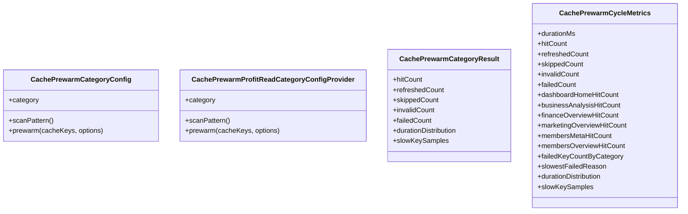

**图表来源**
- [src/redis/cache-prewarm.config.ts:18-25](file://src/redis/cache-prewarm.config.ts#L18-L25)
- [src/redis/cache-prewarm.types.ts:45-83](file://src/redis/cache-prewarm.types.ts#L45-L83)

**章节来源**
- [src/redis/cache-prewarm.config.ts:1-26](file://src/redis/cache-prewarm.config.ts#L1-L26)
- [src/redis/cache-prewarm-profit-read.config.ts:1-15](file://src/redis/cache-prewarm-profit-read.config.ts#L1-L15)
- [src/redis/cache-prewarm.types.ts:1-84](file://src/redis/cache-prewarm.types.ts#L1-L84)

### 日志与错误元数据
- 日志构建：周期摘要日志包含耗时、命中/刷新/跳过/无效/失败计数、各类别平均与P95耗时、最慢键与最慢失败原因。
- 错误元数据：从字符串、Error 实例或对象载荷中提取 errorTag 与 failedReason，便于统一归因与告警。

**章节来源**
- [src/redis/cache-prewarm.log.ts:30-87](file://src/redis/cache-prewarm.log.ts#L30-L87)
- [src/redis/cache-prewarm.error.ts:15-50](file://src/redis/cache-prewarm.error.ts#L15-L50)

## 消息队列基础设施

### BullMQ 模块配置
**新增** 的 QueueModule 提供了基于 BullMQ + Redis 的完整消息队列基础设施：

**核心特性**：
- **独立 Redis 连接**：为 BullMQ 配置专用连接，支持 maxRetriesPerRequest=null 以满足 BLPOP 等阻塞命令需求
- **离线队列支持**：Redis 断连期间命令排队，重连后自动发送
- **指数退避重连**：自动重连策略，最大 5 秒间隔
- **任务持久化**：完成后保留 1 天，失败后保留 7 天，便于排查

**当前队列**：
- `cache-prewarm`：定时预热首页、经营分析等热点缓存（每 15s）
- `space-auto-checkout`：定时扫描并自动结账超时空间会话（每 60s）

**章节来源**
- [src/queue/queue.module.ts:11-91](file://src/queue/queue.module.ts#L11-L91)

### 任务调度服务（QueueSchedulerService）
**新增** 的任务调度服务负责应用启动时自动注册 repeatable jobs：

**功能特性**：
- **自动任务注册**：应用启动时自动注册所有定时任务
- **配置驱动**：支持通过环境变量动态调整任务间隔和参数
- **任务去重**：使用固定 jobId 防止重复注册
- **多 Worker 支持**：基于 Redis BLPOP 的天然负载均衡

**章节来源**
- [src/queue/queue-scheduler.service.ts:1-119](file://src/queue/queue-scheduler.service.ts#L1-L119)

### 缓存预热处理器（CachePrewarmProcessor）
**新增** 的处理器替代了原有的 setInterval 轮询模式：

**核心优势**：
- **可靠性保证**：BullMQ repeatable job 确保多 worker 环境下只有一个实例执行
- **任务隔离**：单 worker 单并发，防止同一 worker 内重复执行
- **错误处理**：完善的任务失败处理和日志记录
- **性能监控**：内置任务执行时间和成功率监控

**章节来源**
- [src/queue/cache-prewarm.processor.ts:1-71](file://src/queue/cache-prewarm.processor.ts#L1-L71)

### 空间自动结账处理器（SpaceAutoCheckoutProcessor）
**新增** 的空间自动结账处理器实现了定时扫描和自动结账功能：

**业务功能**：
- **超时检测**：每 60s 扫描所有门店的超时倒计时空间会话
- **自动结账**：对超时的会话执行自动结账流程
- **结果统计**：记录处理的会话数量和执行时长
- **异常处理**：任务失败时抛出异常，由 BullMQ 记录并在下一周期重试

**章节来源**
- [src/queue/space-auto-checkout.processor.ts:1-90](file://src/queue/space-auto-checkout.processor.ts#L1-L90)

## 分布式锁机制

### RedisLockService 设计
**新增** 的 RedisLockService 提供了基于 Redis SETNX 操作的分布式互斥锁：

**核心特性**：
- **原子性获取**：基于 Redis SETNX + TTL 实现原子性锁获取
- **唯一 Token**：每个锁持有者获得唯一的 UUID token
- **Lua 脚本释放**：使用 Lua 脚本确保只有锁持有者才能释放锁
- **重试机制**：支持配置重试次数和重试间隔
- **装饰器风格接口**：withLock 方法提供简洁的使用体验

**适用场景**：
- 空间开台并发控制
- 交班记录并发创建  
- 定时任务多实例互斥

**章节来源**
- [src/redis/redis-lock.service.ts:1-228](file://src/redis/redis-lock.service.ts#L1-L228)

### 分布式锁工作流程
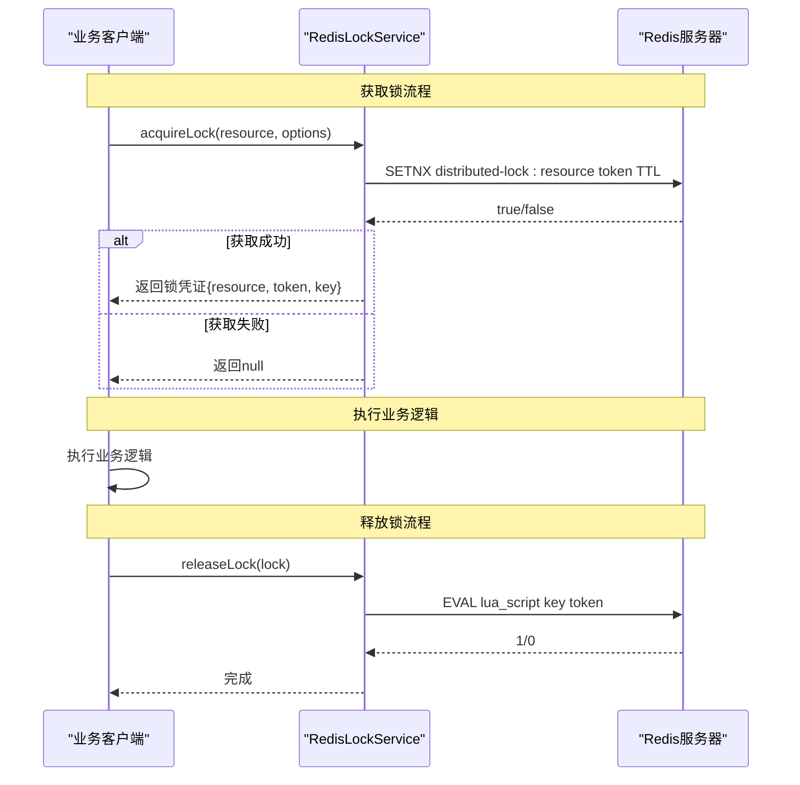

**图表来源**
- [src/redis/redis-lock.service.ts:76-149](file://src/redis/redis-lock.service.ts#L76-L149)

### 锁 Key 命名规范
分布式锁使用统一的 Key 命名规范：
- **格式**：`distributed-lock:{resource}`
- **示例**：`distributed-lock:space:session:open:123`
- **Token**：使用 Node.js crypto.randomUUID() 生成唯一标识符

**章节来源**
- [src/redis/redis-lock.service.ts:197-202](file://src/redis/redis-lock.service.ts#L197-L202)

## 增强的缓存预热策略

### 从 setInterval 到 BullMQ 的迁移
缓存预热系统已从传统的 setInterval 轮询模式迁移到基于 BullMQ 的可靠任务调度：

**迁移优势**：
- **可靠性提升**：BullMQ 提供任务持久化和失败重试机制
- **多实例支持**：天然支持多 worker 环境下的任务去重
- **监控增强**：内置任务执行状态和性能监控
- **配置灵活**：支持运行时动态调整任务间隔和参数

**兼容性保持**：
- 保留了原有的 CachePrewarmService 接口
- 向后兼容现有的预热逻辑和业务服务
- 无缝迁移，无需修改上层业务代码

**章节来源**
- [src/redis/cache-prewarm.service.spec.ts:1-40](file://src/redis/cache-prewarm.service.spec.ts#L1-L40)

### 新增预热类别
系统新增了多个专门的预热类别，覆盖更多业务场景：

**新增类别**：
- **成员元数据预热**（membersMeta）：处理成员基本信息的缓存预热
- **成员概览预热**（membersOverview）：处理成员统计数据的缓存预热
- **营销概览预热**（marketing-overview）：处理营销相关统计数据的缓存预热
- **财务概览预热**（finance-overview）：支持财务数据的缓存预热
- **利润看板首页预热**（profit-dashboard-home）：增强按时间段维度的预热

**章节来源**
- [src/redis/cache-prewarm-members-meta.provider.ts:1-25](file://src/redis/cache-prewarm-members-meta.provider.ts#L1-L25)
- [src/redis/cache-prewarm-members-overview.provider.ts:1-25](file://src/redis/cache-prewarm-members-overview.provider.ts#L1-L25)
- [src/redis/cache-prewarm-marketing-overview.provider.ts:1-26](file://src/redis/cache-prewarm-marketing-overview.provider.ts#L1-L26)
- [src/redis/cache-prewarm-finance-overview.provider.ts:1-29](file://src/redis/cache-prewarm-finance-overview.provider.ts#L1-L29)
- [src/redis/cache-prewarm-profit-dashboard-home.provider.ts:1-29](file://src/redis/cache-prewarm-profit-dashboard-home.provider.ts#L1-L29)

### 增强的 Redis 连接管理

#### 改进的连接配置
RedisService 在连接建立时支持更详细的配置选项：

**新增配置项**：
- 连接超时（connectTimeoutMs）：默认 5000ms
- 命令超时（commandTimeoutMs）：默认 3000ms  
- 每请求最大重试次数（maxRetriesPerRequest）：默认 3次
- 启用就绪检查（enableReadyCheck）：确保连接建立后Redis处于就绪状态
- 延迟连接（lazyConnect）：立即建立连接实例

**章节来源**
- [src/redis/redis.service.ts:30-51](file://src/redis/redis.service.ts#L30-L51)
- [src/config/configuration.ts:165-182](file://src/config/configuration.ts#L165-L182)

#### 并发限制器（ConcurrencyLimiter）
新增的 ConcurrencyLimiter 类提供精确的并发控制机制：

**功能特性**：
- 队列管理：维护活跃任务计数和等待队列
- 优雅降级：当达到并发上限时，新任务排队等待
- 钩子支持：提供 drain() 方法等待所有任务完成
- 错误传播：正确处理异步任务中的异常

**应用场景**：
- 控制后台缓存刷新任务的并发度
- 防止缓存系统过载
- 提供资源使用的可视化监控

**章节来源**
- [src/redis/concurrency-limiter.util.ts:1-67](file://src/redis/concurrency-limiter.util.ts#L1-L67)

#### 改进的管道操作错误处理

##### 管道执行防护机制
在 delByPattern 方法中，新增了对 pipeline.exec() 返回 null 的防护机制：

**问题背景**：
- ioredis 在某些情况下可能返回 null 而不是错误数组
- 这可能导致删除计数统计不准确
- 影响缓存失效的可靠性

**解决方案**：
- 添加 countPipelineDeleted 辅助函数统计删除数量
- 在 pipeline.exec() 返回 null 时记录警告日志
- 确保即使在异常情况下也能正确统计删除数量

**改进效果**：
- 提高管道操作的健壮性
- 增强缓存失效的可靠性
- 提供更好的错误诊断能力

**章节来源**
- [src/redis/concurrency-limiter.util.ts:52-67](file://src/redis/concurrency-limiter.util.ts#L52-L67)
- [src/redis/redis.service.ts:166-200](file://src/redis/redis.service.ts#L166-L200)

## 智能缓存刷新机制

### RefreshableCacheService 设计
**全新组件** RefreshableCacheService 提供了智能缓存刷新能力，解决了传统缓存系统的痛点：

**核心特性**：
- **智能过期检测**：基于 generatedAt 和 refreshAt 时间戳的精确过期控制
- **后台异步刷新**：在缓存即将过期时自动安排后台刷新任务
- **并发限制**：通过 ConcurrencyLimiter 控制刷新任务的并发度，防止数据库过载
- **任务去重**：相同 taskKey 的刷新任务只会执行一次，避免重复工作
- **优雅降级**：支持 legacy 数据格式的自动迁移和升级
- **资源清理**：模块销毁时自动清理定时器和等待中的任务

**工作原理**：
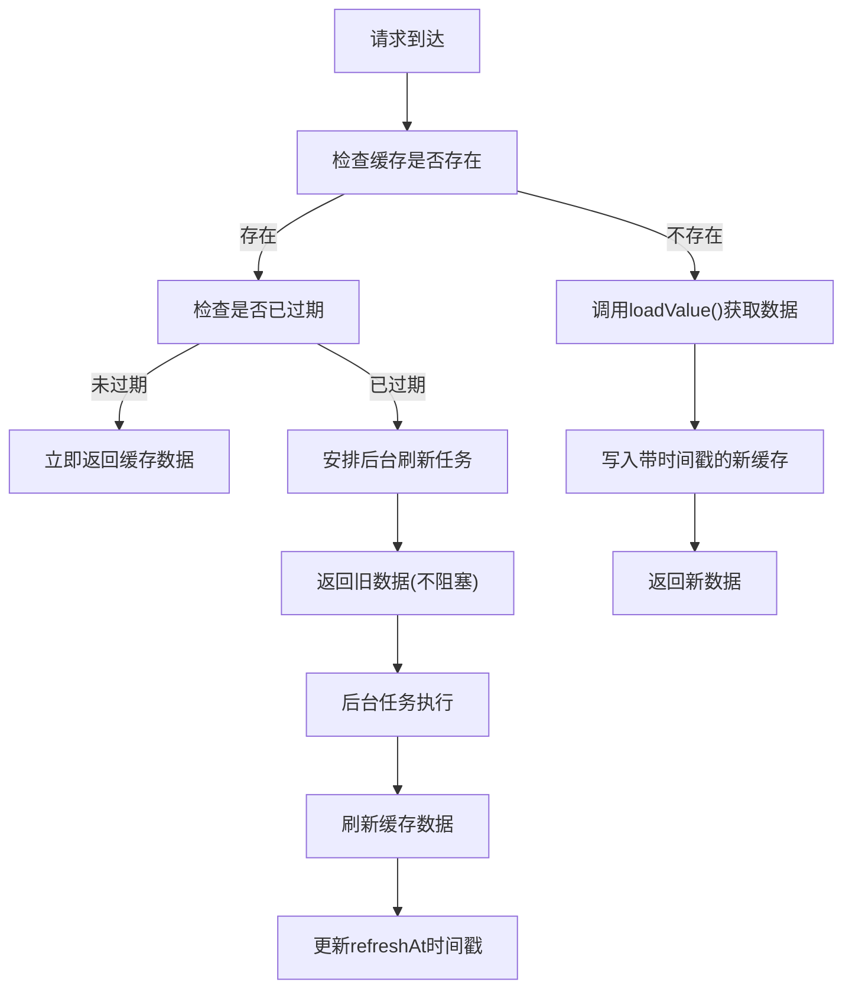

**图表来源**
- [src/redis/refreshable-cache.service.ts:34-83](file://src/redis/refreshable-cache.service.ts#L34-L83)
- [src/redis/refreshable-cache.service.ts:101-136](file://src/redis/refreshable-cache.service.ts#L101-L136)

### 核心 API 参考

#### getOrLoadRefreshableJson
获取或加载可刷新缓存的主要接口：

**参数**：
- `cacheKey`: 缓存键
- `taskKey`: 后台刷新任务标识符
- `ttlSeconds`: 缓存过期时间（秒）
- `refreshAfterMs`: 提前刷新时间（毫秒）
- `loadValue`: 数据加载函数
- `refreshValue`: 可选的数据刷新函数

**返回值**：Promise<T> - 缓存数据

#### writeRefreshableJson
写入可刷新缓存数据：

**参数**：
- `cacheKey`: 缓存键
- `data`: 要缓存的数据
- `ttlSeconds`: 过期时间（秒）
- `refreshAfterMs`: 提前刷新时间（毫秒）

**返回值**：Promise<RefreshableCachePayload<T>> - 包含时间戳的缓存载荷

#### scheduleBackgroundRefresh
安排后台刷新任务：

**参数**：
- `taskKey`: 任务标识符
- `refreshAt`: 刷新时间点（时间戳）
- `handler`: 刷新处理函数

#### runBackgroundRefresh
执行后台刷新任务：

**参数**：
- `taskKey`: 任务标识符
- `handler`: 刷新处理函数

**章节来源**
- [src/redis/refreshable-cache.service.ts:1-182](file://src/redis/refreshable-cache.service.ts#L1-L182)
- [src/redis/refreshable-cache.types.ts:1-15](file://src/redis/refreshable-cache.types.ts#L1-L15)

### 与传统缓存的对比

| 特性 | 传统缓存 | 智能缓存刷新 |
|------|----------|--------------|
| 过期处理 | 完全过期后下次请求才刷新 | 提前安排后台刷新 |
| 响应延迟 | 过期时请求阻塞直到刷新完成 | 始终立即返回缓存数据 |
| 并发控制 | 无 | 通过 ConcurrencyLimiter 控制 |
| 任务去重 | 无 | 相同 taskKey 只执行一次 |
| 资源管理 | 无 | 自动清理定时器和任务 |
| 错误处理 | 简单 | 完善的异常捕获和日志 |
| 数据迁移 | 不支持 | 自动支持 legacy 格式迁移 |

### 使用示例

```typescript
// 基本用法
const data = await refreshableCacheService.getOrLoadRefreshableJson({
  cacheKey: 'user:profile:123',
  taskKey: 'user-profile-refresh:123',
  ttlSeconds: 300,
  refreshAfterMs: 60000, // 提前1分钟刷新
  loadValue: async () => {
    return await userService.getUserProfile(123);
  },
  refreshValue: async () => {
    return await userService.refreshUserProfile(123);
  }
});

// 写入缓存
const payload = await refreshableCacheService.writeRefreshableJson(
  'analytics:daily:2024-01-01',
  analyticsData,
  86400, // 24小时过期
  3600000 // 提前1小时刷新
);
```

**章节来源**
- [src/redis/refreshable-cache.service.ts:34-83](file://src/redis/refreshable-cache.service.ts#L34-L83)
- [src/redis/refreshable-cache.service.ts:85-99](file://src/redis/refreshable-cache.service.ts#L85-L99)

## 依赖关系分析
- **模块耦合**：RedisModule 导入业务模块（dashboard、finance、marketing、member），向全局导出 RedisService、CacheInvalidatorService、CachePrewarmService，形成"基础设施服务"与"业务服务"的解耦。
- **业务依赖**：预热服务依赖业务服务的"warmXxxCache"接口，通过键解析器与刷新函数解耦具体业务实现。
- **外部依赖**：ioredis 客户端、NestJS 配置中心与生命周期钩子。
- **新增依赖**：认证服务依赖RedisService的setIfAbsent原子操作实现分布式锁。
- **队列依赖**：QueueModule 依赖 RedisModule 和 SpacesModule，提供缓存预热和空间自动结账功能。
- **智能刷新依赖**：RefreshableCacheService 依赖 RedisService 和 ConcurrencyLimiter，提供智能缓存管理能力。

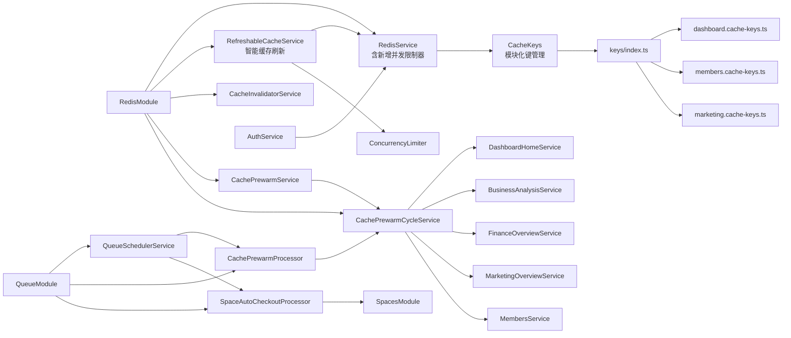

**图表来源**
- [src/redis/redis.module.ts:1-57](file://src/redis/redis.module.ts#L1-L57)
- [src/redis/cache-prewarm.service.ts:21-46](file://src/redis/cache-prewarm.service.ts#L21-L46)
- [src/purely-profit/auth/auth-code.service.ts:269-278](file://src/purely-profit/auth/auth-code.service.ts#L269-L278)
- [src/queue/queue.module.ts:23-91](file://src/queue/queue.module.ts#L23-L91)
- [src/redis/refreshable-cache.service.ts:1-182](file://src/redis/refreshable-cache.service.ts#L1-L182)
- [src/redis/keys/index.ts:1-145](file://src/redis/keys/index.ts#L1-L145)

**章节来源**
- [src/redis/redis.module.ts:1-57](file://src/redis/redis.module.ts#L1-L57)
- [src/redis/cache-prewarm.service.ts:1-46](file://src/redis/cache-prewarm.service.ts#L1-L46)

## 性能考量
- **并发与批大小**：通过并发度与批大小平衡吞吐与资源占用。建议在高峰期适当降低批大小、提高并发度，避免单批阻塞。
- **慢命令阈值**：RedisService 的慢命令阈值与日志开关可按环境调整，生产建议更严格。
- **键扫描成本**：SCAN COUNT 默认 100，limit 可截断，避免一次性扫描过多键导致阻塞。
- **背景刷新**：runBackgroundRefresh 提供任务去重，防止重复刷新造成抖动。
- **观测指标**：周期耗时、各类别 P95、失败率与最慢键样本可用于容量规划与热点识别。
- **新增性能优化**：setIfAbsent 原子操作避免竞态条件，mgetJson 批量操作减少网络开销。
- **新增并发控制**：ConcurrencyLimiter 有效防止缓存系统过载，提高稳定性。
- **新增缓存刷新机制**：智能缓存刷新减少热点数据的刷新压力，提高缓存命中率。
- **新增管道操作防护**：改进的错误处理机制提高缓存失效的可靠性。
- **新增队列性能**：BullMQ 提供高可靠的异步任务处理，支持水平扩展和故障恢复。
- **新增锁性能**：分布式锁使用原子操作和 Lua 脚本，确保高性能和一致性。
- **模块化键管理**：按域划分的键管理结构提高了代码可维护性，减少了编译和加载开销。

## 故障排查指南
- **预热失败定位**：查看周期摘要日志中的最慢失败键与错误标签/原因，结合错误元数据定位根因。
- **慢 Redis 命令**：开启慢命令日志，关注超过阈值的命令类型与耗时。
- **键解析失败**：检查键命名与解析器，确认枚举值与参数格式是否符合预期。
- **失效不生效**：核对失效模式是否覆盖目标键，必要时增加按用户维度的模式。
- **预热未执行**：检查开关、初始延迟与周期间隔配置，确认定时器已启动。
- **新增故障排查**：setIfAbsent 操作失败通常表示键已存在，检查锁竞争情况；mgetJson 返回null表示键不存在或JSON解析失败。
- **新增并发问题**：如果发现后台刷新任务积压，检查 cacheRefreshConcurrency 配置是否过低。
- **新增管道问题**：如果缓存失效统计异常，检查 pipeline.exec() 返回值并查看相关警告日志。
- **新增可刷新缓存问题**：检查生成时间和刷新时间戳是否正确，确认后台刷新任务正常执行。
- **新增队列问题**：检查 BullMQ 任务状态和错误日志，确认 Redis 连接和任务调度是否正常。
- **新增锁问题**：检查分布式锁的获取和释放日志，确认是否存在死锁或锁竞争问题。
- **新增模块化键问题**：如果键管理出现异常，检查 keys/index.ts 的导出是否正确，确认各域文件的路径引用。

**章节来源**
- [src/redis/cache-prewarm.log.ts:46-87](file://src/redis/cache-prewarm.log.ts#L46-L87)
- [src/redis/cache-prewarm.error.ts:15-50](file://src/redis/cache-prewarm.error.ts#L15-L50)
- [src/redis/redis.service.ts:158-162](file://src/redis/redis.service.ts#L158-L162)
- [src/config/configuration.ts:64-95](file://src/config/configuration.ts#L64-L95)

## 结论
该缓存系统通过"扫描-解析-并发刷新"的预热机制，结合精细化的键管理与失效策略，在保证读性能的同时兼顾了数据一致性与可观测性。通过可调的并发、批大小与日志采样策略，能够适应不同业务负载与环境要求。

**重大增强功能的价值**：
- **消息队列基础设施**：BullMQ 提供了高可靠的异步任务处理能力，替代了不稳定的 setInterval 轮询
- **分布式锁机制**：基于 Redis SETNX 的原子性锁操作，确保了并发场景下的数据一致性
- **并发限制器**：提供了精确的资源控制，防止缓存系统过载
- **智能缓存刷新机制**：全新的 RefreshableCacheService 提供了智能化的缓存管理，支持后台异步刷新和并发控制
- **模块化键管理**：从 monolithic 文件重构为按域划分的模块结构，显著提高了代码可维护性和扩展性
- **改进的管道操作错误处理**：增强了缓存失效的可靠性
- **增强的连接管理**：提供了更好的连接稳定性和容错能力
- **这些增强功能为缓存系统的稳定性和性能提供了重要保障**

建议在生产环境中持续监控周期指标与慢键样本，动态调整并发与批大小，并完善异常告警与人工干预流程。同时，合理配置缓存刷新并发度和队列参数，确保系统在高负载下的稳定性。对于新的智能缓存刷新功能，建议逐步推广到更多业务场景，充分利用其后台异步刷新的优势。

## 附录

### 配置项一览（来自配置中心）
- **缓存预热相关**
  - 开关：APP_CACHE_PREWARM_ENABLED
  - 周期（毫秒）：APP_CACHE_PREWARM_INTERVAL_MS
  - 初始延迟（毫秒）：APP_CACHE_PREWARM_INITIAL_DELAY_MS
  - 批大小：APP_CACHE_PREWARM_BATCH_SIZE
  - 并发度：APP_CACHE_PREWARM_CONCURRENCY
  - 日志开关：APP_CACHE_PREWARM_LOG_ENABLED
  - 日志采样频率：APP_CACHE_PREWARM_LOG_SAMPLE_EVERY
  - 慢周期阈值（毫秒）：APP_CACHE_PREWARM_SLOW_CYCLE_THRESHOLD_MS
- **消息队列相关**
  - 缓存预热开关：APP_CACHE_PREWARM_ENABLED
  - 缓存预热间隔：APP_CACHE_PREWARM_INTERVAL_MS
  - 缓存预热批大小：APP_CACHE_PREWARM_BATCH_SIZE
  - 缓存预热并发度：APP_CACHE_PREWARM_CONCURRENCY
  - 缓存预热日志开关：APP_CACHE_PREWARM_LOG_ENABLED
  - 缓存预热日志采样：APP_CACHE_PREWARM_LOG_SAMPLE_EVERY
  - 缓存预热慢周期阈值：APP_CACHE_PREWARM_SLOW_CYCLE_THRESHOLD_MS
  - 空间自动结账开关：APP_SPACE_AUTO_CHECKOUT_ENABLED
  - 空间自动结账间隔：APP_SPACE_AUTO_CHECKOUT_INTERVAL_MS
  - 空间自动结账初始延迟：APP_SPACE_AUTO_CHECKOUT_INITIAL_DELAY_MS
- **Redis 慢命令相关**
  - 开关：APP_SLOW_REDIS_LOG_ENABLED
  - 阈值（毫秒）：APP_SLOW_REDIS_THRESHOLD_MS
- **Redis 连接**
  - 主机：REDIS_HOST
  - 端口：REDIS_PORT
  - 密码：REDIS_PASSWORD
  - 数据库：REDIS_DB
  - 连接超时：REDIS_CONNECT_TIMEOUT_MS
  - 命令超时：REDIS_COMMAND_TIMEOUT_MS
  - 最大重试次数：REDIS_MAX_RETRIES_PER_REQUEST
- **缓存刷新并发度**
  - 缓存刷新并发度：APP_CACHE_REFRESH_CONCURRENCY

**章节来源**
- [src/config/configuration.ts:54-95](file://src/config/configuration.ts#L54-L95)
- [src/config/configuration.ts:96-105](file://src/config/configuration.ts#L96-L105)
- [src/config/configuration.ts:137-154](file://src/config/configuration.ts#L137-L154)
- [src/config/configuration.ts:165-182](file://src/config/configuration.ts#L165-L182)

### 与业务服务的协作点
- **利润看板预热**：DashboardHomeService.warmOverviewCache 生成键并写入缓存。
- **经营分析预热**：BusinessAnalysisService.warmAnalysisCache 生成键并写入缓存。
- **财务概览预热**：FinanceOverviewService.warmOverviewCache 生成键并写入缓存。
- **营销概览预热**：MarketingOverviewService.warmOverviewCache 生成键并写入缓存。
- **成员管理预热**：MembersService.warmMetaCache 和 MembersService.warmOverviewCache 生成键并写入缓存。
- **新增协作点**：认证服务使用 RedisService.setIfAbsent 实现分布式锁。
- **新增协作点**：空间自动结账服务通过 SpaceSessionAutoCheckoutService 处理超时会话。
- **新增协作点**：业务服务可使用 RefreshableCacheService 实现智能缓存刷新。

**章节来源**
- [src/purely-profit/dashboard/dashboard-home/dashboard-home.service.ts:68-99](file://src/purely-profit/dashboard/dashboard-home/dashboard-home.service.ts#L68-L99)
- [src/purely-profit/dashboard/business-analysis/business-analysis.service.ts:93-102](file://src/purely-profit/dashboard/business-analysis/business-analysis.service.ts#L93-L102)
- [src/purely-profit/finance/finance-overview.service.ts:85-91](file://src/purely-profit/finance/finance-overview.service.ts#L85-L91)
- [src/purely-profit/marketing/marketing-overview.service.ts](file://src/purely-profit/marketing/marketing-overview.service.ts)
- [src/purely-profit/member/members/members.service.ts](file://src/purely-profit/member/members/members.service.ts)
- [src/purely-profit/auth/auth-code.service.ts:269-278](file://src/purely-profit/auth/auth-code.service.ts#L269-L278)

### 模块化键管理的键模式
**重构后的模块化结构**：
- **Dashboard 域**：`dashboard.cache-keys.ts` - 利润看板相关键
- **Members 域**：`members.cache-keys.ts` - 成员管理相关键
- **Marketing 域**：`marketing.cache-keys.ts` - 营销管理相关键
- **Sales 域**：`sales.cache-keys.ts` - 销售管理相关键
- **Costs 域**：`costs.cache-keys.ts` - 成本管理相关键
- **Profit Detail 域**：`profit-detail.cache-keys.ts` - 利润详情相关键

**示例键模式**：
- **成员元数据**：`profit:members:meta:store:*`
- **成员概览**：`profit:members:overview:store:*`
- **营销概览**：`profit:marketing:overview:store:*`
- **财务概览**：`profit:finance:overview:store:*`
- **利润看板首页**：`profit:dashboard:home:store:*:period:*`

**章节来源**
- [src/redis/keys/members.cache-keys.ts:38-88](file://src/redis/keys/members.cache-keys.ts#L38-L88)
- [src/redis/keys/dashboard.cache-keys.ts:12-50](file://src/redis/keys/dashboard.cache-keys.ts#L12-L50)
- [src/redis/cache-keys.ts:1-136](file://src/redis/cache-keys.ts#L1-L136)

### 新增服务 API 参考

#### RefreshableCacheService API
- **getOrLoadRefreshableJson<T>(options: RefreshableCacheLoadOptions<T>): Promise<T>**
  - 获取或加载可刷新缓存
  - 支持智能缓存刷新机制
  - 自动安排后台刷新任务
- **writeRefreshableJson<T>(key: string, data: T, ttlSeconds: number, refreshAfterMs: number): Promise<RefreshableCachePayload<T>>**
  - 写入可刷新缓存
  - 包含生成时间和刷新时间戳
- **scheduleBackgroundRefresh(taskKey: string, refreshAt: number, handler: () => Promise<void>): void**
  - 安排后台刷新任务
  - 支持延迟执行
- **runBackgroundRefresh(taskKey: string, handler: () => Promise<void>): void**
  - 执行后台刷新任务
  - 支持任务去重和并发控制

#### ConcurrencyLimiter API
- **constructor(concurrency: number)**
  - 初始化并发限制器
  - 设置最大并发数
- **run<T>(fn: () => Promise<T>): Promise<T>**
  - 运行异步任务
  - 自动管理并发度
- **drain(): Promise<void>**
  - 等待所有任务完成
  - 用于优雅关闭

**章节来源**
- [src/redis/refreshable-cache.service.ts:34-136](file://src/redis/refreshable-cache.service.ts#L34-L136)
- [src/redis/concurrency-limiter.util.ts:1-67](file://src/redis/concurrency-limiter.util.ts#L1-L67)

### 新增分布式锁 API 参考
- **acquireLock(resource: string, options: AcquireLockOptions): Promise<DistributedLock | null>**
  - 尝试获取分布式锁
  - 支持重试配置和超时设置
  - 返回锁凭证或null（获取失败）
- **releaseLock(lock: DistributedLock): Promise<void>**
  - 释放分布式锁
  - 使用 Lua 脚本确保原子性释放
- **withLock<T>(resource: string, options: AcquireLockOptions, fn: () => Promise<T>): Promise<T>**
  - 在锁保护下执行业务逻辑
  - 自动处理锁的获取和释放
  - 异常安全的装饰器风格接口

**章节来源**
- [src/redis/redis-lock.service.ts:76-195](file://src/redis/redis-lock.service.ts#L76-L195)