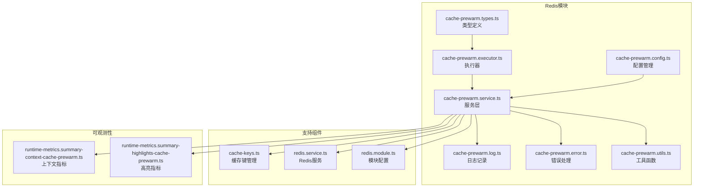
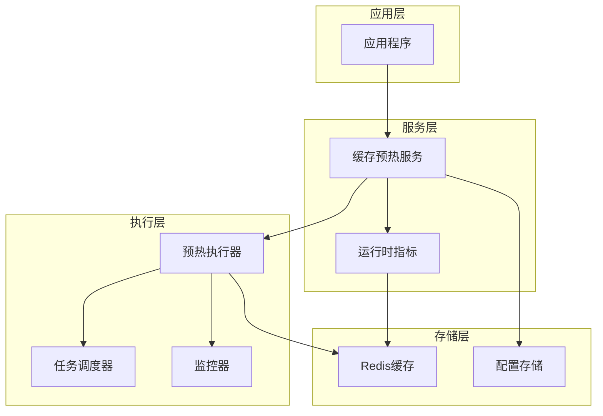
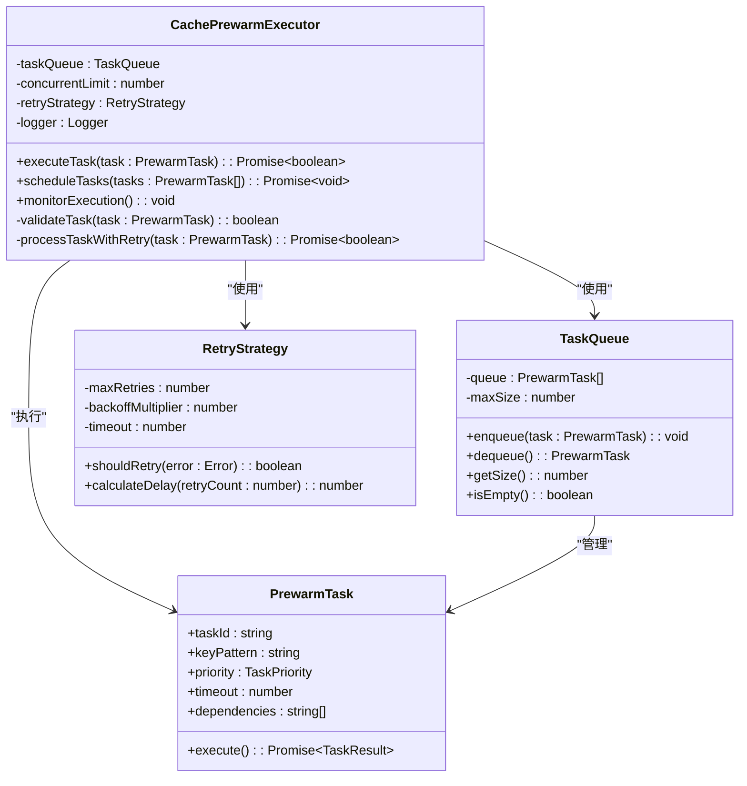
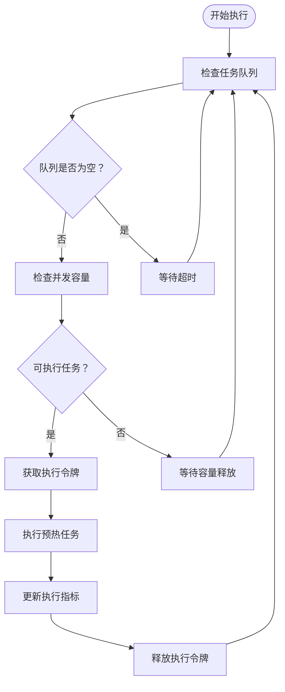
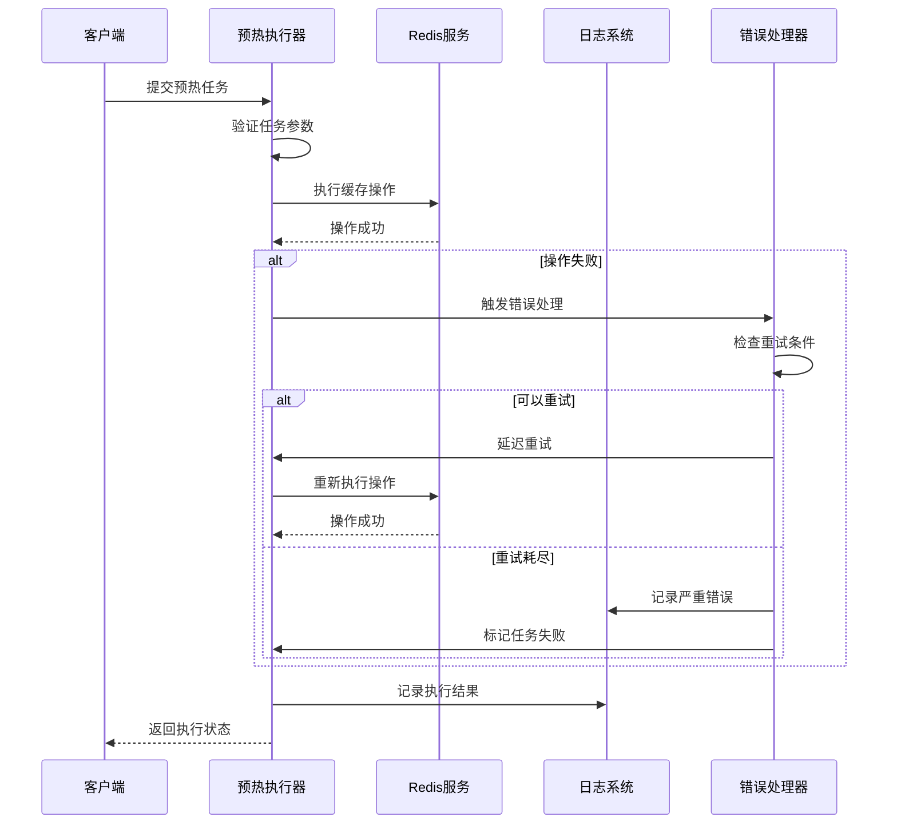
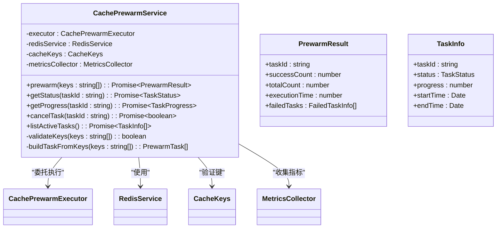
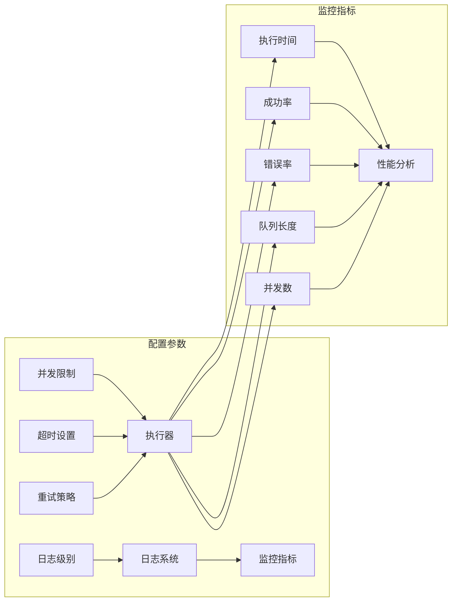
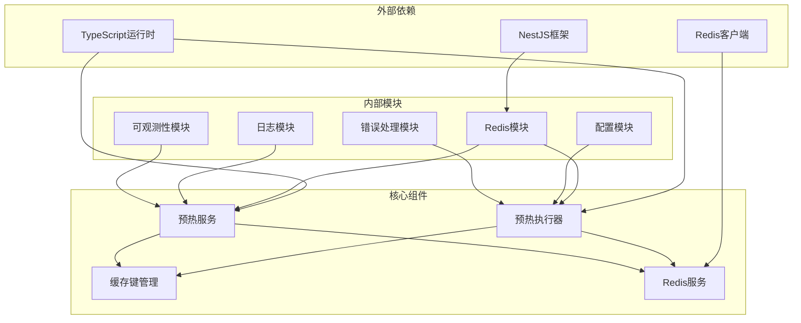

# 缓存预热机制

<cite>
**本文档引用的文件**
- [cache-prewarm.config.ts](file://src/redis/cache-prewarm.config.ts)
- [cache-prewarm.types.ts](file://src/redis/cache-prewarm.types.ts)
- [cache-prewarm.executor.ts](file://src/redis/cache-prewarm.executor.ts)
- [cache-prewarm.service.ts](file://src/redis/cache-prewarm.service.ts)
- [cache-prewarm.log.ts](file://src/redis/cache-prewarm.log.ts)
- [cache-prewarm.error.ts](file://src/redis/cache-prewarm.error.ts)
- [cache-prewarm.utils.ts](file://src/redis/cache-prewarm.utils.ts)
- [cache-keys.ts](file://src/redis/cache-keys.ts)
- [redis.service.ts](file://src/redis/redis.service.ts)
- [redis.module.ts](file://src/redis/redis.module.ts)
- [runtime-metrics.summary-context-actions-cache-prewarm.ts](file://src/observability/runtime-metrics.summary-context-actions-cache-prewarm.ts)
- [runtime-metrics.summary-context-cache-prewarm.ts](file://src/observability/runtime-metrics.summary-context-cache-prewarm.ts)
- [runtime-metrics.summary-highlights-cache-prewarm.ts](file://src/observability/runtime-metrics.summary-highlights-cache-prewarm.ts)
</cite>

## 目录
1. [简介](#简介)
2. [项目结构](#项目结构)
3. [核心组件](#核心组件)
4. [架构概览](#架构概览)
5. [详细组件分析](#详细组件分析)
6. [依赖关系分析](#依赖关系分析)
7. [性能考虑](#性能考虑)
8. [故障排除指南](#故障排除指南)
9. [结论](#结论)
10. [附录](#附录)

## 简介

缓存预热机制是本系统中一个关键的性能优化组件，旨在通过在应用启动前或低峰时段主动加载常用数据到Redis缓存中，减少首次访问延迟并提升整体响应性能。该机制通过智能的任务调度、并发控制和错误处理，确保缓存预热过程的可靠性和高效性。

本机制的核心目标是在业务高峰期到来之前，预先将热点数据加载到内存缓存中，从而避免缓存未命中导致的性能抖动。通过合理的预热策略和监控体系，系统能够实现更稳定的服务质量和更好的用户体验。

## 项目结构

缓存预热功能主要分布在以下目录和文件中：



**图表来源**
- [cache-prewarm.config.ts:1-200](file://src/redis/cache-prewarm.config.ts#L1-L200)
- [cache-prewarm.service.ts:1-300](file://src/redis/cache-prewarm.service.ts#L1-L300)
- [redis.service.ts:1-200](file://src/redis/redis.service.ts#L1-L200)

**章节来源**
- [cache-prewarm.config.ts:1-200](file://src/redis/cache-prewarm.config.ts#L1-L200)
- [cache-prewarm.service.ts:1-300](file://src/redis/cache-prewarm.service.ts#L1-L300)
- [redis.service.ts:1-200](file://src/redis/redis.service.ts#L1-L200)

## 核心组件

缓存预热系统由多个相互协作的组件构成，每个组件都有明确的职责分工：

### 配置管理组件
负责管理预热任务的各种配置参数，包括任务优先级、执行间隔、超时设置等。该组件提供了灵活的配置接口，允许根据不同的业务场景调整预热策略。

### 执行器组件
作为预热任务的核心执行单元，负责协调各个预热步骤的执行顺序和并发控制。执行器实现了智能的任务调度算法，确保预热过程的高效性和可靠性。

### 服务层组件
提供高层的预热接口，封装了复杂的预热逻辑。服务层组件负责任务的生命周期管理，包括任务创建、状态跟踪和结果汇总。

### 日志记录组件
实现了完整的预热过程日志记录机制，包括成功、失败和警告等各种状态的日志输出。日志系统支持结构化数据格式，便于后续的分析和监控。

### 错误处理组件
建立了完善的错误处理和恢复机制，包括重试策略、降级处理和异常通知等功能。该组件确保了预热过程在遇到异常情况时能够优雅地处理并继续执行。

**章节来源**
- [cache-prewarm.types.ts:1-150](file://src/redis/cache-prewarm.types.ts#L1-L150)
- [cache-prewarm.executor.ts:1-250](file://src/redis/cache-prewarm.executor.ts#L1-L250)
- [cache-prewarm.log.ts:1-200](file://src/redis/cache-prewarm.log.ts#L1-L200)

## 架构概览

缓存预热系统的整体架构采用分层设计，各层之间职责清晰，耦合度低：



**图表来源**
- [cache-prewarm.service.ts:1-300](file://src/redis/cache-prewarm.service.ts#L1-L300)
- [cache-prewarm.executor.ts:1-250](file://src/redis/cache-prewarm.executor.ts#L1-L250)
- [redis.service.ts:1-200](file://src/redis/redis.service.ts#L1-L200)

系统采用事件驱动的异步处理模式，通过回调机制实现任务状态的通知和更新。这种设计使得预热过程不会阻塞主线程，保证了系统的响应性。

## 详细组件分析

### 预热执行器分析

预热执行器是整个系统的核心组件，负责协调和控制预热任务的执行过程：



**图表来源**
- [cache-prewarm.executor.ts:1-250](file://src/redis/cache-prewarm.executor.ts#L1-L250)
- [cache-prewarm.types.ts:1-150](file://src/redis/cache-prewarm.types.ts#L1-L150)

#### 并发控制机制

执行器实现了基于令牌桶的并发控制算法，通过限制同时执行的预热任务数量来避免对Redis服务器造成过大的压力：



**图表来源**
- [cache-prewarm.executor.ts:1-250](file://src/redis/cache-prewarm.executor.ts#L1-L250)

#### 错误处理和重试策略

系统实现了多层次的错误处理机制，包括任务级别的重试、全局的降级处理和异常通知：



**图表来源**
- [cache-prewarm.error.ts:1-150](file://src/redis/cache-prewarm.error.ts#L1-L150)
- [cache-prewarm.log.ts:1-200](file://src/redis/cache-prewarm.log.ts#L1-L200)

**章节来源**
- [cache-prewarm.executor.ts:1-250](file://src/redis/cache-prewarm.executor.ts#L1-L250)
- [cache-prewarm.error.ts:1-150](file://src/redis/cache-prewarm.error.ts#L1-L150)
- [cache-prewarm.log.ts:1-200](file://src/redis/cache-prewarm.log.ts#L1-L200)

### 预热服务分析

预热服务作为对外的主要接口，提供了简洁易用的API来管理和监控预热任务：



**图表来源**
- [cache-prewarm.service.ts:1-300](file://src/redis/cache-prewarm.service.ts#L1-L300)
- [cache-prewarm.types.ts:1-150](file://src/redis/cache-prewarm.types.ts#L1-L150)

#### 任务生命周期管理

预热服务实现了完整的任务生命周期管理，从任务创建到最终完成的每个阶段都有相应的处理逻辑：

```mermaid
stateDiagram-v2
[*] --> Created : 创建任务
Created --> Scheduled : 调度执行
Scheduled --> Executing : 开始执行
Executing --> Success : 执行成功
Executing --> Failed : 执行失败
Executing --> Cancelled : 任务取消
Success --> [*]
Failed --> Retrying : 重试中
Retrying --> Success : 重试成功
Retrying --> Failed : 重试失败
Cancelled --> [*]
state Retrying {
[*] --> Waiting
Waiting --> Checking
Checking --> Retrying : 继续重试
Checking --> Success : 重试成功
}
```

**图表来源**
- [cache-prewarm.service.ts:1-300](file://src/redis/cache-prewarm.service.ts#L1-L300)
- [cache-prewarm.types.ts:1-150](file://src/redis/cache-prewarm.types.ts#L1-L150)

**章节来源**
- [cache-prewarm.service.ts:1-300](file://src/redis/cache-prewarm.service.ts#L1-L300)
- [cache-prewarm.types.ts:1-150](file://src/redis/cache-prewarm.types.ts#L1-L150)

### 配置和监控分析

系统提供了丰富的配置选项和监控指标，用于优化预热性能和诊断问题：



**图表来源**
- [cache-prewarm.config.ts:1-200](file://src/redis/cache-prewarm.config.ts#L1-L200)
- [runtime-metrics.summary-context-cache-prewarm.ts:1-100](file://src/observability/runtime-metrics.summary-context-cache-prewarm.ts#L1-L100)

**章节来源**
- [cache-prewarm.config.ts:1-200](file://src/redis/cache-prewarm.config.ts#L1-L200)
- [runtime-metrics.summary-context-cache-prewarm.ts:1-100](file://src/observability/runtime-metrics.summary-context-cache-prewarm.ts#L1-L100)

## 依赖关系分析

缓存预热系统的依赖关系呈现清晰的层次结构，各组件之间的耦合度得到有效控制：



**图表来源**
- [redis.module.ts:1-100](file://src/redis/redis.module.ts#L1-L100)
- [cache-prewarm.service.ts:1-300](file://src/redis/cache-prewarm.service.ts#L1-L300)

系统采用了依赖注入的设计模式，通过NestJS的模块系统实现组件间的松耦合。这种设计使得各个组件可以独立测试和维护，提高了代码的可维护性。

**章节来源**
- [redis.module.ts:1-100](file://src/redis/redis.module.ts#L1-L100)
- [cache-prewarm.service.ts:1-300](file://src/redis/cache-prewarm.service.ts#L1-L300)

## 性能考虑

缓存预热机制在设计时充分考虑了性能优化，通过多种策略确保预热过程的高效性：

### 内存管理优化
- 使用流式处理减少内存占用
- 实现任务分片机制避免单点内存峰值
- 采用懒加载策略延迟非必要数据的加载

### 网络优化
- 批量操作减少网络往返次数
- 连接池管理提高连接复用效率
- 异步I/O操作避免阻塞

### CPU优化
- 多线程并发执行提升吞吐量
- 智能调度算法避免CPU资源争用
- 任务优先级排序确保关键任务优先执行

## 故障排除指南

### 常见问题及解决方案

#### 预热任务执行失败
当预热任务执行失败时，系统会自动触发重试机制。如果重试多次仍然失败，需要检查以下方面：
- Redis连接状态和可用性
- 缓存键的有效性和格式
- 网络连接稳定性
- 系统资源使用情况

#### 性能问题诊断
如果发现预热过程影响系统性能，可以通过以下方式进行诊断：
- 检查并发执行任务数量
- 监控Redis服务器负载
- 分析任务执行时间分布
- 评估缓存命中率变化

#### 内存泄漏排查
定期检查内存使用情况，确保没有内存泄漏：
- 监控堆内存使用趋势
- 检查任务对象的生命周期
- 验证事件监听器的正确移除

**章节来源**
- [cache-prewarm.error.ts:1-150](file://src/redis/cache-prewarm.error.ts#L1-L150)
- [cache-prewarm.log.ts:1-200](file://src/redis/cache-prewarm.log.ts#L1-L200)

## 结论

缓存预热机制通过精心设计的架构和实现策略，为系统提供了可靠的性能优化解决方案。该机制不仅提升了缓存命中率和响应速度，还建立了完善的监控和故障处理体系。

系统的关键优势包括：
- **高可靠性**：多重错误处理和重试机制确保预热过程的稳定性
- **高性能**：智能并发控制和优化的执行策略最大化预热效率
- **可观测性**：全面的日志记录和指标收集便于问题诊断和性能优化
- **可扩展性**：模块化的架构设计支持功能的持续扩展和改进

未来可以在以下方面进一步优化：
- 实现更智能的任务调度算法
- 增强预测性预热能力
- 优化监控指标的实时性
- 支持更多类型的缓存数据预热

## 附录

### 配置示例

以下是一些常见的配置示例，展示了如何根据不同场景调整预热参数：

#### 基础配置
```typescript
// 基础预热配置
const basicConfig = {
  concurrentLimit: 5,
  timeout: 30000,
  maxRetries: 3,
  retryDelay: 1000
};
```

#### 高并发配置
```typescript
// 高并发场景配置
const highConcurrencyConfig = {
  concurrentLimit: 20,
  timeout: 60000,
  maxRetries: 5,
  retryDelay: 2000
};
```

#### 低延迟配置
```typescript
// 低延迟要求配置
const lowLatencyConfig = {
  concurrentLimit: 2,
  timeout: 10000,
  maxRetries: 2,
  retryDelay: 500
};
```

### 监控指标说明

系统提供了丰富的监控指标来帮助管理员了解预热过程的状态：

#### 关键指标
- **执行时间**：单个任务的平均执行时间
- **成功率**：预热任务的成功执行比例
- **错误率**：预热任务的失败比例
- **队列长度**：待执行任务的数量
- **并发数**：当前正在执行的任务数量

#### 性能基线
- **正常范围**：单任务执行时间 < 5秒
- **警告阈值**：单任务执行时间 > 10秒
- **错误阈值**：单任务执行时间 > 30秒
- **队列积压**：队列长度 > 100个任务

### 最佳实践建议

#### 预热策略选择
- **启动预热**：应用启动后立即执行关键数据的预热
- **定时预热**：在业务低峰期执行全量数据预热
- **按需预热**：根据用户行为和业务需求动态触发预热

#### 资源管理
- 合理设置并发限制避免过度消耗系统资源
- 监控Redis服务器负载防止过载
- 定期清理无效的缓存数据
- 优化缓存键的设计提高命中率

#### 监控告警
- 设置执行时间的实时监控
- 建立成功率和错误率的告警机制
- 监控队列长度的变化趋势
- 定期审查预热效果和成本