# JWT 认证机制

<cite>
**本文档引用的文件**
- [jwt-auth.guard.ts](file://src/purely-profit/auth/guards/jwt-auth.guard.ts)
- [jwt.strategy.ts](file://src/purely-profit/auth/strategies/jwt.strategy.ts)
- [auth.controller.ts](file://src/purely-profit/auth/auth.controller.ts)
- [auth.service.ts](file://src/purely-profit/auth/auth.service.ts)
- [auth-authentication.service.ts](file://src/purely-profit/auth/auth-authentication.service.ts)
- [auth-password.service.ts](file://src/purely-profit/auth/auth-password.service.ts)
- [auth-code.service.ts](file://src/purely-profit/auth/auth-code.service.ts)
- [auth-session.service.ts](file://src/purely-profit/auth/auth-session.service.ts)
- [auth-account.service.ts](file://src/purely-profit/auth/auth-account.service.ts)
- [auth-account-lookup.service.ts](file://src/purely-profit/auth/auth-account-lookup.service.ts)
- [auth-capability.service.ts](file://src/purely-profit/auth/auth-capability.service.ts)
- [auth-profile.service.ts](file://src/purely-profit/auth/auth-profile.service.ts)
- [captcha-token.service.ts](file://src/purely-profit/auth/captcha-token.service.ts)
- [auth.constants.ts](file://src/purely-profit/auth/auth.constants.ts)
- [login.dto.ts](file://src/purely-profit/auth/dto/login.dto.ts)
- [register.dto.ts](file://src/purely-profit/auth/dto/register.dto.ts)
- [forgot-password.dto.ts](file://src/purely-profit/auth/dto/forgot-password.dto.ts)
- [reset-password.dto.ts](file://src/purely-profit/auth/dto/reset-password.dto.ts)
- [change-password.dto.ts](file://src/purely-profit/auth/dto/change-password.dto.ts)
- [refresh-token.dto.ts](file://src/purely-profit/auth/dto/refresh-token.dto.ts)
- [send-register-code.dto.ts](file://src/purely-profit/auth/dto/send-register-code.dto.ts)
- [register-captcha-token.dto.ts](file://src/purely-club/auth/dto/register-captcha-token.dto.ts)
- [auth-token-response.dto.ts](file://src/purely-profit/auth/dto/auth-token-response.dto.ts)
- [configuration.ts](file://src/config/configuration.ts)
- [app.module.ts](file://src/app.module.ts)
- [auth.module.ts](file://src/purely-profit/auth/auth.module.ts)
</cite>

## 更新摘要
**变更内容**
- 新增完整的JWT Refresh Token机制，包括SHA-256哈希存储、自动轮换和用户索引批量失效功能
- 新增/refresh端点用于刷新访问令牌
- 新增/captcha/register端点支持拼图验证令牌注册
- 增强短信验证码发送的安全防护机制
- 更新Token配置选项和过期时间设置

## 目录
1. [简介](#简介)
2. [项目结构](#项目结构)
3. [核心组件](#核心组件)
4. [架构概览](#架构概览)
5. [详细组件分析](#详细组件分析)
6. [依赖关系分析](#依赖关系分析)
7. [性能考虑](#性能考虑)
8. [故障排除指南](#故障排除指南)
9. [结论](#结论)

## 简介
本文件详细阐述了基于 NestJS 框架的 JWT 认证机制实现。内容涵盖 JWT Token 的生成、验证与刷新流程，JWT 策略的实现原理，认证守卫的工作机制，以及完整的登录、注册、密码重置等业务流程。文档还提供了 DTO 参数验证、Token 配置选项、过期时间设置的说明，并解释了与 Passport 框架的集成方式、错误处理策略和安全考虑。

**更新** 新增了完整的Refresh Token机制，支持一次性使用、自动轮换和用户会话管理功能。

## 项目结构
认证相关代码主要位于 `src/purely-profit/auth/` 目录下，采用按功能模块划分的方式组织：
- 控制器：处理 HTTP 请求与响应
- 服务层：封装业务逻辑（账户管理、密码处理、验证码、会话等）
- 策略与守卫：实现 JWT 认证策略与路由保护
- DTO：参数校验与数据传输对象
- 常量与配置：认证相关常量与全局配置

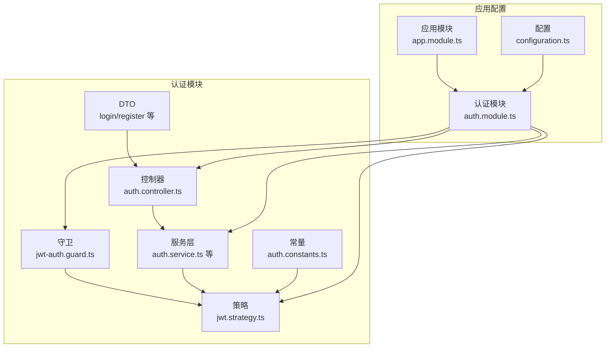

**图表来源**
- [auth.controller.ts](file://src/purely-profit/auth/auth.controller.ts)
- [jwt-auth.guard.ts](file://src/purely-profit/auth/guards/jwt-auth.guard.ts)
- [jwt.strategy.ts](file://src/purely-profit/auth/strategies/jwt.strategy.ts)
- [auth.service.ts](file://src/purely-profit/auth/auth.service.ts)
- [auth.module.ts](file://src/purely-profit/auth/auth.module.ts)
- [configuration.ts](file://src/config/configuration.ts)
- [app.module.ts](file://src/app.module.ts)

**章节来源**
- [auth.module.ts](file://src/purely-profit/auth/auth.module.ts)
- [app.module.ts](file://src/app.module.ts)
- [configuration.ts](file://src/config/configuration.ts)

## 核心组件
本节概述认证系统的关键组件及其职责：
- JWT 守卫：在路由上启用认证保护，拦截未授权请求
- JWT 策略：实现从请求中提取与验证 JWT 的逻辑
- 认证服务：协调登录、注册、密码重置等核心流程
- 会话服务：维护用户会话状态与 Token 刷新
- 密码服务：处理密码加密、验证与变更
- 验证码服务：发送与校验短信/邮件验证码
- 拼图验证服务：管理前端人机验证令牌
- 账户服务：账户信息查询、权限能力计算等
- DTO：统一输入参数校验与数据格式化
- 常量：定义 Token 过期时间、密钥等配置项

**更新** 新增了拼图验证服务和增强的会话管理服务，支持完整的Refresh Token生命周期管理。

**章节来源**
- [jwt-auth.guard.ts](file://src/purely-profit/auth/guards/jwt-auth.guard.ts)
- [jwt.strategy.ts](file://src/purely-profit/auth/strategies/jwt.strategy.ts)
- [auth.service.ts](file://src/purely-profit/auth/auth.service.ts)
- [auth-session.service.ts](file://src/purely-profit/auth/auth-session.service.ts)
- [captcha-token.service.ts](file://src/purely-profit/auth/captcha-token.service.ts)
- [auth-password.service.ts](file://src/purely-profit/auth/auth-password.service.ts)
- [auth-code.service.ts](file://src/purely-profit/auth/auth-code.service.ts)
- [auth-account.service.ts](file://src/purely-profit/auth/auth-account.service.ts)
- [auth.constants.ts](file://src/purely-profit/auth/auth.constants.ts)

## 架构概览
JWT 认证的整体架构遵循 NestJS 的模块化设计，通过 Passport 策略与守卫实现端到端的认证流程。下图展示了从客户端发起请求到服务端完成认证与授权的交互过程：

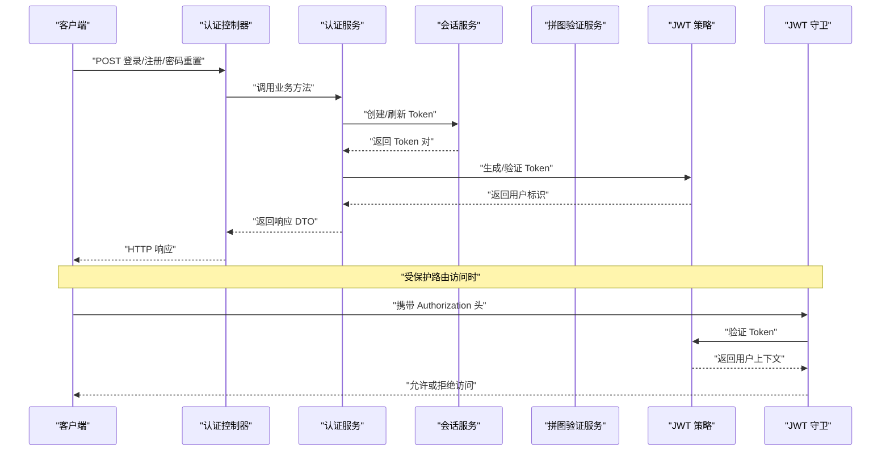

**图表来源**
- [auth.controller.ts](file://src/purely-profit/auth/auth.controller.ts)
- [auth.service.ts](file://src/purely-profit/auth/auth.service.ts)
- [auth-session.service.ts](file://src/purely-profit/auth/auth-session.service.ts)
- [captcha-token.service.ts](file://src/purely-profit/auth/captcha-token.service.ts)
- [jwt.strategy.ts](file://src/purely-profit/auth/strategies/jwt.strategy.ts)
- [jwt-auth.guard.ts](file://src/purely-profit/auth/guards/jwt-auth.guard.ts)

## 详细组件分析

### JWT 策略实现
JWT 策略负责从请求头中提取 Token 并进行验证，返回用户身份信息供守卫与控制器使用。其关键点包括：
- 令牌提取：从 Authorization 头解析 Bearer Token
- 令牌验证：使用密钥验证签名，检查过期时间与声明字段
- 用户上下文：将用户标识注入到请求上下文中供后续处理

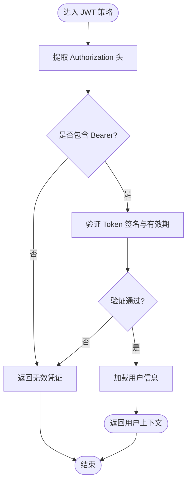

**图表来源**
- [jwt.strategy.ts](file://src/purely-profit/auth/strategies/jwt.strategy.ts)

**章节来源**
- [jwt.strategy.ts](file://src/purely-profit/auth/strategies/jwt.strategy.ts)

### JWT 守卫工作机制
JWT 守卫在路由层拦截请求，确保只有通过认证的请求才能继续执行业务逻辑。其工作流程如下：
- 检查请求是否已通过策略验证
- 若未通过，抛出未授权异常
- 若通过，将用户上下文注入到请求对象
- 结合权限服务进行细粒度授权控制

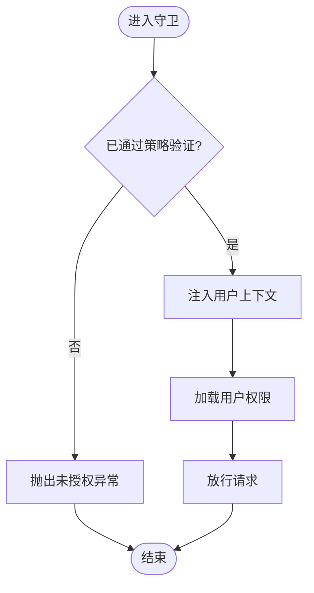

**图表来源**
- [jwt-auth.guard.ts](file://src/purely-profit/auth/guards/jwt-auth.guard.ts)
- [auth-account.service.ts](file://src/purely-profit/auth/auth-account.service.ts)

**章节来源**
- [jwt-auth.guard.ts](file://src/purely-profit/auth/guards/jwt-auth.guard.ts)
- [auth-account.service.ts](file://src/purely-profit/auth/auth-account.service.ts)

### 完整登录认证流程
登录流程涉及用户名/邮箱与密码验证、Token 生成与会话创建。具体步骤：
- 接收登录请求，使用 DTO 校验参数
- 调用认证服务进行凭据验证
- 生成访问 Token 与刷新 Token
- 创建会话记录，设置过期时间
- 返回 Token 响应 DTO

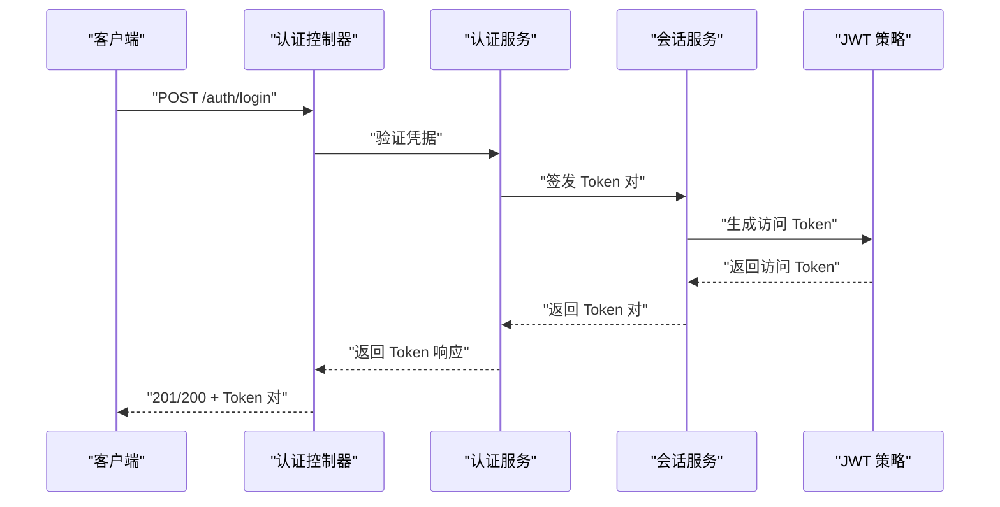

**图表来源**
- [auth.controller.ts](file://src/purely-profit/auth/auth.controller.ts)
- [auth.service.ts](file://src/purely-profit/auth/auth.service.ts)
- [auth-session.service.ts](file://src/purely-profit/auth/auth-session.service.ts)
- [jwt.strategy.ts](file://src/purely-profit/auth/strategies/jwt.strategy.ts)

**章节来源**
- [auth.controller.ts](file://src/purely-profit/auth/auth.controller.ts)
- [auth.service.ts](file://src/purely-profit/auth/auth.service.ts)
- [auth-session.service.ts](file://src/purely-profit/auth/auth-session.service.ts)

### 注册流程
注册流程包含手机号/邮箱验证、验证码校验、密码加密与账户创建。关键步骤：
- 接收注册请求，使用 DTO 校验参数
- 可选：验证拼图验证令牌
- 发送验证码并校验
- 使用密码服务加密密码
- 创建账户并初始化会话
- 返回注册成功响应

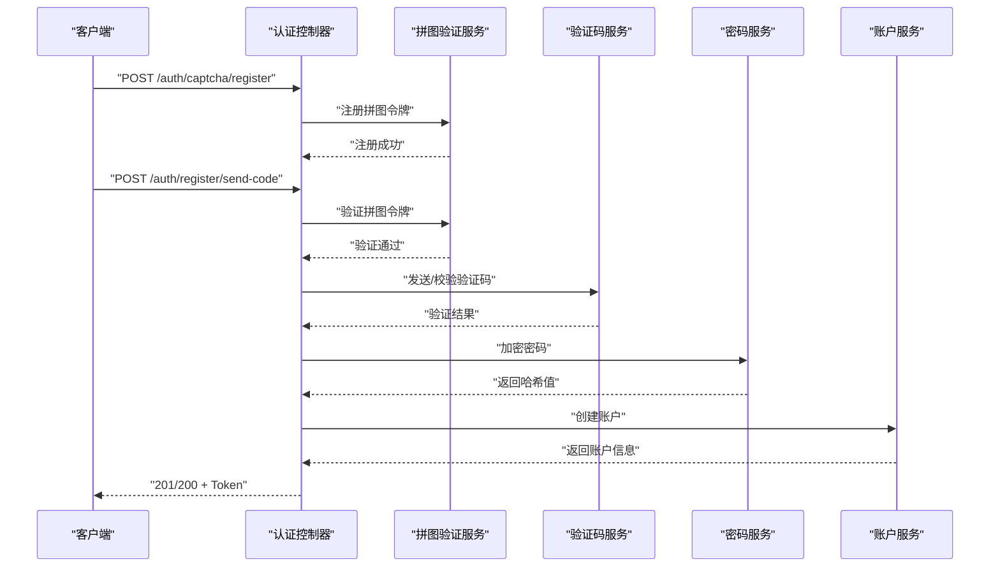

**图表来源**
- [auth.controller.ts](file://src/purely-profit/auth/auth.controller.ts)
- [captcha-token.service.ts](file://src/purely-profit/auth/captcha-token.service.ts)
- [auth-code.service.ts](file://src/purely-profit/auth/auth-code.service.ts)
- [auth-password.service.ts](file://src/purely-profit/auth/auth-password.service.ts)
- [auth-account.service.ts](file://src/purely-profit/auth/auth-account.service.ts)

**章节来源**
- [auth.controller.ts](file://src/purely-profit/auth/auth.controller.ts)
- [captcha-token.service.ts](file://src/purely-profit/auth/captcha-token.service.ts)
- [auth-code.service.ts](file://src/purely-profit/auth/auth-code.service.ts)
- [auth-password.service.ts](file://src/purely-profit/auth/auth-password.service.ts)
- [auth-account.service.ts](file://src/purely-profit/auth/auth-account.service.ts)

### 密码重置流程
密码重置流程分为两步：发送重置验证码与重置密码。流程要点：
- 接收邮箱/手机号，发送重置验证码
- 校验验证码后，使用新密码更新账户
- 可选：刷新 Token 或强制重新登录

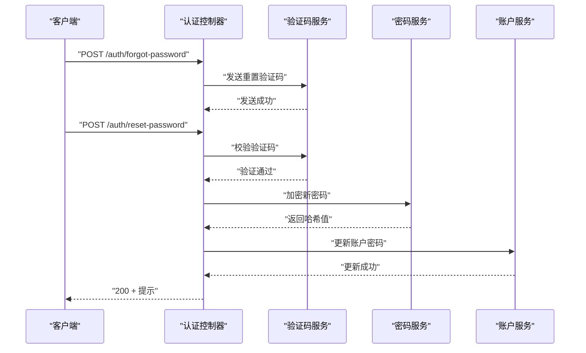

**图表来源**
- [auth.controller.ts](file://src/purely-profit/auth/auth.controller.ts)
- [auth-code.service.ts](file://src/purely-profit/auth/auth-code.service.ts)
- [auth-password.service.ts](file://src/purely-profit/auth/auth-password.service.ts)
- [auth-account.service.ts](file://src/purely-profit/auth/auth-account.service.ts)

**章节来源**
- [auth.controller.ts](file://src/purely-profit/auth/auth.controller.ts)
- [auth-code.service.ts](file://src/purely-profit/auth/auth-code.service.ts)
- [auth-password.service.ts](file://src/purely-profit/auth/auth-password.service.ts)
- [auth-account.service.ts](file://src/purely-profit/auth/auth-account.service.ts)

### Refresh Token 机制
**新增** 完整的 Refresh Token 机制实现了安全的一次性使用、自动轮换和用户会话管理功能：

#### Refresh Token 特性
- **SHA-256 哈希存储**：Refresh Token 在 Redis 中以 SHA-256 哈希形式存储，避免明文泄露
- **一次性使用**：每次刷新后立即使旧 Token 失效，防止重放攻击
- **自动轮换**：刷新成功后自动生成新的 Token 对
- **用户索引管理**：维护 userId 到 Token 哈希的索引，支持批量失效
- **可配置过期时间**：默认 30 天，可通过环境变量配置

#### Refresh Token 工作流程
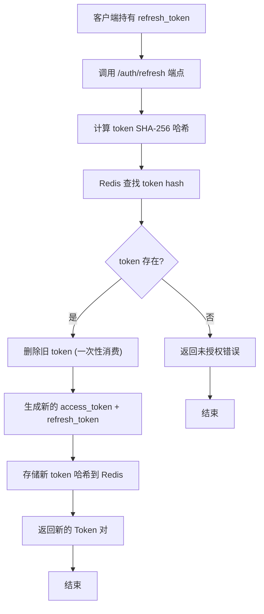

**图表来源**
- [auth-session.service.ts](file://src/purely-profit/auth/auth-session.service.ts)
- [auth.controller.ts](file://src/purely-profit/auth/auth.controller.ts)

#### Refresh Token API 端点
- **POST /auth/refresh**：使用 refresh_token 获取新的 access_token + refresh_token
- **输入参数**：包含 refresh_token 字段的 JSON 对象
- **响应格式**：标准的 AuthTokenResponseDto，包含新的 Token 对

#### 用户会话管理
- **批量失效**：支持通过 userId 批量使所有 refresh token 失效
- **版本控制**：维护 token version 用于检测会话变更
- **内存优化**：通过索引键避免全量 SCAN 操作

**章节来源**
- [auth-session.service.ts](file://src/purely-profit/auth/auth-session.service.ts)
- [auth.controller.ts](file://src/purely-profit/auth/auth.controller.ts)
- [refresh-token.dto.ts](file://src/purely-profit/auth/dto/refresh-token.dto.ts)

### 拼图验证令牌机制
**新增** 拼图验证令牌机制为短信验证码发送提供了额外的安全防护：

#### 拼图验证流程
1. **前端完成拼图验证**：用户在前端界面完成人机验证
2. **注册验证令牌**：前端调用 `/auth/captcha/register` 将令牌注册到服务端
3. **发送验证码**：发送短信验证码时必须携带有效的拼图令牌
4. **一次性消费**：令牌使用后立即失效，防止重复使用

#### 安全措施
- **格式验证**：严格验证令牌格式 `puzzle_{timestamp}_{counter}`
- **有效期限制**：令牌有效期 5 分钟，超时自动失效
- **防重放攻击**：令牌一次性使用，使用后从 Redis 中删除
- **频率限制**：接口限流防止滥用

**章节来源**
- [captcha-token.service.ts](file://src/purely-profit/auth/captcha-token.service.ts)
- [auth.controller.ts](file://src/purely-profit/auth/auth.controller.ts)
- [register-captcha-token.dto.ts](file://src/purely-club/auth/dto/register-captcha-token.dto.ts)

### Token 配置与过期时间
Token 的配置与过期时间由常量与全局配置共同决定：
- 访问 Token 过期时间：用于短期访问，默认 7 天
- 刷新 Token 过期时间：用于长期保持登录状态，默认 30 天
- 密钥与算法：用于签名与验证
- 全局配置：从环境变量或配置文件读取

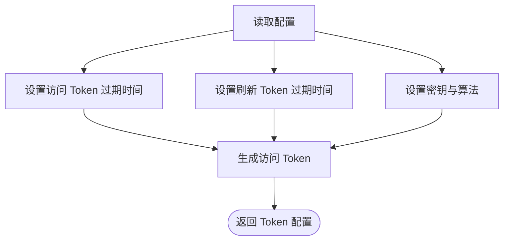

**图表来源**
- [auth.constants.ts](file://src/purely-profit/auth/auth.constants.ts)
- [configuration.ts](file://src/config/configuration.ts)

**章节来源**
- [auth.constants.ts](file://src/purely-profit/auth/auth.constants.ts)
- [configuration.ts](file://src/config/configuration.ts)

### DTO 参数验证与数据传输
认证模块广泛使用 DTO 进行参数验证与数据传输，确保输入数据的合法性与一致性：
- 登录 DTO：验证用户名/邮箱与密码格式
- 注册 DTO：验证手机号/邮箱、验证码与密码强度
- 忘记密码 DTO：验证邮箱/手机号
- 重置密码 DTO：验证验证码与新密码
- 修改密码 DTO：验证旧密码与新密码
- 刷新 Token DTO：验证刷新令牌格式
- 拼图令牌 DTO：验证拼图验证令牌格式
- Token 响应 DTO：标准化返回 Token 与用户信息

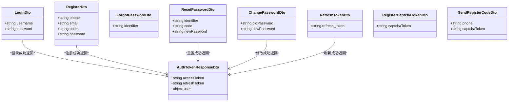

**图表来源**
- [login.dto.ts](file://src/purely-profit/auth/dto/login.dto.ts)
- [register.dto.ts](file://src/purely-profit/auth/dto/register.dto.ts)
- [forgot-password.dto.ts](file://src/purely-profit/auth/dto/forgot-password.dto.ts)
- [reset-password.dto.ts](file://src/purely-profit/auth/dto/reset-password.dto.ts)
- [change-password.dto.ts](file://src/purely-profit/auth/dto/change-password.dto.ts)
- [refresh-token.dto.ts](file://src/purely-profit/auth/dto/refresh-token.dto.ts)
- [register-captcha-token.dto.ts](file://src/purely-club/auth/dto/register-captcha-token.dto.ts)
- [send-register-code.dto.ts](file://src/purely-profit/auth/dto/send-register-code.dto.ts)
- [auth-token-response.dto.ts](file://src/purely-profit/auth/dto/auth-token-response.dto.ts)

**章节来源**
- [login.dto.ts](file://src/purely-profit/auth/dto/login.dto.ts)
- [register.dto.ts](file://src/purely-profit/auth/dto/register.dto.ts)
- [forgot-password.dto.ts](file://src/purely-profit/auth/dto/forgot-password.dto.ts)
- [reset-password.dto.ts](file://src/purely-profit/auth/dto/reset-password.dto.ts)
- [change-password.dto.ts](file://src/purely-profit/auth/dto/change-password.dto.ts)
- [refresh-token.dto.ts](file://src/purely-profit/auth/dto/refresh-token.dto.ts)
- [register-captcha-token.dto.ts](file://src/purely-club/auth/dto/register-captcha-token.dto.ts)
- [send-register-code.dto.ts](file://src/purely-profit/auth/dto/send-register-code.dto.ts)
- [auth-token-response.dto.ts](file://src/purely-profit/auth/dto/auth-token-response.dto.ts)

### 与 Passport 框架的集成
系统通过 NestJS 的 Passport 模块实现 JWT 认证：
- 策略注册：在认证模块中注册 JWT 策略
- 守卫绑定：在路由上使用 JWT 守卫进行保护
- 策略配置：通过策略类实现令牌提取与验证
- 模块装配：在应用模块中引入认证模块

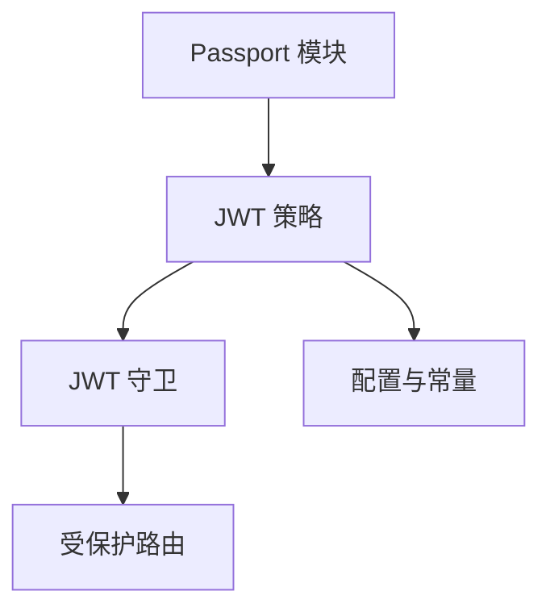

**图表来源**
- [jwt.strategy.ts](file://src/purely-profit/auth/strategies/jwt.strategy.ts)
- [jwt-auth.guard.ts](file://src/purely-profit/auth/guards/jwt-auth.guard.ts)
- [auth.module.ts](file://src/purely-profit/auth/auth.module.ts)
- [app.module.ts](file://src/app.module.ts)

**章节来源**
- [jwt.strategy.ts](file://src/purely-profit/auth/strategies/jwt.strategy.ts)
- [jwt-auth.guard.ts](file://src/purely-profit/auth/guards/jwt-auth.guard.ts)
- [auth.module.ts](file://src/purely-profit/auth/auth.module.ts)
- [app.module.ts](file://src/app.module.ts)

## 依赖关系分析
认证系统的依赖关系清晰，模块间耦合度低，职责明确：
- 控制器依赖服务层接口，不直接操作数据库
- 服务层依赖策略与守卫进行认证，依赖验证码与密码服务
- 策略与守卫依赖配置常量与账户服务
- 模块装配在应用层集中管理

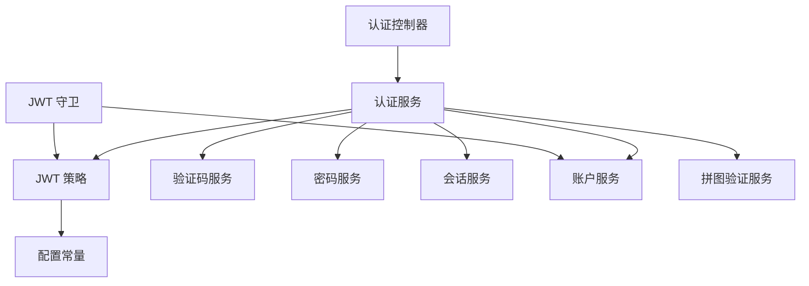

**图表来源**
- [auth.controller.ts](file://src/purely-profit/auth/auth.controller.ts)
- [auth.service.ts](file://src/purely-profit/auth/auth.service.ts)
- [auth-session.service.ts](file://src/purely-profit/auth/auth-session.service.ts)
- [captcha-token.service.ts](file://src/purely-profit/auth/captcha-token.service.ts)
- [jwt.strategy.ts](file://src/purely-profit/auth/strategies/jwt.strategy.ts)
- [jwt-auth.guard.ts](file://src/purely-profit/auth/guards/jwt-auth.guard.ts)
- [auth-code.service.ts](file://src/purely-profit/auth/auth-code.service.ts)
- [auth-password.service.ts](file://src/purely-profit/auth/auth-password.service.ts)
- [auth-account.service.ts](file://src/purely-profit/auth/auth-account.service.ts)
- [auth.constants.ts](file://src/purely-profit/auth/auth.constants.ts)

**章节来源**
- [auth.controller.ts](file://src/purely-profit/auth/auth.controller.ts)
- [auth.service.ts](file://src/purely-profit/auth/auth.service.ts)
- [auth-session.service.ts](file://src/purely-profit/auth/auth-session.service.ts)
- [captcha-token.service.ts](file://src/purely-profit/auth/captcha-token.service.ts)
- [jwt.strategy.ts](file://src/purely-profit/auth/strategies/jwt.strategy.ts)
- [jwt-auth.guard.ts](file://src/purely-profit/auth/guards/jwt-auth.guard.ts)
- [auth-code.service.ts](file://src/purely-profit/auth/auth-code.service.ts)
- [auth-password.service.ts](file://src/purely-profit/auth/auth-password.service.ts)
- [auth-account.service.ts](file://src/purely-profit/auth/auth-account.service.ts)
- [auth.constants.ts](file://src/purely-profit/auth/auth.constants.ts)

## 性能考虑
- Token 缓存：可考虑在 Redis 中缓存活跃 Token，减少重复验证开销
- 并发控制：验证码发送与校验需限制频率，防止滥用
- 数据库索引：对账户标识与 Token 字段建立索引，提升查询性能
- 异步处理：密码加密与验证码发送建议异步执行，避免阻塞请求
- 超时策略：合理设置 Token 过期时间，平衡安全性与用户体验
- **新增** Refresh Token 索引优化：通过用户索引键避免全量 SCAN，提升批量失效性能
- **新增** 拼图令牌 TTL 管理：5 分钟短有效期减少 Redis 内存占用

## 故障排除指南
常见问题与解决方案：
- 未授权访问：检查守卫是否正确绑定，Token 是否过期或格式错误
- 签名验证失败：确认密钥配置一致，算法设置正确
- 验证码失效：检查验证码有效期与发送频率限制
- 密码重置失败：确认验证码正确且新密码符合强度要求
- 会话异常：检查会话存储与刷新逻辑，确保 Token 刷新流程正常
- **新增** Refresh Token 刷新失败：检查 Redis 连接状态，确认 token hash 是否存在
- **新增** 拼图验证失败：验证前端生成的令牌格式，检查令牌是否已过期或被消费

**章节来源**
- [jwt-auth.guard.ts](file://src/purely-profit/auth/guards/jwt-auth.guard.ts)
- [jwt.strategy.ts](file://src/purely-profit/auth/strategies/jwt.strategy.ts)
- [auth-code.service.ts](file://src/purely-profit/auth/auth-code.service.ts)
- [auth-password.service.ts](file://src/purely-profit/auth/auth-password.service.ts)
- [auth-session.service.ts](file://src/purely-profit/auth/auth-session.service.ts)
- [captcha-token.service.ts](file://src/purely-profit/auth/captcha-token.service.ts)

## 结论
本认证机制通过策略与守卫实现了端到端的 JWT 认证，结合服务层的业务逻辑与 DTO 的参数验证，形成了安全、可扩展的认证体系。通过合理的 Token 配置与过期时间设置，以及完善的错误处理与安全考虑，系统能够在保证安全性的同时提供良好的用户体验。

**更新** 新增的完整 Refresh Token 机制提供了更安全的会话管理方案，支持一次性使用、自动轮换和用户会话批量管理。拼图验证令牌的引入进一步增强了短信验证码发送的安全性，有效防止了自动化攻击。建议在生产环境中进一步完善缓存策略、并发控制与监控告警，以提升整体性能与稳定性。