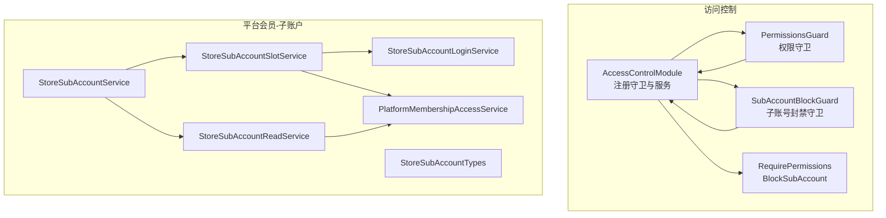
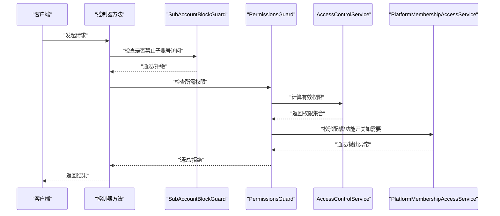
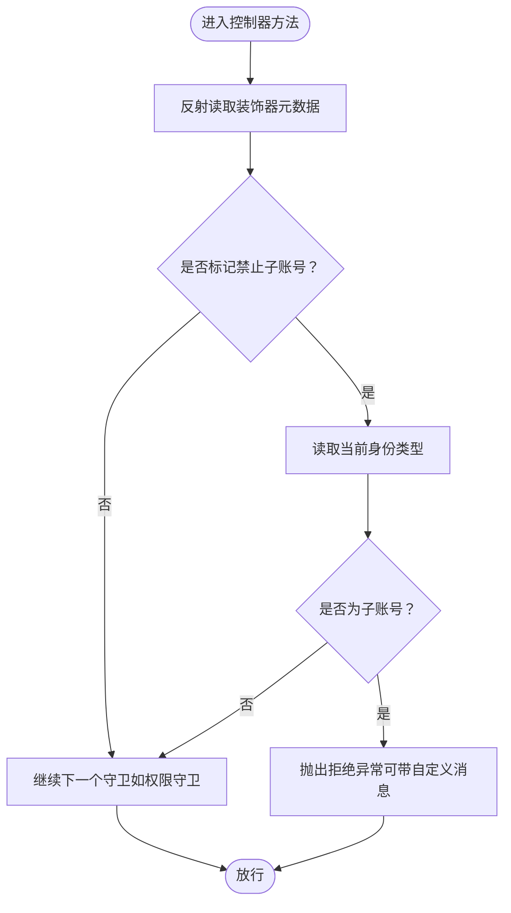
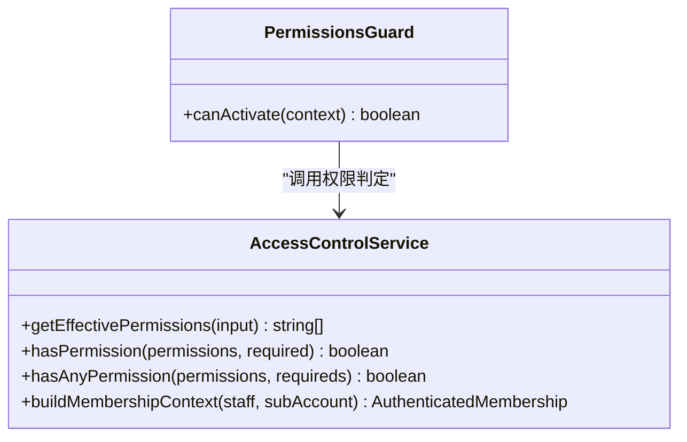
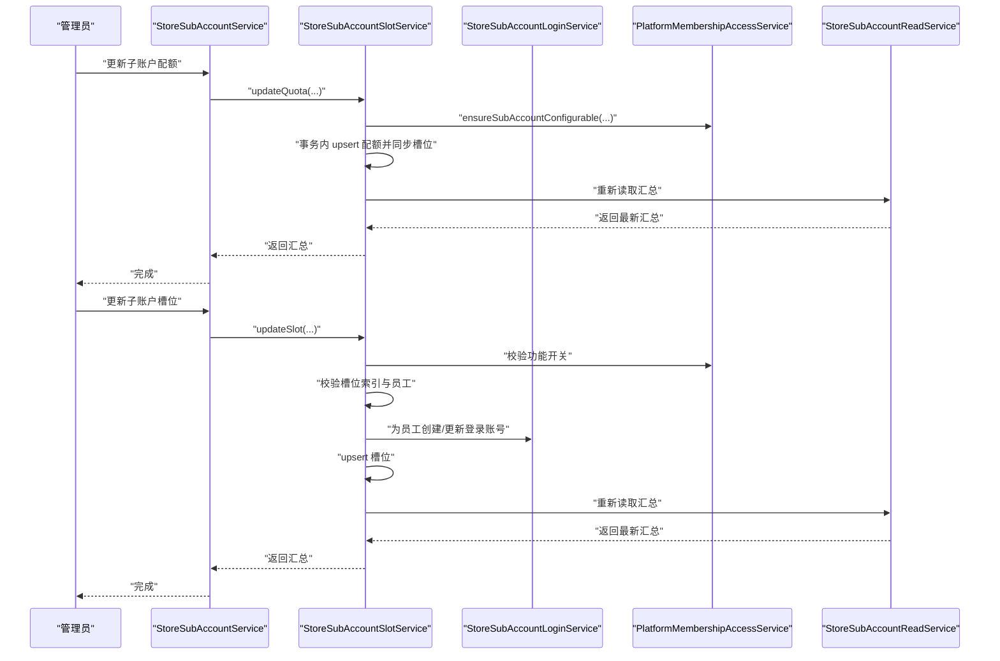
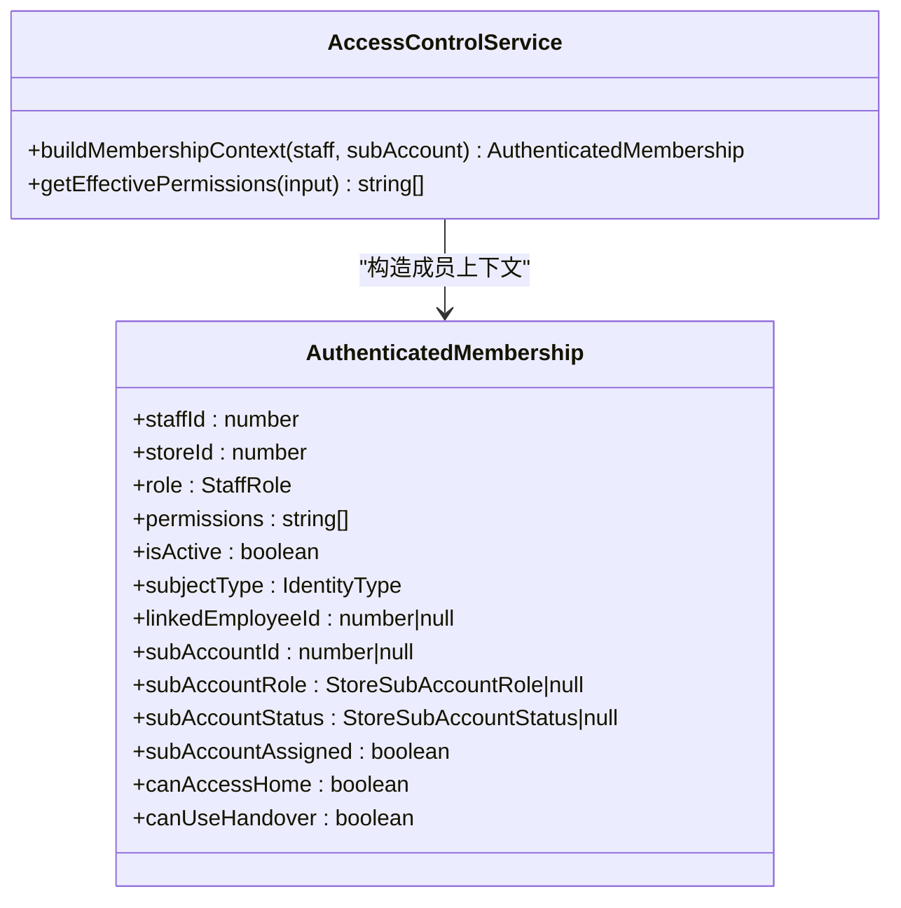
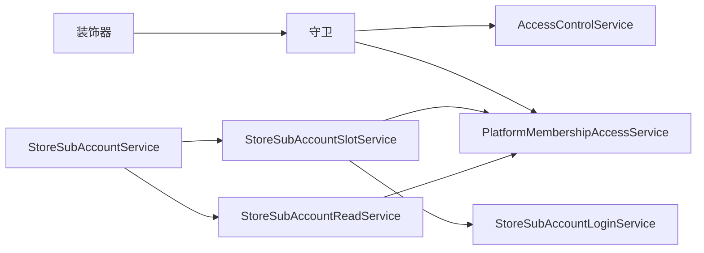

# 子账户管理

<cite>
**本文引用的文件**
- [src/purely-profit/access-control/access-control.module.ts](file://src/purely-profit/access-control/access-control.module.ts)
- [src/purely-profit/access-control/decorators/block-sub-account.decorator.ts](file://src/purely-profit/access-control/decorators/block-sub-account.decorator.ts)
- [src/purely-profit/access-control/decorators/require-permissions.decorator.ts](file://src/purely-profit/access-control/decorators/require-permissions.decorator.ts)
- [src/purely-profit/access-control/guards/permissions.guard.ts](file://src/purely-profit/access-control/guards/permissions.guard.ts)
- [src/purely-profit/access-control/guards/sub-account-block.guard.ts](file://src/purely-profit/access-control/guards/sub-account-block.guard.ts)
- [src/purely-profit/access-control/access-control.service.ts](file://src/purely-profit/access-control/access-control.service.ts)
- [src/purely-profit/access-control/access-control.constants.ts](file://src/purely-profit/access-control/access-control.constants.ts)
- [src/purely-profit/member/platform-membership/store-sub-account.service.ts](file://src/purely-profit/member/platform-membership/store-sub-account.service.ts)
- [src/purely-profit/member/platform-membership/store-sub-account.types.ts](file://src/purely-profit/member/platform-membership/store-sub-account.types.ts)
- [src/purely-profit/member/platform-membership/store-sub-account-login.service.ts](file://src/purely-profit/member/platform-membership/store-sub-account-login.service.ts)
- [src/purely-profit/member/platform-membership/store-sub-account-slot.service.ts](file://src/purely-profit/member/platform-membership/store-sub-account-slot.service.ts)
- [src/purely-profit/member/platform-membership/store-sub-account-read.service.ts](file://src/purely-profit/member/platform-membership/store-sub-account-read.service.ts)
- [src/purely-profit/member/platform-membership/platform-membership-access.service.ts](file://src/purely-profit/member/platform-membership/platform-membership-access.service.ts)
- [src/purely-profit/auth/auth-account.service.ts](file://src/purely-profit/auth/auth-account.service.ts)
- [src/purely-profit/auth/auth.utils.ts](file://src/purely-profit/auth/auth.utils.ts)
- [src/purely-profit/staff/employees/employees.service.ts](file://src/purely-profit/staff/employees/employees.service.ts)
</cite>

## 更新摘要
**变更内容**
- 更新了财务子账户权限继承规则，现在允许财务角色参与交接班流程
- 修改了默认权限配置，财务子账户现在具有完整的交接班管理能力
- 更新了员工服务中的子账户创建逻辑，确保财务角色的交接班权限正确设置

## 目录
1. [引言](#引言)
2. [项目结构](#项目结构)
3. [核心组件](#核心组件)
4. [架构总览](#架构总览)
5. [详细组件分析](#详细组件分析)
6. [依赖关系分析](#依赖关系分析)
7. [性能考量](#性能考量)
8. [故障排查指南](#故障排查指南)
9. [结论](#结论)
10. [附录](#附录)

## 引言
本技术文档聚焦于多门店管理模式下的子账户（Sub-Account）机制，系统性阐述子账户的创建、激活、权限分配流程；解释子账户装饰器与守卫的实现原理；说明账户锁定与访问控制策略；并给出在不同业务模块中集成子账户管理的最佳实践与常见问题解决方案。读者可据此在多门店系统中安全、可控地扩展子账户能力。

## 项目结构
子账户管理涉及"访问控制"和"会员平台子账户"两大领域模块：
- 访问控制模块：提供权限守卫、装饰器、权限服务与常量定义，统一校验接口访问权限与子账号访问限制。
- 平台会员子账户模块：负责子账户配额、槽位、登录账号、读写汇总等核心业务逻辑。

图表来源
- [src/purely-profit/access-control/access-control.module.ts:1-22](file://src/purely-profit/access-control/access-control.module.ts#L1-L22)
- [src/purely-profit/access-control/guards/permissions.guard.ts:1-54](file://src/purely-profit/access-control/guards/permissions.guard.ts#L1-L54)
- [src/purely-profit/access-control/guards/sub-account-block.guard.ts:1-47](file://src/purely-profit/access-control/guards/sub-account-block.guard.ts#L1-L47)
- [src/purely-profit/member/platform-membership/store-sub-account.service.ts:1-133](file://src/purely-profit/member/platform-membership/store-sub-account.service.ts#L1-L133)
- [src/purely-profit/member/platform-membership/store-sub-account-slot.service.ts:1-240](file://src/purely-profit/member/platform-membership/store-sub-account-slot.service.ts#L1-L240)
- [src/purely-profit/member/platform-membership/store-sub-account-login.service.ts:1-261](file://src/purely-profit/member/platform-membership/store-sub-account-login.service.ts#L1-L261)
- [src/purely-profit/member/platform-membership/store-sub-account-read.service.ts:1-138](file://src/purely-profit/member/platform-membership/store-sub-account-read.service.ts#L1-L138)
- [src/purely-profit/member/platform-membership/platform-membership-access.service.ts:189-240](file://src/purely-profit/member/platform-membership/platform-membership-access.service.ts#L189-L240)

章节来源
- [src/purely-profit/access-control/access-control.module.ts:1-22](file://src/purely-profit/access-control/access-control.module.ts#L1-L22)
- [src/purely-profit/member/platform-membership/store-sub-account.service.ts:1-133](file://src/purely-profit/member/platform-membership/store-sub-account.service.ts#L1-L133)

## 核心组件
- 权限守卫（PermissionsGuard）：基于接口元数据要求的权限集合进行校验，确保当前成员具备有效权限。
- 子账号封禁守卫（SubAccountBlockGuard）：对标注"禁止子账号访问"的接口进行拦截，防止子账号越权。
- 权限装饰器：RequirePermissions 用于声明式标注所需权限；BlockSubAccount 用于声明式标注禁止子账号访问。
- 访问控制服务（AccessControlService）：计算有效权限、解析当前门店 ID、构建成员上下文（含子账号角色与状态）。
- 子账户服务族：
  - StoreSubAccountService：对外聚合更新配额、更新槽位、查询汇总。
  - StoreSubAccountSlotService：事务内同步槽位到配额、更新单个槽位、校验员工与登录信息。
  - StoreSubAccountLoginService：为员工建立/更新登录账号（User+Staff），校验账号可用性与密码。
  - StoreSubAccountReadService：读取子账户配额、统计与槽位明细，处理缺失表结构的异常。
  - StoreSubAccountTypes：定义子账户汇总、槽位与输入类型。
  - PlatformMembershipAccessService：校验子账户配额与功能开关，生成权益快照。

章节来源
- [src/purely-profit/access-control/guards/permissions.guard.ts:1-54](file://src/purely-profit/access-control/guards/permissions.guard.ts#L1-L54)
- [src/purely-profit/access-control/guards/sub-account-block.guard.ts:1-47](file://src/purely-profit/access-control/guards/sub-account-block.guard.ts#L1-L47)
- [src/purely-profit/access-control/decorators/require-permissions.decorator.ts:1-7](file://src/purely-profit/access-control/decorators/require-permissions.decorator.ts#L1-L7)
- [src/purely-profit/access-control/decorators/block-sub-account.decorator.ts:1-16](file://src/purely-profit/access-control/decorators/block-sub-account.decorator.ts#L1-L16)
- [src/purely-profit/access-control/access-control.service.ts:1-243](file://src/purely-profit/access-control/access-control.service.ts#L1-L243)
- [src/purely-profit/member/platform-membership/store-sub-account.service.ts:1-133](file://src/purely-profit/member/platform-membership/store-sub-account.service.ts#L1-L133)
- [src/purely-profit/member/platform-membership/store-sub-account-slot.service.ts:1-240](file://src/purely-profit/member/platform-membership/store-sub-account-slot.service.ts#L1-L240)
- [src/purely-profit/member/platform-membership/store-sub-account-login.service.ts:1-261](file://src/purely-profit/member/platform-membership/store-sub-account-login.service.ts#L1-L261)
- [src/purely-profit/member/platform-membership/store-sub-account-read.service.ts:1-138](file://src/purely-profit/member/platform-membership/store-sub-account-read.service.ts#L1-L138)
- [src/purely-profit/member/platform-membership/store-sub-account.types.ts:1-41](file://src/purely-profit/member/platform-membership/store-sub-account.types.ts#L1-L41)
- [src/purely-profit/member/platform-membership/platform-membership-access.service.ts:189-240](file://src/purely-profit/member/platform-membership/platform-membership-access.service.ts#L189-L240)

## 架构总览
子账户管理采用"装饰器 + 守卫 + 服务"的分层设计：
- 控制器通过装饰器声明权限与子账号访问限制；
- 守卫在运行期读取元数据，结合访问控制服务与平台会员服务进行判定；
- 业务服务负责具体的数据一致性与事务处理。

图表来源
- [src/purely-profit/access-control/guards/sub-account-block.guard.ts:1-47](file://src/purely-profit/access-control/guards/sub-account-block.guard.ts#L1-L47)
- [src/purely-profit/access-control/guards/permissions.guard.ts:1-54](file://src/purely-profit/access-control/guards/permissions.guard.ts#L1-L54)
- [src/purely-profit/access-control/access-control.service.ts:124-133](file://src/purely-profit/access-control/access-control.service.ts#L124-L133)
- [src/purely-profit/member/platform-membership/platform-membership-access.service.ts:189-240](file://src/purely-profit/member/platform-membership/platform-membership-access.service.ts#L189-L240)

## 详细组件分析

### 组件一：子账户装饰器与守卫
- BlockSubAccount 装饰器：用于标记"仅主账号可访问"的接口，支持自定义拒绝消息。
- SubAccountBlockGuard：读取装饰器元数据，若当前身份为子账号则拒绝访问。
- RequirePermissions 装饰器：声明接口所需的权限集合，配合 PermissionsGuard 生效。

图表来源
- [src/purely-profit/access-control/decorators/block-sub-account.decorator.ts:1-16](file://src/purely-profit/access-control/decorators/block-sub-account.decorator.ts#L1-L16)
- [src/purely-profit/access-control/guards/sub-account-block.guard.ts:17-46](file://src/purely-profit/access-control/guards/sub-account-block.guard.ts#L17-L46)

章节来源
- [src/purely-profit/access-control/decorators/block-sub-account.decorator.ts:1-16](file://src/purely-profit/access-control/decorators/block-sub-account.decorator.ts#L1-L16)
- [src/purely-profit/access-control/guards/sub-account-block.guard.ts:1-47](file://src/purely-profit/access-control/guards/sub-account-block.guard.ts#L1-L47)

### 组件二：权限守卫与权限计算
- PermissionsGuard：从请求上下文中提取当前成员的权限与激活状态，校验是否满足所需权限集合。
- AccessControlService：根据身份类型（主账号/员工/子账号）计算有效权限；支持子账号按角色与状态过滤权限（如剔除交接相关权限）。

图表来源
- [src/purely-profit/access-control/guards/permissions.guard.ts:1-54](file://src/purely-profit/access-control/guards/permissions.guard.ts#L1-L54)
- [src/purely-profit/access-control/access-control.service.ts:124-243](file://src/purely-profit/access-control/access-control.service.ts#L124-L243)

章节来源
- [src/purely-profit/access-control/guards/permissions.guard.ts:1-54](file://src/purely-profit/access-control/guards/permissions.guard.ts#L1-L54)
- [src/purely-profit/access-control/access-control.service.ts:1-243](file://src/purely-profit/access-control/access-control.service.ts#L1-L243)

### 组件三：子账户创建与激活（登录账号、槽位、配额）
- StoreSubAccountSlotService.updateQuota：校验子账户可配置性，事务内更新配额并同步槽位，记录审计日志。
- StoreSubAccountSlotService.updateSlot：校验槽位索引与员工有效性，必要时为员工创建/更新登录账号，再写入子账户槽位。
- StoreSubAccountLoginService.ensureEmployeeHasLoginAccount：为员工建立或更新登录账号（User+Staff），校验账号唯一性与密码强度。
- StoreSubAccountReadService.getStoreSubAccountSummary：读取子账户配额、使用情况与角色分布，处理缺失表结构的异常。
- StoreSubAccountService：对外聚合入口，委派给读写与槽位服务。

图表来源
- [src/purely-profit/member/platform-membership/store-sub-account.service.ts:23-48](file://src/purely-profit/member/platform-membership/store-sub-account.service.ts#L23-L48)
- [src/purely-profit/member/platform-membership/store-sub-account-slot.service.ts:30-149](file://src/purely-profit/member/platform-membership/store-sub-account-slot.service.ts#L30-L149)
- [src/purely-profit/member/platform-membership/store-sub-account-login.service.ts:29-180](file://src/purely-profit/member/platform-membership/store-sub-account-login.service.ts#L29-L180)
- [src/purely-profit/member/platform-membership/store-sub-account-read.service.ts:18-86](file://src/purely-profit/member/platform-membership/store-sub-account-read.service.ts#L18-L86)
- [src/purely-profit/member/platform-membership/platform-membership-access.service.ts:189-240](file://src/purely-profit/member/platform-membership/platform-membership-access.service.ts#L189-L240)

章节来源
- [src/purely-profit/member/platform-membership/store-sub-account-slot.service.ts:1-240](file://src/purely-profit/member/platform-membership/store-sub-account-slot.service.ts#L1-L240)
- [src/purely-profit/member/platform-membership/store-sub-account-login.service.ts:1-261](file://src/purely-profit/member/platform-membership/store-sub-account-login.service.ts#L1-L261)
- [src/purely-profit/member/platform-membership/store-sub-account-read.service.ts:1-138](file://src/purely-profit/member/platform-membership/store-sub-account-read.service.ts#L1-L138)
- [src/purely-profit/member/platform-membership/store-sub-account.types.ts:1-41](file://src/purely-profit/member/platform-membership/store-sub-account.types.ts#L1-L41)

### 组件四：子账户与主账户的关系、权限继承规则

**已更新** 财务子账户权限继承规则已增强，现在允许财务角色参与交接班流程

- 身份类型：AccessControlService.buildMembershipContext 将身份归类为主账号（owner）、员工（staff）或子账号（sub_account）。
- 子账号权限来源：依据角色（收银员/店长/财务）与状态（激活/非激活）、是否允许访问首页、是否允许交接等条件动态计算。
- **新增** 财务子账户完整权限集：包含财务管理、进货管理、成本管理等核心财务权限，以及完整的交接班管理能力（handover:view、handover:create、handover:update）。
- 默认权限：不同角色（所有者、店长、普通员工）拥有不同的默认权限集，通配符权限可用于主账号。

图表来源
- [src/purely-profit/access-control/access-control.service.ts:17-31](file://src/purely-profit/access-control/access-control.service.ts#L17-L31)
- [src/purely-profit/access-control/access-control.service.ts:187-218](file://src/purely-profit/access-control/access-control.service.ts#L187-L218)

章节来源
- [src/purely-profit/access-control/access-control.service.ts:1-243](file://src/purely-profit/access-control/access-control.service.ts#L1-L243)
- [src/purely-profit/access-control/access-control.constants.ts:101-160](file://src/purely-profit/access-control/access-control.constants.ts#L101-L160)

### 组件五：账户锁定机制与安全审计
- 账户锁定：AuthAccountService 提供 ensureUserNotBanned 接口，可在登录或会话初始化阶段执行账户状态校验。
- 审计：StoreSubAccountSlotService.updateQuota 写入子账户配额变更审计记录，便于追踪操作人与原因。
- 登录账号安全：StoreSubAccountLoginService 使用哈希算法存储密码，避免明文泄露；校验登录账号唯一性与格式。

章节来源
- [src/purely-profit/auth/auth-account.service.ts:33-35](file://src/purely-profit/auth/auth-account.service.ts#L33-L35)
- [src/purely-profit/member/platform-membership/store-sub-account-slot.service.ts:57-66](file://src/purely-profit/member/platform-membership/store-sub-account-slot.service.ts#L57-L66)
- [src/purely-profit/member/platform-membership/store-sub-account-login.service.ts:250-259](file://src/purely-profit/member/platform-membership/store-sub-account-login.service.ts#L250-L259)

## 依赖关系分析
- 访问控制模块全局注册守卫与服务，控制器通过装饰器与守卫组合生效。
- 子账户服务族内部协作：StoreSubAccountService 聚合调用 Slot/Read 服务；Slot 服务在更新槽位前依赖 Login 与 PlatformMembershipAccess 服务；Read 服务在读取汇总时依赖 PlatformMembershipAccess 的权益快照。
- 权限常量与守卫共同构成权限体系，确保跨模块一致的权限语义。

图表来源
- [src/purely-profit/access-control/access-control.module.ts:1-22](file://src/purely-profit/access-control/access-control.module.ts#L1-L22)
- [src/purely-profit/access-control/guards/permissions.guard.ts:1-54](file://src/purely-profit/access-control/guards/permissions.guard.ts#L1-L54)
- [src/purely-profit/access-control/guards/sub-account-block.guard.ts:1-47](file://src/purely-profit/access-control/guards/sub-account-block.guard.ts#L1-L47)
- [src/purely-profit/member/platform-membership/store-sub-account.service.ts:1-133](file://src/purely-profit/member/platform-membership/store-sub-account.service.ts#L1-L133)
- [src/purely-profit/member/platform-membership/store-sub-account-slot.service.ts:1-240](file://src/purely-profit/member/platform-membership/store-sub-account-slot.service.ts#L1-L240)
- [src/purely-profit/member/platform-membership/store-sub-account-login.service.ts:1-261](file://src/purely-profit/member/platform-membership/store-sub-account-login.service.ts#L1-L261)
- [src/purely-profit/member/platform-membership/store-sub-account-read.service.ts:1-138](file://src/purely-profit/member/platform-membership/store-sub-account-read.service.ts#L1-L138)
- [src/purely-profit/member/platform-membership/platform-membership-access.service.ts:189-240](file://src/purely-profit/member/platform-membership/platform-membership-access.service.ts#L189-L240)

章节来源
- [src/purely-profit/access-control/access-control.module.ts:1-22](file://src/purely-profit/access-control/access-control.module.ts#L1-L22)
- [src/purely-profit/member/platform-membership/store-sub-account.service.ts:1-133](file://src/purely-profit/member/platform-membership/store-sub-account.service.ts#L1-L133)

## 性能考量
- 事务一致性：更新配额与同步槽位在单事务内完成，避免中间态导致的不一致与额外查询。
- 查询优化：读取汇总时按槽位索引排序，减少后续处理成本；在缺失表结构时快速失败，避免错误回退。
- 权限计算：权限集合去重与包含判断为轻量级操作，建议在守卫层尽早短路（如未激活状态直接拒绝）。

## 故障排查指南
- 子账号访问被拒
  - 检查控制器是否使用 BlockSubAccount 装饰器；确认当前身份类型为子账号。
  - 参考路径：[src/purely-profit/access-control/guards/sub-account-block.guard.ts:17-46](file://src/purely-profit/access-control/guards/sub-account-block.guard.ts#L17-L46)
- 权限不足
  - 检查控制器是否使用 RequirePermissions 装饰器；确认当前成员权限集合与激活状态。
  - 参考路径：[src/purely-profit/access-control/guards/permissions.guard.ts:19-52](file://src/purely-profit/access-control/guards/permissions.guard.ts#L19-L52)
- 子账户配额/功能未启用
  - 确认平台会员权益快照 enabled=true；检查 updateQuota/updateSlot 前置校验。
  - 参考路径：[src/purely-profit/member/platform-membership/platform-membership-access.service.ts:206-213](file://src/purely-profit/member/platform-membership/platform-membership-access.service.ts#L206-L213)
- 员工未分配但尝试配置登录信息
  - updateSlot 在未分配员工时拒绝配置登录账号。
  - 参考路径：[src/purely-profit/member/platform-membership/store-sub-account-slot.service.ts:92-97](file://src/purely-profit/member/platform-membership/store-sub-account-slot.service.ts#L92-L97)
- 登录账号冲突或格式不合法
  - 确认登录账号唯一性与格式；首次设置需提供密码。
  - 参考路径：[src/purely-profit/member/platform-membership/store-sub-account-login.service.ts:68-76](file://src/purely-profit/member/platform-membership/store-sub-account-login.service.ts#L68-L76)
- 子账户能力上下文未就绪
  - 表结构缺失时读取汇总将抛出未授权异常，提示联系管理员完成升级。
  - 参考路径：[src/purely-profit/member/platform-membership/store-sub-account-read.service.ts:74-85](file://src/purely-profit/member/platform-membership/store-sub-account-read.service.ts#L74-L85)
- **新增** 财务子账户无法使用交接班功能
  - 检查员工服务中创建子账户时的 canUseHandover 字段是否正确设置为 true。
  - 参考路径：[src/purely-profit/staff/employees/employees.service.ts:257-267](file://src/purely-profit/staff/employees/employees.service.ts#L257-L267)

章节来源
- [src/purely-profit/access-control/guards/sub-account-block.guard.ts:1-47](file://src/purely-profit/access-control/guards/sub-account-block.guard.ts#L1-L47)
- [src/purely-profit/access-control/guards/permissions.guard.ts:1-54](file://src/purely-profit/access-control/guards/permissions.guard.ts#L1-L54)
- [src/purely-profit/member/platform-membership/platform-membership-access.service.ts:189-240](file://src/purely-profit/member/platform-membership/platform-membership-access.service.ts#L189-L240)
- [src/purely-profit/member/platform-membership/store-sub-account-slot.service.ts:92-97](file://src/purely-profit/member/platform-membership/store-sub-account-slot.service.ts#L92-L97)
- [src/purely-profit/member/platform-membership/store-sub-account-login.service.ts:68-76](file://src/purely-profit/member/platform-membership/store-sub-account-login.service.ts#L68-L76)
- [src/purely-profit/member/platform-membership/store-sub-account-read.service.ts:74-85](file://src/purely-profit/member/platform-membership/store-sub-account-read.service.ts#L74-L85)
- [src/purely-profit/staff/employees/employees.service.ts:257-267](file://src/purely-profit/staff/employees/employees.service.ts#L257-L267)

## 结论
本系统通过"装饰器 + 守卫 + 服务"的分层架构，实现了对多门店场景下子账户的精细化管控：从创建、激活到权限分配均有明确边界与强一致的事务保障；通过子账号封禁守卫与权限守卫，确保主账号专属能力不被子账号越权访问；通过审计与登录安全机制，提升整体安全性与可追溯性。**最新增强**：财务子账户现已获得完整的交接班管理能力，包括查看、创建和更新交接班记录的权限，这大大提升了财务人员在日常运营中的工作效率。建议在各业务模块中统一使用装饰器与守卫，并遵循配额与功能开关前置校验的流程，以获得稳定一致的用户体验与安全基线。

## 附录
- 最佳实践
  - 在涉及主账号专属能力的控制器方法上使用 BlockSubAccount 装饰器。
  - 对需要细粒度权限的方法使用 RequirePermissions 装饰器，并在权限常量中统一维护。
  - 子账户配额变更必须经过审批与审计记录，确保可追溯。
  - 子账户登录账号创建需严格校验唯一性与格式，首次设置必须提供密码。
  - **新增** 财务子账户的交接班权限应在创建时正确配置，确保 canUseHandover 字段为 true。
- 常见问题
  - 子账号无法访问某些接口：确认是否被 BlockSubAccount 标记。
  - 权限校验失败：确认当前成员是否激活，以及权限集合是否包含所需权限。
  - 配额更新无效：确认平台会员权益快照 enabled=true 且 quota 合法。
  - **新增** 财务子账户无法使用交接班功能：检查员工服务中创建子账户时的 canUseHandover 字段设置。