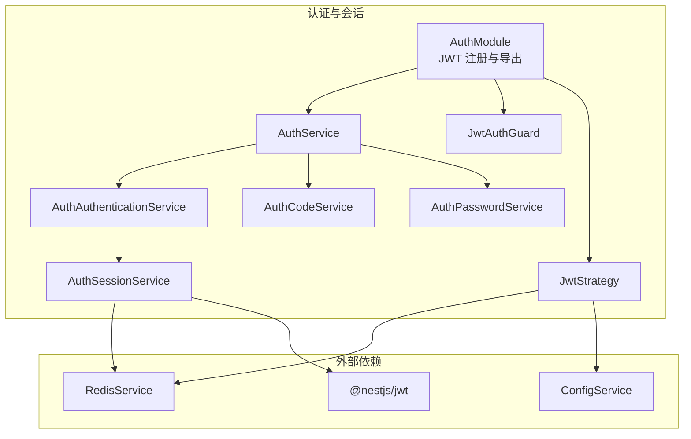
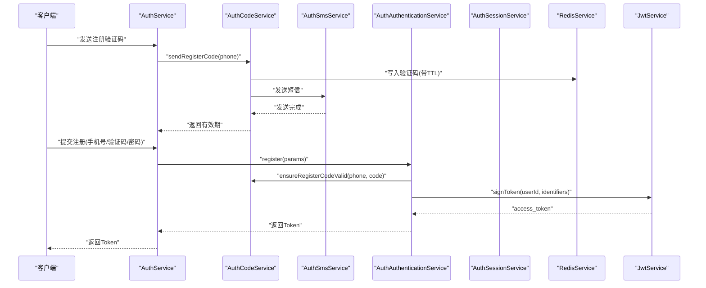
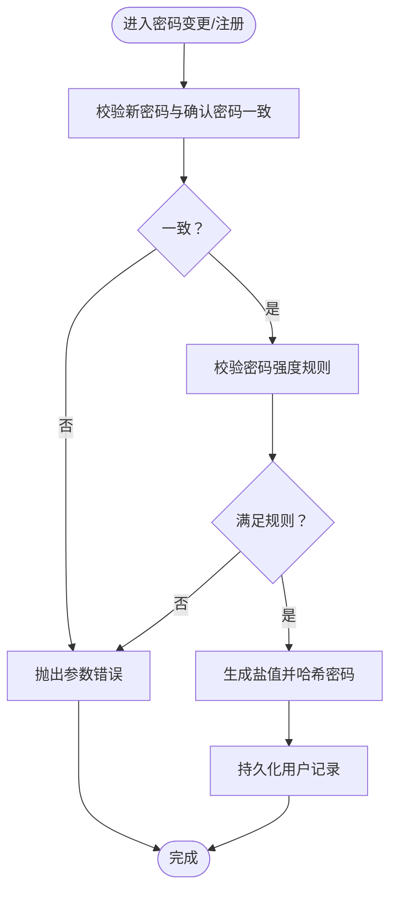
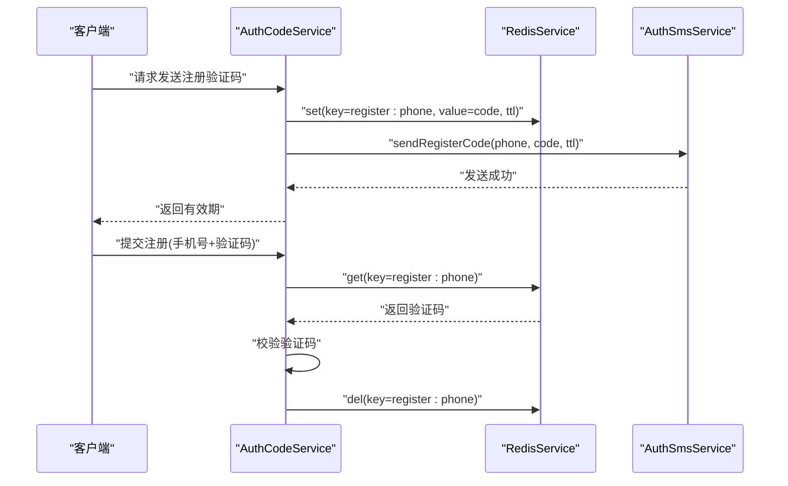
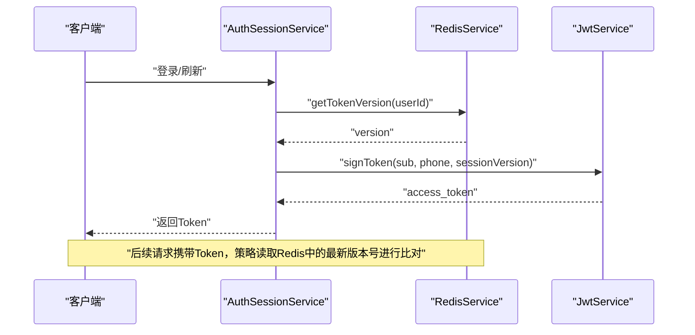
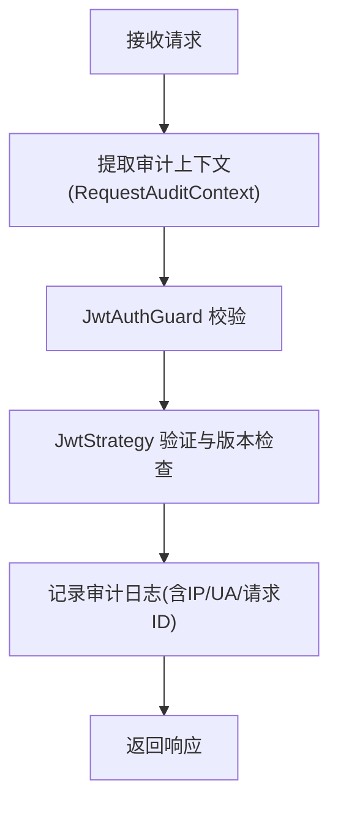
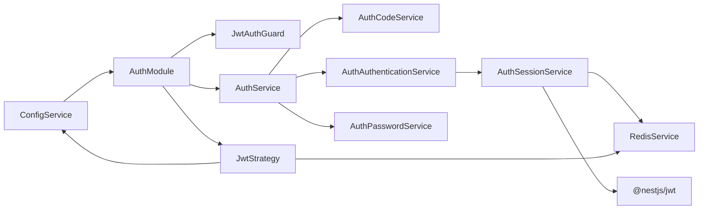

# 安全最佳实践

<cite>
**本文引用的文件**
- [src/purely-profit/auth/auth.module.ts](file://src/purely-profit/auth/auth.module.ts)
- [src/purely-profit/auth/guards/jwt-auth.guard.ts](file://src/purely-profit/auth/guards/jwt-auth.guard.ts)
- [src/purely-profit/auth/strategies/jwt.strategy.ts](file://src/purely-profit/auth/strategies/jwt.strategy.ts)
- [src/purely-profit/auth/strategies/jwt.strategy.spec.ts](file://src/purely-profit/auth/strategies/jwt.strategy.spec.ts)
- [src/purely-profit/auth/auth-session.service.ts](file://src/purely-profit/auth/auth-session.service.ts)
- [src/purely-profit/auth/auth-authentication.service.ts](file://src/purely-profit/auth/auth-authentication.service.ts)
- [src/purely-profit/auth/auth.service.ts](file://src/purely-profit/auth/auth.service.ts)
- [src/purely-profit/auth/auth-code.service.ts](file://src/purely-profit/auth/auth-code.service.ts)
- [src/purely-profit/auth/auth-sms.service.ts](file://src/purely-profit/auth/auth-sms.service.ts)
- [src/purely-profit/auth/auth-password.service.ts](file://src/purely-profit/auth/auth-password.service.ts)
- [src/purely-profit/auth/auth-password.types.ts](file://src/purely-profit/auth/auth-password.types.ts)
- [src/purely-profit/auth/auth.utils.ts](file://src/purely-profit/auth/auth.utils.ts)
- [src/purely-profit/auth/auth.constants.ts](file://src/purely-profit/auth/auth.constants.ts)
- [src/purely-profit/auth/request-audit-context.decorator.ts](file://src/purely-profit/auth/request-audit-context.decorator.ts)
- [src/purely-profit/auth/user-with-request-id.decorator.ts](file://src/purely-profit/auth/user-with-request-id.decorator.ts)
- [src/config/configuration.ts](file://src/config/configuration.ts)
- [src/main.ts](file://src/main.ts)
- [src/redis/redis.service.ts](file://src/redis/redis.service.ts)
- [prisma/schema.prisma](file://prisma/schema.prisma)
</cite>

## 目录
1. [引言](#引言)
2. [项目结构](#项目结构)
3. [核心组件](#核心组件)
4. [架构总览](#架构总览)
5. [详细组件分析](#详细组件分析)
6. [依赖关系分析](#依赖关系分析)
7. [性能考量](#性能考量)
8. [故障排查指南](#故障排查指南)
9. [结论](#结论)
10. [附录](#附录)

## 引言
本文件面向安全最佳实践，系统梳理并解释本项目的密码安全策略、验证码与短信验证流程、会话与 Token 管理、CSRF/XSS/SQL 注入等常见威胁的防护现状与改进建议，并提供可落地的配置项、防护实现路径与应急处置方案。内容基于仓库中实际代码进行分析，确保可追溯性与可执行性。

## 项目结构
围绕“认证与会话”主题，安全相关能力主要集中在以下模块与文件：
- 认证与授权：auth 模块（控制器、服务、策略、守卫）
- 会话与 Token：JWT 配置、会话版本控制、Redis 存储
- 验证码与短信：验证码生成、缓存、短信发送
- 安全上下文与审计：请求审计上下文装饰器、用户与请求 ID 联合装饰器
- 全局配置：应用配置、HTTP 观测与超时设置
- 数据模型：Prisma schema 中的用户与相关实体

图表来源
- [src/purely-profit/auth/auth.module.ts:21-55](file://src/purely-profit/auth/auth.module.ts#L21-L55)
- [src/purely-profit/auth/guards/jwt-auth.guard.ts:1-5](file://src/purely-profit/auth/guards/jwt-auth.guard.ts#L1-L5)
- [src/purely-profit/auth/strategies/jwt.strategy.ts](file://src/purely-profit/auth/strategies/jwt.strategy.ts)
- [src/purely-profit/auth/auth.service.ts:29-75](file://src/purely-profit/auth/auth.service.ts#L29-L75)
- [src/purely-profit/auth/auth-authentication.service.ts:1-41](file://src/purely-profit/auth/auth-authentication.service.ts#L1-L41)
- [src/purely-profit/auth/auth-code.service.ts:1-82](file://src/purely-profit/auth/auth-code.service.ts#L1-L82)
- [src/purely-profit/auth/auth-session.service.ts:1-46](file://src/purely-profit/auth/auth-session.service.ts#L1-L46)
- [src/purely-profit/auth/auth-password.service.ts](file://src/purely-profit/auth/auth-password.service.ts)
- [src/redis/redis.service.ts](file://src/redis/redis.service.ts)

章节来源
- [src/purely-profit/auth/auth.module.ts:21-55](file://src/purely-profit/auth/auth.module.ts#L21-L55)
- [src/purely-profit/auth/auth.service.ts:29-75](file://src/purely-profit/auth/auth.service.ts#L29-L75)
- [src/purely-profit/auth/auth-authentication.service.ts:1-41](file://src/purely-profit/auth/auth-authentication.service.ts#L1-L41)
- [src/purely-profit/auth/auth-code.service.ts:1-82](file://src/purely-profit/auth/auth-code.service.ts#L1-L82)
- [src/purely-profit/auth/auth-session.service.ts:1-46](file://src/purely-profit/auth/auth-session.service.ts#L1-L46)
- [src/purely-profit/auth/auth-password.service.ts](file://src/purely-profit/auth/auth-password.service.ts)
- [src/redis/redis.service.ts](file://src/redis/redis.service.ts)

## 核心组件
- 认证模块与 JWT 配置：集中注册 JWT 模块，注入密钥与过期时间，供守卫与策略使用。
- 会话与 Token：通过 JWT 生成访问令牌；通过 Redis 维护 Token 版本号，支持强制失效与刷新。
- 验证码与短信：生成数字验证码、写入 Redis 并发送短信；在注册/重置流程中校验与清理。
- 密码服务：负责密码强度校验、确认校验、哈希与比较等（具体实现位于服务文件）。
- 安全装饰器：提供请求审计上下文与用户+请求 ID 的联合参数解析，便于日志与追踪。
- 全局配置：统一管理 CORS、Swagger、日志、HTTP 超时、慢请求/慢查询阈值等。

章节来源
- [src/purely-profit/auth/auth.module.ts:21-55](file://src/purely-profit/auth/auth.module.ts#L21-L55)
- [src/purely-profit/auth/auth-session.service.ts:1-46](file://src/purely-profit/auth/auth-session.service.ts#L1-L46)
- [src/purely-profit/auth/auth-code.service.ts:1-82](file://src/purely-profit/auth/auth-code.service.ts#L1-L82)
- [src/purely-profit/auth/auth-sms.service.ts:1-38](file://src/purely-profit/auth/auth-sms.service.ts#L1-L38)
- [src/purely-profit/auth/auth-password.service.ts](file://src/purely-profit/auth/auth-password.service.ts)
- [src/purely-profit/auth/request-audit-context.decorator.ts:1-39](file://src/purely-profit/auth/request-audit-context.decorator.ts#L1-L39)
- [src/purely-profit/auth/user-with-request-id.decorator.ts:1-33](file://src/purely-profit/auth/user-with-request-id.decorator.ts#L1-L33)
- [src/config/configuration.ts:1-51](file://src/config/configuration.ts#L1-L51)
- [src/main.ts:1-53](file://src/main.ts#L1-L53)

## 架构总览
下图展示认证与会话的关键交互：客户端发起登录/注册请求，服务端生成验证码并发送短信，完成校验后签发 JWT；后续请求由守卫与策略校验 Token 并结合会话版本进行有效性检查。

图表来源
- [src/purely-profit/auth/auth.service.ts:38-54](file://src/purely-profit/auth/auth.service.ts#L38-L54)
- [src/purely-profit/auth/auth-code.service.ts:31-71](file://src/purely-profit/auth/auth-code.service.ts#L31-L71)
- [src/purely-profit/auth/auth-sms.service.ts:19-37](file://src/purely-profit/auth/auth-sms.service.ts#L19-L37)
- [src/purely-profit/auth/auth-authentication.service.ts:30-41](file://src/purely-profit/auth/auth-authentication.service.ts#L30-L41)
- [src/purely-profit/auth/auth-session.service.ts:16-29](file://src/purely-profit/auth/auth-session.service.ts#L16-L29)
- [src/redis/redis.service.ts](file://src/redis/redis.service.ts)

## 详细组件分析

### 密码安全策略与强度校验
- 密码确认一致性：注册与修改密码流程均要求确认密码一致，避免误输入导致的错误。
- 密码强度规则：建议在密码服务中引入长度、字符集多样性、历史重复等规则（当前服务文件提供接口定义与类型约束，具体规则需在实现中补充）。
- 哈希与比较：使用安全的哈希算法与盐值，确保存储不可逆；比较采用常量时间算法以降低侧信道风险。
- 历史密码限制：建议在密码变更时禁止使用最近 N 次使用的密码。

图表来源
- [src/purely-profit/auth/auth-authentication.service.ts:30-41](file://src/purely-profit/auth/auth-authentication.service.ts#L30-L41)
- [src/purely-profit/auth/auth-password.types.ts](file://src/purely-profit/auth/auth-password.types.ts)
- [src/purely-profit/auth/auth-password.service.ts](file://src/purely-profit/auth/auth-password.service.ts)

章节来源
- [src/purely-profit/auth/auth-authentication.service.ts:30-41](file://src/purely-profit/auth/auth-authentication.service.ts#L30-L41)
- [src/purely-profit/auth/auth-password.types.ts](file://src/purely-profit/auth/auth-password.types.ts)
- [src/purely-profit/auth/auth-password.service.ts](file://src/purely-profit/auth/auth-password.service.ts)

### 验证码机制与短信验证流程
- 验证码生成：使用安全随机数生成固定位数的纯数字验证码。
- 缓存与 TTL：验证码写入 Redis，设置过期时间；非生产环境可返回明文验证码便于调试。
- 发送短信：通过短信服务记录日志并发送；失败时回滚缓存。
- 校验与清理：注册流程中先校验验证码，再清理缓存，防止复用。

图表来源
- [src/purely-profit/auth/auth-code.service.ts:31-82](file://src/purely-profit/auth/auth-code.service.ts#L31-L82)
- [src/purely-profit/auth/auth-sms.service.ts:19-37](file://src/purely-profit/auth/auth-sms.service.ts#L19-L37)
- [src/purely-profit/auth/auth.utils.ts](file://src/purely-profit/auth/auth.utils.ts)
- [src/purely-profit/auth/auth.constants.ts](file://src/purely-profit/auth/auth.constants.ts)

章节来源
- [src/purely-profit/auth/auth-code.service.ts:1-82](file://src/purely-profit/auth/auth-code.service.ts#L1-L82)
- [src/purely-profit/auth/auth-sms.service.ts:1-38](file://src/purely-profit/auth/auth-sms.service.ts#L1-L38)
- [src/purely-profit/auth/auth.utils.ts](file://src/purely-profit/auth/auth.utils.ts)
- [src/purely-profit/auth/auth.constants.ts](file://src/purely-profit/auth/auth.constants.ts)

### 会话管理策略与 Token 刷新机制
- JWT 签发：携带用户标识、手机号与会话版本号；过期时间由配置决定。
- 会话版本控制：通过 Redis 存储每个用户的会话版本号，每次刷新/吊销时递增；策略在验证阶段对比版本号，拒绝过期 Token。
- Token 刷新：建议提供 refresh 接口，仅在必要时签发短期 refresh token，长期使用短期 access token 与版本控制实现“无状态吊销”。

图表来源
- [src/purely-profit/auth/auth-session.service.ts:16-46](file://src/purely-profit/auth/auth-session.service.ts#L16-L46)
- [src/purely-profit/auth/strategies/jwt.strategy.spec.ts:39-63](file://src/purely-profit/auth/strategies/jwt.strategy.spec.ts#L39-L63)
- [src/redis/redis.service.ts](file://src/redis/redis.service.ts)

章节来源
- [src/purely-profit/auth/auth-session.service.ts:1-46](file://src/purely-profit/auth/auth-session.service.ts#L1-L46)
- [src/purely-profit/auth/strategies/jwt.strategy.spec.ts:39-63](file://src/purely-profit/auth/strategies/jwt.strategy.spec.ts#L39-L63)
- [src/redis/redis.service.ts](file://src/redis/redis.service.ts)

### 异常登录检测与审计
- 请求审计上下文：从请求头提取 x-request-id、user-agent，结合 IP 记录审计信息。
- 用户与请求 ID 联合装饰器：确保每个受保护接口都能拿到用户与请求 ID，便于日志关联与追踪。
- 安全日志：建议在认证、会话版本不匹配、验证码错误等关键节点输出结构化日志。

图表来源
- [src/purely-profit/auth/request-audit-context.decorator.ts:26-39](file://src/purely-profit/auth/request-audit-context.decorator.ts#L26-L39)
- [src/purely-profit/auth/user-with-request-id.decorator.ts:13-33](file://src/purely-profit/auth/user-with-request-id.decorator.ts#L13-L33)
- [src/purely-profit/auth/guards/jwt-auth.guard.ts:1-5](file://src/purely-profit/auth/guards/jwt-auth.guard.ts#L1-L5)
- [src/purely-profit/auth/strategies/jwt.strategy.ts](file://src/purely-profit/auth/strategies/jwt.strategy.ts)

章节来源
- [src/purely-profit/auth/request-audit-context.decorator.ts:1-39](file://src/purely-profit/auth/request-audit-context.decorator.ts#L1-L39)
- [src/purely-profit/auth/user-with-request-id.decorator.ts:1-33](file://src/purely-profit/auth/user-with-request-id.decorator.ts#L1-L33)
- [src/purely-profit/auth/guards/jwt-auth.guard.ts:1-5](file://src/purely-profit/auth/guards/jwt-auth.guard.ts#L1-L5)
- [src/purely-profit/auth/strategies/jwt.strategy.ts](file://src/purely-profit/auth/strategies/jwt.strategy.ts)

### CSRF、XSS、SQL 注入防护现状与建议
- CSRF 防护：当前未见专用 CSRF Token 或 SameSite Cookie 设置；建议在前端表单与跨站请求场景启用 CSRF Token，并在后端校验；同时为 API 场景合理设置 Cookie SameSite 属性。
- XSS 防护：未发现专门的 CSP 或输出编码策略；建议在网关或中间件层启用严格 CSP 头，对富文本输出进行 HTML 转义，避免模板注入。
- SQL 注入防护：Prisma ORM 已默认使用参数化查询，具备较强防护；仍需避免动态拼接 SQL 与原生查询滥用，保持输入校验与最小权限原则。

章节来源
- [prisma/schema.prisma](file://prisma/schema.prisma)

### 安全配置选项与全局安全设置
- 应用配置：统一管理 CORS 来源、Swagger 开关、日志开关、HTTP 超时、慢请求/慢查询阈值等，便于在不同环境调整安全与可观测性策略。
- HTTP 观测：在 Fastify 适配器上挂载 onRequest/onResponse 钩子，计算请求耗时并按阈值记录慢请求日志，辅助安全事件定位。

章节来源
- [src/config/configuration.ts:8-51](file://src/config/configuration.ts#L8-L51)
- [src/main.ts:32-53](file://src/main.ts#L32-L53)

## 依赖关系分析
- 认证模块依赖 JWT 模块与配置服务，提供守卫与策略；会话服务依赖 Redis 与 JWT；验证码服务依赖 Redis、配置与短信服务。
- 守卫与策略构成鉴权链路，策略中读取 Redis 的会话版本号进行实时有效性校验，形成“无状态但可吊销”的会话模型。

图表来源
- [src/purely-profit/auth/auth.module.ts:21-55](file://src/purely-profit/auth/auth.module.ts#L21-L55)
- [src/purely-profit/auth/guards/jwt-auth.guard.ts:1-5](file://src/purely-profit/auth/guards/jwt-auth.guard.ts#L1-L5)
- [src/purely-profit/auth/strategies/jwt.strategy.ts](file://src/purely-profit/auth/strategies/jwt.strategy.ts)
- [src/purely-profit/auth/auth-session.service.ts:1-46](file://src/purely-profit/auth/auth-session.service.ts#L1-L46)
- [src/redis/redis.service.ts](file://src/redis/redis.service.ts)

章节来源
- [src/purely-profit/auth/auth.module.ts:21-55](file://src/purely-profit/auth/auth.module.ts#L21-L55)
- [src/purely-profit/auth/auth-session.service.ts:1-46](file://src/purely-profit/auth/auth-session.service.ts#L1-L46)
- [src/redis/redis.service.ts](file://src/redis/redis.service.ts)

## 性能考量
- Token 版本读取与签发：Redis 单次读取与写入，延迟极低；建议在高并发场景开启连接池与合理的超时设置。
- 验证码缓存：TTL 管理与短信发送失败回滚，避免脏数据；建议对热点手机号增加限流。
- 慢请求/慢查询监控：通过配置项开启慢日志，结合可观测性指标定位瓶颈与潜在攻击面。

## 故障排查指南
- 旧 Token 被拒绝：若策略抛出未授权异常，检查 Redis 中该用户的会话版本号是否已递增（例如执行了强制下线/刷新），确保客户端使用最新 Token。
- 验证码无效或过期：确认 Redis 中对应键是否存在且未过期；检查短信服务日志与异常回滚逻辑。
- 登录失败：核对密码确认与强度规则；检查用户是否存在、账户状态是否正常。
- 审计缺失：确认请求头中包含 x-request-id、user-agent，以及装饰器正确注入到控制器参数。

章节来源
- [src/purely-profit/auth/strategies/jwt.strategy.spec.ts:39-63](file://src/purely-profit/auth/strategies/jwt.strategy.spec.ts#L39-L63)
- [src/purely-profit/auth/auth-code.service.ts:73-78](file://src/purely-profit/auth/auth-code.service.ts#L73-L78)
- [src/purely-profit/auth/request-audit-context.decorator.ts:26-39](file://src/purely-profit/auth/request-audit-context.decorator.ts#L26-L39)

## 结论
本项目在认证与会话层面已具备较为完善的基础设施：JWT 签发、Redis 会话版本控制、验证码与短信流程、请求审计上下文等。建议在此基础上进一步完善 CSRF/XSS 防护策略、密码强度规则与历史密码限制、SQL 注入的最小暴露面管理，并建立统一的安全审计与事件响应流程，以达到更高等级的安全保障。

## 附录
- 安全配置要点
  - CORS 来源白名单、Swagger 开关、日志级别、HTTP 超时与慢请求阈值
  - JWT 密钥与过期时间、Redis 连接与超时
- 建议的增强措施
  - CSRF Token 与 SameSite Cookie
  - CSP 与输出编码
  - 密码强度规则与历史密码限制
  - 异常登录检测与自动冻结
  - 安全事件响应流程与演练