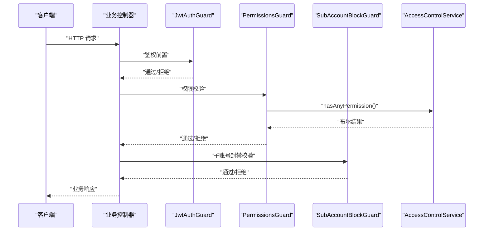
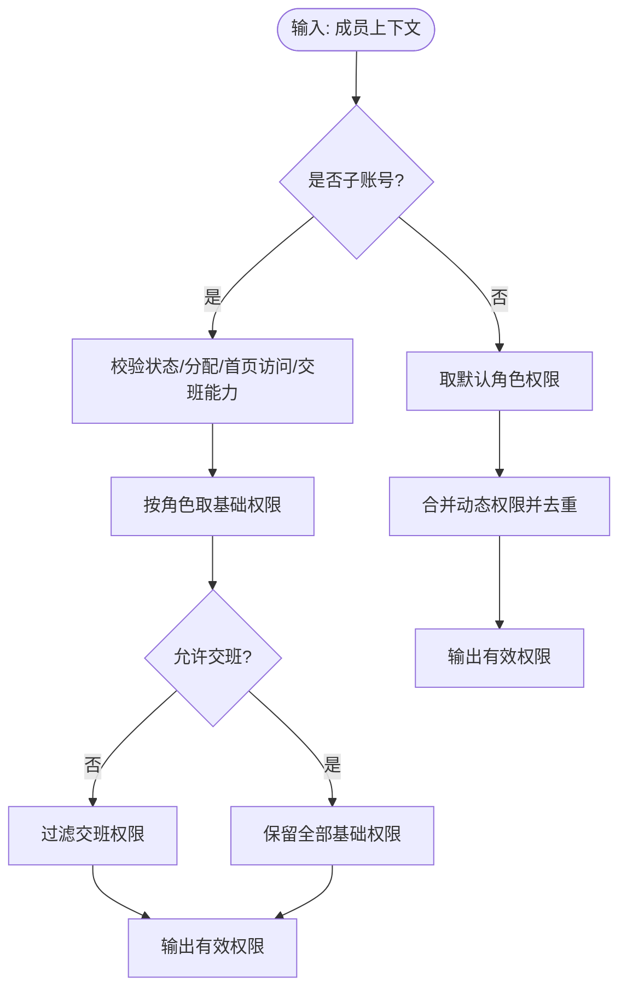
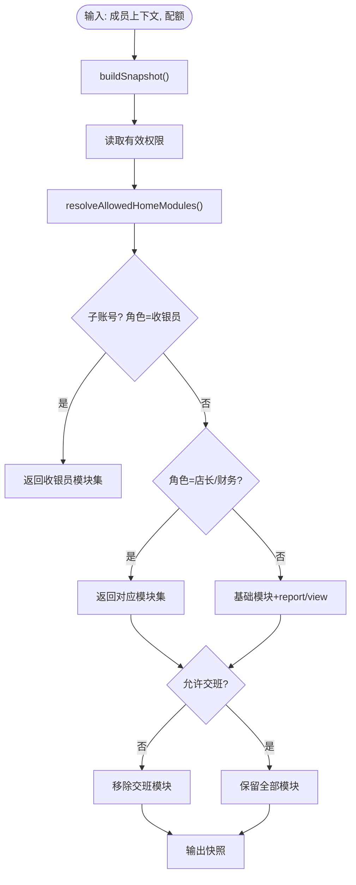
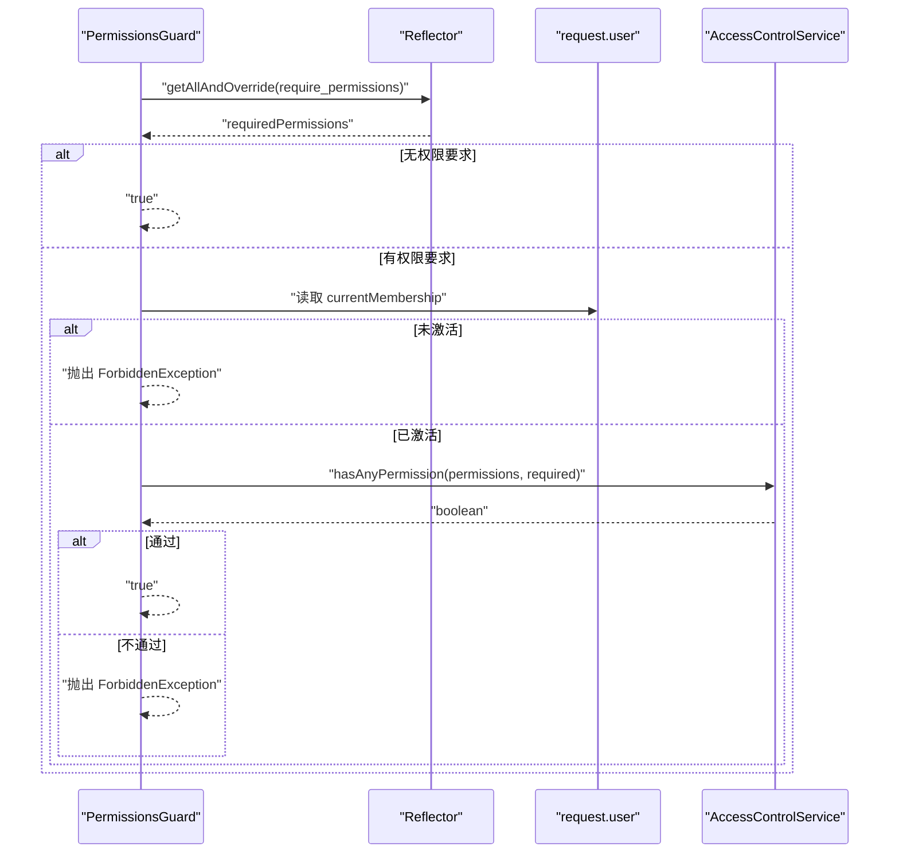
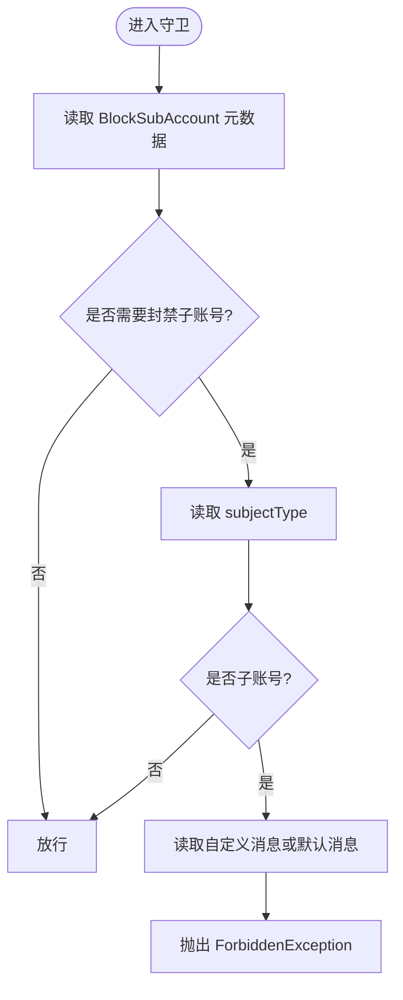
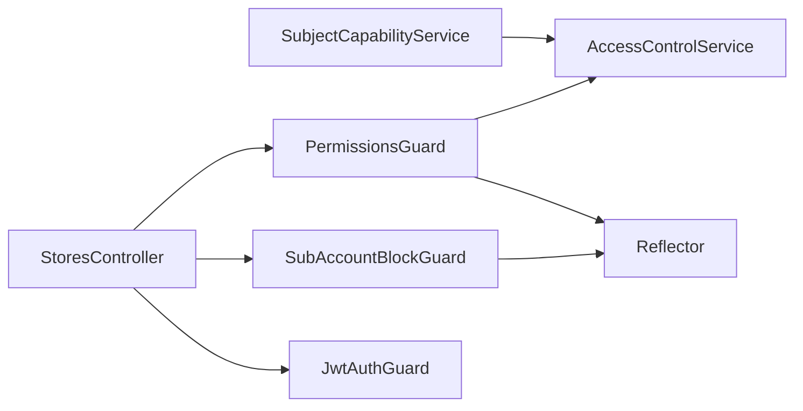

# 权限控制模型

<cite>
**本文引用的文件**
- [access-control.module.ts](file://src/purely-profit/access-control/access-control.module.ts)
- [access-control.service.ts](file://src/purely-profit/access-control/access-control.service.ts)
- [subject-capability.service.ts](file://src/purely-profit/access-control/subject-capability.service.ts)
- [permissions.guard.ts](file://src/purely-profit/access-control/guards/permissions.guard.ts)
- [sub-account-block.guard.ts](file://src/purely-profit/access-control/guards/sub-account-block.guard.ts)
- [require-permissions.decorator.ts](file://src/purely-profit/access-control/decorators/require-permissions.decorator.ts)
- [block-sub-account.decorator.ts](file://src/purely-profit/access-control/decorators/block-sub-account.decorator.ts)
- [access-control.constants.ts](file://src/purely-profit/access-control/access-control.constants.ts)
- [access-control-alignment.spec.ts](file://src/purely-profit/access-control/access-control-alignment.spec.ts)
- [subject-capability.service.spec.ts](file://src/purely-profit/access-control/subject-capability.service.spec.ts)
- [jwt-auth.guard.ts](file://src/purely-profit/auth/guards/jwt-auth.guard.ts)
- [stores.controller.ts](file://src/purely-profit/stores/stores.controller.ts)
- [marketing.controller.ts](file://src/purely-profit/marketing/marketing.controller.ts)
- [sales-record.controller.ts](file://src/purely-profit/operations/sales-record/sales-record.controller.ts)
- [sales-orders-compat.controller.ts](file://src/purely-profit/operations/sales-record/sales-orders-compat.controller.ts)
- [space-sessions.controller.ts](file://src/purely-profit/operations/spaces/space-sessions.controller.ts)
- [business-analysis.controller.ts](file://src/purely-profit/dashboard/business-analysis/business-analysis.controller.ts)
- [finance.controller.ts](file://src/purely-profit/finance/finance.controller.ts)
- [inventory.controller.ts](file://src/purely-profit/goods/inventory/inventory.controller.ts)
- [dashboard-home.controller.ts](file://src/purely-profit/dashboard/dashboard-home/dashboard-home.controller.ts)
- [platform-membership.controller.ts](file://src/purely-profit/member/platform-membership/platform-membership.controller.ts)
- [promotion-detail-compat.controller.ts](file://src/purely-profit/member/platform-membership/promotion-detail-compat.controller.ts)
- [partner-review.controller.ts](file://src/purely-profit/member/platform-membership/partner-review.controller.ts)
- [employees-payrolls.controller.ts](file://src/purely-profit/staff/employees/employees-payrolls.controller.ts)
</cite>

## 更新摘要
**变更内容**
- 财务子账户现在获得了交接班管理模块的完整访问权限，包括查看、创建和更新交接记录
- 在 FINANCE_SUB_ACCOUNT_PERMISSIONS 数组中添加了 'handover:view'、'handover:create' 和 'handover:update' 三个新权限
- 在 FINANCE_ALLOWED_HOME_MODULES 集合中添加了 'handover-management' 模块
- 更新了相关测试用例以验证新的权限配置

## 目录
1. [引言](#引言)
2. [项目结构](#项目结构)
3. [核心组件](#核心组件)
4. [架构总览](#架构总览)
5. [详细组件分析](#详细组件分析)
6. [依赖关系分析](#依赖关系分析)
7. [性能考虑](#性能考虑)
8. [故障排查指南](#故障排查指南)
9. [结论](#结论)
10. [附录](#附录)

## 引言
本文件系统性阐述该系统的基于角色的访问控制（RBAC）模型实现，覆盖权限继承机制、主体能力计算、权限验证流程；详解权限装饰器与权限守卫的工作原理；给出权限配置数据结构与使用范式；并提供缓存策略、性能优化建议、冲突处理与调试工具，帮助初学者快速上手，同时满足资深工程师对实现细节与最佳实践的需求。

## 项目结构
权限控制模块位于业务层"purely-profit"下，采用按功能域划分的组织方式，核心文件集中在 access-control 目录中，并与认证、业务控制器协同工作。

```mermaid
graph TB
subgraph "权限控制模块"
AC["AccessControlModule"]
ACS["AccessControlService"]
SCS["SubjectCapabilityService"]
PG["PermissionsGuard"]
SABG["SubAccountBlockGuard"]
end
subgraph "认证模块"
JAG["JwtAuthGuard"]
end
subgraph "业务控制器"
STO["StoresController"]
MKT["MarketingController"]
SR["SalesRecordController"]
SO["SalesOrdersCompatController"]
SS["SpaceSessionsController"]
BA["BusinessAnalysisController"]
FI["FinanceController"]
IV["InventoryController"]
DH["DashboardHomeController"]
PM["PlatformMembershipController"]
PDC["PromotionDetailCompatController"]
PR["PartnerReviewController"]
EP["EmployeesPayrollsController"]
end
AC --> ACS
AC --> SCS
AC --> PG
AC --> SABG
STO --> JAG
STO --> PG
STO --> SABG
MKT --> JAG
MKT --> PG
SR --> JAG
SR --> PG
SO --> JAG
SO --> PG
SS --> JAG
SS --> PG
BA --> JAG
BA --> PG
FI --> JAG
FI --> PG
IV --> JAG
IV --> PG
DH --> JAG
DH --> PG
PM --> JAG
PM --> PG
PM --> SABG
PDC --> JAG
PDC --> PG
PDC --> SABG
PR --> JAG
PR --> PG
PR --> SABG
EP --> JAG
EP --> PG
```

图表来源
- [access-control.module.ts:1-23](file://src/purely-profit/access-control/access-control.module.ts#L1-L23)
- [permissions.guard.ts:1-55](file://src/purely-profit/access-control/guards/permissions.guard.ts#L1-L55)
- [sub-account-block.guard.ts:1-48](file://src/purely-profit/access-control/guards/sub-account-block.guard.ts#L1-L48)
- [jwt-auth.guard.ts](file://src/purely-profit/auth/guards/jwt-auth.guard.ts)
- [stores.controller.ts](file://src/purely-profit/stores/stores.controller.ts)
- [marketing.controller.ts](file://src/purely-profit/marketing/marketing.controller.ts)
- [sales-record.controller.ts](file://src/purely-profit/operations/sales-record/sales-record.controller.ts)
- [sales-orders-compat.controller.ts](file://src/purely-profit/operations/sales-record/sales-orders-compat.controller.ts)
- [space-sessions.controller.ts](file://src/purely-profit/operations/spaces/space-sessions.controller.ts)
- [business-analysis.controller.ts](file://src/purely-profit/dashboard/business-analysis/business-analysis.controller.ts)
- [finance.controller.ts](file://src/purely-profit/finance/finance.controller.ts)
- [inventory.controller.ts](file://src/purely-profit/goods/inventory/inventory.controller.ts)
- [dashboard-home.controller.ts](file://src/purely-profit/dashboard/dashboard-home/dashboard-home.controller.ts)
- [platform-membership.controller.ts](file://src/purely-profit/member/platform-membership/platform-membership.controller.ts)
- [promotion-detail-compat.controller.ts](file://src/purely-profit/member/platform-membership/promotion-detail-compat.controller.ts)
- [partner-review.controller.ts](file://src/purely-profit/member/platform-membership/partner-review.controller.ts)
- [employees-payrolls.controller.ts](file://src/purely-profit/staff/employees/employees-payrolls.controller.ts)

章节来源
- [access-control.module.ts:1-23](file://src/purely-profit/access-control/access-control.module.ts#L1-L23)

## 核心组件
- 访问控制服务（AccessControlService）
  - 负责计算有效权限、权限校验、解析当前门店 ID、构建成员上下文等。
  - 支持主账号、子账号两类身份类型，以及默认角色权限与动态权限合并。
- 主体能力服务（SubjectCapabilityService）
  - 基于有效权限与模块白名单，生成主体可访问的首页模块集合与能力快照。
  - 对子账号按角色与可用能力进行精细化裁剪。
- 权限守卫（PermissionsGuard）
  - 读取控制器/方法上的 RequirePermissions 元数据，结合当前用户的权限进行放行/拒绝。
- 子账号封禁守卫（SubAccountBlockGuard）
  - 读取 BlockSubAccount 元数据，阻止子账号访问特定接口。
- 权限装饰器
  - RequirePermissions：为控制器或方法设置所需权限列表。
  - BlockSubAccount：标记接口禁止子账号访问，并可自定义提示信息。
- 常量与默认权限
  - 定义权限码、通配符、默认角色权限集、子账号角色权限集与标签映射。

章节来源
- [access-control.service.ts:122-243](file://src/purely-profit/access-control/access-control.service.ts#L122-L243)
- [subject-capability.service.ts:63-211](file://src/purely-profit/access-control/subject-capability.service.ts#L63-L211)
- [permissions.guard.ts:12-55](file://src/purely-profit/access-control/guards/permissions.guard.ts#L12-L55)
- [sub-account-block.guard.ts:13-48](file://src/purely-profit/access-control/guards/sub-account-block.guard.ts#L13-L48)
- [require-permissions.decorator.ts:1-8](file://src/purely-profit/access-control/decorators/require-permissions.decorator.ts#L1-L8)
- [block-sub-account.decorator.ts:1-17](file://src/purely-profit/access-control/decorators/block-sub-account.decorator.ts#L1-L17)
- [access-control.constants.ts:1-171](file://src/purely-profit/access-control/access-control.constants.ts#L1-L171)

## 架构总览
权限控制由"装饰器 + 守卫 + 服务"的组合构成，形成从控制器到执行链的多层防护：

图表来源
- [permissions.guard.ts:19-53](file://src/purely-profit/access-control/guards/permissions.guard.ts#L19-L53)
- [sub-account-block.guard.ts:17-46](file://src/purely-profit/access-control/guards/sub-account-block.guard.ts#L17-L46)
- [access-control.service.ts:135-152](file://src/purely-profit/access-control/access-control.service.ts#L135-L152)
- [jwt-auth.guard.ts](file://src/purely-profit/auth/guards/jwt-auth.guard.ts)

## 详细组件分析

### 访问控制服务（AccessControlService）
- 有效权限计算
  - 若为子账号：根据角色与状态、是否分配、是否允许进入首页、是否允许交班等条件，返回对应的基础权限集，并在不允许交班时剔除交班相关权限。
  - 若为主账号：合并默认角色权限与动态权限，去重后返回。
- 权限校验
  - 支持单个权限与任意权限集合校验，支持通配符"*"。
- 当前门店 ID 解析
  - 在用户激活状态下，若具备所需权限则返回当前门店 ID，否则返回空。
- 成员上下文构建
  - 统一封装 staff 与 sub-account 的上下文，自动计算有效权限。

图表来源
- [access-control.service.ts:124-133](file://src/purely-profit/access-control/access-control.service.ts#L124-L133)
- [access-control.service.ts:220-241](file://src/purely-profit/access-control/access-control.service.ts#L220-L241)

**更新** 财务子账户现在拥有完整的交接班管理权限，包括查看、创建和更新操作。

章节来源
- [access-control.service.ts:122-243](file://src/purely-profit/access-control/access-control.service.ts#L122-L243)

### 主体能力服务（SubjectCapabilityService）
- 能力快照生成
  - 基于有效权限与模块白名单，计算允许与隐藏的首页模块集合，并映射到具体能力开关（如查看财务、使用商品管理、使用交班管理等）。
- 子账号能力裁剪
  - 按角色返回不同的模块集合，并在不允许交班时移除交班模块。
- 与访问控制服务协作
  - 复用 AccessControlService 的权限校验逻辑，确保能力与权限一致。

图表来源
- [subject-capability.service.ts:67-97](file://src/purely-profit/access-control/subject-capability.service.ts#L67-L97)
- [subject-capability.service.ts:99-167](file://src/purely-profit/access-control/subject-capability.service.ts#L99-L167)
- [subject-capability.service.ts:169-199](file://src/purely-profit/access-control/subject-capability.service.ts#L169-L199)

**更新** 财务子账户现在可以在首页看到交接班管理模块，并且具有完整的交接班操作权限。

章节来源
- [subject-capability.service.ts:63-211](file://src/purely-profit/access-control/subject-capability.service.ts#L63-L211)

### 权限守卫（PermissionsGuard）
- 元数据读取
  - 使用反射读取控制器/类与处理器上的 RequirePermissions 元数据。
- 校验流程
  - 若未声明所需权限，默认放行；
  - 从请求对象提取当前成员上下文，若未激活则拒绝；
  - 调用 AccessControlService.hasAnyPermission 进行校验，不满足则抛出拒绝异常。

图表来源
- [permissions.guard.ts:19-53](file://src/purely-profit/access-control/guards/permissions.guard.ts#L19-L53)
- [access-control.service.ts:145-152](file://src/purely-profit/access-control/access-control.service.ts#L145-L152)

章节来源
- [permissions.guard.ts:12-55](file://src/purely-profit/access-control/guards/permissions.guard.ts#L12-L55)

### 子账号封禁守卫（SubAccountBlockGuard）
- 元数据读取
  - 读取 BlockSubAccount 标记与自定义消息元数据。
- 校验流程
  - 若未标记，则放行；
  - 若标记且当前主体为子账号，则拒绝并返回自定义或默认消息。

图表来源
- [sub-account-block.guard.ts:17-46](file://src/purely-profit/access-control/guards/sub-account-block.guard.ts#L17-L46)
- [block-sub-account.decorator.ts:10-16](file://src/purely-profit/access-control/decorators/block-sub-account.decorator.ts#L10-L16)

章节来源
- [sub-account-block.guard.ts:13-48](file://src/purely-profit/access-control/guards/sub-account-block.guard.ts#L13-L48)

### 权限装饰器与使用范式
- RequirePermissions(...)
  - 为控制器或方法设置所需权限数组，支持任意权限满足即通过。
- BlockSubAccount(message?)
  - 标记接口禁止子账号访问，可选传入自定义提示信息。
- 控制器级守卫装配
  - 通过反射读取 GUARDS_METADATA，确认 JwtAuthGuard、PermissionsGuard、SubAccountBlockGuard 的装配顺序与存在性。

章节来源
- [require-permissions.decorator.ts:1-8](file://src/purely-profit/access-control/decorators/require-permissions.decorator.ts#L1-L8)
- [block-sub-account.decorator.ts:1-17](file://src/purely-profit/access-control/decorators/block-sub-account.decorator.ts#L1-L17)
- [access-control-alignment.spec.ts:342-361](file://src/purely-profit/access-control/access-control-alignment.spec.ts#L342-L361)

### 权限配置数据结构
- 权限码（PermissionCode）
  - 包含 store、staff、members、partner、marketing、finance、cost、report、goods、supplier、purchase、operation-entry、sales、inventory、space、handover 等模块的动作维度。
- 默认角色权限
  - OWNER：通配符"*"，全量权限；
  - MANAGER：较全面的日常运营权限；
  - STAFF：基础只读与有限写权限。
- 子账号角色权限
  - cashier：以收银与少量管理能力为主；
  - manager：更广的管理范围；
  - finance：财务与成本相关能力，**现已包含完整的交接班管理权限**。
- 能力模块枚举
  - 首页模块包括 additional、business-analysis、finance-center、goods-management、handover-management、marketing-center、member-center、space-management、staff-management、store-settings。

**更新** 财务子账户的权限配置现已更新，包含以下交接班相关权限：
- `handover:view` - 查看交接记录
- `handover:create` - 创建交接记录  
- `handover:update` - 更新交接记录

章节来源
- [access-control.constants.ts:5-55](file://src/purely-profit/access-control/access-control.constants.ts#L5-L55)
- [access-control.constants.ts:107-170](file://src/purely-profit/access-control/access-control.constants.ts#L107-L170)
- [subject-capability.service.ts:10-23](file://src/purely-profit/access-control/subject-capability.service.ts#L10-L23)
- [access-control.service.ts:95-116](file://src/purely-profit/access-control/access-control.service.ts#L95-L116)

### 权限验证流程与示例路径
- 示例：营销中心接口
  - 装配 JwtAuthGuard 与 PermissionsGuard；
  - 方法级 RequirePermissions 设置为 ['marketing:view']。
- 示例：销售记录与订单兼容接口
  - 列表/创建/报表分别要求 ['sales:view']、['sales:create']、['report:view']、['operation-entry:view']、['operation-entry:create'] 等。
- 示例：门店设置接口
  - 同时装配 PermissionsGuard 与 SubAccountBlockGuard，确保仅主账号可访问。
- **新增示例：财务子账户交接班管理**
  - 财务子账户现在可以访问所有交接班管理相关的接口，包括查看、创建和更新操作。

章节来源
- [access-control-alignment.spec.ts:200-205](file://src/purely-profit/access-control/access-control-alignment.spec.ts#L200-L205)
- [access-control-alignment.spec.ts:207-256](file://src/purely-profit/access-control/access-control-alignment.spec.ts#L207-L256)
- [access-control-alignment.spec.ts:342-348](file://src/purely-profit/access-control/access-control-alignment.spec.ts#L342-L348)

## 依赖关系分析
- 组件内聚与耦合
  - SubjectCapabilityService 依赖 AccessControlService 进行权限校验，耦合度低，职责清晰。
  - Guards 通过反射读取装饰器元数据，与控制器解耦。
- 外部依赖
  - NestJS 反射与元数据系统；
  - Prisma 枚举（StaffRole、StoreSubAccountRole、StoreSubAccountStatus）驱动权限与状态判断。
- 可能的循环依赖
  - 当前模块未见循环导入，各服务通过依赖注入提供能力。

图表来源
- [subject-capability.service.ts](file://src/purely-profit/access-control/subject-capability.service.ts#L65)
- [permissions.guard.ts:14-17](file://src/purely-profit/access-control/guards/permissions.guard.ts#L14-L17)
- [sub-account-block.guard.ts](file://src/purely-profit/access-control/guards/sub-account-block.guard.ts#L15)
- [stores.controller.ts](file://src/purely-profit/stores/stores.controller.ts)
- [jwt-auth.guard.ts](file://src/purely-profit/auth/guards/jwt-auth.guard.ts)

## 性能考虑
- 权限计算复杂度
  - 有效权限合并与去重为 O(n+m)，权限校验为 O(k)（k 为所需权限数），整体线性高效。
- 缓存策略建议
  - 将"有效权限"与"能力快照"缓存于请求上下文或 Redis，键可包含用户标识、门店标识、角色与时间戳版本号，避免重复计算。
  - 对子账号能力快照，按角色与状态位组合建立二级索引，减少过滤成本。
- 批量校验
  - 在同一请求中对多个接口权限进行批量校验时，先计算一次有效权限，复用结果。
- 热点接口优化
  - 对高频接口（如 dashboard-home）可预取并缓存能力快照，降低守卫层开销。
- 数据一致性
  - 权限变更后失效相关缓存；子账号状态变化需同步刷新其快照。

## 故障排查指南
- 常见问题
  - 子账号访问被拒：确认是否正确使用 BlockSubAccount 装饰器，守卫是否装配；检查自定义提示信息是否符合预期。
  - 主账号权限不足：检查 RequirePermissions 元数据是否正确设置；确认 AccessControlService.hasAnyPermission 的调用路径。
  - 子账号能力异常：核对 getEffectivePermissions 与 resolveAllowedHomeModules 的分支逻辑；关注 canAccessHome 与 canUseHandover 的影响。
  - **财务子账户交接班权限问题**：检查 FINANCE_SUB_ACCOUNT_PERMISSIONS 是否包含所需的 handover:* 权限，确认 FINANCE_ALLOWED_HOME_MODULES 是否包含 'handover-management'。
- 调试工具与手段
  - 单元测试：利用 access-control-alignment.spec.ts 和 subject-capability.service.spec.ts 中的断言，定位控制器与方法的权限元数据装配是否正确。
  - 日志与审计：在守卫与服务的关键节点输出请求 ID、用户标识、所需权限、有效权限、校验结果，便于回溯。
  - 端到端测试：针对 stores.controller、marketing.controller、sales-record.controller 等关键控制器编写 E2E 测试，覆盖权限场景。

**更新** 新增了财务子账户交接班权限相关的故障排查指导。

章节来源
- [access-control-alignment.spec.ts:1-362](file://src/purely-profit/access-control/access-control-alignment.spec.ts#L1-L362)
- [subject-capability.service.spec.ts:84-109](file://src/purely-profit/access-control/subject-capability.service.spec.ts#L84-L109)
- [permissions.guard.ts:39-50](file://src/purely-profit/access-control/guards/permissions.guard.ts#L39-L50)
- [sub-account-block.guard.spec.ts:45-74](file://src/purely-profit/access-control/guards/sub-account-block.guard.spec.ts#L45-L74)

## 结论
该权限控制模型以装饰器与守卫为核心，结合服务层的权限计算与能力快照，实现了灵活、可扩展、可审计的 RBAC 能力。通过默认角色权限与动态权限的融合、子账号差异化裁剪、以及严格的控制器级装配，既保证了易用性，也兼顾了安全性与性能。**最新的财务子账户交接班管理权限增强，进一步提升了财务人员的操作便利性**。建议在生产环境中配合缓存与可观测性体系，持续优化热点路径与异常处置。

## 附录

### 权限装饰器与守卫使用清单
- 为控制器或方法添加 RequirePermissions(...)，明确所需权限集合。
- 对仅主账号可访问的接口，添加 BlockSubAccount(message?) 并确保 SubAccountBlockGuard 装配。
- 在控制器类级别装配 JwtAuthGuard、PermissionsGuard、SubAccountBlockGuard，确保鉴权与权限双重保护。

### 财务子账户权限配置详情
**更新** 财务子账户现拥有的完整权限集合包括：

**财务相关权限：**
- `finance:view` - 查看财务信息
- `finance:manage` - 管理财务操作
- `finance:export` - 导出财务报表

**交接班管理权限（新增）：**
- `handover:view` - 查看交接记录
- `handover:create` - 创建交接记录
- `handover:update` - 更新交接记录

**其他业务权限：**
- 报告查看、商品管理、库存管理、供应商管理、采购管理、成本管理、销售管理、员工管理等

章节来源
- [require-permissions.decorator.ts:6-7](file://src/purely-profit/access-control/decorators/require-permissions.decorator.ts#L6-L7)
- [block-sub-account.decorator.ts:10-16](file://src/purely-profit/access-control/decorators/block-sub-account.decorator.ts#L10-L16)
- [access-control-alignment.spec.ts:342-361](file://src/purely-profit/access-control/access-control-alignment.spec.ts#L342-L361)
- [access-control.service.ts:95-116](file://src/purely-profit/access-control/access-control.service.ts#L95-L116)
- [subject-capability.service.ts:56-62](file://src/purely-profit/access-control/subject-capability.service.ts#L56-L62)