# 认证授权系统

<cite>
**本文档引用的文件**
- [auth.module.ts](file://src/purely-profit/auth/auth.module.ts)
- [auth.controller.ts](file://src/purely-profit/auth/auth.controller.ts)
- [auth.service.ts](file://src/purely-profit/auth/auth.service.ts)
- [auth-authentication.service.ts](file://src/purely-profit/auth/auth-authentication.service.ts)
- [auth-capability.service.ts](file://src/purely-profit/auth/auth-capability.service.ts)
- [auth-account.service.ts](file://src/purely-profit/auth/auth-account.service.ts)
- [auth-account-lookup.service.ts](file://src/purely-profit/auth/auth-account-lookup.service.ts)
- [auth-account-membership.service.ts](file://src/purely-profit/auth/auth-account-membership.service.ts)
- [auth-product-auth.service.ts](file://src/shared/auth/auth-product-auth.service.ts)
- [auth-code.service.ts](file://src/purely-profit/auth/auth-code.service.ts)
- [auth-sms.service.ts](file://src/purely-profit/auth/auth-sms.service.ts)
- [auth-password.types.ts](file://src/shared/auth/auth-password.types.ts)
- [auth-account.types.ts](file://src/shared/auth/auth-account.types.ts)
- [jwt-auth.guard.ts](file://src/purely-profit/auth/guards/jwt-auth.guard.ts)
- [jwt.strategy.ts](file://src/purely-profit/auth/strategies/jwt.strategy.ts)
- [access-control.module.ts](file://src/purely-profit/access-control/access-control.module.ts)
- [permissions.guard.ts](file://src/purely-profit/access-control/guards/permissions.guard.ts)
- [require-permissions.decorator.ts](file://src/purely-profit/access-control/decorators/require-permissions.decorator.ts)
- [block-sub-account.decorator.ts](file://src/purely-profit/access-control/decorators/block-sub-account.decorator.ts)
- [sub-account-block.guard.ts](file://src/purely-profit/access-control/guards/sub-account-block.guard.ts)
- [subject-capability.service.ts](file://src/purely-profit/access-control/subject-capability.service.ts)
- [store-sub-account.service.ts](file://src/purely-profit/member/platform-membership/store-sub-account.service.ts)
- [store-sub-account-read.service.ts](file://src/purely-profit/member/platform-membership/store-sub-account-read.service.ts)
- [store-sub-account-slot.service.ts](file://src/purely-profit/member/platform-membership/store-sub-account-slot.service.ts)
- [store-sub-account-login.service.ts](file://src/purely-profit/member/platform-membership/store-sub-account-login.service.ts)
- [auth.constants.ts](file://src/purely-profit/auth/auth.constants.ts)
- [access-control.constants.ts](file://src/purely-profit/access-control/access-control.constants.ts)
- [configuration.ts](file://src/config/configuration.ts)
- [prisma.service.ts](file://src/prisma/prisma.service.ts)
- [redis.service.ts](file://src/redis/redis.service.ts)
- [club-auth.controller.ts](file://src/purely-club/auth/club-auth.controller.ts)
- [club-auth.service.ts](file://src/purely-club/auth/club-auth.service.ts)
- [club-auth.module.ts](file://src/purely-club/auth/club-auth.module.ts)
- [pulse-auth.controller.ts](file://src/purely-pulse/auth/pulse-auth.controller.ts)
- [pulse-auth.service.ts](file://src/purely-pulse/auth/pulse-auth.service.ts)
- [pulse-auth.module.ts](file://src/purely-pulse/auth/pulse-auth.module.ts)
</cite>

## 更新摘要
**所做更改**
- 引入统一的 AuthProductAuthService，支持多产品范围认证
- 新增登录验证码、密码管理、短信验证等核心功能
- 重构认证服务架构，分离通用认证逻辑与产品范围特定逻辑
- 新增 AuthCodeService 和 AuthSmsService 专门处理验证码和短信发送
- 扩展认证范围支持，包括 purely_profit、purely_club 和 developer
- 更新模块依赖关系，purely-pulse 认证模块依赖主认证模块

## 目录
1. [简介](#简介)
2. [项目结构](#项目结构)
3. [核心组件](#核心组件)
4. [架构总览](#架构总览)
5. [详细组件分析](#详细组件分析)
6. [多产品范围认证](#多产品范围认证)
7. [验证码与短信验证系统](#验证码与短信验证系统)
8. [依赖关系分析](#依赖关系分析)
9. [性能考虑](#性能考虑)
10. [故障排除指南](#故障排除指南)
11. [结论](#结论)
12. [附录](#附录)

## 简介
本文件面向认证授权系统的使用者与维护者，系统性阐述基于 JWT 的认证机制、权限控制模型与子账户（Store Sub-Account）安全策略。文档从整体架构到关键组件逐层展开，覆盖认证流程、Token 生成与验证、权限继承与校验、子账户登录与限制等主题，并提供与数据库、Redis 缓存、装饰器与守卫等组件的集成说明，帮助初学者快速上手，同时为资深开发者提供足够的技术深度。

**更新** 新增统一的 AuthProductAuthService，支持多产品范围认证，包括登录验证码、密码管理、短信验证等核心功能，显著增强了系统的安全性和用户体验。purely-pulse 认证模块现已重构为依赖主认证模块的轻量级实现，进一步简化了模块结构。

## 项目结构
认证授权相关的核心模块位于以下目录：
- 主认证模块：src/purely-profit/auth
- 共享认证服务：src/shared/auth
- purely-club 认证模块：src/purely-club/auth
- purely-pulse 认证模块：src/purely-pulse/auth
- 权限控制模块：src/purely-profit/access-control
- 子账户相关模块：src/purely-profit/member/platform-membership 下的多个服务
- 配置与基础设施：src/config、src/prisma、src/redis

下图展示认证授权系统在业务模块中的位置与职责划分：

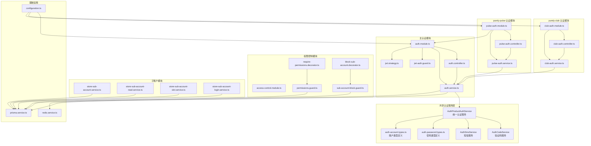

**图表来源**
- [auth.module.ts:27-72](file://src/purely-profit/auth/auth.module.ts#L27-L72)
- [auth-product-auth.service.ts:1-163](file://src/shared/auth/auth-product-auth.service.ts#L1-L163)
- [auth-code.service.ts:1-225](file://src/purely-profit/auth/auth-code.service.ts#L1-L225)
- [auth-sms.service.ts:1-55](file://src/purely-profit/auth/auth-sms.service.ts#L1-L55)
- [club-auth.module.ts:1-11](file://src/purely-club/auth/club-auth.module.ts#L1-L11)
- [pulse-auth.module.ts:1-11](file://src/purely-pulse/auth/pulse-auth.module.ts#L1-L11)

**章节来源**
- [auth.module.ts:27-72](file://src/purely-profit/auth/auth.module.ts#L27-L72)
- [auth-product-auth.service.ts:1-163](file://src/shared/auth/auth-product-auth.service.ts#L1-L163)
- [auth-code.service.ts:1-225](file://src/purely-profit/auth/auth-code.service.ts#L1-L225)
- [auth-sms.service.ts:1-55](file://src/purely-profit/auth/auth-sms.service.ts#L1-L55)
- [club-auth.module.ts:1-11](file://src/purely-club/auth/club-auth.module.ts#L1-L11)
- [pulse-auth.module.ts:1-11](file://src/purely-pulse/auth/pulse-auth.module.ts#L1-L11)
- [access-control.module.ts:1-200](file://src/purely-profit/access-control/access-control.module.ts#L1-L200)

## 核心组件
- **统一认证服务**：AuthProductAuthService 提供多产品范围的统一认证接口，支持验证码发送、用户注册、登录、密码管理等功能。
- **验证码服务**：AuthCodeService 负责验证码的生成、存储、验证和清理，支持注册、登录和密码重置场景。
- **短信服务**：AuthSmsService 处理短信验证码的发送，支持注册、登录和密码重置短信通知。
- **主认证控制器与服务**：负责登录、注册、密码操作、会话管理、能力查询等入口与业务逻辑。
- **purely-club 认证模块**：专为个人端用户设计的独立认证系统，支持独立的注册、登录、密码找回等功能。
- **purely-pulse 认证模块**：专为开发者设计的认证系统，现重构为轻量级实现，依赖主认证模块提供核心认证能力。
- **JWT 守卫与策略**：负责解析请求中的 JWT，校验签名与有效期，并注入当前用户上下文。
- **权限守卫与装饰器**：用于方法级权限校验与子账户访问阻断。
- **子账户服务**：提供子账户的读取、槽位管理与登录辅助能力。
- **基础设施**：Prisma 数据库访问、Redis 缓存、全局配置。

**章节来源**
- [auth-product-auth.service.ts:1-163](file://src/shared/auth/auth-product-auth.service.ts#L1-L163)
- [auth-code.service.ts:1-225](file://src/purely-profit/auth/auth-code.service.ts#L1-L225)
- [auth-sms.service.ts:1-55](file://src/purely-profit/auth/auth-sms.service.ts#L1-L55)
- [auth.controller.ts:1-200](file://src/purely-profit/auth/auth.controller.ts#L1-L200)
- [auth.service.ts:1-200](file://src/purely-profit/auth/auth.service.ts#L1-L200)
- [club-auth.controller.ts:1-109](file://src/purely-club/auth/club-auth.controller.ts#L1-L109)
- [pulse-auth.controller.ts:1-30](file://src/purely-pulse/auth/pulse-auth.controller.ts#L1-L30)
- [jwt-auth.guard.ts:1-200](file://src/purely-profit/auth/guards/jwt-auth.guard.ts#L1-L200)
- [jwt.strategy.ts:1-200](file://src/purely-profit/auth/strategies/jwt.strategy.ts#L1-L200)
- [permissions.guard.ts:1-200](file://src/purely-profit/access-control/guards/permissions.guard.ts#L1-L200)
- [require-permissions.decorator.ts:1-200](file://src/purely-profit/access-control/decorators/require-permissions.decorator.ts#L1-L200)
- [block-sub-account.decorator.ts:1-200](file://src/purely-profit/access-control/decorators/block-sub-account.decorator.ts#L1-L200)
- [sub-account-block.guard.ts:1-200](file://src/purely-profit/access-control/guards/sub-account-block.guard.ts#L1-L200)
- [store-sub-account.service.ts:1-200](file://src/purely-profit/member/platform-membership/store-sub-account.service.ts#L1-L200)
- [store-sub-account-read.service.ts:1-200](file://src/purely-profit/member/platform-membership/store-sub-account-read.service.ts#L1-L200)
- [store-sub-account-slot.service.ts:1-200](file://src/purely-profit/member/platform-membership/store-sub-account-slot.service.ts#L1-L200)
- [store-sub-account-login.service.ts:1-200](file://src/purely-profit/member/platform-membership/store-sub-account-login.service.ts#L1-L200)
- [prisma.service.ts:1-200](file://src/prisma/prisma.service.ts#L1-L200)
- [redis.service.ts:1-200](file://src/redis/redis.service.ts#L1-L200)

## 架构总览
认证授权系统采用"控制器-服务-守卫-策略-装饰器"的分层设计，结合数据库与缓存完成身份认证与权限控制。JWT 作为无状态凭证贯穿整个流程；权限控制通过守卫与装饰器在路由层进行拦截与判定；子账户登录由专门的服务与守卫协同处理，确保主账户与子账户的边界清晰。新增的 AuthProductAuthService 通过统一接口支持多产品范围认证，包括验证码管理、短信发送和密码操作等核心功能。purely-pulse 认证模块现已重构为轻量级实现，通过依赖注入的方式复用主认证模块的核心能力。

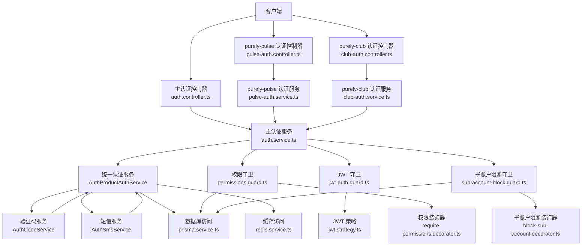

**图表来源**
- [auth.controller.ts:1-200](file://src/purely-profit/auth/auth.controller.ts#L1-L200)
- [club-auth.controller.ts:1-109](file://src/purely-club/auth/club-auth.controller.ts#L1-L109)
- [pulse-auth.controller.ts:1-30](file://src/purely-pulse/auth/pulse-auth.controller.ts#L1-L30)
- [auth.service.ts:1-200](file://src/purely-profit/auth/auth.service.ts#L1-L200)
- [auth-product-auth.service.ts:1-163](file://src/shared/auth/auth-product-auth.service.ts#L1-L163)
- [auth-code.service.ts:1-225](file://src/purely-profit/auth/auth-code.service.ts#L1-L225)
- [auth-sms.service.ts:1-55](file://src/purely-profit/auth/auth-sms.service.ts#L1-L55)
- [club-auth.service.ts:1-38](file://src/purely-club/auth/club-auth.service.ts#L1-L38)
- [pulse-auth.service.ts:1-13](file://src/purely-pulse/auth/pulse-auth.service.ts#L1-L13)
- [jwt-auth.guard.ts:1-200](file://src/purely-profit/auth/guards/jwt-auth.guard.ts#L1-L200)
- [jwt.strategy.ts:1-200](file://src/purely-profit/auth/strategies/jwt.strategy.ts#L1-L200)
- [permissions.guard.ts:1-200](file://src/purely-profit/access-control/guards/permissions.guard.ts#L1-L200)
- [require-permissions.decorator.ts:1-200](file://src/purely-profit/access-control/decorators/require-permissions.decorator.ts#L1-L200)
- [sub-account-block.guard.ts:1-200](file://src/purely-profit/access-control/guards/sub-account-block.guard.ts#L1-L200)
- [block-sub-account.decorator.ts:1-200](file://src/purely-profit/access-control/decorators/block-sub-account.decorator.ts#L1-L200)
- [prisma.service.ts:1-200](file://src/prisma/prisma.service.ts#L1-L200)
- [redis.service.ts:1-200](file://src/redis/redis.service.ts#L1-L200)

## 详细组件分析

### JWT 认证机制
- **登录与 Token 生成**
  - 控制器接收登录参数并调用认证服务，认证服务完成凭据校验后生成 JWT 并返回。
  - 生成策略参考：[auth.service.ts:1-200](file://src/purely-profit/auth/auth.service.ts#L1-L200)、[auth-authentication.service.ts:1-200](file://src/purely-profit/auth/auth-authentication.service.ts#L1-L200)、[auth.constants.ts:1-200](file://src/purely-profit/auth/auth.constants.ts#L1-L200)。
- **JWT 解析与验证**
  - 守卫在进入受保护路由前，通过策略解析请求头中的 Authorization 字段，验证签名与过期时间，解析出用户标识并注入上下文。
  - 参考：[jwt-auth.guard.ts:1-200](file://src/purely-profit/auth/guards/jwt-auth.guard.ts#L1-L200)、[jwt.strategy.ts:1-200](file://src/purely-profit/auth/strategies/jwt.strategy.ts#L1-L200)。
- **Token 生命周期与刷新**
  - Token 过期时间与刷新策略由常量与配置决定，建议配合短期有效 Token 与刷新接口实现安全轮换。
  - 参考：[auth.constants.ts:1-200](file://src/purely-profit/auth/auth.constants.ts#L1-L200)、[configuration.ts:1-200](file://src/config/configuration.ts#L1-L200)。

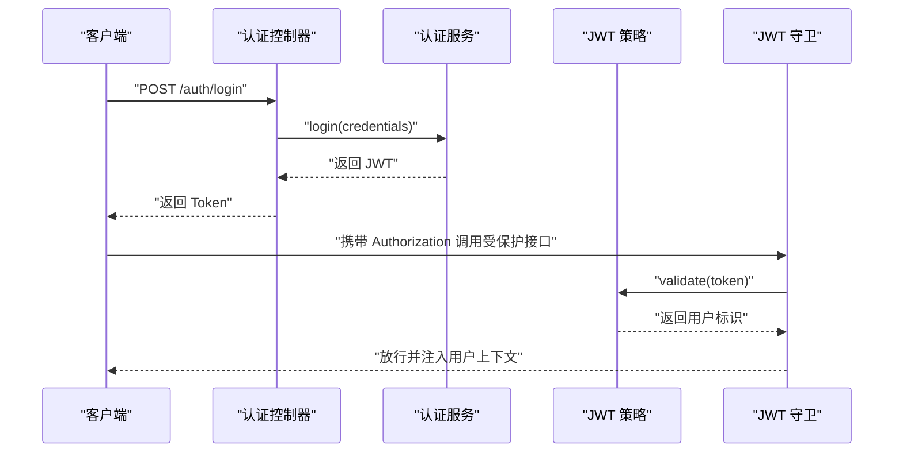

**图表来源**
- [auth.controller.ts:1-200](file://src/purely-profit/auth/auth.controller.ts#L1-L200)
- [auth.service.ts:1-200](file://src/purely-profit/auth/auth.service.ts#L1-L200)
- [jwt-auth.guard.ts:1-200](file://src/purely-profit/auth/guards/jwt-auth.guard.ts#L1-L200)
- [jwt.strategy.ts:1-200](file://src/purely-profit/auth/strategies/jwt.strategy.ts#L1-L200)

**章节来源**
- [auth.controller.ts:1-200](file://src/purely-profit/auth/auth.controller.ts#L1-L200)
- [auth.service.ts:1-200](file://src/purely-profit/auth/auth.service.ts#L1-L200)
- [jwt-auth.guard.ts:1-200](file://src/purely-profit/auth/guards/jwt-auth.guard.ts#L1-L200)
- [jwt.strategy.ts:1-200](file://src/purely-profit/auth/strategies/jwt.strategy.ts#L1-L200)
- [auth.constants.ts:1-200](file://src/purely-profit/auth/auth.constants.ts#L1-L200)
- [configuration.ts:1-200](file://src/config/configuration.ts#L1-L200)

### 权限控制模型与继承机制
- **方法级权限校验**
  - 使用权限装饰器标注控制器方法，守卫在执行前检查当前用户是否具备所需权限集合。
  - 参考：[require-permissions.decorator.ts:1-200](file://src/purely-profit/access-control/decorators/require-permissions.decorator.ts#L1-L200)、[permissions.guard.ts:1-200](file://src/purely-profit/access-control/guards/permissions.guard.ts#L1-L200)。
- **主题能力计算**
  - 通过主体能力服务聚合用户在不同作用域（如门店、平台）下的能力集合，形成可传递的权限继承链。
  - 参考：[subject-capability.service.ts:1-200](file://src/purely-profit/access-control/subject-capability.service.ts#L1-L200)。
- **权限持久化与查询**
  - 权限数据由认证与会员服务提供，权限守卫通过数据库或缓存进行快速判定。
  - 参考：[auth-capability.service.ts:1-200](file://src/purely-profit/auth/auth-capability.service.ts#L1-L200)、[prisma.service.ts:1-200](file://src/prisma/prisma.service.ts#L1-L200)。

**图表来源**
- [require-permissions.decorator.ts:1-200](file://src/purely-profit/access-control/decorators/require-permissions.decorator.ts#L1-L200)
- [permissions.guard.ts:1-200](file://src/purely-profit/access-control/guards/permissions.guard.ts#L1-L200)
- [subject-capability.service.ts:1-200](file://src/purely-profit/access-control/subject-capability.service.ts#L1-L200)

**章节来源**
- [require-permissions.decorator.ts:1-200](file://src/purely-profit/access-control/decorators/require-permissions.decorator.ts#L1-L200)
- [permissions.guard.ts:1-200](file://src/purely-profit/access-control/guards/permissions.guard.ts#L1-L200)
- [subject-capability.service.ts:1-200](file://src/purely-profit/access-control/subject-capability.service.ts#L1-L200)
- [auth-capability.service.ts:1-200](file://src/purely-profit/auth/auth-capability.service.ts#L1-L200)

### 子账户管理与安全策略
- **子账户登录流程**
  - 子账户登录由专用服务处理，确保仅允许在指定的登录场景与条件下生效。
  - 参考：[store-sub-account-login.service.ts:1-200](file://src/purely-profit/member/platform-membership/store-sub-account-login.service.ts#L1-L200)。
- **子账户读取与能力**
  - 提供只读能力查询与能力映射，避免子账户越权修改主账户资源。
  - 参考：[store-sub-account-read.service.ts:1-200](file://src/purely-profit/member/platform-membership/store-sub-account-read.service.ts#L1-L200)、[auth-capability.service.ts:1-200](file://src/purely-profit/auth/auth-capability.service.ts#L1-L200)。
- **槽位与配额管理**
  - 通过槽位服务限制子账户并发登录与使用配额，防止滥用。
  - 参考：[store-sub-account-slot.service.ts:1-200](file://src/purely-profit/member/platform-membership/store-sub-account-slot.service.ts#L1-L200)。
- **访问阻断**
  - 在需要禁止子账户访问的路由上使用阻断装饰器与守卫，强制主账户身份。
  - 参考：[block-sub-account.decorator.ts:1-200](file://src/purely-profit/access-control/decorators/block-sub-account.decorator.ts#L1-L200)、[sub-account-block.guard.ts:1-200](file://src/purely-profit/access-control/guards/sub-account-block.guard.ts#L1-L200)。

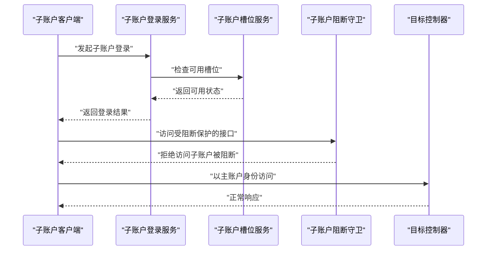

**图表来源**
- [store-sub-account-login.service.ts:1-200](file://src/purely-profit/member/platform-membership/store-sub-account-login.service.ts#L1-L200)
- [store-sub-account-slot.service.ts:1-200](file://src/purely-profit/member/platform-membership/store-sub-account-slot.service.ts#L1-L200)
- [sub-account-block.guard.ts:1-200](file://src/purely-profit/access-control/guards/sub-account-block.guard.ts#L1-L200)
- [block-sub-account.decorator.ts:1-200](file://src/purely-profit/access-control/decorators/block-sub-account.decorator.ts#L1-L200)

**章节来源**
- [store-sub-account-login.service.ts:1-200](file://src/purely-profit/member/platform-membership/store-sub-account-login.service.ts#L1-L200)
- [store-sub-account-read.service.ts:1-200](file://src/purely-profit/member/platform-membership/store-sub-account-read.service.ts#L1-L200)
- [store-sub-account-slot.service.ts:1-200](file://src/purely-profit/member/platform-membership/store-sub-account-slot.service.ts#L1-L200)
- [block-sub-account.decorator.ts:1-200](file://src/purely-profit/access-control/decorators/block-sub-account.decorator.ts#L1-L200)
- [sub-account-block.guard.ts:1-200](file://src/purely-profit/access-control/guards/sub-account-block.guard.ts#L1-L200)

### 认证流程与数据流
- **登录流程**
  - 客户端提交登录信息，控制器委派认证服务进行校验，成功后签发 JWT 返回给客户端。
  - 参考：[auth.controller.ts:1-200](file://src/purely-profit/auth/auth.controller.ts#L1-L200)、[auth.service.ts:1-200](file://src/purely-profit/auth/auth.service.ts#L1-L200)。
- **请求拦截与权限判定**
  - 守卫解析 JWT 并注入用户上下文，随后权限守卫根据装饰器声明的权限集合进行判定。
  - 参考：[jwt-auth.guard.ts:1-200](file://src/purely-profit/auth/guards/jwt-auth.guard.ts#L1-L200)、[permissions.guard.ts:1-200](file://src/purely-profit/access-control/guards/permissions.guard.ts#L1-L200)。
- **子账户访问控制**
  - 对于需要主账户独享的功能，使用阻断守卫与装饰器强制限制。
  - 参考：[sub-account-block.guard.ts:1-200](file://src/purely-profit/access-control/guards/sub-account-block.guard.ts#L1-L200)、[block-sub-account.decorator.ts:1-200](file://src/purely-profit/access-control/decorators/block-sub-account.decorator.ts#L1-L200)。

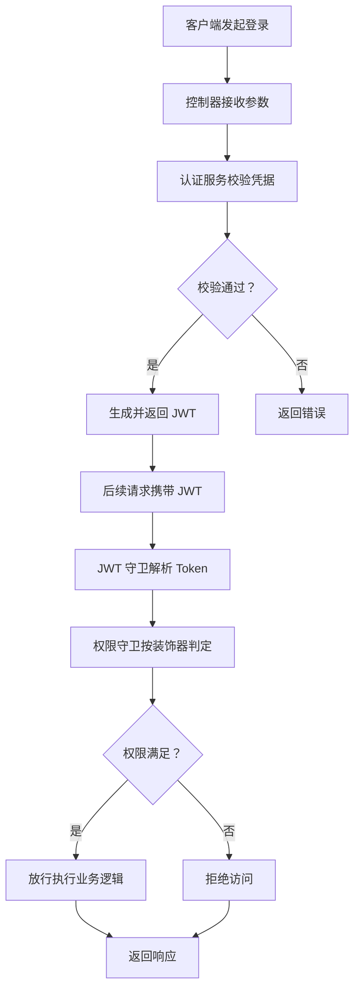

**图表来源**
- [auth.controller.ts:1-200](file://src/purely-profit/auth/auth.controller.ts#L1-L200)
- [auth.service.ts:1-200](file://src/purely-profit/auth/auth.service.ts#L1-L200)
- [jwt-auth.guard.ts:1-200](file://src/purely-profit/auth/guards/jwt-auth.guard.ts#L1-L200)
- [permissions.guard.ts:1-200](file://src/purely-profit/access-control/guards/permissions.guard.ts#L1-L200)

**章节来源**
- [auth.controller.ts:1-200](file://src/purely-profit/auth/auth.controller.ts#L1-L200)
- [auth.service.ts:1-200](file://src/purely-profit/auth/auth.service.ts#L1-L200)
- [jwt-auth.guard.ts:1-200](file://src/purely-profit/auth/guards/jwt-auth.guard.ts#L1-L200)
- [permissions.guard.ts:1-200](file://src/purely-profit/access-control/guards/permissions.guard.ts#L1-L200)

## 多产品范围认证

### 统一认证服务架构
**更新** 引入 AuthProductAuthService 作为统一认证服务，支持多产品范围认证，提供标准化的认证接口。

- **核心功能**
  - 支持多种认证范围：purely_profit（主认证）、purely_club（个人端）、developer（开发者）
  - 统一验证码管理：注册、登录、密码重置验证码的生成与验证
  - 标准化认证流程：登录、注册、密码管理的统一处理逻辑
  - 开发者模式支持：可选的开发者身份验证

- **认证范围定义**
  - purely_profit：主认证范围，适用于纯粹盈利系统
  - purely_club：个人端认证范围，适用于 club 业务线  
  - developer：开发者认证范围，适用于 pulse 开发环境

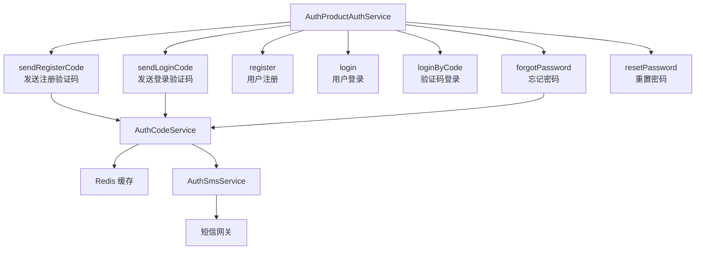

**图表来源**
- [auth-product-auth.service.ts:70-163](file://src/shared/auth/auth-product-auth.service.ts#L70-L163)
- [auth-code.service.ts:24-225](file://src/purely-profit/auth/auth-code.service.ts#L24-L225)
- [auth-sms.service.ts:21-55](file://src/purely-profit/auth/auth-sms.service.ts#L21-L55)

**章节来源**
- [auth-product-auth.service.ts:1-163](file://src/shared/auth/auth-product-auth.service.ts#L1-L163)
- [auth-account.types.ts:1-41](file://src/shared/auth/auth-account.types.ts#L1-L41)

### purely-club 认证系统
purely-club 是专为个人端用户设计的独立认证模块，提供完整的用户生命周期管理：

- **注册流程**
  - 发送注册验证码：`POST /club/auth/register/send-code`
  - 完成注册：`POST /club/auth/register`
  - 支持手机号注册，独立于主认证系统

- **登录流程**
  - 个人端登录：`POST /club/auth/login`
  - 仅接受 purely-club 个人端账号登录
  - 不兼容 purely-profit 或 purely-pulse 账号

- **密码管理**
  - 忘记密码：`POST /club/auth/forgot-password`
  - 重置密码：`POST /club/auth/reset-password`
  - 密码找回采用短信验证码机制

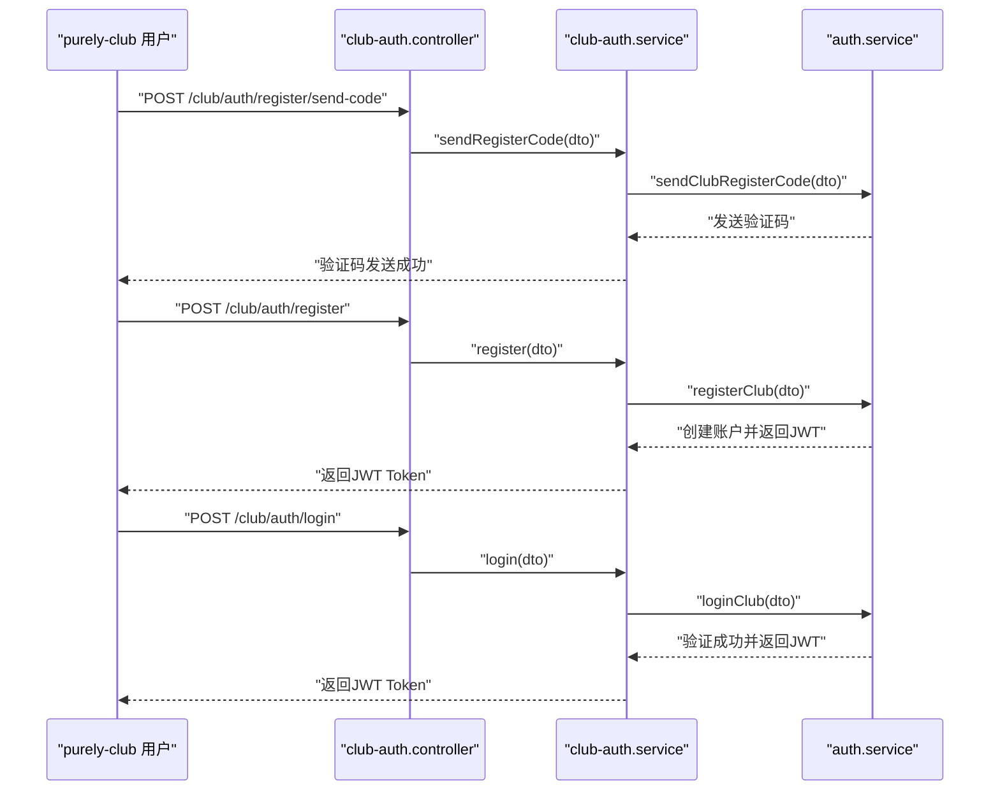

**图表来源**
- [club-auth.controller.ts:1-109](file://src/purely-club/auth/club-auth.controller.ts#L1-L109)
- [club-auth.service.ts:1-38](file://src/purely-club/auth/club-auth.service.ts#L1-L38)
- [auth.service.ts:45-69](file://src/purely-profit/auth/auth.service.ts#L45-L69)

**章节来源**
- [club-auth.controller.ts:1-109](file://src/purely-club/auth/club-auth.controller.ts#L1-L109)
- [club-auth.service.ts:1-38](file://src/purely-club/auth/club-auth.service.ts#L1-L38)
- [auth.service.ts:45-69](file://src/purely-profit/auth/auth.service.ts#L45-L69)

### purely-pulse 认证系统
**更新** purely-pulse 认证模块已重构为轻量级实现，通过依赖注入的方式复用主认证模块的核心能力。

- **模块重构**
  - 现在通过 `imports: [AuthModule]` 依赖主认证模块
  - 移除了原有的复杂认证逻辑，专注于开发者登录入口
  - 保持与主认证模块的紧密集成

- **开发者登录**
  - 专用登录接口：`POST /pulse/auth/login`
  - 仅接受开发者账号登录
  - 拒绝 purely-profit 注册账号、purely-club 注册账号以及其他非开发者账号

- **开发者白名单**
  - 通过配置文件管理开发者邮箱列表
  - 自动识别开发者身份并授予相应权限
  - 支持动态配置更新

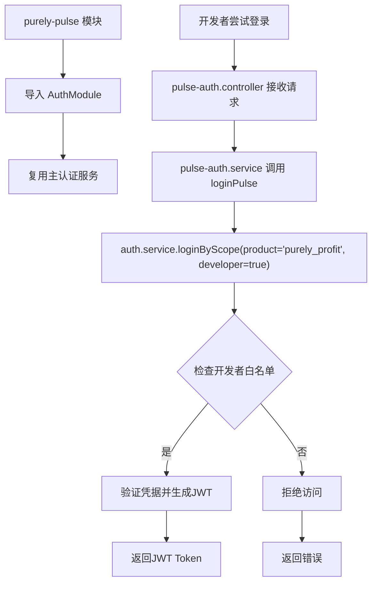

**图表来源**
- [pulse-auth.module.ts:6-10](file://src/purely-pulse/auth/pulse-auth.module.ts#L6-L10)
- [pulse-auth.controller.ts:1-30](file://src/purely-pulse/auth/pulse-auth.controller.ts#L1-L30)
- [pulse-auth.service.ts:1-13](file://src/purely-pulse/auth/pulse-auth.service.ts#L1-L13)
- [auth.service.ts:67-69](file://src/purely-profit/auth/auth.service.ts#L67-L69)

**章节来源**
- [pulse-auth.module.ts:1-11](file://src/purely-pulse/auth/pulse-auth.module.ts#L1-L11)
- [pulse-auth.controller.ts:1-30](file://src/purely-pulse/auth/pulse-auth.controller.ts#L1-L30)
- [pulse-auth.service.ts:1-13](file://src/purely-pulse/auth/pulse-auth.service.ts#L1-L13)
- [auth.service.ts:67-69](file://src/purely-profit/auth/auth.service.ts#L67-L69)

### 认证范围与账户隔离
系统支持三种认证范围，确保各产品线的账户完全隔离：

- **purely_profit**：主认证范围，适用于纯粹盈利系统
- **purely_club**：个人端认证范围，适用于 club 业务线
- **developer**：开发者认证范围，适用于 pulse 开发环境

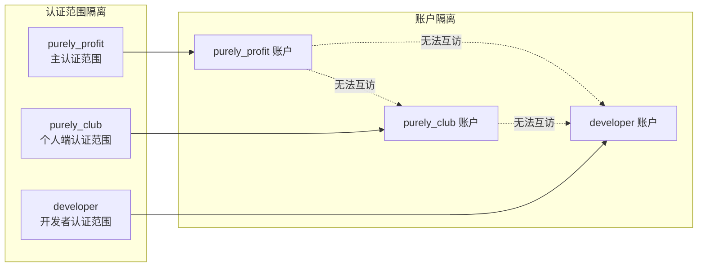

**图表来源**
- [auth-account.types.ts:1-20](file://src/shared/auth/auth-account.types.ts#L1-L20)
- [auth-authentication.service.ts:26-40](file://src/purely-profit/auth/auth-authentication.service.ts#L26-L40)

**章节来源**
- [auth-account.types.ts:1-20](file://src/shared/auth/auth-account.types.ts#L1-L20)
- [auth-authentication.service.ts:26-40](file://src/purely-profit/auth/auth-authentication.service.ts#L26-L40)

## 验证码与短信验证系统

### 验证码服务架构
**更新** 新增专门的验证码服务，提供统一的验证码生成、存储、验证和清理功能。

- **验证码类型**
  - 注册验证码：用于新用户注册时的身份验证
  - 登录验证码：用于现有用户的登录验证
  - 密码重置验证码：用于用户忘记密码时的身份验证

- **验证码生命周期**
  - 生成：随机数字验证码，长度可配置
  - 存储：使用 Redis 缓存，设置过期时间
  - 验证：比较用户输入与缓存中的验证码
  - 清理：验证成功后自动删除，过期后自动清理

- **短信发送机制**
  - 支持注册、登录、密码重置三种场景的短信通知
  - 生产环境隐藏真实验证码，便于测试环境调试
  - 发送失败时自动回滚缓存操作

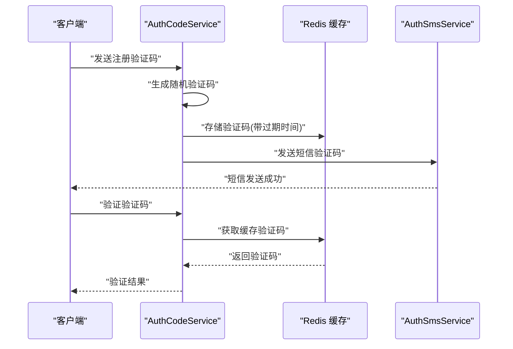

**图表来源**
- [auth-code.service.ts:33-79](file://src/purely-profit/auth/auth-code.service.ts#L33-L79)
- [auth-code.service.ts:81-122](file://src/purely-profit/auth/auth-code.service.ts#L81-L122)
- [auth-code.service.ts:144-185](file://src/purely-profit/auth/auth-code.service.ts#L144-L185)
- [auth-sms.service.ts:25-53](file://src/purely-profit/auth/auth-sms.service.ts#L25-L53)

**章节来源**
- [auth-code.service.ts:1-225](file://src/purely-profit/auth/auth-code.service.ts#L1-L225)
- [auth-sms.service.ts:1-55](file://src/purely-profit/auth/auth-sms.service.ts#L1-L55)

### 验证码配置与管理
- **过期时间配置**
  - 注册验证码默认过期时间：可配置，默认值在常量中定义
  - 密码重置验证码默认过期时间：可配置，默认值在常量中定义
  - 登录验证码复用注册验证码的过期时间

- **验证码生成规则**
  - 固定长度的数字验证码
  - 随机生成，确保安全性
  - 支持测试环境显示真实验证码便于调试

- **缓存键命名规范**
  - 注册验证码键格式：`auth:register:{productScope}:{phone}`
  - 密码重置验证码键格式：`auth:password-reset:{productScope}:{phone}`
  - 键值包含产品范围和手机号，确保多产品范围隔离

**章节来源**
- [auth-code.service.ts:207-225](file://src/purely-profit/auth/auth-code.service.ts#L207-L225)
- [auth.utils.ts:18-98](file://src/purely-profit/auth/auth.utils.ts#L18-L98)

## 依赖关系分析
- **组件耦合**
  - AuthProductAuthService 作为统一入口，依赖 AuthAuthenticationService 和 AuthCodeService
  - AuthCodeService 依赖 RedisService、AuthSmsService 和 AuthAccountLookupService
  - 各认证模块通过 AuthModule 共享基础认证服务
  - purely-club 和 purely-pulse 模块通过 AuthModule 复用主认证服务
  - 控制器依赖对应的服务层；服务层依赖认证核心服务
  - 认证服务依赖策略与守卫；权限守卫依赖装饰器与主体能力服务；子账户相关服务依赖数据库与守卫

- **模块依赖重构**
  - **更新** purely-pulse 模块现已通过 `imports: [AuthModule]` 依赖主认证模块
  - 简化了模块结构，减少了重复代码
  - 保持了功能完整性，同时提高了代码复用率

- **外部依赖**
  - 数据库：Prisma 提供 ORM 访问
  - 缓存：Redis 提供验证码和会话缓存
  - 短信服务：AuthSmsService 处理短信发送
  - 配置：全局配置集中管理认证与权限相关参数

- **循环依赖**
  - 通过 AuthModule 的集中管理，避免了循环依赖问题
  - purely-pulse 通过依赖注入方式使用主认证模块，无循环依赖

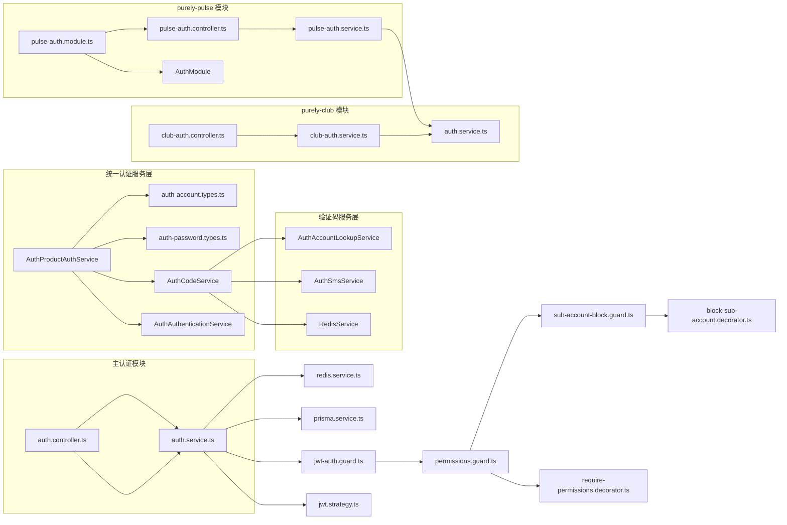

**图表来源**
- [auth-product-auth.service.ts:70-75](file://src/shared/auth/auth-product-auth.service.ts#L70-L75)
- [auth-code.service.ts:24-31](file://src/purely-profit/auth/auth-code.service.ts#L24-L31)
- [club-auth.controller.ts:1-109](file://src/purely-club/auth/club-auth.controller.ts#L1-L109)
- [club-auth.service.ts:1-38](file://src/purely-club/auth/club-auth.service.ts#L1-L38)
- [pulse-auth.module.ts:6-10](file://src/purely-pulse/auth/pulse-auth.module.ts#L6-L10)
- [pulse-auth.controller.ts:1-30](file://src/purely-pulse/auth/pulse-auth.controller.ts#L1-L30)
- [pulse-auth.service.ts:1-13](file://src/purely-pulse/auth/pulse-auth.service.ts#L1-L13)
- [auth.controller.ts:1-200](file://src/purely-profit/auth/auth.controller.ts#L1-L200)
- [auth.service.ts:1-200](file://src/purely-profit/auth/auth.service.ts#L1-L200)

**章节来源**
- [auth-product-auth.service.ts:1-163](file://src/shared/auth/auth-product-auth.service.ts#L1-L163)
- [auth-code.service.ts:1-225](file://src/purely-profit/auth/auth-code.service.ts#L1-L225)
- [club-auth.module.ts:1-11](file://src/purely-club/auth/club-auth.module.ts#L1-L11)
- [pulse-auth.module.ts:1-11](file://src/purely-pulse/auth/pulse-auth.module.ts#L1-L11)
- [auth.module.ts:27-72](file://src/purely-profit/auth/auth.module.ts#L27-L72)
- [auth.service.ts:1-200](file://src/purely-profit/auth/auth.service.ts#L1-L200)
- [jwt-auth.guard.ts:1-200](file://src/purely-profit/auth/guards/jwt-auth.guard.ts#L1-L200)
- [permissions.guard.ts:1-200](file://src/purely-profit/access-control/guards/permissions.guard.ts#L1-L200)
- [sub-account-block.guard.ts:1-200](file://src/purely-profit/access-control/guards/sub-account-block.guard.ts#L1-L200)
- [prisma.service.ts:1-200](file://src/prisma/prisma.service.ts#L1-L200)
- [redis.service.ts:1-200](file://src/redis/redis.service.ts#L1-L200)

## 性能考虑
- **验证码缓存优化**
  - 使用 Redis 缓存验证码，避免重复生成和发送
  - 设置合理的过期时间，平衡安全性和性能
  - 支持测试环境直接显示验证码，提高开发效率

- **短信服务降级**
  - 短信发送失败时自动回滚缓存操作，确保数据一致性
  - 提供日志记录，便于监控和故障排查
  - 支持异步发送，避免阻塞主线程

- **Token 缓存与降级**
  - 对频繁访问的用户能力进行缓存，降低数据库压力
  - 在缓存不可用时采用降级策略
  - 参考：[redis.service.ts:1-200](file://src/redis/redis.service.ts#L1-L200)、[auth-capability.service.ts:1-200](file://src/purely-profit/auth/auth-capability.service.ts#L1-L200)。

- **权限判定优化**
  - 将权限集合预计算并按作用域分组，减少运行时聚合成本
  - 参考：[subject-capability.service.ts:1-200](file://src/purely-profit/access-control/subject-capability.service.ts#L1-L200)。

- **子账户登录节流**
  - 通过槽位服务限制并发登录数量，避免资源争用
  - 参考：[store-sub-account-slot.service.ts:1-200](file://src/purely-profit/member/platform-membership/store-sub-account-slot.service.ts#L1-L200)。

- **模块依赖优化**
  - **更新** 通过 AuthModule 集中管理认证服务，减少模块间重复依赖
  - purely-pulse 模块通过依赖注入复用主认证能力，降低内存占用
  - 统一的模块结构提高了代码维护性和性能表现

- **多产品范围优化**
  - 各认证范围独立缓存，避免跨范围数据污染
  - 开发者白名单缓存，减少配置查询开销

## 故障排除指南
- **验证码相关问题**
  - 现象：验证码发送失败或无法接收
  - 排查：检查短信服务配置、网络连接、Redis 缓存状态
  - 参考：[auth-code.service.ts:55-64](file://src/purely-profit/auth/auth-code.service.ts#L55-L64)、[auth-sms.service.ts:25-53](file://src/purely-profit/auth/auth-sms.service.ts#L25-L53)

- **Token 无效或过期**
  - 现象：请求被拒，提示鉴权失败。
  - 排查：确认 Token 是否正确携带、是否在有效期内、签名算法与密钥是否一致。
  - 参考：[jwt.strategy.ts:1-200](file://src/purely-profit/auth/strategies/jwt.strategy.ts#L1-L200)、[auth.constants.ts:1-200](file://src/purely-profit/auth/auth.constants.ts#L1-L200)。

- **权限不足**
  - 现象：方法级权限校验失败。
  - 排查：核对装饰器声明的权限集合与用户实际能力，检查主体能力计算逻辑。
  - 参考：[require-permissions.decorator.ts:1-200](file://src/purely-profit/access-control/decorators/require-permissions.decorator.ts#L1-L200)、[permissions.guard.ts:1-200](file://src/purely-profit/access-control/guards/permissions.guard.ts#L1-L200)。

- **子账户被阻断**
  - 现象：子账户访问被拒绝。
  - 排查：确认目标接口是否使用了阻断装饰器或守卫，必要时切换为主账户登录。
  - 参考：[block-sub-account.decorator.ts:1-200](file://src/purely-profit/access-control/decorators/block-sub-account.decorator.ts#L1-L200)、[sub-account-block.guard.ts:1-200](file://src/purely-profit/access-control/guards/sub-account-block.guard.ts#L1-L200)。

- **数据不一致**
  - 现象：权限或能力与预期不符。
  - 排查：检查数据库与缓存一致性，必要时清理缓存并重算能力。
  - 参考：[prisma.service.ts:1-200](file://src/prisma/prisma.service.ts#L1-L200)、[redis.service.ts:1-200](file://src/redis/redis.service.ts#L1-L200)。

- **认证范围错误**
  - 现象：用户无法登录或被拒绝。
  - 排查：确认用户所属的认证范围，检查账户类型与登录接口匹配性。
  - 参考：[auth-account.types.ts:1-20](file://src/shared/auth/auth-account.types.ts#L1-L20)。

- **purely-club 账户问题**
  - 现象：purely-club 功能不可用。
  - 排查：确认账户是否为 purely-club 类型，检查验证码发送与登录流程。
  - 参考：[club-auth.controller.ts:1-109](file://src/purely-club/auth/club-auth.controller.ts#L1-L109)。

- **purely-pulse 开发者验证失败**
  - **更新** 现在通过 AuthModule 复用主认证能力
  - 现象：开发者登录被拒绝。
  - 排查：确认开发者邮箱是否在白名单中，检查配置文件设置，验证 AuthModule 依赖是否正确加载。
  - 参考：[pulse-auth.module.ts:6-10](file://src/purely-pulse/auth/pulse-auth.module.ts#L6-L10)、[auth-authentication.service.ts:26-40](file://src/purely-profit/auth/auth-authentication.service.ts#L26-L40)。

**章节来源**
- [auth-code.service.ts:1-225](file://src/purely-profit/auth/auth-code.service.ts#L1-L225)
- [auth-sms.service.ts:1-55](file://src/purely-profit/auth/auth-sms.service.ts#L1-L55)
- [jwt.strategy.ts:1-200](file://src/purely-profit/auth/strategies/jwt.strategy.ts#L1-L200)
- [auth.constants.ts:1-200](file://src/purely-profit/auth/auth.constants.ts#L1-L200)
- [require-permissions.decorator.ts:1-200](file://src/purely-profit/access-control/decorators/require-permissions.decorator.ts#L1-L200)
- [permissions.guard.ts:1-200](file://src/purely-profit/access-control/guards/permissions.guard.ts#L1-L200)
- [block-sub-account.decorator.ts:1-200](file://src/purely-profit/access-control/decorators/block-sub-account.decorator.ts#L1-L200)
- [sub-account-block.guard.ts:1-200](file://src/purely-profit/access-control/guards/sub-account-block.guard.ts#L1-L200)
- [prisma.service.ts:1-200](file://src/prisma/prisma.service.ts#L1-L200)
- [redis.service.ts:1-200](file://src/redis/redis.service.ts#L1-L200)
- [auth-account.types.ts:1-20](file://src/shared/auth/auth-account.types.ts#L1-L20)
- [club-auth.controller.ts:1-109](file://src/purely-club/auth/club-auth.controller.ts#L1-L109)
- [pulse-auth.module.ts:6-10](file://src/purely-pulse/auth/pulse-auth.module.ts#L6-L10)
- [auth-authentication.service.ts:26-40](file://src/purely-profit/auth/auth-authentication.service.ts#L26-L40)

## 结论
本认证授权系统以 JWT 为核心凭证，结合守卫与装饰器实现细粒度的权限控制，并通过主体能力服务构建可扩展的权限继承模型。新增的 AuthProductAuthService 通过统一接口支持多产品范围认证，包括验证码管理、短信发送和密码操作等核心功能，显著增强了系统的安全性和用户体验。purely-club 和 purely-pulse 认证模块通过独立的认证入口实现了产品范围的完全隔离，既保证了各业务线的独立性，又保持了统一的认证体验。

**更新** purely-pulse 认证模块已成功重构为轻量级实现，通过依赖注入的方式复用主认证模块的核心能力，简化了模块结构，提高了代码复用率和维护性。模块间的依赖关系更加清晰，减少了重复代码，同时保持了功能的完整性。

子账户体系通过登录服务、槽位服务与阻断守卫形成闭环，既保证灵活性又强化安全边界。配合数据库与缓存的合理使用，系统可在保证安全性的同时兼顾性能与可维护性。新的模块架构为未来的功能扩展和维护提供了更好的基础。

## 附录
- **关键常量与配置**
  - 认证相关常量与 Token 参数定义：[auth.constants.ts:1-200](file://src/purely-profit/auth/auth.constants.ts#L1-L200)
  - 权限控制常量与默认策略：[access-control.constants.ts:1-200](file://src/purely-profit/access-control/access-control.constants.ts#L1-L200)
  - 全局配置项：[configuration.ts:1-200](file://src/config/configuration.ts#L1-L200)

- **DTO 与类型**
  - 认证与权限相关 DTO：参见 auth 与 access-control 目录下的 DTO 文件
  - 认证范围类型定义：[auth-account.types.ts:1-41](file://src/shared/auth/auth-account.types.ts#L1-L41)
  - 密码操作类型定义：[auth-password.types.ts:1-63](file://src/shared/auth/auth-password.types.ts#L1-L63)

- **数据模型与关系**
  - 用户、角色、权限、子账户等实体关系由 Prisma Schema 定义，服务层通过 Prisma Service 进行访问
  - 参考：[prisma.service.ts:1-200](file://src/prisma/prisma.service.ts#L1-L200)

- **开发者配置**
  - 开发者白名单配置：在配置文件中设置 `pulse.devAccountEmails` 数组
  - 支持动态更新，无需重启服务即可生效
  - 验证码过期时间配置：`auth.registerCodeTtlSeconds` 和 `auth.passwordResetCodeTtlSeconds`
  - 支持自定义验证码长度和过期时间

- **验证码服务配置**
  - Redis 缓存键格式：`auth:register:{productScope}:{phone}` 和 `auth:password-reset:{productScope}:{phone}`
  - 默认验证码长度：6位数字
  - 测试环境特性：自动显示真实验证码便于调试

- **模块依赖配置**
  - **更新** purely-pulse 模块通过 `imports: [AuthModule]` 依赖主认证模块
  - AuthModule 集中管理所有认证相关服务和守卫
  - 确保模块间依赖关系清晰，避免循环依赖