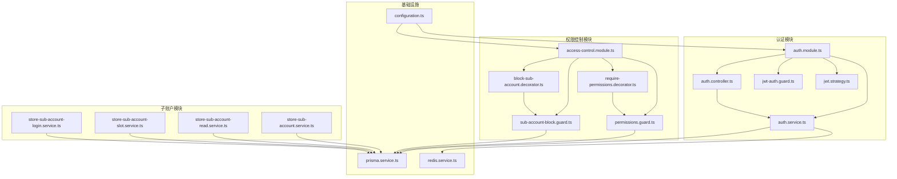
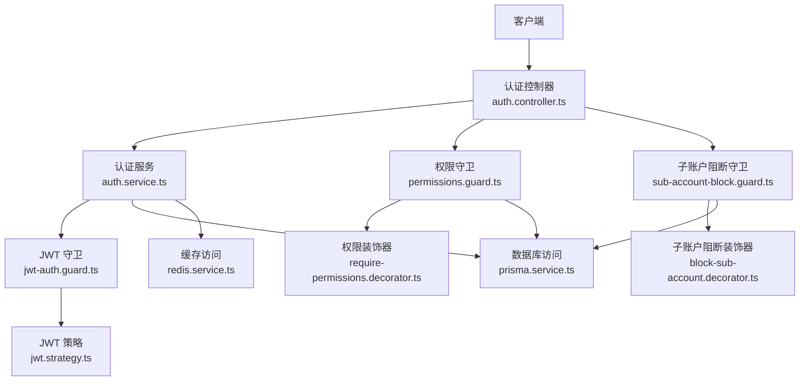
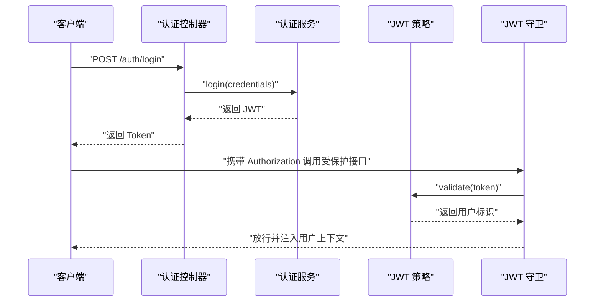
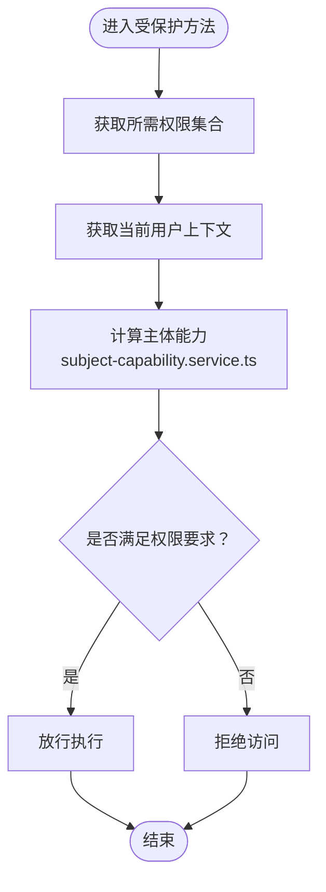
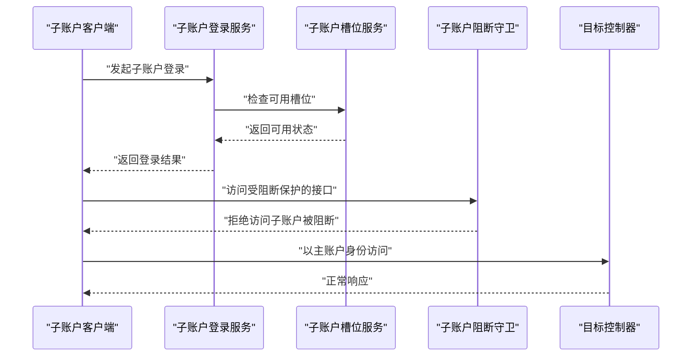
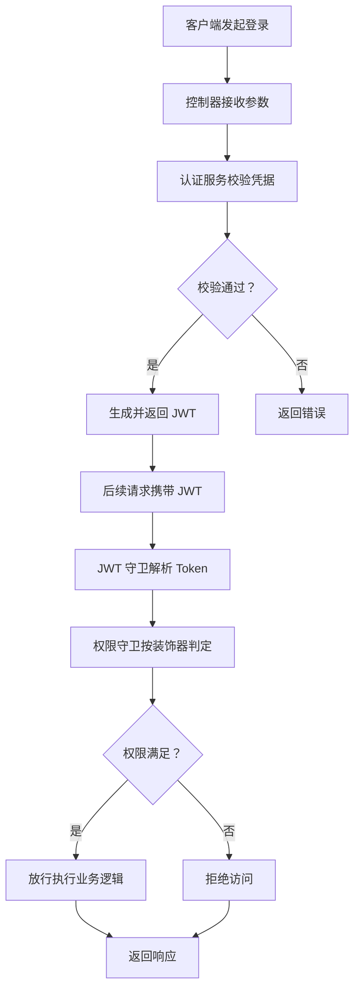
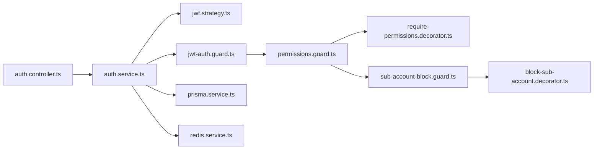

# 认证授权系统

<cite>
**本文引用的文件**
- [auth.module.ts](file://src/purely-profit/auth/auth.module.ts)
- [auth.controller.ts](file://src/purely-profit/auth/auth.controller.ts)
- [auth.service.ts](file://src/purely-profit/auth/auth.service.ts)
- [auth-authentication.service.ts](file://src/purely-profit/auth/auth-authentication.service.ts)
- [auth-capability.service.ts](file://src/purely-profit/auth/auth-capability.service.ts)
- [auth-account.service.ts](file://src/purely-profit/auth/auth-account.service.ts)
- [auth-account-lookup.service.ts](file://src/purely-profit/auth/auth-account-lookup.service.ts)
- [auth-account-membership.service.ts](file://src/purely-profit/auth/auth-account-membership.service.ts)
- [jwt-auth.guard.ts](file://src/purely-profit/auth/guards/jwt-auth.guard.ts)
- [jwt.strategy.ts](file://src/purely-profit/auth/strategies/jwt.strategy.ts)
- [access-control.module.ts](file://src/purely-profit/access-control/access-control.module.ts)
- [permissions.guard.ts](file://src/purely-profit/access-control/guards/permissions.guard.ts)
- [require-permissions.decorator.ts](file://src/purely-profit/access-control/decorators/require-permissions.decorator.ts)
- [block-sub-account.decorator.ts](file://src/purely-profit/access-control/decorators/block-sub-account.decorator.ts)
- [sub-account-block.guard.ts](file://src/purely-profit/access-control/guards/sub-account-block.guard.ts)
- [subject-capability.service.ts](file://src/purely-profit/access-control/subject-capability.service.ts)
- [store-sub-account.service.ts](file://src/purely-profit/member/platform-membership/store-sub-account.service.ts)
- [store-sub-account-read.service.ts](file://src/purely-profit/member/platform-membership/store-sub-account-read.service.ts)
- [store-sub-account-slot.service.ts](file://src/purely-profit/member/platform-membership/store-sub-account-slot.service.ts)
- [store-sub-account-login.service.ts](file://src/purely-profit/member/platform-membership/store-sub-account-login.service.ts)
- [auth.constants.ts](file://src/purely-profit/auth/auth.constants.ts)
- [access-control.constants.ts](file://src/purely-profit/access-control/access-control.constants.ts)
- [configuration.ts](file://src/config/configuration.ts)
- [prisma.service.ts](file://src/prisma/prisma.service.ts)
- [redis.service.ts](file://src/redis/redis.service.ts)
</cite>

## 目录
1. [简介](#简介)
2. [项目结构](#项目结构)
3. [核心组件](#核心组件)
4. [架构总览](#架构总览)
5. [详细组件分析](#详细组件分析)
6. [依赖关系分析](#依赖关系分析)
7. [性能考虑](#性能考虑)
8. [故障排除指南](#故障排除指南)
9. [结论](#结论)
10. [附录](#附录)

## 简介
本文件面向认证授权系统的使用者与维护者，系统性阐述基于 JWT 的认证机制、权限控制模型与子账户（Store Sub-Account）安全策略。文档从整体架构到关键组件逐层展开，覆盖认证流程、Token 生成与验证、权限继承与校验、子账户登录与限制等主题，并提供与数据库、Redis 缓存、装饰器与守卫等组件的集成说明，帮助初学者快速上手，同时为资深开发者提供足够的技术深度。

## 项目结构
认证授权相关的核心模块位于以下目录：
- 认证模块：src/purely-profit/auth
- 权限控制模块：src/purely-profit/access-control
- 子账户相关模块：src/purely-profit/member/platform-membership 下的多个服务
- 配置与基础设施：src/config、src/prisma、src/redis

下图展示认证授权系统在业务模块中的位置与职责划分：

图表来源
- [auth.module.ts:1-200](file://src/purely-profit/auth/auth.module.ts#L1-L200)
- [auth.controller.ts:1-200](file://src/purely-profit/auth/auth.controller.ts#L1-L200)
- [auth.service.ts:1-200](file://src/purely-profit/auth/auth.service.ts#L1-L200)
- [jwt-auth.guard.ts:1-200](file://src/purely-profit/auth/guards/jwt-auth.guard.ts#L1-L200)
- [jwt.strategy.ts:1-200](file://src/purely-profit/auth/strategies/jwt.strategy.ts#L1-L200)
- [access-control.module.ts:1-200](file://src/purely-profit/access-control/access-control.module.ts#L1-L200)
- [permissions.guard.ts:1-200](file://src/purely-profit/access-control/guards/permissions.guard.ts#L1-L200)
- [require-permissions.decorator.ts:1-200](file://src/purely-profit/access-control/decorators/require-permissions.decorator.ts#L1-L200)
- [block-sub-account.decorator.ts:1-200](file://src/purely-profit/access-control/decorators/block-sub-account.decorator.ts#L1-L200)
- [sub-account-block.guard.ts:1-200](file://src/purely-profit/access-control/guards/sub-account-block.guard.ts#L1-L200)
- [store-sub-account.service.ts:1-200](file://src/purely-profit/member/platform-membership/store-sub-account.service.ts#L1-L200)
- [store-sub-account-read.service.ts:1-200](file://src/purely-profit/member/platform-membership/store-sub-account-read.service.ts#L1-L200)
- [store-sub-account-slot.service.ts:1-200](file://src/purely-profit/member/platform-membership/store-sub-account-slot.service.ts#L1-L200)
- [store-sub-account-login.service.ts:1-200](file://src/purely-profit/member/platform-membership/store-sub-account-login.service.ts#L1-L200)
- [configuration.ts:1-200](file://src/config/configuration.ts#L1-L200)
- [prisma.service.ts:1-200](file://src/prisma/prisma.service.ts#L1-L200)
- [redis.service.ts:1-200](file://src/redis/redis.service.ts#L1-L200)

章节来源
- [auth.module.ts:1-200](file://src/purely-profit/auth/auth.module.ts#L1-L200)
- [access-control.module.ts:1-200](file://src/purely-profit/access-control/access-control.module.ts#L1-L200)

## 核心组件
- 认证控制器与服务：负责登录、注册、密码操作、会话管理、能力查询等入口与业务逻辑。
- JWT 守卫与策略：负责解析请求中的 JWT，校验签名与有效期，并注入当前用户上下文。
- 权限守卫与装饰器：用于方法级权限校验与子账户访问阻断。
- 子账户服务：提供子账户的读取、槽位管理与登录辅助能力。
- 基础设施：Prisma 数据库访问、Redis 缓存、全局配置。

章节来源
- [auth.controller.ts:1-200](file://src/purely-profit/auth/auth.controller.ts#L1-L200)
- [auth.service.ts:1-200](file://src/purely-profit/auth/auth.service.ts#L1-L200)
- [jwt-auth.guard.ts:1-200](file://src/purely-profit/auth/guards/jwt-auth.guard.ts#L1-L200)
- [jwt.strategy.ts:1-200](file://src/purely-profit/auth/strategies/jwt.strategy.ts#L1-L200)
- [permissions.guard.ts:1-200](file://src/purely-profit/access-control/guards/permissions.guard.ts#L1-L200)
- [require-permissions.decorator.ts:1-200](file://src/purely-profit/access-control/decorators/require-permissions.decorator.ts#L1-L200)
- [block-sub-account.decorator.ts:1-200](file://src/purely-profit/access-control/decorators/block-sub-account.decorator.ts#L1-L200)
- [sub-account-block.guard.ts:1-200](file://src/purely-profit/access-control/guards/sub-account-block.guard.ts#L1-L200)
- [store-sub-account.service.ts:1-200](file://src/purely-profit/member/platform-membership/store-sub-account.service.ts#L1-L200)
- [store-sub-account-read.service.ts:1-200](file://src/purely-profit/member/platform-membership/store-sub-account-read.service.ts#L1-L200)
- [store-sub-account-slot.service.ts:1-200](file://src/purely-profit/member/platform-membership/store-sub-account-slot.service.ts#L1-L200)
- [store-sub-account-login.service.ts:1-200](file://src/purely-profit/member/platform-membership/store-sub-account-login.service.ts#L1-L200)
- [prisma.service.ts:1-200](file://src/prisma/prisma.service.ts#L1-L200)
- [redis.service.ts:1-200](file://src/redis/redis.service.ts#L1-L200)

## 架构总览
认证授权系统采用“控制器-服务-守卫-策略-装饰器”的分层设计，结合数据库与缓存完成身份认证与权限控制。JWT 作为无状态凭证贯穿整个流程；权限控制通过守卫与装饰器在路由层进行拦截与判定；子账户登录由专门的服务与守卫协同处理，确保主账户与子账户的边界清晰。

图表来源
- [auth.controller.ts:1-200](file://src/purely-profit/auth/auth.controller.ts#L1-L200)
- [auth.service.ts:1-200](file://src/purely-profit/auth/auth.service.ts#L1-L200)
- [jwt-auth.guard.ts:1-200](file://src/purely-profit/auth/guards/jwt-auth.guard.ts#L1-L200)
- [jwt.strategy.ts:1-200](file://src/purely-profit/auth/strategies/jwt.strategy.ts#L1-L200)
- [permissions.guard.ts:1-200](file://src/purely-profit/access-control/guards/permissions.guard.ts#L1-L200)
- [require-permissions.decorator.ts:1-200](file://src/purely-profit/access-control/decorators/require-permissions.decorator.ts#L1-L200)
- [sub-account-block.guard.ts:1-200](file://src/purely-profit/access-control/guards/sub-account-block.guard.ts#L1-L200)
- [block-sub-account.decorator.ts:1-200](file://src/purely-profit/access-control/decorators/block-sub-account.decorator.ts#L1-L200)
- [prisma.service.ts:1-200](file://src/prisma/prisma.service.ts#L1-L200)
- [redis.service.ts:1-200](file://src/redis/redis.service.ts#L1-L200)

## 详细组件分析

### JWT 认证机制
- 登录与 Token 生成
  - 控制器接收登录参数并调用认证服务，认证服务完成凭据校验后生成 JWT 并返回。
  - 生成策略参考：[auth.service.ts:1-200](file://src/purely-profit/auth/auth.service.ts#L1-L200)、[auth-authentication.service.ts:1-200](file://src/purely-profit/auth/auth-authentication.service.ts#L1-L200)、[auth.constants.ts:1-200](file://src/purely-profit/auth/auth.constants.ts#L1-L200)。
- JWT 解析与验证
  - 守卫在进入受保护路由前，通过策略解析请求头中的 Authorization 字段，验证签名与过期时间，解析出用户标识并注入上下文。
  - 参考：[jwt-auth.guard.ts:1-200](file://src/purely-profit/auth/guards/jwt-auth.guard.ts#L1-L200)、[jwt.strategy.ts:1-200](file://src/purely-profit/auth/strategies/jwt.strategy.ts#L1-L200)。
- Token 生命周期与刷新
  - Token 过期时间与刷新策略由常量与配置决定，建议配合短期有效 Token 与刷新接口实现安全轮换。
  - 参考：[auth.constants.ts:1-200](file://src/purely-profit/auth/auth.constants.ts#L1-L200)、[configuration.ts:1-200](file://src/config/configuration.ts#L1-L200)。

图表来源
- [auth.controller.ts:1-200](file://src/purely-profit/auth/auth.controller.ts#L1-L200)
- [auth.service.ts:1-200](file://src/purely-profit/auth/auth.service.ts#L1-L200)
- [jwt-auth.guard.ts:1-200](file://src/purely-profit/auth/guards/jwt-auth.guard.ts#L1-L200)
- [jwt.strategy.ts:1-200](file://src/purely-profit/auth/strategies/jwt.strategy.ts#L1-L200)

章节来源
- [auth.controller.ts:1-200](file://src/purely-profit/auth/auth.controller.ts#L1-L200)
- [auth.service.ts:1-200](file://src/purely-profit/auth/auth.service.ts#L1-L200)
- [jwt-auth.guard.ts:1-200](file://src/purely-profit/auth/guards/jwt-auth.guard.ts#L1-L200)
- [jwt.strategy.ts:1-200](file://src/purely-profit/auth/strategies/jwt.strategy.ts#L1-L200)
- [auth.constants.ts:1-200](file://src/purely-profit/auth/auth.constants.ts#L1-L200)
- [configuration.ts:1-200](file://src/config/configuration.ts#L1-L200)

### 权限控制模型与继承机制
- 方法级权限校验
  - 使用权限装饰器标注控制器方法，守卫在执行前检查当前用户是否具备所需权限集合。
  - 参考：[require-permissions.decorator.ts:1-200](file://src/purely-profit/access-control/decorators/require-permissions.decorator.ts#L1-L200)、[permissions.guard.ts:1-200](file://src/purely-profit/access-control/guards/permissions.guard.ts#L1-L200)。
- 主题能力计算
  - 通过主体能力服务聚合用户在不同作用域（如门店、平台）下的能力集合，形成可传递的权限继承链。
  - 参考：[subject-capability.service.ts:1-200](file://src/purely-profit/access-control/subject-capability.service.ts#L1-L200)。
- 权限持久化与查询
  - 权限数据由认证与会员服务提供，权限守卫通过数据库或缓存进行快速判定。
  - 参考：[auth-capability.service.ts:1-200](file://src/purely-profit/auth/auth-capability.service.ts#L1-L200)、[prisma.service.ts:1-200](file://src/prisma/prisma.service.ts#L1-L200)。

图表来源
- [require-permissions.decorator.ts:1-200](file://src/purely-profit/access-control/decorators/require-permissions.decorator.ts#L1-L200)
- [permissions.guard.ts:1-200](file://src/purely-profit/access-control/guards/permissions.guard.ts#L1-L200)
- [subject-capability.service.ts:1-200](file://src/purely-profit/access-control/subject-capability.service.ts#L1-L200)

章节来源
- [require-permissions.decorator.ts:1-200](file://src/purely-profit/access-control/decorators/require-permissions.decorator.ts#L1-L200)
- [permissions.guard.ts:1-200](file://src/purely-profit/access-control/guards/permissions.guard.ts#L1-L200)
- [subject-capability.service.ts:1-200](file://src/purely-profit/access-control/subject-capability.service.ts#L1-L200)
- [auth-capability.service.ts:1-200](file://src/purely-profit/auth/auth-capability.service.ts#L1-L200)

### 子账户管理与安全策略
- 子账户登录流程
  - 子账户登录由专用服务处理，确保仅允许在指定的登录场景与条件下生效。
  - 参考：[store-sub-account-login.service.ts:1-200](file://src/purely-profit/member/platform-membership/store-sub-account-login.service.ts#L1-L200)。
- 子账户读取与能力
  - 提供只读能力查询与能力映射，避免子账户越权修改主账户资源。
  - 参考：[store-sub-account-read.service.ts:1-200](file://src/purely-profit/member/platform-membership/store-sub-account-read.service.ts#L1-L200)、[auth-capability.service.ts:1-200](file://src/purely-profit/auth/auth-capability.service.ts#L1-L200)。
- 槽位与配额管理
  - 通过槽位服务限制子账户并发登录与使用配额，防止滥用。
  - 参考：[store-sub-account-slot.service.ts:1-200](file://src/purely-profit/member/platform-membership/store-sub-account-slot.service.ts#L1-L200)。
- 访问阻断
  - 在需要禁止子账户访问的路由上使用阻断装饰器与守卫，强制主账户身份。
  - 参考：[block-sub-account.decorator.ts:1-200](file://src/purely-profit/access-control/decorators/block-sub-account.decorator.ts#L1-L200)、[sub-account-block.guard.ts:1-200](file://src/purely-profit/access-control/guards/sub-account-block.guard.ts#L1-L200)。

图表来源
- [store-sub-account-login.service.ts:1-200](file://src/purely-profit/member/platform-membership/store-sub-account-login.service.ts#L1-L200)
- [store-sub-account-slot.service.ts:1-200](file://src/purely-profit/member/platform-membership/store-sub-account-slot.service.ts#L1-L200)
- [sub-account-block.guard.ts:1-200](file://src/purely-profit/access-control/guards/sub-account-block.guard.ts#L1-L200)
- [block-sub-account.decorator.ts:1-200](file://src/purely-profit/access-control/decorators/block-sub-account.decorator.ts#L1-L200)

章节来源
- [store-sub-account-login.service.ts:1-200](file://src/purely-profit/member/platform-membership/store-sub-account-login.service.ts#L1-L200)
- [store-sub-account-read.service.ts:1-200](file://src/purely-profit/member/platform-membership/store-sub-account-read.service.ts#L1-L200)
- [store-sub-account-slot.service.ts:1-200](file://src/purely-profit/member/platform-membership/store-sub-account-slot.service.ts#L1-L200)
- [block-sub-account.decorator.ts:1-200](file://src/purely-profit/access-control/decorators/block-sub-account.decorator.ts#L1-L200)
- [sub-account-block.guard.ts:1-200](file://src/purely-profit/access-control/guards/sub-account-block.guard.ts#L1-L200)

### 认证流程与数据流
- 登录流程
  - 客户端提交登录信息，控制器委派认证服务进行校验，成功后签发 JWT 返回给客户端。
  - 参考：[auth.controller.ts:1-200](file://src/purely-profit/auth/auth.controller.ts#L1-L200)、[auth.service.ts:1-200](file://src/purely-profit/auth/auth.service.ts#L1-L200)。
- 请求拦截与权限判定
  - 守卫解析 JWT 并注入用户上下文，随后权限守卫根据装饰器声明的权限集合进行判定。
  - 参考：[jwt-auth.guard.ts:1-200](file://src/purely-profit/auth/guards/jwt-auth.guard.ts#L1-L200)、[permissions.guard.ts:1-200](file://src/purely-profit/access-control/guards/permissions.guard.ts#L1-L200)。
- 子账户访问控制
  - 对于需要主账户独享的功能，使用阻断守卫与装饰器强制限制。
  - 参考：[sub-account-block.guard.ts:1-200](file://src/purely-profit/access-control/guards/sub-account-block.guard.ts#L1-L200)、[block-sub-account.decorator.ts:1-200](file://src/purely-profit/access-control/decorators/block-sub-account.decorator.ts#L1-L200)。

图表来源
- [auth.controller.ts:1-200](file://src/purely-profit/auth/auth.controller.ts#L1-L200)
- [auth.service.ts:1-200](file://src/purely-profit/auth/auth.service.ts#L1-L200)
- [jwt-auth.guard.ts:1-200](file://src/purely-profit/auth/guards/jwt-auth.guard.ts#L1-L200)
- [permissions.guard.ts:1-200](file://src/purely-profit/access-control/guards/permissions.guard.ts#L1-L200)

章节来源
- [auth.controller.ts:1-200](file://src/purely-profit/auth/auth.controller.ts#L1-L200)
- [auth.service.ts:1-200](file://src/purely-profit/auth/auth.service.ts#L1-L200)
- [jwt-auth.guard.ts:1-200](file://src/purely-profit/auth/guards/jwt-auth.guard.ts#L1-L200)
- [permissions.guard.ts:1-200](file://src/purely-profit/access-control/guards/permissions.guard.ts#L1-L200)

## 依赖关系分析
- 组件耦合
  - 控制器依赖认证服务；认证服务依赖策略与守卫；权限守卫依赖装饰器与主体能力服务；子账户相关服务依赖数据库与守卫。
- 外部依赖
  - 数据库：Prisma 提供 ORM 访问。
  - 缓存：Redis 提供会话与能力缓存。
  - 配置：全局配置集中管理认证与权限相关参数。
- 循环依赖
  - 当前结构通过服务与守卫解耦，未见明显循环依赖迹象。

图表来源
- [auth.controller.ts:1-200](file://src/purely-profit/auth/auth.controller.ts#L1-L200)
- [auth.service.ts:1-200](file://src/purely-profit/auth/auth.service.ts#L1-L200)
- [jwt.strategy.ts:1-200](file://src/purely-profit/auth/strategies/jwt.strategy.ts#L1-L200)
- [jwt-auth.guard.ts:1-200](file://src/purely-profit/auth/guards/jwt-auth.guard.ts#L1-L200)
- [permissions.guard.ts:1-200](file://src/purely-profit/access-control/guards/permissions.guard.ts#L1-L200)
- [require-permissions.decorator.ts:1-200](file://src/purely-profit/access-control/decorators/require-permissions.decorator.ts#L1-L200)
- [sub-account-block.guard.ts:1-200](file://src/purely-profit/access-control/guards/sub-account-block.guard.ts#L1-L200)
- [block-sub-account.decorator.ts:1-200](file://src/purely-profit/access-control/decorators/block-sub-account.decorator.ts#L1-L200)
- [prisma.service.ts:1-200](file://src/prisma/prisma.service.ts#L1-L200)
- [redis.service.ts:1-200](file://src/redis/redis.service.ts#L1-L200)

章节来源
- [auth.controller.ts:1-200](file://src/purely-profit/auth/auth.controller.ts#L1-L200)
- [auth.service.ts:1-200](file://src/purely-profit/auth/auth.service.ts#L1-L200)
- [jwt-auth.guard.ts:1-200](file://src/purely-profit/auth/guards/jwt-auth.guard.ts#L1-L200)
- [permissions.guard.ts:1-200](file://src/purely-profit/access-control/guards/permissions.guard.ts#L1-L200)
- [sub-account-block.guard.ts:1-200](file://src/purely-profit/access-control/guards/sub-account-block.guard.ts#L1-L200)
- [prisma.service.ts:1-200](file://src/prisma/prisma.service.ts#L1-L200)
- [redis.service.ts:1-200](file://src/redis/redis.service.ts#L1-L200)

## 性能考虑
- Token 缓存与降级
  - 对频繁访问的用户能力进行缓存，降低数据库压力；在缓存不可用时采用降级策略。
  - 参考：[redis.service.ts:1-200](file://src/redis/redis.service.ts#L1-L200)、[auth-capability.service.ts:1-200](file://src/purely-profit/auth/auth-capability.service.ts#L1-L200)。
- 权限判定优化
  - 将权限集合预计算并按作用域分组，减少运行时聚合成本。
  - 参考：[subject-capability.service.ts:1-200](file://src/purely-profit/access-control/subject-capability.service.ts#L1-L200)。
- 子账户登录节流
  - 通过槽位服务限制并发登录数量，避免资源争用。
  - 参考：[store-sub-account-slot.service.ts:1-200](file://src/purely-profit/member/platform-membership/store-sub-account-slot.service.ts#L1-L200)。

## 故障排除指南
- Token 无效或过期
  - 现象：请求被拒，提示鉴权失败。
  - 排查：确认 Token 是否正确携带、是否在有效期内、签名算法与密钥是否一致。
  - 参考：[jwt.strategy.ts:1-200](file://src/purely-profit/auth/strategies/jwt.strategy.ts#L1-L200)、[auth.constants.ts:1-200](file://src/purely-profit/auth/auth.constants.ts#L1-L200)。
- 权限不足
  - 现象：方法级权限校验失败。
  - 排查：核对装饰器声明的权限集合与用户实际能力，检查主体能力计算逻辑。
  - 参考：[require-permissions.decorator.ts:1-200](file://src/purely-profit/access-control/decorators/require-permissions.decorator.ts#L1-L200)、[permissions.guard.ts:1-200](file://src/purely-profit/access-control/guards/permissions.guard.ts#L1-L200)。
- 子账户被阻断
  - 现象：子账户访问被拒绝。
  - 排查：确认目标接口是否使用了阻断装饰器或守卫，必要时切换为主账户登录。
  - 参考：[block-sub-account.decorator.ts:1-200](file://src/purely-profit/access-control/decorators/block-sub-account.decorator.ts#L1-L200)、[sub-account-block.guard.ts:1-200](file://src/purely-profit/access-control/guards/sub-account-block.guard.ts#L1-L200)。
- 数据不一致
  - 现象：权限或能力与预期不符。
  - 排查：检查数据库与缓存一致性，必要时清理缓存并重算能力。
  - 参考：[prisma.service.ts:1-200](file://src/prisma/prisma.service.ts#L1-L200)、[redis.service.ts:1-200](file://src/redis/redis.service.ts#L1-L200)。

章节来源
- [jwt.strategy.ts:1-200](file://src/purely-profit/auth/strategies/jwt.strategy.ts#L1-L200)
- [auth.constants.ts:1-200](file://src/purely-profit/auth/auth.constants.ts#L1-L200)
- [require-permissions.decorator.ts:1-200](file://src/purely-profit/access-control/decorators/require-permissions.decorator.ts#L1-L200)
- [permissions.guard.ts:1-200](file://src/purely-profit/access-control/guards/permissions.guard.ts#L1-L200)
- [block-sub-account.decorator.ts:1-200](file://src/purely-profit/access-control/decorators/block-sub-account.decorator.ts#L1-L200)
- [sub-account-block.guard.ts:1-200](file://src/purely-profit/access-control/guards/sub-account-block.guard.ts#L1-L200)
- [prisma.service.ts:1-200](file://src/prisma/prisma.service.ts#L1-L200)
- [redis.service.ts:1-200](file://src/redis/redis.service.ts#L1-L200)

## 结论
本认证授权系统以 JWT 为核心凭证，结合守卫与装饰器实现细粒度的权限控制，并通过主体能力服务构建可扩展的权限继承模型。子账户体系通过登录服务、槽位服务与阻断守卫形成闭环，既保证灵活性又强化安全边界。配合数据库与缓存的合理使用，系统可在保证安全性的同时兼顾性能与可维护性。

## 附录
- 关键常量与配置
  - 认证相关常量与 Token 参数定义：[auth.constants.ts:1-200](file://src/purely-profit/auth/auth.constants.ts#L1-L200)
  - 权限控制常量与默认策略：[access-control.constants.ts:1-200](file://src/purely-profit/access-control/access-control.constants.ts#L1-L200)
  - 全局配置项：[configuration.ts:1-200](file://src/config/configuration.ts#L1-L200)
- DTO 与类型
  - 认证与权限相关 DTO：参见 auth 与 access-control 目录下的 DTO 文件。
- 数据模型与关系
  - 用户、角色、权限、子账户等实体关系由 Prisma Schema 定义，服务层通过 Prisma Service 进行访问。
  - 参考：[prisma.service.ts:1-200](file://src/prisma/prisma.service.ts#L1-L200)