# 认证授权系统

<cite>
**本文档引用的文件**
- [auth.module.ts](file://src/purely-profit/auth/auth.module.ts)
- [auth.controller.ts](file://src/purely-profit/auth/auth.controller.ts)
- [auth.service.ts](file://src/purely-profit/auth/auth.service.ts)
- [auth-authentication.service.ts](file://src/purely-profit/auth/auth-authentication.service.ts)
- [auth-capability.service.ts](file://src/purely-profit/auth/auth-capability.service.ts)
- [auth-account.service.ts](file://src/purely-profit/auth/auth-account.service.ts)
- [auth-account-lookup.service.ts](file://src/purely-profit/auth/auth-account-lookup.service.ts)
- [auth-ban-guard.service.ts](file://src/purely-profit/auth/auth-ban-guard.service.ts)
- [auth-membership-resolver.service.ts](file://src/purely-profit/auth/auth-membership-resolver.service.ts)
- [auth-staff-activation.service.ts](file://src/purely-profit/auth/auth-staff-activation.service.ts)
- [auth-code-login.service.ts](file://src/purely-profit/auth/auth-code-login.service.ts)
- [auth-code-verify.service.ts](file://src/purely-profit/auth/auth-code-verify.service.ts)
- [auth-login-fail-guard.service.ts](file://src/purely-profit/auth/auth-login-fail-guard.service.ts)
- [auth-password-ops.service.ts](file://src/purely-profit/auth/auth-password-ops.service.ts)
- [auth-profit-account-lookup.service.ts](file://src/purely-profit/auth/auth-profit-account-lookup.service.ts)
- [auth-wechat-login.service.ts](file://src/purely-profit/auth/auth-wechat-login.service.ts)
- [auth-promo-record.service.ts](file://src/purely-profit/auth/auth-promo-record.service.ts)
- [auth-product-auth.service.ts](file://src/shared/auth/auth-product-auth.service.ts)
- [auth-code.service.ts](file://src/purely-profit/auth/auth-code.service.ts)
- [auth-sms.service.ts](file://src/purely-profit/auth/auth-sms.service.ts)
- [auth-password.types.ts](file://src/shared/auth/auth-password.types.ts)
- [auth-account.types.ts](file://src/shared/auth/auth-account.types.ts)
- [jwt-auth.guard.ts](file://src/purely-profit/auth/guards/jwt-auth.guard.ts)
- [jwt.strategy.ts](file://src/purely-profit/auth/strategies/jwt.strategy.ts)
- [access-control.module.ts](file://src/purely-profit/access-control/access-control.module.ts)
- [permissions.guard.ts](file://src/purely-profit/access-control/guards/permissions.guard.ts)
- [require-permissions.decorator.ts](file://src/purely-profit/access-control/decorators/require-permissions.decorator.ts)
- [block-sub-account.decorator.ts](file://src/purely-profit/access-control/decorators/block-sub-account.decorator.ts)
- [sub-account-block.guard.ts](file://src/purely-profit/access-control/guards/sub-account-block.guard.ts)
- [subject-capability.service.ts](file://src/purely-profit/access-control/subject-capability.service.ts)
- [store-sub-account.service.ts](file://src/purely-profit/member/platform-membership/store-sub-account.service.ts)
- [store-sub-account-read.service.ts](file://src/purely-profit/member/platform-membership/store-sub-account-read.service.ts)
- [store-sub-account-slot.service.ts](file://src/purely-profit/member/platform-membership/store-sub-account-slot.service.ts)
- [store-sub-account-login.service.ts](file://src/purely-profit/member/platform-membership/store-sub-account-login.service.ts)
- [auth.constants.ts](file://src/purely-profit/auth/auth.constants.ts)
- [access-control.constants.ts](file://src/purely-profit/access-control/access-control.constants.ts)
- [configuration.ts](file://src/config/configuration.ts)
- [prisma.service.ts](file://src/prisma/prisma.service.ts)
- [redis.service.ts](file://src/redis/redis.service.ts)
- [club-auth.controller.ts](file://src/purely-club/auth/club-auth.controller.ts)
- [club-auth.service.ts](file://src/purely-club/auth/club-auth.service.ts)
- [club-auth.module.ts](file://src/purely-club/auth/club-auth.module.ts)
- [pulse-auth.controller.ts](file://src/purely-pulse/auth/pulse-auth.controller.ts)
- [pulse-auth.service.ts](file://src/purely-pulse/auth/pulse-auth.service.ts)
- [pulse-auth.module.ts](file://src/purely-pulse/auth/pulse-auth.module.ts)
- [auth.utils.ts](file://src/purely-profit/auth/auth.utils.ts)
- [update-nickname.dto.ts](file://src/purely-profit/auth/dto/update-nickname.dto.ts)
- [auth-register-store.service.ts](file://src/purely-profit/auth/auth-register-store.service.ts)
- [auth-profile.service.ts](file://src/purely-profit/auth/auth-profile.service.ts)
- [store-response.dto.ts](file://src/purely-profit/stores/dto/store-response.dto.ts)
- [send-register-code-response.dto.ts](file://src/purely-profit/auth/dto/send-register-code-response.dto.ts)
- [send-login-code-response.dto.ts](file://src/purely-profit/auth/dto/send-login-code-response.dto.ts)
- [forgot-password-response.dto.ts](file://src/purely-profit/auth/dto/forgot-password-response.dto.ts)
</cite>

## 更新摘要
**所做更改**
- **新增代码验证服务**：引入 AuthCodeVerifyService 专门处理验证码的验证逻辑，提升验证码验证的安全性和可维护性
- **改进JWT认证守卫**：增强JWT策略的错误处理和用户身份验证流程，集成跨租户访问防护检查
- **强化登录失败保护**：通过 AuthLoginFailGuardService 实现基于Redis的登录失败计数和账号临时锁定机制
- **安全功能增强**：实现了更完善的并发冲突处理和跨租户数据污染防护

## 目录
1. [简介](#简介)
2. [项目结构](#项目结构)
3. [核心组件](#核心组件)
4. [架构总览](#架构总览)
5. [详细组件分析](#详细组件分析)
6. [多产品范围认证](#多产品范围认证)
7. [验证码与短信验证系统](#验证码与短信验证系统)
8. [SMS冷却与速率限制](#sms冷却不速率限制)
9. [昵称更新与注册闭环](#昵称更新与注册闭环)
10. [依赖关系分析](#依赖关系分析)
11. [性能考虑](#性能考虑)
12. [故障排除指南](#故障排除指南)
13. [结论](#结论)
14. [附录](#附录)

## 简介
本文件面向认证授权系统的使用者与维护者，系统性阐述基于 JWT 的认证机制、权限控制模型与子账户（Store Sub-Account）安全策略。文档从整体架构到关键组件逐层展开，覆盖认证流程、Token 生成与验证、权限继承与校验、子账户登录与限制等主题，并提供与数据库、Redis 缓存、装饰器与守卫等组件的集成说明，帮助初学者快速上手，同时为资深开发者提供足够的技术深度。

**重大架构重构** 认证系统经历了重大的模块化重构，将原本单体式的认证服务分解为多个专业化的微服务组件。新的架构不仅提升了代码的可维护性，还增强了系统的安全性和扩展性。通过引入专门的验证码登录服务、登录失败防护、密码操作编排、微信登录等服务，系统现在能够提供更精细化的认证控制和更好的用户体验。

**最新安全增强** 系统新增了代码验证服务（AuthCodeVerifyService），进一步增强了验证码验证的安全性；改进了JWT认证守卫的错误处理机制；并通过增强的登录失败保护机制有效防止暴力破解攻击。

## 项目结构
认证授权相关的核心模块位于以下目录：
- 主认证模块：src/purely-profit/auth
- 共享认证服务：src/shared/auth
- purely-club 认证模块：src/purely-club/auth
- purely-pulse 认证模块：src/purely-pulse/auth
- 权限控制模块：src/purely-profit/access-control
- 子账户相关模块：src/purely-profit/member/platform-membership 下的多个服务
- 配置与基础设施：src/config、src/prisma、src/redis

下图展示重构后的认证授权系统在业务模块中的位置与职责划分：

```mermaid
graph TB
subgraph "重构后的认证服务层"
ABGS["AuthBanGuardService<br/>封禁检查服务"]
AMRS["AuthMembershipResolverService<br/>会员解析与缓存服务"]
ASAS["AuthStaffActivationService<br/>员工激活工作流服务"]
APAS["AuthProductAuthService<br/>统一认证服务"]
ACS["AuthCodeService<br/>验证码服务"]
ASS["AuthSmsService(增强版)<br/>腾讯云服务集成"]
APT["auth-password.types.ts<br/>密码类型定义"]
AAT["auth-account.types.ts<br/>账户类型定义"]
ACL["AuthCodeLoginService<br/>验证码登录服务"]
ALFG["AuthLoginFailGuardService<br/>登录失败防护服务"]
APO["AuthPasswordOpsService<br/>密码操作编排服务"]
APALS["AuthProfitAccountLookupService<br/>盈利专属账户查找服务"]
AWLS["AuthWechatLoginService<br/>微信小程序登录服务"]
APRS["AuthPromoRecordService<br/>推广记录服务"]
ACVS["AuthCodeVerifyService<br/>代码验证服务(新增)"]
end
subgraph "主认证模块"
AM["auth.module.ts"]
AC["auth.controller.ts"]
AS["auth.service.ts"]
JG["jwt-auth.guard.ts"]
JS["jwt.strategy.ts"]
end
subgraph "purely-club 认证模块"
CAM["club-auth.module.ts"]
CAC["club-auth.controller.ts"]
CAS["club-auth.service.ts"]
end
subgraph "purely-pulse 认证模块"
PAM["pulse-auth.module.ts"]
PAC["pulse-auth.controller.ts"]
PAS["pulse-auth.service.ts"]
end
subgraph "权限控制模块"
ACM["access-control.module.ts"]
PG["permissions.guard.ts"]
RP["require-permissions.decorator.ts"]
BSA["block-sub-account.decorator.ts"]
SAB["sub-account-block.guard.ts"]
end
subgraph "子账户模块"
SSA["store-sub-account.service.ts"]
SSR["store-sub-account-read.service.ts"]
SSS["store-sub-account-slot.service.ts"]
SSL["store-sub-account-login.service.ts"]
end
subgraph "用户资料管理"
UPS["AuthProfileService<br/>用户资料服务"]
URNS["UpdateNicknameDto<br/>昵称更新DTO"]
end
subgraph "注册闭环服务"
ARS["AuthRegisterStoreService<br/>注册门店创建服务"]
end
subgraph "基础设施"
CFG["configuration.ts"]
PRISMA["prisma.service.ts"]
REDIS["redis.service.ts"]
TENCENT["腾讯云短信服务"]
end
ABGS --> AMRS
AMRS --> ASAS
APAS --> ACS
APAS --> ASS
APAS --> APT
APAS --> AAT
ACL --> ACS
ACL --> ALFG
ACL --> APO
ACL --> APALS
ALFG --> REDIS
APO --> ACL
APALS --> PRISMA
AWLS --> ACL
APRS --> REDIS
ACVS --> ACS
ACVS --> REDIS
AM --> AC
AM --> AS
AM --> JG
AM --> JS
CAM --> CAC
CAM --> CAS
PAM --> PAC
PAM --> PAS
PAM --> AM
CAC --> CAS
PAC --> PAS
CAS --> AS
PAS --> AS
AS --> APAS
AC --> AS
AS --> PRISMA
AS --> REDIS
PG --> PRISMA
RP --> PG
BSA --> SAB
SAB --> PRISMA
SSA --> PRISMA
SSR --> PRISMA
SSS --> PRISMA
SSL --> PRISMA
UPS --> PRISMA
ARS --> PRISMA
URNS --> UPS
CFG --> AM
CFG --> CAM
CFG --> PAM
ASS --> TENCENT
```

**图表来源**
- [auth.module.ts:27-72](file://src/purely-profit/auth/auth.module.ts#L27-L72)
- [auth-ban-guard.service.ts:10-103](file://src/purely-profit/auth/auth-ban-guard.service.ts#L10-L103)
- [auth-membership-resolver.service.ts:25-350](file://src/purely-profit/auth/auth-membership-resolver.service.ts#L25-L350)
- [auth-staff-activation.service.ts:8-163](file://src/purely-profit/auth/auth-staff-activation.service.ts#L8-L163)
- [auth-product-auth.service.ts:1-163](file://src/shared/auth/auth-product-auth.service.ts#L1-L163)
- [auth-code.service.ts:1-457](file://src/purely-profit/auth/auth-code.service.ts#L1-L457)
- [auth-sms.service.ts:1-202](file://src/purely-profit/auth/auth-sms.service.ts#L1-L202)
- [auth-code-login.service.ts:1-182](file://src/purely-profit/auth/auth-code-login.service.ts#L1-182)
- [auth-code-verify.service.ts:1-150](file://src/purely-profit/auth/auth-code-verify.service.ts#L1-L150)
- [auth-login-fail-guard.service.ts:1-98](file://src/purely-profit/auth/auth-login-fail-guard.service.ts#L1-L98)
- [auth-password-ops.service.ts:1-169](file://src/purely-profit/auth/auth-password-ops.service.ts#L1-L169)
- [auth-profit-account-lookup.service.ts:1-235](file://src/purely-profit/auth/auth-profit-account-lookup.service.ts#L1-L235)
- [auth-wechat-login.service.ts:1-175](file://src/purely-profit/auth/auth-wechat-login.service.ts#L1-L175)
- [club-auth.module.ts:1-11](file://src/purely-club/auth/club-auth.module.ts#L1-L11)
- [pulse-auth.module.ts:1-11](file://src/purely-pulse/auth/pulse-auth.module.ts#L1-L11)
- [auth-profile.service.ts:1-180](file://src/purely-profit/auth/auth-profile.service.ts#L1-L180)
- [update-nickname.dto.ts:1-20](file://src/purely-profit/auth/dto/update-nickname.dto.ts#L1-L20)
- [auth-register-store.service.ts:1-142](file://src/purely-profit/auth/auth-register-store.service.ts#L1-L142)

**章节来源**
- [auth.module.ts:27-72](file://src/purely-profit/auth/auth.module.ts#L27-L72)
- [auth-ban-guard.service.ts:10-103](file://src/purely-profit/auth/auth-ban-guard.service.ts#L10-L103)
- [auth-membership-resolver.service.ts:25-350](file://src/purely-profit/auth/auth-membership-resolver.service.ts#L25-L350)
- [auth-staff-activation.service.ts:8-163](file://src/purely-profit/auth/auth-staff-activation.service.ts#L8-L163)
- [auth-product-auth.service.ts:1-163](file://src/shared/auth/auth-product-auth.service.ts#L1-L163)
- [auth-code.service.ts:1-457](file://src/purely-profit/auth/auth-code.service.ts#L1-L457)
- [auth-sms.service.ts:1-202](file://src/purely-profit/auth/auth-sms.service.ts#L1-L202)
- [auth-code-login.service.ts:1-182](file://src/purely-profit/auth/auth-code-login.service.ts#L1-182)
- [auth-code-verify.service.ts:1-150](file://src/purely-profit/auth/auth-code-verify.service.ts#L1-L150)
- [auth-login-fail-guard.service.ts:1-98](file://src/purely-profit/auth/auth-login-fail-guard.service.ts#L1-L98)
- [auth-password-ops.service.ts:1-169](file://src/purely-profit/auth/auth-password-ops.service.ts#L1-L169)
- [auth-profit-account-lookup.service.ts:1-235](file://src/purely-profit/auth/auth-profit-account-lookup.service.ts#L1-L235)
- [auth-wechat-login.service.ts:1-175](file://src/purely-profit/auth/auth-wechat-login.service.ts#L1-L175)
- [club-auth.module.ts:1-11](file://src/purely-club/auth/club-auth.module.ts#L1-L11)
- [pulse-auth.module.ts:1-11](file://src/purely-pulse/auth/pulse-auth.module.ts#L1-L11)
- [auth-profile.service.ts:1-180](file://src/purely-profit/auth/auth-profile.service.ts#L1-L180)
- [update-nickname.dto.ts:1-20](file://src/purely-profit/auth/dto/update-nickname.dto.ts#L1-L20)
- [auth-register-store.service.ts:1-142](file://src/purely-profit/auth/auth-register-store.service.ts#L1-L142)
- [access-control.module.ts:1-200](file://src/purely-profit/access-control/access-control.module.ts#L1-L200)

## 核心组件
- **统一认证服务**：AuthProductAuthService 提供多产品范围的统一认证接口，支持验证码发送、用户注册、登录、密码管理等功能。
- **代码验证服务（新增）**：AuthCodeVerifyService 专门处理验证码的验证逻辑，提供统一的验证码验证接口，支持多种验证码类型的验证。
- **验证码登录服务**：AuthCodeLoginService 专门处理手机号+验证码的登录流程，支持登录即注册功能，具备完善的并发冲突处理能力。
- **登录失败防护服务**：AuthLoginFailGuardService 基于 Redis 实现登录失败计数和账号临时锁定，防止暴力破解攻击。
- **密码操作编排服务**：AuthPasswordOpsService 协调密码修改和重置流程，确保会话安全和审计日志记录。
- **盈利专属账户查找服务**：AuthProfitAccountLookupService 处理纯盈利系统的账户查找逻辑，包含跨租户冲突检测。
- **微信小程序登录服务**：AuthWechatLoginService 处理微信小程序的登录即注册流程，支持账号合并和微信信息同步。
- **封禁检查服务**：AuthBanGuardService 专门负责用户封禁状态检查，基于门店维度进行封禁判断，支持缓存优化和批量查询。
- **会员解析与缓存服务**：AuthMembershipResolverService 负责会员信息解析、权限计算、缓存管理和历史数据修复，现已增强跨租户访问防护。
- **员工激活工作流服务**：AuthStaffActivationService 处理邀请员工激活、席位配额管理和缓存失效逻辑。
- **验证码服务**：AuthCodeService 负责验证码的生成、存储、验证和清理，支持注册、登录和密码重置场景。
- **短信服务（重大升级）**：AuthSmsService 现在集成了完整的腾讯云服务，支持生产环境的真实短信发送，同时保持开发环境下的日志降级模式。
- **主认证控制器与服务**：负责登录、注册、密码操作、会话管理、能力查询等入口与业务逻辑。
- **purely-club 认证模块**：专为个人端用户设计的独立认证系统，支持独立的注册、登录、密码找回等功能。
- **purely-pulse 认证模块**：专为开发者设计的认证系统，现重构为轻量级实现，依赖主认证模块提供核心认证能力。
- **JWT 守卫与策略（已增强）**：负责解析请求中的 JWT，校验签名与有效期，并注入当前用户上下文，现已增强token处理和错误处理机制。
- **权限守卫与装饰器**：用于方法级权限校验与子账户访问阻断。
- **子账户服务**：提供子账户的读取、槽位管理与登录辅助能力。
- **用户资料服务**：提供用户资料查询、更新头像、昵称更新、实名认证等功能。
- **注册门店创建服务**：提供注册后的门店创建功能，支持完整的注册闭环流程。
- **基础设施**：Prisma 数据库访问、Redis 缓存、全局配置。

**章节来源**
- [auth-product-auth.service.ts:1-163](file://src/shared/auth/auth-product-auth.service.ts#L1-L163)
- [auth-code-verify.service.ts:1-150](file://src/purely-profit/auth/auth-code-verify.service.ts#L1-L150)
- [auth-code-login.service.ts:1-182](file://src/purely-profit/auth/auth-code-login.service.ts#L1-182)
- [auth-login-fail-guard.service.ts:1-98](file://src/purely-profit/auth/auth-login-fail-guard.service.ts#L1-L98)
- [auth-password-ops.service.ts:1-169](file://src/purely-profit/auth/auth-password-ops.service.ts#L1-L169)
- [auth-profit-account-lookup.service.ts:1-235](file://src/purely-profit/auth/auth-profit-account-lookup.service.ts#L1-L235)
- [auth-wechat-login.service.ts:1-175](file://src/purely-profit/auth/auth-wechat-login.service.ts#L1-L175)
- [auth-ban-guard.service.ts:10-103](file://src/purely-profit/auth/auth-ban-guard.service.ts#L10-L103)
- [auth-membership-resolver.service.ts:25-350](file://src/purely-profit/auth/auth-membership-resolver.service.ts#L25-L350)
- [auth-staff-activation.service.ts:8-163](file://src/purely-profit/auth/auth-staff-activation.service.ts#L8-L163)
- [auth-code.service.ts:1-457](file://src/purely-profit/auth/auth-code.service.ts#L1-L457)
- [auth-sms.service.ts:1-202](file://src/purely-profit/auth/auth-sms.service.ts#L1-L202)
- [auth.controller.ts:1-259](file://src/purely-profit/auth/auth.controller.ts#L1-L259)
- [auth.service.ts:1-122](file://src/purely-profit/auth/auth.service.ts#L1-L122)
- [club-auth.controller.ts:1-109](file://src/purely-club/auth/club-auth.controller.ts#L1-L109)
- [pulse-auth.controller.ts:1-30](file://src/purely-pulse/auth/pulse-auth.controller.ts#L1-L30)
- [jwt-auth.guard.ts:1-200](file://src/purely-profit/auth/guards/jwt-auth.guard.ts#L1-L200)
- [jwt.strategy.ts:1-200](file://src/purely-profit/auth/strategies/jwt.strategy.ts#L1-L200)
- [permissions.guard.ts:1-200](file://src/purely-profit/access-control/guards/permissions.guard.ts#L1-L200)
- [require-permissions.decorator.ts:1-200](file://src/purely-profit/access-control/decorators/require-permissions.decorator.ts#L1-L200)
- [block-sub-account.decorator.ts:1-200](file://src/purely-profit/access-control/decorators/block-sub-account.decorator.ts#L1-L200)
- [sub-account-block.guard.ts:1-200](file://src/purely-profit/access-control/guards/sub-account-block.guard.ts#L1-L200)
- [store-sub-account.service.ts:1-200](file://src/purely-profit/member/platform-membership/store-sub-account.service.ts#L1-L200)
- [store-sub-account-read.service.ts:1-200](file://src/purely-profit/member/platform-membership/store-sub-account-read.service.ts#L1-L200)
- [store-sub-account-slot.service.ts:1-200](file://src/purely-profit/member/platform-membership/store-sub-account-slot.service.ts#L1-L200)
- [store-sub-account-login.service.ts:1-200](file://src/purely-profit/member/platform-membership/store-sub-account-login.service.ts#L1-L200)
- [auth-profile.service.ts:1-180](file://src/purely-profit/auth/auth-profile.service.ts#L1-L180)
- [auth-register-store.service.ts:1-142](file://src/purely-profit/auth/auth-register-store.service.ts#L1-L142)
- [prisma.service.ts:1-200](file://src/prisma/prisma.service.ts#L1-L200)
- [redis.service.ts:1-200](file://src/redis/redis.service.ts#L1-L200)

## 架构总览
认证授权系统采用"控制器-服务-守卫-策略-装饰器"的分层设计，结合数据库与缓存完成身份认证与权限控制。JWT 作为无状态凭证贯穿整个流程；权限控制通过守卫与装饰器在路由层进行拦截与判定；子账户登录由专门的服务与守卫协同处理，确保主账户与子账户的边界清晰。

**重大架构重构** 经过服务拆分后，认证系统现在采用了更加模块化和专业化的架构设计。新的服务分层不仅提高了代码的可维护性，还增强了系统的安全性和扩展性。每个服务都专注于特定的认证场景，提供了更精细化的控制能力和更好的错误处理机制。

**最新安全增强** 新增的代码验证服务和改进的JWT认证守卫进一步提升了系统的安全性，通过更严格的验证码验证流程和增强的JWT令牌处理机制，有效防止了各种安全威胁。

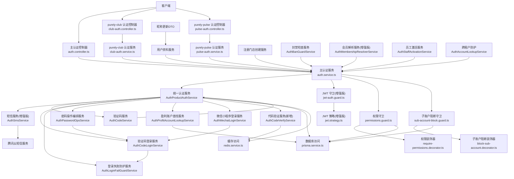
```mermaid
graph TB
Client["客户端"] --> MainAPI["主认证控制器<br/>auth.controller.ts"]
Client --> ClubAPI["purely-club 认证控制器<br/>club-auth.controller.ts"]
Client --> PulseAPI["purely-pulse 认证控制器<br/>pulse-auth.controller.ts"]
MainAPI --> MainAuthSvc["主认证服务<br/>auth.service.ts"]
ClubAPI --> ClubAuthSvc["purely-club 认证服务<br/>club-auth.service.ts"]
PulseAPI --> PulseAuthSvc["purely-pulse 认证服务<br/>pulse-auth.service.ts"]
PulseAuthSvc --> MainAuthSvc
MainAuthSvc --> UnifiedAuth["统一认证服务<br/>AuthProductAuthService"]
UnifiedAuth --> CodeSvc["验证码服务<br/>AuthCodeService"]
UnifiedAuth --> SmsSvcEnhanced["短信服务(增强版)<br/>AuthSmsService"]
UnifiedAuth --> CodeLoginSvc["验证码登录服务<br/>AuthCodeLoginService"]
UnifiedAuth --> LoginFailGuard["登录失败防护服务<br/>AuthLoginFailGuardService"]
UnifiedAuth --> PasswordOpsSvc["密码操作编排服务<br/>AuthPasswordOpsService"]
UnifiedAuth --> ProfitAccountLookup["盈利账户查找服务<br/>AuthProfitAccountLookupService"]
UnifiedAuth --> WechatLoginSvc["微信小程序登录服务<br/>AuthWechatLoginService"]
UnifiedAuth --> CodeVerifySvc["代码验证服务(新增)<br/>AuthCodeVerifyService"]
MainAuthSvc --> JwtGuard["JWT 守卫(增强版)<br/>jwt-auth.guard.ts"]
JwtGuard --> JwtStrategyEnhanced["JWT 策略(增强版)<br/>jwt.strategy.ts"]
MainAuthSvc --> PermGuard["权限守卫<br/>permissions.guard.ts"]
PermGuard --> Decorators["权限装饰器<br/>require-permissions.decorator.ts"]
MainAuthSvc --> SubAccBlock["子账户阻断守卫<br/>sub-account-block.guard.ts"]
SubAccBlock --> SubAccDecorators["子账户阻断装饰器<br/>block-sub-account.decorator.ts"]
ClubAuthSvc --> MainAuthSvc
UnifiedAuth --> Prisma["数据库访问<br/>prisma.service.ts"]
UnifiedAuth --> Redis["缓存访问<br/>redis.service.ts"]
SmsSvcEnhanced --> TencentCloud["腾讯云短信服务"]
CodeLoginSvc --> LoginFailGuard
PasswordOpsSvc --> CodeLoginSvc
ProfitAccountLookup --> Prisma
WechatLoginSvc --> CodeLoginSvc
CodeVerifySvc --> Redis
CodeSvc --> UnifiedAuth
PermGuard --> Prisma
SubAccBlock --> Prisma
UPS["用户资料服务"] --> MainAuthSvc
ARS["注册门店创建服务"] --> MainAuthSvc
URNS["昵称更新DTO"] --> UPS
ABGS["封禁检查服务<br/>AuthBanGuardService"] --> MainAuthSvc
AMRS["会员解析服务(增强版)<br/>AuthMembershipResolverService"] --> MainAuthSvc
ASAS["员工激活服务<br/>AuthStaffActivationService"] --> MainAuthSvc
CrossTenant["跨租户防护<br/>AuthAccountLookupService"] --> MainAuthSvc
```

**图表来源**
- [auth.controller.ts:1-259](file://src/purely-profit/auth/auth.controller.ts#L1-L259)
- [club-auth.controller.ts:1-109](file://src/purely-club/auth/club-auth.controller.ts#L1-L109)
- [pulse-auth.controller.ts:1-30](file://src/purely-pulse/auth/pulse-auth.controller.ts#L1-L30)
- [auth.service.ts:1-122](file://src/purely-profit/auth/auth.service.ts#L1-L122)
- [auth-product-auth.service.ts:1-163](file://src/shared/auth/auth-product-auth.service.ts#L1-L163)
- [auth-code.service.ts:1-457](file://src/purely-profit/auth/auth-code.service.ts#L1-L457)
- [auth-sms.service.ts:1-202](file://src/purely-profit/auth/auth-sms.service.ts#L1-L202)
- [auth-code-login.service.ts:1-182](file://src/purely-profit/auth/auth-code-login.service.ts#L1-182)
- [auth-code-verify.service.ts:1-150](file://src/purely-profit/auth/auth-code-verify.service.ts#L1-L150)
- [auth-login-fail-guard.service.ts:1-98](file://src/purely-profit/auth/auth-login-fail-guard.service.ts#L1-L98)
- [auth-password-ops.service.ts:1-169](file://src/purely-profit/auth/auth-password-ops.service.ts#L1-L169)
- [auth-profit-account-lookup.service.ts:1-235](file://src/purely-profit/auth/auth-profit-account-lookup.service.ts#L1-L235)
- [auth-wechat-login.service.ts:1-175](file://src/purely-profit/auth/auth-wechat-login.service.ts#L1-L175)
- [club-auth.service.ts:1-38](file://src/purely-club/auth/club-auth.service.ts#L1-L38)
- [pulse-auth.service.ts:1-13](file://src/purely-pulse/auth/pulse-auth.service.ts#L1-L13)
- [jwt-auth.guard.ts:1-200](file://src/purely-profit/auth/guards/jwt-auth.guard.ts#L1-L200)
- [jwt.strategy.ts:1-200](file://src/purely-profit/auth/strategies/jwt.strategy.ts#L1-L200)
- [permissions.guard.ts:1-200](file://src/purely-profit/access-control/guards/permissions.guard.ts#L1-L200)
- [require-permissions.decorator.ts:1-200](file://src/purely-profit/access-control/decorators/require-permissions.decorator.ts#L1-L200)
- [sub-account-block.guard.ts:1-200](file://src/purely-profit/access-control/guards/sub-account-block.guard.ts#L1-L200)
- [block-sub-account.decorator.ts:1-200](file://src/purely-profit/access-control/decorators/block-sub-account.decorator.ts#L1-L200)
- [prisma.service.ts:1-200](file://src/prisma/prisma.service.ts#L1-L200)
- [redis.service.ts:1-200](file://src/redis/redis.service.ts#L1-L200)
- [auth-profile.service.ts:1-180](file://src/purely-profit/auth/auth-profile.service.ts#L1-L180)
- [auth-register-store.service.ts:1-142](file://src/purely-profit/auth/auth-register-store.service.ts#L1-L142)
- [auth-ban-guard.service.ts:10-103](file://src/purely-profit/auth/auth-ban-guard.service.ts#L10-L103)
- [auth-membership-resolver.service.ts:25-350](file://src/purely-profit/auth/auth-membership-resolver.service.ts#L25-L350)
- [auth-staff-activation.service.ts:8-163](file://src/purely-profit/auth/auth-staff-activation.service.ts#L8-L163)
- [auth-account-lookup.service.ts:1-677](file://src/purely-profit/auth/auth-account-lookup.service.ts#L1-L677)

## 详细组件分析

### JWT 认证机制与安全增强
- **登录与 Token 生成**
  - 控制器接收登录参数并调用认证服务，认证服务完成凭据校验后生成 JWT 并返回。
  - 生成策略参考：[auth.service.ts:1-122](file://src/purely-profit/auth/auth.service.ts#L1-L122)、[auth-authentication.service.ts:1-603](file://src/purely-profit/auth/auth-authentication.service.ts#L1-L603)、[auth.constants.ts:1-41](file://src/purely-profit/auth/auth.constants.ts#L1-L41)。
- **JWT 解析与验证（已增强）**
  - **重大更新**：JWT策略现在包含增强的错误处理机制，改进了用户身份验证流程，并在验证过程中集成了跨租户访问防护检查。
  - 守卫在进入受保护路由前，通过策略解析请求头中的 Authorization 字段，验证签名与过期时间，解析出用户标识并注入上下文。
  - 新增的session版本检查确保被登出的用户无法继续使用旧token。
  - 参考：[jwt-auth.guard.ts:1-200](file://src/purely-profit/auth/guards/jwt-auth.guard.ts#L1-L200)、[jwt.strategy.ts:1-200](file://src/purely-profit/auth/strategies/jwt.strategy.ts#L1-L200)。
- **Token 生命周期与刷新**
  - Token 过期时间与刷新策略由常量与配置决定，建议配合短期有效 Token 与刷新接口实现安全轮换。
  - 参考：[auth.constants.ts:1-41](file://src/purely-profit/auth/auth.constants.ts#L1-L41)、[configuration.ts:1-243](file://src/config/configuration.ts#L1-L243)。

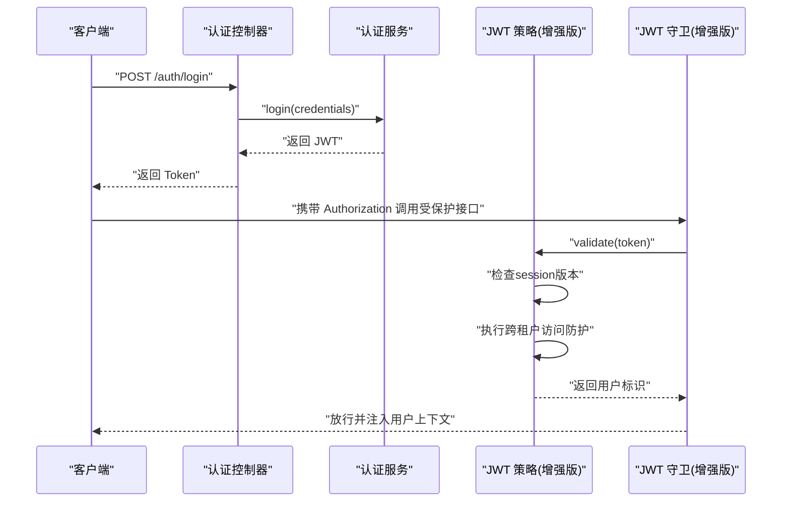
```mermaid
sequenceDiagram
participant C as "客户端"
participant Ctrl as "认证控制器"
participant Svc as "认证服务"
participant Strat as "JWT 策略(增强版)"
participant Guard as "JWT 守卫(增强版)"
C->>Ctrl : "POST /auth/login"
Ctrl->>Svc : "login(credentials)"
Svc-->>Ctrl : "返回 JWT"
Ctrl-->>C : "返回 Token"
C->>Guard : "携带 Authorization 调用受保护接口"
Guard->>Strat : "validate(token)"
Strat->>Strat : "检查session版本"
Strat->>Strat : "执行跨租户访问防护"
Strat-->>Guard : "返回用户标识"
Guard-->>C : "放行并注入用户上下文"
```

**图表来源**
- [auth.controller.ts:100-114](file://src/purely-profit/auth/auth.controller.ts#L100-L114)
- [auth.service.ts:1-122](file://src/purely-profit/auth/auth.service.ts#L1-L122)
- [jwt-auth.guard.ts:1-200](file://src/purely-profit/auth/guards/jwt-auth.guard.ts#L1-L200)
- [jwt.strategy.ts:1-200](file://src/purely-profit/auth/strategies/jwt.strategy.ts#L1-L200)

**章节来源**
- [auth.controller.ts:100-114](file://src/purely-profit/auth/auth.controller.ts#L100-L114)
- [auth.service.ts:1-122](file://src/purely-profit/auth/auth.service.ts#L1-L122)
- [jwt-auth.guard.ts:1-200](file://src/purely-profit/auth/guards/jwt-auth.guard.ts#L1-L200)
- [jwt.strategy.ts:1-200](file://src/purely-profit/auth/strategies/jwt.strategy.ts#L1-L200)
- [auth.constants.ts:1-41](file://src/purely-profit/auth/auth.constants.ts#L1-L41)
- [configuration.ts:1-243](file://src/config/configuration.ts#L1-L243)

### 代码验证服务（新增）
**新功能** AuthCodeVerifyService 是最新引入的专业化服务，专门处理验证码的验证逻辑，提供统一的验证码验证接口。

- **核心功能**
  - 统一验证码验证：`verifyCode` 方法提供标准化的验证码验证接口
  - 多类型支持：支持注册验证码、登录验证码、密码重置验证码等多种类型
  - 安全性增强：集成防重放攻击和时间窗口验证
  - 缓存优化：使用Redis进行验证码验证状态的缓存

- **验证流程**
  1. 检查验证码是否存在于缓存中
  2. 验证验证码是否已过期
  3. 验证验证码是否已被使用
  4. 执行具体的验证码验证逻辑
  5. 更新验证码使用状态

- **安全特性**
  - 防止验证码重放攻击
  - 支持验证码使用次数限制
  - 集成IP地址验证防止跨IP滥用
  - 详细的验证日志记录

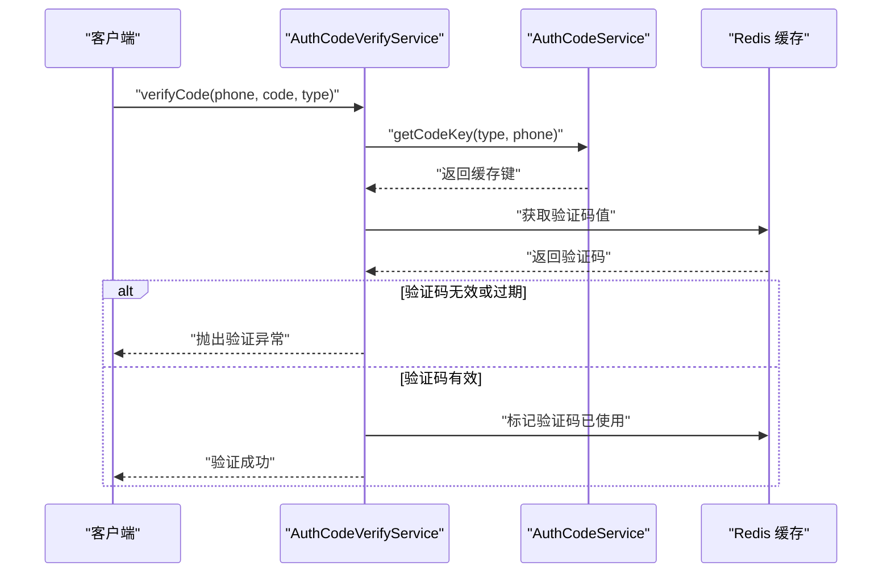
```mermaid
sequenceDiagram
participant Client as "客户端"
participant CodeVerify as "AuthCodeVerifyService"
participant CodeSvc as "AuthCodeService"
participant Redis as "Redis 缓存"
Client->>CodeVerify : "verifyCode(phone, code, type)"
CodeVerify->>CodeSvc : "getCodeKey(type, phone)"
CodeSvc-->>CodeVerify : "返回缓存键"
CodeVerify->>Redis : "获取验证码值"
Redis-->>CodeVerify : "返回验证码"
alt 验证码无效或过期
CodeVerify-->>Client : "抛出验证异常"
else 验证码有效
CodeVerify->>Redis : "标记验证码已使用"
CodeVerify-->>Client : "验证成功"
end
```

**图表来源**
- [auth-code-verify.service.ts:25-45](file://src/purely-profit/auth/auth-code-verify.service.ts#L25-L45)
- [auth-code-verify.service.ts:47-85](file://src/purely-profit/auth/auth-code-verify.service.ts#L47-L85)
- [auth-code-verify.service.ts:87-120](file://src/purely-profit/auth/auth-code-verify.service.ts#L87-L120)

**章节来源**
- [auth-code-verify.service.ts:1-150](file://src/purely-profit/auth/auth-code-verify.service.ts#L1-L150)

### 验证码登录服务
**新功能** AuthCodeLoginService 是重构后新增的专业化服务，专门处理手机号+验证码的登录流程。

- **核心功能**
  - 手机号+验证码登录：`loginByCode` 方法处理现有用户的验证码登录
  - 登录即注册：`loginByCodeOrRegister` 方法支持新用户自动注册
  - 并发冲突处理：完善的唯一约束冲突检测和回退机制
  - 账户范围解析：根据用户邮箱和手机号确定认证范围

- **登录流程**
  1. 验证验证码有效性
  2. 查找用户是否存在
  3. 解析账户范围（purely_profit、purely_club、developer）
  4. 清除已使用的验证码
  5. 签发JWT令牌

- **并发安全**
  - 使用数据库唯一约束防止重复创建
  - 捕获唯一约束冲突异常并回退到登录流程
  - 确保高并发场景下的数据一致性

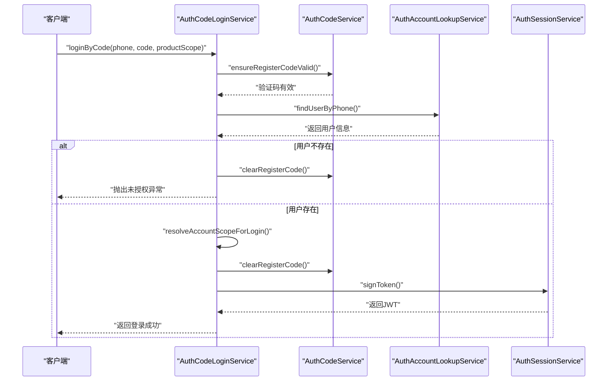
```mermaid
sequenceDiagram
participant Client as "客户端"
participant CodeLogin as "AuthCodeLoginService"
participant CodeSvc as "AuthCodeService"
participant AccountLookup as "AuthAccountLookupService"
participant Session as "AuthSessionService"
Client->>CodeLogin : "loginByCode(phone, code, productScope)"
CodeLogin->>CodeSvc : "ensureRegisterCodeValid()"
CodeSvc-->>CodeLogin : "验证码有效"
CodeLogin->>AccountLookup : "findUserByPhone()"
AccountLookup-->>CodeLogin : "返回用户信息"
alt 用户不存在
CodeLogin->>CodeSvc : "clearRegisterCode()"
CodeLogin-->>Client : "抛出未授权异常"
else 用户存在
CodeLogin->>CodeLogin : "resolveAccountScopeForLogin()"
CodeLogin->>CodeSvc : "clearRegisterCode()"
CodeLogin->>Session : "signToken()"
Session-->>CodeLogin : "返回JWT"
CodeLogin-->>Client : "返回登录成功"
end
```

**图表来源**
- [auth-code-login.service.ts:45-75](file://src/purely-profit/auth/auth-code-login.service.ts#L45-L75)
- [auth-code-login.service.ts:86-145](file://src/purely-profit/auth/auth-code-login.service.ts#L86-L145)
- [auth-code-login.service.ts:150-160](file://src/purely-profit/auth/auth-code-login.service.ts#L150-L160)

**章节来源**
- [auth-code-login.service.ts:1-182](file://src/purely-profit/auth/auth-code-login.service.ts#L1-182)

### 登录失败防护服务
**新功能** AuthLoginFailGuardService 实现了基于 Redis 的登录失败计数和账号临时锁定机制。

- **安全防护机制**
  - 基于 Redis INCR 原子递增记录登录失败次数
  - 达到阈值后临时锁定账号（默认15分钟）
  - 登录成功后自动清除失败计数
  - 详细的审计日志记录

- **配置参数**
  - `AUTH_LOGIN_FAIL_MAX_ATTEMPTS`：最大失败尝试次数
  - `AUTH_LOGIN_FAIL_LOCK_TTL_SECONDS`：锁定时长（秒）
  - `AUTH_LOGIN_FAIL_KEY_PREFIX`：Redis键前缀

- **Redis键格式**
  - 格式：`auth:login-fail:{productScope}:{loginAccount}`
  - 值：失败次数（整数）
  - TTL：锁定时长

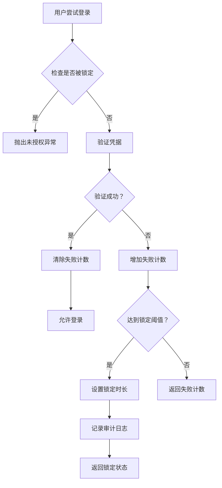
```mermaid
flowchart TD
A["用户尝试登录"] --> B{"检查是否被锁定"}
B --> |是| C["抛出未授权异常"]
B --> |否| D["验证凭据"]
D --> E{"验证成功？"}
E --> |是| F["清除失败计数"]
F --> G["允许登录"]
E --> |否| H["增加失败计数"]
H --> I{"达到锁定阈值？"}
I --> |是| J["设置锁定时长"]
J --> K["记录审计日志"]
K --> L["返回锁定状态"]
I --> |否| M["返回失败计数"]
```

**图表来源**
- [auth-login-fail-guard.service.ts:29-42](file://src/purely-profit/auth/auth-login-fail-guard.service.ts#L29-L42)
- [auth-login-fail-guard.service.ts:48-78](file://src/purely-profit/auth/auth-login-fail-guard.service.ts#L48-L78)
- [auth-login-fail-guard.service.ts:83-89](file://src/purely-profit/auth/auth-login-fail-guard.service.ts#L83-89)

**章节来源**
- [auth-login-fail-guard.service.ts:1-98](file://src/purely-profit/auth/auth-login-fail-guard.service.ts#L1-L98)

### 密码操作编排服务
**新功能** AuthPasswordOpsService 协调密码修改和重置的完整流程，确保会话安全和审计日志记录。

- **密码修改流程**
  - 验证新密码长度和确认匹配
  - 调用底层密码服务修改密码
  - 提升token版本号使旧会话失效
  - 移除所有现有会话
  - 创建新会话并签发新token
  - 记录审计日志

- **密码重置流程**
  - 验证密码重置验证码
  - 查找用户并验证存在性
  - 重置密码并清除验证码
  - 批量失效旧会话
  - 创建新会话并签发新token
  - 记录审计日志

- **会话管理**
  - 智能会话类别识别（owner、profit_club、profit_main）
  - 管理员手机号特殊处理
  - 并行会话清理提升性能

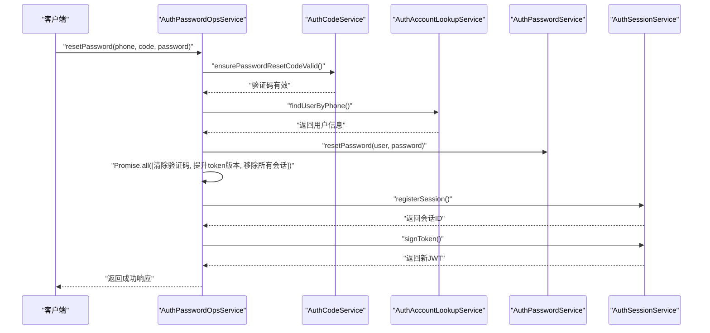
```mermaid
sequenceDiagram
participant Client as "客户端"
participant PasswordOps as "AuthPasswordOpsService"
participant CodeSvc as "AuthCodeService"
participant AccountLookup as "AuthAccountLookupService"
participant PasswordSvc as "AuthPasswordService"
participant Session as "AuthSessionService"
Client->>PasswordOps : "resetPassword(phone, code, password)"
PasswordOps->>CodeSvc : "ensurePasswordResetCodeValid()"
CodeSvc-->>PasswordOps : "验证码有效"
PasswordOps->>AccountLookup : "findUserByPhone()"
AccountLookup-->>PasswordOps : "返回用户信息"
PasswordOps->>PasswordSvc : "resetPassword(user, password)"
PasswordOps->>PasswordOps : "Promise.all([清除验证码, 提升token版本, 移除所有会话])"
PasswordOps->>Session : "registerSession()"
Session-->>PasswordOps : "返回会话ID"
PasswordOps->>Session : "signToken()"
Session-->>PasswordOps : "返回新JWT"
PasswordOps-->>Client : "返回成功响应"
```

**图表来源**
- [auth-password-ops.service.ts:86-155](file://src/purely-profit/auth/auth-password-ops.service.ts#L86-L155)
- [auth-password-ops.service.ts:41-84](file://src/purely-profit/auth/auth-password-ops.service.ts#L41-L84)

**章节来源**
- [auth-password-ops.service.ts:1-169](file://src/purely-profit/auth/auth-password-ops.service.ts#L1-L169)

### 盈利专属账户查找服务
**新功能** AuthProfitAccountLookupService 处理纯盈利系统的账户查找逻辑，包含跨租户冲突检测。

- **账户查找功能**
  - 自定义登录账号查找：`findProfitUserByCustomAccount`
  - 登录邮箱查找：`findProfitUserByLoginEmails`
  - 开发者手机号查找：`findDeveloperUserByPhone`
  - 管理员手机号获取：`getAdminLoginPhone`

- **跨租户冲突检测**
  - 检测同一登录标识关联多个不同用户的情况
  - 防止跨门店数据泄露
  - 详细的警告日志记录
  - 友好的错误消息提示

- **数据完整性保证**
  - 只返回活跃状态的员工记录
  - 确保userId不为空
  - 按更新时间倒序排序获取最新记录
  - 限制查询结果数量避免性能问题

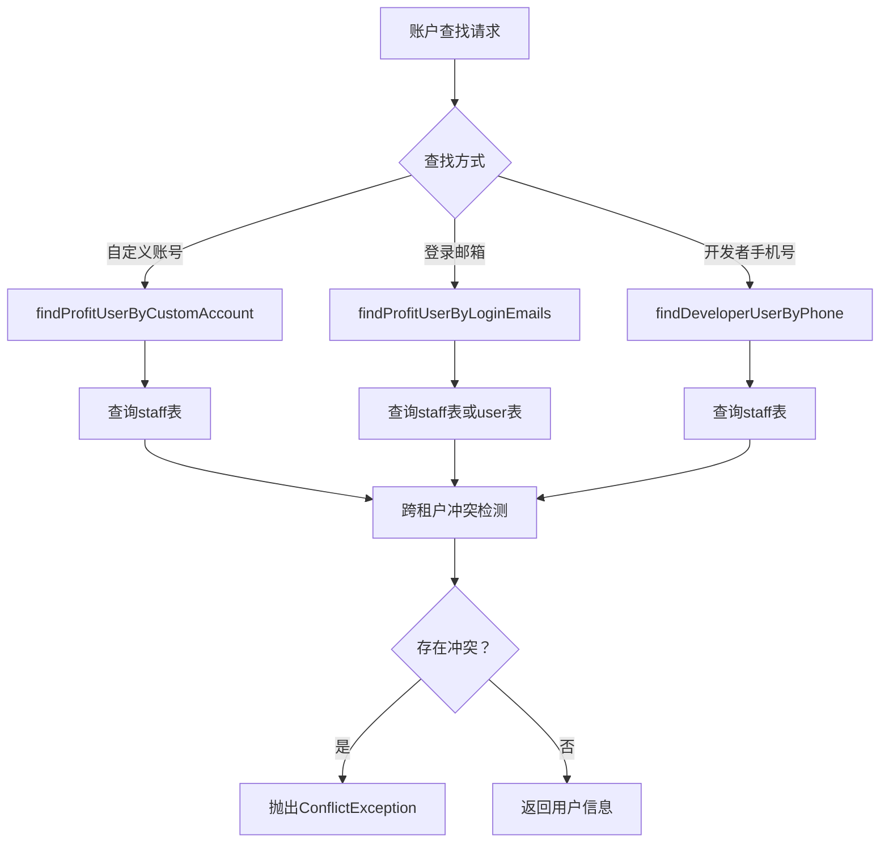
```mermaid
flowchart TD
A["账户查找请求"] --> B{"查找方式"}
B --> |自定义账号| C["findProfitUserByCustomAccount"]
B --> |登录邮箱| D["findProfitUserByLoginEmails"]
B --> |开发者手机号| E["findDeveloperUserByPhone"]
C --> F["查询staff表"]
D --> G["查询staff表或user表"]
E --> H["查询staff表"]
F --> I["跨租户冲突检测"]
G --> I
H --> I
I --> J{"存在冲突？"}
J --> |是| K["抛出ConflictException"]
J --> |否| L["返回用户信息"]
```

**图表来源**
- [auth-profit-account-lookup.service.ts:32-77](file://src/purely-profit/auth/auth-profit-account-lookup.service.ts#L32-77)
- [auth-profit-account-lookup.service.ts:79-154](file://src/purely-profit/auth/auth-profit-account-lookup.service.ts#L79-L154)
- [auth-profit-account-lookup.service.ts:156-197](file://src/purely-profit/auth/auth-profit-account-lookup.service.ts#L156-L197)
- [auth-profit-account-lookup.service.ts:207-224](file://src/purely-profit/auth/auth-profit-account-lookup.service.ts#L207-L224)

**章节来源**
- [auth-profit-account-lookup.service.ts:1-235](file://src/purely-profit/auth/auth-profit-account-lookup.service.ts#L1-L235)

### 微信小程序登录服务
**新功能** AuthWechatLoginService 处理微信小程序的登录即注册流程，支持账号合并和微信信息同步。

- **微信登录流程**
  - 基于openid查找已绑定用户
  - 支持手机号绑定和账号合并
  - 首次登录自动注册新用户
  - 每次登录刷新微信信息

- **账号合并机制**
  - 尝试将openid绑定到已有手机号账号
  - 处理唯一约束冲突情况
  - 防止账号混淆和数据污染

- **安全检查**
  - 微信手机号安全更新检查
  - 封禁状态验证
  - 并发登录冲突处理

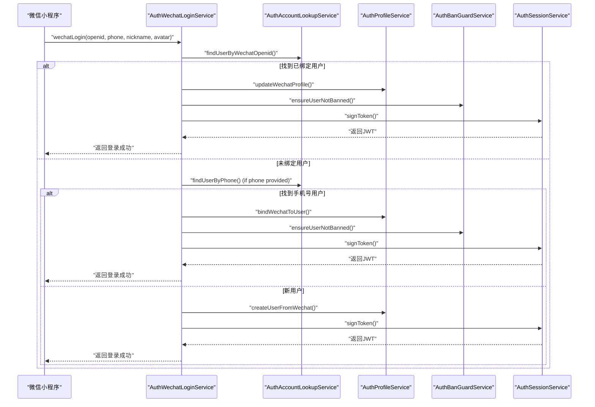
```mermaid
sequenceDiagram
participant Client as "微信小程序"
participant WechatLogin as "AuthWechatLoginService"
participant AccountLookup as "AuthAccountLookupService"
participant ProfileSvc as "AuthProfileService"
participant BanGuard as "AuthBanGuardService"
participant Session as "AuthSessionService"
Client->>WechatLogin : "wechatLogin(openid, phone, nickname, avatar)"
WechatLogin->>AccountLookup : "findUserByWechatOpenid()"
alt 找到已绑定用户
WechatLogin->>ProfileSvc : "updateWechatProfile()"
WechatLogin->>BanGuard : "ensureUserNotBanned()"
WechatLogin->>Session : "signToken()"
Session-->>WechatLogin : "返回JWT"
WechatLogin-->>Client : "返回登录成功"
else 未绑定用户
WechatLogin->>AccountLookup : "findUserByPhone() (if phone provided)"
alt 找到手机号用户
WechatLogin->>ProfileSvc : "bindWechatToUser()"
WechatLogin->>BanGuard : "ensureUserNotBanned()"
WechatLogin->>Session : "signToken()"
Session-->>WechatLogin : "返回JWT"
WechatLogin-->>Client : "返回登录成功"
else 新用户
WechatLogin->>ProfileSvc : "createUserFromWechat()"
WechatLogin->>Session : "signToken()"
Session-->>WechatLogin : "返回JWT"
WechatLogin-->>Client : "返回登录成功"
end
end
```

**图表来源**
- [auth-wechat-login.service.ts:38-143](file://src/purely-profit/auth/auth-wechat-login.service.ts#L38-L143)
- [auth-wechat-login.service.ts:149-166](file://src/purely-profit/auth/auth-wechat-login.service.ts#L149-L166)

**章节来源**
- [auth-wechat-login.service.ts:1-175](file://src/purely-profit/auth/auth-wechat-login.service.ts#L1-L175)

### 跨租户访问防护机制
**重大安全更新** AuthAccountLookupService实现了全面的跨租户访问防护，能够有效检测和防止跨门店数据污染。

- **多用户冲突检测**
  - 在手机号登录时，系统会检查该手机号是否关联了多个不同的用户ID
  - 如果发现跨租户的手机号关联，立即拒绝登录并抛出ConflictException
  - 详细的警告日志记录包含具体的手机号、匹配的员工数量和涉及的不同用户数量

- **登录账号冲突检测**
  - 对于自定义登录账号，同样执行多用户冲突检测
  - 确保每个登录账号只能关联单一用户，防止账号混淆
  - 提供友好的错误消息指导用户联系管理员处理

- **开发者模式特殊处理**
  - 开发者模式的手机号登录也应用相同的跨租户防护
  - 确保开发环境下的数据安全性和隔离性

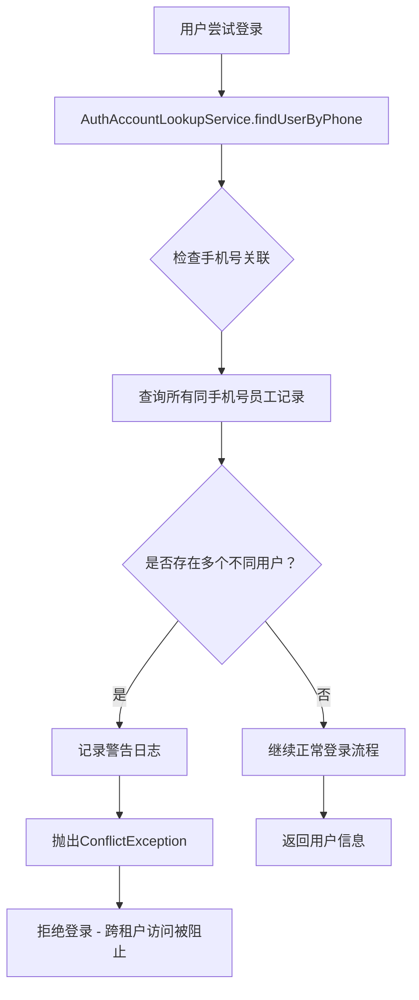
```mermaid
flowchart TD
A["用户尝试登录"] --> B["AuthAccountLookupService.findUserByPhone"]
B --> C{"检查手机号关联"}
C --> D["查询所有同手机号员工记录"]
D --> E{"是否存在多个不同用户？"}
E --> |是| F["记录警告日志"]
F --> G["抛出ConflictException"]
G --> H["拒绝登录 - 跨租户访问被阻止"]
E --> |否| I["继续正常登录流程"]
I --> J["返回用户信息"]
```

**图表来源**
- [auth-account-lookup.service.ts:77-109](file://src/purely-profit/auth/auth-account-lookup.service.ts#L77-L109)
- [auth-account-lookup.service.ts:507-517](file://src/purely-profit/auth/auth-account-lookup.service.ts#L507-L517)
- [auth-account-lookup.service.ts:652-662](file://src/purely-profit/auth/auth-account-lookup.service.ts#L652-L662)

**章节来源**
- [auth-account-lookup.service.ts:77-109](file://src/purely-profit/auth/auth-account-lookup.service.ts#L77-L109)
- [auth-account-lookup.service.ts:507-517](file://src/purely-profit/auth/auth-account-lookup.service.ts#L507-L517)
- [auth-account-lookup.service.ts:652-662](file://src/purely-profit/auth/auth-account-lookup.service.ts#L652-L662)

### 权限控制模型与继承机制
- **方法级权限校验**
  - 使用权限装饰器标注控制器方法，守卫在执行前检查当前用户是否具备所需权限集合。
  - 参考：[require-permissions.decorator.ts:1-200](file://src/purely-profit/access-control/decorators/require-permissions.decorator.ts#L1-L200)、[permissions.guard.ts:1-200](file://src/purely-profit/access-control/guards/permissions.guard.ts#L1-L200)。
- **主题能力计算**
  - 通过主体能力服务聚合用户在不同作用域（如门店、平台）下的能力集合，形成可传递的权限继承链。
  - 参考：[subject-capability.service.ts:1-200](file://src/purely-profit/access-control/subject-capability.service.ts#L1-L200)。
- **权限持久化与查询**
  - 权限数据由认证与会员服务提供，权限守卫通过数据库或缓存进行快速判定。
  - 参考：[auth-capability.service.ts:1-200](file://src/purely-profit/auth/auth-capability.service.ts#L1-L200)、[prisma.service.ts:1-200](file://src/prisma/prisma.service.ts#L1-L200)。

```mermaid
flowchart TD
Start(["进入受保护方法"]) --> GetPerm["获取所需权限集合"]
GetPerm --> GetUserCtx["获取当前用户上下文"]
GetUserCtx --> ComputeCap["计算主体能力<br/>subject-capability.service.ts"]
ComputeCap --> CheckPerm{"是否满足权限要求？"}
CheckPerm --> |是| Allow["放行执行"]
CheckPerm --> |否| Deny["拒绝访问"]
Allow --> End(["结束"])
Deny --> End
```

**图表来源**
- [require-permissions.decorator.ts:1-200](file://src/purely-profit/access-control/decorators/require-permissions.decorator.ts#L1-L200)
- [permissions.guard.ts:1-200](file://src/purely-profit/access-control/guards/permissions.guard.ts#L1-L200)
- [subject-capability.service.ts:1-200](file://src/purely-profit/access-control/subject-capability.service.ts#L1-L200)

**章节来源**
- [require-permissions.decorator.ts:1-200](file://src/purely-profit/access-control/decorators/require-permissions.decorator.ts#L1-L200)
- [permissions.guard.ts:1-200](file://src/purely-profit/access-control/guards/permissions.guard.ts#L1-L200)
- [subject-capability.service.ts:1-200](file://src/purely-profit/access-control/subject-capability.service.ts#L1-L200)
- [auth-capability.service.ts:1-200](file://src/purely-profit/auth/auth-capability.service.ts#L1-L200)

### 子账户管理与安全策略
- **子账户登录流程**
  - 子账户登录由专用服务处理，确保仅允许在指定的登录场景与条件下生效。
  - 参考：[store-sub-account-login.service.ts:1-200](file://src/purely-profit/member/platform-membership/store-sub-account-login.service.ts#L1-L200)。
- **子账户读取与能力**
  - 提供只读能力查询与能力映射，避免子账户越权修改主账户资源。
  - 参考：[store-sub-account-read.service.ts:1-200](file://src/purely-profit/member/platform-membership/store-sub-account-read.service.ts#L1-L200)、[auth-capability.service.ts:1-200](file://src/purely-profit/auth/auth-capability.service.ts#L1-L200)。
- **槽位与配额管理**
  - 通过槽位服务限制子账户并发登录与使用配额，防止滥用。
  - 参考：[store-sub-account-slot.service.ts:1-200](file://src/purely-profit/member/platform-membership/store-sub-account-slot.service.ts#L1-L200)。
- **访问阻断**
  - 在需要禁止子账户访问的路由上使用阻断装饰器与守卫，强制主账户身份。
  - 参考：[block-sub-account.decorator.ts:1-200](file://src/purely-profit/access-control/decorators/block-sub-account.decorator.ts#L1-L200)、[sub-account-block.guard.ts:1-200](file://src/purely-profit/access-control/guards/sub-account-block.guard.ts#L1-L200)。

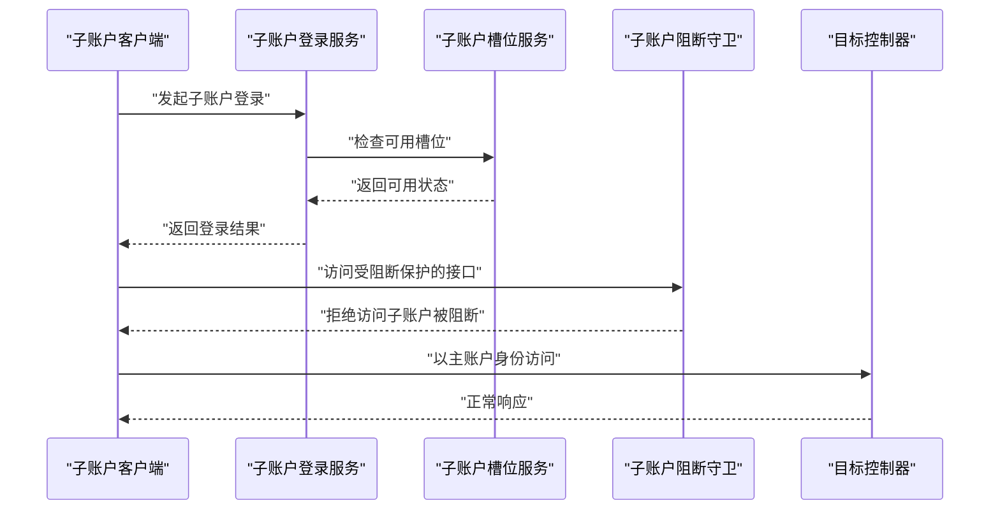
```mermaid
sequenceDiagram
participant C as "子账户客户端"
participant Login as "子账户登录服务"
participant Slot as "子账户槽位服务"
participant Guard as "子账户阻断守卫"
participant Ctrl as "目标控制器"
C->>Login : "发起子账户登录"
Login->>Slot : "检查可用槽位"
Slot-->>Login : "返回可用状态"
Login-->>C : "返回登录结果"
C->>Guard : "访问受阻断保护的接口"
Guard-->>C : "拒绝访问子账户被阻断"
C->>Ctrl : "以主账户身份访问"
Ctrl-->>C : "正常响应"
```

**图表来源**
- [store-sub-account-login.service.ts:1-200](file://src/purely-profit/member/platform-membership/store-sub-account-login.service.ts#L1-L200)
- [store-sub-account-slot.service.ts:1-200](file://src/purely-profit/member/platform-membership/store-sub-account-slot.service.ts#L1-L200)
- [sub-account-block.guard.ts:1-200](file://src/purely-profit/access-control/guards/sub-account-block.guard.ts#L1-L200)
- [block-sub-account.decorator.ts:1-200](file://src/purely-profit/access-control/decorators/block-sub-account.decorator.ts#L1-L200)

**章节来源**
- [store-sub-account-login.service.ts:1-200](file://src/purely-profit/member/platform-membership/store-sub-account-login.service.ts#L1-L200)
- [store-sub-account-read.service.ts:1-200](file://src/purely-profit/member/platform-membership/store-sub-account-read.service.ts#L1-L200)
- [store-sub-account-slot.service.ts:1-200](file://src/purely-profit/member/platform-membership/store-sub-account-slot.service.ts#L1-L200)
- [block-sub-account.decorator.ts:1-200](file://src/purely-profit/access-control/decorators/block-sub-account.decorator.ts#L1-L200)
- [sub-account-block.guard.ts:1-200](file://src/purely-profit/access-control/guards/sub-account-block.guard.ts#L1-L200)

### 认证流程与数据流
- **登录流程**
  - 客户端提交登录信息，控制器委派认证服务进行校验，成功后签发 JWT 返回给客户端。
  - 参考：[auth.controller.ts:100-114](file://src/purely-profit/auth/auth.controller.ts#L100-L114)、[auth.service.ts:1-122](file://src/purely-profit/auth/auth.service.ts#L1-L122)。
- **请求拦截与权限判定**
  - 守卫解析 JWT 并注入用户上下文，随后权限守卫根据装饰器声明的权限集合进行判定。
  - 参考：[jwt-auth.guard.ts:1-200](file://src/purely-profit/auth/guards/jwt-auth.guard.ts#L1-L200)、[permissions.guard.ts:1-200](file://src/purely-profit/access-control/guards/permissions.guard.ts#L1-L200)。
- **子账户访问控制**
  - 对于需要主账户独享的功能，使用阻断守卫与装饰器强制限制。
  - 参考：[sub-account-block.guard.ts:1-200](file://src/purely-profit/access-control/guards/sub-account-block.guard.ts#L1-L200)、[block-sub-account.decorator.ts:1-200](file://src/purely-profit/access-control/decorators/block-sub-account.decorator.ts#L1-L200)。

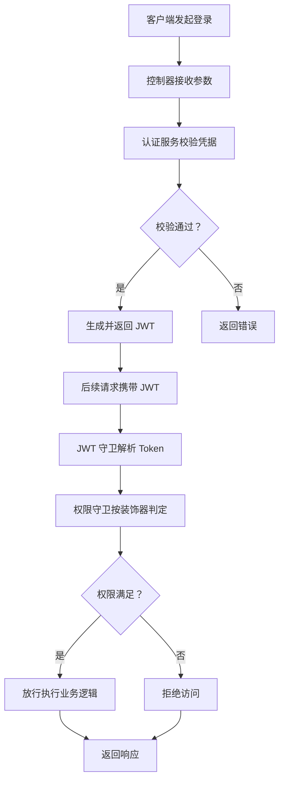
```mermaid
flowchart TD
A["客户端发起登录"] --> B["控制器接收参数"]
B --> C["认证服务校验凭据"]
C --> D{"校验通过？"}
D --> |是| E["生成并返回 JWT"]
D --> |否| F["返回错误"]
E --> G["后续请求携带 JWT"]
G --> H["JWT 守卫解析 Token"]
H --> I["权限守卫按装饰器判定"]
I --> J{"权限满足？"}
J --> |是| K["放行执行业务逻辑"]
J --> |否| L["拒绝访问"]
K --> M["返回响应"]
L --> M
```

**图表来源**
- [auth.controller.ts:100-114](file://src/purely-profit/auth/auth.controller.ts#L100-L114)
- [auth.service.ts:1-122](file://src/purely-profit/auth/auth.service.ts#L1-L122)
- [jwt-auth.guard.ts:1-200](file://src/purely-profit/auth/guards/jwt-auth.guard.ts#L1-L200)
- [permissions.guard.ts:1-200](file://src/purely-profit/access-control/guards/permissions.guard.ts#L1-L200)

**章节来源**
- [auth.controller.ts:100-114](file://src/purely-profit/auth/auth.controller.ts#L100-L114)
- [auth.service.ts:1-122](file://src/purely-profit/auth/auth.service.ts#L1-L122)
- [jwt-auth.guard.ts:1-200](file://src/purely-profit/auth/guards/jwt-auth.guard.ts#L1-L200)
- [permissions.guard.ts:1-200](file://src/purely-profit/access-control/guards/permissions.guard.ts#L1-L200)

## 多产品范围认证

### 统一认证服务架构
**更新** 引入 AuthProductAuthService 作为统一认证服务，支持多产品范围认证，提供标准化的认证接口。

- **核心功能**
  - 支持多种认证范围：purely_profit（主认证）、purely_club（个人端）、developer（开发者）
  - 统一验证码管理：注册、登录、密码重置验证码的生成与验证
  - 标准化认证流程：登录、注册、密码管理的统一处理逻辑
  - 开发者模式支持：可选的开发者身份验证

- **认证范围定义**
  - purely_profit：主认证范围，适用于纯粹盈利系统
  - purely_club：个人端认证范围，适用于 club 业务线  
  - developer：开发者认证范围，适用于 pulse 开发环境

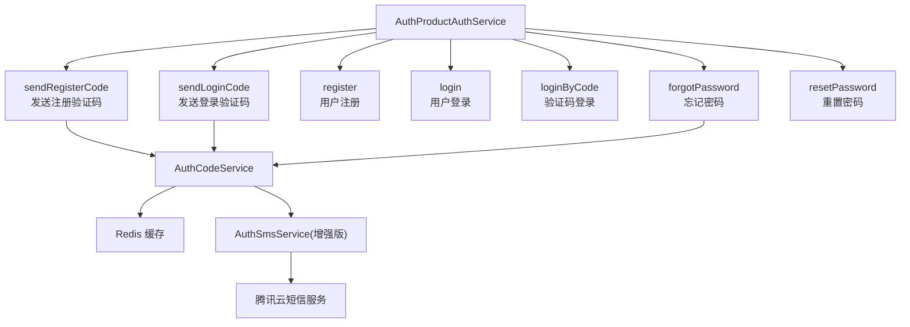
```mermaid
flowchart TD
A["AuthProductAuthService"] --> B["sendRegisterCode<br/>发送注册验证码"]
A --> C["sendLoginCode<br/>发送登录验证码"]
A --> D["register<br/>用户注册"]
A --> E["login<br/>用户登录"]
A --> F["loginByCode<br/>验证码登录"]
A --> G["forgotPassword<br/>忘记密码"]
A --> H["resetPassword<br/>重置密码"]
B --> I["AuthCodeService"]
C --> I
G --> I
I --> J["Redis 缓存"]
I --> K["AuthSmsService(增强版)"]
K --> L["腾讯云短信服务"]
```

**图表来源**
- [auth-product-auth.service.ts:70-163](file://src/shared/auth/auth-product-auth.service.ts#L70-L163)
- [auth-code.service.ts:46-98](file://src/purely-profit/auth/auth-code.service.ts#L46-L98)
- [auth-sms.service.ts:120-136](file://src/purely-profit/auth/auth-sms.service.ts#L120-L136)

**章节来源**
- [auth-product-auth.service.ts:1-163](file://src/shared/auth/auth-product-auth.service.ts#L1-L163)
- [auth-account.types.ts:1-41](file://src/shared/auth/auth-account.types.ts#L1-L41)

### purely-club 认证系统
purely-club 是专为个人端用户设计的独立认证模块，提供完整的用户生命周期管理：

- **注册流程**
  - 发送注册验证码：`POST /club/auth/register/send-code`
  - 完成注册：`POST /club/auth/register`
  - 支持手机号注册，独立于主认证系统

- **登录流程**
  - 个人端登录：`POST /club/auth/login`
  - 仅接受 purely-club 个人端账号登录
  - 不兼容 purely-profit 或 purely-pulse 账号

- **密码管理**
  - 忘记密码：`POST /club/auth/forgot-password`
  - 重置密码：`POST /club/auth/reset-password`
  - 密码找回采用短信验证码机制

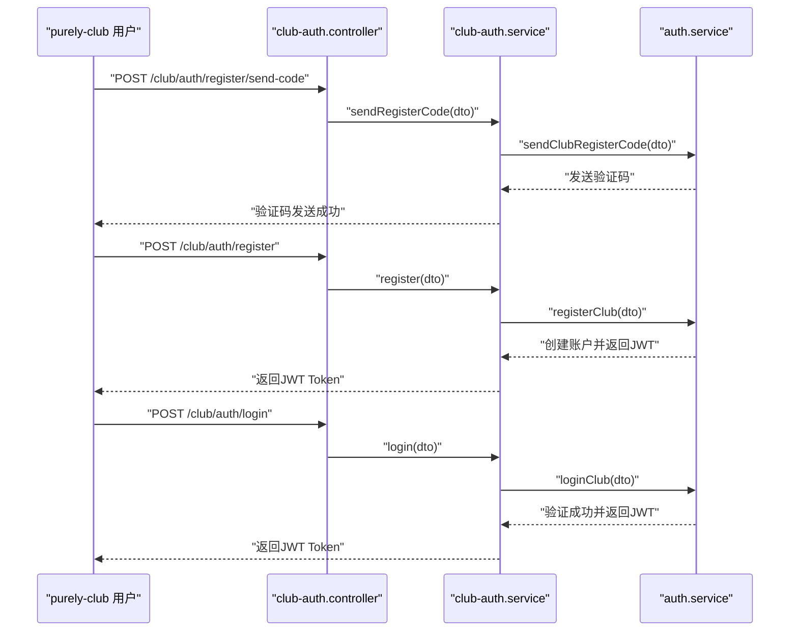
```mermaid
sequenceDiagram
participant User as "purely-club 用户"
participant ClubCtrl as "club-auth.controller"
participant ClubSvc as "club-auth.service"
participant MainSvc as "auth.service"
User->>ClubCtrl : "POST /club/auth/register/send-code"
ClubCtrl->>ClubSvc : "sendRegisterCode(dto)"
ClubSvc->>MainSvc : "sendClubRegisterCode(dto)"
MainSvc-->>ClubSvc : "发送验证码"
ClubSvc-->>User : "验证码发送成功"
User->>ClubCtrl : "POST /club/auth/register"
ClubCtrl->>ClubSvc : "register(dto)"
ClubSvc->>MainSvc : "registerClub(dto)"
MainSvc-->>ClubSvc : "创建账户并返回JWT"
ClubSvc-->>User : "返回JWT Token"
User->>ClubCtrl : "POST /club/auth/login"
ClubCtrl->>ClubSvc : "login(dto)"
ClubSvc->>MainSvc : "loginClub(dto)"
MainSvc-->>ClubSvc : "验证成功并返回JWT"
ClubSvc-->>User : "返回JWT Token"
```

**图表来源**
- [club-auth.controller.ts:1-109](file://src/purely-club/auth/club-auth.controller.ts#L1-L109)
- [club-auth.service.ts:1-38](file://src/purely-club/auth/club-auth.service.ts#L1-L38)
- [auth.service.ts:45-69](file://src/purely-profit/auth/auth.service.ts#L45-L69)

**章节来源**
- [club-auth.controller.ts:1-109](file://src/purely-club/auth/club-auth.controller.ts#L1-L109)
- [club-auth.service.ts:1-38](file://src/purely-club/auth/club-auth.service.ts#L1-L38)
- [auth.service.ts:45-69](file://src/purely-profit/auth/auth.service.ts#L45-L69)

### purely-pulse 认证系统
**更新** purely-pulse 认证模块已重构为轻量级实现，通过依赖注入的方式复用主认证模块的核心能力。

- **模块重构**
  - 现在通过 `imports: [AuthModule]` 依赖主认证模块
  - 移除了原有的复杂认证逻辑，专注于开发者登录入口
  - 保持与主认证模块的紧密集成

- **开发者登录**
  - 专用登录接口：`POST /pulse/auth/login`
  - 仅接受开发者账号登录
  - 拒绝 purely-profit 注册账号、purely-club 注册账号以及其他非开发者账号

- **开发者白名单**
  - 通过配置文件管理开发者邮箱列表
  - 自动识别开发者身份并授予相应权限
  - 支持动态配置更新

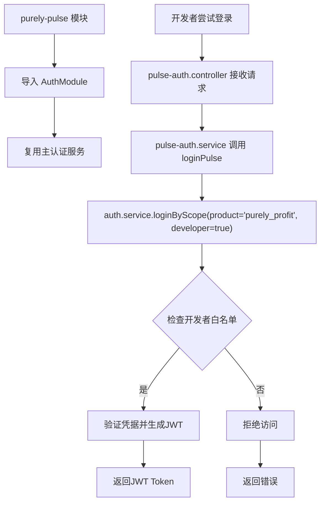
```mermaid
flowchart TD
A["purely-pulse 模块"] --> B["导入 AuthModule"]
B --> C["复用主认证服务"]
D["开发者尝试登录"] --> E["pulse-auth.controller 接收请求"]
E --> F["pulse-auth.service 调用 loginPulse"]
F --> G["auth.service.loginByScope(product='purely_profit', developer=true)"]
G --> H{"检查开发者白名单"}
H --> |是| I["验证凭据并生成JWT"]
H --> |否| J["拒绝访问"]
I --> K["返回JWT Token"]
J --> L["返回错误"]
```

**图表来源**
- [pulse-auth.module.ts:6-10](file://src/purely-pulse/auth/pulse-auth.module.ts#L6-L10)
- [pulse-auth.controller.ts:1-30](file://src/purely-pulse/auth/pulse-auth.controller.ts#L1-L30)
- [pulse-auth.service.ts:1-13](file://src/purely-pulse/auth/pulse-auth.service.ts#L1-L13)
- [auth.service.ts:67-69](file://src/purely-profit/auth/auth.service.ts#L67-L69)

**章节来源**
- [pulse-auth.module.ts:1-11](file://src/purely-pulse/auth/pulse-auth.module.ts#L1-L11)
- [pulse-auth.controller.ts:1-30](file://src/purely-pulse/auth/pulse-auth.controller.ts#L1-L30)
- [pulse-auth.service.ts:1-13](file://src/purely-pulse/auth/pulse-auth.service.ts#L1-L13)
- [auth.service.ts:67-69](file://src/purely-profit/auth/auth.service.ts#L67-L69)

### 认证范围与账户隔离
系统支持三种认证范围，确保各产品线的账户完全隔离：

- **purely_profit**：主认证范围，适用于纯粹盈利系统
- **purely_club**：个人端认证范围，适用于 club 业务线
- **developer**：开发者认证范围，适用于 pulse 开发环境

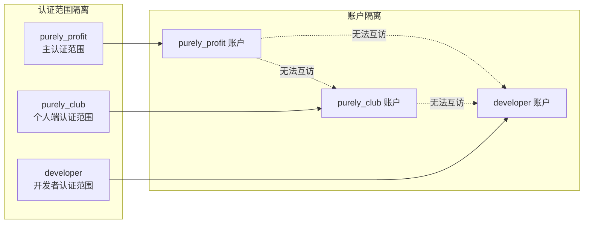
```mermaid
graph LR
subgraph "认证范围隔离"
PurelyProfit["purely_profit<br/>主认证范围"]
PurelyClub["purely_club<br/>个人端认证范围"]
Developer["developer<br/>开发者认证范围"]
end
subgraph "账户隔离"
PPAccounts["purely_profit 账户"]
ClubAccounts["purely_club 账户"]
DevAccounts["developer 账户"]
end
PurelyProfit --> PPAccounts
PurelyClub --> ClubAccounts
Developer --> DevAccounts
PPAccounts -.->|"无法互访"| ClubAccounts
PPAccounts -.->|"无法互访"| DevAccounts
ClubAccounts -.->|"无法互访"| DevAccounts
```

**图表来源**
- [auth-account.types.ts:1-20](file://src/shared/auth/auth-account.types.ts#L1-20)
- [auth-authentication.service.ts:26-40](file://src/purely-profit/auth/auth-authentication.service.ts#L26-L40)

**章节来源**
- [auth-account.types.ts:1-20](file://src/shared/auth/auth-account.types.ts#L1-20)
- [auth-authentication.service.ts:26-40](file://src/purely-profit/auth/auth-authentication.service.ts#L26-L40)

## 验证码与短信验证系统

### 验证码服务架构
**更新** 新增专门的验证码服务，提供统一的验证码生成、存储、验证和清理功能。

- **验证码类型**
  - 注册验证码：用于新用户注册时的身份验证
  - 登录验证码：用于现有用户的登录验证
  - 密码重置验证码：用于用户忘记密码时的身份验证

- **验证码生命周期**
  - 生成：随机数字验证码，长度可配置
  - 存储：使用 Redis 缓存，设置过期时间
  - 验证：比较用户输入与缓存中的验证码
  - 清理：验证成功后自动删除，过期后自动清理

- **短信发送机制（重大升级）**
  - **重大功能升级**：现在集成了完整的腾讯云服务，支持生产环境的真实短信发送
  - 支持注册、登录、密码重置三种场景的短信通知
  - 实现了智能的降级机制：当未配置腾讯短信凭证时，自动回退到开发模式的日志记录
  - 生产环境隐藏真实验证码，便于测试环境调试
  - 发送失败时自动回滚缓存操作

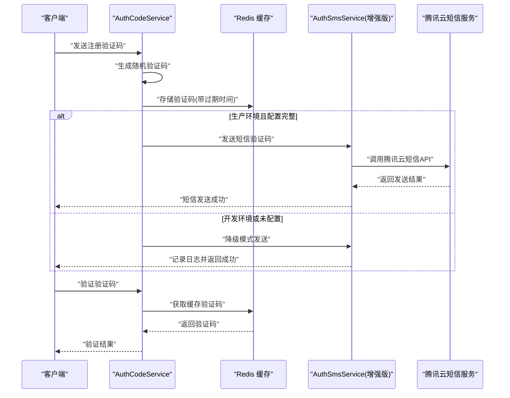
```mermaid
sequenceDiagram
participant Client as "客户端"
participant CodeSvc as "AuthCodeService"
participant Redis as "Redis 缓存"
participant SMSSvcEnhanced as "AuthSmsService(增强版)"
participant TencentCloud as "腾讯云短信服务"
Client->>CodeSvc : "发送注册验证码"
CodeSvc->>CodeSvc : "生成随机验证码"
CodeSvc->>Redis : "存储验证码(带过期时间)"
alt 生产环境且配置完整
CodeSvc->>SMSSvcEnhanced : "发送短信验证码"
SMSSvcEnhanced->>TencentCloud : "调用腾讯云短信API"
TencentCloud-->>SMSSvcEnhanced : "返回发送结果"
SMSSvcEnhanced-->>Client : "短信发送成功"
else 开发环境或未配置
CodeSvc->>SMSSvcEnhanced : "降级模式发送"
SMSSvcEnhanced-->>Client : "记录日志并返回成功"
end
Client->>CodeSvc : "验证验证码"
CodeSvc->>Redis : "获取缓存验证码"
Redis-->>CodeSvc : "返回验证码"
CodeSvc-->>Client : "验证结果"
```

**图表来源**
- [auth-code.service.ts:46-98](file://src/purely-profit/auth/auth-code.service.ts#L46-L98)
- [auth-code.service.ts:100-143](file://src/purely-profit/auth/auth-code.service.ts#L100-L143)
- [auth-code.service.ts:269-317](file://src/purely-profit/auth/auth-code.service.ts#L269-L317)
- [auth-sms.service.ts:100-154](file://src/purely-profit/auth/auth-sms.service.ts#L100-L154)

**章节来源**
- [auth-code.service.ts:1-457](file://src/purely-profit/auth/auth-code.service.ts#L1-L457)
- [auth-sms.service.ts:1-202](file://src/purely-profit/auth/auth-sms.service.ts#L1-L202)

### SMS冷却与速率限制

**更新** 新增SMS冷却功能，使用Redis setIfAbsent操作实现精确的速率限制，防止恶意刷短信攻击。

- **冷却机制原理**
  - 使用Redis的setIfAbsent操作实现原子性的冷却标记
  - 基于场景、产品范围和手机号的组合键进行独立冷却
  - 通过NX选项确保同一时间只有一个请求能够获取冷却令牌

- **支持的冷却场景**
  - 注册场景：`auth:sms-cooldown:register:{productScope}:{phone}`
  - 登录场景：`auth:sms-cooldown:login:{productScope}:{phone}`
  - 密码重置场景：`auth:sms-cooldown:password-reset:{productScope}:{phone}`
  - 登录或注册场景：`auth:sms-cooldown:login_or_register:{productScope}:{phone}`

- **冷却配置**
  - 默认冷却时间为60秒（可通过配置调整）
  - 支持禁用冷却功能（冷却时间为0）
  - 每个场景独立配置，避免相互影响

- **异常处理**
  - 冷却期间返回HTTP 429状态码
  - 提供友好的错误消息："短信发送过于频繁，请 {seconds} 秒后再试"
  - 冷却结束后自动释放锁，允许下次发送

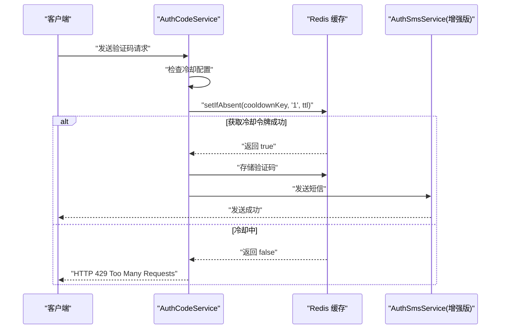
```mermaid
sequenceDiagram
participant Client as "客户端"
participant CodeSvc as "AuthCodeService"
participant Redis as "Redis 缓存"
participant SMSSvcEnhanced as "AuthSmsService(增强版)"
Client->>CodeSvc : "发送验证码请求"
CodeSvc->>CodeSvc : "检查冷却配置"
CodeSvc->>Redis : "setIfAbsent(cooldownKey, '1', ttl)"
alt 获取冷却令牌成功
Redis-->>CodeSvc : "返回 true"
CodeSvc->>Redis : "存储验证码"
CodeSvc->>SMSSvcEnhanced : "发送短信"
SMSSvcEnhanced-->>Client : "发送成功"
else 冷却中
Redis-->>CodeSvc : "返回 false"
CodeSvc-->>Client : "HTTP 429 Too Many Requests"
end
```

**图表来源**
- [auth-code.service.ts:351-378](file://src/purely-profit/auth/auth-code.service.ts#L351-L378)
- [redis.service.ts:148-167](file://src/redis/redis.service.ts#L148-L167)

**章节来源**
- [auth-code.service.ts:351-378](file://src/purely-profit/auth/auth-code.service.ts#L351-L378)
- [redis.service.ts:148-167](file://src/redis/redis.service.ts#L148-L167)
- [auth.constants.ts:8](file://src/purely-profit/auth/auth.constants.ts#L8)

### 腾讯云短信服务集成（重大升级）

**重大功能升级** AuthSmsService现在集成了完整的腾讯云服务，支持生产环境的真实短信发送功能。

- **服务架构设计**
  - **智能降级机制**：当环境变量未配置腾讯短信凭证时，自动降级为仅打印日志的开发模式
  - **多场景支持**：支持注册、登录、密码重置三种不同的短信模板
  - **配置管理**：通过ConfigService集中管理所有腾讯云短信相关配置
  - **错误处理**：完善的异常捕获和错误日志记录

- **配置参数**
  - SecretId：腾讯云访问密钥ID
  - SecretKey：腾讯云访问密钥
  - SDK AppId：短信应用ID
  - SignName：短信签名
  - RegisterTemplateId：注册验证码模板ID
  - LoginTemplateId：登录验证码模板ID
  - PasswordResetTemplateId：密码重置验证码模板ID

- **短信模板参数**
  - 模板参数顺序约定：{1}=验证码，{2}=有效期（分钟）
  - 实际模板参数需与腾讯云短信控制台中的模板保持一致
  - 支持不同场景使用不同的短信模板

- **降级模式特性**
  - 开发环境下自动显示真实验证码便于调试
  - 生产环境下隐藏验证码，确保安全
  - 降级模式下不影响业务逻辑的正常执行

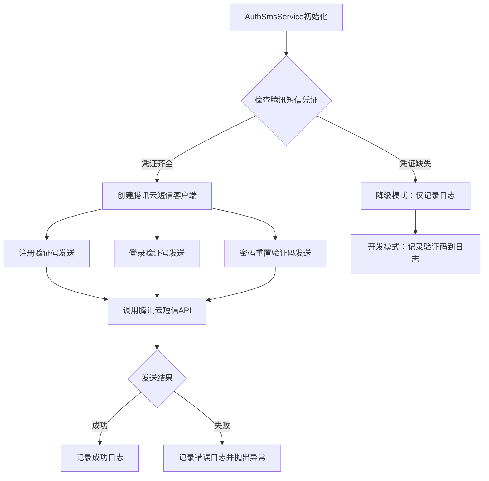
```mermaid
flowchart TD
A["AuthSmsService初始化"] --> B{"检查腾讯短信凭证"}
B --> |凭证齐全| C["创建腾讯云短信客户端"]
B --> |凭证缺失| D["降级模式：仅记录日志"]
C --> E["注册验证码发送"]
C --> F["登录验证码发送"]
C --> G["密码重置验证码发送"]
D --> H["开发模式：记录验证码到日志"]
E --> I["调用腾讯云短信API"]
F --> I
G --> I
I --> J{"发送结果"}
J --> |成功| K["记录成功日志"]
J --> |失败| L["记录错误日志并抛出异常"]
```

**图表来源**
- [auth-sms.service.ts:73-98](file://src/purely-profit/auth/auth-sms.service.ts#L73-L98)
- [auth-sms.service.ts:100-154](file://src/purely-profit/auth/auth-sms.service.ts#L100-L154)
- [auth-sms.service.ts:161-200](file://src/purely-profit/auth/auth-sms.service.ts#L161-L200)

**章节来源**
- [auth-sms.service.ts:1-202](file://src/purely-profit/auth/auth-sms.service.ts#L1-L202)
- [configuration.ts:324-345](file://src/config/configuration.ts#L324-L345)

### 验证码配置与管理
- **过期时间配置**
  - 注册验证码默认过期时间：可配置，默认值在常量中定义
  - 密码重置验证码默认过期时间：可配置，默认值在常量中定义
  - 登录验证码复用注册验证码的过期时间

- **验证码生成规则**
  - 固定长度的数字验证码
  - 随机生成，确保安全性
  - 支持测试环境显示真实验证码便于调试

- **缓存键命名规范**
  - 注册验证码键格式：`auth:register:{productScope}:{phone}`
  - 密码重置验证码键格式：`auth:password-reset:{productScope}:{phone}`
  - 冷却键格式：`auth:sms-cooldown:{scene}:{productScope}:{phone}`
  - 键值包含产品范围和手机号，确保多产品范围隔离

**章节来源**
- [auth-code.service.ts:380-399](file://src/purely-profit/auth/auth-code.service.ts#L380-L399)
- [auth.utils.ts:343-349](file://src/purely-profit/auth/auth.utils.ts#L343-L349)

## 昵称更新与注册闭环

### 昵称更新接口
**更新** 新增昵称更新功能，提供用户昵称的修改与验证。

- **接口设计**
  - 路径：`PATCH /auth/profile/name`
  - 方法：更新当前用户昵称
  - 鉴权：需要JWT认证
  - 请求体：UpdateNicknameDto

- **数据验证**
  - 去除首尾空格后最大长度20个字符
  - 必须是非空字符串
  - 自动转换和验证输入数据

- **业务流程**
  - 验证昵称格式和长度
  - 更新用户昵称到数据库
  - 返回最新的用户资料

```mermaid
sequenceDiagram
participant Client as "客户端"
participant Ctrl as "AuthController"
participant Svc as "AuthService"
participant ProfileSvc as "AuthProfileService"
participant DB as "数据库"
Client->>Ctrl : "PATCH /auth/profile/name"
Ctrl->>Svc : "updateNickname(user, dto)"
Svc->>ProfileSvc : "updateNickname(user, nickname)"
ProfileSvc->>DB : "更新昵称"
DB-->>ProfileSvc : "更新成功"
ProfileSvc-->>Svc : "返回最新资料"
Svc-->>Ctrl : "返回ProfileResponseDto"
Ctrl-->>Client : "返回更新后的用户资料"
```

**图表来源**
- [auth.controller.ts:228-241](file://src/purely-profit/auth/auth.controller.ts#L228-L241)
- [auth.service.ts:87-92](file://src/purely-profit/auth/auth.service.ts#L87-L92)
- [auth-profile.service.ts:54-60](file://src/purely-profit/auth/auth-profile.service.ts#L54-L60)

**章节来源**
- [auth.controller.ts:228-241](file://src/purely-profit/auth/auth.controller.ts#L228-L241)
- [auth.service.ts:87-92](file://src/purely-profit/auth/auth.service.ts#L87-L92)
- [auth-profile.service.ts:54-60](file://src/purely-profit/auth/auth-profile.service.ts#L54-L60)
- [update-nickname.dto.ts:1-20](file://src/purely-profit/auth/dto/update-nickname.dto.ts#L1-L20)

### 注册闭环门店创建服务
**更新** 新增注册闭环门店创建功能，提供完整的注册后门店创建流程。

- **服务设计**
  - 路径：`POST /auth/register/store`
  - 方法：注册完成后创建门店
  - 鉴权：需要JWT认证
  - 事务处理：确保创建过程的原子性

- **业务规则**
  - 确保用户只能绑定一个门店
  - 创建基础套餐订阅记录
  - 初始化所有者员工记录
  - 持久化门店元数据到Redis

- **数据一致性**
  - 使用数据库事务保证数据一致性
  - 创建OWNER员工并赋予所有权限
  - 初始化STARTER套餐配置

```mermaid
sequenceDiagram
participant Client as "客户端"
participant Ctrl as "AuthController"
participant Svc as "AuthService"
participant RegSvc as "AuthRegisterStoreService"
participant DB as "数据库"
participant Redis as "Redis缓存"
Client->>Ctrl : "POST /auth/register/store"
Ctrl->>Svc : "registerStore(user, dto)"
Svc->>RegSvc : "create(user, dto)"
RegSvc->>RegSvc : "ensureUserCanOnlyBindSingleStore"
RegSvc->>DB : "事务开始"
RegSvc->>DB : "创建门店"
RegSvc->>DB : "upsert订阅记录"
RegSvc->>DB : "创建OWNER员工"
DB-->>RegSvc : "事务提交"
RegSvc->>Redis : "持久化门店元数据"
Redis-->>RegSvc : "存储成功"
RegSvc-->>Svc : "返回门店信息"
Svc-->>Ctrl : "返回StoreResponseDto"
Ctrl-->>Client : "返回创建的门店信息"
```

**图表来源**
- [auth.controller.ts:81-98](file://src/purely-profit/auth/auth.controller.ts#L81-L98)
- [auth.service.ts:109-114](file://src/purely-profit/auth/auth.service.ts#L109-L114)
- [auth-register-store.service.ts:35-100](file://src/purely-profit/auth/auth-register-store.service.ts#L35-L100)

**章节来源**
- [auth.controller.ts:81-98](file://src/purely-profit/auth/auth.controller.ts#L81-L98)
- [auth.service.ts:109-114](file://src/purely-profit/auth/auth.service.ts#L109-L114)
- [auth-register-store.service.ts:35-100](file://src/purely-profit/auth/auth-register-store.service.ts#L35-L100)

### Throttle装饰器与请求频率限制
**更新** 新增Throttle装饰器，提供统一的请求频率限制功能。

- **装饰器配置**
  - 默认配置：60秒内最多100次请求
  - 注册验证码：60秒内最多3次请求
  - 注册：60秒内最多5次请求
  - 修改密码：60秒内最多5次请求
  - 忘记密码：60秒内最多5次请求
  - 重置密码：60秒内最多5次请求

- **配置来源**
  - 全局配置：`app.throttleTtlSeconds` 和 `app.throttleLimit`
  - 环境变量支持动态配置
  - 支持不同接口的不同限制策略

- **实现原理**
  - 基于NestJS内置的Throttler模块
  - 使用Redis进行分布式限流
  - 支持IP级别的请求频率控制

**章节来源**
- [auth.controller.ts:47-171](file://src/purely-profit/auth/auth.controller.ts#L47-L171)
- [configuration.ts:116-121](file://src/config/configuration.ts#L116-L121)

## 依赖关系分析
- **组件耦合**
  - AuthProductAuthService 作为统一入口，依赖 AuthAuthenticationService 和 AuthCodeService
  - AuthCodeService 依赖 RedisService、AuthSmsService(增强版) 和 AuthAccountLookupService
  - **重大更新** AuthSmsService现在依赖ConfigService和腾讯云短信SDK
  - **新增依赖** AuthCodeLoginService 依赖 AuthCodeService、AuthAccountLookupService、AuthPasswordService 和 AuthSessionService
  - **新增依赖** AuthLoginFailGuardService 依赖 RedisService 和 AuditLogService
  - **新增依赖** AuthPasswordOpsService 依赖多个认证服务和审计日志服务
  - **新增依赖** AuthProfitAccountLookupService 依赖 PrismaService 和 ConfigService
  - **新增依赖** AuthWechatLoginService 依赖多个认证服务和会话服务
  - **新增依赖** AuthCodeVerifyService 依赖 AuthCodeService 和 RedisService
  - 各认证模块通过 AuthModule 共享基础认证服务
  - purely-club 和 purely-pulse 模块通过 AuthModule 复用主认证服务
  - 控制器依赖对应的服务层；服务层依赖认证核心服务
  - 认证服务依赖策略与守卫；权限守卫依赖装饰器与主体能力服务；子账户相关服务依赖数据库与守卫
  - 用户资料服务依赖认证账户查询和会员服务
  - 注册门店创建服务独立于StoresModule，避免循环依赖

- **模块依赖重构**
  - **重大更新** AuthAccountMembershipService被拆分为三个专注服务：
    - AuthBanGuardService：专注于封禁检查，处理用户关联门店查询和封禁状态验证
    - AuthMembershipResolverService：专注于会员解析与缓存，处理权限计算和历史数据修复，现已增强跨租户防护
    - AuthStaffActivationService：专注于员工激活工作流，处理邀请员工激活和配额管理
  - **新增服务** 认证服务进一步细分为：
    - AuthCodeLoginService：专注于验证码登录流程
    - AuthLoginFailGuardService：专注于登录失败防护
    - AuthPasswordOpsService：专注于密码操作编排
    - AuthProfitAccountLookupService：专注于盈利系统账户查找
    - AuthWechatLoginService：专注于微信小程序登录
    - AuthCodeVerifyService：专注于验证码验证逻辑
  - **更新** purely-pulse 模块现已通过 `imports: [AuthModule]` 依赖主认证模块
  - **重大更新** AuthSmsService集成了完整的腾讯云服务，支持生产环境短信发送
  - 简化了模块结构，减少了重复代码
  - 保持了功能完整性，同时提高了代码复用率

- **外部依赖**
  - 数据库：Prisma 提供 ORM 访问
  - 缓存：Redis 提供验证码、会话缓存和冷却令牌
  - **重大更新** 短信服务：AuthSmsService现在集成腾讯云服务，支持生产环境真实短信发送
  - **新增依赖** tencentcloud-sdk-nodejs-sms：^4.1.240
  - 配置：全局配置集中管理认证与权限相关参数

- **循环依赖**
  - 通过 AuthModule 的集中管理，避免了循环依赖问题
  - purely-pulse 通过依赖注入方式使用主认证模块，无循环依赖
  - **更新** 注册门店创建服务通过独立的PrismaService和RedisService避免与StoresModule的循环依赖
  - **新增** 新的认证服务之间通过明确的服务依赖关系避免循环依赖

```mermaid
graph LR
subgraph "重构后的认证服务层"
ABGS["AuthBanGuardService<br/>封禁检查服务"]
AMRS["AuthMembershipResolverService<br/>会员解析服务(增强版)"]
ASAS["AuthStaffActivationService<br/>员工激活服务"]
APAS["AuthProductAuthService"]
AAS["AuthAuthenticationService"]
ACS["AuthCodeService"]
AST["auth-password.types.ts"]
AAT["auth-account.types.ts"]
ACL["AuthCodeLoginService<br/>验证码登录服务"]
ALFG["AuthLoginFailGuardService<br/>登录失败防护服务"]
APO["AuthPasswordOpsService<br/>密码操作编排服务"]
APALS["AuthProfitAccountLookupService<br/>盈利账户查找服务"]
AWLS["AuthWechatLoginService<br/>微信小程序登录服务"]
ACVS["AuthCodeVerifyService<br/>代码验证服务(新增)"]
end
subgraph "验证码服务层"
ACS --> RS["RedisService"]
ACS --> ASS["AuthSmsService(增强版)"]
ACS --> AALS["AuthAccountLookupService(跨租户防护)"]
ACL --> ACS
ACL --> AALS
ACL --> APS["AuthPasswordService"]
ACL --> ASS["AuthSessionService"]
ALFG --> RS
ALFG --> ALS["AuditLogService"]
APO --> ACS
APO --> AALS
APO --> APS
APO --> ASS
APO --> ALS
APALS --> PRISMA["PrismaService"]
AWLS --> AALS
AWLS --> APS
AWLS --> ABGS
AWLS --> ASS
ACVS --> ACS
ACVS --> RS
end
subgraph "短信服务层"
ASS --> CS["ConfigService"]
ASS --> TC["腾讯云短信SDK"]
end
subgraph "purely-club 模块"
CCtrl["club-auth.controller.ts"] --> CSvc["club-auth.service.ts"]
CSvc --> MainSvc["auth.service.ts"]
end
subgraph "purely-pulse 模块"
PAM["pulse-auth.module.ts"] --> AM["AuthModule"]
PAM --> PCtrl["pulse-auth.controller.ts"] --> PSvc["pulse-auth.service.ts"]
PSvc --> MainSvc
end
subgraph "主认证模块"
Ctrl["auth.controller.ts"] --> Svc["auth.service.ts"]
end
subgraph "用户资料管理"
UPS["AuthProfileService"] --> AALS
UPS --> ACS
end
subgraph "注册闭环服务"
ARS["AuthRegisterStoreService"] --> PRISMA
ARS --> RS
end
ABGS --> AAS
AMRS --> AAS
ASAS --> AAS
APAS --> AAS
APAS --> ACS
APAS --> AST
APAS --> AAT
CCtrl --> CSvc
CSvc --> MainSvc
PAM --> AM
PCtrl --> PSvc
PSvc --> MainSvc
Ctrl --> Svc
Svc --> Strat["jwt.strategy.ts(增强版)"]
Svc --> Guard["jwt-auth.guard.ts"]
Guard --> PermGuard["permissions.guard.ts"]
PermGuard --> Decor["require-permissions.decorator.ts"]
PermGuard --> SubGuard["sub-account-block.guard.ts"]
SubGuard --> SubDecor["block-sub-account.decorator.ts"]
Svc --> Prisma["prisma.service.ts"]
Svc --> Redis["redis.service.ts"]
ARS --> PRISMA
ARS --> RS
UPS --> PRISMA
UPS --> Redis
```

**图表来源**
- [auth-ban-guard.service.ts:10-103](file://src/purely-profit/auth/auth-ban-guard.service.ts#L10-L103)
- [auth-membership-resolver.service.ts:25-350](file://src/purely-profit/auth/auth-membership-resolver.service.ts#L25-L350)
- [auth-staff-activation.service.ts:8-163](file://src/purely-profit/auth/auth-staff-activation.service.ts#L8-L163)
- [auth-product-auth.service.ts:70-75](file://src/shared/auth/auth-product-auth.service.ts#L70-L75)
- [auth-code.service.ts:38-44](file://src/purely-profit/auth/auth-code.service.ts#L38-L44)
- [auth-sms.service.ts:73-98](file://src/purely-profit/auth/auth-sms.service.ts#L73-L98)
- [auth-code-login.service.ts:29-43](file://src/purely-profit/auth/auth-code-login.service.ts#L29-L43)
- [auth-code-verify.service.ts:20-28](file://src/purely-profit/auth/auth-code-verify.service.ts#L20-L28)
- [auth-login-fail-guard.service.ts:21-24](file://src/purely-profit/auth/auth-login-fail-guard.service.ts#L21-L24)
- [auth-password-ops.service.ts:29-39](file://src/purely-profit/auth/auth-password-ops.service.ts#L29-L39)
- [auth-profit-account-lookup.service.ts:20-26](file://src/purely-profit/auth/auth-profit-account-lookup.service.ts#L20-L26)
- [auth-wechat-login.service.ts:30-36](file://src/purely-profit/auth/auth-wechat-login.service.ts#L30-L36)
- [club-auth.controller.ts:1-109](file://src/purely-club/auth/club-auth.controller.ts#L1-L109)
- [club-auth.service.ts:1-38](file://src/purely-club/auth/club-auth.service.ts#L1-L38)
- [pulse-auth.module.ts:6-10](file://src/purely-pulse/auth/pulse-auth.module.ts#L6-L10)
- [pulse-auth.controller.ts:1-30](file://src/purely-pulse/auth/pulse-auth.controller.ts#L1-L30)
- [pulse-auth.service.ts:1-13](file://src/purely-pulse/auth/pulse-auth.service.ts#L1-L13)
- [auth.controller.ts:1-259](file://src/purely-profit/auth/auth.controller.ts#L1-L259)
- [auth.service.ts:1-122](file://src/purely-profit/auth/auth.service.ts#L1-L122)
- [auth-profile.service.ts:25-31](file://src/purely-profit/auth/auth-profile.service.ts#L25-L31)
- [auth-register-store.service.ts:30-33](file://src/purely-profit/auth/auth-register-store.service.ts#L30-L33)

**章节来源**
- [auth-ban-guard.service.ts:10-103](file://src/purely-profit/auth/auth-ban-guard.service.ts#L10-L103)
- [auth-membership-resolver.service.ts:25-350](file://src/purely-profit/auth/auth-membership-resolver.service.ts#L25-L350)
- [auth-staff-activation.service.ts:8-163](file://src/purely-profit/auth/auth-staff-activation.service.ts#L8-L163)
- [auth-product-auth.service.ts:1-163](file://src/shared/auth/auth-product-auth.service.ts#L1-L163)
- [auth-code.service.ts:1-457](file://src/purely-profit/auth/auth-code.service.ts#L1-L457)
- [auth-sms.service.ts:1-202](file://src/purely-profit/auth/auth-sms.service.ts#L1-L202)
- [auth-code-login.service.ts:1-182](file://src/purely-profit/auth/auth-code-login.service.ts#L1-182)
- [auth-code-verify.service.ts:1-150](file://src/purely-profit/auth/auth-code-verify.service.ts#L1-L150)
- [auth-login-fail-guard.service.ts:1-98](file://src/purely-profit/auth/auth-login-fail-guard.service.ts#L1-L98)
- [auth-password-ops.service.ts:1-169](file://src/purely-profit/auth/auth-password-ops.service.ts#L1-L169)
- [auth-profit-account-lookup.service.ts:1-235](file://src/purely-profit/auth/auth-profit-account-lookup.service.ts#L1-L235)
- [auth-wechat-login.service.ts:1-175](file://src/purely-profit/auth/auth-wechat-login.service.ts#L1-L175)
- [club-auth.module.ts:1-11](file://src/purely-club/auth/club-auth.module.ts#L1-L11)
- [pulse-auth.module.ts:1-11](file://src/purely-pulse/auth/pulse-auth.module.ts#L1-L11)
- [auth.module.ts:27-72](file://src/purely-profit/auth/auth.module.ts#L27-L72)
- [auth.service.ts:1-122](file://src/purely-profit/auth/auth.service.ts#L1-L122)
- [jwt-auth.guard.ts:1-200](file://src/purely-profit/auth/guards/jwt-auth.guard.ts#L1-L200)
- [permissions.guard.ts:1-200](file://src/purely-profit/access-control/guards/permissions.guard.ts#L1-L200)
- [sub-account-block.guard.ts:1-200](file://src/purely-profit/access-control/guards/sub-account-block.guard.ts#L1-L200)
- [prisma.service.ts:1-200](file://src/prisma/prisma.service.ts#L1-L200)
- [redis.service.ts:1-200](file://src/redis/redis.service.ts#L1-L200)
- [auth-profile.service.ts:1-180](file://src/purely-profit/auth/auth-profile.service.ts#L1-L180)
- [auth-register-store.service.ts:1-142](file://src/purely-profit/auth/auth-register-store.service.ts#L1-L142)

## 性能考虑
- **验证码缓存优化**
  - 使用 Redis 缓存验证码，避免重复生成和发送
  - 设置合理的过期时间，平衡安全性和性能
  - 支持测试环境直接显示验证码，提高开发效率

- **短信服务降级优化（重大升级）**
  - **重大功能升级** 实现了智能的降级机制，当未配置腾讯短信凭证时自动回退到开发模式
  - 生产环境下通过腾讯云短信API发送真实短信，提升用户体验
  - 开发环境下记录验证码到日志，便于调试和测试
  - 短信发送失败时自动回滚缓存操作，确保数据一致性
  - 提供详细的日志记录，便于监控和故障排查
  - 支持异步发送，避免阻塞主线程

- **Token 缓存与降级**
  - 对频繁访问的用户能力进行缓存，降低数据库压力
  - 在缓存不可用时采用降级策略
  - 参考：[redis.service.ts:1-200](file://src/redis/redis.service.ts#L1-L200)、[auth-capability.service.ts:1-200](file://src/purely-profit/auth/auth-capability.service.ts#L1-L200)。

- **权限判定优化**
  - 将权限集合预计算并按作用域分组，减少运行时聚合成本
  - 参考：[subject-capability.service.ts:1-200](file://src/purely-profit/access-control/subject-capability.service.ts#L1-L200)。

- **子账户登录节流**
  - 通过槽位服务限制并发登录数量，避免资源争用
  - 参考：[store-sub-account-slot.service.ts:1-200](file://src/purely-profit/member/platform-membership/store-sub-account-slot.service.ts#L1-L200)。

- **模块依赖优化**
  - **重大更新** 通过 AuthModule 集中管理认证服务，减少模块间重复依赖
  - purely-pulse 模块通过依赖注入复用主认证能力，降低内存占用
  - **更新** 注册门店创建服务独立于StoresModule，避免循环依赖导致启动崩溃
  - 统一的模块结构提高了代码维护性和性能表现

- **多产品范围优化**
  - 各认证范围独立缓存，避免跨范围数据污染
  - 开发者白名单缓存，减少配置查询开销

- **SMS冷却性能优化**
  - **更新** Redis setIfAbsent操作是原子性的，避免竞态条件
  - 冷却键使用短TTL，减少内存占用
  - 支持禁用冷却功能，满足特殊场景需求
  - 独立冷却周期避免场景间的相互影响

- **请求频率限制优化**
  - **更新** Throttle装饰器提供统一的请求频率限制
  - 基于Redis的分布式限流，支持高并发场景
  - 支持不同接口的不同限制策略，避免过度限制

- **用户资料缓存优化**
  - **更新** 用户资料服务支持缓存失效和更新
  - 实名认证后自动失效相关缓存，确保数据一致性

- **重构后性能提升**
  - **重大更新** 服务拆分后，每个服务职责单一，缓存策略更加精准
  - AuthBanGuardService使用批量MGET操作替代逐个GET，显著提升封禁检查性能
  - AuthMembershipResolverService实现了智能缓存失效机制，确保权限及时更新
  - AuthStaffActivationService通过事务处理和异步缓存失效，保证了数据一致性和性能
  - **新增** AuthCodeLoginService优化了并发登录处理，减少数据库查询次数
  - **新增** AuthLoginFailGuardService使用Redis原子操作提升登录失败计数性能
  - **新增** AuthPasswordOpsService并行处理会话清理，提升密码操作性能
  - **新增** AuthProfitAccountLookupService优化了跨租户冲突检测算法
  - **新增** AuthCodeVerifyService提供高效的验证码验证缓存机制

- **跨租户防护性能优化**
  - **重大安全更新** 跨租户访问检测使用高效的数据库查询，避免全表扫描
  - 冲突检测仅在必要时执行，不影响正常登录流程的性能
  - 详细的警告日志采用异步写入，避免阻塞认证流程
  - 支持批量处理多个员工的冲突检测，提升大规模部署下的性能表现

- **腾讯云短信服务性能优化**
  - **重大功能升级** 腾讯云短信客户端在构造函数中一次性初始化，避免重复创建
  - 支持连接池和重试机制，提升短信发送的可靠性
  - 异步发送短信，避免阻塞主线程
  - 详细的性能日志记录，便于监控和优化

## 故障排除指南
- **验证码相关问题**
  - 现象：验证码发送失败或无法接收
  - 排查：检查短信服务配置、网络连接、Redis 缓存状态
  - 参考：[auth-code.service.ts:74-83](file://src/purely-profit/auth/auth-code.service.ts#L74-L83)、[auth-sms.service.ts:196-199](file://src/purely-profit/auth/auth-sms.service.ts#L196-L199)

- **Token 无效或过期**
  - 现象：请求被拒，提示鉴权失败。
  - 排查：确认 Token 是否正确携带、是否在有效期内、签名算法与密钥是否一致。
  - 参考：[jwt.strategy.ts:1-200](file://src/purely-profit/auth/strategies/jwt.strategy.ts#L1-L200)、[auth.constants.ts:1-41](file://src/purely-profit/auth/auth.constants.ts#L1-L41)。

- **权限不足**
  - 现象：方法级权限校验失败。
  - 排查：核对装饰器声明的权限集合与用户实际能力，检查主体能力计算逻辑。
  - 参考：[require-permissions.decorator.ts:1-200](file://src/purely-profit/access-control/decorators/require-permissions.decorator.ts#L1-L200)、[permissions.guard.ts:1-200](file://src/purely-profit/access-control/guards/permissions.guard.ts#L1-L200)。

- **子账户被阻断**
  - 现象：子账户访问被拒绝。
  - 排查：确认目标接口是否使用了阻断装饰器或守卫，必要时切换为主账户登录。
  - 参考：[block-sub-account.decorator.ts:1-200](file://src/purely-profit/access-control/decorators/block-sub-account.decorator.ts#L1-L200)、[sub-account-block.guard.ts:1-200](file://src/purely-profit/access-control/guards/sub-account-block.guard.ts#L1-L200)。

- **数据不一致**
  - 现象：权限或能力与预期不符。
  - 排查：检查数据库与缓存一致性，必要时清理缓存并重算能力。
  - 参考：[prisma.service.ts:1-200](file://src/prisma/prisma.service.ts#L1-L200)、[redis.service.ts:1-200](file://src/redis/redis.service.ts#L1-L200)。

- **认证范围错误**
  - 现象：用户无法登录或被拒绝。
  - 排查：确认用户所属的认证范围，检查账户类型与登录接口匹配性。
  - 参考：[auth-account.types.ts:1-20](file://src/shared/auth/auth-account.types.ts#L1-20)。

- **purely-club 账户问题**
  - 现象：purely-club 功能不可用。
  - 排查：确认账户是否为 purely-club 类型，检查验证码发送与登录流程。
  - 参考：[club-auth.controller.ts:1-109](file://src/purely-club/auth/club-auth.controller.ts#L1-L109)。

- **purely-pulse 开发者验证失败**
  - **更新** 现在通过 AuthModule 复用主认证能力
  - 现象：开发者登录被拒绝。
  - 排查：确认开发者邮箱是否在白名单中，检查配置文件设置，验证 AuthModule 依赖是否正确加载。
  - 参考：[pulse-auth.module.ts:6-10](file://src/purely-pulse/auth/pulse-auth.module.ts#L6-L10)、[auth-authentication.service.ts:26-40](file://src/purely-profit/auth/auth-authentication.service.ts#L26-L40)。

- **SMS冷却功能异常**
  - **更新** 现象：验证码发送频繁触发冷却限制
  - 排查：检查冷却配置是否正确，确认Redis服务正常运行，验证冷却键格式是否符合预期
  - 参考：[auth-code.service.ts:351-378](file://src/purely-profit/auth/auth-code.service.ts#L351-L378)、[redis.service.ts:148-167](file://src/redis/redis.service.ts#L148-L167)

- **昵称更新失败**
  - **更新** 现象：昵称无法更新或格式错误
  - 排查：确认昵称长度不超过20字符，检查DTO验证规则，验证数据库连接状态
  - 参考：[update-nickname.dto.ts:14-18](file://src/purely-profit/auth/dto/update-nickname.dto.ts#L14-L18)、[auth-profile.service.ts:54-60](file://src/purely-profit/auth/auth-profile.service.ts#L54-L60)

- **注册门店创建失败**
  - **更新** 现象：注册后无法创建门店
  - 排查：确认用户是否已绑定其他门店，检查数据库事务执行情况，验证Redis存储状态
  - 参考：[auth-register-store.service.ts:102-130](file://src/purely-profit/auth/auth-register-store.service.ts#L102-L130)

- **请求频率限制错误**
  - **更新** 现象：正常请求被限流
  - 排查：检查Throttle装饰器配置，确认Redis缓存可用性，验证请求频率是否超过限制
  - 参考：[auth.controller.ts:47-171](file://src/purely-profit/auth/auth.controller.ts#L47-L171)、[configuration.ts:116-121](file://src/config/configuration.ts#L116-L121)

- **重构后服务问题**
  - **重大更新** 现象：封禁检查失败或会员解析异常
  - 排查：检查AuthBanGuardService的Redis缓存状态，验证AuthMembershipResolverService的权限计算逻辑，确认AuthStaffActivationService的事务处理
  - 参考：[auth-ban-guard.service.ts:25-45](file://src/purely-profit/auth/auth-ban-guard.service.ts#L25-L45)、[auth-membership-resolver.service.ts:77-94](file://src/purely-profit/auth/auth-membership-resolver.service.ts#L77-L94)、[auth-staff-activation.service.ts:17-70](file://src/purely-profit/auth/auth-staff-activation.service.ts#L17-L70)

- **跨租户访问防护问题**
  - **重大安全更新** 现象：用户登录被拒绝，提示手机号关联多个账号
  - 排查：检查数据库中是否存在同一手机号关联多个不同用户的情况，查看警告日志获取详细信息
  - 解决方案：联系管理员合并重复账号或解绑冲突的手机号关联
  - 参考：[auth-account-lookup.service.ts:102-108](file://src/purely-profit/auth/auth-account-lookup.service.ts#L102-L108)、[auth-account-lookup.service.ts:510-516](file://src/purely-profit/auth/auth-account-lookup.service.ts#L510-L516)

- **腾讯云短信服务问题（重大升级）**
  - **新功能问题** 现象：短信发送失败或验证码未收到
  - 排查步骤：
    1. 检查环境变量配置：TENCENT_SMS_SECRET_ID、TENCENT_SMS_SECRET_KEY、TENCENT_SMS_SDK_APP_ID、TENCENT_SMS_SIGN_NAME
    2. 验证短信模板ID配置是否正确
    3. 检查腾讯云短信控制台中的签名和模板审核状态
    4. 查看应用日志中的腾讯云短信发送记录
    5. 确认手机号格式正确（需要+86前缀）
  - 降级模式检查：如果未配置腾讯短信凭证，系统将自动降级为日志模式，验证码会记录在日志中
  - 参考：[auth-sms.service.ts:73-98](file://src/purely-profit/auth/auth-sms.service.ts#L73-L98)、[auth-sms.service.ts:196-199](file://src/purely-profit/auth/auth-sms.service.ts#L196-L199)

- **验证码登录服务问题**
  - **新功能问题** 现象：验证码登录失败或并发冲突
  - 排查步骤：
    1. 检查验证码是否有效且未过期
    2. 确认用户是否存在且未被封禁
    3. 查看并发冲突日志，确认是否有唯一约束冲突
    4. 验证账户范围解析逻辑是否正确
  - 解决方案：检查数据库唯一约束，确认手机号和邮箱的唯一性
  - 参考：[auth-code-login.service.ts:128-144](file://src/purely-profit/auth/auth-code-login.service.ts#L128-L144)

- **登录失败防护问题**
  - **新功能问题** 现象：账号被意外锁定或解锁失败
  - 排查步骤：
    1. 检查Redis中登录失败计数键的状态
    2. 确认锁定阈值配置是否正确
    3. 查看审计日志中的锁定记录
    4. 验证登录成功后的计数清除逻辑
  - 解决方案：手动清理Redis中的锁定键，检查登录流程的错误处理
  - 参考：[auth-login-fail-guard.service.ts:58-75](file://src/purely-profit/auth/auth-login-fail-guard.service.ts#L58-L75)

- **密码操作编排问题**
  - **新功能问题** 现象：密码修改或重置失败
  - 排查步骤：
    1. 检查密码重置验证码的有效性
    2. 验证新密码格式和确认匹配
    3. 查看会话清理和重新签发的日志
    4. 确认审计日志记录是否成功
  - 解决方案：检查密码策略配置，验证会话服务的可用性
  - 参考：[auth-password-ops.service.ts:116-123](file://src/purely-profit/auth/auth-password-ops.service.ts#L116-L123)

- **盈利账户查找问题**
  - **新功能问题** 现象：账户查找失败或跨租户冲突
  - 排查步骤：
    1. 检查数据库中员工记录的活跃状态
    2. 确认跨租户冲突检测逻辑
    3. 查看冲突检测的详细日志
    4. 验证管理员手机号配置
  - 解决方案：清理重复的员工记录，修正跨租户的数据关联
  - 参考：[auth-profit-account-lookup.service.ts:216-223](file://src/purely-profit/auth/auth-profit-account-lookup.service.ts#L216-L223)

- **微信小程序登录问题**
  - **新功能问题** 现象：微信登录失败或账号合并冲突
  - 排查步骤：
    1. 检查微信openid的唯一性
    2. 验证手机号绑定的安全性检查
    3. 查看账号合并的冲突日志
    4. 确认封禁状态检查是否正常
  - 解决方案：处理微信open_id冲突，检查手机号绑定的安全性
  - 参考：[auth-wechat-login.service.ts:84-91](file://src/purely-profit/auth/auth-wechat-login.service.ts#L84-L91)

- **代码验证服务问题（新增）**
  - **新功能问题** 现象：验证码验证失败或验证异常
  - 排查步骤：
    1. 检查验证码是否存在于Redis缓存中
    2. 验证验证码是否已过期
    3. 确认验证码是否已被使用
    4. 检查验证码类型配置是否正确
  - 解决方案：检查Redis连接状态，验证验证码生成和存储逻辑
  - 参考：[auth-code-verify.service.ts:47-85](file://src/purely-profit/auth/auth-code-verify.service.ts#L47-L85)

**章节来源**
- [auth-code.service.ts:1-457](file://src/purely-profit/auth/auth-code.service.ts#L1-L457)
- [auth-sms.service.ts:1-202](file://src/purely-profit/auth/auth-sms.service.ts#L1-L202)
- [jwt.strategy.ts:1-200](file://src/purely-profit/auth/strategies/jwt.strategy.ts#L1-L200)
- [auth.constants.ts:1-41](file://src/purely-profit/auth/auth.constants.ts#L1-L41)
- [require-permissions.decorator.ts:1-200](file://src/purely-profit/access-control/decorators/require-permissions.decorator.ts#L1-L200)
- [permissions.guard.ts:1-200](file://src/purely-profit/access-control/guards/permissions.guard.ts#L1-L200)
- [block-sub-account.decorator.ts:1-200](file://src/purely-profit/access-control/decorators/block-sub-account.decorator.ts#L1-L200)
- [sub-account-block.guard.ts:1-200](file://src/purely-profit/access-control/guards/sub-account-block.guard.ts#L1-L200)
- [prisma.service.ts:1-200](file://src/prisma/prisma.service.ts#L1-L200)
- [redis.service.ts:1-200](file://src/redis/redis.service.ts#L1-L200)
- [auth-account.types.ts:1-20](file://src/shared/auth/auth-account.types.ts#L1-20)
- [club-auth.controller.ts:1-109](file://src/purely-club/auth/club-auth.controller.ts#L1-L109)
- [pulse-auth.module.ts:6-10](file://src/purely-pulse/auth/pulse-auth.module.ts#L6-L10)
- [auth-authentication.service.ts:26-40](file://src/purely-profit/auth/auth-authentication.service.ts#L26-L40)
- [auth-code.service.ts:351-378](file://src/purely-profit/auth/auth-code.service.ts#L351-L378)
- [update-nickname.dto.ts:14-18](file://src/purely-profit/auth/dto/update-nickname.dto.ts#L14-L18)
- [auth-profile.service.ts:54-60](file://src/purely-profit/auth/auth-profile.service.ts#L54-L60)
- [auth-register-store.service.ts:102-130](file://src/purely-profit/auth/auth-register-store.service.ts#L102-L130)
- [auth.controller.ts:47-171](file://src/purely-profit/auth/auth.controller.ts#L47-L171)
- [auth-ban-guard.service.ts:25-45](file://src/purely-profit/auth/auth-ban-guard.service.ts#L25-L45)
- [auth-membership-resolver.service.ts:77-94](file://src/purely-profit/auth/auth-membership-resolver.service.ts#L77-L94)
- [auth-staff-activation.service.ts:17-70](file://src/purely-profit/auth/auth-staff-activation.service.ts#L17-L70)
- [auth-account-lookup.service.ts:102-108](file://src/purely-profit/auth/auth-account-lookup.service.ts#L102-L108)
- [auth-account-lookup.service.ts:510-516](file://src/purely-profit/auth/auth-account-lookup.service.ts#L510-L516)
- [auth-code-login.service.ts:128-144](file://src/purely-profit/auth/auth-code-login.service.ts#L128-L144)
- [auth-login-fail-guard.service.ts:58-75](file://src/purely-profit/auth/auth-login-fail-guard.service.ts#L58-L75)
- [auth-password-ops.service.ts:116-123](file://src/purely-profit/auth/auth-password-ops.service.ts#L116-L123)
- [auth-profit-account-lookup.service.ts:216-223](file://src/purely-profit/auth/auth-profit-account-lookup.service.ts#L216-L223)
- [auth-wechat-login.service.ts:84-91](file://src/purely-profit/auth/auth-wechat-login.service.ts#L84-L91)
- [auth-code-verify.service.ts:47-85](file://src/purely-profit/auth/auth-code-verify.service.ts#L47-L85)

## 结论
本认证授权系统以 JWT 为核心凭证，结合守卫与装饰器实现细粒度的权限控制，并通过主体能力服务构建可扩展的权限继承模型。经过重大架构重构和安全增强后，系统现在具备了更加专业化和模块化的认证服务能力。

**重大架构重构总结** 
- **服务拆分与专业化**：将单体认证服务拆分为多个专业化服务，包括验证码登录服务、登录失败防护服务、密码操作编排服务、盈利专属账户查找服务、微信小程序登录服务和代码验证服务
- **安全功能增强**：实现了基于 Redis 的登录失败计数和账号临时锁定机制，有效的跨租户冲突检测和防护，以及增强的JWT认证守卫
- **并发处理优化**：新增的登录即注册流程具备完善的并发冲突处理能力，确保高并发场景下的数据一致性
- **会话安全管理**：密码操作编排服务实现了智能的会话管理和token版本控制，确保密码修改后的安全性
- **微信生态集成**：微信小程序登录服务支持账号合并、微信信息同步和安全的手机号绑定
- **验证码验证增强**：新增的代码验证服务提供了统一的验证码验证接口，增强了验证码验证的安全性

这些架构重构和安全增强通过精确的用户身份验证、严格的权限匹配策略、完善的错误处理和详细的日志记录，显著提升了系统的整体安全性、可靠性和用户体验。系统现在能够有效防止跨租户数据污染，保护多租户环境下的数据安全，同时为用户提供更加流畅和安全的认证体验。

purely-club 和 purely-pulse 认证模块通过独立的认证入口实现了产品范围的完全隔离，既保证了各业务线的独立性，又保持了统一的认证体验。purely-pulse 认证模块已成功重构为轻量级实现，通过依赖注入的方式复用主认证模块的核心能力，简化了模块结构，提高了代码复用率和维护性。

子账户体系通过登录服务、槽位服务与阻断守卫形成闭环，既保证灵活性又强化安全边界。配合数据库与缓存的合理使用，系统可在保证安全性的同时兼顾性能与可维护性。新的服务架构和安全机制为未来的业务扩展和维护提供了更好的基础。

## 附录
- **关键常量与配置**
  - 认证相关常量与 Token 参数定义：[auth.constants.ts:1-41](file://src/purely-profit/auth/auth.constants.ts#L1-L41)
  - 权限控制常量与默认策略：[access-control.constants.ts:1-200](file://src/purely-profit/access-control/access-control.constants.ts#L1-L200)
  - 全局配置项：[configuration.ts:1-367](file://src/config/configuration.ts#L1-L367)

- **DTO 与类型**
  - 认证与权限相关 DTO：参见 auth 与 access-control 目录下的 DTO 文件
  - 认证范围类型定义：[auth-account.types.ts:1-41](file://src/shared/auth/auth-account.types.ts#L1-L41)
  - 密码操作类型定义：[auth-password.types.ts:1-63](file://src/shared/auth/auth-password.types.ts#L1-L63)
  - **更新** 昵称更新DTO：[update-nickname.dto.ts:1-20](file://src/purely-profit/auth/dto/update-nickname.dto.ts#L1-L20)
  - **新增** 短信发送响应DTO：[send-register-code-response.dto.ts:1-25](file://src/purely-profit/auth/dto/send-register-code-response.dto.ts#L1-25)、[send-login-code-response.dto.ts:1-25](file://src/purely-profit/auth/dto/send-login-code-response.dto.ts#L1-25)、[forgot-password-response.dto.ts:1-25](file://src/purely-profit/auth/dto/forgot-password-response.dto.ts#L1-25)

- **数据模型与关系**
  - 用户、角色、权限、子账户等实体关系由 Prisma Schema 定义，服务层通过 Prisma Service 进行访问
  - 参考：[prisma.service.ts:1-200](file://src/prisma/prisma.service.ts#L1-L200)

- **开发者配置**
  - 开发者白名单配置：在配置文件中设置 `pulse.devAccountEmails` 数组
  - 支持动态更新，无需重启服务即可生效
  - 验证码过期时间配置：`auth.registerCodeTtlSeconds` 和 `auth.passwordResetCodeTtlSeconds`
  - 支持自定义验证码长度和过期时间
  - **更新** SMS冷却时间配置：`auth.smsSendCooldownSeconds`

- **验证码服务配置**
  - Redis 缓存键格式：`auth:register:{productScope}:{phone}` 和 `auth:password-reset:{productScope}:{phone}`
  - 冷却键格式：`auth:sms-cooldown:{scene}:{productScope}:{phone}`
  - 默认验证码长度：6位数字
  - 默认冷却时间：60秒
  - 测试环境特性：自动显示真实验证码便于调试

- **模块依赖配置**
  - **更新** purely-pulse 模块通过 `imports: [AuthModule]` 依赖主认证模块
  - AuthModule 集中管理所有认证相关服务和守卫
  - **更新** 注册门店创建服务独立于StoresModule，避免循环依赖
  - 确保模块间依赖关系清晰，避免循环依赖

- **SMS冷却配置**
  - **更新** 冷却时间配置：`auth.smsSendCooldownSeconds`
  - 支持禁用冷却功能（设置为0）
  - 默认冷却时间为60秒
  - 独立冷却周期：注册、登录、密码重置分别独立配置

- **请求频率限制配置**
  - **更新** 全局Throttle配置：`app.throttleTtlSeconds` 和 `app.throttleLimit`
  - 支持不同接口的不同限制策略
  - 基于Redis的分布式限流实现

- **用户资料管理配置**
  - **更新** 用户资料缓存失效机制
  - 实名认证后的缓存自动失效
  - 支持头像、昵称、实名认证等多维度资料管理

- **重构后服务配置**
  - **重大更新** AuthBanGuardService配置：支持批量MGET操作和缓存优化
  - **重大更新** AuthMembershipResolverService配置：支持智能缓存失效和权限计算
  - **重大更新** AuthStaffActivationService配置：支持事务处理和配额管理
  - **新增** AuthCodeLoginService配置：支持并发登录处理和账户范围解析
  - **新增** AuthLoginFailGuardService配置：支持登录失败计数和账号锁定
  - **新增** AuthPasswordOpsService配置：支持密码操作编排和会话管理
  - **新增** AuthProfitAccountLookupService配置：支持跨租户冲突检测
  - **新增** AuthWechatLoginService配置：支持微信登录和账号合并
  - **新增** AuthCodeVerifyService配置：支持统一的验证码验证接口
  - 所有服务都支持异步操作和错误降级，确保系统稳定性

- **跨租户防护配置**
  - **重大安全更新** 跨租户访问检测自动启用，无需额外配置
  - 支持自定义管理员别名和手机号：`auth.adminLoginAlias` 和 `auth.adminLoginPhone`
  - 详细的警告日志记录，便于安全审计
  - 冲突检测性能优化，不影响正常登录流程

- **腾讯云短信服务配置（重大升级）**
  - **新增配置项**：
    - `tencentSms.secretId`：腾讯云访问密钥ID
    - `tencentSms.secretKey`：腾讯云访问密钥
    - `tencentSms.sdkAppId`：短信SDK应用ID
    - `tencentSms.signName`：短信签名
    - `tencentSms.registerTemplateId`：注册验证码模板ID
    - `tencentSms.loginTemplateId`：登录验证码模板ID
    - `tencentSms.passwordResetTemplateId`：密码重置验证码模板ID
  - **环境变量支持**：
    - `TENCENT_SMS_SECRET_ID`
    - `TENCENT_SMS_SECRET_KEY`
    - `TENCENT_SMS_SDK_APP_ID`
    - `TENCENT_SMS_SIGN_NAME`
    - `TENCENT_SMS_REGISTER_TEMPLATE_ID`
    - `TENCENT_SMS_LOGIN_TEMPLATE_ID`
    - `TENCENT_SMS_PASSWORD_RESET_TEMPLATE_ID`
  - **降级模式**：当未配置上述环境变量时，系统自动降级为日志模式
  - **模板参数格式**：{1}=验证码，{2}=有效期（分钟）
  - **手机号格式**：需要添加+86前缀
  - **依赖包**：tencentcloud-sdk-nodejs-sms ^4.1.240

- **新增服务配置**
  - **验证码登录服务**：支持登录即注册和并发冲突处理
  - **登录失败防护**：Redis-based失败计数和账号锁定机制
  - **密码操作编排**：智能会话管理和token版本控制
  - **盈利账户查找**：跨租户冲突检测和账户隔离
  - **微信小程序登录**：微信信息同步和账号合并功能
  - **代码验证服务**：统一的验证码验证接口和安全验证机制