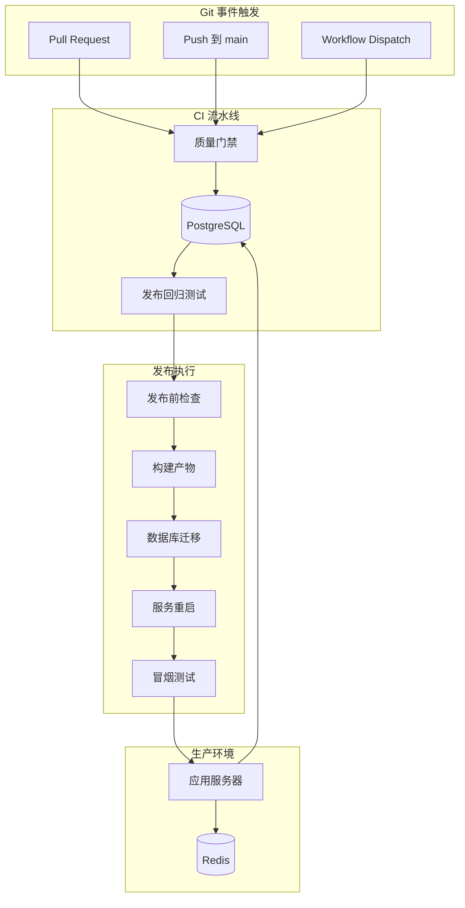
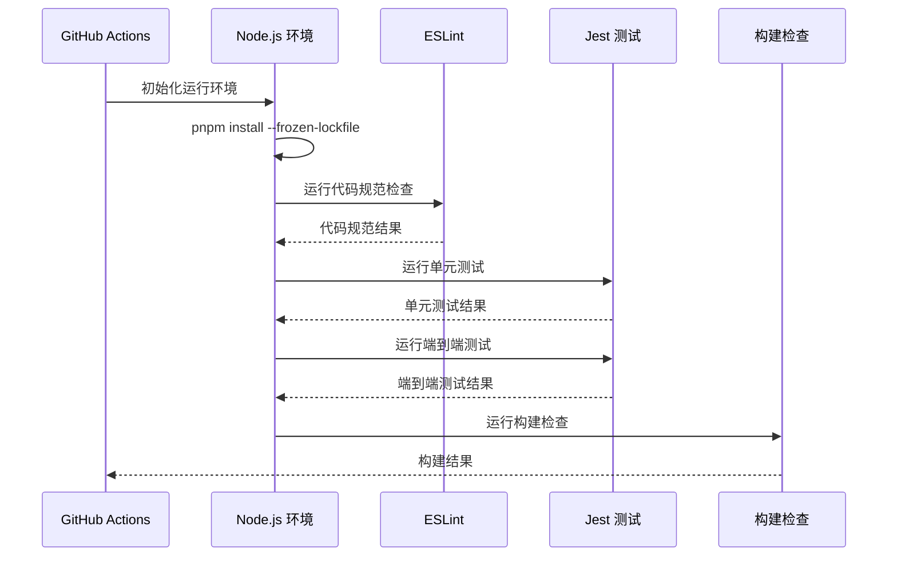
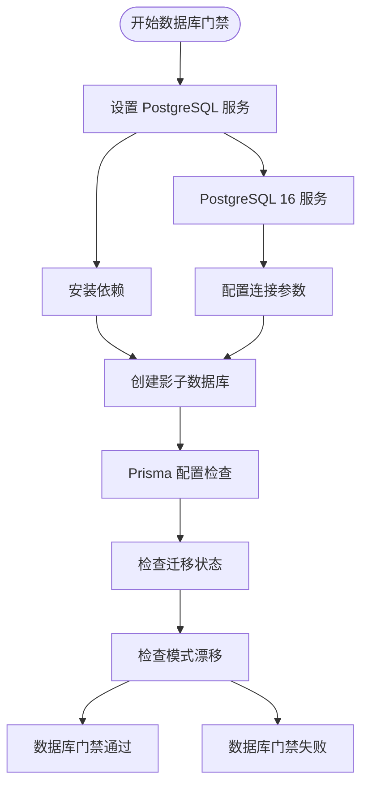
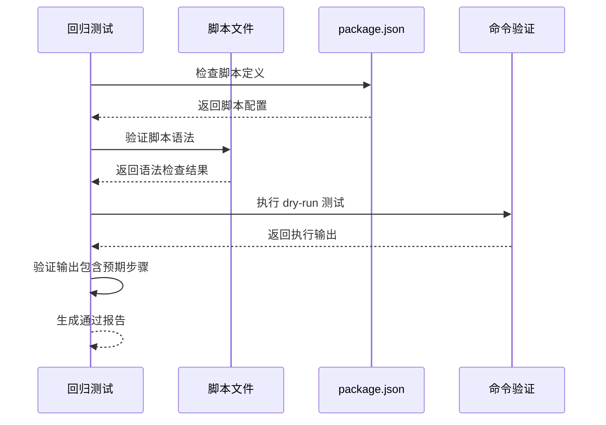
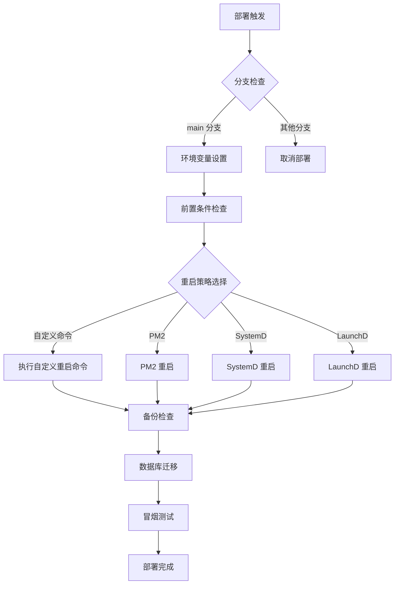
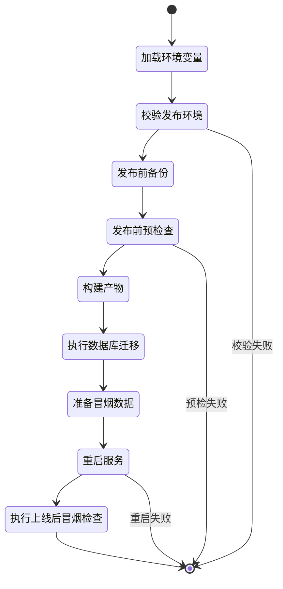
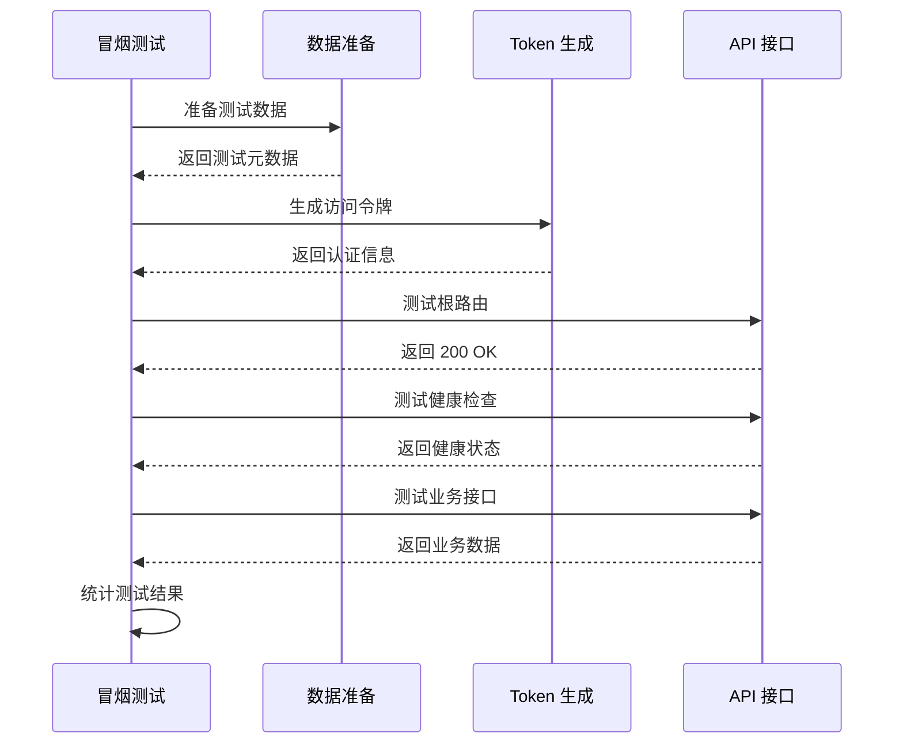
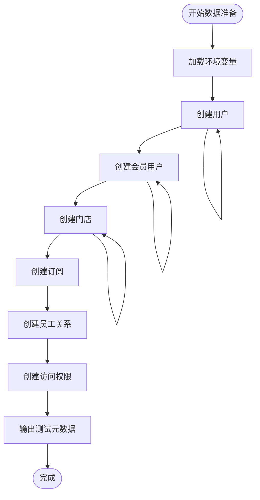
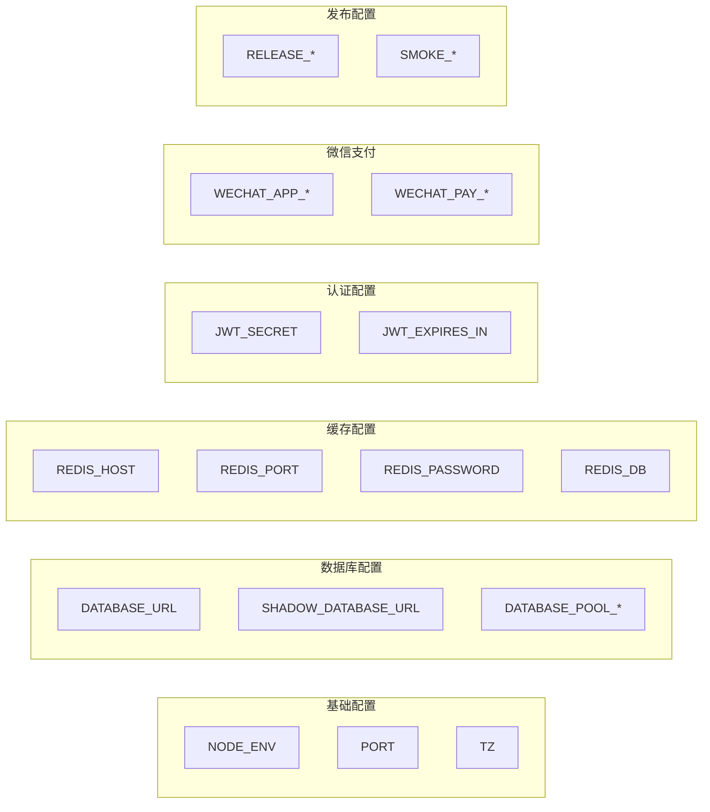

# CI/CD 流水线配置

<cite>
**本文档引用的文件**
- [.github/workflows/ci.yml](file://.github/workflows/ci.yml)
- [.github/workflows/deploy-production.yml](file://.github/workflows/deploy-production.yml)
- [package.json](file://package.json)
- [scripts/release-execute.sh](file://scripts/release-execute.sh)
- [scripts/test-smoke-release-regression.mjs](file://scripts/test-smoke-release-regression.mjs)
- [scripts/seed-owner.mjs](file://scripts/seed-owner.mjs)
- [verify-api-live.sh](file://verify-api-live.sh)
- [prisma.config.ts](file://prisma.config.ts)
- [eslint.config.mjs](file://eslint.config.mjs)
- [tsconfig.json](file://tsconfig.json)
</cite>

## 目录
1. [项目概述](#项目概述)
2. [CI/CD 架构总览](#cicd-架构总览)
3. [质量门禁流水线](#质量门禁流水线)
4. [数据库门禁流水线](#数据库门禁流水线)
5. [发布回归测试](#发布回归测试)
6. [生产环境部署流水线](#生产环境部署流水线)
7. [发布执行脚本详解](#发布执行脚本详解)
8. [冒烟测试体系](#冒烟测试体系)
9. [环境变量管理](#环境变量管理)
10. [性能与可靠性考虑](#性能与可靠性考虑)
11. [故障排除指南](#故障排除指南)
12. [总结](#总结)

## 项目概述

这是一个基于 NestJS 的企业级 Node.js 应用程序，采用现代化的 CI/CD 实践。项目包含三个主要业务模块：purely-profit（商业分析）、purely-club（会员管理）和 purely-pulse（开发者工具），以及完整的数据库迁移和缓存预热机制。

## CI/CD 架构总览

**图表来源**
- [.github/workflows/ci.yml:1-138](file://.github/workflows/ci.yml#L1-L138)
- [.github/workflows/deploy-production.yml:1-173](file://.github/workflows/deploy-production.yml#L1-L173)

## 质量门禁流水线

### 流水线配置概览

质量门禁流水线负责执行代码质量检查、单元测试和端到端测试，确保代码变更符合质量标准。

**图表来源**
- [.github/workflows/ci.yml:19-54](file://.github/workflows/ci.yml#L19-L54)

### 关键特性

- **多语言支持**: 支持 TypeScript 和 JavaScript 源码
- **缓存优化**: 使用 pnpm 包管理器缓存
- **时间限制**: 每个作业最多 30 分钟执行时间
- **并发控制**: 同一工作流内支持取消进行中的作业

**章节来源**
- [.github/workflows/ci.yml:19-54](file://.github/workflows/ci.yml#L19-L54)

## 数据库门禁流水线

### 流水线架构

数据库门禁流水线专门用于验证数据库迁移和模式变更的安全性。

**图表来源**
- [.github/workflows/ci.yml:84-138](file://.github/workflows/ci.yml#L84-L138)

### 数据库配置

- **主数据库**: `purelyprofit_ci`
- **影子数据库**: `purelyprofit_ci_shadow`
- **健康检查**: 使用 `pg_isready` 进行连接验证
- **超时配置**: 5 秒连接超时，最多重试 5 次

**章节来源**
- [.github/workflows/ci.yml:84-138](file://.github/workflows/ci.yml#L84-L138)

## 发布回归测试

### 回归测试机制

发布回归测试确保发布脚本的完整性和正确性，防止发布流程中的潜在问题。

**图表来源**
- [scripts/test-smoke-release-regression.mjs:38-116](file://scripts/test-smoke-release-regression.mjs#L38-L116)

### 测试覆盖范围

- **脚本完整性**: 验证所有相关脚本的存在和功能
- **语法检查**: 确保所有脚本语法正确
- **命令链路**: 验证发布流程中的命令执行顺序
- **Dry-run 模式**: 确认预演模式下的行为正确

**章节来源**
- [scripts/test-smoke-release-regression.mjs:1-116](file://scripts/test-smoke-release-regression.mjs#L1-L116)

## 生产环境部署流水线

### 部署流水线设计

生产环境部署流水线提供了灵活的部署选项和安全保护机制。

**图表来源**
- [.github/workflows/deploy-production.yml:39-173](file://.github/workflows/deploy-production.yml#L39-L173)

### 部署配置选项

| 配置项 | 默认值 | 描述 |
|--------|--------|------|
| `dry_run` | `true` | 是否启用预演模式 |
| `skip_smoke` | `false` | 是否跳过冒烟测试 |
| `skip_db_precheck` | `false` | 是否跳过数据库预检 |
| `skip_build` | `false` | 是否跳过构建步骤 |
| `skip_migrate_deploy` | `false` | 是否跳过数据库迁移 |

**章节来源**
- [.github/workflows/deploy-production.yml:1-173](file://.github/workflows/deploy-production.yml#L1-L173)

## 发布执行脚本详解

### 发布流程架构

发布执行脚本实现了完整的发布生命周期管理。

**图表来源**
- [scripts/release-execute.sh:36-543](file://scripts/release-execute.sh#L36-L543)

### 关键功能模块

#### 环境变量验证
- **生产环境强制检查**: 确保生产环境配置正确
- **敏感信息验证**: 检查数据库连接、Redis 配置等
- **微信支付配置**: 验证支付相关的证书和密钥

#### 备份策略
- **默认备份**: 使用 `pg_dump` 进行数据库备份
- **自定义备份**: 支持用户提供的备份命令
- **保留策略**: 支持配置备份文件保留天数

#### 重启机制
- **多平台支持**: 支持 PM2、SystemD、LaunchD
- **自定义命令**: 允许执行用户自定义的重启命令
- **健康检查**: 验证服务重启后的状态

**章节来源**
- [scripts/release-execute.sh:158-362](file://scripts/release-execute.sh#L158-L362)

## 冒烟测试体系

### 冒烟测试架构

冒烟测试体系确保发布后的系统功能正常运行。

**图表来源**
- [verify-api-live.sh:270-357](file://verify-api-live.sh#L270-L357)

### 测试覆盖范围

#### 基础功能测试
- **根路由测试**: 验证应用基本可达性
- **健康检查**: 确认数据库和 Redis 连接状态
- **指标接口**: 验证监控数据收集

#### 业务功能测试
- **纯利报表**: 测试商业分析核心功能
- **会员资料**: 验证会员管理系统
- **门店切换**: 测试多门店切换功能
- **首屏上下文**: 验证应用启动流程

#### 自动化能力
- **数据准备**: 自动创建测试账户和门店
- **Token 获取**: 动态生成访问令牌
- **路径解析**: 自动计算测试接口路径

**章节来源**
- [verify-api-live.sh:1-357](file://verify-api-live.sh#L1-L357)

### 测试数据准备

测试数据准备脚本实现了幂等的数据创建机制。

**图表来源**
- [scripts/seed-owner.mjs:545-591](file://scripts/seed-owner.mjs#L545-L591)

**章节来源**
- [scripts/seed-owner.mjs:1-591](file://scripts/seed-owner.mjs#L1-L591)

## 环境变量管理

### 环境变量配置

项目使用多种环境变量来控制不同环境的行为：

**图表来源**
- [.github/workflows/deploy-production.yml:48-92](file://.github/workflows/deploy-production.yml#L48-L92)

### 配置优先级

1. **GitHub Secrets**: 生产环境敏感配置
2. **GitHub Variables**: 通用环境变量
3. **本地 .env 文件**: 开发环境配置
4. **默认值**: 脚本内置默认配置

**章节来源**
- [.github/workflows/deploy-production.yml:48-92](file://.github/workflows/deploy-production.yml#L48-L92)

## 性能与可靠性考虑

### 性能优化策略

- **缓存利用**: 使用 pnpm 缓存减少依赖安装时间
- **并发执行**: CI 任务并行处理提高整体效率
- **资源隔离**: 使用独立的影子数据库避免测试干扰
- **超时控制**: 合理的超时设置防止长时间阻塞

### 可靠性保障

- **多重验证**: 多层检查确保发布质量
- **回滚机制**: 备份策略支持快速回滚
- **监控集成**: 健康检查和指标收集
- **错误处理**: 完善的错误捕获和报告机制

## 故障排除指南

### 常见问题诊断

#### CI 流水线失败
1. **依赖安装失败**: 检查 `pnpm-lock.yaml` 文件完整性
2. **代码规范错误**: 运行本地 `pnpm run lint` 检查
3. **测试用例失败**: 查看具体测试错误日志
4. **构建失败**: 检查 TypeScript 编译错误

#### 数据库门禁失败
1. **连接超时**: 检查 PostgreSQL 服务状态
2. **迁移冲突**: 运行 `prisma migrate dev` 解决
3. **权限问题**: 验证数据库用户权限
4. **影子数据库**: 确认影子数据库创建成功

#### 发布失败
1. **环境变量**: 检查生产环境配置
2. **备份失败**: 验证数据库连接和权限
3. **重启失败**: 检查服务管理器配置
4. **冒烟测试**: 查看具体接口错误

### 调试建议

- 使用 `RELEASE_DRY_RUN=true` 预演发布流程
- 启用详细日志输出进行问题定位
- 分步骤执行关键命令进行隔离排查
- 检查网络连接和防火墙配置

## 总结

该项目的 CI/CD 流水线设计体现了现代软件交付的最佳实践：

### 核心优势

1. **多层次质量保证**: 从代码规范到数据库验证的完整检查链
2. **自动化发布流程**: 从预检到部署的全自动化管理
3. **完善的测试体系**: 包含单元测试、端到端测试和冒烟测试
4. **灵活的部署选项**: 支持多种部署平台和服务管理器
5. **强大的监控能力**: 全面的健康检查和指标收集

### 技术特色

- **现代化工具链**: 使用 pnpm、ESLint、Jest 等先进工具
- **类型安全保障**: TypeScript 提供编译时类型检查
- **数据库治理**: Prisma ORM 提供类型安全的数据库操作
- **缓存优化**: Redis 缓存提升系统性能
- **微服务架构**: 清晰的模块划分便于维护和扩展

这套 CI/CD 配置为项目的持续集成和持续部署提供了坚实的技术基础，确保了代码质量和发布可靠性。