# CI/CD 流水线配置

<cite>
**本文档引用的文件**
- [package.json](file://package.json)
- [README.md](file://README.md)
- [jest-e2e.json](file://test/jest-e2e.json)
- [app.e2e-spec.ts](file://test/app.e2e-spec.ts)
- [finance.e2e-spec.ts](file://test/finance.e2e-spec.ts)
- [partner-phase3.e2e-spec.ts](file://test/partner-phase3.e2e-spec.ts)
- [configuration.ts](file://src/config/configuration.ts)
- [prisma.module.ts](file://src/prisma/prisma.module.ts)
- [prisma.service.ts](file://src/prisma/prisma.service.ts)
- [cache-prewarm.service.ts](file://src/redis/cache-prewarm.service.ts)
- [runtime-metrics.summary-context-severity.ts](file://src/observability/runtime-metrics.summary-context-severity.ts)
</cite>

## 目录
1. [简介](#简介)
2. [项目结构](#项目结构)
3. [核心组件](#核心组件)
4. [架构概览](#架构概览)
5. [详细组件分析](#详细组件分析)
6. [依赖关系分析](#依赖关系分析)
7. [性能考虑](#性能考虑)
8. [故障排除指南](#故障排除指南)
9. [结论](#结论)
10. [附录](#附录)

## 简介

本文件为 purelyprofit-server 项目提供完整的 CI/CD 流水线配置文档。该系统基于 NestJS 框架构建，采用 TypeScript 开发，集成了 Prisma ORM 和 Redis 缓存。流水线设计涵盖代码质量检查、自动化测试、构建打包、部署发布等环节，并提供 GitHub Actions 配置示例。

## 项目结构

purelyprofit-server 是一个现代化的企业级 Node.js 应用程序，具有以下关键特征：

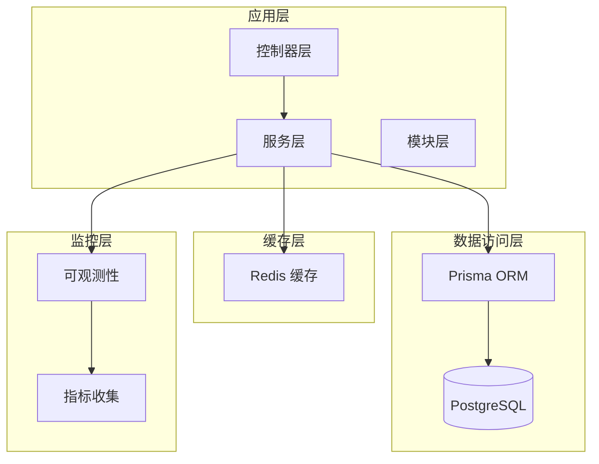

**图表来源**
- [configuration.ts:99-138](file://src/config/configuration.ts#L99-L138)
- [prisma.module.ts](file://src/prisma/prisma.module.ts)
- [cache-prewarm.service.ts](file://src/redis/cache-prewarm.service.ts)

**章节来源**
- [package.json:1-105](file://package.json#L1-L105)
- [README.md:24-71](file://README.md#L24-L71)

## 核心组件

### 构建系统配置

项目使用 NestJS CLI 进行构建管理，支持多种构建模式：

| 构建模式 | 命令 | 用途 | 输出 |
|---------|------|------|------|
| 开发模式 | `pnpm run start:dev` | 本地开发调试 | 热重载服务器 |
| 生产模式 | `pnpm run start:prod` | 生产环境运行 | 预编译 JavaScript |
| 构建模式 | `pnpm run build` | 标准构建 | dist 目录 |

### 测试框架配置

项目采用 Jest 作为测试框架，支持单元测试和端到端测试：

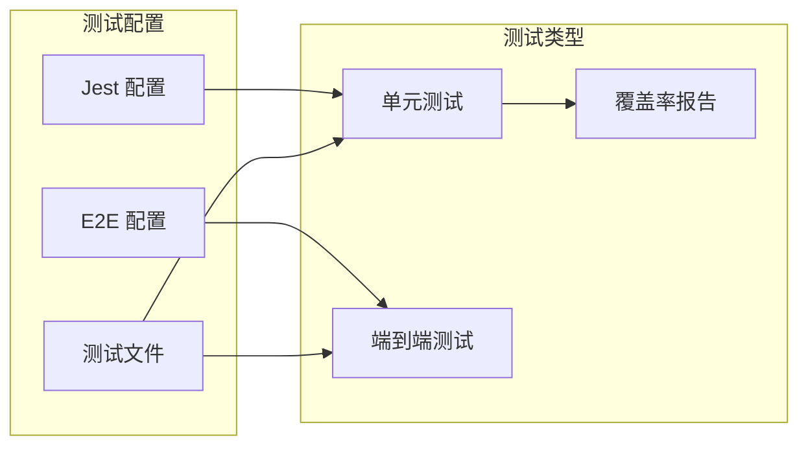

**图表来源**
- [package.json:87-103](file://package.json#L87-L103)
- [jest-e2e.json](file://test/jest-e2e.json)

**章节来源**
- [package.json:8-30](file://package.json#L8-L30)
- [package.json:87-103](file://package.json#L87-L103)

## 架构概览

### CI/CD 流水线架构

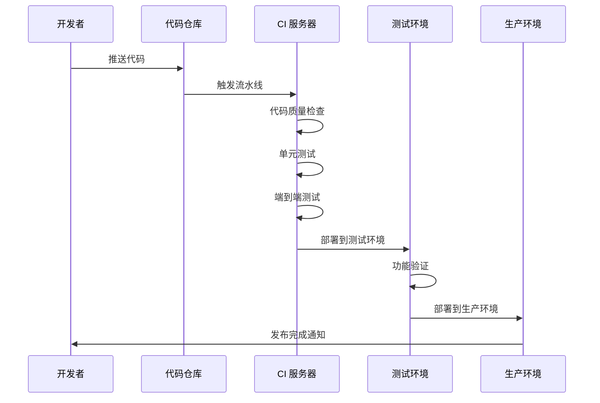

### 分支策略

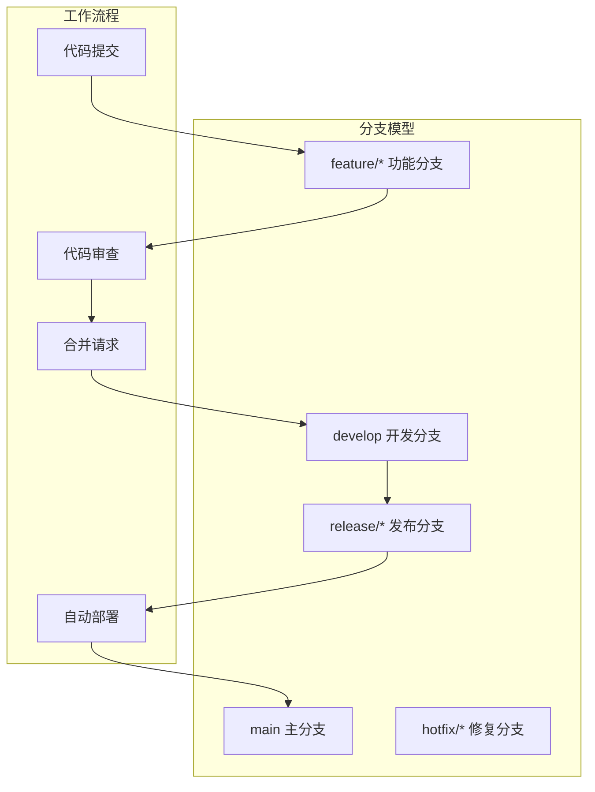

## 详细组件分析

### 代码质量检查

#### ESLint 配置

项目使用 ESLint 进行代码质量检查，支持 TypeScript 文件的静态分析：

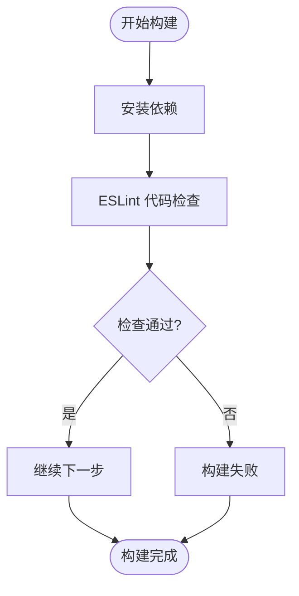

**图表来源**
- [package.json:22-24](file://package.json#L22-L24)

#### 自定义规则检查

项目包含自定义规则检查脚本，用于确保代码风格一致性：

**章节来源**
- [package.json:22-24](file://package.json#L22-L24)

### 自动化测试

#### 单元测试配置

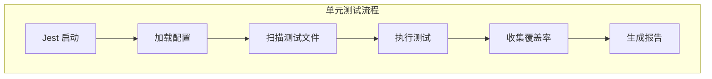

**图表来源**
- [package.json:87-103](file://package.json#L87-L103)

#### 端到端测试

项目支持三种类型的端到端测试场景：

| 测试类型 | 文件名 | 描述 | 覆盖范围 |
|---------|--------|------|----------|
| 应用测试 | app.e2e-spec.ts | 基础功能测试 | 核心业务逻辑 |
| 财务测试 | finance.e2e-spec.ts | 财务模块测试 | 会计和财务功能 |
| 合作伙伴测试 | partner-phase3.e2e-spec.ts | 合作伙伴功能测试 | 商户管理功能 |

**章节来源**
- [app.e2e-spec.ts](file://test/app.e2e-spec.ts)
- [finance.e2e-spec.ts](file://test/finance.e2e-spec.ts)
- [partner-phase3.e2e-spec.ts](file://test/partner-phase3.e2e-spec.ts)

### 构建和打包

#### Prisma 集成

项目使用 Prisma 作为 ORM 工具，支持数据库迁移和查询：

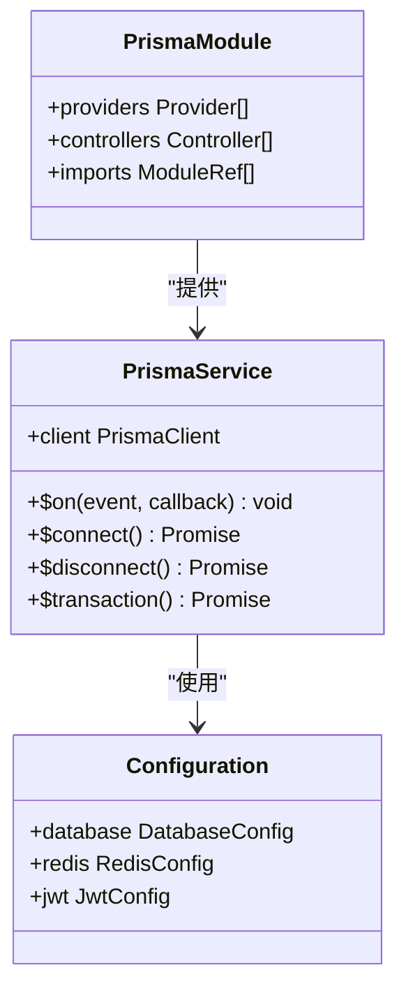

**图表来源**
- [prisma.service.ts](file://src/prisma/prisma.service.ts)
- [prisma.module.ts](file://src/prisma/prisma.module.ts)
- [configuration.ts:99-138](file://src/config/configuration.ts#L99-L138)

#### 缓存预热机制

系统实现智能缓存预热，提升启动性能：

**章节来源**
- [prisma.service.ts](file://src/prisma/prisma.service.ts)
- [cache-prewarm.service.ts](file://src/redis/cache-prewarm.service.ts)

### 部署发布

#### 环境配置

系统支持多环境配置，关键配置项包括：

| 配置类别 | 关键参数 | 默认值 | 用途 |
|---------|----------|--------|------|
| 数据库 | DATABASE_URL | 本地连接 | 数据持久化 |
| Redis | REDIS_HOST, REDIS_PORT | localhost:6379 | 缓存存储 |
| JWT | JWT_SECRET, JWT_EXPIRES_IN | secret, 7d | 认证令牌 |
| 应用设置 | APP_CACHE_PREWARM_* | 性能优化 | 缓存预热 |

**章节来源**
- [configuration.ts:99-138](file://src/config/configuration.ts#L99-L138)

## 依赖关系分析

### 外部依赖

```mermaid
graph TB
subgraph "核心框架"
NestJS[@nestjs/*]
Fastify[Fastify]
Passport[Passport]
end
subgraph "数据库相关"
Prisma[@prisma/*]
PG[pg]
IORedis[ioredis]
end
subgraph "工具库"
Bcrypt[bcryptjs]
ClassTransformer[class-transformer]
ClassValidator[class-validator]
end
subgraph "开发工具"
Jest[jest]
ESLint[eslint]
Prettier[prettier]
end
NestJS --> Prisma
NestJS --> IORedis
Prisma --> PG
NestJS --> Passport
```

**图表来源**
- [package.json:31-58](file://package.json#L31-L58)
- [package.json:59-86](file://package.json#L59-L86)

### 内部模块依赖

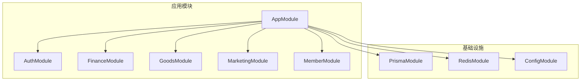

**图表来源**
- [prisma.module.ts](file://src/prisma/prisma.module.ts)

**章节来源**
- [package.json:31-86](file://package.json#L31-L86)

## 性能考虑

### 缓存策略

系统实现多层次缓存策略以优化性能：

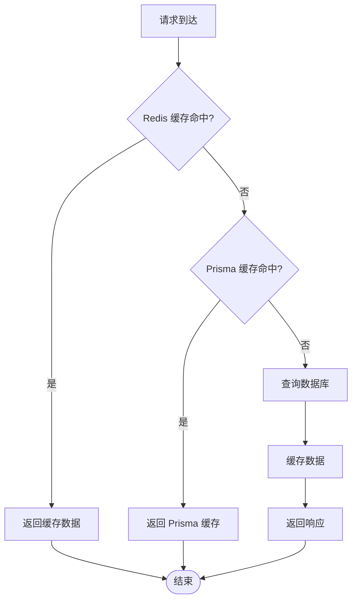

### 监控指标

系统内置可观测性组件，支持运行时性能监控：

**章节来源**
- [runtime-metrics.summary-context-severity.ts:47-93](file://src/observability/runtime-metrics.summary-context-severity.ts#L47-L93)

## 故障排除指南

### 常见问题诊断

#### 数据库连接问题

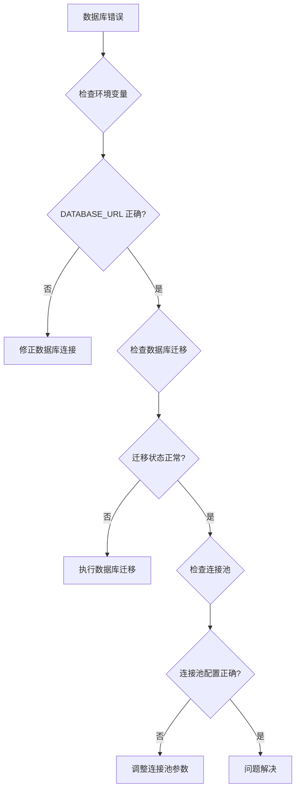

#### 缓存预热失败

**章节来源**
- [cache-prewarm.service.ts](file://src/redis/cache-prewarm.service.ts)

### 测试失败排查

#### 单元测试失败

1. **检查测试依赖**：确认所有模拟对象正确配置
2. **验证异步操作**：确保测试中正确处理 Promise
3. **检查数据库状态**：验证测试前后的数据一致性

#### 端到端测试失败

1. **验证 API 端点**：检查控制器方法的正确性
2. **检查数据库状态**：确认测试数据的完整性
3. **验证认证流程**：确保 JWT 令牌的有效性

## 结论

purelyprofit-server 的 CI/CD 流水线设计遵循现代 DevOps 最佳实践，提供了完整的自动化流程。通过合理的分支策略、严格的代码质量检查、全面的测试覆盖以及智能的部署机制，确保了系统的稳定性和可靠性。

建议在实际实施中根据具体需求调整以下方面：
- 添加 Docker 容器化支持
- 实现蓝绿部署或滚动更新
- 集成 APM 监控工具
- 建立自动化回滚机制

## 附录

### GitHub Actions 配置示例

```yaml
name: CI/CD Pipeline

on:
  push:
    branches: [ main, develop ]
  pull_request:
    branches: [ main ]

jobs:
  build:
    runs-on: ubuntu-latest
    
    strategy:
      matrix:
        node-version: [18.x, 20.x]
    
    steps:
    - uses: actions/checkout@v4
    
    - name: 使用 Node.js ${{ matrix.node-version }}
      uses: actions/setup-node@v4
      with:
        node-version: ${{ matrix.node-version }}
        cache: 'pnpm'
    
    - name: 安装依赖
      run: pnpm install
    
    - name: 代码质量检查
      run: pnpm run lint
    
    - name: 自定义规则检查
      run: pnpm run rules:check
    
    - name: 单元测试
      run: pnpm run test
    
    - name: 端到端测试
      run: pnpm run test:e2e
    
    - name: 生成覆盖率报告
      run: pnpm run test:cov
    
    - name: 构建项目
      run: pnpm run build
    
    - name: 部署到测试环境
      if: github.ref == 'refs/heads/develop'
      run: |
        echo "部署到测试环境"
        # 添加测试环境部署命令
    
    - name: 部署到生产环境
      if: github.ref == 'refs/heads/main'
      run: |
        echo "部署到生产环境"
        # 添加生产环境部署命令
```

### 版本标签管理

建议采用语义化版本控制：
- **主版本号**：不兼容的 API 变更
- **次版本号**：向后兼容的功能新增
- **修订号**：向后兼容的问题修复

标签命名规范：`v1.2.3`

### 回滚机制

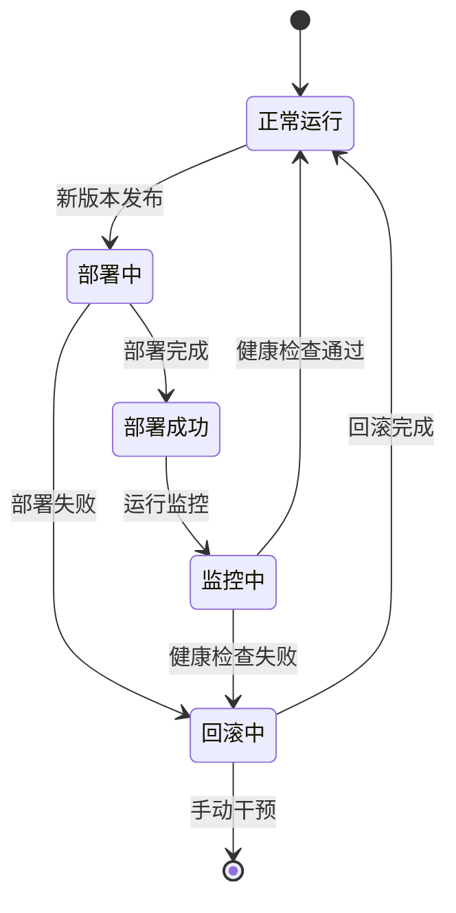