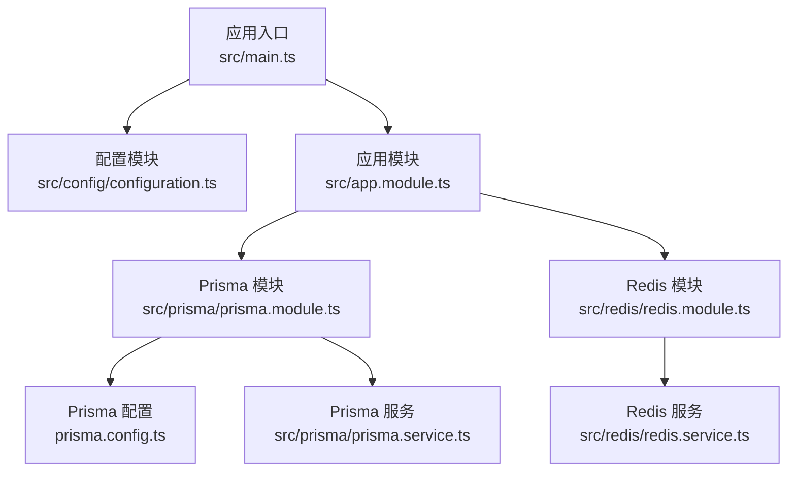
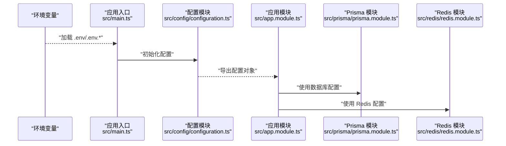
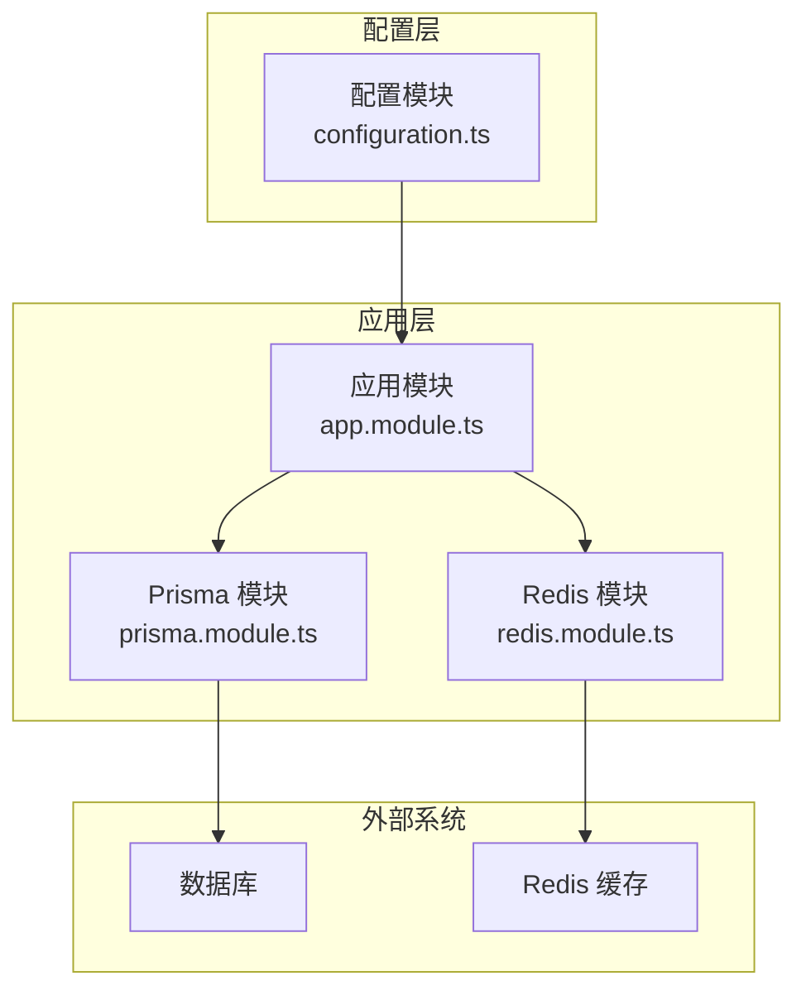
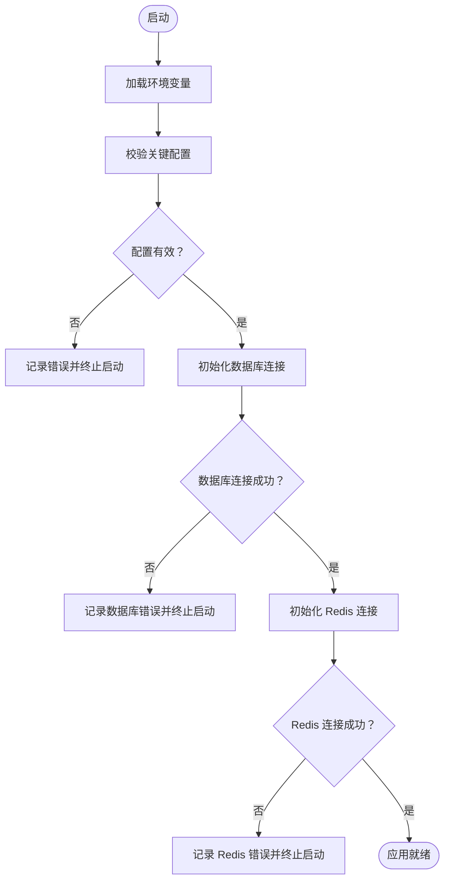

# 环境配置管理

<cite>
**本文引用的文件**
- [src/config/configuration.ts](file://src/config/configuration.ts)
- [prisma.config.ts](file://prisma.config.ts)
- [src/main.ts](file://src/main.ts)
- [src/app.module.ts](file://src/app.module.ts)
- [src/redis/redis.module.ts](file://src/redis/redis.module.ts)
- [src/redis/redis.service.ts](file://src/redis/redis.service.ts)
- [src/prisma/prisma.module.ts](file://src/prisma/prisma.module.ts)
- [src/prisma/prisma.service.ts](file://src/prisma/prisma.service.ts)
- [package.json](file://package.json)
- [README.md](file://README.md)
</cite>

## 目录
1. [简介](#简介)
2. [项目结构](#项目结构)
3. [核心组件](#核心组件)
4. [架构总览](#架构总览)
5. [详细组件分析](#详细组件分析)
6. [依赖关系分析](#依赖关系分析)
7. [性能考虑](#性能考虑)
8. [故障排除指南](#故障排除指南)
9. [结论](#结论)
10. [附录](#附录)

## 简介
本文件面向 purelyprofit-server 的环境配置管理，系统性说明如何在开发、测试与生产环境中正确配置与管理各类环境变量，覆盖数据库连接、Redis 缓存、JWT 密钥、第三方服务凭据等关键要素。文档同时阐述配置文件结构与优先级、安全存储与轮换策略、配置验证与错误处理机制，以及配置变更的审批流程建议，并提供可直接使用的配置模板与示例，帮助开发者快速搭建本地开发环境。

## 项目结构
该项目采用 NestJS 架构，配置主要集中在应用启动阶段加载的配置模块中，并通过 Prisma 与 Redis 模块消费这些配置。整体结构如下：

图表来源
- [src/main.ts](file://src/main.ts)
- [src/config/configuration.ts](file://src/config/configuration.ts)
- [src/app.module.ts](file://src/app.module.ts)
- [src/prisma/prisma.module.ts](file://src/prisma/prisma.module.ts)
- [src/redis/redis.module.ts](file://src/redis/redis.module.ts)
- [prisma.config.ts](file://prisma.config.ts)
- [src/redis/redis.service.ts](file://src/redis/redis.service.ts)
- [src/prisma/prisma.service.ts](file://src/prisma/prisma.service.ts)

章节来源
- [src/main.ts](file://src/main.ts)
- [src/config/configuration.ts](file://src/config/configuration.ts)
- [src/app.module.ts](file://src/app.module.ts)
- [src/prisma/prisma.module.ts](file://src/prisma/prisma.module.ts)
- [src/redis/redis.module.ts](file://src/redis/redis.module.ts)
- [prisma.config.ts](file://prisma.config.ts)

## 核心组件
本节聚焦于应用启动时加载的核心配置模块及其所消费的关键配置项，包括端口、运行环境、CORS、Swagger、日志、HTTP 超时与限流、慢请求/慢查询/慢 Redis 记录阈值、分页大小等；同时说明数据库与 Redis 的配置来源与使用方式。

- 应用配置加载点：应用入口在启动时加载配置模块，随后注入到各业务模块中使用。
- 关键配置项（摘自配置模块）：
  - 基础运行参数：端口、运行环境、CORS 允许来源、Swagger 开关、日志开关、HTTP Keep-Alive 超时、请求超时、请求体大小限制、端口自动偏移开关与最大偏移、慢请求记录开关与阈值、慢查询记录开关与阈值、慢 Redis 记录开关与阈值、默认分页大小、最大分页大小。
  - 这些配置项均来自环境变量，若未设置则采用默认值。
- 数据库配置：通过 Prisma 配置文件读取数据库连接 URL 与影子库 URL（可选），用于迁移与测试环境隔离。
- Redis 配置：由 Redis 模块与服务消费配置模块中的 Redis 相关参数，用于缓存、预热与失效等场景。

章节来源
- [src/config/configuration.ts](file://src/config/configuration.ts)
- [prisma.config.ts](file://prisma.config.ts)
- [src/redis/redis.module.ts](file://src/redis/redis.module.ts)
- [src/redis/redis.service.ts](file://src/redis/redis.service.ts)
- [src/prisma/prisma.module.ts](file://src/prisma/prisma.module.ts)
- [src/prisma/prisma.service.ts](file://src/prisma/prisma.service.ts)

## 架构总览
下图展示从环境变量到应用配置、再到数据库与 Redis 使用的整体流程：

图表来源
- [src/main.ts](file://src/main.ts)
- [src/config/configuration.ts](file://src/config/configuration.ts)
- [src/app.module.ts](file://src/app.module.ts)
- [src/prisma/prisma.module.ts](file://src/prisma/prisma.module.ts)
- [src/redis/redis.module.ts](file://src/redis/redis.module.ts)

## 详细组件分析

### 配置模块与环境变量映射
- 配置模块负责将环境变量解析为强类型配置对象，支持多环境差异化配置与默认值回退。
- 关键配置类别与来源：
  - 基础运行：端口、运行环境、CORS 来源、Swagger 开关、日志开关。
  - HTTP 行为：Keep-Alive 超时、请求超时、请求体大小限制、端口自动偏移开关与最大偏移。
  - 性能观测：慢请求记录开关与阈值、慢查询记录开关与阈值、慢 Redis 记录开关与阈值。
  - 分页控制：默认分页大小、最大分页大小。
- 所有上述配置项均来自环境变量，未设置时采用默认值，确保在不同环境下的一致行为。

章节来源
- [src/config/configuration.ts](file://src/config/configuration.ts)

### 数据库配置（Prisma）
- 数据库连接 URL 与影子库 URL 通过 Prisma 配置文件读取，支持主库与测试/迁移环境的隔离。
- 影子库 URL 可选，若未提供则回退至主库 URL，便于在无独立影子库的环境中进行迁移与测试。

章节来源
- [prisma.config.ts](file://prisma.config.ts)

### Redis 配置与使用
- Redis 配置由 Redis 模块与服务消费配置模块中的相关参数，用于缓存、预热与失效等场景。
- 该模块与服务在应用启动时根据配置建立连接与执行缓存操作。

章节来源
- [src/redis/redis.module.ts](file://src/redis/redis.module.ts)
- [src/redis/redis.service.ts](file://src/redis/redis.service.ts)

### JWT 密钥与认证
- 项目中存在认证相关的策略与守卫，JWT 密钥通常作为环境变量注入，供认证模块使用。
- 建议将密钥存储在安全的密钥管理系统或环境变量中，并定期轮换。

章节来源
- [src/auth/strategies/jwt.strategy.ts](file://src/auth/strategies/jwt.strategy.ts)
- [src/auth/guards/jwt-auth.guard.ts](file://src/auth/guards/jwt-auth.guard.ts)

### 第三方服务凭据
- 第三方服务凭据（如短信、支付、分析等）应以环境变量形式注入，避免硬编码。
- 建议按服务维度分组命名，便于维护与审计。

章节来源
- [src/auth/auth-sms.service.ts](file://src/auth/auth-sms.service.ts)
- [src/auth/auth-authentication.service.ts](file://src/auth/auth-authentication.service.ts)

### 配置验证与错误处理
- 启动阶段对关键配置进行校验，若缺失或格式不合法，应抛出明确错误并终止启动，避免在运行期出现不可预期行为。
- 对于可选配置（如影子库 URL），应在使用前检查其可用性并给出降级提示。

章节来源
- [src/config/configuration.ts](file://src/config/configuration.ts)
- [prisma.config.ts](file://prisma.config.ts)

### 配置变更审批流程（建议）
- 提交流程：提交者在分支中更新配置文件与环境变量，附带变更说明与影响评估。
- 审批流程：至少一名维护者审查，确认安全性、兼容性与回滚方案。
- 发布流程：合并后在 CI 中验证配置有效性，部署到目标环境并进行健康检查。
- 回滚机制：若发布后出现异常，立即回滚到上一个稳定版本并恢复配置。

章节来源
- [src/config/configuration.ts](file://src/config/configuration.ts)
- [prisma.config.ts](file://prisma.config.ts)

## 依赖关系分析
下图展示配置模块与各子系统的依赖关系，强调配置在启动阶段的集中加载与后续消费：

图表来源
- [src/config/configuration.ts](file://src/config/configuration.ts)
- [src/app.module.ts](file://src/app.module.ts)
- [src/prisma/prisma.module.ts](file://src/prisma/prisma.module.ts)
- [src/redis/redis.module.ts](file://src/redis/redis.module.ts)

章节来源
- [src/config/configuration.ts](file://src/config/configuration.ts)
- [src/app.module.ts](file://src/app.module.ts)
- [src/prisma/prisma.module.ts](file://src/prisma/prisma.module.ts)
- [src/redis/redis.module.ts](file://src/redis/redis.module.ts)

## 性能考虑
- 慢请求/慢查询/慢 Redis 记录阈值可通过环境变量灵活调整，建议在生产环境适当提高阈值以减少噪声日志。
- HTTP 请求超时与请求体大小限制需结合业务场景调优，避免过小导致误判或过大造成资源浪费。
- 分页大小的默认与最大值应平衡用户体验与系统负载，防止一次性返回过多数据。

章节来源
- [src/config/configuration.ts](file://src/config/configuration.ts)

## 故障排除指南
- 启动失败：检查关键环境变量是否完整且格式正确（如端口、数据库 URL、Redis 地址等）。若缺失，配置模块会使用默认值，但可能导致连接失败或行为异常。
- 数据库连接问题：确认数据库 URL 与影子库 URL 是否正确，网络连通性是否正常，权限是否足够。
- Redis 连接问题：确认 Redis 地址、密码与超时配置，检查网络连通性与防火墙规则。
- 认证失败：核对 JWT 密钥是否正确注入，密钥长度与格式是否符合要求。
- 性能异常：根据慢请求/慢查询/慢 Redis 阈值调整日志级别与阈值，定位瓶颈。

章节来源
- [src/config/configuration.ts](file://src/config/configuration.ts)
- [prisma.config.ts](file://prisma.config.ts)
- [src/redis/redis.service.ts](file://src/redis/redis.service.ts)
- [src/auth/strategies/jwt.strategy.ts](file://src/auth/strategies/jwt.strategy.ts)

## 结论
本项目通过集中式配置模块统一管理环境变量，并在启动阶段完成验证与注入，确保应用在不同环境下的稳定性与一致性。建议在团队内建立严格的配置变更审批流程，配合密钥轮换与最小权限原则，持续提升系统的安全性与可维护性。

## 附录

### 环境变量清单与用途
- 基础运行
  - PORT：应用监听端口
  - NODE_ENV：运行环境（development/test/production）
  - APP_CORS_ORIGIN：允许跨域来源
  - APP_SWAGGER_ENABLED：是否启用 Swagger 文档
  - APP_LOG_ENABLED：是否启用应用日志
- HTTP 行为
  - APP_HTTP_KEEP_ALIVE_TIMEOUT_MS：HTTP Keep-Alive 超时（毫秒）
  - APP_HTTP_REQUEST_TIMEOUT_MS：HTTP 请求超时（毫秒）
  - APP_HTTP_BODY_LIMIT_BYTES：请求体大小限制（字节）
  - APP_PORT_AUTO_SHIFT_ENABLED：端口自动偏移开关
  - APP_PORT_AUTO_SHIFT_MAX_OFFSET：端口自动偏移最大偏移量
- 性能观测
  - APP_SLOW_REQUEST_LOG_ENABLED：慢请求记录开关
  - APP_SLOW_REQUEST_THRESHOLD_MS：慢请求阈值（毫秒）
  - APP_SLOW_QUERY_LOG_ENABLED：慢查询记录开关
  - APP_SLOW_QUERY_THRESHOLD_MS：慢查询阈值（毫秒）
  - APP_SLOW_REDIS_LOG_ENABLED：慢 Redis 记录开关
  - APP_SLOW_REDIS_THRESHOLD_MS：慢 Redis 阈值（毫秒）
- 分页控制
  - APP_DEFAULT_PAGE_SIZE：默认分页大小
  - APP_MAX_PAGE_SIZE：最大分页大小
- 数据库
  - DATABASE_URL：主数据库连接 URL
  - SHADOW_DATABASE_URL：影子库连接 URL（可选）
- Redis
  - REDIS_HOST：Redis 主机地址
  - REDIS_PORT：Redis 端口
  - REDIS_PASSWORD：Redis 密码（可选）
  - REDIS_DB：Redis 数据库编号
- 认证
  - JWT_SECRET：JWT 密钥
- 第三方服务
  - SMS_APP_KEY：短信服务 App Key
  - SMS_APP_SECRET：短信服务 App Secret
  - PAYMENT_GATEWAY_API_KEY：支付网关 API Key
  - ANALYTICS_API_KEY：分析服务 API Key

章节来源
- [src/config/configuration.ts](file://src/config/configuration.ts)
- [prisma.config.ts](file://prisma.config.ts)
- [src/redis/redis.service.ts](file://src/redis/redis.service.ts)
- [src/auth/strategies/jwt.strategy.ts](file://src/auth/strategies/jwt.strategy.ts)
- [src/auth/auth-sms.service.ts](file://src/auth/auth-sms.service.ts)
- [src/auth/auth-authentication.service.ts](file://src/auth/auth-authentication.service.ts)

### 配置模板与示例
- 开发环境示例（.env.development）
  - NODE_ENV=development
  - APP_SWAGGER_ENABLED=true
  - APP_LOG_ENABLED=true
  - APP_SLOW_REQUEST_LOG_ENABLED=true
  - APP_SLOW_QUERY_LOG_ENABLED=true
  - APP_SLOW_REDIS_LOG_ENABLED=true
  - APP_DEFAULT_PAGE_SIZE=20
  - APP_MAX_PAGE_SIZE=100
  - DATABASE_URL=...
  - SHADOW_DATABASE_URL=...
  - REDIS_HOST=localhost
  - REDIS_PORT=6379
  - REDIS_PASSWORD=
  - REDIS_DB=0
  - JWT_SECRET=...
  - SMS_APP_KEY=...
  - SMS_APP_SECRET=...
  - PAYMENT_GATEWAY_API_KEY=...
  - ANALYTICS_API_KEY=...
- 测试环境示例（.env.test）
  - NODE_ENV=test
  - APP_SWAGGER_ENABLED=false
  - APP_LOG_ENABLED=true
  - APP_SLOW_REQUEST_LOG_ENABLED=true
  - APP_SLOW_QUERY_LOG_ENABLED=true
  - APP_SLOW_REDIS_LOG_ENABLED=true
  - APP_DEFAULT_PAGE_SIZE=20
  - APP_MAX_PAGE_SIZE=100
  - DATABASE_URL=...
  - SHADOW_DATABASE_URL=...
  - REDIS_HOST=localhost
  - REDIS_PORT=6379
  - REDIS_PASSWORD=
  - REDIS_DB=0
  - JWT_SECRET=...
  - SMS_APP_KEY=...
  - SMS_APP_SECRET=...
  - PAYMENT_GATEWAY_API_KEY=...
  - ANALYTICS_API_KEY=...
- 生产环境示例（.env.production）
  - NODE_ENV=production
  - APP_SWAGGER_ENABLED=false
  - APP_LOG_ENABLED=false
  - APP_SLOW_REQUEST_LOG_ENABLED=false
  - APP_SLOW_QUERY_LOG_ENABLED=false
  - APP_SLOW_REDIS_LOG_ENABLED=false
  - APP_DEFAULT_PAGE_SIZE=20
  - APP_MAX_PAGE_SIZE=100
  - DATABASE_URL=...
  - SHADOW_DATABASE_URL=...
  - REDIS_HOST=...
  - REDIS_PORT=...
  - REDIS_PASSWORD=...
  - REDIS_DB=...
  - JWT_SECRET=...
  - SMS_APP_KEY=...
  - SMS_APP_SECRET=...
  - PAYMENT_GATEWAY_API_KEY=...
  - ANALYTICS_API_KEY=...

章节来源
- [src/config/configuration.ts](file://src/config/configuration.ts)
- [prisma.config.ts](file://prisma.config.ts)
- [src/redis/redis.service.ts](file://src/redis/redis.service.ts)
- [src/auth/strategies/jwt.strategy.ts](file://src/auth/strategies/jwt.strategy.ts)
- [src/auth/auth-sms.service.ts](file://src/auth/auth-sms.service.ts)
- [src/auth/auth-authentication.service.ts](file://src/auth/auth-authentication.service.ts)

### 安全存储与轮换策略
- 密钥与敏感信息必须存储在受控的密钥管理系统或加密的环境变量中，禁止提交到版本库。
- 建议采用两把钥匙轮换机制：新旧密钥并行一段时间，验证新密钥生效后再停用旧密钥。
- 定期审计与清理不再使用的密钥，缩短密钥生命周期。
- 在 CI/CD 中使用受限的凭据注入，避免在流水线日志中泄露。

章节来源
- [src/auth/strategies/jwt.strategy.ts](file://src/auth/strategies/jwt.strategy.ts)
- [src/auth/auth-authentication.service.ts](file://src/auth/auth-authentication.service.ts)

### 配置验证与错误处理流程

图表来源
- [src/config/configuration.ts](file://src/config/configuration.ts)
- [prisma.config.ts](file://prisma.config.ts)
- [src/redis/redis.service.ts](file://src/redis/redis.service.ts)