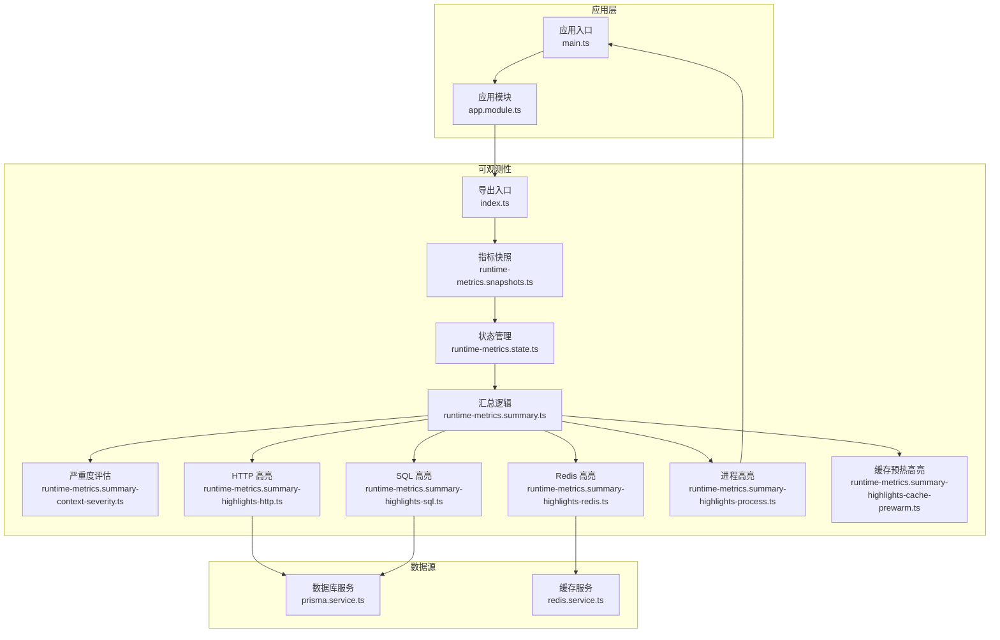
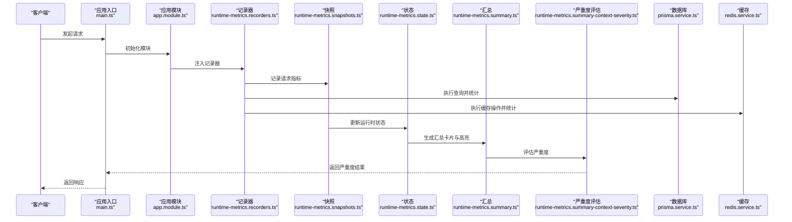
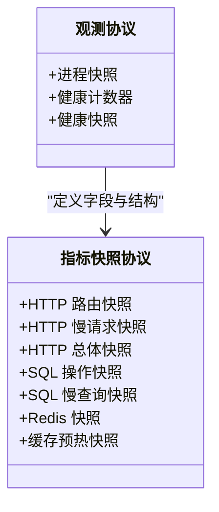
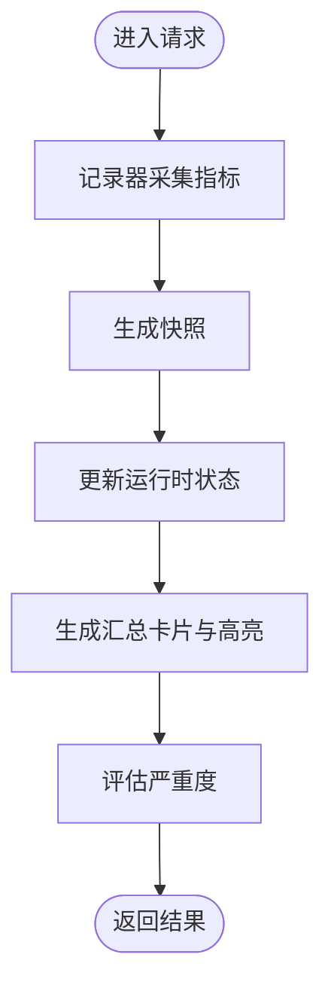
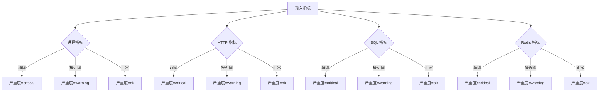
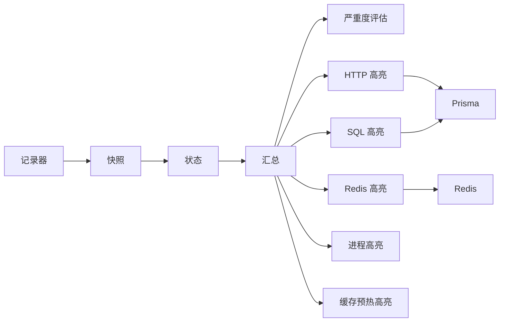

# 监控告警配置

<cite>
**本文引用的文件**
- [src/observability/index.ts](file://src/observability/index.ts)
- [src/observability/observability.protocol.ts](file://src/observability/observability.protocol.ts)
- [src/observability/metrics-snapshot.protocol.ts](file://src/observability/metrics-snapshot.protocol.ts)
- [src/observability/metrics.protocol.ts](file://src/observability/metrics.protocol.ts)
- [src/observability/runtime-metrics.recorders.ts](file://src/observability/runtime-metrics.recorders.ts)
- [src/observability/runtime-metrics.snapshots.ts](file://src/observability/runtime-metrics.snapshots.ts)
- [src/observability/runtime-metrics.state.ts](file://src/observability/runtime-metrics.state.ts)
- [src/observability/runtime-metrics.summary.ts](file://src/observability/runtime-metrics.summary.ts)
- [src/observability/runtime-metrics.summary-context.ts](file://src/observability/runtime-metrics.summary-context.ts)
- [src/observability/runtime-metrics.summary-context-severity.ts](file://src/observability/runtime-metrics.summary-context-severity.ts)
- [src/observability/runtime-metrics.summary-context-actions-http.ts](file://src/observability/runtime-metrics.summary-context-actions-http.ts)
- [src/observability/runtime-metrics.summary-context-actions-sql.ts](file://src/observability/runtime-metrics.summary-context-actions-sql.ts)
- [src/observability/runtime-metrics.summary-context-actions-redis.ts](file://src/observability/runtime-metrics.summary-context-actions-redis.ts)
- [src/observability/runtime-metrics.summary-context-actions-process.ts](file://src/observability/runtime-metrics.summary-context-actions-process.ts)
- [src/observability/runtime-metrics.summary-context-actions-cache-prewarm.ts](file://src/observability/runtime-metrics.summary-context-actions-cache-prewarm.ts)
- [src/observability/runtime-metrics.summary-context-aggregates.ts](file://src/observability/runtime-metrics.summary-context-aggregates.ts)
- [src/observability/runtime-metrics.summary-highlights.ts](file://src/observability/runtime-metrics.summary-highlights.ts)
- [src/observability/runtime-metrics.summary-highlights-http.ts](file://src/observability/runtime-metrics.summary-highlights-http.ts)
- [src/observability/runtime-metrics.summary-highlights-sql.ts](file://src/observability/runtime-metrics.summary-highlights-sql.ts)
- [src/observability/runtime-metrics.summary-highlights-redis.ts](file://src/observability/runtime-metrics.summary-highlights-redis.ts)
- [src/observability/runtime-metrics.summary-highlights-process.ts](file://src/observability/runtime-metrics.summary-highlights-process.ts)
- [src/observability/runtime-metrics.summary-highlights-cache-prewarm.ts](file://src/observability/runtime-metrics.summary-highlights-cache-prewarm.ts)
- [src/observability/runtime-metrics.summary-cards.ts](file://src/observability/runtime-metrics.summary-cards.ts)
- [src/observability/runtime-metrics.summary-actions.ts](file://src/observability/runtime-metrics.summary-actions.ts)
- [src/observability/runtime-metrics.summary-context.types.ts](file://src/observability/runtime-metrics.summary-context.types.ts)
- [src/observability/metrics-summary.protocol.ts](file://src/observability/metrics-summary.protocol.ts)
- [src/metrics-summary.protocol.ts](file://src/metrics-summary.protocol.ts)
- [src/app.module.ts](file://src/app.module.ts)
- [src/main.ts](file://src/main.ts)
- [prisma/prisma.service.ts](file://prisma/prisma.service.ts)
- [src/redis/redis.service.ts](file://src/redis/redis.service.ts)
- [src/redis/cache-prewarm.service.ts](file://src/redis/cache-prewarm.service.ts)
- [src/redis/cache-prewarm.executor.ts](file://src/redis/cache-prewarm.executor.ts)
- [src/redis/cache-prewarm.types.ts](file://src/redis/cache-prewarm.types.ts)
- [src/redis/cache-prewarm.config.ts](file://src/redis/cache-prewarm.config.ts)
- [src/redis/cache-prewarm.log.ts](file://src/redis/cache-prewarm.log.ts)
- [src/redis/cache-prewarm.error.ts](file://src/redis/cache-prewarm.error.ts)
- [src/redis/cache-keys.ts](file://src/redis/cache-keys.ts)
- [src/redis/cache-invalidator.service.ts](file://src/redis/cache-invalidator.service.ts)
- [src/notifications/notifications.service.ts](file://src/notifications/notifications.service.ts)
- [src/notifications/notifications.controller.ts](file://src/notifications/notifications.controller.ts)
- [src/notifications/notifications.types.ts](file://src/notifications/notifications.types.ts)
- [src/notifications/notifications.constants.ts](file://src/notifications/notifications.constants.ts)
- [src/notifications/notifications.mapper.ts](file://src/notifications/notifications.mapper.ts)
- [src/notifications/notifications.query.ts](file://src/notifications/notifications.query.ts)
- [src/notifications/notifications-read-state.service.ts](file://src/notifications/notifications-read-state.service.ts)
- [src/notifications/notifications-build.service.ts](file://src/notifications/notifications-build.service.ts)
- [src/notifications/notifications-context.service.ts](file://src/notifications/notifications-context.service.ts)
- [src/notifications/dto/notifications.dto.ts](file://src/notifications/dto/notifications.dto.ts)
- [src/notifications/notifications.utils.ts](file://src/notifications/notifications.utils.ts)
- [src/config/configuration.ts](file://src/config/configuration.ts)
- [package.json](file://package.json)
</cite>

## 目录
1. [简介](#简介)
2. [项目结构](#项目结构)
3. [核心组件](#核心组件)
4. [架构总览](#架构总览)
5. [详细组件分析](#详细组件分析)
6. [依赖关系分析](#依赖关系分析)
7. [性能考量](#性能考量)
8. [故障排查指南](#故障排查指南)
9. [结论](#结论)
10. [附录](#附录)

## 简介
本文件面向 purelyprofit-server 的监控与告警配置，基于代码库中已实现的可观测性模块，系统化地给出监控指标定义、Prometheus 集成方案、Grafana 仪表板建议、告警规则与阈值、通知渠道集成思路，以及日志聚合与分析方案。文档同时覆盖应用性能监控（APM）、数据库性能监控、缓存性能监控，并提供容量规划与性能基线设定建议。

## 项目结构
纯利润服务器采用 NestJS 架构，可观测性能力集中在 src/observability 目录下，围绕运行时指标快照、汇总、严重度评估与高亮展示展开；同时通过 Prisma 和 Redis 组件提供数据库与缓存层的可观测数据来源。

图表来源
- [src/main.ts:1-50](file://src/main.ts#L1-L50)
- [src/app.module.ts:1-120](file://src/app.module.ts#L1-L120)
- [src/observability/index.ts:1-3](file://src/observability/index.ts#L1-L3)
- [src/observability/runtime-metrics.snapshots.ts:1-200](file://src/observability/runtime-metrics.snapshots.ts#L1-L200)
- [src/observability/runtime-metrics.state.ts:1-200](file://src/observability/runtime-metrics.state.ts#L1-L200)
- [src/observability/runtime-metrics.summary.ts:1-200](file://src/observability/runtime-metrics.summary.ts#L1-L200)
- [src/observability/runtime-metrics.summary-context-severity.ts:1-120](file://src/observability/runtime-metrics.summary-context-severity.ts#L1-L120)
- [src/observability/runtime-metrics.summary-highlights-http.ts:1-200](file://src/observability/runtime-metrics.summary-highlights-http.ts#L1-L200)
- [src/observability/runtime-metrics.summary-highlights-sql.ts:1-200](file://src/observability/runtime-metrics.summary-highlights-sql.ts#L1-L200)
- [src/observability/runtime-metrics.summary-highlights-redis.ts:1-200](file://src/observability/runtime-metrics.summary-highlights-redis.ts#L1-L200)
- [src/observability/runtime-metrics.summary-highlights-process.ts:1-200](file://src/observability/runtime-metrics.summary-highlights-process.ts#L1-L200)
- [src/observability/runtime-metrics.summary-highlights-cache-prewarm.ts:1-200](file://src/observability/runtime-metrics.summary-highlights-cache-prewarm.ts#L1-L200)
- [prisma/prisma.service.ts:1-200](file://prisma/prisma.service.ts#L1-L200)
- [src/redis/redis.service.ts:1-200](file://src/redis/redis.service.ts#L1-L200)

章节来源
- [src/main.ts:1-50](file://src/main.ts#L1-L50)
- [src/app.module.ts:1-120](file://src/app.module.ts#L1-L120)
- [src/observability/index.ts:1-3](file://src/observability/index.ts#L1-L3)

## 核心组件
- 指标快照与协议：定义进程、HTTP、SQL、Redis、缓存预热等维度的快照结构与字段，用于采集与传输。
- 运行时指标记录器：负责在请求生命周期内记录关键指标，形成快照。
- 状态与汇总：维护运行时状态并生成汇总卡片与高亮事件，便于可视化与告警。
- 严重度评估：根据阈值对进程、HTTP、SQL、Redis 等维度进行严重度分级。
- 数据源集成：Prisma 提供 SQL 查询统计，Redis 提供缓存调用与命中率统计。

章节来源
- [src/observability/metrics-snapshot.protocol.ts:1-55](file://src/observability/metrics-snapshot.protocol.ts#L1-L55)
- [src/observability/observability.protocol.ts:1-26](file://src/observability/observability.protocol.ts#L1-L26)
- [src/observability/runtime-metrics.recorders.ts:1-200](file://src/observability/runtime-metrics.recorders.ts#L1-L200)
- [src/observability/runtime-metrics.snapshots.ts:1-200](file://src/observability/runtime-metrics.snapshots.ts#L1-L200)
- [src/observability/runtime-metrics.state.ts:1-200](file://src/observability/runtime-metrics.state.ts#L1-L200)
- [src/observability/runtime-metrics.summary.ts:1-200](file://src/observability/runtime-metrics.summary.ts#L1-L200)
- [src/observability/runtime-metrics.summary-context-severity.ts:1-120](file://src/observability/runtime-metrics.summary-context-severity.ts#L1-L120)
- [prisma/prisma.service.ts:1-200](file://prisma/prisma.service.ts#L1-L200)
- [src/redis/redis.service.ts:1-200](file://src/redis/redis.service.ts#L1-L200)

## 架构总览
下图展示了从应用启动到可观测性数据生成、汇总与告警的整体流程。

图表来源
- [src/main.ts:1-50](file://src/main.ts#L1-L50)
- [src/app.module.ts:1-120](file://src/app.module.ts#L1-L120)
- [src/observability/runtime-metrics.recorders.ts:1-200](file://src/observability/runtime-metrics.recorders.ts#L1-L200)
- [src/observability/runtime-metrics.snapshots.ts:1-200](file://src/observability/runtime-metrics.snapshots.ts#L1-L200)
- [src/observability/runtime-metrics.state.ts:1-200](file://src/observability/runtime-metrics.state.ts#L1-L200)
- [src/observability/runtime-metrics.summary.ts:1-200](file://src/observability/runtime-metrics.summary.ts#L1-L200)
- [src/observability/runtime-metrics.summary-context-severity.ts:1-120](file://src/observability/runtime-metrics.summary-context-severity.ts#L1-L120)
- [prisma/prisma.service.ts:1-200](file://prisma/prisma.service.ts#L1-L200)
- [src/redis/redis.service.ts:1-200](file://src/redis/redis.service.ts#L1-L200)

## 详细组件分析

### 指标快照与协议
- 进程快照：包含 CPU 使用、内存占用、堆信息、外部内存等。
- HTTP 快照：包含总请求数、错误数、慢请求数、平均/最大耗时、慢请求列表等。
- SQL 快照：包含操作类型、查询次数、总耗时、平均耗时等。
- Redis 快照：包含调用次数、慢调用数、命中率、最大耗时等。
- 缓存预热快照：包含预热任务执行情况与异常。

图表来源
- [src/observability/observability.protocol.ts:1-26](file://src/observability/observability.protocol.ts#L1-L26)
- [src/observability/metrics-snapshot.protocol.ts:1-55](file://src/observability/metrics-snapshot.protocol.ts#L1-L55)

章节来源
- [src/observability/observability.protocol.ts:1-26](file://src/observability/observability.protocol.ts#L1-L26)
- [src/observability/metrics-snapshot.protocol.ts:1-55](file://src/observability/metrics-snapshot.protocol.ts#L1-L55)

### 运行时指标记录器与快照
- 记录器在请求处理过程中采集关键指标，形成快照。
- 快照模块负责将指标写入运行时状态，供后续汇总与告警使用。

图表来源
- [src/observability/runtime-metrics.recorders.ts:1-200](file://src/observability/runtime-metrics.recorders.ts#L1-L200)
- [src/observability/runtime-metrics.snapshots.ts:1-200](file://src/observability/runtime-metrics.snapshots.ts#L1-L200)
- [src/observability/runtime-metrics.state.ts:1-200](file://src/observability/runtime-metrics.state.ts#L1-L200)
- [src/observability/runtime-metrics.summary.ts:1-200](file://src/observability/runtime-metrics.summary.ts#L1-L200)
- [src/observability/runtime-metrics.summary-context-severity.ts:1-120](file://src/observability/runtime-metrics.summary-context-severity.ts#L1-L120)

章节来源
- [src/observability/runtime-metrics.recorders.ts:1-200](file://src/observability/runtime-metrics.recorders.ts#L1-L200)
- [src/observability/runtime-metrics.snapshots.ts:1-200](file://src/observability/runtime-metrics.snapshots.ts#L1-L200)
- [src/observability/runtime-metrics.state.ts:1-200](file://src/observability/runtime-metrics.state.ts#L1-L200)
- [src/observability/runtime-metrics.summary.ts:1-200](file://src/observability/runtime-metrics.summary.ts#L1-L200)

### 严重度评估与告警阈值
- 进程：CPU 利用率、内存压力、RSS 上限触发不同级别严重度。
- HTTP：错误率、慢请求比例、最大耗时触发不同级别严重度。
- SQL：慢查询比例、最大耗时触发不同级别严重度。
- Redis：整体命中率、慢调用数、最大耗时触发不同级别严重度。

图表来源
- [src/observability/runtime-metrics.summary-context-severity.ts:47-93](file://src/observability/runtime-metrics.summary-context-severity.ts#L47-L93)

章节来源
- [src/observability/runtime-metrics.summary-context-severity.ts:47-93](file://src/observability/runtime-metrics.summary-context-severity.ts#L47-L93)

### 数据库性能监控（Prisma）
- SQL 操作快照：按操作类型统计查询次数、总耗时、平均耗时。
- 慢查询快照：记录慢查询的耗时、目标、查询预览与捕获时间。
- 建议：结合 Prisma 日志与慢查询分析工具，定位热点与异常查询。

章节来源
- [src/observability/metrics-snapshot.protocol.ts:42-55](file://src/observability/metrics-snapshot.protocol.ts#L42-L55)
- [prisma/prisma.service.ts:1-200](file://prisma/prisma.service.ts#L1-L200)

### 缓存性能监控（Redis）
- Redis 快照：包含调用次数、慢调用数、命中率、最大耗时。
- 建议：结合 Redis 自身监控命令与慢查询日志，识别热点键与过期策略问题。

章节来源
- [src/observability/metrics-snapshot.protocol.ts:1-55](file://src/observability/metrics-snapshot.protocol.ts#L1-L55)
- [src/redis/redis.service.ts:1-200](file://src/redis/redis.service.ts#L1-L200)

### 缓存预热与失效
- 缓存预热：在低峰时段批量加载热点数据，降低冷启动影响。
- 缓存失效：支持按策略或事件触发失效，保障数据一致性。
- 建议：通过高亮模块记录预热与失效事件，纳入告警与容量规划。

章节来源
- [src/redis/cache-prewarm.service.ts:1-200](file://src/redis/cache-prewarm.service.ts#L1-L200)
- [src/redis/cache-prewarm.executor.ts:1-200](file://src/redis/cache-prewarm.executor.ts#L1-L200)
- [src/redis/cache-prewarm.types.ts:1-200](file://src/redis/cache-prewarm.types.ts#L1-L200)
- [src/redis/cache-prewarm.config.ts:1-200](file://src/redis/cache-prewarm.config.ts#L1-L200)
- [src/redis/cache-prewarm.log.ts:1-200](file://src/redis/cache-prewarm.log.ts#L1-L200)
- [src/redis/cache-prewarm.error.ts:1-200](file://src/redis/cache-prewarm.error.ts#L1-L200)
- [src/redis/cache-keys.ts:1-200](file://src/redis/cache-keys.ts#L1-L200)
- [src/redis/cache-invalidator.service.ts:1-200](file://src/redis/cache-invalidator.service.ts#L1-L200)

### 通知与上下文
- 通知服务：提供通知构建、上下文解析、读取状态、查询与映射等功能。
- 建议：将告警事件接入通知服务，统一邮件、Slack、微信等渠道。

章节来源
- [src/notifications/notifications.service.ts:1-200](file://src/notifications/notifications.service.ts#L1-L200)
- [src/notifications/notifications.controller.ts:1-200](file://src/notifications/notifications.controller.ts#L1-L200)
- [src/notifications/notifications.types.ts:1-200](file://src/notifications/notifications.types.ts#L1-L200)
- [src/notifications/notifications.constants.ts:1-200](file://src/notifications/notifications.constants.ts#L1-L200)
- [src/notifications/notifications.mapper.ts:1-200](file://src/notifications/notifications.mapper.ts#L1-L200)
- [src/notifications/notifications.query.ts:1-200](file://src/notifications/notifications.query.ts#L1-L200)
- [src/notifications/notifications-read-state.service.ts:1-200](file://src/notifications/notifications-read-state.service.ts#L1-L200)
- [src/notifications/notifications-build.service.ts:1-200](file://src/notifications/notifications-build.service.ts#L1-L200)
- [src/notifications/notifications-context.service.ts:1-200](file://src/notifications/notifications-context.service.ts#L1-L200)
- [src/notifications/dto/notifications.dto.ts:1-200](file://src/notifications/dto/notifications.dto.ts#L1-L200)
- [src/notifications/notifications.utils.ts:1-200](file://src/notifications/notifications.utils.ts#L1-L200)

## 依赖关系分析
- 模块耦合：可观测性模块通过导出入口集中暴露，应用模块按需注入；记录器与快照模块与状态/汇总模块存在直接依赖。
- 外部依赖：Prisma 与 Redis 作为数据源，提供 SQL 与缓存层指标。
- 建议：避免循环依赖，确保严重度评估与高亮模块独立于业务逻辑。

图表来源
- [src/observability/runtime-metrics.recorders.ts:1-200](file://src/observability/runtime-metrics.recorders.ts#L1-L200)
- [src/observability/runtime-metrics.snapshots.ts:1-200](file://src/observability/runtime-metrics.snapshots.ts#L1-L200)
- [src/observability/runtime-metrics.state.ts:1-200](file://src/observability/runtime-metrics.state.ts#L1-L200)
- [src/observability/runtime-metrics.summary.ts:1-200](file://src/observability/runtime-metrics.summary.ts#L1-L200)
- [src/observability/runtime-metrics.summary-context-severity.ts:1-120](file://src/observability/runtime-metrics.summary-context-severity.ts#L1-L120)
- [src/observability/runtime-metrics.summary-highlights-http.ts:1-200](file://src/observability/runtime-metrics.summary-highlights-http.ts#L1-L200)
- [src/observability/runtime-metrics.summary-highlights-sql.ts:1-200](file://src/observability/runtime-metrics.summary-highlights-sql.ts#L1-L200)
- [src/observability/runtime-metrics.summary-highlights-redis.ts:1-200](file://src/observability/runtime-metrics.summary-highlights-redis.ts#L1-L200)
- [src/observability/runtime-metrics.summary-highlights-process.ts:1-200](file://src/observability/runtime-metrics.summary-highlights-process.ts#L1-L200)
- [src/observability/runtime-metrics.summary-highlights-cache-prewarm.ts:1-200](file://src/observability/runtime-metrics.summary-highlights-cache-prewarm.ts#L1-L200)
- [prisma/prisma.service.ts:1-200](file://prisma/prisma.service.ts#L1-L200)
- [src/redis/redis.service.ts:1-200](file://src/redis/redis.service.ts#L1-L200)

章节来源
- [src/observability/index.ts:1-3](file://src/observability/index.ts#L1-L3)
- [src/observability/runtime-metrics.summary.ts:1-200](file://src/observability/runtime-metrics.summary.ts#L1-L200)

## 性能考量
- 指标采样频率：建议在高并发场景下降低采样频率或采用滑动窗口，避免额外开销。
- 慢查询与慢请求：优先优化慢查询与慢请求，减少对下游依赖的压力。
- 缓存命中率：持续监控命中率变化，及时调整预热策略与过期策略。
- 容量规划：以最大耗时、慢请求比例、慢查询比例与命中率为核心指标，设定基线并定期复盘。

## 故障排查指南
- 进程异常：检查 CPU 利用率、内存压力与 RSS 上限是否触发严重度。
- HTTP 异常：关注错误率、慢请求比例与最大耗时，定位路由级问题。
- SQL 异常：查看慢查询比例与最大耗时，结合慢查询快照定位具体操作与目标。
- Redis 异常：关注命中率、慢调用数与最大耗时，排查热点键与网络延迟。
- 缓存预热：检查预热任务执行日志与错误，确认预热覆盖率与成功率。

章节来源
- [src/observability/runtime-metrics.summary-context-severity.ts:47-93](file://src/observability/runtime-metrics.summary-context-severity.ts#L47-L93)
- [src/observability/metrics-snapshot.protocol.ts:1-55](file://src/observability/metrics-snapshot.protocol.ts#L1-L55)
- [src/redis/cache-prewarm.log.ts:1-200](file://src/redis/cache-prewarm.log.ts#L1-L200)
- [src/redis/cache-prewarm.error.ts:1-200](file://src/redis/cache-prewarm.error.ts#L1-L200)

## 结论
本配置文档基于代码库中的可观测性实现，给出了监控指标定义、集成方案与告警策略。建议在生产环境中结合 Prometheus/Grafana 与通知服务，持续完善阈值与基线，确保系统稳定与可运维性。

## 附录

### Prometheus 集成方案
- 指标导出：将运行时指标汇总模块输出的卡片与高亮事件转换为 Prometheus 指标格式，暴露 HTTP 接口供 Prometheus 抓取。
- 抓取配置：在 Prometheus 中配置抓取目标与间隔，确保覆盖进程、HTTP、SQL、Redis 与缓存预热等维度。
- 告警规则：基于严重度评估阈值编写 PromQL 告警规则，结合通知渠道进行告警分发。

章节来源
- [src/observability/runtime-metrics.summary.ts:1-200](file://src/observability/runtime-metrics.summary.ts#L1-L200)
- [src/observability/runtime-metrics.summary-context-severity.ts:47-93](file://src/observability/runtime-metrics.summary-context-severity.ts#L47-L93)

### Grafana 仪表板配置
- 进程面板：CPU 利用率、内存压力、RSS、堆使用与外部内存。
- HTTP 面板：总请求数、错误率、慢请求比例、平均/最大耗时、慢请求 Top 路由。
- SQL 面板：慢查询比例、最大耗时、慢查询 Top 操作与目标。
- Redis 面板：命中率、慢调用数、最大耗时、慢调用 Top 调用。
- 缓存预热面板：预热任务成功率、失败率、耗时分布。

章节来源
- [src/observability/metrics-snapshot.protocol.ts:1-55](file://src/observability/metrics-snapshot.protocol.ts#L1-L55)
- [src/observability/runtime-metrics.summary-cards.ts:1-200](file://src/observability/runtime-metrics.summary-cards.ts#L1-L200)

### 告警规则与阈值
- 进程：CPU≥85% 或 内存压力≥90% 或 RSS≥1024MB 触发严重；CPU≥60% 或 内存压力≥75% 或 RSS≥768MB 触发警告。
- HTTP：错误率≥10% 或 最大耗时≥1500ms 或 慢请求比例≥30% 触发严重；错误率>0 或 最大耗时≥800ms 或 慢请求比例≥10% 触发警告。
- SQL：慢查询比例≥30% 或 最大耗时≥1000ms 触发严重；慢查询>0 或 最大耗时≥400ms 触发警告。
- Redis：命中率<60% 且 存在解析调用 或 最大耗时≥120ms 或 慢调用≥10 触发严重；命中率<85% 且 存在解析调用 或 最大耗时≥60ms 或 慢调用>0 触发警告。

章节来源
- [src/observability/runtime-metrics.summary-context-severity.ts:47-93](file://src/observability/runtime-metrics.summary-context-severity.ts#L47-L93)

### 通知渠道集成
- 邮件：通过通知服务构建邮件模板与发送队列。
- Slack：集成 Slack Webhook，将告警事件推送到指定频道。
- 微信：对接企业微信或自建推送通道，实现消息触达。
- 建议：统一告警模板，包含严重度、指标详情与处置建议。

章节来源
- [src/notifications/notifications.service.ts:1-200](file://src/notifications/notifications.service.ts#L1-L200)
- [src/notifications/notifications.controller.ts:1-200](file://src/notifications/notifications.controller.ts#L1-L200)
- [src/notifications/notifications.types.ts:1-200](file://src/notifications/notifications.types.ts#L1-L200)
- [src/notifications/notifications.constants.ts:1-200](file://src/notifications/notifications.constants.ts#L1-L200)
- [src/notifications/notifications.mapper.ts:1-200](file://src/notifications/notifications.mapper.ts#L1-L200)
- [src/notifications/notifications.query.ts:1-200](file://src/notifications/notifications.query.ts#L1-L200)
- [src/notifications/notifications-read-state.service.ts:1-200](file://src/notifications/notifications-read-state.service.ts#L1-L200)
- [src/notifications/notifications-build.service.ts:1-200](file://src/notifications/notifications-build.service.ts#L1-L200)
- [src/notifications/notifications-context.service.ts:1-200](file://src/notifications/notifications-context.service.ts#L1-L200)
- [src/notifications/dto/notifications.dto.ts:1-200](file://src/notifications/dto/notifications.dto.ts#L1-L200)
- [src/notifications/notifications.utils.ts:1-200](file://src/notifications/notifications.utils.ts#L1-L200)

### 日志聚合与分析方案
- ELK Stack：收集应用日志、数据库慢查询日志与缓存日志，统一索引与检索。
- Loki + Promtail：轻量替代方案，适合云原生环境。
- 建议：将慢请求、慢查询、缓存预热失败与严重度事件纳入日志流，便于关联分析。

章节来源
- [src/redis/cache-prewarm.log.ts:1-200](file://src/redis/cache-prewarm.log.ts#L1-L200)
- [src/redis/cache-prewarm.error.ts:1-200](file://src/redis/cache-prewarm.error.ts#L1-L200)

### 容量规划与性能基线
- 基线设定：以最大耗时、慢请求比例、慢查询比例、命中率与资源利用率为核心指标，建立月度/季度基线。
- 规划方法：结合业务增长趋势与峰值流量，预留 20%-30% 的冗余空间。
- 复盘机制：每季度对告警事件与性能指标进行回顾，动态调整阈值与基线。

章节来源
- [src/observability/runtime-metrics.summary-context-severity.ts:47-93](file://src/observability/runtime-metrics.summary-context-severity.ts#L47-L93)
- [src/observability/metrics-snapshot.protocol.ts:1-55](file://src/observability/metrics-snapshot.protocol.ts#L1-L55)