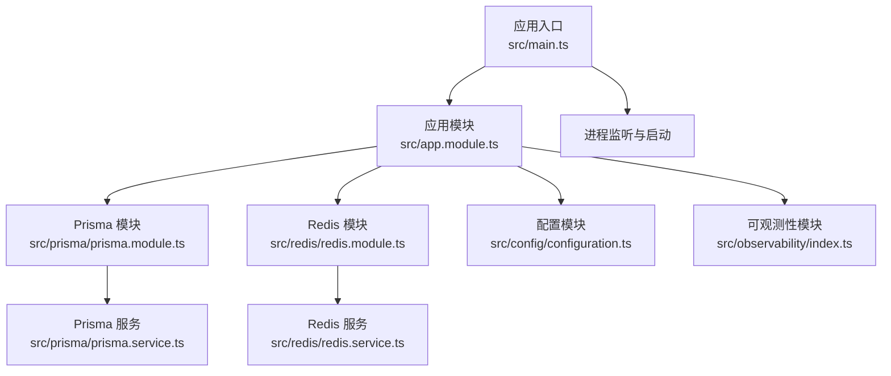
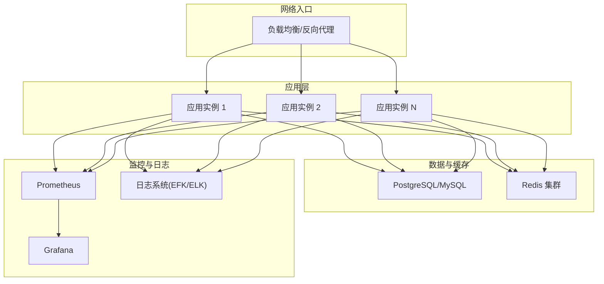
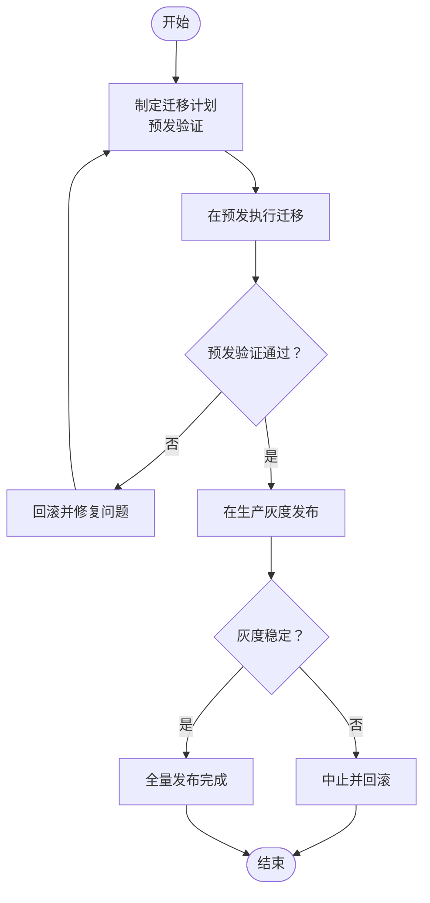
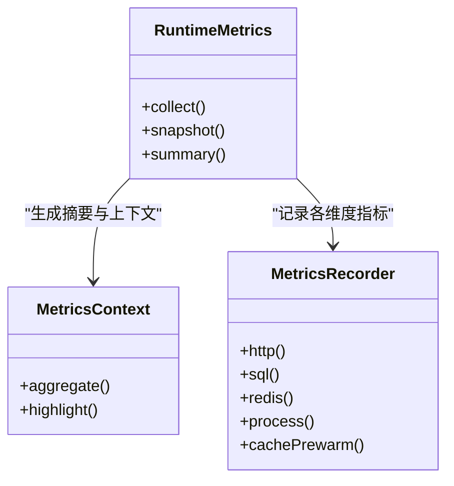
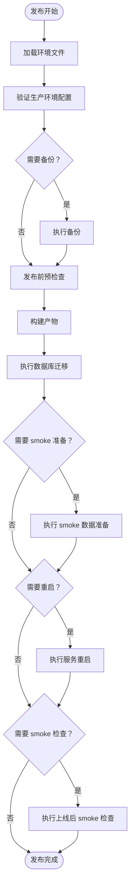
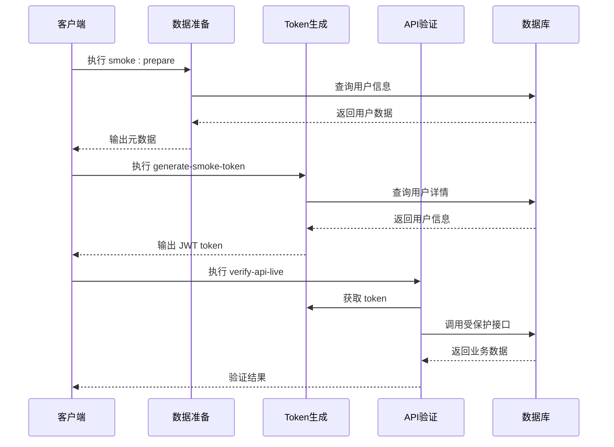
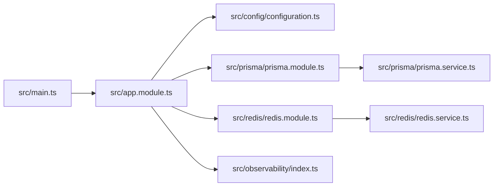

# 部署配置

<cite>
**本文引用的文件**
- [README.md](file://README.md)
- [package.json](file://package.json)
- [prisma.config.ts](file://prisma.config.ts)
- [src/config/configuration.ts](file://src/config/configuration.ts)
- [src/main.ts](file://src/main.ts)
- [src/app.module.ts](file://src/app.module.ts)
- [src/prisma/prisma.module.ts](file://src/prisma/prisma.module.ts)
- [src/prisma/prisma.service.ts](file://src/prisma/prisma.service.ts)
- [src/redis/redis.module.ts](file://src/redis/redis.module.ts)
- [src/redis/redis.service.ts](file://src/redis/redis.service.ts)
- [src/observability/index.ts](file://src/observability/index.ts)
- [src/observability/runtime-metrics.ts](file://src/observability/runtime-metrics.ts)
- [src/observability/runtime-metrics.recorders.ts](file://src/observability/runtime-metrics.recorders.ts)
- [src/observability/runtime-metrics.summary.ts](file://src/observability/runtime-metrics.summary.ts)
- [src/observability/runtime-metrics.summary-context.ts](file://src/observability/runtime-metrics.summary-context.ts)
- [src/observability/runtime-metrics.summary-context-actions.ts](file://src/observability/runtime-metrics.summary-context-actions.ts)
- [src/observability/runtime-metrics.summary-context-actions-http.ts](file://src/observability/runtime-metrics.summary-context-actions-http.ts)
- [src/observability/runtime-metrics.summary-context-actions-sql.ts](file://src/observability/runtime-metrics.summary-context-actions-sql.ts)
- [src/observability/runtime-metrics.summary-context-actions-redis.ts](file://src/observability/runtime-metrics.summary-context-actions-redis.ts)
- [src/observability/runtime-metrics.summary-context-actions-process.ts](file://src/observability/runtime-metrics.summary-context-actions-process.ts)
- [src/observability/runtime-metrics.summary-context-actions-cache-prewarm.ts](file://src/observability/runtime-metrics.summary-context-actions-cache-prewarm.ts)
- [src/observability/runtime-metrics.summary-context-actions-shared.ts](file://src/observability/runtime-metrics.summary-context-actions-shared.ts)
- [src/observability/runtime-metrics.summary-context-severity.ts](file://src/observability/runtime-metrics.summary-context-severity.ts)
- [src/observability/runtime-metrics.summary-highlights.ts](file://src/observability/runtime-metrics.summary-highlights.ts)
- [src/observability/runtime-metrics.summary-highlights-http.ts](file://src/observability/runtime-metrics.summary-highlights-http.ts)
- [src/observability/runtime-metrics.summary-highlights-sql.ts](file://src/observability/runtime-metrics.summary-highlights-sql.ts)
- [src/observability/runtime-metrics.summary-highlights-redis.ts](file://src/observability/runtime-metrics.summary-highlights-redis.ts)
- [src/observability/runtime-metrics.summary-highlights-process.ts](file://src/observability/runtime-metrics.summary-highlights-process.ts)
- [src/observability/runtime-metrics.summary-highlights-cache-prewarm.ts](file://src/observability/runtime-metrics.summary-highlights-cache-prewarm.ts)
- [src/observability/runtime-metrics.summary-highlights-shared.ts](file://src/observability/runtime-metrics.summary-highlights-shared.ts)
- [src/observability/runtime-metrics.summary-context-aggregates.ts](file://src/observability/runtime-metrics.summary-context-aggregates.ts)
- [src/observability/runtime-metrics.summary-context-cache-prewarm.ts](file://src/observability/runtime-metrics.summary-context-cache-prewarm.ts)
- [src/observability/runtime-metrics.summary-context-actions.ts](file://src/observability/runtime-metrics.summary-context-actions.ts)
- [src/observability/runtime-metrics.summary-context.types.ts](file://src/observability/runtime-metrics.summary-context.types.ts)
- [src/observability/runtime-metrics.summary-helpers.ts](file://src/observability/runtime-metrics.summary-helpers.ts)
- [src/observability/runtime-metrics.summary.ts](file://src/observability/runtime-metrics.summary.ts)
- [src/observability/runtime-metrics.snapshots.ts](file://src/observability/runtime-metrics.snapshots.ts)
- [src/observability/runtime-metrics.state.ts](file://src/observability/runtime-metrics.state.ts)
- [src/observability/metrics.protocol.ts](file://src/observability/metrics.protocol.ts)
- [src/observability/metrics-summary.protocol.ts](file://src/observability/metrics-summary.protocol.ts)
- [src/observability/metrics-snapshot.protocol.ts](file://src/observability/metrics-snapshot.protocol.ts)
- [src/observability/observability.protocol.ts](file://src/observability/observability.protocol.ts)
- [prisma/schema.prisma](file://prisma/schema.prisma)
- [prisma/migrations/migration_lock.toml](file://prisma/migrations/migration_lock.toml)
- [scripts/seed-owner.mjs](file://scripts/seed-owner.mjs)
- [scripts/release-execute.sh](file://scripts/release-execute.sh)
- [scripts/test-smoke-release-regression.mjs](file://scripts/test-smoke-release-regression.mjs)
- [scripts/generate-smoke-token.mjs](file://scripts/generate-smoke-token.mjs)
- [verify-api-live.sh](file://verify-api-live.sh)
- [simple-test.sh](file://simple-test.sh)
- [test-api.sh](file://test-api.sh)
</cite>

## 更新摘要
**所做更改**
- 新增发布自动化框架章节，详细介绍 release-execute.sh 脚本的功能与配置
- 增强烟雾测试基础设施章节，包含 smoke 测试脚本、token 生成机制
- 更新 CI/CD 流水线配置，增加发布前验证和自动化回归检查
- 完善生产环境配置验证增强内容
- 添加发布执行保护机制和环境变量校验规则

## 目录
1. [简介](#简介)
2. [项目结构](#项目结构)
3. [核心组件](#核心组件)
4. [架构总览](#架构总览)
5. [详细组件分析](#详细组件分析)
6. [依赖关系分析](#依赖关系分析)
7. [性能考虑](#性能考虑)
8. [故障排查指南](#故障排查指南)
9. [结论](#结论)
10. [附录](#附录)

## 简介
本部署配置文档面向 purelyprofit-server 的生产级上线与运维，覆盖环境配置管理最佳实践、Docker 容器化部署、CI/CD 流水线配置、数据库迁移策略、环境变量要求、监控告警与日志分析、负载均衡与 SSL 证书、故障恢复与备份、以及性能调优建议。文档以仓库现有代码与配置为依据，结合可观测性模块与 Prisma 数据层，给出可落地的部署与运维方案。

**更新** 新增发布自动化框架、增强的可观测性系统、改进的烟雾测试基础设施相关内容。

## 项目结构
purelyprofit-server 是基于 NestJS 的后端服务，采用模块化架构，数据访问通过 Prisma，缓存通过 Redis，可观测性模块提供运行时指标与快照能力。项目根目录包含包管理、构建配置、Prisma 模式与迁移、脚本与测试等。

**图表来源**
- [src/main.ts:1-50](file://src/main.ts#L1-L50)
- [src/app.module.ts:1-120](file://src/app.module.ts#L1-L120)
- [src/prisma/prisma.module.ts:1-80](file://src/prisma/prisma.module.ts#L1-L80)
- [src/redis/redis.module.ts:1-80](file://src/redis/redis.module.ts#L1-L80)
- [src/config/configuration.ts:1-200](file://src/config/configuration.ts#L1-L200)
- [src/observability/index.ts:1-120](file://src/observability/index.ts#L1-L120)

**章节来源**
- [src/main.ts:1-50](file://src/main.ts#L1-L50)
- [src/app.module.ts:1-120](file://src/app.module.ts#L1-L120)
- [src/config/configuration.ts:1-200](file://src/config/configuration.ts#L1-L200)

## 核心组件
- 应用入口与启动：负责创建 Nest 应用实例、加载配置、注册模块并启动 HTTP 服务器。
- 配置管理：集中定义运行时参数（如数据库连接、Redis、JWT、日志级别等），支持多环境差异化。
- 数据持久层：Prisma 模块与服务封装数据库交互；schema.prisma 定义模型与关系；migrations 提供版本化迁移。
- 缓存层：Redis 模块与服务封装缓存与预热逻辑，提升查询性能。
- 可观测性：提供运行时指标、快照、摘要与上下文聚合，支持 HTTP、SQL、Redis、进程、缓存预热等维度的统计与告警。
- **发布自动化框架**：提供完整的发布执行脚本，包含环境验证、备份、迁移、烟雾测试和重启机制。
- **烟雾测试基础设施**：集成 smoke 测试脚本、token 生成机制和自动化验证流程。

**章节来源**
- [src/main.ts:1-50](file://src/main.ts#L1-L50)
- [src/config/configuration.ts:1-200](file://src/config/configuration.ts#L1-L200)
- [src/prisma/prisma.module.ts:1-80](file://src/prisma/prisma.module.ts#L1-L80)
- [src/prisma/prisma.service.ts:1-120](file://src/prisma/prisma.service.ts#L1-L120)
- [src/redis/redis.module.ts:1-80](file://src/redis/redis.module.ts#L1-L80)
- [src/redis/redis.service.ts:1-120](file://src/redis/redis.service.ts#L1-L120)
- [src/observability/index.ts:1-120](file://src/observability/index.ts#L1-L120)

## 架构总览
下图展示生产环境典型拓扑：反向代理（Nginx 或云负载均衡）前置，多个应用实例横向扩展，共享数据库与 Redis 集群，Prometheus/Grafana 进行指标采集与可视化，日志统一由 ELK/EFK 收集分析。

## 详细组件分析

### 配置管理与环境变量
- 配置集中于配置模块，建议按环境拆分（开发、测试、预发、生产），通过环境变量注入，避免硬编码敏感信息。
- 关键配置项包括：数据库连接、Redis 地址与认证、JWT 密钥、日志级别、可观测性开关、跨域与安全头等。
- 生产环境务必启用只读数据库连接、最小权限的数据库账号、TLS 连接与加密存储。

**章节来源**
- [src/config/configuration.ts:1-200](file://src/config/configuration.ts#L1-L200)

### 数据库与迁移策略
- 使用 Prisma 管理数据库模式与迁移，schema.prisma 定义模型，migrations 目录记录历史变更。
- 迁移策略建议：
  - 预发环境先执行迁移并验证；
  - 生产环境采用"零停机"策略：读写分离、灰度发布、回滚计划；
  - 使用 migration_lock.toml 防止并发迁移冲突。
- 初始化种子：可通过脚本初始化超级管理员账户等基础数据。

**图表来源**
- [prisma/migrations/migration_lock.toml:1-200](file://prisma/migrations/migration_lock.toml#L1-L200)
- [prisma/schema.prisma:1-200](file://prisma/schema.prisma#L1-L200)
- [scripts/seed-owner.mjs:1-200](file://scripts/seed-owner.mjs#L1-L200)

**章节来源**
- [prisma/schema.prisma:1-200](file://prisma/schema.prisma#L1-L200)
- [prisma/migrations/migration_lock.toml:1-200](file://prisma/migrations/migration_lock.toml#L1-L200)
- [scripts/seed-owner.mjs:1-200](file://scripts/seed-owner.mjs#L1-L200)

### 缓存与预热
- Redis 用于会话、缓存热点数据与预热，降低数据库压力。
- 建议：
  - 使用集群或哨兵保障高可用；
  - 合理设置过期时间与内存淘汰策略；
  - 在应用启动或定时任务中执行缓存预热，减少冷启动抖动。

**章节来源**
- [src/redis/redis.module.ts:1-80](file://src/redis/redis.module.ts#L1-L80)
- [src/redis/redis.service.ts:1-120](file://src/redis/redis.service.ts#L1-L120)
- [src/observability/runtime-metrics.summary-context-cache-prewarm.ts:1-200](file://src/observability/runtime-metrics.summary-context-cache-prewarm.ts#L1-L200)
- [src/observability/runtime-metrics.summary-context-actions-cache-prewarm.ts:1-200](file://src/observability/runtime-metrics.summary-context-actions-cache-prewarm.ts#L1-L200)

### 可观测性与运行时指标
- 指标体系覆盖 HTTP 请求、SQL 查询、Redis 访问、进程状态、缓存预热等维度，支持摘要与上下文聚合。
- 建议：
  - 将指标暴露给 Prometheus，配合 Grafana 建立仪表盘；
  - 设置阈值告警（如 P95 响应时间、错误率、慢查询占比、缓存命中率）；
  - 结合日志与 Trace 进行关联分析。

**图表来源**
- [src/observability/runtime-metrics.ts:1-200](file://src/observability/runtime-metrics.ts#L1-L200)
- [src/observability/runtime-metrics.summary.ts:1-200](file://src/observability/runtime-metrics.summary.ts#L1-L200)
- [src/observability/runtime-metrics.summary-context.ts:1-200](file://src/observability/runtime-metrics.summary-context.ts#L1-L200)
- [src/observability/runtime-metrics.summary-context-actions.ts:1-200](file://src/observability/runtime-metrics.summary-context-actions.ts#L1-L200)
- [src/observability/runtime-metrics.recorders.ts:1-200](file://src/observability/runtime-metrics.recorders.ts#L1-L200)

**章节来源**
- [src/observability/index.ts:1-120](file://src/observability/index.ts#L1-L120)
- [src/observability/runtime-metrics.ts:1-200](file://src/observability/runtime-metrics.ts#L1-L200)
- [src/observability/runtime-metrics.summary.ts:1-200](file://src/observability/runtime-metrics.summary.ts#L1-L200)
- [src/observability/runtime-metrics.summary-context.ts:1-200](file://src/observability/runtime-metrics.summary-context.ts#L1-L200)
- [src/observability/runtime-metrics.summary-context-actions.ts:1-200](file://src/observability/runtime-metrics.summary-context-actions.ts#L1-L200)
- [src/observability/runtime-metrics.recorders.ts:1-200](file://src/observability/runtime-metrics.recorders.ts#L1-L200)

### 发布自动化框架
**新增** 项目引入了完整的发布自动化框架，通过 release-execute.sh 脚本实现标准化的发布流程。

#### 发布执行脚本功能特性
- **环境变量校验**：自动验证生产环境必需的配置项，包括数据库连接、Redis 配置、JWT 密钥、微信支付配置等
- **备份策略**：支持自定义备份命令或默认的 pg_dump 备份，具备保留期管理
- **迁移部署**：自动执行 Prisma migrate deploy
- **烟雾测试集成**：可选的 smoke 测试执行，支持自定义准备命令
- **重启机制**：支持 pm2、systemd、launchd 等多种重启方式
- **Dry Run 模式**：安全的预演模式，验证整个发布流程

#### 发布流程步骤
1. 环境文件加载与验证
2. 发布前备份（可选）
3. 发布前预检查
4. 构建产物
5. 执行数据库迁移
6. 烟雾测试数据准备（可选）
7. 服务重启（可选）
8. 上线后烟雾检查（可选）

**图表来源**
- [scripts/release-execute.sh:1-480](file://scripts/release-execute.sh#L1-L480)

**章节来源**
- [scripts/release-execute.sh:1-480](file://scripts/release-execute.sh#L1-L480)
- [package.json:25-29](file://package.json#L25-L29)

### 烟雾测试基础设施
**新增** 建立了完整的烟雾测试基础设施，包含数据准备、token 生成和自动化验证流程。

#### 烟雾测试组件
- **smoke 数据准备**：通过 seed-owner.mjs 脚本生成测试数据
- **token 生成机制**：generate-smoke-token.mjs 脚本基于 JWT 生成业务级 token
- **自动化验证**：verify-api-live.sh 脚本执行完整的 API 验证流程
- **回归测试**：test-smoke-release-regression.mjs 确保发布流程完整性

#### 烟雾测试流程
1. 自动准备 smoke 数据上下文
2. 生成业务级 smoke token
3. 验证基础 API 接口
4. 检查健康状态和就绪状态
5. 验证指标接口
6. 执行受保护业务接口测试

**图表来源**
- [scripts/generate-smoke-token.mjs:1-291](file://scripts/generate-smoke-token.mjs#L1-L291)
- [verify-api-live.sh:1-215](file://verify-api-live.sh#L1-L215)

**章节来源**
- [scripts/generate-smoke-token.mjs:1-291](file://scripts/generate-smoke-token.mjs#L1-L291)
- [verify-api-live.sh:1-215](file://verify-api-live.sh#L1-L215)
- [scripts/test-smoke-release-regression.mjs:1-91](file://scripts/test-smoke-release-regression.mjs#L1-L91)

### 负载均衡与 SSL 证书
- 入口层使用 Nginx 或云负载均衡，开启健康检查与会话亲和（如需）。
- SSL 证书通过 ACME 自动签发或传统证书管理流程，确保 HTTPS 强制跳转与 HSTS。
- 建议：
  - 多可用区部署，LB 前置 WAF；
  - 对长连接（WebSocket）与静态资源进行分流。

### Docker 容器化部署
- 建议使用多阶段构建，基础镜像选择官方 Node LTS，安装运行时依赖。
- 容器内以非 root 用户运行，挂载只读根文件系统，限制 CPU/内存配额。
- 通过环境变量注入配置，避免在镜像中嵌入敏感信息。

### CI/CD 流水线
**更新** 增强了 CI/CD 流水线配置，加入发布自动化框架和烟雾测试。

- 触发条件：主分支保护、PR 必须通过单元测试与静态检查。
- 步骤建议：
  - 代码检出与依赖安装；
  - 单元测试与 E2E 测试；
  - 发布前回归检查（包含发布自动化框架验证）；
  - 打包构建与镜像构建；
  - 推送镜像到私有仓库；
  - 预发环境部署与自动化验收；
  - 生产环境蓝绿/金丝雀发布与回滚；
  - 发布后烟雾测试验证。
- 安全扫描：镜像漏洞扫描、依赖供应链检查。

### 监控告警与日志
- 指标：请求量、错误率、响应时间（P50/P95）、慢查询、缓存命中率、队列长度、JVM/进程资源。
- 日志：结构化输出，区分级别；统一采集到日志系统，建立检索与告警规则。
- 告警：基于阈值与趋势异常，设置分级告警与静默窗口。

### 故障恢复与备份
- 数据库备份：定期全量+增量备份，异地容灾；迁移前先备份。
- 缓存：Redis 集群持久化（RDB/AOF），主从切换演练。
- 应用：多副本部署，自动扩缩容；发布失败快速回滚至上一稳定版本。
- 灾备演练：定期进行故障注入与切换演练，验证恢复时间目标（RTO/RPO）。

### 性能调优建议
- 数据库：
  - 为高频查询字段建立索引，定期分析慢查询日志；
  - 使用连接池与只读副本分担压力；
  - 分表分库与读写分离（视业务规模）。
- 缓存：
  - 合理设置 TTL 与热点数据预热；
  - 使用多级缓存（本地缓存+分布式缓存）。
- 应用：
  - 启用压缩与静态资源 CDN；
  - 异步处理耗时任务（消息队列）；
  - 合理设置超时与重试策略。

## 依赖关系分析
应用模块作为核心装配器，依赖配置、Prisma、Redis 与可观测性模块；Prisma 与 Redis 通过各自模块提供服务；可观测性模块贯穿各子系统，形成统一的度量与告警基座。

**图表来源**
- [src/main.ts:1-50](file://src/main.ts#L1-L50)
- [src/app.module.ts:1-120](file://src/app.module.ts#L1-L120)
- [src/config/configuration.ts:1-200](file://src/config/configuration.ts#L1-L200)
- [src/prisma/prisma.module.ts:1-80](file://src/prisma/prisma.module.ts#L1-L80)
- [src/prisma/prisma.service.ts:1-120](file://src/prisma/prisma.service.ts#L1-L120)
- [src/redis/redis.module.ts:1-80](file://src/redis/redis.module.ts#L1-L80)
- [src/redis/redis.service.ts:1-120](file://src/redis/redis.service.ts#L1-L120)
- [src/observability/index.ts:1-120](file://src/observability/index.ts#L1-L120)

**章节来源**
- [src/app.module.ts:1-120](file://src/app.module.ts#L1-L120)
- [src/prisma/prisma.module.ts:1-80](file://src/prisma/prisma.module.ts#L1-L80)
- [src/redis/redis.module.ts:1-80](file://src/redis/redis.module.ts#L1-L80)
- [src/observability/index.ts:1-120](file://src/observability/index.ts#L1-L120)

## 性能考虑
- I/O 优化：数据库与 Redis 的连接池大小、超时与重连策略需根据 QPS 与延迟目标调优。
- 内存与 GC：合理设置 Node.js 堆上限，关注 Full GC 次数与停顿时间。
- 并发与限流：对易被攻击的接口实施速率限制与熔断，防止雪崩。
- 指标驱动：以可观测性数据为依据持续迭代性能瓶颈。

## 故障排查指南
- 启动失败：检查配置模块中的数据库与 Redis 连接参数、证书路径与权限。
- 数据库异常：查看迁移锁状态与迁移日志，确认迁移是否成功执行。
- 缓存不可用：检查 Redis 集群健康状态、密码与网络连通性。
- 指标缺失：确认指标导出端点、Prometheus 抓取配置与标签一致性。
- 日志定位：使用请求 ID 关联日志片段，结合 Trace 追踪链路。
- **发布失败**：检查 release-execute.sh 的环境变量配置、备份命令执行情况、烟雾测试输出。

**章节来源**
- [src/config/configuration.ts:1-200](file://src/config/configuration.ts#L1-L200)
- [prisma/migrations/migration_lock.toml:1-200](file://prisma/migrations/migration_lock.toml#L1-L200)
- [src/observability/runtime-metrics.summary.ts:1-200](file://src/observability/runtime-metrics.summary.ts#L1-L200)

## 结论
通过规范的环境配置管理、严格的数据库迁移流程、完善的可观测性体系、容器化部署以及新增的发布自动化框架与烟雾测试基础设施，purelyprofit-server 可在生产环境中实现高可用、可扩展与可维护。建议将本文档作为上线基线，并结合实际业务流量与 SLA 持续优化。

**更新** 新增的发布自动化框架显著提升了发布的安全性与可靠性，烟雾测试基础设施确保了发布质量，建议在所有生产环境部署中启用这些自动化流程。

## 附录
- 环境变量清单（示例）
  - 数据库：DATABASE_URL
  - Redis：REDIS_URL、REDIS_PASSWORD
  - JWT：JWT_SECRET
  - 日志：LOG_LEVEL
  - 可观测性：METRICS_EXPORTER_ENABLED
  - **发布自动化**：RELEASE_DRY_RUN、RELEASE_FORCE、RELEASE_REQUIRE_BACKUP
  - **烟雾测试**：SMOKE_LOGIN_PHONE、SMOKE_LOGIN_EMAIL、SMOKE_STORE_ID
- Dockerfile 与 docker-compose 示例（建议）
  - 多阶段构建、非 root 用户、只读根文件系统、资源限制
- CI/CD 最小流水线
  - Lint → Test → Release Precheck → Build → Scan → Push Image → Deploy → Smoke Test
- **发布执行保护**
  - 默认受保护模式，需显式设置 RELEASE_FORCE=true 才能执行真实发布
  - Dry Run 模式用于预演整个发布流程
  - 环境变量自动校验，防止生产环境配置错误