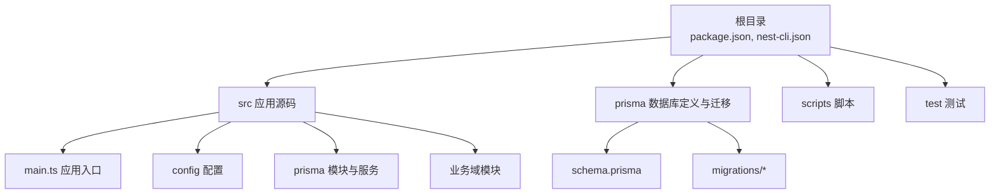
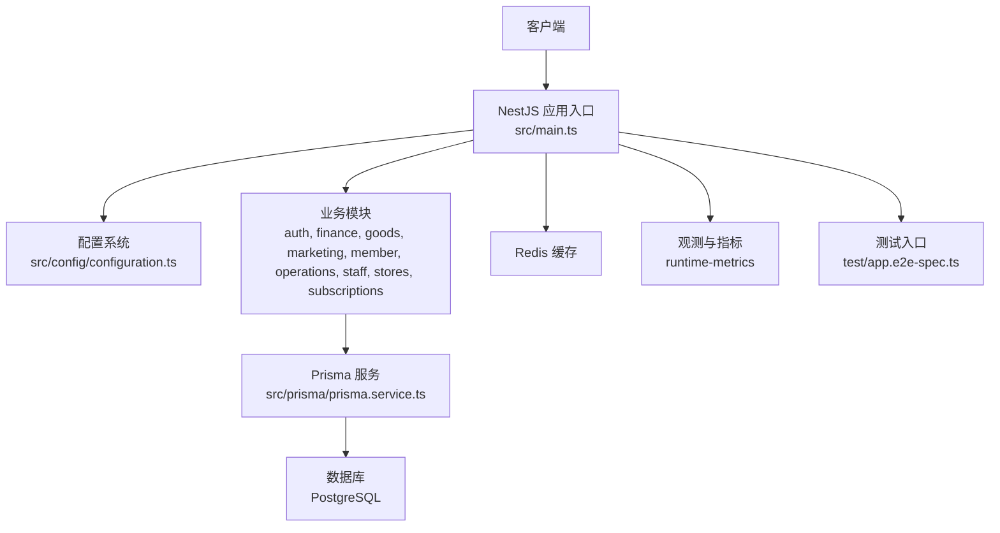
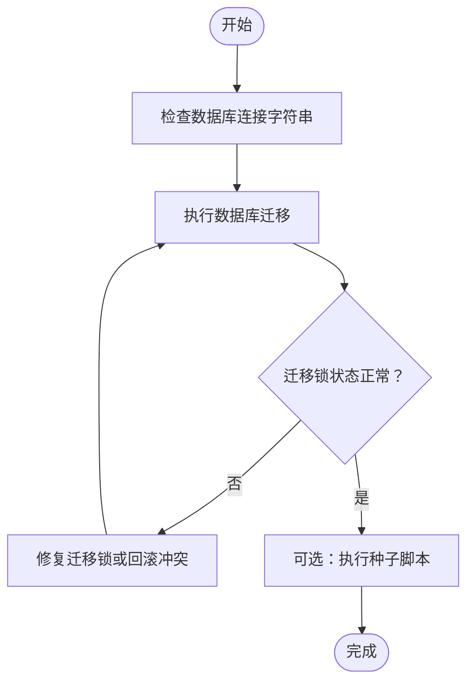
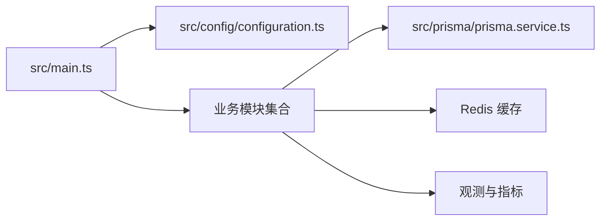

# 快速开始

<cite>
**本文引用的文件**
- [package.json](file://package.json)
- [README.md](file://README.md)
- [src/config/configuration.ts](file://src/config/configuration.ts)
- [prisma/schema.prisma](file://prisma/schema.prisma)
- [scripts/seed-owner.mjs](file://scripts/seed-owner.mjs)
- [nest-cli.json](file://nest-cli.json)
- [src/main.ts](file://src/main.ts)
- [test/app.e2e-spec.ts](file://test/app.e2e-spec.ts)
- [prisma/migrations/migration_lock.toml](file://prisma/migrations/migration_lock.toml)
</cite>

## 目录
1. [简介](#简介)
2. [项目结构](#项目结构)
3. [核心组件](#核心组件)
4. [架构总览](#架构总览)
5. [详细组件分析](#详细组件分析)
6. [依赖关系分析](#依赖关系分析)
7. [性能考虑](#性能考虑)
8. [故障排除指南](#故障排除指南)
9. [结论](#结论)
10. [附录](#附录)

## 简介
本指南面向首次接触 purelyprofit-server 的开发者，帮助你在本地快速完成环境准备、依赖安装、数据库初始化与迁移、环境变量配置，并成功运行开发模式、生产模式与测试流程。文档同时提供常见初始化配置与启动问题排查建议，确保你能以最小成本搭建并稳定运行项目。

## 项目结构
purelyprofit-server 是基于 NestJS 的后端服务，采用模块化架构组织业务域，数据层通过 Prisma 管理数据库模型与迁移。核心目录与职责概览如下：
- 根目录：包管理与构建配置、脚本与测试入口
- src：应用入口、配置、观测与监控、Prisma 模块与服务、各业务域模块
- prisma：数据库 schema 定义与多版本迁移文件
- scripts：种子数据与辅助脚本
- test：端到端测试入口与用例

图表来源
- [package.json](file://package.json)
- [src/main.ts](file://src/main.ts)
- [prisma/schema.prisma](file://prisma/schema.prisma)

章节来源
- [package.json](file://package.json)
- [nest-cli.json](file://nest-cli.json)

## 核心组件
- 应用入口与生命周期：应用通过主入口启动，加载全局模块与中间件，随后进入业务路由处理。
- 配置系统：集中式配置文件用于读取运行时参数（如数据库连接、Redis、JWT 等），支持开发与生产差异化。
- Prisma 数据访问：提供类型安全的数据访问层，配合迁移与种子脚本完成数据库初始化。
- 观测与指标：内置运行时指标与快照收集，便于性能监控与问题定位。
- 测试框架：集成端到端测试入口，便于在 CI 或本地验证核心流程。

章节来源
- [src/main.ts](file://src/main.ts)
- [src/config/configuration.ts](file://src/config/configuration.ts)
- [src/prisma/prisma.module.ts](file://src/prisma/prisma.module.ts)
- [src/prisma/prisma.service.ts](file://src/prisma/prisma.service.ts)
- [src/observability/runtime-metrics.ts](file://src/observability/runtime-metrics.ts)
- [test/app.e2e-spec.ts](file://test/app.e2e-spec.ts)

## 架构总览
下图展示了从请求进入至业务处理与数据持久化的整体流程，以及与数据库、缓存与外部系统的交互关系。

图表来源
- [src/main.ts](file://src/main.ts)
- [src/config/configuration.ts](file://src/config/configuration.ts)
- [src/prisma/prisma.service.ts](file://src/prisma/prisma.service.ts)
- [src/observability/runtime-metrics.ts](file://src/observability/runtime-metrics.ts)
- [test/app.e2e-spec.ts](file://test/app.e2e-spec.ts)

## 详细组件分析

### 环境与依赖准备
- Node.js 版本要求：请参考项目根目录的包管理器与构建配置，确保使用受支持的 Node.js 版本（建议查看包管理器锁定文件与构建配置中的引擎声明）。
- 包管理器：项目使用 pnpm 进行依赖管理与脚本执行。
- 依赖安装：在项目根目录执行依赖安装命令，等待安装完成。

章节来源
- [package.json](file://package.json)
- [nest-cli.json](file://nest-cli.json)

### 数据库配置与初始化
- 数据库类型：项目使用 PostgreSQL 作为主存储。
- 数据库连接：在配置文件中设置数据库连接字符串与相关参数。
- 初始化与迁移：使用 Prisma CLI 执行数据库迁移，确保 schema 与数据一致。
- 种子数据：可选地执行种子脚本，生成初始账户或演示数据。

图表来源
- [prisma/schema.prisma](file://prisma/schema.prisma)
- [prisma/migrations/migration_lock.toml](file://prisma/migrations/migration_lock.toml)
- [scripts/seed-owner.mjs](file://scripts/seed-owner.mjs)

章节来源
- [prisma/schema.prisma](file://prisma/schema.prisma)
- [prisma/migrations/migration_lock.toml](file://prisma/migrations/migration_lock.toml)
- [scripts/seed-owner.mjs](file://scripts/seed-owner.mjs)

### 环境变量设置
- 关键变量：数据库连接、Redis 地址、JWT 密钥、日志级别、可观测性开关等。
- 开发与生产差异：通过配置文件按环境加载不同值；建议为不同环境维护独立的 .env 文件。
- 变更生效：修改后需重启应用以加载新配置。

章节来源
- [src/config/configuration.ts](file://src/config/configuration.ts)

### 开发模式运行
- 启动命令：在项目根目录执行开发模式启动命令，应用将以监听模式运行，自动热更新。
- 常见问题：端口占用、数据库未就绪、配置缺失等，详见“故障排除指南”。

章节来源
- [package.json](file://package.json)

### 生产模式运行
- 构建命令：先进行编译构建，再以生产模式启动。
- 运行命令：以生产模式启动已构建的应用。
- 注意事项：确保数据库与缓存服务可用，且环境变量完整。

章节来源
- [package.json](file://package.json)

### 测试运行
- 端到端测试：通过测试入口文件触发端到端用例，验证核心业务流程。
- 建议：在本地或 CI 中统一执行测试，确保变更不破坏既有功能。

章节来源
- [test/app.e2e-spec.ts](file://test/app.e2e-spec.ts)
- [package.json](file://package.json)

## 依赖关系分析
- 应用入口依赖配置模块与业务模块；业务模块依赖 Prisma 服务与缓存服务；观测模块贯穿于请求链路。
- 外部依赖：数据库（PostgreSQL）、缓存（Redis）、日志与指标系统。

图表来源
- [src/main.ts](file://src/main.ts)
- [src/config/configuration.ts](file://src/config/configuration.ts)
- [src/prisma/prisma.service.ts](file://src/prisma/prisma.service.ts)
- [src/observability/runtime-metrics.ts](file://src/observability/runtime-metrics.ts)

章节来源
- [src/main.ts](file://src/main.ts)
- [src/config/configuration.ts](file://src/config/configuration.ts)
- [src/prisma/prisma.service.ts](file://src/prisma/prisma.service.ts)

## 性能考虑
- 合理使用缓存：通过缓存预热与失效策略降低数据库压力。
- 指标监控：开启运行时指标收集，定期审查关键指标趋势。
- 查询优化：结合索引与分页查询，避免一次性加载大量数据。
- 并发控制：在高并发场景下评估数据库连接池与缓存容量。

## 故障排除指南
- 数据库连接失败
  - 检查数据库连接字符串与网络连通性。
  - 确认数据库服务已启动且监听正确端口。
  - 查看迁移锁状态，必要时清理或回滚冲突迁移。
- 迁移异常
  - 若出现迁移锁，请根据迁移锁文件提示进行处理。
  - 回滚冲突迁移后重新执行迁移。
- 端口占用
  - 开发模式默认端口被占用时，调整配置或释放端口。
- 环境变量缺失
  - 补充缺失的关键变量，确保配置文件加载成功。
- 权限与授权
  - 如遇鉴权相关错误，确认 JWT 密钥与用户权限配置。

章节来源
- [prisma/migrations/migration_lock.toml](file://prisma/migrations/migration_lock.toml)
- [src/config/configuration.ts](file://src/config/configuration.ts)

## 结论
通过本指南，你可以在本地完成环境准备、依赖安装、数据库初始化与迁移、环境变量配置，并成功运行开发模式、生产模式与测试流程。遇到问题时，可依据“故障排除指南”逐项排查。建议在团队内统一环境变量命名与配置规范，以减少部署与运维成本。

## 附录

### 常用命令清单
- 依赖安装：在项目根目录执行依赖安装命令。
- 开发模式：在项目根目录执行开发模式启动命令。
- 生产模式：先构建，再以生产模式启动。
- 测试运行：执行测试入口文件，运行端到端用例。

章节来源
- [package.json](file://package.json)

### 配置文件模板（路径）
- 应用配置：[src/config/configuration.ts](file://src/config/configuration.ts)
- 数据库 schema：[prisma/schema.prisma](file://prisma/schema.prisma)
- 迁移锁文件：[prisma/migrations/migration_lock.toml](file://prisma/migrations/migration_lock.toml)
- 种子脚本：[scripts/seed-owner.mjs](file://scripts/seed-owner.mjs)
- 测试入口：[test/app.e2e-spec.ts](file://test/app.e2e-spec.ts)