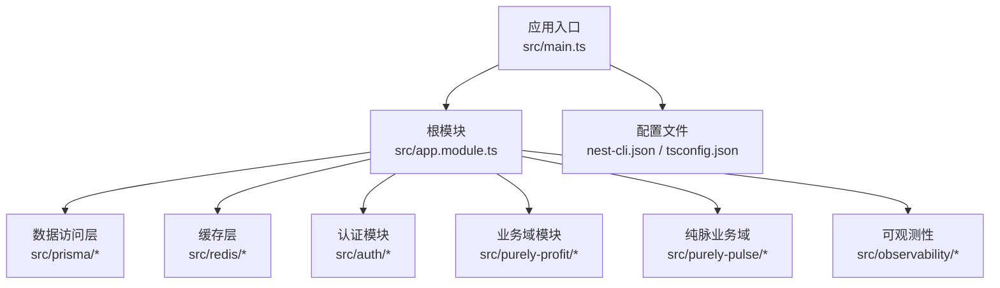
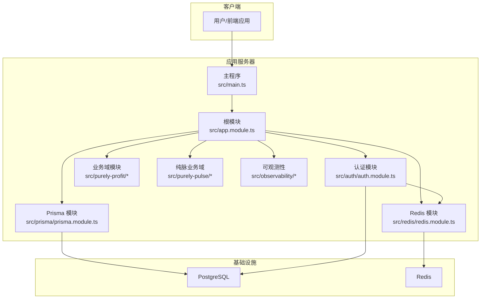
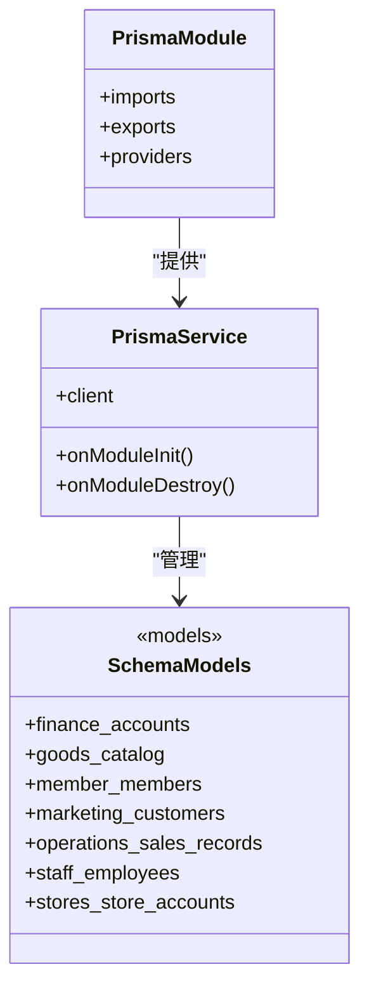
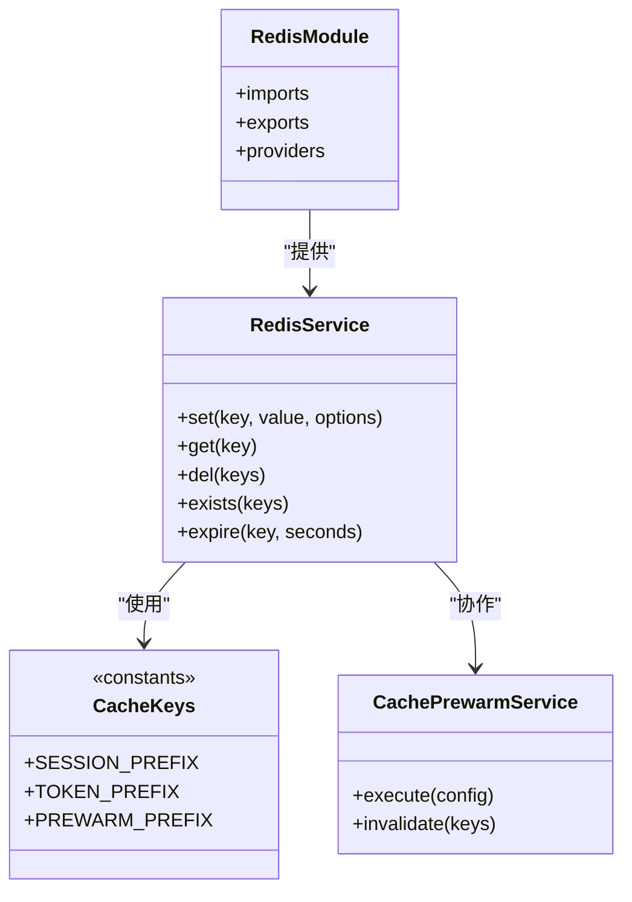
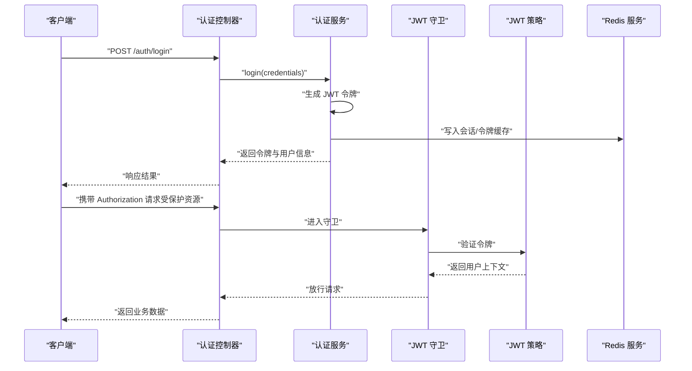
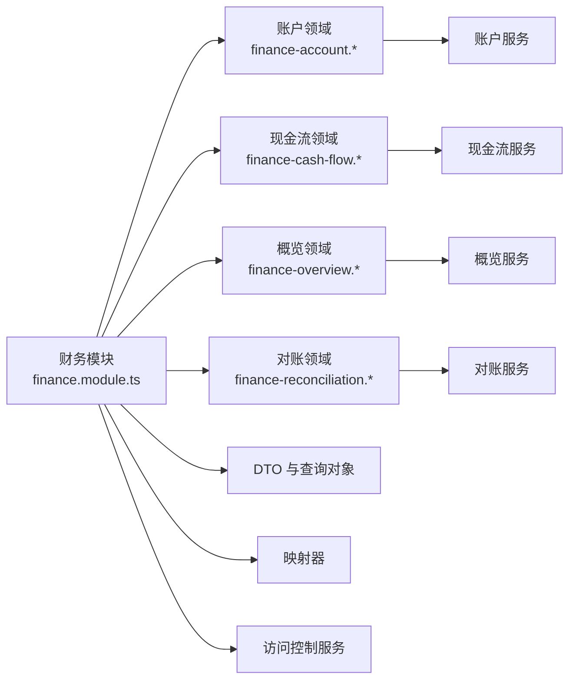
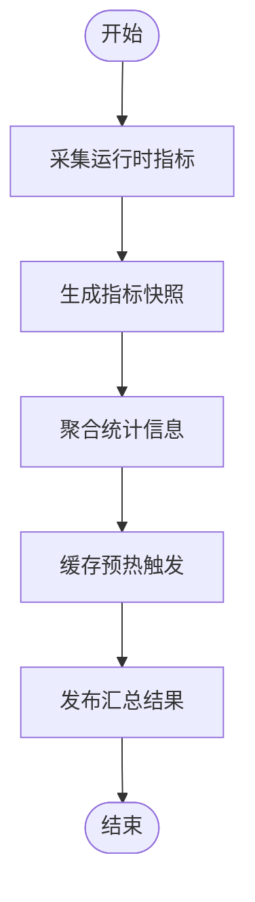
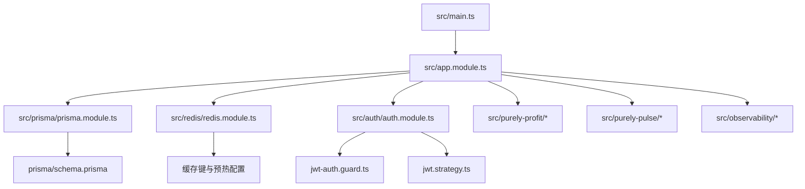

# 技术栈概览

<cite>
**本文档引用的文件**
- [package.json](file://package.json)
- [README.md](file://README.md)
- [nest-cli.json](file://nest-cli.json)
- [tsconfig.json](file://tsconfig.json)
- [prisma/schema.prisma](file://prisma/schema.prisma)
- [src/main.ts](file://src/main.ts)
- [src/app.module.ts](file://src/app.module.ts)
- [src/prisma/prisma.module.ts](file://src/prisma/prisma.module.ts)
- [src/prisma/prisma.service.ts](file://src/prisma/prisma.service.ts)
- [src/redis/redis.module.ts](file://src/redis/redis.module.ts)
- [src/redis/redis.service.ts](file://src/redis/redis.service.ts)
- [src/auth/auth.module.ts](file://src/auth/auth.module.ts)
- [src/auth/guards/jwt-auth.guard.ts](file://src/auth/guards/jwt-auth.guard.ts)
- [src/auth/strategies/jwt.strategy.ts](file://src/auth/strategies/jwt.strategy.ts)
- [eslint.config.mjs](file://eslint.config.mjs)
- [test/jest-e2e.json](file://test/jest-e2e.json)
- [scripts/check-f0rest-rules.mjs](file://scripts/check-f0rest-rules.mjs)
</cite>

## 目录
1. [简介](#简介)
2. [项目结构](#项目结构)
3. [核心组件](#核心组件)
4. [架构总览](#架构总览)
5. [详细组件分析](#详细组件分析)
6. [依赖关系分析](#依赖关系分析)
7. [性能考虑](#性能考虑)
8. [故障排除指南](#故障排除指南)
9. [结论](#结论)
10. [附录](#附录)

## 简介
purelyprofit-server 是一个基于 NestJS 的企业级后端服务，采用 TypeScript 构建，集成了 Prisma ORM、PostgreSQL 数据库、Redis 缓存以及 JWT 认证等核心技术栈。该项目通过模块化设计实现了多业务域（如财务、商品、会员、营销、运营等）的清晰分离，并提供了完善的可观测性与缓存预热机制。

## 项目结构
项目采用 NestJS 标准目录结构，结合 Prisma 和 Redis 的集成方式组织代码：
- 配置层：NestJS CLI 配置、TypeScript 编译配置、ESLint 规则
- 应用入口：主程序启动文件与根模块
- 数据访问层：Prisma 模块与服务封装数据库操作
- 缓存层：Redis 模块与服务封装缓存操作
- 安全认证：JWT 守卫与策略实现身份验证
- 业务域：按功能划分的多个子模块（财务、商品、会员、营销、运营等）
- 可观测性：运行时指标收集与汇总
- 测试：Jest 端到端测试配置

**图表来源**
- [src/main.ts](file://src/main.ts)
- [src/app.module.ts](file://src/app.module.ts)
- [src/prisma/prisma.module.ts](file://src/prisma/prisma.module.ts)
- [src/redis/redis.module.ts](file://src/redis/redis.module.ts)
- [src/auth/auth.module.ts](file://src/auth/auth.module.ts)

**章节来源**
- [nest-cli.json](file://nest-cli.json)
- [tsconfig.json](file://tsconfig.json)
- [src/main.ts](file://src/main.ts)
- [src/app.module.ts](file://src/app.module.ts)

## 核心组件
本节概述项目采用的关键技术及其在系统中的作用与优势：

- NestJS 框架
  - 作为整体应用框架，提供模块化、可扩展的架构支持，便于业务域隔离与依赖注入管理。
  - 支持装饰器驱动的路由与中间件，简化控制器与服务的组织方式。
  - 与 TypeScript 深度集成，提升类型安全与开发体验。

- TypeScript
  - 提供静态类型检查，降低运行时错误风险，增强代码可维护性。
  - 与 NestJS 生态无缝协作，确保模块间接口一致性。

- Prisma ORM
  - 声明式数据库建模与查询，支持多数据库迁移与版本控制。
  - 类型安全的查询构建器，减少 SQL 注入风险并提升开发效率。
  - 多业务域模型（财务、商品、会员、营销、运营等）通过模块化 schema 组织。

- PostgreSQL 数据库
  - 企业级关系型数据库，支持复杂查询与事务处理。
  - 结合 Prisma 进行高效的数据持久化与索引优化。

- Redis 缓存
  - 提供高性能键值存储，支撑会话、令牌缓存与热点数据加速。
  - 配合缓存预热与失效机制，提升系统响应速度与稳定性。

- JWT 认证
  - 基于 JSON Web Token 的无状态认证方案，适配微服务与多端场景。
  - 通过守卫与策略实现统一的权限校验与用户上下文注入。

- 开发工具链
  - ESLint：统一代码风格与质量检查规则。
  - Jest：端到端测试与单元测试框架，保障功能稳定性。
  - PNPM：高性能包管理器，优化依赖安装与版本锁定。

**章节来源**
- [package.json](file://package.json)
- [eslint.config.mjs](file://eslint.config.mjs)
- [test/jest-e2e.json](file://test/jest-e2e.json)

## 架构总览
下图展示了应用的整体架构与关键组件交互关系：

**图表来源**
- [src/main.ts](file://src/main.ts)
- [src/app.module.ts](file://src/app.module.ts)
- [src/prisma/prisma.module.ts](file://src/prisma/prisma.module.ts)
- [src/redis/redis.module.ts](file://src/redis/redis.module.ts)
- [src/auth/auth.module.ts](file://src/auth/auth.module.ts)
- [prisma/schema.prisma](file://prisma/schema.prisma)

## 详细组件分析

### Prisma ORM 组件分析
Prisma 在项目中承担数据建模与访问层职责，通过模块化方式组织不同业务域的模型与查询逻辑。

- 设计要点
  - 模块化导入导出，确保依赖注入与生命周期管理。
  - 服务封装数据库连接与查询，提供统一的访问接口。
  - 多业务域模型通过 Prisma schema 组织，便于维护与扩展。

- 性能与可靠性
  - 使用索引优化查询性能，配合分页与范围查询工具类。
  - 事务与并发控制保证数据一致性。

**图表来源**
- [src/prisma/prisma.module.ts](file://src/prisma/prisma.module.ts)
- [src/prisma/prisma.service.ts](file://src/prisma/prisma.service.ts)
- [prisma/schema.prisma](file://prisma/schema.prisma)

**章节来源**
- [src/prisma/prisma.module.ts](file://src/prisma/prisma.module.ts)
- [src/prisma/prisma.service.ts](file://src/prisma/prisma.service.ts)
- [prisma/schema.prisma](file://prisma/schema.prisma)

### Redis 缓存组件分析
Redis 用于会话、令牌与热点数据缓存，提升系统响应速度与吞吐能力。

- 设计要点
  - 键空间前缀管理，避免命名冲突。
  - 缓存预热执行器与失效器，支持批量预热与失效策略。
  - 与认证流程集成，实现会话与令牌缓存。

- 性能与可靠性
  - 合理设置过期时间与内存淘汰策略。
  - 批量操作与原子性保证，减少网络往返与竞态条件。

**图表来源**
- [src/redis/redis.module.ts](file://src/redis/redis.module.ts)
- [src/redis/redis.service.ts](file://src/redis/redis.service.ts)
- [src/redis/cache-keys.ts](file://src/redis/cache-keys.ts)
- [src/redis/cache-prewarm.service.ts](file://src/redis/cache-prewarm.service.ts)

**章节来源**
- [src/redis/redis.module.ts](file://src/redis/redis.module.ts)
- [src/redis/redis.service.ts](file://src/redis/redis.service.ts)
- [src/redis/cache-keys.ts](file://src/redis/cache-keys.ts)
- [src/redis/cache-prewarm.service.ts](file://src/redis/cache-prewarm.service.ts)

### JWT 认证组件分析
JWT 认证通过守卫与策略实现统一的身份验证与权限控制。

- 设计要点
  - 守卫负责拦截请求并验证令牌有效性。
  - 策略从请求头解析令牌并进行签名校验。
  - 与 Redis 协作实现会话与令牌缓存，提升认证性能。

- 安全性与可靠性
  - 令牌过期与刷新机制，防止长期有效令牌带来的风险。
  - 与权限装饰器配合，实现细粒度的访问控制。

**图表来源**
- [src/auth/auth.module.ts](file://src/auth/auth.module.ts)
- [src/auth/guards/jwt-auth.guard.ts](file://src/auth/guards/jwt-auth.guard.ts)
- [src/auth/strategies/jwt.strategy.ts](file://src/auth/strategies/jwt.strategy.ts)
- [src/redis/redis.service.ts](file://src/redis/redis.service.ts)

**章节来源**
- [src/auth/auth.module.ts](file://src/auth/auth.module.ts)
- [src/auth/guards/jwt-auth.guard.ts](file://src/auth/guards/jwt-auth.guard.ts)
- [src/auth/strategies/jwt.strategy.ts](file://src/auth/strategies/jwt.strategy.ts)
- [src/redis/redis.service.ts](file://src/redis/redis.service.ts)

### 业务域模块分析
项目包含多个业务域模块，涵盖财务、商品、会员、营销、运营等核心功能。以下以财务域为例展示模块化设计：

- 设计要点
  - 每个领域包含独立的服务、查询、映射器与访问控制逻辑。
  - DTO 与查询对象标准化输入输出，提升接口一致性。
  - 访问控制服务确保权限校验贯穿业务流程。

- 可扩展性
  - 新增领域时遵循相同结构，降低学习成本与维护难度。
  - 查询工具类与分页/范围工具类提供通用能力复用。

**图表来源**
- [src/purely-profit/finance/finance.module.ts](file://src/purely-profit/finance/finance.module.ts)
- [src/purely-profit/finance/finance.service.ts](file://src/purely-profit/finance/finance.service.ts)
- [src/purely-profit/finance/finance-account.service.ts](file://src/purely-profit/finance/finance-account.service.ts)
- [src/purely-profit/finance/finance-cash-flow.service.ts](file://src/purely-profit/finance/finance-cash-flow.service.ts)
- [src/purely-profit/finance/finance-overview.service.ts](file://src/purely-profit/finance/finance-overview.service.ts)
- [src/purely-profit/finance/finance-reconciliation.service.ts](file://src/purely-profit/finance/finance-reconciliation.service.ts)

**章节来源**
- [src/purely-profit/finance/finance.module.ts](file://src/purely-profit/finance/finance.module.ts)
- [src/purely-profit/finance/finance.service.ts](file://src/purely-profit/finance/finance.service.ts)

### 可观测性组件分析
可观测性模块负责运行时指标的采集、快照与汇总，支持性能监控与问题定位。

- 设计要点
  - 指标协议定义标准化的数据结构与字段。
  - 快照与汇总逻辑分离，支持灵活的统计策略。
  - 与缓存预热协作，提升后续查询性能。

- 可靠性
  - 异常情况下的降级与重试机制，确保监控数据不丢失。
  - 日志与错误追踪，辅助问题诊断与修复。

**图表来源**
- [src/observability/runtime-metrics.ts](file://src/observability/runtime-metrics.ts)
- [src/observability/runtime-metrics.summary.ts](file://src/observability/runtime-metrics.summary.ts)
- [src/redis/cache-prewarm.service.ts](file://src/redis/cache-prewarm.service.ts)

**章节来源**
- [src/observability/runtime-metrics.ts](file://src/observability/runtime-metrics.ts)
- [src/observability/runtime-metrics.summary.ts](file://src/observability/runtime-metrics.summary.ts)
- [src/redis/cache-prewarm.service.ts](file://src/redis/cache-prewarm.service.ts)

## 依赖关系分析
项目依赖关系围绕 NestJS 模块体系展开，核心模块之间通过依赖注入与服务调用形成稳定的耦合关系。

**图表来源**
- [src/main.ts](file://src/main.ts)
- [src/app.module.ts](file://src/app.module.ts)
- [src/prisma/prisma.module.ts](file://src/prisma/prisma.module.ts)
- [src/redis/redis.module.ts](file://src/redis/redis.module.ts)
- [src/auth/auth.module.ts](file://src/auth/auth.module.ts)
- [prisma/schema.prisma](file://prisma/schema.prisma)

**章节来源**
- [src/main.ts](file://src/main.ts)
- [src/app.module.ts](file://src/app.module.ts)
- [src/prisma/prisma.module.ts](file://src/prisma/prisma.module.ts)
- [src/redis/redis.module.ts](file://src/redis/redis.module.ts)
- [src/auth/auth.module.ts](file://src/auth/auth.module.ts)
- [prisma/schema.prisma](file://prisma/schema.prisma)

## 性能考虑
- 数据库性能
  - 使用索引优化常用查询路径，结合分页与范围查询工具类减少数据传输。
  - 事务与批量操作提升写入吞吐，避免长事务阻塞。

- 缓存策略
  - 合理设置键空间前缀与过期时间，避免缓存污染与内存浪费。
  - 缓存预热在低峰时段执行，减少高峰时段的冷启动开销。

- 认证与会话
  - JWT 令牌短周期与刷新机制平衡安全性与性能。
  - 会话与令牌缓存减少数据库压力，提升认证响应速度。

- 可观测性
  - 指标采集与快照分离，避免高频写入影响业务性能。
  - 汇总统计在后台异步执行，不影响主线程响应。

## 故障排除指南
- 代码规范与质量
  - 使用 ESLint 规则统一代码风格，结合脚本检查工具在提交前发现潜在问题。
  - 参考脚本示例了解团队规则与检查流程。

- 测试与验证
  - Jest 端到端测试覆盖关键业务流程，建议在修改后运行相关测试套件。
  - 针对认证、缓存与数据库操作编写针对性测试用例。

- 常见问题定位
  - 认证失败：检查 JWT 策略配置与令牌格式，确认 Redis 中的会话/令牌缓存状态。
  - 缓存异常：核对键空间前缀与过期时间设置，排查预热任务执行日志。
  - 数据库连接：确认 Prisma 客户端初始化与连接池配置，检查迁移是否成功。

**章节来源**
- [eslint.config.mjs](file://eslint.config.mjs)
- [scripts/check-f0rest-rules.mjs](file://scripts/check-f0rest-rules.mjs)
- [test/jest-e2e.json](file://test/jest-e2e.json)

## 结论
purelyprofit-server 通过 NestJS、TypeScript、Prisma、PostgreSQL、Redis 与 JWT 等技术栈的有机结合，构建了一个模块化、可扩展且具备完善可观测性的企业级后端服务。该技术栈在保证开发效率的同时，兼顾了性能与可靠性，适合长期演进与团队协作。

## 附录
- 版本与兼容性
  - NestJS：基于标准 CLI 与模块化配置，建议使用 LTS 版本以获得稳定支持。
  - TypeScript：启用严格模式与合理的编译选项，确保类型安全。
  - Prisma：配合 schema 与迁移工具，确保数据库结构演进可控。
  - PostgreSQL：企业级数据库，建议根据业务规模配置连接池与索引。
  - Redis：根据缓存命中率与内存使用情况调整过期策略与淘汰算法。
  - PNPM：使用锁定文件确保依赖版本一致，避免环境差异导致的问题。

- 开发工具链
  - ESLint：统一代码风格与质量检查，建议在 CI 中强制执行。
  - Jest：端到端与单元测试并重，建议覆盖率不低于关键模块阈值。
  - PNPM：利用其高效安装与去重特性，优化本地与 CI 环境的构建时间。

**章节来源**
- [package.json](file://package.json)
- [nest-cli.json](file://nest-cli.json)
- [tsconfig.json](file://tsconfig.json)
- [prisma/schema.prisma](file://prisma/schema.prisma)