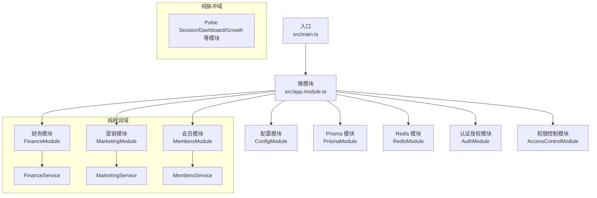
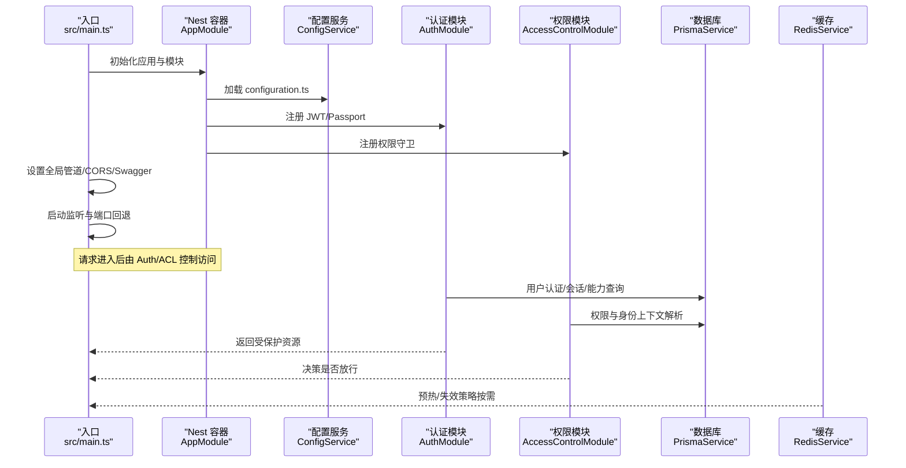
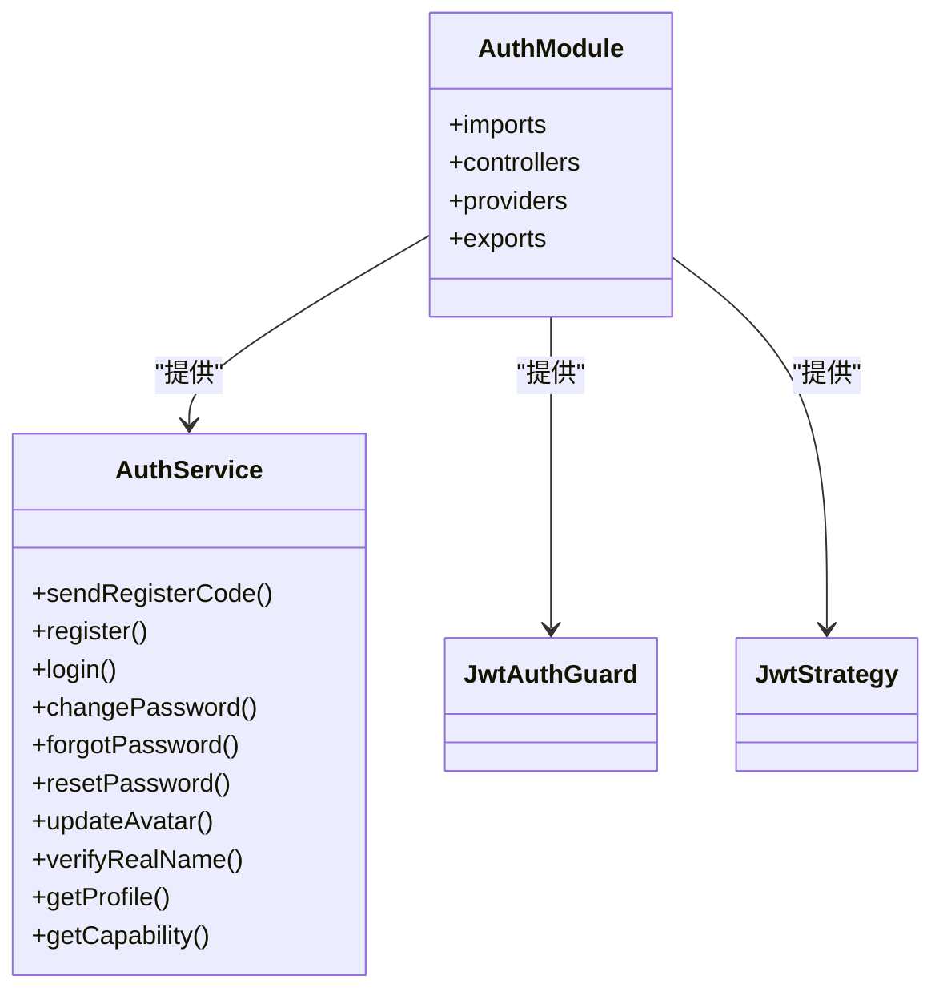
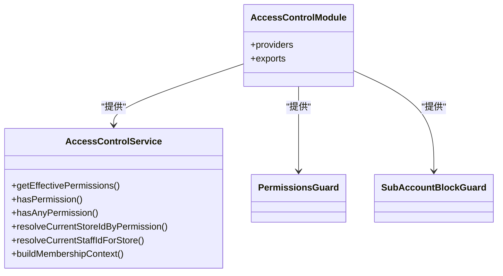
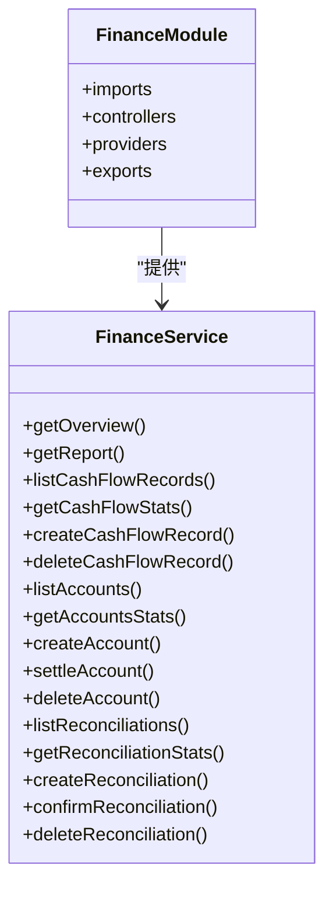
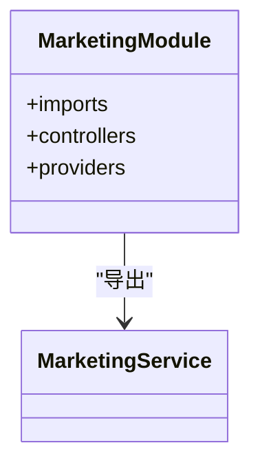
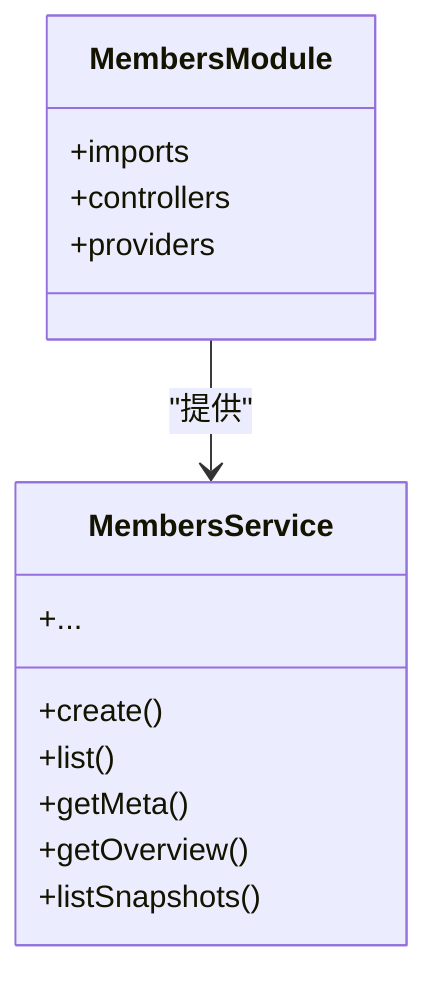
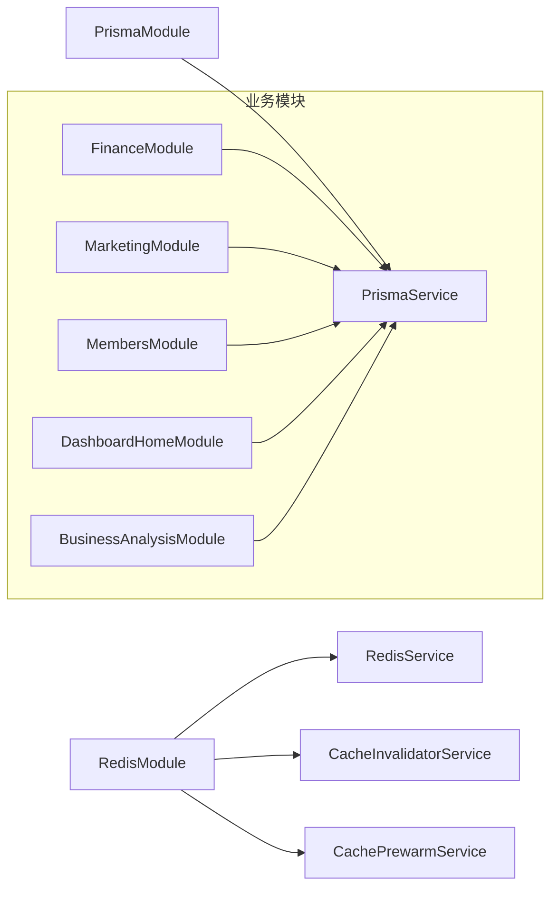
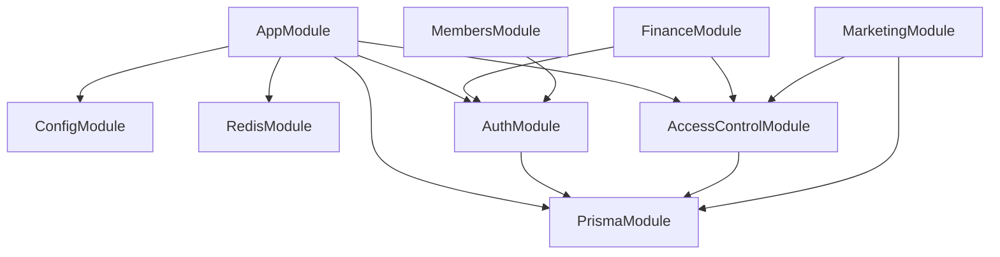

# 系统架构

<cite>
**本文引用的文件**
- [src/main.ts](file://src/main.ts)
- [src/app.module.ts](file://src/app.module.ts)
- [src/config/configuration.ts](file://src/config/configuration.ts)
- [src/prisma/prisma.module.ts](file://src/prisma/prisma.module.ts)
- [src/redis/redis.module.ts](file://src/redis/redis.module.ts)
- [src/purely-profit/auth/auth.module.ts](file://src/purely-profit/auth/auth.module.ts)
- [src/purely-profit/access-control/access-control.module.ts](file://src/purely-profit/access-control/access-control.module.ts)
- [src/purely-profit/finance/finance.module.ts](file://src/purely-profit/finance/finance.module.ts)
- [src/purely-profit/marketing/marketing.module.ts](file://src/purely-profit/marketing/marketing.module.ts)
- [src/purely-profit/member/members/members.module.ts](file://src/purely-profit/member/members/members.module.ts)
- [src/purely-profit/auth/auth.service.ts](file://src/purely-profit/auth/auth.service.ts)
- [src/purely-profit/access-control/access-control.service.ts](file://src/purely-profit/access-control/access-control.service.ts)
- [src/purely-profit/finance/finance.service.ts](file://src/purely-profit/finance/finance.service.ts)
- [src/purely-profit/member/members/members.service.ts](file://src/purely-profit/member/members/members.service.ts)
</cite>

## 目录
1. [引言](#引言)
2. [项目结构](#项目结构)
3. [核心组件](#核心组件)
4. [架构总览](#架构总览)
5. [详细组件分析](#详细组件分析)
6. [依赖分析](#依赖分析)
7. [性能考虑](#性能考虑)
8. [故障排查指南](#故障排查指南)
9. [结论](#结论)

## 引言
本文件面向 purelyprofit-server 项目，系统性阐述基于 NestJS 的模块化架构设计与实现。文档聚焦以下目标：
- 解释应用的整体结构与模块边界
- 说明核心模块的职责分工（认证授权、业务管理、数据访问等）
- 阐述模块间依赖关系与通信机制
- 描述依赖注入容器的工作原理与配置要点
- 给出系统边界、数据流向与集成模式
- 提供架构决策的技术考量与权衡建议

## 项目结构
purelyprofit-server 采用典型的 NestJS 分层与功能域划分方式：
- 入口与引导：通过主进程引导应用，设置全局管道、跨域、Swagger 文档、端口与可观测性钩子
- 根模块：AppModule 聚合所有业务模块与基础设施模块
- 基础设施模块：PrismaModule（数据库访问）、RedisModule（缓存与预热）
- 业务域模块：按垂直功能拆分，如认证授权、权限控制、财务、商品、营销、会员、运营等
- 配置中心：集中读取环境变量并导出运行时配置

图表来源
- [src/main.ts:121-204](file://src/main.ts#L121-L204)
- [src/app.module.ts:39-82](file://src/app.module.ts#L39-L82)

章节来源
- [src/main.ts:1-209](file://src/main.ts#L1-L209)
- [src/app.module.ts:1-83](file://src/app.module.ts#L1-L83)
- [src/config/configuration.ts:8-139](file://src/config/configuration.ts#L8-L139)

## 核心组件
本节从“职责-边界-依赖”三个维度梳理关键组件。

- 应用引导器（Bootstrap）
  - 负责创建 Nest 应用实例、注册全局管道、启用 CORS、挂载 Swagger、设置全局前缀、启动监听端口并处理端口冲突回退
  - 关键点：使用 Fastify 适配器提升性能；通过 ConfigService 动态读取运行参数；内置慢请求观测与日志阈值

- 根模块（AppModule）
  - 聚合所有业务与基础设施模块，作为依赖注入容器的根节点
  - 导入 ConfigModule 并加载 configuration.ts，确保全局可注入配置

- 数据访问层（Prisma）
  - PrismaModule 以 @Global() 形式向全应用暴露 PrismaService，避免重复注入与样板代码
  - 业务模块通过注入 PrismaService 执行数据库操作

- 缓存与预热（Redis）
  - RedisModule 以 @Global() 暴露 RedisService、CacheInvalidatorService、CachePrewarmService
  - 与特定业务模块（如 DashboardHome、BusinessAnalysis、Finance）耦合，用于热点数据预热与失效策略

- 认证授权（AuthModule）
  - 集成 Passport/JWT，提供登录、注册、改密、忘记密码、头像与实名认证、能力查询等能力
  - 通过 JwtAuthGuard 与 JwtStrategy 实现受保护路由与用户上下文解析

- 权限控制（AccessControlModule）
  - 提供权限计算、角色与子账号权限映射、当前门店/员工解析等能力
  - 为各业务模块提供统一的访问控制守卫与工具

- 业务模块示例
  - FinanceModule：财务概览、账户、现金流、对账等
  - MarketingModule：客户、产品、促销、交易、积分等
  - MembersModule：会员增删改查、积分、等级、状态等

章节来源
- [src/main.ts:121-204](file://src/main.ts#L121-L204)
- [src/app.module.ts:39-82](file://src/app.module.ts#L39-L82)
- [src/prisma/prisma.module.ts:1-10](file://src/prisma/prisma.module.ts#L1-L10)
- [src/redis/redis.module.ts:1-16](file://src/redis/redis.module.ts#L1-L16)
- [src/purely-profit/auth/auth.module.ts:1-56](file://src/purely-profit/auth/auth.module.ts#L1-L56)
- [src/purely-profit/access-control/access-control.module.ts:1-23](file://src/purely-profit/access-control/access-control.module.ts#L1-L23)
- [src/purely-profit/finance/finance.module.ts:1-26](file://src/purely-profit/finance/finance.module.ts#L1-L26)
- [src/purely-profit/marketing/marketing.module.ts:1-62](file://src/purely-profit/marketing/marketing.module.ts#L1-L62)
- [src/purely-profit/member/members/members.module.ts:1-22](file://src/purely-profit/member/members/members.module.ts#L1-L22)

## 架构总览
下图展示应用启动到请求处理的关键路径，以及模块间的依赖关系与数据流向。

图表来源
- [src/main.ts:121-204](file://src/main.ts#L121-L204)
- [src/app.module.ts:39-82](file://src/app.module.ts#L39-L82)
- [src/purely-profit/auth/auth.module.ts:21-56](file://src/purely-profit/auth/auth.module.ts#L21-L56)
- [src/purely-profit/access-control/access-control.module.ts:7-22](file://src/purely-profit/access-control/access-control.module.ts#L7-L22)
- [src/prisma/prisma.module.ts:1-10](file://src/prisma/prisma.module.ts#L1-L10)
- [src/redis/redis.module.ts:1-16](file://src/redis/redis.module.ts#L1-L16)

## 详细组件分析

### 认证授权模块（AuthModule）
- 职责
  - 提供登录、注册、改密、忘记密码、头像更新、实名认证、能力查询等能力
  - 通过 JwtAuthGuard 与 JwtStrategy 为受保护路由提供鉴权与用户上下文
- 依赖
  - 依赖 ConfigModule 提供 JWT 秘钥与过期时间
  - 依赖 PlatformMembershipModule（forwardRef）以支持平台会员相关能力
- 交互
  - AuthController 接收请求，AuthService 协调各子服务完成业务流程
  - 认证成功后生成 JWT，后续请求由 JwtAuthGuard 解析并注入用户信息

图表来源
- [src/purely-profit/auth/auth.module.ts:21-56](file://src/purely-profit/auth/auth.module.ts#L21-L56)
- [src/purely-profit/auth/auth.service.ts:29-129](file://src/purely-profit/auth/auth.service.ts#L29-L129)

章节来源
- [src/purely-profit/auth/auth.module.ts:1-56](file://src/purely-profit/auth/auth.module.ts#L1-L56)
- [src/purely-profit/auth/auth.service.ts:1-129](file://src/purely-profit/auth/auth.service.ts#L1-L129)

### 权限控制模块（AccessControlModule）
- 职责
  - 角色与权限映射、子账号权限集、权限校验、当前门店/员工解析
  - 为各业务模块提供统一的访问控制守卫与工具方法
- 依赖
  - 依赖 Prisma 类型与常量定义，结合用户上下文构建有效权限集合
- 交互
  - 在路由守卫中调用权限校验方法，决定是否允许访问目标资源

图表来源
- [src/purely-profit/access-control/access-control.module.ts:7-22](file://src/purely-profit/access-control/access-control.module.ts#L7-L22)
- [src/purely-profit/access-control/access-control.service.ts:122-200](file://src/purely-profit/access-control/access-control.service.ts#L122-L200)

章节来源
- [src/purely-profit/access-control/access-control.module.ts:1-23](file://src/purely-profit/access-control/access-control.module.ts#L1-L23)
- [src/purely-profit/access-control/access-control.service.ts:1-200](file://src/purely-profit/access-control/access-control.service.ts#L1-L200)

### 财务模块（FinanceModule）
- 职责
  - 财务概览、账户、现金流、对账等
- 交互
  - FinanceService 作为门面，聚合多个领域服务，对外暴露统一接口
  - 依赖 AuthModule 与 PlatformMembershipModule 进行访问控制与上下文解析

图表来源
- [src/purely-profit/finance/finance.module.ts:12-25](file://src/purely-profit/finance/finance.module.ts#L12-L25)
- [src/purely-profit/finance/finance.service.ts:42-164](file://src/purely-profit/finance/finance.service.ts#L42-L164)

章节来源
- [src/purely-profit/finance/finance.module.ts:1-26](file://src/purely-profit/finance/finance.module.ts#L1-L26)
- [src/purely-profit/finance/finance.service.ts:1-164](file://src/purely-profit/finance/finance.service.ts#L1-L164)

### 营销模块（MarketingModule）
- 职责
  - 客户、产品、促销、交易、积分等营销相关能力
- 交互
  - 通过 FacadeService 将多子域能力整合，对外提供统一接口
  - 依赖 PrismaModule、AccessControlModule、PlatformMembershipModule

图表来源
- [src/purely-profit/marketing/marketing.module.ts:32-61](file://src/purely-profit/marketing/marketing.module.ts#L32-L61)
- [src/purely-profit/marketing/marketing.service.ts:1-8](file://src/purely-profit/marketing/marketing.service.ts#L1-L8)

章节来源
- [src/purely-profit/marketing/marketing.module.ts:1-62](file://src/purely-profit/marketing/marketing.module.ts#L1-L62)
- [src/purely-profit/marketing/marketing.service.ts:1-8](file://src/purely-profit/marketing/marketing.service.ts#L1-L8)

### 会员模块（MembersModule）
- 职责
  - 会员增删改查、积分、等级、状态、快照、概览等
- 交互
  - MembersService 通过 PrismaService 执行事务性写入，并结合 MembersAccessService 进行权限校验
  - 支持分页、过滤、元数据统计等

图表来源
- [src/purely-profit/member/members/members.module.ts:12-21](file://src/purely-profit/member/members/members.module.ts#L12-L21)
- [src/purely-profit/member/members/members.service.ts:49-200](file://src/purely-profit/member/members/members.service.ts#L49-L200)

章节来源
- [src/purely-profit/member/members/members.module.ts:1-22](file://src/purely-profit/member/members/members.module.ts#L1-L22)
- [src/purely-profit/member/members/members.service.ts:1-200](file://src/purely-profit/member/members/members.service.ts#L1-L200)

### 数据访问与缓存（PrismaModule 与 RedisModule）
- PrismaModule
  - 以 @Global() 暴露 PrismaService，业务模块直接注入使用
- RedisModule
  - 暴露 RedisService、CacheInvalidatorService、CachePrewarmService
  - 与 DashboardHome、BusinessAnalysis、Finance 等模块耦合，用于热点数据预热与失效

图表来源
- [src/prisma/prisma.module.ts:1-10](file://src/prisma/prisma.module.ts#L1-L10)
- [src/redis/redis.module.ts:1-16](file://src/redis/redis.module.ts#L1-L16)

章节来源
- [src/prisma/prisma.module.ts:1-10](file://src/prisma/prisma.module.ts#L1-L10)
- [src/redis/redis.module.ts:1-16](file://src/redis/redis.module.ts#L1-L16)

## 依赖分析
- 模块内聚与解耦
  - AppModule 仅负责聚合，不承载业务逻辑，保持高内聚低耦合
  - AuthModule 与 AccessControlModule 分离职责：鉴权与权限判定
- 外部依赖
  - Fastify 适配器、Swagger、Passport/JWT、Prisma、Redis
- 循环依赖
  - AuthModule 对 PlatformMembershipModule 使用 forwardRef，避免循环导入
- 依赖注入容器
  - 通过 @Global() 与 exports 实现跨模块共享服务，减少重复注入
  - 通过 ConfigModule.forRoot 加载 configuration.ts，集中配置

图表来源
- [src/app.module.ts:39-82](file://src/app.module.ts#L39-L82)
- [src/purely-profit/auth/auth.module.ts:21-36](file://src/purely-profit/auth/auth.module.ts#L21-L36)
- [src/purely-profit/access-control/access-control.module.ts:7-22](file://src/purely-profit/access-control/access-control.module.ts#L7-L22)
- [src/prisma/prisma.module.ts:1-10](file://src/prisma/prisma.module.ts#L1-L10)
- [src/redis/redis.module.ts:1-16](file://src/redis/redis.module.ts#L1-L16)

章节来源
- [src/app.module.ts:1-83](file://src/app.module.ts#L1-L83)
- [src/purely-profit/auth/auth.module.ts:1-56](file://src/purely-profit/auth/auth.module.ts#L1-L56)
- [src/purely-profit/access-control/access-control.module.ts:1-23](file://src/purely-profit/access-control/access-control.module.ts#L1-L23)

## 性能考虑
- Web 服务器与适配器
  - 使用 Fastify 适配器，具备更好的吞吐与更低的内存占用
- 全局管道与安全
  - ValidationPipe 白名单与转换，减少无效参数带来的分支开销
  - CORS 与 Swagger 可按环境开关，降低生产环境额外负担
- 数据库连接池
  - 通过配置中心设置连接池上限与超时，避免连接争用
- 缓存预热与失效
  - RedisModule 提供预热与失效策略，结合业务模块热点数据优化响应时间
- 观测性
  - HTTP 请求耗时记录与慢请求告警，便于定位性能瓶颈

## 故障排查指南
- 启动失败与端口占用
  - 若默认端口被占用，系统会自动尝试下一个端口；可通过配置关闭自动偏移或调整最大偏移
- 认证失败
  - 检查 JWT 秘钥与过期时间配置；确认 JwtAuthGuard 是否正确注入
- 权限拒绝
  - 使用 AccessControlService 的权限校验方法核对用户有效权限集合
- 数据库/缓存异常
  - 查看连接池配置与慢查询阈值；检查 Redis 预热任务状态与日志采样

章节来源
- [src/main.ts:77-119](file://src/main.ts#L77-L119)
- [src/config/configuration.ts:12-97](file://src/config/configuration.ts#L12-L97)

## 结论
purelyprofit-server 采用清晰的模块化架构：以 AppModule 为根，通过 AuthModule 与 AccessControlModule 提供统一的认证与权限控制，PrismaModule 与 RedisModule 提供稳定的数据与缓存支撑，业务模块围绕垂直领域进行拆分。该架构在可维护性、可扩展性与可测试性方面具备良好基础，同时通过配置中心与可观测性手段保障了运行稳定性。建议在后续演进中持续完善领域事件与异步处理，进一步增强系统的弹性与可观测深度。