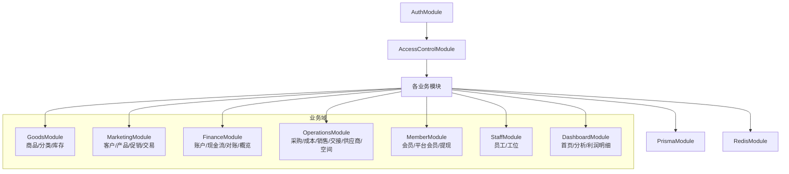
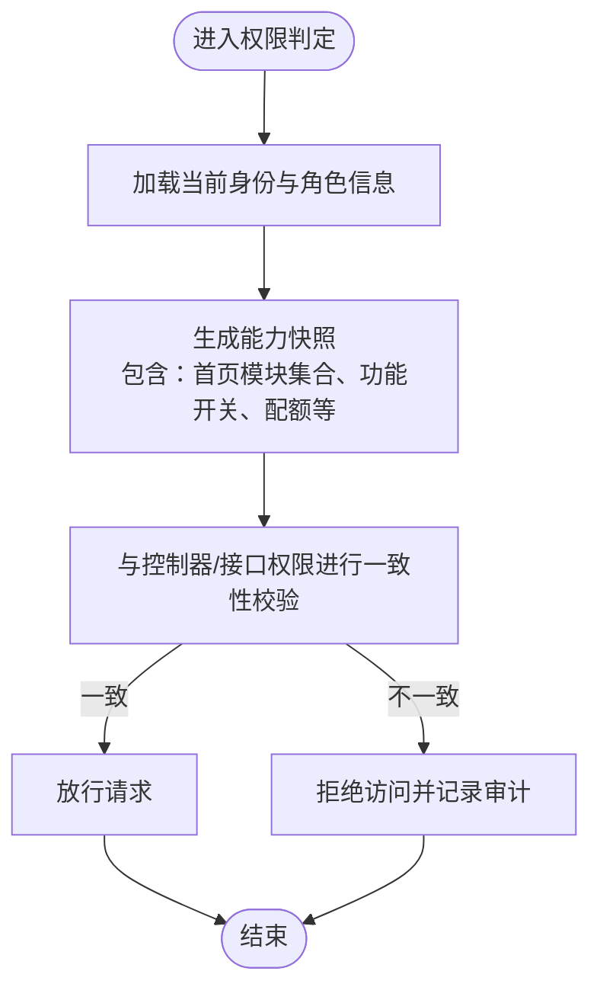
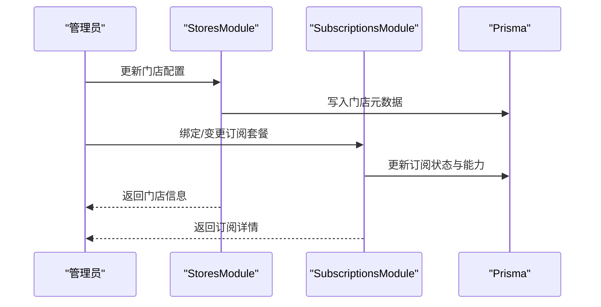
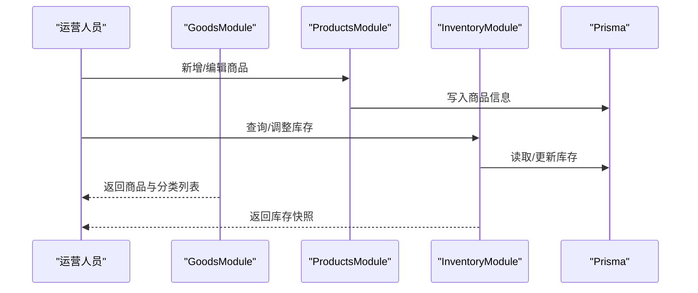
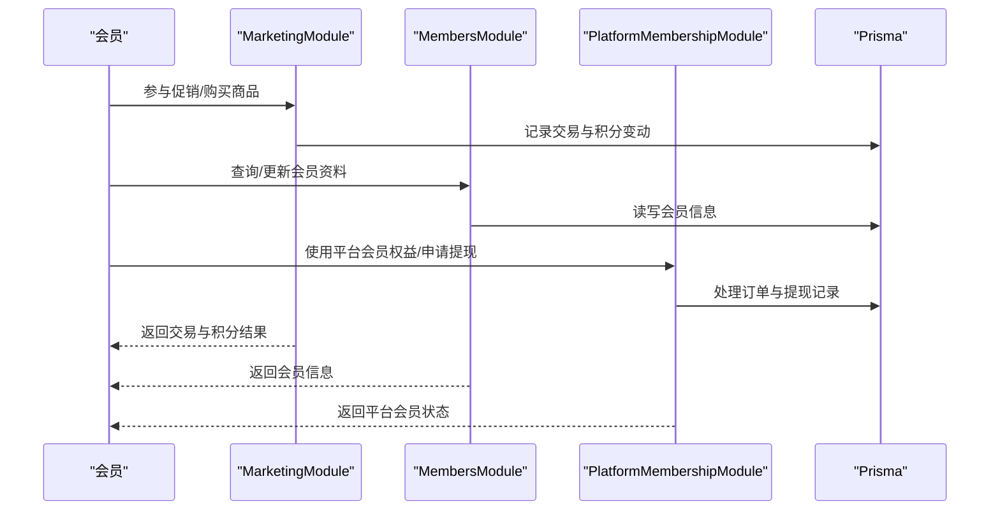
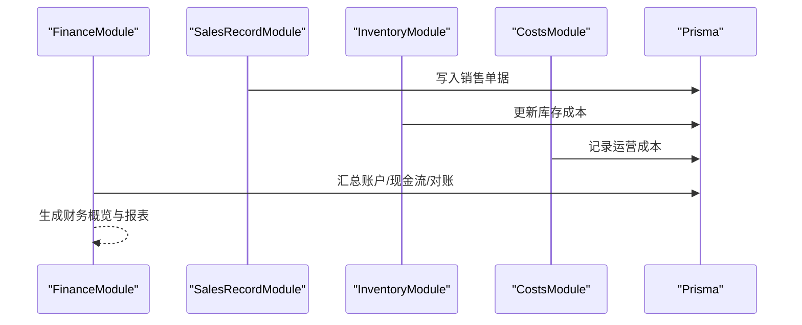
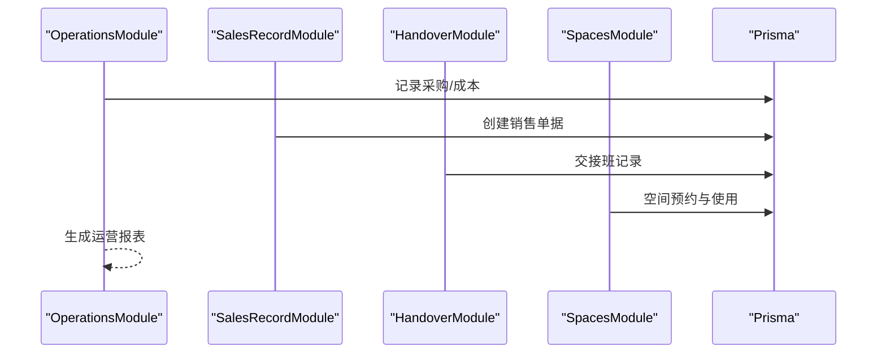
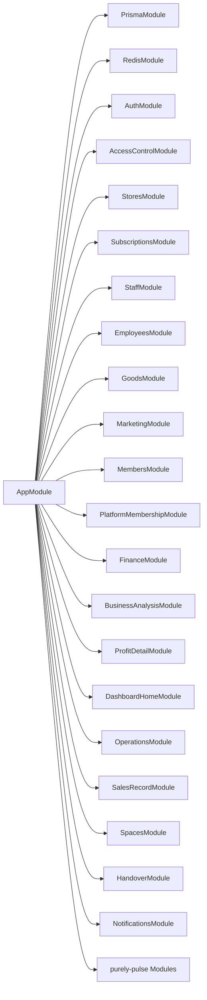

# 项目介绍

<cite>
**本文引用的文件**
- [README.md](file://README.md)
- [package.json](file://package.json)
- [src/app.module.ts](file://src/app.module.ts)
- [prisma/schema.prisma](file://prisma/schema.prisma)
- [src/purely-profit/access-control/subject-capability.service.ts](file://src/purely-profit/access-control/subject-capability.service.ts)
- [src/purely-profit/access-control/access-control-alignment.spec.ts](file://src/purely-profit/access-control/access-control-alignment.spec.ts)
- [src/purely-profit/stores/stores.module.ts](file://src/purely-profit/stores/stores.module.ts)
- [src/purely-profit/member/platform-membership/platform-membership.module.ts](file://src/purely-profit/member/platform-membership/platform-membership.module.ts)
- [src/purely-profit/finance/finance.module.ts](file://src/purely-profit/finance/finance.module.ts)
- [src/purely-profit/goods/products/products.module.ts](file://src/purely-profit/goods/products/products.module.ts)
- [src/purely-profit/marketing/marketing.module.ts](file://src/purely-profit/marketing/marketing.module.ts)
- [src/purely-profit/operations/sales-record/sales-record.module.ts](file://src/purely-profit/operations/sales-record/sales-record.module.ts)
- [src/purely-profit/staff/employees/employees.module.ts](file://src/purely-profit/staff/employees/employees.module.ts)
- [src/purely-profit/auth/auth-profile.service.ts](file://src/purely-profit/auth/auth-profile.service.ts)
</cite>

## 目录
1. [引言](#引言)
2. [项目结构](#项目结构)
3. [核心组件](#核心组件)
4. [架构总览](#架构总览)
5. [详细组件分析](#详细组件分析)
6. [依赖关系分析](#依赖关系分析)
7. [性能考虑](#性能考虑)
8. [故障排查指南](#故障排查指南)
9. [结论](#结论)
10. [附录](#附录)

## 引言
purelyprofit-server 是一个基于 NestJS 的企业级后端服务，面向“多租户、多门店”的商业管理场景，提供从财务、商品、会员、营销到运营的完整商业生态能力。项目通过模块化设计与清晰的领域划分，将复杂的业务流程抽象为可维护、可扩展的服务模块；同时以 Prisma 管理数据库模型与迁移，Redis 提供缓存与预热能力，配合鉴权与权限控制，支撑起从门店日常运营到总部层面的经营分析。

本项目的目标是帮助连锁或集团型门店实现统一的数字化管理：在统一平台下，不同门店拥有独立的运营空间与数据边界，同时又能共享会员、营销与订阅等能力，形成“统一标准、灵活自治”的多门店治理体系。

## 项目结构
项目采用 NestJS 标准的模块化组织方式，并以“领域驱动”思想将业务划分为多个子模块。应用入口由根模块聚合，引入认证、权限、门店、员工、商品、营销、财务、运营、仪表盘、通知、订阅、以及 purely-pulse（平台侧）相关模块。

```mermaid
graph TB
subgraph "应用入口"
APP["AppModule<br/>聚合所有业务模块"]
end
subgraph "基础能力"
AUTH["AuthModule<br/>认证与会话"]
AC["AccessControlModule<br/>权限与能力快照"]
PRISMA["PrismaModule<br/>数据库访问"]
REDIS["RedisModule<br/>缓存与预热"]
end
subgraph "门店与订阅"
STORES["StoresModule<br/>门店读写与配置"]
SUBS["SubscriptionsModule<br/>订阅与套餐"]
end
subgraph "人员与工位"
STAFF["StaffModule<br/>工位管理"]
EMPS["EmployeesModule<br/>员工管理与薪酬"]
end
subgraph "商品与库存"
GOODS["Goods模块族<br/>商品/分类/库存"]
PRODUCTS["ProductsModule"]
CATEGORIES["CategoriesModule"]
INVENTORY["InventoryModule"]
end
subgraph "营销与会员"
MKT["MarketingModule<br/>客户/产品/促销/交易"]
MEMBER["MembersModule<br/>会员读写"]
PM["PlatformMembershipModule<br/>平台会员/子账号/提现"]
end
subgraph "财务与报表"
FIN["FinanceModule<br/>账户/流水/对账/概览"]
BA["BusinessAnalysisModule<br/>经营分析"]
PD["ProfitDetailModule<br/>利润明细"]
DH["DashboardHomeModule<br/>首页看板"]
end
subgraph "运营与空间"
OPS["Operations模块族<br/>采购/成本/销售/交接/供应商"]
SALES["SalesRecordModule<br/>销售单据流"]
SPACES["SpacesModule<br/>空间与预约"]
HANDOVER["HandoverModule<br/>交接班"]
end
subgraph "通知与平台"
NOTI["NotificationsModule<br/>消息通知"]
PULSE["purely-pulse 模块族<br/>会话/成长/会员设置/看板"]
end
APP --> AUTH
APP --> AC
APP --> PRISMA
APP --> REDIS
APP --> STORES
APP --> SUBS
APP --> STAFF
APP --> EMPS
APP --> GOODS
APP --> MKT
APP --> MEMBER
APP --> PM
APP --> FIN
APP --> BA
APP --> PD
APP --> DH
APP --> OPS
APP --> SALES
APP --> SPACES
APP --> HANDOVER
APP --> NOTI
APP --> PULSE
```

**图表来源**
- [src/app.module.ts:39-82](file://src/app.module.ts#L39-L82)

**章节来源**
- [src/app.module.ts:39-82](file://src/app.module.ts#L39-L82)
- [prisma/schema.prisma:1-13](file://prisma/schema.prisma#L1-L13)

## 核心组件
- 认证与会话：提供登录、注册、密码管理、JWT 鉴权、会话与审计上下文等能力，贯穿所有业务模块。
- 权限与能力快照：根据当前身份（主账号/子账号）、角色（收银员/店长/财务）与配额，生成首页模块可见性与功能可用性的快照，确保界面与接口权限一致。
- 门店与订阅：支持多门店注册、配置与状态管理，结合订阅套餐实现能力解锁与限制。
- 商品与库存：覆盖商品、分类与库存管理，支撑销售与成本核算的基础数据。
- 营销与会员：提供客户画像、积分/储值、充值消费、促销活动与交易流水，打通会员生命周期。
- 财务：提供账户、现金流、对账与概览报表，支持与销售、库存、成本联动。
- 运营：包含采购、成本、销售单据流、空间与预约、交接班等运营环节。
- 通知：统一的消息构建、上下文解析与已读状态管理。
- purely-pulse 平台侧：会话、成长、会员设置与看板等平台能力，与门店侧能力互补。

**章节来源**
- [src/purely-profit/access-control/subject-capability.service.ts:10-54](file://src/purely-profit/access-control/subject-capability.service.ts#L10-L54)
- [src/purely-profit/access-control/access-control-alignment.spec.ts:60-125](file://src/purely-profit/access-control/access-control-alignment.spec.ts#L60-L125)
- [src/purely-profit/stores/stores.module.ts:10-20](file://src/purely-profit/stores/stores.module.ts#L10-L20)
- [src/purely-profit/member/platform-membership/platform-membership.module.ts:17-42](file://src/purely-profit/member/platform-membership/platform-membership.module.ts#L17-L42)
- [src/purely-profit/finance/finance.module.ts:12-25](file://src/purely-profit/finance/finance.module.ts#L12-L25)
- [src/purely-profit/goods/products/products.module.ts:8-14](file://src/purely-profit/goods/products/products.module.ts#L8-L14)
- [src/purely-profit/marketing/marketing.module.ts:32-61](file://src/purely-profit/marketing/marketing.module.ts#L32-L61)
- [src/purely-profit/operations/sales-record/sales-record.module.ts:21-43](file://src/purely-profit/operations/sales-record/sales-record.module.ts#L21-L43)
- [src/purely-profit/staff/employees/employees.module.ts:22-43](file://src/purely-profit/staff/employees/employees.module.ts#L22-L43)

## 架构总览
系统采用“模块即领域”的分层设计，核心模块围绕“认证—权限—业务域—平台侧”展开。认证与权限模块为所有业务模块提供统一的鉴权与能力判定；业务域模块内部再细分子模块，如商品域包含商品、分类、库存；营销域包含客户、产品、促销、交易；财务域包含账户、现金流、对账与概览；运营域包含采购、成本、销售、空间与交接班；平台侧 purely-pulse 提供会话、成长、会员设置与看板。

**图表来源**
- [src/app.module.ts:39-82](file://src/app.module.ts#L39-L82)
- [src/purely-profit/goods/products/products.module.ts:8-14](file://src/purely-profit/goods/products/products.module.ts#L8-L14)
- [src/purely-profit/marketing/marketing.module.ts:32-61](file://src/purely-profit/marketing/marketing.module.ts#L32-L61)
- [src/purely-profit/finance/finance.module.ts:12-25](file://src/purely-profit/finance/finance.module.ts#L12-L25)
- [src/purely-profit/operations/sales-record/sales-record.module.ts:21-43](file://src/purely-profit/operations/sales-record/sales-record.module.ts#L21-L43)
- [src/purely-profit/staff/employees/employees.module.ts:22-43](file://src/purely-profit/staff/employees/employees.module.ts#L22-L43)

## 详细组件分析

### 权限与能力快照（多角色、多模块）
该组件负责根据当前身份与角色，计算出可访问的首页模块集合与功能开关，确保前端界面与后端接口权限一致。例如收银员仅允许部分模块，店长可访问更多模块并具备相应查询权限；财务角色则有特定的财务能力与限制。

**图表来源**
- [src/purely-profit/access-control/subject-capability.service.ts:25-38](file://src/purely-profit/access-control/subject-capability.service.ts#L25-L38)
- [src/purely-profit/access-control/access-control-alignment.spec.ts:60-125](file://src/purely-profit/access-control/access-control-alignment.spec.ts#L60-L125)

**章节来源**
- [src/purely-profit/access-control/subject-capability.service.ts:10-54](file://src/purely-profit/access-control/subject-capability.service.ts#L10-L54)
- [src/purely-profit/access-control/access-control-alignment.spec.ts:60-125](file://src/purely-profit/access-control/access-control-alignment.spec.ts#L60-L125)

### 门店与订阅（多门店、多套餐）
门店模块负责门店的读取、写入与配置；订阅模块负责套餐与能力解锁。二者协同，使平台能够按门店规模与订阅等级分配功能与资源。

**图表来源**
- [src/purely-profit/stores/stores.module.ts:10-20](file://src/purely-profit/stores/stores.module.ts#L10-L20)
- [src/purely-profit/member/platform-membership/platform-membership.module.ts:17-42](file://src/purely-profit/member/platform-membership/platform-membership.module.ts#L17-L42)

**章节来源**
- [src/purely-profit/stores/stores.module.ts:10-20](file://src/purely-profit/stores/stores.module.ts#L10-L20)
- [src/purely-profit/member/platform-membership/platform-membership.module.ts:17-42](file://src/purely-profit/member/platform-membership/platform-membership.module.ts#L17-L42)

### 商品与库存（商品、分类、库存）
商品模块提供商品与分类的增删改查与查询；库存模块提供库存盘点与查询。二者共同构成销售与成本核算的数据基础。

**图表来源**
- [src/purely-profit/goods/products/products.module.ts:8-14](file://src/purely-profit/goods/products/products.module.ts#L8-L14)
- [src/purely-profit/operations/sales-record/sales-record.module.ts:21-43](file://src/purely-profit/operations/sales-record/sales-record.module.ts#L21-L43)

**章节来源**
- [src/purely-profit/goods/products/products.module.ts:8-14](file://src/purely-profit/goods/products/products.module.ts#L8-L14)
- [src/purely-profit/operations/sales-record/sales-record.module.ts:21-43](file://src/purely-profit/operations/sales-record/sales-record.module.ts#L21-L43)

### 营销与会员（客户、积分、储值、促销、交易）
营销模块提供客户、产品、促销与交易的全链路能力；会员模块提供会员读写、平台会员与提现。二者结合，形成完整的会员生命周期管理与营销闭环。

**图表来源**
- [src/purely-profit/marketing/marketing.module.ts:32-61](file://src/purely-profit/marketing/marketing.module.ts#L32-L61)
- [src/purely-profit/member/platform-membership/platform-membership.module.ts:17-42](file://src/purely-profit/member/platform-membership/platform-membership.module.ts#L17-L42)

**章节来源**
- [src/purely-profit/marketing/marketing.module.ts:32-61](file://src/purely-profit/marketing/marketing.module.ts#L32-L61)
- [src/purely-profit/member/platform-membership/platform-membership.module.ts:17-42](file://src/purely-profit/member/platform-membership/platform-membership.module.ts#L17-L42)

### 财务（账户、现金流、对账、概览）
财务模块提供账户、现金流、对账与概览报表能力，支持与销售、库存、成本联动，形成统一的财务视图。

**图表来源**
- [src/purely-profit/finance/finance.module.ts:12-25](file://src/purely-profit/finance/finance.module.ts#L12-L25)
- [src/purely-profit/operations/sales-record/sales-record.module.ts:21-43](file://src/purely-profit/operations/sales-record/sales-record.module.ts#L21-L43)

**章节来源**
- [src/purely-profit/finance/finance.module.ts:12-25](file://src/purely-profit/finance/finance.module.ts#L12-L25)
- [src/purely-profit/operations/sales-record/sales-record.module.ts:21-43](file://src/purely-profit/operations/sales-record/sales-record.module.ts#L21-L43)

### 运营（采购、成本、销售、交接、供应商、空间）
运营模块覆盖采购、成本、销售单据流、交接班、供应商与空间管理，支撑门店日常运营的闭环。

**图表来源**
- [src/purely-profit/operations/sales-record/sales-record.module.ts:21-43](file://src/purely-profit/operations/sales-record/sales-record.module.ts#L21-L43)
- [src/purely-profit/staff/employees/employees.module.ts:22-43](file://src/purely-profit/staff/employees/employees.module.ts#L22-L43)

**章节来源**
- [src/purely-profit/operations/sales-record/sales-record.module.ts:21-43](file://src/purely-profit/operations/sales-record/sales-record.module.ts#L21-L43)
- [src/purely-profit/staff/employees/employees.module.ts:22-43](file://src/purely-profit/staff/employees/employees.module.ts#L22-L43)

## 依赖关系分析
- 模块耦合：根模块集中引入所有业务模块，体现“高内聚、低耦合”的设计；各业务模块之间通过服务与 DTO 进行交互，避免直接耦合。
- 数据访问：PrismaModule 作为统一数据访问层，所有业务模块通过 PrismaService 访问数据库，保证数据一致性与迁移管理。
- 缓存与预热：RedisModule 提供缓存与预热能力，减少热点查询压力，提升响应速度。
- 平台与门店：purely-pulse 模块与门店模块并列存在，分别服务于平台侧与门店侧，职责清晰。

**图表来源**
- [src/app.module.ts:39-82](file://src/app.module.ts#L39-L82)

**章节来源**
- [src/app.module.ts:39-82](file://src/app.module.ts#L39-L82)

## 性能考虑
- 缓存预热：通过 RedisModule 与缓存预热服务，提前加载高频查询数据，降低冷启动与突发流量对数据库的压力。
- 分页与索引：财务、商品、营销等模块广泛使用分页与索引工具，优化大数据量下的查询性能。
- 事务与一致性：Prisma 的事务与外键约束保障跨模块操作的一致性，避免脏数据。
- 模块化与懒加载：按需引入模块，减少启动时内存占用；服务间通过接口契约解耦，便于横向扩展。

[本节为通用性能建议，无需具体文件引用]

## 故障排查指南
- 权限不一致：若发现界面模块与接口权限不一致，应检查权限快照生成逻辑与控制器装饰器是否匹配，参考子账号与角色的权限映射测试用例。
- 门店/订阅异常：核对门店配置与订阅状态是否正确写入数据库，确认订阅模块与门店模块的交互是否正常。
- 销售/库存不平：检查销售单据创建流程与库存更新是否在同一事务中完成，关注库存回写与成本结转的时序。
- 财务报表异常：核对账户、现金流与对账数据是否与销售、库存、成本模块联动更新，必要时重算或对账。

**章节来源**
- [src/purely-profit/access-control/access-control-alignment.spec.ts:60-125](file://src/purely-profit/access-control/access-control-alignment.spec.ts#L60-L125)
- [src/purely-profit/stores/stores.module.ts:10-20](file://src/purely-profit/stores/stores.module.ts#L10-L20)
- [src/purely-profit/operations/sales-record/sales-record.module.ts:21-43](file://src/purely-profit/operations/sales-record/sales-record.module.ts#L21-L43)
- [src/purely-profit/finance/finance.module.ts:12-25](file://src/purely-profit/finance/finance.module.ts#L12-L25)

## 结论
purelyprofit-server 以模块化与领域驱动为核心，构建了覆盖多租户、多门店的完整商业生态：从认证与权限控制，到门店与订阅管理，再到商品、营销、财务与运营的全链路能力，最终通过仪表盘与平台侧能力实现统一治理与数据分析。其优势在于：
- 清晰的角色与能力边界，确保界面与接口权限一致；
- 完整的财务、商品、会员、营销与运营闭环；
- 基于 Prisma 的强类型数据模型与迁移管理；
- 借助 Redis 的缓存与预热，提升性能与稳定性。

这些特性使其适用于需要统一标准、灵活自治的连锁或集团型门店管理场景。

[本节为总结性内容，无需具体文件引用]

## 附录
- 快速开始与开发指南可参考根目录的 README 与 package.json 中的脚本命令。
- 数据库与迁移：使用 Prisma 管理 PostgreSQL 数据源，迁移文件位于 prisma/migrations 与 prisma/purely-profit 下的领域模型文件。

**章节来源**
- [README.md:24-99](file://README.md#L24-L99)
- [package.json:8-30](file://package.json#L8-L30)
- [prisma/schema.prisma:1-13](file://prisma/schema.prisma#L1-L13)