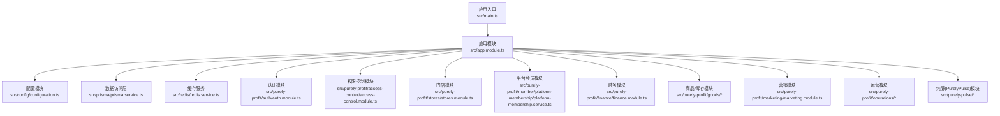
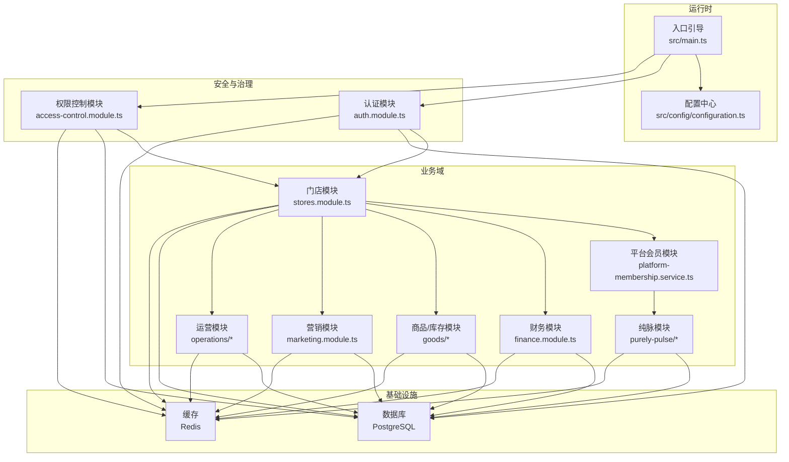
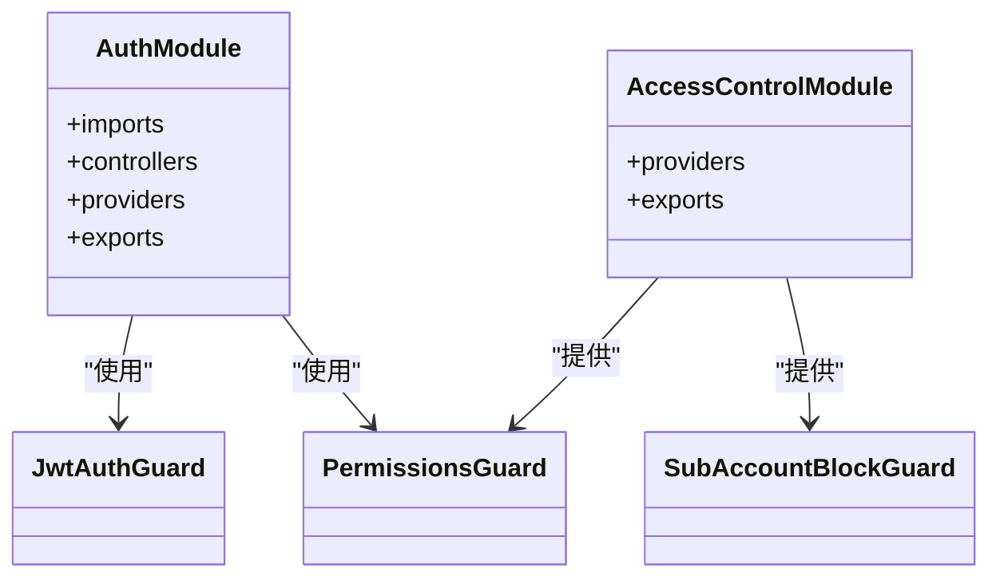
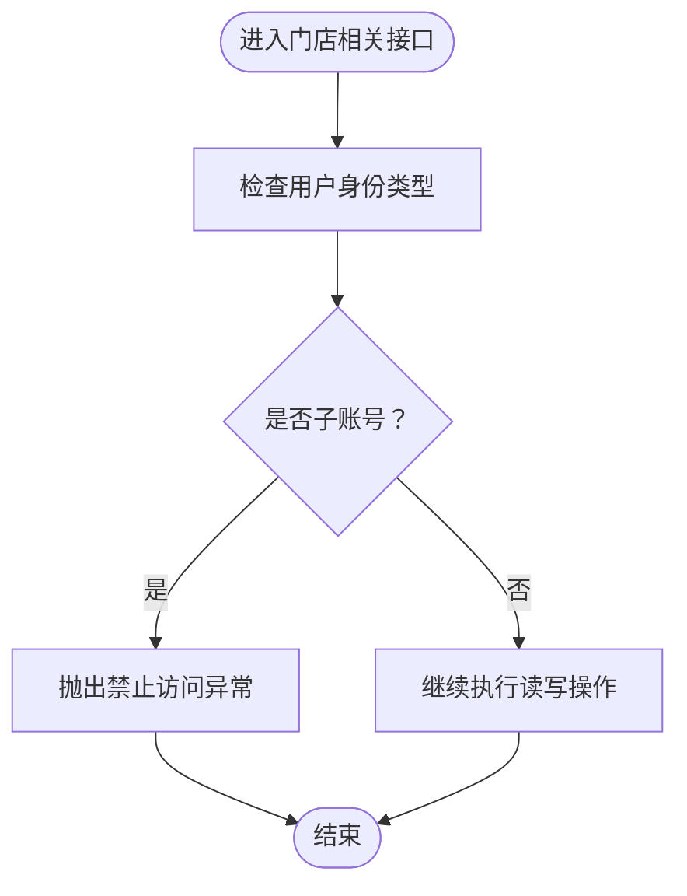
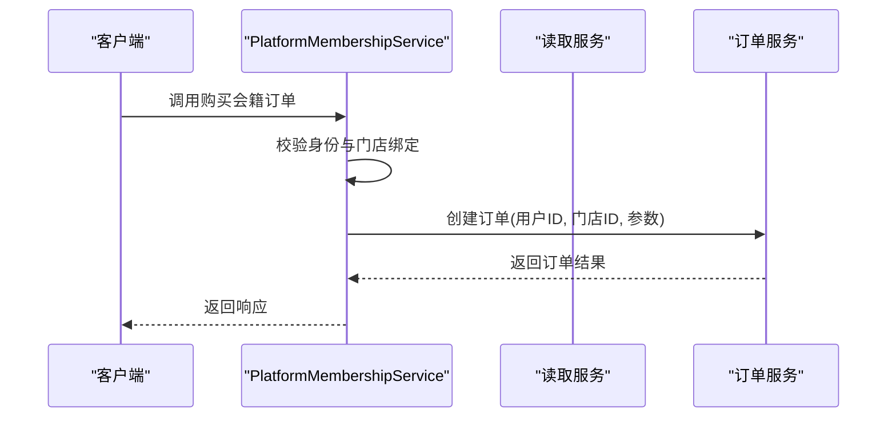
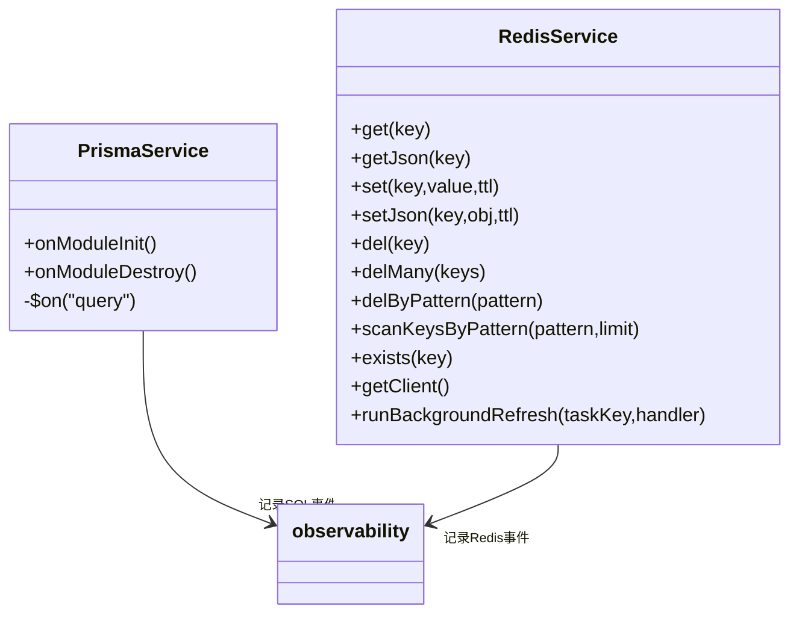
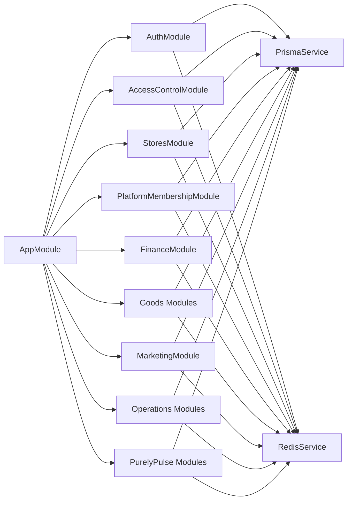

# 项目概述

<cite>
**本文档引用的文件**
- [README.md](file://README.md)
- [package.json](file://package.json)
- [src/main.ts](file://src/main.ts)
- [src/app.module.ts](file://src/app.module.ts)
- [src/config/configuration.ts](file://src/config/configuration.ts)
- [src/prisma/prisma.service.ts](file://src/prisma/prisma.service.ts)
- [src/redis/redis.service.ts](file://src/redis/redis.service.ts)
- [src/purely-profit/auth/auth.module.ts](file://src/purely-profit/auth/auth.module.ts)
- [src/purely-profit/access-control/access-control.module.ts](file://src/purely-profit/access-control/access-control.module.ts)
- [src/purely-profit/stores/stores.module.ts](file://src/purely-profit/stores/stores.module.ts)
- [src/purely-profit/stores/stores.service.ts](file://src/purely-profit/stores/stores.service.ts)
- [src/purely-profit/member/platform-membership/platform-membership.service.ts](file://src/purely-profit/member/platform-membership/platform-membership.service.ts)
- [prisma/schema.prisma](file://prisma/schema.prisma)
</cite>

## 目录
1. [引言](#引言)
2. [项目结构](#项目结构)
3. [核心组件](#核心组件)
4. [架构总览](#架构总览)
5. [详细组件分析](#详细组件分析)
6. [依赖关系分析](#依赖关系分析)
7. [性能考量](#性能考量)
8. [故障排查指南](#故障排查指南)
9. [结论](#结论)
10. [附录](#附录)

## 引言
purelyprofit-server 是一个基于 NestJS 的企业级后端服务，面向多租户、多门店的商业管理场景，覆盖财务、商品、会员、营销、运营等完整的商业生态系统。项目通过模块化设计与清晰的领域划分，实现高内聚、低耦合的系统架构；结合 Prisma 数据访问层、Redis 缓存与可观测性记录，支撑高性能与可维护性的业务需求。

本项目旨在为连锁门店、平台合作伙伴与内部员工提供统一的认证授权、门店管理、会员与营销、商品库存、财务对账、运营分析与空间预约等能力，满足从单店到多店、从基础收银到复杂会员生态的演进需求。

章节来源
- [README.md:24-99](file://README.md#L24-L99)

## 项目结构
项目采用 NestJS 标准目录结构，并以“领域”维度进行模块化组织。核心入口在应用模块中聚合所有业务模块，数据库与缓存通过独立模块注入，配置集中于配置模块，便于环境差异化管理。

- 应用入口与引导
  - 入口文件负责创建 Nest 应用实例、注册全局管道与 CORS、初始化 Swagger 文档、端口回退策略与慢请求观测。
- 配置模块
  - 通过 ConfigModule 加载环境变量并导出统一配置对象，涵盖应用、数据库、Redis、JWT、鉴权等参数。
- 数据与缓存
  - Prisma 模块提供 PostgreSQL 客户端与连接池配置，Redis 模块提供键值缓存与慢操作观测。
- 业务模块
  - 以 purely-profit 与 purely-pulse 两大域划分：前者聚焦企业侧的门店、会员、商品、财务、运营与营销；后者聚焦平台侧的会籍、增长与看板等能力。

图表来源
- [src/main.ts:121-208](file://src/main.ts#L121-L208)
- [src/app.module.ts:39-82](file://src/app.module.ts#L39-L82)
- [src/config/configuration.ts:8-139](file://src/config/configuration.ts#L8-L139)
- [src/prisma/prisma.service.ts:8-64](file://src/prisma/prisma.service.ts#L8-L64)
- [src/redis/redis.service.ts:8-167](file://src/redis/redis.service.ts#L8-L167)
- [src/purely-profit/auth/auth.module.ts:21-55](file://src/purely-profit/auth/auth.module.ts#L21-L55)
- [src/purely-profit/access-control/access-control.module.ts:7-22](file://src/purely-profit/access-control/access-control.module.ts#L7-L22)
- [src/purely-profit/stores/stores.module.ts:10-20](file://src/purely-profit/stores/stores.module.ts#L10-L20)
- [src/purely-profit/member/platform-membership/platform-membership.service.ts:32-279](file://src/purely-profit/member/platform-membership/platform-membership.service.ts#L32-L279)

章节来源
- [src/app.module.ts:1-83](file://src/app.module.ts#L1-L83)
- [src/main.ts:121-208](file://src/main.ts#L121-L208)
- [src/config/configuration.ts:8-139](file://src/config/configuration.ts#L8-L139)

## 核心组件
- 应用引导与运行时配置
  - 全局验证管道、CORS、Swagger 文档、端口回退策略与慢请求观测，确保开发体验与生产稳定性。
- 认证与授权
  - 基于 JWT 的认证流程与策略，配合权限守卫与子账号拦截，保障多门店下的访问边界。
- 数据访问与缓存
  - 基于 Prisma 的 PostgreSQL 客户端与连接池，Redis 提供键值缓存与慢操作观测，支持后台刷新与批量清理。
- 业务域模块
  - 门店管理、平台会员、财务、商品/库存、营销、运营（采购、销售、成本、交接、空间）等模块协同工作，形成闭环。

章节来源
- [src/main.ts:146-179](file://src/main.ts#L146-L179)
- [src/purely-profit/auth/auth.module.ts:21-55](file://src/purely-profit/auth/auth.module.ts#L21-L55)
- [src/purely-profit/access-control/access-control.module.ts:7-22](file://src/purely-profit/access-control/access-control.module.ts#L7-L22)
- [src/prisma/prisma.service.ts:13-54](file://src/prisma/prisma.service.ts#L13-L54)
- [src/redis/redis.service.ts:15-167](file://src/redis/redis.service.ts#L15-L167)

## 架构总览
系统采用“入口引导 → 配置中心 → 数据/缓存 → 业务域”的分层架构。认证与权限控制贯穿所有业务模块；门店作为多租户的最小单位，承载会员、商品、财务、运营等子域；平台侧模块提供会籍、增长与看板能力，与企业侧模块解耦但共享认证与权限体系。

图表来源
- [src/main.ts:121-208](file://src/main.ts#L121-L208)
- [src/app.module.ts:39-82](file://src/app.module.ts#L39-L82)
- [src/purely-profit/auth/auth.module.ts:21-55](file://src/purely-profit/auth/auth.module.ts#L21-L55)
- [src/purely-profit/access-control/access-control.module.ts:7-22](file://src/purely-profit/access-control/access-control.module.ts#L7-L22)
- [src/purely-profit/stores/stores.module.ts:10-20](file://src/purely-profit/stores/stores.module.ts#L10-L20)
- [src/purely-profit/member/platform-membership/platform-membership.service.ts:32-279](file://src/purely-profit/member/platform-membership/platform-membership.service.ts#L32-L279)

## 详细组件分析

### 认证与授权模块
- 功能要点
  - 基于 Passport/JWT 的登录、令牌签发与校验；支持短信验证码、密码重置等能力；提供权限守卫与子账号拦截，确保多门店访问边界。
- 关键点
  - JWT 策略与守卫在认证模块中注册，导出以供其他模块复用。
  - 权限控制模块提供全局守卫与拦截器，统一处理能力矩阵与子账号限制。

图表来源
- [src/purely-profit/auth/auth.module.ts:21-55](file://src/purely-profit/auth/auth.module.ts#L21-L55)
- [src/purely-profit/access-control/access-control.module.ts:7-22](file://src/purely-profit/access-control/access-control.module.ts#L7-L22)

章节来源
- [src/purely-profit/auth/auth.module.ts:21-55](file://src/purely-profit/auth/auth.module.ts#L21-L55)
- [src/purely-profit/access-control/access-control.module.ts:7-22](file://src/purely-profit/access-control/access-control.module.ts#L7-L22)

### 门店与多租户
- 功能要点
  - 门店创建、读取、更新与当前门店绑定；子账号仅允许主账号访问门店设置，避免越权。
- 设计要点
  - 服务层在关键操作前进行身份类型校验，确保多租户隔离。

图表来源
- [src/purely-profit/stores/stores.service.ts:41-46](file://src/purely-profit/stores/stores.service.ts#L41-L46)

章节来源
- [src/purely-profit/stores/stores.module.ts:10-20](file://src/purely-profit/stores/stores.module.ts#L10-L20)
- [src/purely-profit/stores/stores.service.ts:1-47](file://src/purely-profit/stores/stores.service.ts#L1-L47)

### 平台会员与多门店绑定
- 功能要点
  - 平台会员计划查询、订单购买、积分/豆明细查询、合伙人申请与审核等；所有操作均要求当前用户绑定门店，子账号不可访问。
- 设计要点
  - 在每个公开接口前校验当前门店 ID，若未绑定则拒绝访问。

图表来源
- [src/purely-profit/member/platform-membership/platform-membership.service.ts:97-108](file://src/purely-profit/member/platform-membership/platform-membership.service.ts#L97-L108)

章节来源
- [src/purely-profit/member/platform-membership/platform-membership.service.ts:32-279](file://src/purely-profit/member/platform-membership/platform-membership.service.ts#L32-L279)

### 数据访问与缓存
- 数据库
  - 使用 Prisma 客户端与 PostgreSQL 连接池，开启慢查询日志与阈值配置，支持可观测性记录。
- 缓存
  - Redis 提供键值存储、JSON 序列化、扫描与批量删除、后台刷新任务等能力；对慢操作进行观测与告警。

图表来源
- [src/prisma/prisma.service.ts:8-64](file://src/prisma/prisma.service.ts#L8-L64)
- [src/redis/redis.service.ts:8-167](file://src/redis/redis.service.ts#L8-L167)

章节来源
- [src/prisma/prisma.service.ts:13-54](file://src/prisma/prisma.service.ts#L13-L54)
- [src/redis/redis.service.ts:15-167](file://src/redis/redis.service.ts#L15-L167)

### 配置与部署
- 配置项
  - 应用层：CORS、Swagger、HTTP 超时/保活/体限制、端口自动偏移、慢请求阈值、分页大小、缓存预热策略等。
  - 数据库层：连接池大小、空闲超时、连接超时。
  - 缓存层：主机、端口、密码、DB 索引。
  - 安全层：JWT 密钥与过期时间。
- 部署建议
  - 生产环境建议关闭 Swagger，启用慢查询与慢 Redis 日志，合理设置连接池与缓存预热参数。

章节来源
- [src/config/configuration.ts:8-139](file://src/config/configuration.ts#L8-L139)
- [README.md:60-85](file://README.md#L60-L85)

## 依赖关系分析
- 模块耦合
  - AppModule 作为根模块聚合所有业务模块，认证与权限控制模块对所有业务模块开放；门店模块与平台会员模块存在跨域协作（如订单与积分）。
- 外部依赖
  - Fastify 适配器、Prisma/PostgreSQL、ioredis、Passport/JWT、Swagger 等。
- 数据模型
  - Prisma Schema 明确数据源为 PostgreSQL，并将业务模型按领域拆分至 purely-profit 子目录，便于演进与维护。

图表来源
- [src/app.module.ts:39-82](file://src/app.module.ts#L39-L82)
- [src/purely-profit/auth/auth.module.ts:21-55](file://src/purely-profit/auth/auth.module.ts#L21-L55)
- [src/purely-profit/access-control/access-control.module.ts:7-22](file://src/purely-profit/access-control/access-control.module.ts#L7-L22)
- [src/purely-profit/stores/stores.module.ts:10-20](file://src/purely-profit/stores/stores.module.ts#L10-L20)
- [src/purely-profit/member/platform-membership/platform-membership.service.ts:32-279](file://src/purely-profit/member/platform-membership/platform-membership.service.ts#L32-L279)

章节来源
- [src/app.module.ts:1-83](file://src/app.module.ts#L1-L83)
- [prisma/schema.prisma:1-13](file://prisma/schema.prisma#L1-L13)

## 性能考量
- HTTP 层
  - Fastify 适配器提升吞吐；全局验证管道保证输入一致性；慢请求观测与阈值可调。
- 数据库层
  - 连接池参数可调，慢查询阈值与日志开关可控；建议在高峰期监控慢查询并优化索引。
- 缓存层
  - 支持后台刷新与批量清理；慢 Redis 观测与阈值可调；合理设置 TTL 与预热策略。
- 部署建议
  - 生产环境启用慢查询与慢 Redis 日志，结合指标与告警完善可观测性；根据流量压测调整连接池与缓存并发参数。

章节来源
- [src/main.ts:121-208](file://src/main.ts#L121-L208)
- [src/prisma/prisma.service.ts:27-54](file://src/prisma/prisma.service.ts#L27-L54)
- [src/redis/redis.service.ts:15-167](file://src/redis/redis.service.ts#L15-L167)
- [src/config/configuration.ts:39-86](file://src/config/configuration.ts#L39-L86)

## 故障排查指南
- 启动失败与端口占用
  - 若默认端口被占用，系统将自动尝试偏移端口；可通过配置禁用自动偏移或调整最大偏移量。
- 慢请求与慢查询
  - 开启慢请求与慢查询日志，定位耗时环节；结合 Swagger 文档核对请求路径与参数。
- 缓存异常
  - 检查 Redis 主机、端口、密码与 DB 索引；利用扫描与批量删除功能清理异常键；关注后台刷新任务错误日志。
- 权限问题
  - 子账号不可访问门店设置与平台会员中心；确认当前用户绑定门店与身份类型。

章节来源
- [src/main.ts:87-119](file://src/main.ts#L87-L119)
- [src/main.ts:32-75](file://src/main.ts#L32-L75)
- [src/redis/redis.service.ts:125-139](file://src/redis/redis.service.ts#L125-L139)
- [src/purely-profit/stores/stores.service.ts:41-46](file://src/purely-profit/stores/stores.service.ts#L41-L46)
- [src/purely-profit/member/platform-membership/platform-membership.service.ts:262-277](file://src/purely-profit/member/platform-membership/platform-membership.service.ts#L262-L277)

## 结论
purelyprofit-server 以 NestJS 为核心，围绕多租户、多门店的商业管理需求构建了覆盖财务、商品、会员、营销、运营的完整能力体系。通过模块化设计、统一认证授权、可观测性与缓存策略，项目在可扩展性与稳定性之间取得平衡。建议在生产环境中强化监控与容量规划，持续优化慢查询与缓存命中率，以支撑业务的规模化发展。

## 附录
- 快速开始
  - 安装依赖、编译与运行、测试与覆盖率、端到端测试、部署与资源链接见项目自述文件。
- 包管理脚本
  - 包含 Prisma 迁移、影子库重置、差异迁移与测试脚本，便于本地与 CI 场景使用。

章节来源
- [README.md:28-85](file://README.md#L28-L85)
- [package.json:8-30](file://package.json#L8-L30)